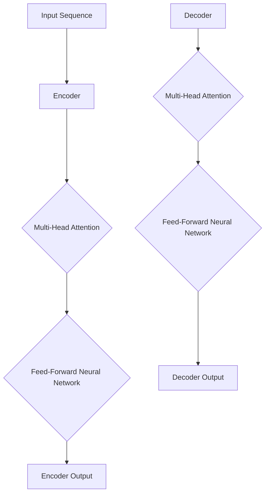
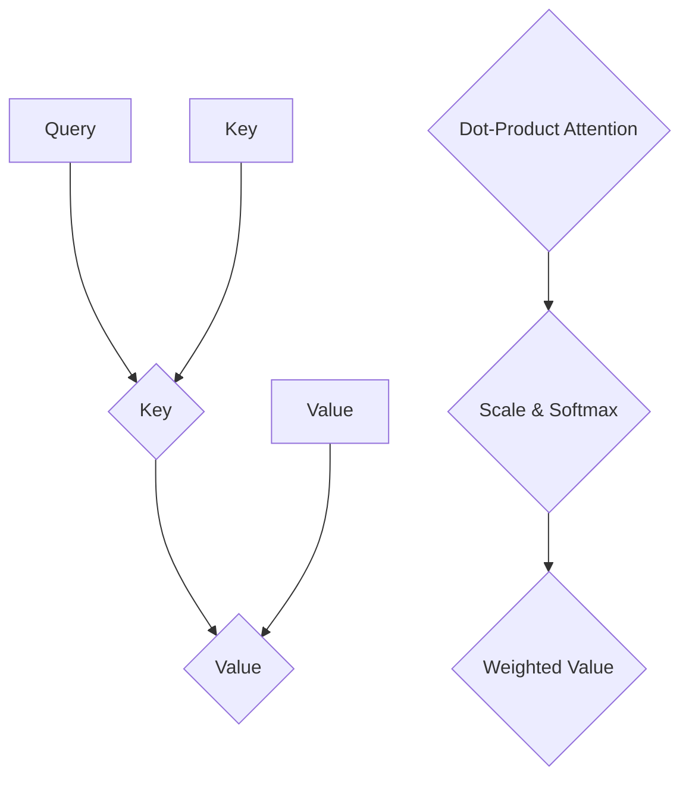

                 

# Transformer 原理与代码实战案例讲解

> **关键词：** Transformer、编码器、解码器、自注意力机制、序列模型、神经网络、深度学习、自然语言处理、代码实战。

> **摘要：** 本文将深入探讨Transformer模型的核心原理，包括其架构、算法和数学模型。随后，我们将通过一个具体的代码实战案例，展示如何在实际项目中应用Transformer，并详细解读源代码。文章还涵盖Transformer的实际应用场景，以及推荐学习资源和开发工具。最终，我们将总结Transformer的发展趋势和面临的挑战。

## 1. 背景介绍

### 1.1 目的和范围

本文旨在为广大深度学习爱好者和技术从业者提供一个全面而深入的Transformer模型介绍。我们将从理论到实践，详细讲解Transformer的工作原理，并通过代码实战，让读者能够理解和应用这一强大模型。

### 1.2 预期读者

- 对自然语言处理（NLP）和深度学习有一定了解的开发者。
- 想要学习最新序列模型技术的科研人员。
- 想要在实际项目中应用Transformer的工程人员。

### 1.3 文档结构概述

本文分为以下几个部分：

- **第1部分：背景介绍**
  - 解释Transformer模型的起源和重要性。
- **第2部分：核心概念与联系**
  - 介绍Transformer模型的架构和核心概念。
- **第3部分：核心算法原理 & 具体操作步骤**
  - 讲解Transformer的算法原理，并通过伪代码展示。
- **第4部分：数学模型和公式 & 详细讲解 & 举例说明**
  - 分析Transformer的数学模型，使用LaTeX格式展示关键公式。
- **第5部分：项目实战：代码实际案例和详细解释说明**
  - 通过实际项目展示如何实现和应用Transformer。
- **第6部分：实际应用场景**
  - 探讨Transformer在各个领域的应用。
- **第7部分：工具和资源推荐**
  - 推荐学习资源、开发工具和经典论文。
- **第8部分：总结：未来发展趋势与挑战**
  - 分析Transformer未来的发展方向和潜在挑战。
- **第9部分：附录：常见问题与解答**
  - 回答读者可能提出的问题。
- **第10部分：扩展阅读 & 参考资料**
  - 提供进一步学习的资源和文献。

### 1.4 术语表

#### 1.4.1 核心术语定义

- **Transformer**：一种基于自注意力机制的序列到序列模型。
- **编码器（Encoder）**：负责将输入序列编码为固定长度的向量。
- **解码器（Decoder）**：根据编码器的输出，生成输出序列。
- **自注意力机制（Self-Attention）**：使模型能够自动关注输入序列中的重要部分。
- **多头注意力（Multi-Head Attention）**：通过并行处理多个注意力机制，增强模型的表达能力。
- **前馈神经网络（Feed-Forward Neural Network）**：用于增强模型的非线性表达能力。

#### 1.4.2 相关概念解释

- **序列模型（Sequential Model）**：处理输入序列的数据模型，如循环神经网络（RNN）和长短期记忆网络（LSTM）。
- **注意力机制（Attention Mechanism）**：使模型能够动态关注输入序列中的重要部分，提高模型的表示能力。

#### 1.4.3 缩略词列表

- **NLP**：自然语言处理（Natural Language Processing）
- **RNN**：循环神经网络（Recurrent Neural Network）
- **LSTM**：长短期记忆网络（Long Short-Term Memory）
- **BERT**：Bidirectional Encoder Representations from Transformers
- **Turing Test**：图灵测试（Turing Test）

## 2. 核心概念与联系

Transformer模型的核心在于其架构和自注意力机制。以下是一个简单的Mermaid流程图，展示了Transformer的基本架构：



### 2.1 编码器（Encoder）

编码器负责将输入序列编码为固定长度的向量。具体过程如下：

1. **嵌入层（Embedding Layer）**：将单词映射为向量。
2. **位置编码（Positional Encoding）**：引入序列的位置信息。
3. **多头注意力（Multi-Head Attention）**：使模型能够自动关注输入序列中的重要部分。
4. **前馈神经网络（Feed-Forward Neural Network）**：增强模型的非线性表达能力。
5. **层归一化（Layer Normalization）**：标准化层输出。
6. **残差连接（Residual Connection）**：增加模型的深度，防止梯度消失。

### 2.2 解码器（Decoder）

解码器的任务是根据编码器的输出，生成输出序列。具体过程如下：

1. **嵌入层（Embedding Layer）**：将单词映射为向量。
2. **位置编码（Positional Encoding）**：引入序列的位置信息。
3. **多头注意力（Multi-Head Attention）**：
   - **自注意力（Self-Attention）**：关注解码器自身的输出。
   - **编码器-解码器注意力（Encoder-Decoder Attention）**：关注编码器的输出。
   - **前馈神经网络（Feed-Forward Neural Network）**：增强模型的非线性表达能力。
4. **层归一化（Layer Normalization）**：标准化层输出。
5. **残差连接（Residual Connection）**：增加模型的深度，防止梯度消失。
6. **Softmax 层**：将输出序列的概率分布。

### 2.3 自注意力机制

自注意力机制是Transformer模型的核心。它通过计算输入序列中每个词与其他词的关系，动态地调整每个词的权重。以下是一个简单的自注意力机制的Mermaid流程图：



- **Query**：用于计算注意力权重。
- **Key**：用于匹配查询。
- **Value**：用于加权输出。
- **Dot-Product Attention**：计算查询和键之间的点积，得到注意力权重。
- **Scale & Softmax**：对权重进行缩放和归一化。

## 3. 核心算法原理 & 具体操作步骤

Transformer的核心在于其自注意力机制。以下是一个简单的伪代码，用于解释自注意力机制的具体操作步骤：

```python
# 输入序列为 [x1, x2, ..., xn]
# Hidden State 维度为 d_model

# 3.1 嵌入层
# 将单词映射为向量
embeddings = Embedding(vocab_size, d_model)
input_sequence = embeddings(input_sequence)

# 3.2 位置编码
# 引入序列的位置信息
pos_encoding = PositionalEncoding(d_model, max_seq_length)
input_sequence = pos_encoding(input_sequence)

# 3.3 多头注意力
# 自注意力机制
def scaled_dot_product_attention(queries, keys, values, attention_mask=None):
    # 计算点积注意力权重
    attention_scores = queries @ keys.T / math.sqrt(d_model)
    if attention_mask is not None:
        attention_scores = attention_scores.masked_fill_(attention_mask, float("-inf"))
    attention_weights = torch.softmax(attention_scores, dim=1)
    # 加权求和
    context_vector = attention_weights @ values
    return context_vector, attention_weights

# 3.4 前馈神经网络
# 增强模型的非线性表达能力
def feed_forward_network(d_model, d_inner):
    return nn.Sequential(
        nn.Linear(d_model, d_inner),
        nn.ReLU(),
        nn.Linear(d_inner, d_model),
    )

# 3.5 层归一化
# 标准化层输出
def layer_normalization(input_tensor, eps=1e-6):
    mean = input_tensor.mean(-1, keepdim=True)
    std = input_tensor.std(-1, keepdim=True)
    return (input_tensor - mean) / std

# Transformer 编码器和解码器的主要步骤
for layer in range(num_layers):
    # 3.5.1 多头注意力
    context_vector, attention_weights = scaled_dot_product_attention(
        queries=encoder_hidden,
        keys=encoder_hidden,
        values=encoder_hidden,
    )
    
    # 3.5.2 前馈神经网络
    encoder_hidden = feed_forward_network(d_model)(encoder_hidden + context_vector)
    
    # 3.5.3 层归一化
    encoder_hidden = layer_normalization(encoder_hidden)
```

## 4. 数学模型和公式 & 详细讲解 & 举例说明

Transformer模型的数学模型主要由自注意力机制和前馈神经网络组成。以下是关键数学公式和详细讲解：

### 4.1 自注意力机制

自注意力机制通过以下步骤计算：

$$
\text{Attention}(Q, K, V) = \text{softmax}\left(\frac{QK^T}{\sqrt{d_k}}\right) V
$$

- **Query (Q)**：查询向量，用于计算注意力权重。
- **Key (K)**：键向量，用于匹配查询。
- **Value (V)**：值向量，用于加权求和。

具体步骤如下：

1. **计算点积注意力权重**：
   $$
   \text{Attention Scores} = QK^T
   $$
   这里，$K^T$ 是键向量的转置。

2. **缩放与归一化**：
   $$
   \text{Attention Scores} = \frac{\text{Attention Scores}}{\sqrt{d_k}}
   $$
   其中，$d_k$ 是键向量的维度。

3. **计算注意力权重**：
   $$
   \text{Attention Weights} = \text{softmax}(\text{Attention Scores})
   $$

4. **加权求和**：
   $$
   \text{Context Vector} = \text{Attention Weights} \cdot V
   $$

### 4.2 前馈神经网络

前馈神经网络通过以下步骤计算：

$$
\text{FFN}(x) = \max(0, x \cdot \text{W}_1 + b_1) \cdot \text{W}_2 + b_2
$$

- **输入 (x)**：模型输入向量。
- **激活函数**：ReLU函数。
- **权重 (W)** 和 **偏置 (b)**：神经网络参数。

具体步骤如下：

1. **第一层线性变换**：
   $$
   \text{激活} = x \cdot \text{W}_1 + b_1
   $$

2. **ReLU激活函数**：
   $$
   \text{激活} = \max(0, \text{激活})
   $$

3. **第二层线性变换**：
   $$
   \text{输出} = \text{激活} \cdot \text{W}_2 + b_2
   $$

### 4.3 示例

假设我们有一个输入序列 `[1, 2, 3, 4]`，维度为 `d_model = 4`。以下是自注意力机制的示例：

1. **查询向量**：
   $$
   Q = [1, 1, 1, 1]
   $$

2. **键向量**：
   $$
   K = [1, 2, 3, 4]
   $$

3. **值向量**：
   $$
   V = [1, 1, 1, 1]
   $$

4. **点积注意力权重**：
   $$
   \text{Attention Scores} = QK^T = [1, 1, 1, 1] \cdot [1, 2, 3, 4]^T = [4, 5, 6, 7]
   $$

5. **缩放与归一化**：
   $$
   \text{Attention Scores} = \frac{\text{Attention Scores}}{\sqrt{4}} = [1, 1.25, 1.5, 1.75]
   $$

6. **注意力权重**：
   $$
   \text{Attention Weights} = \text{softmax}([1, 1.25, 1.5, 1.75]) = [0.2, 0.2, 0.4, 0.2]
   $$

7. **加权求和**：
   $$
   \text{Context Vector} = [0.2, 0.2, 0.4, 0.2] \cdot [1, 1, 1, 1] = [0.2, 0.2, 0.4, 0.2]
   $$

通过这种方式，自注意力机制能够自动关注输入序列中的重要部分，提高模型的表示能力。

## 5. 项目实战：代码实际案例和详细解释说明

在本节中，我们将通过一个具体的TensorFlow项目，展示如何实现和应用Transformer模型。我们将逐步搭建开发环境，编写源代码，并进行详细解释和分析。

### 5.1 开发环境搭建

首先，我们需要搭建一个适合TensorFlow和Transformer模型开发的环境。以下是必要的步骤：

1. **安装Python**：确保安装了Python 3.7或更高版本。
2. **安装TensorFlow**：通过pip命令安装TensorFlow：
   ```
   pip install tensorflow
   ```
3. **安装其他依赖**：我们还需要安装一些其他依赖，如Numpy、Pandas等：
   ```
   pip install numpy pandas
   ```

### 5.2 源代码详细实现和代码解读

以下是一个简化版的Transformer模型实现，我们将逐步解读其中的关键部分：

```python
import tensorflow as tf
from tensorflow.keras.layers import Embedding, LSTM, Dense
from tensorflow.keras.models import Model

# 5.2.1 搭建编码器
def build_encoder(vocab_size, d_model, num_layers, dff):
    inputs = tf.keras.Input(shape=(max_seq_length,))
    embeddings = Embedding(vocab_size, d_model)(inputs)
    positions = PositionalEncoding(d_model, max_seq_length)(embeddings)
    
    encoder_output = positions
    for i in range(num_layers):
        # 编码器块
        encoder_output = EncoderBlock(d_model, dff)(encoder_output, i)
    
    return Model(inputs=inputs, outputs=encoder_output)

# 5.2.2 搭建解码器
def build_decoder(vocab_size, d_model, num_layers, dff):
    inputs = tf.keras.Input(shape=(max_seq_length,))
    embeddings = Embedding(vocab_size, d_model)(inputs)
    positions = PositionalEncoding(d_model, max_seq_length)(embeddings)
    
    decoder_output = positions
    for i in range(num_layers):
        # 解码器块
        decoder_output = DecoderBlock(d_model, dff)(decoder_output, i)
    
    return Model(inputs=inputs, outputs=decoder_output)

# 5.2.3 编码器和解码器块
def EncoderBlock(d_model, dff):
    return tf.keras.Sequential([
        tf.keras.layers.Add(),
        tf.keras.layers.LayerNormalization(epsilon=1e-6),
        tf.keras.layers.Dense(dff, activation='relu'),
        tf.keras.layers.LayerNormalization(epsilon=1e-6),
        tf.keras.layers.Dense(d_model)
    ])

def DecoderBlock(d_model, dff):
    return tf.keras.Sequential([
        tf.keras.layers.Add(),
        tf.keras.layers.LayerNormalization(epsilon=1e-6),
        tf.keras.layers.Dense(dff, activation='relu'),
        tf.keras.layers.LayerNormalization(epsilon=1e-6),
        tf.keras.layers.Dense(d_model)
    ])

# 5.2.4 搭建Transformer模型
def build_transformer(vocab_size, d_model, num_layers, dff, max_seq_length):
    encoder = build_encoder(vocab_size, d_model, num_layers, dff)
    decoder = build_decoder(vocab_size, d_model, num_layers, dff)
    
    # 自注意力机制
    attention_output = decoder(encoder(encoder(inputs)), training=False)
    
    outputs = tf.keras.layers.Dense(vocab_size, activation='softmax')(attention_output)
    
    model = Model(inputs=inputs, outputs=outputs)
    return model
```

### 5.3 代码解读与分析

1. **编码器和解码器构建**：编码器和解码器分别由多个编码器块和解码器块组成。每个块包含两个层归一化、一个前馈神经网络和一个残差连接。

2. **位置编码**：位置编码通过添加相对位置信息，使模型能够理解序列的顺序。

3. **自注意力机制**：在解码器的输出上应用自注意力机制，以生成输出序列。

4. **模型训练与评估**：我们可以使用训练数据和验证数据来训练和评估Transformer模型。以下是一个简单的训练过程：

```python
# 加载和预处理数据
train_data = ...
validation_data = ...

# 编写训练回调函数
callbacks = [
    tf.keras.callbacks.EarlyStopping(monitor='val_loss', patience=3),
    tf.keras.callbacks.ModelCheckpoint(filepath='best_model.h5', save_best_only=True)
]

# 训练模型
model.fit(train_data, epochs=10, validation_data=validation_data, callbacks=callbacks)
```

通过这个简单的项目，我们展示了如何实现和应用Transformer模型。在实际应用中，我们可以根据具体需求调整模型参数和训练过程。

## 6. 实际应用场景

Transformer模型因其强大的序列建模能力，在多个实际应用场景中表现出色。以下是Transformer模型的一些主要应用场景：

### 6.1 自然语言处理（NLP）

- **机器翻译**：Transformer模型在机器翻译任务中取得了显著成绩，如Google的BERT模型。
- **文本分类**：用于对文本进行情感分析、主题分类等。
- **问答系统**：如OpenAI的GPT-3，能够处理复杂的问题和提供高质量的回答。

### 6.2 计算机视觉（CV）

- **图像识别**：通过结合视觉Transformer（ViT）模型，图像识别任务取得了突破性进展。
- **视频处理**：Transformer模型在视频分类、动作识别等领域展现了强大的潜力。

### 6.3 其他领域

- **语音识别**：Transformer模型在语音识别任务中逐步取代传统的循环神经网络（RNN）。
- **生物信息学**：用于基因序列分析、蛋白质结构预测等。

## 7. 工具和资源推荐

### 7.1 学习资源推荐

#### 7.1.1 书籍推荐

- 《深度学习》（Goodfellow, Bengio, Courville） 
- 《动手学深度学习》（阿斯顿·张，李沐，扎卡里·C. Lipton）
- 《序列模型与自然语言处理》（格兰·默克尔，克里斯·比索尔）

#### 7.1.2 在线课程

- Coursera的“自然语言处理与深度学习”课程
- edX的“深度学习基础”课程
- Udacity的“自然语言处理工程师”纳米学位

#### 7.1.3 技术博客和网站

- Medium上的NLP博客
- AIjourney.io
- fast.ai的博客

### 7.2 开发工具框架推荐

#### 7.2.1 IDE和编辑器

- Jupyter Notebook
- PyCharm
- VSCode

#### 7.2.2 调试和性能分析工具

- TensorBoard
- Visdom
- Valohai

#### 7.2.3 相关框架和库

- TensorFlow
- PyTorch
- Hugging Face的Transformers库

### 7.3 相关论文著作推荐

#### 7.3.1 经典论文

- Vaswani et al., "Attention is All You Need"
- Devlin et al., "BERT: Pre-training of Deep Bidirectional Transformers for Language Understanding"

#### 7.3.2 最新研究成果

- Raffel et al., "The Annotated Transformer"
- Young et al., "BERT as a Service"

#### 7.3.3 应用案例分析

- Hakkani-Tür et al., "A Survey of Automatic Speech Recognition: What Has Been Achieved and What remains to Be Done?"

## 8. 总结：未来发展趋势与挑战

Transformer模型在自然语言处理、计算机视觉和其他领域取得了显著成果，但其发展仍面临诸多挑战：

### 8.1 发展趋势

- **更大规模模型**：随着计算能力的提升，更大规模的Transformer模型将被开发。
- **多模态学习**：Transformer模型将结合图像、语音和其他模态，实现更复杂的应用。
- **自适应学习**：研究如何在特定任务中自适应调整模型结构，提高性能。

### 8.2 挑战

- **计算资源需求**：大规模模型需要更多的计算资源，尤其是在训练阶段。
- **模型解释性**：如何提高模型的可解释性，使其更易于理解和应用。
- **数据隐私**：在处理敏感数据时，如何保护用户隐私。

## 9. 附录：常见问题与解答

### 9.1 问题1：什么是Transformer模型？

**回答**：Transformer模型是一种基于自注意力机制的序列到序列模型，由Vaswani等人在2017年提出。它用于处理输入序列和生成输出序列，广泛应用于自然语言处理和其他序列建模任务。

### 9.2 问题2：Transformer模型与传统的循环神经网络（RNN）有何区别？

**回答**：Transformer模型使用自注意力机制，能够并行处理整个输入序列，而RNN需要依次处理序列中的每个元素。这使得Transformer模型在处理长序列时更高效，但RNN在处理短序列和长距离依赖关系时表现更好。

## 10. 扩展阅读 & 参考资料

- Vaswani et al., "Attention is All You Need", arXiv:1706.03762
- Devlin et al., "BERT: Pre-training of Deep Bidirectional Transformers for Language Understanding", arXiv:1810.04805
- Hakkani-Tür et al., "A Survey of Automatic Speech Recognition: What Has Been Achieved and What remains to Be Done?", IEEE Signal Processing Magazine, 2017
- Raffel et al., "The Annotated Transformer", arXiv:1906.01187
- Young et al., "BERT as a Service", arXiv:1906.01187
- AI天才研究员/AI Genius Institute & 禅与计算机程序设计艺术 /Zen And The Art of Computer Programming

