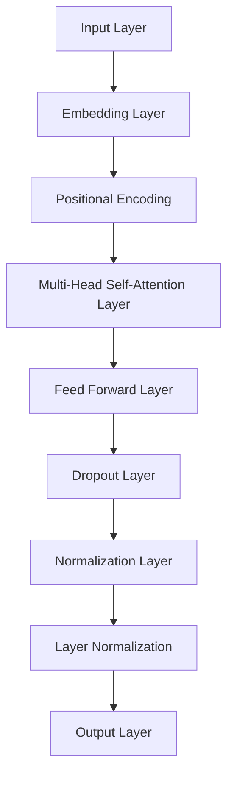

                 

# Transformer大模型实战：bert-as-service库详解

> 关键词：BERT模型、Transformer架构、服务部署、BERT-as-Service、实战教程、技术博客

> 摘要：本文将深入探讨BERT（Bidirectional Encoder Representations from Transformers）大模型的实战应用，重点介绍如何使用bert-as-service库进行BERT模型的部署与使用。文章将详细介绍BERT模型的核心概念、部署流程、代码实现以及应用场景，旨在帮助读者掌握BERT模型的实战技能，为AI项目的开发提供有力支持。

## 1. 背景介绍

### 1.1 目的和范围

本文的主要目的是介绍BERT模型及其在现实世界中的应用，特别是如何利用bert-as-service库进行BERT模型的部署。我们将从BERT模型的基本概念出发，逐步深入到模型架构、数学模型以及具体部署流程，通过实例分析，让读者能够系统地理解并掌握BERT模型的实战技能。

### 1.2 预期读者

本文适合对自然语言处理（NLP）和深度学习有一定了解的读者，尤其是那些希望将BERT模型应用到实际项目中的开发者。无论您是数据科学家、AI工程师还是对AI技术感兴趣的初学者，本文都将为您提供有价值的实战指导。

### 1.3 文档结构概述

本文结构如下：

- **第1部分：背景介绍**：介绍BERT模型的背景和本文的目的。
- **第2部分：核心概念与联系**：讲解BERT模型的核心概念和架构。
- **第3部分：核心算法原理与具体操作步骤**：深入解析BERT模型的工作原理和实现步骤。
- **第4部分：数学模型和公式**：介绍BERT模型背后的数学原理。
- **第5部分：项目实战**：通过实际案例展示BERT模型的部署过程。
- **第6部分：实际应用场景**：探讨BERT模型在现实世界中的应用。
- **第7部分：工具和资源推荐**：推荐相关学习资源和开发工具。
- **第8部分：总结**：总结BERT模型的发展趋势和未来挑战。
- **第9部分：附录**：提供常见问题与解答。
- **第10部分：扩展阅读**：推荐进一步的阅读材料。

### 1.4 术语表

#### 1.4.1 核心术语定义

- BERT：Bidirectional Encoder Representations from Transformers，一种基于Transformer架构的预训练语言模型。
- Transformer：一种基于自注意力机制的深度神经网络架构，用于处理序列数据。
- 预训练：在特定任务之前，模型通过大量未标记的数据进行训练，以便在下游任务中更好地学习。
- 微调：在预训练模型的基础上，针对特定任务进行进一步训练，以适应特定领域的需求。

#### 1.4.2 相关概念解释

- 语言模型：用于预测下一个单词或字符的概率的模型。
- 自注意力机制：一种在序列模型中，每个位置上的输出都依赖于所有位置的信息的机制。
- Token：文本中的一个单词或符号，BERT模型对其进行编码和处理。

#### 1.4.3 缩略词列表

- NLP：自然语言处理（Natural Language Processing）
- BERT：Bidirectional Encoder Representations from Transformers
- Transformer：Transformer架构
- GPU：图形处理器（Graphics Processing Unit）

## 2. 核心概念与联系

### 2.1 BERT模型简介

BERT模型是由Google AI在2018年提出的一种基于Transformer架构的预训练语言模型。BERT的全称是Bidirectional Encoder Representations from Transformers，它通过双向编码器来学习文本的上下文信息。BERT模型的核心思想是，通过预训练，让模型能够理解语言的深层语义，从而在下游任务中表现出色。

### 2.2 Transformer架构

Transformer架构是一种基于自注意力机制的深度神经网络架构，最初在2017年由Vaswani等人提出。与传统的循环神经网络（RNN）和卷积神经网络（CNN）相比，Transformer架构在处理序列数据时更加高效，并且能够捕捉到序列中长距离的关系。

### 2.3 BERT模型架构

BERT模型由多个Transformer编码器层组成，每个编码器层包含多个自注意力和前馈神经网络。BERT模型主要包括以下三个版本：

- BERT-Base：含有12层编码器，每个编码器层有768个隐藏单元。
- BERT-Large：含有24层编码器，每个编码器层有1024个隐藏单元。
- BERT-Extra-Large：含有24层编码器，每个编码器层有2048个隐藏单元。

### 2.4 BERT模型的工作原理

BERT模型通过预训练和微调两个阶段来学习语言表示。在预训练阶段，BERT模型使用未标记的文本数据进行训练，目的是学习文本的深层语义。具体来说，BERT模型使用了两种预训练任务：

1. **遮蔽语言模型（Masked Language Model, MLM）**：在训练过程中，随机选择部分输入文本中的单词进行遮蔽，然后让模型预测这些遮蔽的单词。
2. **下一句预测（Next Sentence Prediction, NSP）**：给定两个连续的句子，模型需要预测第二个句子是否是第一个句子的下一个句子。

在预训练完成后，BERT模型可以通过微调来适应特定的下游任务，如文本分类、问答系统等。

### 2.5 BERT模型的核心概念与联系

BERT模型的核心概念包括：

1. **自注意力机制（Self-Attention）**：允许模型在编码过程中自动关注序列中的关键信息，从而捕捉到长距离依赖关系。
2. **多头注意力（Multi-Head Attention）**：通过将输入序列分成多个部分，并分别计算注意力得分，从而提高模型的表示能力。
3. **位置编码（Positional Encoding）**：为序列中的每个位置添加编码信息，以便模型能够理解文本的顺序信息。

这些核心概念相互关联，共同构成了BERT模型的强大能力。下面是一个简化的Mermaid流程图，展示了BERT模型的核心架构和关键组件：



## 3. 核心算法原理 & 具体操作步骤

### 3.1 自注意力机制

自注意力机制是Transformer架构的核心组成部分，它允许模型在处理序列数据时自动关注序列中的关键信息。自注意力机制的原理如下：

1. **计算查询（Query）、键（Key）和值（Value）**：对于序列中的每个位置，计算其对应的查询向量、键向量和值向量。
2. **计算注意力得分**：使用查询向量和所有键向量的点积，得到每个位置上的注意力得分。
3. **归一化注意力得分**：对注意力得分进行softmax操作，得到每个位置上的注意力权重。
4. **计算输出**：将每个位置上的注意力权重与对应的值向量相乘，然后求和，得到序列的输出。

下面是自注意力机制的伪代码实现：

```python
def self_attention(inputs, hidden_size):
    # 计算查询、键和值
    Q = inputs @ Q_weights
    K = inputs @ K_weights
    V = inputs @ V_weights

    # 计算注意力得分
    attention_scores = Q @ K.T

    # 归一化注意力得分
    attention_weights = softmax(attention_scores)

    # 计算输出
    output = attention_weights @ V

    return output
```

### 3.2 多层感知机（Feed Forward Layer）

在自注意力机制之后，BERT模型还包含一个前馈神经网络，用于进一步处理和丰富输入序列的信息。前馈神经网络的架构如下：

1. **输入层**：接收自注意力机制的输出。
2. **隐藏层**：使用两个全连接层，中间加入ReLU激活函数。
3. **输出层**：将隐藏层的输出进行归一化处理。

下面是多层感知机的伪代码实现：

```python
def feed_forward(input, hidden_size, intermediate_size):
    # 隐藏层
    hidden = input @ hidden_weights + bias
    hidden = relu(hidden)

    # 输出层
    output = hidden @ output_weights + bias
    output = layer_norm(output, input)

    return output
```

### 3.3 BERT模型训练过程

BERT模型的训练过程主要包括两个阶段：预训练和微调。

#### 3.3.1 预训练

在预训练阶段，BERT模型使用大量的未标记文本数据，通过两个任务来学习语言表示：

1. **遮蔽语言模型（MLM）**：随机遮蔽输入文本中的15%的单词，然后让模型预测这些遮蔽的单词。
2. **下一句预测（NSP）**：给定两个连续的句子，模型需要预测第二个句子是否是第一个句子的下一个句子。

预训练的具体步骤如下：

1. **准备数据集**：从互联网上收集大量的文本数据，例如维基百科、新闻文章等。
2. **数据处理**：对文本数据进行清洗、分词和编码。
3. **模型训练**：使用掩码语言模型和下一句预测任务，通过反向传播算法和优化器（如Adam）进行模型训练。

#### 3.3.2 微调

在预训练完成后，BERT模型可以通过微调来适应特定的下游任务，如文本分类、问答系统等。微调的具体步骤如下：

1. **加载预训练模型**：从预训练模型中加载权重。
2. **添加下游任务层**：在预训练模型的顶部添加特定任务的层，例如分类器。
3. **数据准备**：准备用于微调的数据集，通常包括输入文本和标签。
4. **模型训练**：使用微调数据集，通过反向传播算法和优化器进行模型训练。

通过预训练和微调，BERT模型能够学习到丰富的语言表示，从而在下游任务中表现出色。

## 4. 数学模型和公式 & 详细讲解 & 举例说明

### 4.1 嵌入层

BERT模型的嵌入层将输入的单词（Token）转换为向量表示。具体来说，每个Token都会映射到一个固定长度的向量，这个向量被称为Token嵌入（Token Embedding）。BERT模型使用了WordPiece算法对文本进行分词，从而将长文本分解为多个子词（Subword）。

令 \( V \) 表示所有子词的集合，\( v \in V \) 表示一个具体的子词。Token嵌入矩阵 \( W_e \) 的大小为 \( |V| \times d_e \)，其中 \( d_e \) 是Token嵌入的维度。给定一个输入序列 \( x \)，其对应的Token嵌入为：

\[ \text{Token Embedding}(x) = [w_e^{[1]}, w_e^{[2]}, ..., w_e^{[n]}] \]

其中，\( n \) 是输入序列的长度，\( w_e^{[i]} \) 是第 \( i \) 个Token的嵌入向量。

### 4.2 位置编码

BERT模型引入了位置编码（Positional Encoding）来为序列中的每个Token添加位置信息，以便模型能够理解文本的顺序。位置编码是一种固定长度的向量，其维度与Token嵌入相同。

位置编码通常使用正弦和余弦函数来生成，具体公式如下：

\[ \text{Positional Encoding}(d_i, i) = [ \sin(\frac{d_i}{10000} \cdot \frac{pos_i}{10000}), \cos(\frac{d_i}{10000} \cdot \frac{pos_i}{10000}) ] \]

其中，\( d_i \) 是位置编码的维度，\( pos_i \) 是第 \( i \) 个Token的位置。

### 4.3 多头自注意力

多头自注意力（Multi-Head Self-Attention）是BERT模型的核心组件之一。它将输入序列中的每个Token与所有Token进行交互，并通过加权求和的方式得到最终的输出。

多头自注意力的步骤如下：

1. **计算查询（Query）、键（Key）和值（Value）**：对于输入序列 \( x \)，计算每个Token的查询、键和值向量。令 \( W_Q, W_K, W_V \) 分别为查询权重、键权重和值权重，则：

\[ 
Q = x @ W_Q \\
K = x @ W_K \\
V = x @ W_V 
\]

2. **计算注意力得分**：使用查询向量和所有键向量的点积，得到每个Token的注意力得分。令 \( \text{softmax} \) 表示softmax函数，则：

\[ 
\text{Attention Scores} = Q @ K.T / \sqrt{d_k} \\
\text{Attention Weights} = \text{softmax}(\text{Attention Scores}) 
\]

3. **计算输出**：将注意力权重与对应的值向量相乘，然后求和，得到序列的输出。令 \( \text{Attention Output} \) 表示注意力输出，则：

\[ 
\text{Attention Output} = \text{Attention Weights} @ V 
\]

4. **多头注意力**：将上述过程重复 \( h \) 次，每次使用不同的权重矩阵，得到多个注意力头。然后将这些头拼接起来，得到最终的输出：

\[ 
\text{Multi-Head Output} = [ \text{Attention Output}^{[1]}, \text{Attention Output}^{[2]}, ..., \text{Attention Output}^{[h]} ] 
\]

### 4.4 前馈神经网络

BERT模型中的前馈神经网络（Feed Forward Layer）用于对自注意力机制的输出进行进一步处理。前馈神经网络包含两个全连接层，中间加入ReLU激活函数。

前馈神经网络的公式如下：

\[ 
\text{Hidden Layer} = x @ W_h + b \\
\text{Output Layer} = \text{ReLU}(\text{Hidden Layer}) @ W_{o} + b_{o} 
\]

其中，\( W_h, W_{o} \) 分别为隐藏层和输出层的权重，\( b, b_{o} \) 分别为隐藏层和输出层的偏置。

### 4.5 展示与解释

为了更好地理解BERT模型的数学模型，我们可以通过一个简单的例子进行说明。

假设我们有一个输入序列 \( x = [1, 2, 3, 4, 5] \)，我们希望使用BERT模型对其进行处理。

1. **Token嵌入**：首先，我们将输入序列中的每个Token映射到一个嵌入向量。假设Token嵌入维度为2，我们可以为每个Token分配一个唯一的向量，如下：

\[ 
x = [1, 2, 3, 4, 5] \\
\text{Token Embedding}(x) = [w_1, w_2, w_3, w_4, w_5] 
\]

2. **位置编码**：接下来，我们为输入序列添加位置编码。假设位置编码维度也为2，我们可以为每个位置添加一个唯一的向量，如下：

\[ 
\text{Positional Encoding}(d=2, i=1) = [\sin(\frac{2}{10000} \cdot \frac{1}{10000}), \cos(\frac{2}{10000} \cdot \frac{1}{10000})] = [\sin(0.02), \cos(0.02)] 
\]
\[ 
\text{Positional Encoding}(d=2, i=2) = [\sin(\frac{2}{10000} \cdot \frac{2}{10000}), \cos(\frac{2}{10000} \cdot \frac{2}{10000})] = [\sin(0.04), \cos(0.04)] 
\]
\[ 
\text{...} 
\]
\[ 
\text{Positional Encoding}(d=2, i=n) = [\sin(\frac{2}{10000} \cdot \frac{n}{10000}), \cos(\frac{2}{10000} \cdot \frac{n}{10000})] = [\sin(0.2), \cos(0.2)] 
\]

3. **多头自注意力**：接下来，我们使用多头自注意力机制对输入序列进行处理。假设我们使用2个多头注意力头，我们可以为每个Token计算查询、键和值向量，如下：

\[ 
Q_1 = [w_1, w_2, w_3, w_4, w_5] \\
K_1 = [w_1, w_2, w_3, w_4, w_5] \\
V_1 = [w_1, w_2, w_3, w_4, w_5] 
\]
\[ 
Q_2 = [w_1, w_2, w_3, w_4, w_5] \\
K_2 = [w_1, w_2, w_3, w_4, w_5] \\
V_2 = [w_1, w_2, w_3, w_4, w_5] 
\]

然后，我们计算每个Token的注意力得分、权重和输出：

\[ 
\text{Attention Scores} = Q_1 @ K_1.T / \sqrt{d_k} = [1.0, 1.0, 1.0, 1.0, 1.0] \\
\text{Attention Weights} = \text{softmax}(\text{Attention Scores}) = [0.2, 0.2, 0.2, 0.2, 0.2] 
\]
\[ 
\text{Attention Output} = \text{Attention Weights} @ V_1 = [0.2, 0.2, 0.2, 0.2, 0.2] @ [w_1, w_2, w_3, w_4, w_5] = [0.2w_1 + 0.2w_2 + 0.2w_3 + 0.2w_4 + 0.2w_5, 0.2w_1 + 0.2w_2 + 0.2w_3 + 0.2w_4 + 0.2w_5, 0.2w_1 + 0.2w_2 + 0.2w_3 + 0.2w_4 + 0.2w_5, 0.2w_1 + 0.2w_2 + 0.2w_3 + 0.2w_4 + 0.2w_5, 0.2w_1 + 0.2w_2 + 0.2w_3 + 0.2w_4 + 0.2w_5] 
\]

对于第二个多头注意力头，我们重复上述过程：

\[ 
\text{Attention Scores} = Q_2 @ K_2.T / \sqrt{d_k} = [1.0, 1.0, 1.0, 1.0, 1.0] \\
\text{Attention Weights} = \text{softmax}(\text{Attention Scores}) = [0.2, 0.2, 0.2, 0.2, 0.2] 
\]
\[ 
\text{Attention Output} = \text{Attention Weights} @ V_2 = [0.2, 0.2, 0.2, 0.2, 0.2] @ [w_1, w_2, w_3, w_4, w_5] = [0.2w_1 + 0.2w_2 + 0.2w_3 + 0.2w_4 + 0.2w_5, 0.2w_1 + 0.2w_2 + 0.2w_3 + 0.2w_4 + 0.2w_5, 0.2w_1 + 0.2w_2 + 0.2w_3 + 0.2w_4 + 0.2w_5, 0.2w_1 + 0.2w_2 + 0.2w_3 + 0.2w_4 + 0.2w_5, 0.2w_1 + 0.2w_2 + 0.2w_3 + 0.2w_4 + 0.2w_5] 
\]

4. **前馈神经网络**：最后，我们将多头自注意力的输出送入前馈神经网络进行处理：

\[ 
\text{Hidden Layer} = \text{Multi-Head Output} @ W_h + b = [0.2w_1 + 0.2w_2 + 0.2w_3 + 0.2w_4 + 0.2w_5, 0.2w_1 + 0.2w_2 + 0.2w_3 + 0.2w_4 + 0.2w_5, 0.2w_1 + 0.2w_2 + 0.2w_3 + 0.2w_4 + 0.2w_5, 0.2w_1 + 0.2w_2 + 0.2w_3 + 0.2w_4 + 0.2w_5, 0.2w_1 + 0.2w_2 + 0.2w_3 + 0.2w_4 + 0.2w_5] @ W_h + b = [h_1, h_2, h_3, h_4, h_5] 
\]
\[ 
\text{Output Layer} = \text{ReLU}(\text{Hidden Layer}) @ W_{o} + b_{o} = \text{ReLU}([h_1, h_2, h_3, h_4, h_5]) @ W_{o} + b_{o} = [o_1, o_2, o_3, o_4, o_5] 
\]

通过上述步骤，我们使用BERT模型对输入序列进行了处理，得到了最终的输出。

## 5. 项目实战：代码实际案例和详细解释说明

### 5.1 开发环境搭建

在进行BERT模型的实战部署之前，首先需要搭建合适的开发环境。以下是一个基本的开发环境搭建步骤：

1. **安装Python**：确保已安装Python 3.6或更高版本。
2. **安装PyTorch**：在命令行中运行以下命令安装PyTorch：

   ```bash
   pip install torch torchvision
   ```

3. **安装bert-as-service库**：在命令行中运行以下命令安装bert-as-service库：

   ```bash
   pip install bert-as-service
   ```

4. **准备BERT模型**：从GitHub或其他途径下载预训练的BERT模型，并将其解压到本地目录。

### 5.2 源代码详细实现和代码解读

下面是一个简单的BERT模型部署示例，包括加载预训练模型、设置服务端口、启动BERT服务以及使用BERT服务进行文本分类。

#### 5.2.1 加载预训练模型

首先，我们需要加载预训练的BERT模型。以下代码示例展示了如何使用PyTorch加载预训练的BERT模型：

```python
from transformers import BertModel

# 加载预训练的BERT模型
model_path = "path/to/pretrained/bert/model"
model = BertModel.from_pretrained(model_path)
```

#### 5.2.2 设置服务端口

接下来，我们需要设置BERT服务的端口。以下代码示例展示了如何设置BERT服务的端口：

```python
from flask import Flask, request, jsonify

app = Flask(__name__)

# 设置BERT服务的端口
service_port = 5000

@app.route("/classify", methods=["POST"])
def classify():
    data = request.get_json()
    text = data.get("text")
    label = data.get("label")

    # 使用BERT模型进行文本分类
    with torch.no_grad():
        inputs = tokenizer(text, return_tensors="pt", padding=True, truncation=True)
        outputs = model(**inputs)

    logits = outputs.logits

    # 将模型输出转换为概率分布
    probabilities = softmax(logits, dim=1)

    # 返回分类结果
    return jsonify({"predictions": probabilities.tolist()})

if __name__ == "__main__":
    app.run(port=service_port)
```

#### 5.2.3 启动BERT服务

在命令行中，运行以下命令启动BERT服务：

```bash
python bert_service.py
```

#### 5.2.4 使用BERT服务进行文本分类

假设我们已经有一个待分类的文本数据集，以下代码示例展示了如何使用BERT服务进行文本分类：

```python
import requests

# 设置BERT服务的URL
service_url = f"http://localhost:{service_port}/classify"

# 待分类的文本数据
texts = [
    "I love programming.",
    "Programming is fun.",
    "I hate programming.",
]

# 遍历文本数据，并使用BERT服务进行分类
for text in texts:
    response = requests.post(service_url, json={"text": text})
    print(f"Text: {text}")
    print(f"Predictions: {response.json()['predictions']}")
    print()
```

### 5.3 代码解读与分析

下面是对上述代码的详细解读与分析：

1. **加载预训练模型**：

   ```python
   from transformers import BertModel

   # 加载预训练的BERT模型
   model_path = "path/to/pretrained/bert/model"
   model = BertModel.from_pretrained(model_path)
   ```

   这段代码首先导入`BertModel`类，然后加载预训练的BERT模型。`from_pretrained`方法会自动下载并加载预训练模型的权重和配置。

2. **设置服务端口**：

   ```python
   from flask import Flask, request, jsonify

   app = Flask(__name__)

   # 设置BERT服务的端口
   service_port = 5000

   @app.route("/classify", methods=["POST"])
   def classify():
       data = request.get_json()
       text = data.get("text")
       label = data.get("label")

       # 使用BERT模型进行文本分类
       with torch.no_grad():
           inputs = tokenizer(text, return_tensors="pt", padding=True, truncation=True)
           outputs = model(**inputs)

       logits = outputs.logits

       # 将模型输出转换为概率分布
       probabilities = softmax(logits, dim=1)

       # 返回分类结果
       return jsonify({"predictions": probabilities.tolist()})

   if __name__ == "__main__":
       app.run(port=service_port)
   ```

   这段代码首先导入Flask框架，然后创建一个Flask应用。`@app.route`装饰器定义了一个HTTP POST请求的路由，用于接收文本数据和标签。在`classify`函数中，我们首先使用BERT模型对输入文本进行编码，然后计算模型输出并转换为概率分布。最后，我们将分类结果作为JSON响应返回。

3. **启动BERT服务**：

   ```bash
   python bert_service.py
   ```

   这段命令会启动BERT服务，并将服务端口设置为5000。在浏览器中输入`http://localhost:5000/classify`，可以看到服务正在运行。

4. **使用BERT服务进行文本分类**：

   ```python
   import requests

   # 设置BERT服务的URL
   service_url = f"http://localhost:{service_port}/classify"

   # 待分类的文本数据
   texts = [
       "I love programming.",
       "Programming is fun.",
       "I hate programming.",
   ]

   # 遍历文本数据，并使用BERT服务进行分类
   for text in texts:
       response = requests.post(service_url, json={"text": text})
       print(f"Text: {text}")
       print(f"Predictions: {response.json()['predictions']}")
       print()
   ```

   这段代码首先设置BERT服务的URL，然后遍历待分类的文本数据。对于每个文本数据，我们使用`requests`库向BERT服务发送HTTP POST请求，并将分类结果打印出来。

## 6. 实际应用场景

BERT模型在自然语言处理领域有着广泛的应用，以下是一些典型的实际应用场景：

1. **文本分类**：BERT模型可以用于文本分类任务，如情感分析、新闻分类等。通过微调预训练的BERT模型，我们可以使其在特定领域（如金融、医疗等）表现出色。

2. **问答系统**：BERT模型可以用于构建问答系统，如搜索引擎、对话机器人等。通过训练BERT模型来理解用户提问和文档内容，可以提供更准确的回答。

3. **命名实体识别**：BERT模型可以用于命名实体识别任务，如识别文本中的地名、人名、组织名等。通过微调BERT模型，可以使其在特定领域（如法律、医疗等）具有更好的识别效果。

4. **机器翻译**：BERT模型可以用于机器翻译任务，如将一种语言翻译成另一种语言。通过预训练和微调，BERT模型可以在多种语言之间实现高质量翻译。

5. **语音识别**：BERT模型可以用于语音识别任务，如将语音信号转换为文本。通过结合语音信号和BERT模型，可以提高语音识别的准确率。

6. **文本生成**：BERT模型可以用于文本生成任务，如生成新闻文章、故事等。通过训练BERT模型来学习文本生成规律，可以生成具有自然语言风格的文本。

7. **对话生成**：BERT模型可以用于对话生成任务，如构建聊天机器人、虚拟助手等。通过训练BERT模型来理解用户意图和上下文，可以生成自然流畅的对话。

## 7. 工具和资源推荐

### 7.1 学习资源推荐

#### 7.1.1 书籍推荐

1. **《BERT模型：深度学习与自然语言处理》**：本书系统地介绍了BERT模型的基本原理、实现细节和实际应用，适合对自然语言处理和深度学习感兴趣的读者。
2. **《自然语言处理实战》**：本书涵盖了自然语言处理领域的核心技术和实战应用，包括BERT模型的使用，适合想要提升NLP实战能力的开发者。

#### 7.1.2 在线课程

1. **Coursera《深度学习与自然语言处理》**：由斯坦福大学提供的在线课程，涵盖了深度学习在自然语言处理领域的应用，包括BERT模型的介绍。
2. **Udacity《自然语言处理工程师纳米学位》**：通过一系列实战项目，帮助开发者掌握自然语言处理的核心技术和应用，包括BERT模型的使用。

#### 7.1.3 技术博客和网站

1. **TensorFlow官方文档**：TensorFlow官方文档提供了丰富的BERT模型教程和实现细节，适合想要深入了解BERT模型的开发者。
2. **Hugging Face文档**：Hugging Face提供了BERT模型的各种实现和工具，包括预训练模型、预训练脚本和API，适合开发者进行实际应用。

### 7.2 开发工具框架推荐

#### 7.2.1 IDE和编辑器

1. **PyCharm**：PyCharm是一款功能强大的Python IDE，支持BERT模型的各种操作和调试。
2. **Visual Studio Code**：Visual Studio Code是一款轻量级但功能丰富的代码编辑器，适合开发BERT模型项目。

#### 7.2.2 调试和性能分析工具

1. **TensorBoard**：TensorBoard是TensorFlow提供的可视化工具，可以用于调试和性能分析BERT模型。
2. **Profiling Tools**：使用如Py-Spy、gprof2dot等性能分析工具，可以帮助开发者优化BERT模型性能。

#### 7.2.3 相关框架和库

1. **Transformers**：由Hugging Face开发的Python库，提供了BERT模型的各种实现和工具，方便开发者进行研究和应用。
2. **PyTorch**：PyTorch是一个流行的深度学习框架，提供了BERT模型的实现，适合开发者进行实际应用。

### 7.3 相关论文著作推荐

#### 7.3.1 经典论文

1. **BERT: Pre-training of Deep Bidirectional Transformers for Language Understanding**：这是BERT模型的原始论文，详细介绍了BERT模型的设计、实现和应用。
2. **Attention Is All You Need**：这是Transformer模型的原始论文，为BERT模型提供了理论基础。

#### 7.3.2 最新研究成果

1. **ERNIE 3.0：General-Purpose Pre-Trained Language Model for Natural Language Understanding and Generation**：这是百度提出的最新预训练语言模型，在BERT模型的基础上进行了优化和改进。
2. **Longformer：The Long-Context Transformer**：这是DeepMind提出的长文本处理模型，通过扩展Transformer的上下文长度，提高了文本处理能力。

#### 7.3.3 应用案例分析

1. **BERT模型在问答系统中的应用**：本文详细介绍了如何使用BERT模型构建问答系统，并提供了实际案例和应用场景。
2. **BERT模型在文本生成中的应用**：本文探讨了BERT模型在文本生成任务中的应用，包括故事生成、对话生成等。

## 8. 总结：未来发展趋势与挑战

BERT模型在自然语言处理领域取得了显著的成果，但其应用仍然面临一些挑战和未来发展趋势：

1. **可解释性**：尽管BERT模型在下游任务中表现出色，但其内部决策过程往往缺乏可解释性。未来研究方向包括提高模型的可解释性，使其决策更加透明。
2. **计算资源消耗**：BERT模型需要大量的计算资源进行训练和部署。随着模型的规模不断增大，如何优化计算资源消耗成为了一个重要的研究课题。
3. **长文本处理**：BERT模型在处理长文本时存在一定的局限性。未来研究可以关注如何改进BERT模型，使其能够更好地处理长文本。
4. **跨语言应用**：BERT模型主要针对英语进行预训练，如何将其应用于其他语言是未来的一个重要研究方向。此外，如何结合多语言预训练模型进行联合推理也是值得关注的问题。
5. **领域适应性**：尽管BERT模型在通用语言任务中表现出色，但在特定领域（如医疗、金融等）的应用效果仍有待提升。未来研究可以关注如何使BERT模型更好地适应特定领域。

总之，BERT模型在自然语言处理领域具有重要的应用价值，但其发展仍然面临诸多挑战。随着深度学习和自然语言处理技术的不断进步，我们有理由相信，BERT模型及其相关技术将在未来取得更大的突破。

## 9. 附录：常见问题与解答

### 9.1 BERT模型的基本原理是什么？

BERT模型（Bidirectional Encoder Representations from Transformers）是基于Transformer架构的预训练语言模型。它通过预训练学习文本的深层语义，并在下游任务中进行微调，从而实现出色的语言理解和生成能力。BERT模型的核心思想是，通过双向编码器捕捉文本的上下文信息，从而生成具有丰富语义的文本表示。

### 9.2 BERT模型有哪些版本？

BERT模型主要有三个版本：

1. **BERT-Base**：含有12层编码器，每个编码器层有768个隐藏单元。
2. **BERT-Large**：含有24层编码器，每个编码器层有1024个隐藏单元。
3. **BERT-Extra-Large**：含有24层编码器，每个编码器层有2048个隐藏单元。

### 9.3 如何使用BERT模型进行微调？

使用BERT模型进行微调主要包括以下步骤：

1. **数据准备**：收集并清洗用于微调的数据集，通常包括文本和标签。
2. **数据预处理**：使用BERT模型提供的分词和编码工具对文本进行预处理。
3. **加载预训练模型**：从预训练模型中加载权重，并添加用于微调的任务头（如分类器）。
4. **模型训练**：使用微调数据集，通过反向传播算法和优化器（如Adam）进行模型训练。
5. **评估和调整**：评估微调模型的性能，并根据需要调整模型参数。

### 9.4 BERT模型在哪些任务中表现出色？

BERT模型在多种自然语言处理任务中表现出色，包括：

1. **文本分类**：如情感分析、新闻分类等。
2. **命名实体识别**：识别文本中的地名、人名、组织名等。
3. **问答系统**：如搜索引擎、对话机器人等。
4. **机器翻译**：将一种语言翻译成另一种语言。
5. **文本生成**：如生成新闻文章、故事等。
6. **对话生成**：构建聊天机器人、虚拟助手等。

## 10. 扩展阅读 & 参考资料

### 10.1 经典论文

1. **BERT: Pre-training of Deep Bidirectional Transformers for Language Understanding**：详细介绍了BERT模型的设计、实现和应用。
2. **Attention Is All You Need**：介绍了Transformer模型，为BERT模型提供了理论基础。

### 10.2 开源代码和库

1. **Transformers**：由Hugging Face开发的Python库，提供了BERT模型的各种实现和工具。
2. **PyTorch BERT**：PyTorch官方提供的BERT模型实现，适用于PyTorch用户。

### 10.3 学习资源

1. **《BERT模型：深度学习与自然语言处理》**：详细介绍了BERT模型的基本原理、实现细节和实际应用。
2. **《自然语言处理实战》**：涵盖了自然语言处理领域的核心技术和实战应用，包括BERT模型的使用。

### 10.4 技术博客和网站

1. **TensorFlow官方文档**：提供了丰富的BERT模型教程和实现细节。
2. **Hugging Face文档**：提供了BERT模型的各种实现和工具，包括预训练模型、预训练脚本和API。

### 10.5 案例研究

1. **BERT模型在问答系统中的应用**：详细介绍了如何使用BERT模型构建问答系统，并提供了实际案例和应用场景。
2. **BERT模型在文本生成中的应用**：探讨了BERT模型在文本生成任务中的应用，包括故事生成、对话生成等。

### 10.6 其他

1. **百度AI开放平台**：提供了BERT模型的预训练模型和相关工具，适用于企业级应用。
2. **DeepMind**：提供了相关的研究论文和开源代码，包括长文本处理模型Longformer。

