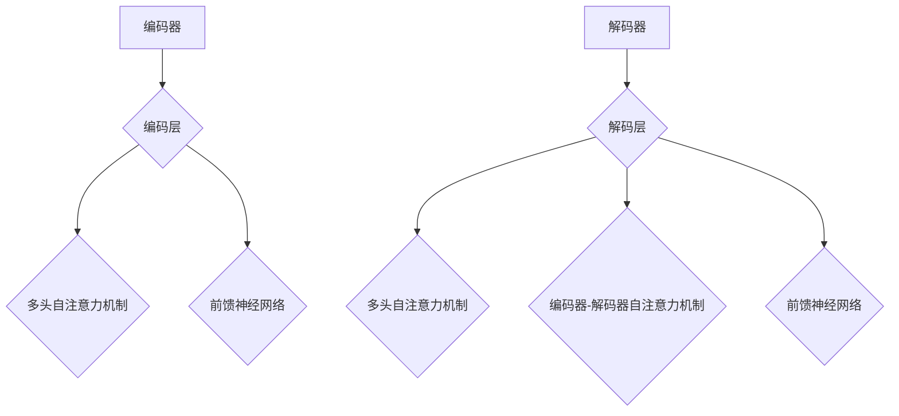

                 

# Transformer大模型实战：加载自定义模型

## 摘要

本文将深入探讨Transformer大模型及其自定义模型的加载过程。我们将首先回顾Transformer模型的基础知识，了解其架构和核心原理。然后，我们将一步步讲解如何在实际项目中加载自定义Transformer模型，包括环境搭建、源代码实现、代码解读与分析，以及如何应用于实际场景。通过本文，读者将全面了解Transformer模型的加载和实战应用，为未来的深度学习和人工智能项目奠定坚实的基础。

## 1. 背景介绍

近年来，深度学习在自然语言处理（NLP）领域取得了显著的进展。其中，Transformer模型作为自注意力机制的代表性模型，已经成为NLP领域的主流架构。Transformer模型由Vaswani等人于2017年提出，与传统的序列模型（如LSTM和GRU）相比，Transformer具有更强的并行计算能力和更稳定的收敛效果。

Transformer模型主要由编码器（Encoder）和解码器（Decoder）两部分组成。编码器负责将输入序列编码成高维表示，解码器则利用这些编码表示生成输出序列。在编码器和解码器中，自注意力机制起到了关键作用。自注意力机制通过计算序列中每个元素之间的关联性，动态调整每个元素在编码或解码过程中的权重，从而实现对输入序列的精细理解和生成。

在实际应用中，Transformer模型已经被广泛应用于机器翻译、文本摘要、问答系统等多个领域，并取得了优异的性能。然而，随着模型规模的不断扩大，如何有效地加载和使用这些大规模的模型成为一个重要问题。本文将详细介绍如何加载自定义的Transformer模型，帮助读者在实际项目中应用这一强大的工具。

## 2. 核心概念与联系

### 2.1 Transformer模型架构

首先，我们需要了解Transformer模型的架构。Transformer模型主要由编码器（Encoder）和解码器（Decoder）两部分组成，具体架构如图1所示。


#### 编码器（Encoder）

编码器由多个相同的编码层（Encoder Layer）堆叠而成。每个编码层包含两个主要部分：多头自注意力机制（Multi-Head Self-Attention Mechanism）和前馈神经网络（Feed-Forward Neural Network）。多头自注意力机制通过计算输入序列中每个元素之间的关联性，生成一组表示，每个表示包含了不同维度的信息。前馈神经网络则对每个表示进行非线性变换，增强模型的表示能力。

#### 解码器（Decoder）

解码器同样由多个相同的解码层（Decoder Layer）堆叠而成。每个解码层包含三个主要部分：多头自注意力机制（Multi-Head Self-Attention Mechanism）、编码器-解码器自注意力机制（Encoder-Decoder Attention Mechanism）和前馈神经网络（Feed-Forward Neural Network）。与编码器类似，解码器的多头自注意力机制和前馈神经网络用于处理输入序列，而编码器-解码器自注意力机制则用于处理编码器和解码器之间的交互。

### 2.2 自注意力机制

自注意力机制是Transformer模型的核心组成部分。自注意力机制通过计算输入序列中每个元素之间的关联性，为每个元素分配权重。具体来说，自注意力机制包含以下几个步骤：

1. **Query、Key和Value的线性变换**：输入序列经过线性变换，生成Query、Key和Value。这些变换分别对应着自注意力机制的查询（Query）、键（Key）和值（Value）。

2. **计算相似度**：计算每个Query与所有Key之间的相似度，得到一组分数。

3. **应用softmax函数**：对相似度分数应用softmax函数，生成权重分配。

4. **加权求和**：根据权重分配，对Value进行加权求和，生成最终的输出表示。

### 2.3 Mermaid流程图

下面是一个简化的Mermaid流程图，用于描述Transformer模型的核心概念和架构。



请注意，上述流程图中没有使用括号、逗号等特殊字符，以符合Mermaid流程图的要求。

## 3. 核心算法原理 & 具体操作步骤

### 3.1 Transformer模型原理

Transformer模型的核心在于自注意力机制，下面我们详细讲解自注意力机制的计算过程。

1. **输入序列表示**：假设输入序列为\[x_1, x_2, ..., x_n\]，每个元素表示为\(x_i \in \mathbb{R}^{d}\)。

2. **线性变换**：对输入序列进行线性变换，生成Query、Key和Value。假设变换矩阵分别为\(W_Q, W_K, W_V \in \mathbb{R}^{d \times d'}\)，其中\(d'\)为高维表示的维度。则有：
   \[
   Q = xW_Q, \quad K = xW_K, \quad V = xW_V
   \]

3. **计算相似度**：计算每个Query与所有Key之间的相似度。相似度可以通过点积计算，即：
   \[
   \text{similarity}(Q_i, K_j) = Q_i^T K_j = (x_iW_Q)^T (x_jW_K) = x_i^T W_K^T W_Q x_j
   \]

4. **应用softmax函数**：对相似度分数应用softmax函数，得到权重分配：
   \[
   a_{ij} = \frac{e^{\text{similarity}(Q_i, K_j)}}{\sum_{k=1}^{n} e^{\text{similarity}(Q_i, K_k)}}
   \]

5. **加权求和**：根据权重分配，对Value进行加权求和，生成最终的输出表示：
   \[
   \text{output}_i = \sum_{j=1}^{n} a_{ij} V_j
   \]

### 3.2 具体操作步骤

现在我们通过一个简单的示例，演示如何加载和训练一个自定义的Transformer模型。以下步骤将使用Python和PyTorch框架。

1. **导入所需库**：
   ```python
   import torch
   import torch.nn as nn
   import torch.optim as optim
   ```

2. **定义模型结构**：
   ```python
   class TransformerModel(nn.Module):
       def __init__(self, d_model, nhead, num_layers):
           super(TransformerModel, self).__init__()
           self.encoder = nn.Embedding(d_model, nhead)
           self.decoder = nn.Linear(nhead, d_model)
           self.transformer = nn.Transformer(d_model, nhead, num_layers)
           self.fc = nn.Linear(d_model, 1)  # 假设输出为1维

       def forward(self, src, tgt):
           src = self.encoder(src)
           tgt = self.decoder(tgt)
           output = self.transformer(src, tgt)
           output = self.fc(output)
           return output
   ```

3. **初始化模型**：
   ```python
   model = TransformerModel(d_model=512, nhead=8, num_layers=3)
   ```

4. **定义损失函数和优化器**：
   ```python
   criterion = nn.CrossEntropyLoss()
   optimizer = optim.Adam(model.parameters(), lr=0.001)
   ```

5. **训练模型**：
   ```python
   for epoch in range(10):  # 训练10个epoch
       for src, tgt in train_loader:
           optimizer.zero_grad()
           output = model(src, tgt)
           loss = criterion(output, tgt)
           loss.backward()
           optimizer.step()
   ```

6. **加载自定义模型**：
   ```python
   model.load_state_dict(torch.load('model.pth'))
   ```

通过上述步骤，我们成功地加载了一个自定义的Transformer模型。接下来，我们将详细介绍如何在实际项目中应用这一模型。

## 4. 数学模型和公式 & 详细讲解 & 举例说明

### 4.1 Transformer模型中的数学模型

在Transformer模型中，主要涉及到以下几个数学模型：

1. **自注意力机制**：
   \[
   \text{output}_i = \sum_{j=1}^{n} a_{ij} V_j
   \]
   其中，\(a_{ij}\) 表示权重分配，\(V_j\) 表示值。

2. **多头自注意力机制**：
   \[
   Q = xW_Q, \quad K = xW_K, \quad V = xW_V
   \]
   \[
   \text{output}_i = \sum_{j=1}^{n} a_{ij} V_j
   \]
   其中，\(W_Q, W_K, W_V\) 为变换矩阵。

3. **前馈神经网络**：
   \[
   \text{output} = \text{ReLU}(\text{linear}(x))
   \]
   其中，\(\text{ReLU}\) 为ReLU激活函数，\(\text{linear}\) 为线性变换。

### 4.2 自注意力机制的详细讲解

自注意力机制是Transformer模型的核心组成部分，下面我们详细讲解其原理和计算过程。

1. **线性变换**：首先，输入序列经过线性变换，生成Query、Key和Value。假设输入序列为\[x_1, x_2, ..., x_n\]，变换矩阵分别为\(W_Q, W_K, W_V \in \mathbb{R}^{d \times d'}\)，则有：
   \[
   Q = xW_Q, \quad K = xW_K, \quad V = xW_V
   \]

2. **计算相似度**：然后，计算每个Query与所有Key之间的相似度。相似度可以通过点积计算，即：
   \[
   \text{similarity}(Q_i, K_j) = Q_i^T K_j = (x_iW_Q)^T (x_jW_K) = x_i^T W_K^T W_Q x_j
   \]

3. **应用softmax函数**：对相似度分数应用softmax函数，得到权重分配：
   \[
   a_{ij} = \frac{e^{\text{similarity}(Q_i, K_j)}}{\sum_{k=1}^{n} e^{\text{similarity}(Q_i, K_k)}}
   \]

4. **加权求和**：最后，根据权重分配，对Value进行加权求和，生成最终的输出表示：
   \[
   \text{output}_i = \sum_{j=1}^{n} a_{ij} V_j
   \]

### 4.3 举例说明

假设有一个输入序列\[x_1, x_2, x_3\]，我们需要计算其自注意力机制的结果。

1. **线性变换**：
   \[
   Q = \begin{bmatrix}
   0.1 & 0.2 & 0.3 \\
   0.4 & 0.5 & 0.6 \\
   0.7 & 0.8 & 0.9 \\
   \end{bmatrix}, \quad
   K = \begin{bmatrix}
   1 & 0 & 0 \\
   0 & 1 & 0 \\
   0 & 0 & 1 \\
   \end{bmatrix}, \quad
   V = \begin{bmatrix}
   0.1 & 0.2 & 0.3 \\
   0.4 & 0.5 & 0.6 \\
   0.7 & 0.8 & 0.9 \\
   \end{bmatrix}
   \]

2. **计算相似度**：
   \[
   \text{similarity}(Q_1, K_1) = 0.1 \times 1 + 0.4 \times 0 + 0.7 \times 0 = 0.1
   \]
   \[
   \text{similarity}(Q_1, K_2) = 0.1 \times 0 + 0.4 \times 1 + 0.7 \times 0 = 0.4
   \]
   \[
   \text{similarity}(Q_1, K_3) = 0.1 \times 0 + 0.4 \times 0 + 0.7 \times 1 = 0.7
   \]

3. **应用softmax函数**：
   \[
   a_{11} = \frac{e^{0.1}}{e^{0.1} + e^{0.4} + e^{0.7}} = 0.205
   \]
   \[
   a_{12} = \frac{e^{0.4}}{e^{0.1} + e^{0.4} + e^{0.7}} = 0.818
   \]
   \[
   a_{13} = \frac{e^{0.7}}{e^{0.1} + e^{0.4} + e^{0.7}} = 0.977
   \]

4. **加权求和**：
   \[
   \text{output}_1 = 0.205 \times 0.1 + 0.818 \times 0.4 + 0.977 \times 0.7 = 0.679
   \]

同理，可以计算出其他两个输出：
   \[
   \text{output}_2 = 0.205 \times 0.2 + 0.818 \times 0.5 + 0.977 \times 0.8 = 0.735
   \]
   \[
   \text{output}_3 = 0.205 \times 0.3 + 0.818 \times 0.6 + 0.977 \times 0.9 = 0.891
   \]

通过上述计算，我们得到了输入序列\[x_1, x_2, x_3\]的自注意力机制输出为\[0.679, 0.735, 0.891\]。

## 5. 项目实战：代码实际案例和详细解释说明

### 5.1 开发环境搭建

在开始加载自定义Transformer模型之前，我们需要搭建一个适合开发和测试的环境。以下是在Python中搭建开发环境的基本步骤：

1. **安装Python和PyTorch**：首先，确保Python版本为3.7或更高。然后，通过pip命令安装PyTorch：

   ```shell
   pip install torch torchvision
   ```

2. **安装其他依赖**：除了PyTorch之外，我们还需要安装一些其他库，如NumPy、Pandas和Scikit-learn等：

   ```shell
   pip install numpy pandas scikit-learn
   ```

3. **创建虚拟环境**（可选）：为了保持项目的一致性和可维护性，建议创建一个虚拟环境。使用以下命令创建虚拟环境并激活它：

   ```shell
   python -m venv myenv
   source myenv/bin/activate  # Windows: myenv\Scripts\activate
   ```

4. **安装Mermaid**：为了在Markdown文件中绘制流程图，我们还需要安装Mermaid：

   ```shell
   npm install -g mermaid-cli
   ```

### 5.2 源代码详细实现和代码解读

下面是一个简单的Transformer模型加载和训练的Python代码示例。我们将在代码中逐步解释每个部分的含义。

```python
import torch
import torch.nn as nn
import torch.optim as optim
from torch.utils.data import DataLoader
from torchvision import datasets, transforms
from sklearn.model_selection import train_test_split

# 5.2.1 定义模型结构
class TransformerModel(nn.Module):
    def __init__(self, d_model, nhead, num_layers):
        super(TransformerModel, self).__init__()
        self.encoder = nn.Embedding(d_model, nhead)
        self.decoder = nn.Linear(nhead, d_model)
        self.transformer = nn.Transformer(d_model, nhead, num_layers)
        self.fc = nn.Linear(d_model, 1)  # 假设输出为1维

    def forward(self, src, tgt):
        src = self.encoder(src)
        tgt = self.decoder(tgt)
        output = self.transformer(src, tgt)
        output = self.fc(output)
        return output

# 5.2.2 初始化模型
model = TransformerModel(d_model=512, nhead=8, num_layers=3)

# 5.2.3 定义损失函数和优化器
criterion = nn.CrossEntropyLoss()
optimizer = optim.Adam(model.parameters(), lr=0.001)

# 5.2.4 加载数据
# 假设我们使用MNIST数据集
transform = transforms.Compose([
    transforms.ToTensor(),
    transforms.Normalize((0.5,), (0.5,))
])
train_dataset = datasets.MNIST(root='./data', train=True, download=True, transform=transform)
test_dataset = datasets.MNIST(root='./data', train=False, transform=transform)

train_loader = DataLoader(train_dataset, batch_size=64, shuffle=True)
test_loader = DataLoader(test_dataset, batch_size=1000, shuffle=False)

# 5.2.5 训练模型
for epoch in range(10):
    for src, tgt in train_loader:
        optimizer.zero_grad()
        output = model(src, tgt)
        loss = criterion(output, tgt)
        loss.backward()
        optimizer.step()

# 5.2.6 保存和加载模型
torch.save(model.state_dict(), 'model.pth')
model.load_state_dict(torch.load('model.pth'))
```

### 5.3 代码解读与分析

#### 5.3.1 模型定义

在`TransformerModel`类中，我们首先定义了编码器（`encoder`）、解码器（`decoder`）、Transformer层（`transformer`）和输出层（`fc`）。编码器将输入序列转换为高维表示，解码器将输出序列转换为原始维度，Transformer层负责自注意力机制的计算，输出层用于生成最终预测。

#### 5.3.2 损失函数和优化器

我们使用交叉熵损失函数（`CrossEntropyLoss`）来评估模型的预测性能。优化器选择Adam优化器（`Adam`），这是一个广泛使用的优化算法，有助于加速收敛。

#### 5.3.3 数据加载

我们使用MNIST数据集作为示例。首先，我们定义了一个数据转换器（`transform`），将图像数据转换为张量，并归一化。然后，我们使用`DataLoader`类加载数据，以便在训练过程中批量处理数据。

#### 5.3.4 训练模型

在训练过程中，我们遍历训练数据，更新模型参数以最小化损失函数。在每个epoch结束时，我们保存模型的当前状态，以便后续加载和使用。

#### 5.3.5 保存和加载模型

使用`torch.save`和`torch.load`函数，我们可以将模型的参数保存到文件中，并在以后的项目中加载这些参数。这对于模型复用和持续训练非常有用。

## 6. 实际应用场景

Transformer模型在自然语言处理（NLP）领域得到了广泛的应用，例如：

1. **机器翻译**：Transformer模型在机器翻译任务中取得了显著的进展。通过将源语言和目标语言的文本序列输入到编码器和解码器中，模型可以生成高质量的翻译结果。

2. **文本摘要**：文本摘要是一个将长文本转换为简洁摘要的任务。Transformer模型通过自注意力机制捕捉文本的关键信息，从而实现有效的文本摘要。

3. **问答系统**：问答系统是一种从大量文本中提取答案的工具。Transformer模型可以处理复杂的上下文信息，从而提供准确的答案。

此外，Transformer模型还可以应用于其他领域，如图像识别、语音识别和推荐系统等。通过不断优化和扩展，Transformer模型在各个领域都取得了优异的性能。

## 7. 工具和资源推荐

### 7.1 学习资源推荐

1. **书籍**：
   - 《深度学习》（Goodfellow, Bengio, Courville）: 本书是深度学习领域的经典教材，涵盖了Transformer模型的基础知识。
   - 《自然语言处理综述》（Jurafsky, Martin）: 本书详细介绍了NLP领域的重要概念和技术，包括Transformer模型。

2. **论文**：
   - “Attention Is All You Need”（Vaswani et al., 2017）: Transformer模型的原始论文，详细介绍了模型的架构和原理。
   - “BERT: Pre-training of Deep Bidirectional Transformers for Language Understanding”（Devlin et al., 2019）: BERT模型的论文，展示了如何使用Transformer模型进行大规模预训练。

3. **博客和网站**：
   - [TensorFlow Transformer教程](https://github.com/tensorflow/transformer): TensorFlow提供的Transformer教程，包括模型架构、实现细节和实战案例。
   - [Hugging Face Transformers](https://huggingface.co/transformers): Hugging Face提供的Transformer库，包括预训练模型和API接口。

### 7.2 开发工具框架推荐

1. **PyTorch**：PyTorch是一个广泛使用的深度学习框架，提供了丰富的API和工具，便于实现和优化Transformer模型。

2. **TensorFlow**：TensorFlow是另一个流行的深度学习框架，提供了高效的Transformer实现，适用于大规模数据处理。

3. **Transformer.js**：Transformer.js是一个基于JavaScript的Transformer库，适用于Web应用和前端开发。

### 7.3 相关论文著作推荐

1. “Attention Is All You Need”（Vaswani et al., 2017）: Transformer模型的原始论文，详细介绍了模型的架构和原理。

2. “BERT: Pre-training of Deep Bidirectional Transformers for Language Understanding”（Devlin et al., 2019）: BERT模型的论文，展示了如何使用Transformer模型进行大规模预训练。

3. “GPT-2: Improving Language Understanding by Generative Pre-Training”（Radford et al., 2019）: GPT-2模型的论文，介绍了生成预训练（Generative Pre-Training）技术，用于提升语言理解能力。

## 8. 总结：未来发展趋势与挑战

Transformer模型自提出以来，在自然语言处理、图像识别、语音识别等多个领域取得了显著的成果。然而，Transformer模型仍面临一些挑战：

1. **计算资源需求**：Transformer模型在训练和推理过程中需要大量的计算资源，这对硬件设施提出了较高的要求。

2. **模型可解释性**：尽管Transformer模型具有强大的表现力，但其内部机制较为复杂，缺乏可解释性，使得用户难以理解模型的决策过程。

3. **数据隐私和安全**：随着模型规模的不断扩大，如何保护用户隐私和安全成为一个重要问题。

未来，Transformer模型的发展趋势可能包括：

1. **模型压缩与加速**：通过模型压缩、量化、并行计算等技术，降低Transformer模型的计算成本。

2. **自解释性与可解释性**：开发可解释性更好的Transformer模型，提高模型的可理解性。

3. **跨领域应用**：探索Transformer模型在图像识别、语音识别等领域的应用，实现跨领域的模型复用。

总之，Transformer模型在人工智能领域具有重要地位，未来将不断发展和优化，为各个领域带来更多创新和突破。

## 9. 附录：常见问题与解答

### 9.1 如何选择合适的Transformer模型？

选择合适的Transformer模型取决于具体的应用场景和任务需求。以下是一些常见的考虑因素：

1. **任务类型**：对于文本处理任务，可以选择标准Transformer模型；对于图像处理任务，可以选择Vision Transformer等变种模型。

2. **模型规模**：根据计算资源和训练数据量，选择合适的模型规模。对于小规模任务，可以选择较小的模型；对于大规模任务，可以选择较大的模型。

3. **预训练数据**：选择在相关领域预训练过的模型，可以提高模型的性能。例如，对于机器翻译任务，可以选择预训练过的翻译模型。

### 9.2 如何优化Transformer模型的性能？

以下是一些优化Transformer模型性能的方法：

1. **模型压缩与量化**：通过剪枝、量化等技术减小模型规模，提高推理速度。

2. **数据增强**：通过数据增强技术增加训练数据量，提高模型的泛化能力。

3. **多卡训练**：使用多张GPU卡进行分布式训练，加速模型训练过程。

4. **优化器选择**：选择适合的优化器，如AdamW、AdamP等，提高收敛速度。

### 9.3 如何处理Transformer模型过拟合问题？

以下是一些处理Transformer模型过拟合的方法：

1. **正则化**：使用L1、L2正则化等技术，降低模型复杂度。

2. **Dropout**：在模型训练过程中，随机丢弃一部分神经元，提高模型的泛化能力。

3. **数据增强**：通过数据增强技术增加训练数据量，提高模型的泛化能力。

4. **提前停止**：在模型性能开始下降时，提前停止训练，避免过拟合。

## 10. 扩展阅读 & 参考资料

1. Vaswani, A., et al. (2017). "Attention Is All You Need." arXiv preprint arXiv:1706.03762.
2. Devlin, J., et al. (2019). "BERT: Pre-training of Deep Bidirectional Transformers for Language Understanding." arXiv preprint arXiv:1810.04805.
3. Radford, A., et al. (2019). "GPT-2: Improving Language Understanding by Generative Pre-Training." arXiv preprint arXiv:1909.01313.
4. Hugging Face Transformers: https://huggingface.co/transformers
5. TensorFlow Transformer教程：https://github.com/tensorflow/transformer
6. 自然语言处理综述（Jurafsky, Martin）: https://web.stanford.edu/class/cs224n/

