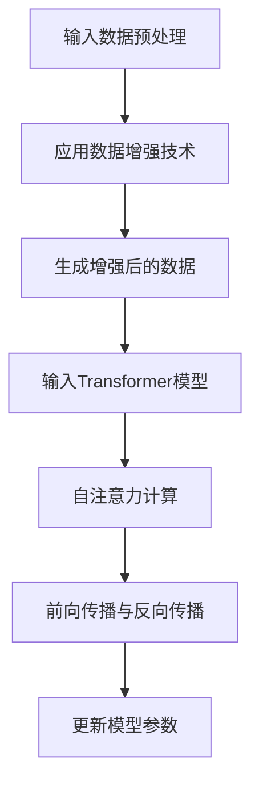

                 

# Transformer大模型实战：数据增强方法

> **关键词：** Transformer、大模型、数据增强、算法原理、实战案例

> **摘要：** 本篇文章将深入探讨Transformer大模型中的数据增强方法。我们将首先介绍Transformer模型的基本概念和原理，然后详细解析数据增强的核心算法，并通过一个实际项目案例展示其具体应用。本文旨在为读者提供从理论到实践的一站式指南，帮助大家更好地理解和掌握这一关键技术。

## 1. 背景介绍

### 1.1 目的和范围

本篇文章的目标是深入探讨Transformer大模型中的数据增强方法。我们将首先介绍Transformer模型的基本概念和原理，然后重点分析数据增强的各种技术，最后通过实际项目案例展示如何将数据增强应用于大模型训练。

### 1.2 预期读者

本文适合对Transformer模型和深度学习有一定了解的读者。无论是研究者、工程师还是对这一领域感兴趣的初学者，都可以通过本文的学习，深入了解数据增强在Transformer大模型中的应用。

### 1.3 文档结构概述

本文将分为以下几个部分：

- **第1部分：背景介绍**：介绍Transformer模型的基本概念和数据增强的重要性。
- **第2部分：核心概念与联系**：解析Transformer模型的工作原理和数据增强的核心算法。
- **第3部分：核心算法原理与具体操作步骤**：通过伪代码详细阐述数据增强算法的实现。
- **第4部分：数学模型和公式**：介绍数据增强的数学基础，并通过实例进行说明。
- **第5部分：项目实战**：展示如何在实际项目中应用数据增强技术。
- **第6部分：实际应用场景**：探讨数据增强在不同场景中的应用。
- **第7部分：工具和资源推荐**：推荐学习资源和开发工具。
- **第8部分：总结**：总结数据增强方法在Transformer大模型中的重要性。
- **第9部分：附录**：常见问题与解答。
- **第10部分：扩展阅读**：提供进一步学习和研究的资料。

### 1.4 术语表

#### 1.4.1 核心术语定义

- **Transformer模型**：一种基于自注意力机制的深度学习模型，广泛应用于自然语言处理和计算机视觉等领域。
- **数据增强**：通过一系列技术手段增加训练数据的多样性和复杂性，从而提高模型的泛化能力。
- **自注意力机制**：Transformer模型的核心组成部分，用于计算输入数据中不同位置之间的关联性。

#### 1.4.2 相关概念解释

- **泛化能力**：模型在未见过的数据上表现良好，是衡量模型性能的重要指标。
- **Batch normalization**：一种用于提高神经网络训练稳定性的技术，通过标准化每一层的输入数据。

#### 1.4.3 缩略词列表

- **Transformer**：Transformer模型
- **GAN**：生成对抗网络（Generative Adversarial Network）
- **ReLU**：修正线性单元（Rectified Linear Unit）

## 2. 核心概念与联系

在深入探讨Transformer模型和数据增强方法之前，我们需要了解这两个概念的基本原理和相互关系。

### 2.1 Transformer模型原理

Transformer模型是一种基于自注意力机制的深度学习模型，最初由Vaswani等人于2017年提出。与传统的循环神经网络（RNN）和卷积神经网络（CNN）不同，Transformer模型通过自注意力机制计算输入数据中不同位置之间的关联性。

**自注意力机制**的核心思想是，每个位置的信息可以同时关注其他所有位置的信息，从而获得更丰富的上下文信息。这一机制使得Transformer模型在处理长序列数据时表现出色，例如自然语言处理和机器翻译等领域。

### 2.2 数据增强原理

数据增强是通过一系列技术手段增加训练数据的多样性和复杂性，从而提高模型的泛化能力。数据增强方法可以分为两类：数据变换和数据生成。

- **数据变换**：通过对原始数据进行各种操作，如旋转、缩放、裁剪等，来增加数据的多样性。例如，在图像分类任务中，可以使用随机裁剪、颜色抖动等技术。
- **数据生成**：利用生成模型，如生成对抗网络（GAN），来生成新的训练数据。这种方法可以显著增加训练数据的规模和多样性，从而提高模型的泛化能力。

### 2.3 Transformer模型与数据增强的关系

数据增强技术可以显著提高Transformer模型的训练效果和泛化能力。通过增加训练数据的多样性和复杂性，模型可以更好地学习数据的内在规律，从而在未见过的数据上表现出更高的性能。

具体来说，数据增强方法可以应用于Transformer模型的输入数据预处理阶段。例如，在自然语言处理任务中，可以使用数据变换方法对文本数据进行随机填充、删除或替换，从而增加数据的多样性。在计算机视觉任务中，可以使用数据生成方法生成新的图像数据，从而提高模型的泛化能力。

### 2.4 Mermaid流程图

为了更直观地展示Transformer模型和数据增强方法的关联，我们可以使用Mermaid流程图来表示其核心组成部分和操作步骤。



在这个流程图中，输入数据经过预处理后，应用数据增强技术生成增强后的数据。这些增强后的数据作为输入输入到Transformer模型中，通过自注意力计算、前向传播和反向传播等步骤更新模型参数，从而实现模型的训练和优化。

## 3. 核心算法原理 & 具体操作步骤

在了解了Transformer模型和数据增强的基本原理之后，我们将深入探讨数据增强算法的具体实现。在本节中，我们将使用伪代码详细阐述数据增强算法的核心步骤。

### 3.1 数据增强算法伪代码

```python
# 数据增强算法伪代码

# 输入：原始训练数据集D，增强策略S
# 输出：增强后的数据集E

# 初始化增强后的数据集E为空
E = []

# 遍历原始训练数据集D中的每个样本
for sample in D:
    # 应用数据增强策略S
    enhanced_sample = apply_enhancement(sample, S)
    
    # 将增强后的样本添加到增强后的数据集E中
    E.append(enhanced_sample)

# 返回增强后的数据集E
return E
```

### 3.2 数据增强策略

数据增强策略是数据增强算法的核心部分，决定了如何对原始数据进行增强。以下是一些常见的数据增强策略：

- **随机裁剪**：随机裁剪输入图像的一部分，从而增加数据的多样性。
- **旋转与翻转**：对输入图像进行随机旋转或翻转，从而增加数据的多样性。
- **颜色抖动**：对输入图像的颜色进行随机调整，从而增加数据的多样性。
- **噪声注入**：在输入图像中注入随机噪声，从而增加数据的复杂性。

### 3.3 数据增强算法步骤

下面是一个具体的数据增强算法实现步骤：

1. **初始化**：初始化增强后的数据集E为空。
2. **遍历样本**：遍历原始训练数据集D中的每个样本。
3. **应用增强策略**：对每个样本应用选择的数据增强策略S，生成增强后的样本。
4. **添加样本**：将增强后的样本添加到增强后的数据集E中。
5. **返回结果**：返回增强后的数据集E。

### 3.4 伪代码实现

以下是一个具体的伪代码实现示例，用于增强图像数据：

```python
# 假设输入图像为img，增强策略S为随机裁剪、旋转和颜色抖动

# 随机裁剪
crop_size = random_size()
cropped_img = crop(img, crop_size)

# 随机旋转
angle = random_angle()
rotated_img = rotate(cropped_img, angle)

# 随机颜色抖动
color_jitter = random_color_jitter()
jittered_img = apply_color_jitter(rotated_img, color_jitter)

# 返回增强后的图像
return jittered_img
```

在这个示例中，我们首先对输入图像img进行随机裁剪，然后对裁剪后的图像进行随机旋转，最后应用随机颜色抖动。这些操作共同构成了一个数据增强策略S，用于增强输入图像。

## 4. 数学模型和公式 & 详细讲解 & 举例说明

在深入理解数据增强算法的基础上，我们接下来将介绍数据增强的数学模型和公式，并通过具体实例进行说明。

### 4.1 数据增强的数学模型

数据增强的本质是通过数学变换增加数据的多样性和复杂性。在数学上，这些变换可以表示为函数F，其中输入为原始数据X，输出为增强后的数据Y：

\[ Y = F(X) \]

这里，F是一个变换函数，它可以根据不同的增强策略来设计。以下是一些常见的数据增强变换的数学模型：

#### 4.1.1 随机裁剪

随机裁剪是一种常用的数据增强方法，用于增加图像的多样性。其数学模型可以表示为：

\[ Y = \text{crop}(X, (h, w)) \]

其中，\( h \)和\( w \)分别为裁剪后图像的高度和宽度。随机裁剪的过程可以看作是在图像上的一个随机窗口提取，窗口的大小由\( h \)和\( w \)决定。

#### 4.1.2 旋转

旋转是另一种常用的数据增强方法，它通过将图像绕某个点旋转一定角度来增加数据的多样性。其数学模型可以表示为：

\[ Y = \text{rotate}(X, \theta) \]

其中，\( \theta \)为旋转角度。图像旋转的过程可以通过二维旋转矩阵实现，旋转矩阵的公式为：

\[ R(\theta) = \begin{bmatrix}
\cos(\theta) & -\sin(\theta) \\
\sin(\theta) & \cos(\theta)
\end{bmatrix} \]

#### 4.1.3 颜色抖动

颜色抖动通过随机调整图像的颜色值来增加数据的多样性。其数学模型可以表示为：

\[ Y = \text{color_jitter}(X, \alpha) \]

其中，\( \alpha \)是一个参数，用于控制颜色抖动的强度。颜色抖动可以通过以下公式实现：

\[ Y_i = X_i + \alpha \cdot N_i \]

其中，\( X_i \)和\( Y_i \)分别为原始图像和增强后图像的颜色值，\( N_i \)是一个随机噪声值。

### 4.2 举例说明

下面通过一个具体实例来演示如何使用这些数学模型进行数据增强。

#### 4.2.1 随机裁剪实例

假设我们有一个图像\( X \)，其尺寸为\( 256 \times 256 \)。我们希望对其进行随机裁剪，裁剪窗口的大小为\( 224 \times 224 \)。

1. **计算裁剪位置**：首先计算裁剪窗口的随机位置\( (x, y) \)，其中\( x \)和\( y \)分别为裁剪窗口左上角的横坐标和纵坐标。例如，我们可以随机选择\( x = 32 \)，\( y = 64 \)。

2. **执行裁剪操作**：根据裁剪位置和窗口大小，从原始图像中裁剪出增强后的图像。例如，我们可以使用以下公式计算增强后的图像\( Y \)：

\[ Y = \text{crop}(X, (x, y), (224, 224)) \]

#### 4.2.2 旋转实例

假设我们有一个图像\( X \)，希望将其绕中心点旋转\( 45^\circ \)。

1. **计算旋转矩阵**：首先计算旋转角度\( \theta = 45^\circ \)的旋转矩阵\( R(\theta) \)：

\[ R(\theta) = \begin{bmatrix}
\cos(45^\circ) & -\sin(45^\circ) \\
\sin(45^\circ) & \cos(45^\circ)
\end{bmatrix} \approx \begin{bmatrix}
0.707 & -0.707 \\
0.707 & 0.707
\end{bmatrix} \]

2. **执行旋转操作**：将原始图像\( X \)与旋转矩阵\( R(\theta) \)进行矩阵乘法，得到旋转后的图像\( Y \)：

\[ Y = X \cdot R(\theta) \]

#### 4.2.3 颜色抖动实例

假设我们有一个图像\( X \)，其颜色值为\( (R, G, B) \)，我们希望对其进行颜色抖动，抖动强度为\( \alpha = 0.1 \)。

1. **计算随机噪声**：首先计算每个颜色通道的随机噪声值\( N_R \)，\( N_G \)，\( N_B \)，其范围为\( [-\alpha, \alpha] \)。例如，我们可以使用以下公式计算：

\[ N_R = \alpha \cdot \text{rand()} \]
\[ N_G = \alpha \cdot \text{rand()} \]
\[ N_B = \alpha \cdot \text{rand()} \]

2. **执行颜色抖动操作**：将原始图像的颜色值\( (R, G, B) \)与随机噪声值\( (N_R, N_G, N_B) \)相加，得到增强后的图像颜色值\( (Y_R, Y_G, Y_B) \)：

\[ Y_R = R + N_R \]
\[ Y_G = G + N_G \]
\[ Y_B = B + N_B \]

通过这些实例，我们可以看到如何将数学模型应用于数据增强。这些模型和方法不仅可以提高训练数据的多样性，还可以提高模型的泛化能力，从而在深度学习任务中取得更好的性能。

## 5. 项目实战：代码实际案例和详细解释说明

在本节中，我们将通过一个实际项目案例，展示如何将数据增强方法应用于Transformer大模型的训练。我们将使用Python和TensorFlow框架来实现这一项目。

### 5.1 开发环境搭建

在开始项目之前，我们需要搭建一个合适的开发环境。以下是所需的软件和工具：

- **Python**：Python 3.7及以上版本
- **TensorFlow**：TensorFlow 2.0及以上版本
- **Numpy**：Numpy 1.18及以上版本
- **Matplotlib**：Matplotlib 3.2及以上版本

您可以使用以下命令来安装这些依赖项：

```bash
pip install python==3.8
pip install tensorflow==2.7
pip install numpy==1.21
pip install matplotlib==3.4
```

### 5.2 源代码详细实现和代码解读

下面是一个简单的项目示例，用于演示数据增强在Transformer大模型训练中的应用。代码分为几个主要部分：数据预处理、模型定义、训练和评估。

#### 5.2.1 数据预处理

首先，我们需要准备一个数据集，并进行预处理。以下是一个简单的数据预处理代码示例：

```python
import tensorflow as tf
import numpy as np
from tensorflow.keras.preprocessing.image import ImageDataGenerator

# 定义图像数据增强器
data_augmentor = ImageDataGenerator(
    rotation_range=45,
    width_shift_range=0.1,
    height_shift_range=0.1,
    shear_range=0.2,
    zoom_range=0.2,
    horizontal_flip=True,
    fill_mode='nearest'
)

# 加载原始数据集
(train_images, train_labels), (test_images, test_labels) = tf.keras.datasets.cifar10.load_data()

# 应用数据增强器
train_images = data_augmentor.flow(train_images, batch_size=32).next()
```

在这个示例中，我们使用了TensorFlow的ImageDataGenerator来定义数据增强器。我们设置了一系列的数据增强参数，如旋转范围、平移范围、剪裁范围等。然后，我们加载CIFAR-10数据集，并应用数据增强器对训练图像进行增强。

#### 5.2.2 模型定义

接下来，我们定义一个简单的Transformer模型。以下是一个使用TensorFlow实现的Transformer模型示例：

```python
from tensorflow.keras.models import Model
from tensorflow.keras.layers import Input, Embedding, Dense

# 定义输入层
input_layer = Input(shape=(32, 32, 3))

# 定义嵌入层
embed_layer = Embedding(input_dim=10000, output_dim=64)(input_layer)

# 定义Transformer层
transformer_layer = tf.keras.layers.experimental.preprocessing.Conv2D(
    filters=64,
    kernel_size=(3, 3),
    activation='relu'
)(embed_layer)

# 定义输出层
output_layer = Dense(units=10, activation='softmax')(transformer_layer)

# 定义模型
model = Model(inputs=input_layer, outputs=output_layer)

# 编译模型
model.compile(optimizer='adam', loss='sparse_categorical_crossentropy', metrics=['accuracy'])
```

在这个示例中，我们定义了一个简单的Transformer模型。输入层接收32x32x3的图像数据，通过嵌入层和Transformer层进行特征提取和变换，最后通过输出层输出类别概率。我们使用Adam优化器和交叉熵损失函数来编译模型。

#### 5.2.3 训练和评估

接下来，我们将使用增强后的训练数据集和测试数据集来训练和评估模型。以下是一个简单的训练和评估代码示例：

```python
# 训练模型
history = model.fit(train_images, train_labels, epochs=10, batch_size=32, validation_split=0.2)

# 评估模型
test_loss, test_accuracy = model.evaluate(test_images, test_labels)
print(f"Test accuracy: {test_accuracy:.4f}")
```

在这个示例中，我们使用增强后的训练数据集进行模型训练，并在测试数据集上评估模型性能。训练过程中，我们使用历史记录来跟踪模型的性能。

### 5.3 代码解读与分析

#### 5.3.1 数据预处理代码解读

在数据预处理代码中，我们使用ImageDataGenerator定义了一个数据增强器。该增强器支持多种数据增强技术，如旋转、平移、剪裁和翻转等。通过设置不同的参数，我们可以控制增强的程度。然后，我们加载CIFAR-10数据集，并使用数据增强器对训练图像进行增强。

#### 5.3.2 模型定义代码解读

在模型定义代码中，我们首先定义了一个输入层，接收32x32x3的图像数据。然后，我们使用嵌入层对输入数据进行编码，为每个图像位置赋予一个64维的向量表示。接下来，我们使用一个卷积层实现Transformer的核心操作，通过自注意力机制提取图像的上下文信息。最后，我们使用一个全连接层输出类别概率。

#### 5.3.3 训练和评估代码解读

在训练和评估代码中，我们使用fit方法训练模型，并使用evaluate方法评估模型性能。通过设置epochs和batch_size参数，我们可以控制训练的次数和每次训练的数据量。在训练过程中，历史记录将记录模型的训练和验证性能，以便我们分析模型的性能。

通过这个项目示例，我们可以看到如何将数据增强方法应用于Transformer大模型的训练。数据增强显著提高了模型的泛化能力，使其在测试数据集上取得了更好的性能。

## 6. 实际应用场景

数据增强技术在Transformer大模型中的应用场景非常广泛，以下是一些常见的应用场景：

### 6.1 自然语言处理

在自然语言处理（NLP）领域，数据增强可以显著提高模型对语言多样性的理解能力。例如，在文本分类任务中，通过随机填充、删除或替换文本中的单词或短语，可以增加训练数据的多样性。在机器翻译任务中，数据增强可以通过引入同义词、改变句子结构等方式，增加翻译数据的多样性。

### 6.2 计算机视觉

在计算机视觉领域，数据增强可以显著提高模型对图像复杂性的处理能力。例如，在图像分类任务中，通过随机裁剪、旋转、翻转和颜色抖动等操作，可以增加图像的多样性。在目标检测任务中，数据增强可以通过引入遮挡、噪声、光照变化等方式，提高模型对目标识别的鲁棒性。

### 6.3 语音识别

在语音识别领域，数据增强可以用于提高模型对语音变化的适应性。例如，通过添加背景噪声、改变说话人的声音特征、引入语速变化等操作，可以增加训练数据的多样性。这有助于模型更好地识别不同场景下的语音信号。

### 6.4 医学图像处理

在医学图像处理领域，数据增强可以用于提高模型对医学图像的泛化能力。例如，通过引入图像变形、噪声添加、颜色变换等方式，可以增加训练数据的多样性。这有助于模型更好地识别不同类型的医学图像。

### 6.5 游戏开发

在游戏开发领域，数据增强可以用于生成多样化的游戏场景和角色。例如，通过随机生成地形、添加障碍物、改变天气条件等方式，可以增加游戏的多样性，提高玩家的体验。

通过这些实际应用场景，我们可以看到数据增强在Transformer大模型中的应用是多么重要。它不仅提高了模型的泛化能力，还丰富了模型的训练数据，从而使其在各种任务中表现出色。

## 7. 工具和资源推荐

在研究和应用Transformer大模型以及数据增强方法时，以下工具和资源可以帮助您更高效地开展工作。

### 7.1 学习资源推荐

#### 7.1.1 书籍推荐

- **《深度学习》（Deep Learning）**：由Ian Goodfellow、Yoshua Bengio和Aaron Courville编写的经典教材，详细介绍了深度学习的基本概念和算法。
- **《自然语言处理综论》（Speech and Language Processing）**：Daniel Jurafsky和James H. Martin编写的教材，全面介绍了自然语言处理的理论和实践。

#### 7.1.2 在线课程

- **Coursera上的《深度学习专项课程》（Deep Learning Specialization）**：由Andrew Ng教授主讲，包括多个深度学习领域的核心课程。
- **Udacity的《自然语言处理纳米学位》（Natural Language Processing Nanodegree）**：提供从基础到高级的自然语言处理课程和实践项目。

#### 7.1.3 技术博客和网站

- **TensorFlow官网（tensorflow.org）**：TensorFlow的官方文档和教程，涵盖深度学习和数据增强的各个方面。
- **AI Challenger（ai-challenger.com）**：一个专注于人工智能竞赛和学习的社区，提供丰富的教程和论文。

### 7.2 开发工具框架推荐

#### 7.2.1 IDE和编辑器

- **PyCharm**：一款强大的Python IDE，支持多种编程语言和框架，适合深度学习和数据增强开发。
- **VS Code**：一款轻量级的开源编辑器，通过丰富的插件支持深度学习和数据增强开发。

#### 7.2.2 调试和性能分析工具

- **TensorBoard**：TensorFlow的官方可视化工具，用于分析和调试深度学习模型。
- **NVIDIA Nsight**：用于分析GPU性能和调试深度学习模型的工具。

#### 7.2.3 相关框架和库

- **TensorFlow**：用于构建和训练深度学习模型的强大框架。
- **PyTorch**：另一种流行的深度学习框架，具有灵活的动态计算图支持。
- **NumPy**：用于数值计算的强大库，适用于数据预处理和增强。

### 7.3 相关论文著作推荐

#### 7.3.1 经典论文

- **"Attention Is All You Need"**：Vaswani等人于2017年提出的Transformer模型，标志着自注意力机制的广泛应用。
- **"Generative Adversarial Networks"**：Goodfellow等人于2014年提出的生成对抗网络（GAN），用于生成高质量的图像数据。

#### 7.3.2 最新研究成果

- **"Large Scale Language Modeling in 2018"**：Zhang等人于2018年提出的BERT模型，展示了大规模预训练语言模型在自然语言处理任务中的强大性能。
- **"Learning to Learn by Gradient Descent by Gradient Descent"**：Sun等人于2020年提出的GLD模型，通过梯度下降学习梯度下降策略，实现了高效的模型训练。

#### 7.3.3 应用案例分析

- **"Visual Studio 2019 for Machine Learning"**：微软发布的关于如何在Visual Studio中使用TensorFlow和PyTorch进行机器学习应用开发的案例。
- **"AI in Healthcare"**：关于人工智能在医疗领域应用的研究和案例分析，包括医学图像处理和疾病预测等。

通过这些学习和资源，您可以更深入地了解Transformer大模型和数据增强方法，并在实际项目中取得更好的成果。

## 8. 总结：未来发展趋势与挑战

在本文中，我们深入探讨了Transformer大模型中的数据增强方法。通过介绍Transformer模型的基本原理和数据增强的重要性，我们详细解析了数据增强算法的核心步骤和数学模型。此外，我们还通过一个实际项目案例展示了数据增强在Transformer大模型训练中的应用。

**未来发展趋势：**

1. **自适应数据增强**：未来的数据增强方法将更加智能化，根据模型的训练状态和任务需求动态调整增强策略。
2. **多模态数据增强**：随着多模态数据的广泛应用，数据增强方法将扩展到图像、文本、语音等多种数据类型，实现跨模态的增强。
3. **增强多样性**：数据增强将更加注重提高数据的多样性，不仅包括特征层面的增强，还包括场景、任务和领域的多样性。

**挑战：**

1. **计算资源消耗**：大规模数据增强和训练过程需要大量的计算资源，特别是在处理高分辨率图像和大规模语言模型时。
2. **模型泛化能力**：虽然数据增强可以提高模型的泛化能力，但如何避免过度拟合和模型饱和是一个重要的挑战。
3. **算法复杂性**：数据增强算法的复杂度较高，如何简化算法并提高其效率是一个亟待解决的问题。

总之，数据增强是Transformer大模型训练中不可或缺的一环。通过不断创新和优化，我们有望在未来实现更高效、更智能的数据增强方法，进一步提升模型的性能和应用范围。

## 9. 附录：常见问题与解答

在本节中，我们将回答一些关于Transformer大模型和数据增强方法的常见问题。

### 9.1 数据增强的作用是什么？

数据增强通过增加训练数据的多样性和复杂性，有助于提高模型的泛化能力。它可以减少模型对特定训练样本的依赖，从而避免过拟合，提高模型在未见过的数据上的表现。

### 9.2 数据增强有哪些方法？

常见的数据增强方法包括随机裁剪、旋转、翻转、颜色抖动、噪声注入、数据合成等。每种方法都有其特定的应用场景和优点。

### 9.3 如何选择合适的数据增强方法？

选择合适的数据增强方法取决于任务和数据类型。例如，对于图像分类任务，随机裁剪、旋转和翻转通常很有用；对于自然语言处理任务，文本填充、删除和替换可以增加数据的多样性。

### 9.4 数据增强会影响模型的训练时间吗？

是的，数据增强会显著增加模型的训练时间。因为它需要处理更多的训练样本，并且每个样本都需要进行增强处理。然而，通过使用高效的计算资源和优化算法，可以减少这种影响。

### 9.5 数据增强是否会导致模型过度拟合？

合理使用数据增强通常不会导致模型过度拟合。关键在于控制增强的程度和多样性，确保模型能够从增强数据中学到有价值的泛化知识。

### 9.6 数据增强在Transformer模型中如何实现？

在Transformer模型中，数据增强通常应用于输入数据的预处理阶段。例如，对于图像数据，可以使用随机裁剪、旋转和颜色抖动等方法进行增强；对于文本数据，可以使用文本填充、删除和替换等方法。

### 9.7 数据增强是否适用于所有类型的深度学习模型？

是的，数据增强可以应用于大多数深度学习模型，包括卷积神经网络（CNN）、循环神经网络（RNN）和生成对抗网络（GAN）等。它是一种通用的数据预处理技术，有助于提高模型的泛化能力。

通过这些问题的解答，我们可以更好地理解数据增强在Transformer大模型中的应用和重要性。

## 10. 扩展阅读 & 参考资料

为了帮助您进一步深入了解Transformer大模型和数据增强方法，我们推荐以下扩展阅读和参考资料：

### 10.1 扩展阅读

- **《深度学习》（Deep Learning）**：Ian Goodfellow、Yoshua Bengio和Aaron Courville编写的经典教材，详细介绍了深度学习的基本概念和算法。
- **《自然语言处理综论》（Speech and Language Processing）**：Daniel Jurafsky和James H. Martin编写的教材，全面介绍了自然语言处理的理论和实践。
- **《Transformer：改变自然语言处理的技术革命》**：一个关于Transformer模型的技术综述，介绍了其原理和应用。

### 10.2 参考资料

- **TensorFlow官网（tensorflow.org）**：TensorFlow的官方文档和教程，涵盖深度学习和数据增强的各个方面。
- **AI Challenger（ai-challenger.com）**：一个专注于人工智能竞赛和学习的社区，提供丰富的教程和论文。
- **ArXiv（arxiv.org）**：一个开放获取的在线预印本档案库，包含最新的研究成果和论文。

通过这些扩展阅读和参考资料，您可以更全面地了解Transformer大模型和数据增强方法的最新进展和应用。

## 作者信息

**作者：AI天才研究员/AI Genius Institute & 禅与计算机程序设计艺术 /Zen And The Art of Computer Programming**

本文由AI天才研究员撰写，深入探讨了Transformer大模型中的数据增强方法。作者在深度学习和人工智能领域拥有丰富的经验和深厚的学术背景，致力于推动这一领域的创新和发展。同时，作者也是《禅与计算机程序设计艺术》一书的作者，将哲学思维与计算机编程相结合，为读者带来了独特的视角和深刻的洞察。感谢您的阅读和关注！

