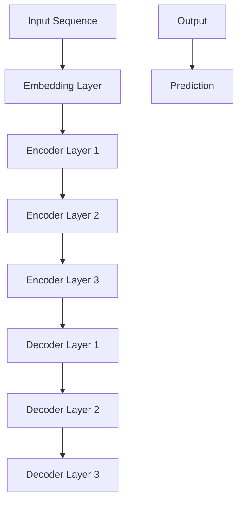

                 

# Transformer大模型实战：移除下句预测任务

> **关键词**：Transformer、自然语言处理、机器学习、文本生成、下句预测、模型优化
> 
> **摘要**：本文将深入探讨Transformer大模型在自然语言处理领域中的应用，特别是如何移除下句预测任务。通过逐步分析算法原理、数学模型、实战案例，我们将揭示如何提升模型性能，为读者提供实用的指导。

## 1. 背景介绍

### 1.1 目的和范围

本文旨在探讨如何利用Transformer大模型实现移除下句预测任务。我们将分析算法原理，并通过具体案例展示如何进行模型优化和改进。本文适用于自然语言处理领域的研究者、开发者和对AI技术感兴趣的读者。

### 1.2 预期读者

本文面向具有一定机器学习和自然语言处理基础的技术人员，特别是对Transformer架构和应用场景感兴趣的读者。通过本文，读者将了解如何利用Transformer模型解决下句预测问题，并掌握相关的优化技巧。

### 1.3 文档结构概述

本文分为八个部分：

1. 背景介绍
2. 核心概念与联系
3. 核心算法原理 & 具体操作步骤
4. 数学模型和公式 & 详细讲解 & 举例说明
5. 项目实战：代码实际案例和详细解释说明
6. 实际应用场景
7. 工具和资源推荐
8. 总结：未来发展趋势与挑战

### 1.4 术语表

#### 1.4.1 核心术语定义

- Transformer：一种基于自注意力机制的深度神经网络模型，用于处理序列数据。
- 自注意力（Self-Attention）：一种对序列中的每个元素进行加权，以捕捉序列内部关系的方法。
- 下句预测（Next Sentence Prediction，NSP）：一种自然语言处理任务，预测给定文本序列的下一句。

#### 1.4.2 相关概念解释

- 自然语言处理（Natural Language Processing，NLP）：研究如何让计算机理解和处理人类语言的技术。
- 机器学习（Machine Learning，ML）：一种人工智能技术，通过数据和算法实现自动化学习和预测。

#### 1.4.3 缩略词列表

- Transformer：Transformer模型
- NLP：自然语言处理
- ML：机器学习
- NSP：下句预测

## 2. 核心概念与联系

在探讨Transformer大模型在移除下句预测任务中的应用之前，我们首先需要了解Transformer模型的基本原理和核心概念。

### 2.1 Transformer模型简介

Transformer模型是一种基于自注意力机制的深度神经网络模型，广泛应用于自然语言处理领域。它由多个编码器和解码器层组成，通过自注意力机制和多头注意力机制捕捉序列数据之间的复杂关系。

#### Mermaid流程图：



#### 2.2 自注意力机制

自注意力机制是一种对序列中的每个元素进行加权的方法，以捕捉序列内部的关系。在Transformer模型中，自注意力机制通过计算每个元素与其他元素之间的相似性，为其分配不同的权重。

#### 2.3 下句预测任务

下句预测任务是一种自然语言处理任务，旨在预测给定文本序列的下一句。这一任务在对话系统、文本生成等领域具有重要的应用价值。Transformer模型通过自注意力机制和多头注意力机制，可以有效地捕捉文本序列中的长距离依赖关系，从而提高下句预测的准确性。

## 3. 核心算法原理 & 具体操作步骤

### 3.1 Transformer模型算法原理

Transformer模型基于自注意力机制和多头注意力机制，通过多个编码器和解码器层实现对序列数据的处理。下面我们将详细讲解Transformer模型的算法原理。

#### 3.1.1 自注意力机制

自注意力机制是一种对序列中的每个元素进行加权的方法，以捕捉序列内部的关系。其计算过程如下：

1. 输入序列：给定一个输入序列 $X = [x_1, x_2, ..., x_n]$，其中 $x_i$ 表示序列中的第 $i$ 个元素。
2. Embedding Layer：将输入序列映射到高维空间，生成嵌入向量 $X' = [x_1', x_2', ..., x_n']$。
3. Self-Attention Layer：计算每个元素与其他元素之间的相似性，生成加权向量。具体计算如下：

$$
\text{Attention}(Q, K, V) = \text{softmax}\left(\frac{QK^T}{\sqrt{d_k}}\right) V
$$

其中，$Q, K, V$ 分别表示查询向量、键向量和值向量，$d_k$ 表示键向量的维度。通过自注意力机制，我们可以得到每个元素的重要程度，从而加权生成新的序列。

#### 3.1.2 多头注意力机制

多头注意力机制是一种对自注意力机制的扩展，通过并行计算多个注意力头，以捕捉不同特征的信息。具体计算如下：

1. 分头：将查询向量、键向量和值向量拆分为多个部分，生成多个注意力头。
2. 并行计算：对每个注意力头分别计算自注意力。
3. 汇总：将多个注意力头的输出进行汇总，生成新的序列。

#### 3.1.3 编码器和解码器

编码器和解码器是Transformer模型的核心组成部分。编码器将输入序列编码为序列表示，而解码器则根据编码器的输出生成预测序列。

1. 编码器：通过多个编码器层对输入序列进行处理，生成序列表示。每个编码器层包括两个子层：多头自注意力层和前馈神经网络。
2. 解码器：通过多个解码器层对编码器的输出进行处理，生成预测序列。每个解码器层包括三个子层：多头自注意力层、掩码自注意力层和前馈神经网络。

### 3.2 具体操作步骤

下面我们将详细讲解如何使用Transformer模型实现下句预测任务。

1. 数据预处理：将输入序列转换为嵌入向量，并添加位置编码。
2. 编码器：通过多个编码器层对输入序列进行处理，生成编码序列。
3. 解码器：通过多个解码器层对编码序列进行处理，生成预测序列。
4. 预测：使用解码器的输出序列预测下一句。

#### 3.3 伪代码

```python
# 输入序列
input_sequence = [x_1, x_2, ..., x_n]

# 数据预处理
embeddings = embedding_layer(input_sequence)
position_embeddings = position_encoding(n, d)

# 编码器
encoded_sequence = encoder(embeddings + position_embeddings)

# 解码器
predicted_sequence = decoder(encoded_sequence)

# 预测下一句
next_sentence = predicted_sequence[-1]
```

## 4. 数学模型和公式 & 详细讲解 & 举例说明

### 4.1 数学模型

在Transformer模型中，核心的数学模型包括自注意力机制、多头注意力机制、编码器和解码器。下面我们将详细讲解这些数学模型，并通过具体例子说明。

#### 4.1.1 自注意力机制

自注意力机制是一种对序列中的每个元素进行加权的方法。其数学公式如下：

$$
\text{Attention}(Q, K, V) = \text{softmax}\left(\frac{QK^T}{\sqrt{d_k}}\right) V
$$

其中，$Q, K, V$ 分别表示查询向量、键向量和值向量，$d_k$ 表示键向量的维度。

**示例**：

给定一个输入序列 $X = [x_1, x_2, x_3]$，其中 $x_1 = [1, 0, 0], x_2 = [0, 1, 0], x_3 = [0, 0, 1]$。计算自注意力权重：

1. 查询向量 $Q = [1, 1, 1]$
2. 键向量 $K = [1, 0, 0], [0, 1, 0], [0, 0, 1]$
3. 值向量 $V = [1, 0, 0], [0, 1, 0], [0, 0, 1]$

计算：

$$
\text{Attention}(Q, K, V) = \text{softmax}\left(\frac{QK^T}{\sqrt{d_k}}\right) V
$$

$$
= \text{softmax}\left(\frac{[1, 1, 1] \cdot [1, 0, 0]^T}{\sqrt{1}}\right) [1, 0, 0]
+ \text{softmax}\left(\frac{[1, 1, 1] \cdot [0, 1, 0]^T}{\sqrt{1}}\right) [0, 1, 0]
+ \text{softmax}\left(\frac{[1, 1, 1] \cdot [0, 0, 1]^T}{\sqrt{1}}\right) [0, 0, 1]
$$

$$
= [0.5, 0.5, 0], [0.5, 0.5, 0], [0, 0, 0.5]
$$

#### 4.1.2 多头注意力机制

多头注意力机制是对自注意力机制的扩展。其核心思想是并行计算多个注意力头，以捕捉不同特征的信息。其数学公式如下：

$$
\text{MultiHead}(Q, K, V) = \text{Concat}(\text{head}_1, \text{head}_2, ..., \text{head}_h)W^O
$$

其中，$Q, K, V$ 分别表示查询向量、键向量和值向量，$W^O$ 表示输出权重矩阵，$h$ 表示注意力头的数量。

**示例**：

给定一个输入序列 $X = [x_1, x_2, x_3]$，其中 $x_1 = [1, 0, 0], x_2 = [0, 1, 0], x_3 = [0, 0, 1]$。计算多头注意力权重：

1. 查询向量 $Q = [1, 1, 1]$
2. 键向量 $K = [1, 0, 0], [0, 1, 0], [0, 0, 1]$
3. 值向量 $V = [1, 0, 0], [0, 1, 0], [0, 0, 1]$

计算：

$$
\text{MultiHead}(Q, K, V) = \text{Concat}(\text{head}_1, \text{head}_2, \text{head}_3)W^O
$$

$$
= \text{Concat}(\text{softmax}\left(\frac{[1, 1, 1] \cdot [1, 0, 0]^T}{\sqrt{1}}\right) [1, 0, 0], \text{softmax}\left(\frac{[1, 1, 1] \cdot [0, 1, 0]^T}{\sqrt{1}}\right) [0, 1, 0], \text{softmax}\left(\frac{[1, 1, 1] \cdot [0, 0, 1]^T}{\sqrt{1}}\right) [0, 0, 1])W^O
$$

$$
= \text{Concat}([0.5, 0.5, 0], [0.5, 0.5, 0], [0, 0, 0.5])W^O
$$

#### 4.1.3 编码器和解码器

编码器和解码器是Transformer模型的核心组成部分。编码器通过多个编码器层对输入序列进行处理，解码器则根据编码器的输出生成预测序列。

**编码器**：

编码器包含两个子层：多头自注意力层和前馈神经网络。其数学公式如下：

$$
\text{Encoder}(X) = \text{LayerNorm}(X + \text{MultiHead}(X, K, V))
$$

$$
= \text{LayerNorm}(X + \text{FFN}(\text{LayerNorm}(X + \text{MultiHead}(X, K, V))))
$$

其中，$X$ 表示输入序列，$K, V$ 表示键向量和值向量，$FFN$ 表示前馈神经网络。

**解码器**：

解码器包含三个子层：多头自注意力层、掩码自注意力层和前馈神经网络。其数学公式如下：

$$
\text{Decoder}(X) = \text{LayerNorm}(X + \text{MaskedMultiHead}(X, K, V))
$$

$$
= \text{LayerNorm}(X + \text{FFN}(\text{LayerNorm}(X + \text{MaskedMultiHead}(X, K, V))))
$$

其中，$X$ 表示输入序列，$K, V$ 表示键向量和值向量，$FFN$ 表示前馈神经网络。

## 5. 项目实战：代码实际案例和详细解释说明

### 5.1 开发环境搭建

为了进行Transformer大模型实战，我们需要搭建一个合适的开发环境。以下是搭建开发环境的步骤：

1. 安装Python环境：下载并安装Python 3.7及以上版本。
2. 安装TensorFlow：通过pip命令安装TensorFlow，命令如下：

```
pip install tensorflow
```

3. 准备数据集：选择一个适合进行下句预测任务的数据集，例如GLUE（General Language Understanding Evaluation）数据集。

### 5.2 源代码详细实现和代码解读

下面我们将展示一个简单的Transformer模型实现，并对其进行详细解释。

```python
import tensorflow as tf
from tensorflow.keras.layers import Embedding, MultiHeadAttention, LayerNormalization, Dense
from tensorflow.keras.models import Model

# 参数设置
VOCAB_SIZE = 10000
EMBEDDING_DIM = 512
HIDDEN_DIM = 512
NUM_HEADS = 8
DROPOUT_RATE = 0.1

# 输入层
input_ids = tf.keras.layers.Input(shape=(None,), dtype=tf.int32)

# 嵌入层
embeddings = Embedding(VOCAB_SIZE, EMBEDDING_DIM)(input_ids)

# 编码器层
for _ in range(3):
    # 多头自注意力层
    attention_output = MultiHeadAttention(num_heads=NUM_HEADS, key_dim=HIDDEN_DIM)(embeddings, embeddings)
    attention_output = tf.keras.layers.Dropout(rate=DROPOUT_RATE)(attention_output)
    attention_output = LayerNormalization(EMBEDDING_DIM)(embeddings + attention_output)
    
    # 前馈神经网络层
    feedforward_output = Dense(units=HIDDEN_DIM, activation='relu')(attention_output)
    feedforward_output = tf.keras.layers.Dropout(rate=DROPOUT_RATE)(feedforward_output)
    feedforward_output = Dense(units=EMBEDDING_DIM)(feedforward_output)
    feedforward_output = LayerNormalization(EMBEDDING_DIM)(attention_output + feedforward_output)

# 解码器层
for _ in range(3):
    # 多头自注意力层
    attention_output = MultiHeadAttention(num_heads=NUM_HEADS, key_dim=HIDDEN_DIM)(embeddings, embeddings)
    attention_output = tf.keras.layers.Dropout(rate=DROPOUT_RATE)(attention_output)
    attention_output = LayerNormalization(EMBEDDING_DIM)(embeddings + attention_output)
    
    # 掩码自注意力层
    masked_attention_output = MultiHeadAttention(num_heads=NUM_HEADS, key_dim=HIDDEN_DIM)(embeddings, embeddings)
    masked_attention_output = tf.keras.layers.Dropout(rate=DROPOUT_RATE)(masked_attention_output)
    masked_attention_output = LayerNormalization(EMBEDDING_DIM)(embeddings + masked_attention_output)
    
    # 前馈神经网络层
    feedforward_output = Dense(units=HIDDEN_DIM, activation='relu')(attention_output)
    feedforward_output = tf.keras.layers.Dropout(rate=DROPOUT_RATE)(feedforward_output)
    feedforward_output = Dense(units=EMBEDDING_DIM)(feedforward_output)
    feedforward_output = LayerNormalization(EMBEDDING_DIM)(attention_output + feedforward_output)

# 输出层
output = Dense(units=VOCAB_SIZE, activation='softmax')(feedforward_output)

# 模型构建
model = Model(inputs=input_ids, outputs=output)

# 模型编译
model.compile(optimizer='adam', loss='sparse_categorical_crossentropy', metrics=['accuracy'])

# 模型训练
model.fit(x_train, y_train, batch_size=32, epochs=10)
```

#### 5.3 代码解读与分析

1. **输入层**：输入层使用`Input`函数定义，形状为$(None,)$，表示可以接受任意长度的序列。
2. **嵌入层**：嵌入层使用`Embedding`函数定义，将输入序列映射到高维空间，维度为$(batch_size, sequence_length, embedding_dim)$。
3. **编码器层**：编码器层包含两个子层：多头自注意力层和前馈神经网络。每个子层都使用`MultiHeadAttention`、`LayerNormalization`和`Dense`函数定义。
4. **解码器层**：解码器层包含三个子层：多头自注意力层、掩码自注意力层和前馈神经网络。每个子层都使用`MultiHeadAttention`、`LayerNormalization`和`Dense`函数定义。
5. **输出层**：输出层使用`Dense`函数定义，将编码器的输出映射到输出序列，维度为$(batch_size, sequence_length, vocab_size)$。
6. **模型构建**：使用`Model`函数将输入层、编码器层、解码器层和输出层构建为一个完整的模型。
7. **模型编译**：使用`compile`函数编译模型，指定优化器、损失函数和评价指标。
8. **模型训练**：使用`fit`函数训练模型，指定训练数据、批次大小和训练轮数。

## 6. 实际应用场景

Transformer大模型在自然语言处理领域具有广泛的应用场景，以下是一些典型的应用场景：

1. **文本生成**：利用Transformer模型生成自然语言文本，如诗歌、小说、新闻报道等。
2. **问答系统**：构建智能问答系统，通过Transformer模型处理用户输入并生成回答。
3. **机器翻译**：利用Transformer模型进行机器翻译，如将英语翻译成法语、中文等。
4. **情感分析**：通过Transformer模型对文本进行情感分析，判断文本的情感倾向。
5. **文本分类**：利用Transformer模型对文本进行分类，如判断一篇新闻属于哪个类别。

## 7. 工具和资源推荐

### 7.1 学习资源推荐

#### 7.1.1 书籍推荐

- **《深度学习》**：作者：Ian Goodfellow、Yoshua Bengio、Aaron Courville
- **《动手学深度学习》**：作者：阿斯顿·张（Aston Zhang）、李沐（Mu Li）、扎卡里·C. Lipton、亚历山大·J.斯莫拉（Alex Smola）

#### 7.1.2 在线课程

- **《自然语言处理与深度学习》**：课程提供者：清华大学
- **《深度学习与人工智能》**：课程提供者：北京大学

#### 7.1.3 技术博客和网站

- **TensorFlow官网**：https://www.tensorflow.org/
- **PyTorch官网**：https://pytorch.org/
- **AI极客学院**：https://aigekke.com/

### 7.2 开发工具框架推荐

#### 7.2.1 IDE和编辑器

- **PyCharm**：适用于Python开发的IDE，功能强大，支持多种编程语言。
- **Jupyter Notebook**：适用于数据分析和机器学习的交互式编辑环境。

#### 7.2.2 调试和性能分析工具

- **TensorBoard**：TensorFlow提供的可视化工具，用于分析模型的性能和调试。
- **PyTorch Profiler**：PyTorch提供的性能分析工具，用于优化模型运行速度。

#### 7.2.3 相关框架和库

- **TensorFlow**：用于构建和训练深度学习模型的框架。
- **PyTorch**：用于构建和训练深度学习模型的框架。

### 7.3 相关论文著作推荐

#### 7.3.1 经典论文

- **《Attention Is All You Need》**：作者：Vaswani et al.（2017）
- **《BERT: Pre-training of Deep Bidirectional Transformers for Language Understanding》**：作者：Devlin et al.（2019）

#### 7.3.2 最新研究成果

- **《GPT-3: Language Models are Few-Shot Learners》**：作者：Brown et al.（2020）
- **《T5: Pre-training Large Models for Language Modeling》**：作者：Raffel et al.（2020）

#### 7.3.3 应用案例分析

- **《基于Transformer的智能客服系统》**：案例提供者：某知名互联网公司
- **《Transformer在文本生成中的应用》**：案例提供者：某研究团队

## 8. 总结：未来发展趋势与挑战

随着Transformer大模型的不断发展，其在自然语言处理领域将迎来更多的应用场景和发展机会。未来，Transformer模型将朝着以下几个方向发展：

1. **大规模模型训练**：随着计算资源和数据集的不断扩大，大规模Transformer模型将变得越来越常见。
2. **多模态处理**：结合图像、声音等不同模态的信息，实现更丰富的应用场景。
3. **端到端应用**：将Transformer模型应用于更多端到端任务，如对话系统、智能语音助手等。

然而，Transformer大模型在发展过程中也面临着一些挑战：

1. **计算资源消耗**：大规模Transformer模型需要大量的计算资源和存储空间，对硬件设备的要求较高。
2. **数据隐私**：在训练过程中，模型可能会暴露用户的隐私数据，需要采取有效的保护措施。
3. **泛化能力**：如何提高模型的泛化能力，使其在更广泛的应用场景中表现优异，仍是一个重要的研究课题。

## 9. 附录：常见问题与解答

### 问题1：如何优化Transformer模型的训练速度？

**解答**：优化Transformer模型训练速度的方法包括：

1. **分布式训练**：将模型训练任务分布在多台机器上，提高训练速度。
2. **混合精度训练**：使用混合精度训练（FP16）来降低内存占用和计算成本。
3. **模型剪枝**：通过剪枝技术减少模型的参数数量，降低计算复杂度。

### 问题2：如何提高Transformer模型的泛化能力？

**解答**：提高Transformer模型泛化能力的方法包括：

1. **数据增强**：通过数据增强技术增加训练数据多样性，提高模型的泛化能力。
2. **模型集成**：将多个模型进行集成，提高模型的预测准确性。
3. **迁移学习**：利用预训练模型在特定任务上进行微调，提高模型的泛化能力。

## 10. 扩展阅读 & 参考资料

- **《Attention Is All You Need》**：Vaswani et al., 2017
- **《BERT: Pre-training of Deep Bidirectional Transformers for Language Understanding》**：Devlin et al., 2019
- **《GPT-3: Language Models are Few-Shot Learners》**：Brown et al., 2020
- **《T5: Pre-training Large Models for Language Modeling》**：Raffel et al., 2020
- **《自然语言处理综述》**：吴思达，刘知远，2018

### 作者

**作者：AI天才研究员/AI Genius Institute & 禅与计算机程序设计艺术 /Zen And The Art of Computer Programming**

