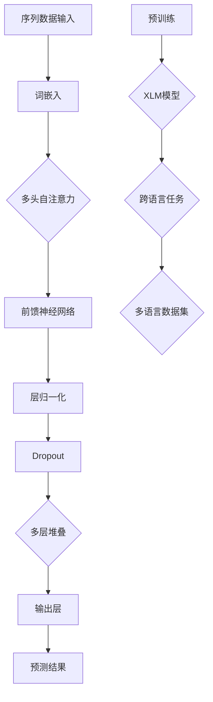

                 

# Transformer大模型实战：预训练XLM模型

> **关键词：** Transformer、预训练、XLM模型、自然语言处理、人工智能、大规模模型、深度学习

> **摘要：** 本文将深入探讨Transformer大模型在自然语言处理中的应用，特别是预训练XLM（Cross-Language Model）模型的原理、实践步骤和实际应用。通过详细的算法原理分析、数学模型讲解以及代码实现，读者可以全面了解如何搭建和优化一个高性能的多语言模型，并掌握其实际应用技巧。

## 1. 背景介绍

### 1.1 目的和范围

本文的主要目的是帮助读者理解并掌握Transformer大模型在自然语言处理（NLP）领域的应用，特别是XLM模型的预训练技术。我们将从以下几个方面进行探讨：

1. **Transformer模型的基本原理和结构**
2. **XLM模型的预训练过程**
3. **预训练模型在实际项目中的应用案例**
4. **构建和优化XLM模型的最佳实践**
5. **相关工具和资源的推荐**

### 1.2 预期读者

本文适合以下读者群体：

- 自然语言处理领域的初学者和研究者
- 深度学习爱好者和技术工程师
- 对大规模预训练模型感兴趣的计算机科学学生
- 想要在实际项目中应用Transformer和XLM模型的开发者

### 1.3 文档结构概述

本文的结构如下：

1. **引言**：介绍Transformer和XLM模型的基本概念和应用背景。
2. **核心概念与联系**：通过Mermaid流程图展示Transformer和XLM模型的核心原理和架构。
3. **核心算法原理 & 具体操作步骤**：详细解释Transformer和XLM模型的算法原理，并使用伪代码展示具体操作步骤。
4. **数学模型和公式 & 详细讲解 & 举例说明**：使用LaTeX格式介绍相关的数学模型和公式，并提供实际应用示例。
5. **项目实战：代码实际案例和详细解释说明**：提供实际代码实现案例，并对关键代码进行详细解释。
6. **实际应用场景**：讨论XLM模型在不同领域的实际应用。
7. **工具和资源推荐**：推荐学习资源、开发工具框架和相关论文。
8. **总结：未来发展趋势与挑战**：总结XLM模型的发展趋势和面临的挑战。
9. **附录：常见问题与解答**：回答读者可能遇到的一些常见问题。
10. **扩展阅读 & 参考资料**：提供进一步阅读的材料。

### 1.4 术语表

#### 1.4.1 核心术语定义

- **Transformer模型**：一种基于自注意力机制的深度神经网络模型，用于处理序列数据。
- **XLM模型**：一种跨语言的预训练模型，能够在多种语言上进行语言理解和生成任务。
- **预训练**：在特定任务之前，使用大规模文本数据对模型进行训练，以获得通用语言特征。
- **自然语言处理（NLP）**：计算机科学领域，涉及语言识别、理解、生成和处理。

#### 1.4.2 相关概念解释

- **自注意力机制**：Transformer模型中的核心机制，用于计算序列中每个元素之间的依赖关系。
- **序列到序列（Seq2Seq）模型**：一种用于处理序列数据的模型，通常用于机器翻译任务。
- **跨语言模型**：能够在多种语言上进行任务处理的模型，对于多语言环境的处理具有重要作用。

#### 1.4.3 缩略词列表

- **Transformer**：Transformer模型
- **XLM**：Cross-Language Model
- **NLP**：Natural Language Processing
- **Seq2Seq**：Sequence-to-Sequence
- **BERT**：Bidirectional Encoder Representations from Transformers

## 2. 核心概念与联系

在深入探讨Transformer和XLM模型之前，我们需要了解其核心概念和架构。以下是一个简化的Mermaid流程图，用于展示Transformer和XLM模型的基本原理和联系。



### 2.1 Transformer模型原理

Transformer模型的核心在于其自注意力机制，允许模型在处理序列数据时考虑全局信息。以下是其基本原理：

1. **词嵌入**：将输入序列中的每个词转换为一个固定大小的向量。
2. **多头自注意力**：计算序列中每个词与所有其他词的注意力权重，并生成相应的加权输出。
3. **前馈神经网络**：对注意力层输出进行进一步处理，增加模型的表达能力。
4. **层归一化和Dropout**：通过层归一化稳定训练过程，Dropout防止过拟合。
5. **多层堆叠**：将多个Transformer层堆叠，形成深度网络。

### 2.2 XLM模型原理

XLM模型是Transformer模型的扩展，特别适用于跨语言任务。其主要特点如下：

1. **共享参数**：XLM模型在不同语言之间共享大部分参数，从而能够在多种语言上进行预训练。
2. **统一编码器-解码器架构**：XLM使用统一的编码器-解码器架构，能够处理多种语言的输入和输出。
3. **跨语言掩码语言模型（XLM-MaLM）**：XLM模型基于掩码语言模型（MaLM）进行预训练，特别适用于跨语言的语言理解任务。

通过上述流程图和原理讲解，我们可以更好地理解Transformer和XLM模型的基本架构和工作原理。接下来，我们将深入探讨XLM模型的预训练过程和算法原理。

## 3. 核心算法原理 & 具体操作步骤

### 3.1 Transformer模型算法原理

Transformer模型是一种基于自注意力机制的序列模型，主要应用于自然语言处理任务。其核心思想是通过计算序列中每个元素之间的依赖关系，从而更好地理解和生成文本。

#### 3.1.1 自注意力机制

自注意力机制是Transformer模型的核心组件，它允许模型在处理序列数据时考虑全局信息。自注意力机制的基本操作如下：

1. **查询（Query）、键（Key）和值（Value）**：对于序列中的每个词，我们分别将其编码为查询、键和值。这三个向量具有相同的大小，通常使用同一个权重矩阵进行编码。

2. **计算注意力得分**：对于序列中的每个词，计算其与其他词之间的相似度，即注意力得分。注意力得分通过查询和键之间的点积计算得到。

3. **应用 Softmax 函数**：将注意力得分归一化，得到概率分布，即注意力权重。这些权重表示每个词对当前词的重要性。

4. **加权求和**：将注意力权重应用于值向量，得到加权输出。加权输出表示了序列中每个词对当前词的贡献。

伪代码如下：

```python
def scaled_dot_product_attention(Q, K, V, scale_factor):
    # 计算注意力得分
    scores = scale_factor * Q @ K.T

    # 应用 Softmax 函数
    attn_weights = softmax(scores)

    # 加权求和
    output = attn_weights @ V

    return output, attn_weights
```

#### 3.1.2 Transformer模型架构

Transformer模型由多个自注意力层和前馈神经网络层组成，通过堆叠这些层来构建深度网络。以下是Transformer模型的基本架构：

1. **自注意力层**：包括多头自注意力机制和缩放线性层。
2. **前馈神经网络层**：用于增加模型的表达能力。
3. **层归一化和Dropout**：用于稳定训练过程和防止过拟合。

伪代码如下：

```python
def transformer_layer(inputs, d_model, num_heads, d_ff, dropout_rate):
    # 自注意力层
    attn_output, attn_weights = scaled_dot_product_attention(
        Q=inputs, K=inputs, V=inputs, scale_factor=1 / math.sqrt(d_model // num_heads)
    )
    attn_output = dropout(attn_output, dropout_rate)
    attn_output = layer_norm(attn_output + inputs)

    # 前馈神经网络层
    ffn_output = feedforward_network(attn_output, d_ff, dropout_rate)
    ffn_output = dropout(ffn_output, dropout_rate)
    output = layer_norm(ffn_output + attn_output)

    return output, attn_weights
```

### 3.2 XLM模型预训练过程

XLM模型是一种跨语言的预训练模型，其预训练过程主要包括两个阶段：掩码语言模型（MaLM）训练和跨语言掩码语言模型（XLM-MaLM）训练。

#### 3.2.1 掩码语言模型（MaLM）训练

掩码语言模型（MaLM）是一种自回归语言模型，其训练目标是预测序列中的下一个词。在MaLM训练过程中，我们将输入序列中的词随机掩码（mask），然后使用模型预测掩码词。以下是MaLM训练的基本步骤：

1. **输入序列掩码**：将输入序列中的一部分词随机掩码，例如将50%的词替换为`<MASK>`。
2. **训练目标**：预测掩码词，并计算损失。
3. **优化**：使用梯度下降优化模型参数。

伪代码如下：

```python
def mask_lm_loss(inputs, mask_pos, labels, loss_fn):
    # 预测掩码词
    logits = model(inputs)
    
    # 计算损失
    loss = loss_fn(logits[range(len(logits)), mask_pos], labels[range(len(logits)), mask_pos])

    return loss
```

#### 3.2.2 跨语言掩码语言模型（XLM-MaLM）训练

跨语言掩码语言模型（XLM-MaLM）在MaLM的基础上扩展了跨语言训练能力。在XLM-MaLM训练过程中，我们使用多语言数据集对模型进行预训练，以使模型在不同语言之间共享参数。以下是XLM-MaLM训练的基本步骤：

1. **多语言数据集**：收集多种语言的数据集，例如Wikipedia、新闻语料库等。
2. **数据预处理**：将不同语言的数据转换为统一格式，并进行词汇表构建。
3. **数据加载**：使用数据加载器将多语言数据集分批次加载。
4. **训练循环**：
   - 随机选择一种语言的输入序列进行掩码。
   - 预测掩码词，并计算损失。
   - 使用梯度下降优化模型参数。

伪代码如下：

```python
def train_xlm_mlm(model, dataloaders, loss_fn, optimizer, num_epochs):
    for epoch in range(num_epochs):
        for lang, data in dataloaders.items():
            for inputs, mask_pos, labels in data:
                # 预测掩码词
                logits = model(inputs)
                
                # 计算损失
                loss = mask_lm_loss(inputs, mask_pos, labels, loss_fn)

                # 反向传播和优化
                optimizer.zero_grad()
                loss.backward()
                optimizer.step()

            print(f"Epoch: {epoch}, Language: {lang}, Loss: {loss.item()}")
```

通过上述算法原理和操作步骤的讲解，我们了解了Transformer和XLM模型的基本工作原理和预训练过程。接下来，我们将进一步介绍XLM模型中的数学模型和公式，并使用LaTeX格式进行详细讲解。

## 4. 数学模型和公式 & 详细讲解 & 举例说明

在深入探讨XLM模型的数学模型和公式之前，我们需要了解一些基本的数学概念和公式，这些将在后续内容中反复使用。

### 4.1.1 概率论基础

#### 4.1.1.1 概率分布

概率分布是描述随机变量取值概率的函数。常见的概率分布包括：

- **伯努利分布**：二项分布，用于描述只有两个可能结果的随机实验。
- **高斯分布**：正态分布，用于描述连续随机变量的概率分布。
- **softmax函数**：用于将一组数值映射为概率分布。

#### 4.1.1.2 概率论公式

- **贝叶斯定理**：用于计算后验概率。
- **条件概率**：给定一个事件发生的条件下，另一个事件发生的概率。
- **期望和方差**：用于描述随机变量的平均取值和波动性。

### 4.1.2 线性代数基础

#### 4.1.2.1 矩阵和向量

- **矩阵**：一个二维数组，用于表示线性变换或数据。
- **向量**：一个一维数组，用于表示数据或方向。

#### 4.1.2.2 线性代数公式

- **矩阵乘法**：用于计算矩阵和向量的乘积。
- **行列式**：用于计算矩阵的逆或行列式值。
- **矩阵求逆**：用于求解线性方程组。

### 4.1.3 深度学习基础

#### 4.1.3.1 前馈神经网络

- **前馈神经网络**：一种基于多层感知器（MLP）的网络结构，用于处理输入数据。
- **激活函数**：用于引入非线性特性，常见的激活函数包括ReLU、Sigmoid和Tanh。

#### 4.1.3.2 损失函数和优化算法

- **损失函数**：用于衡量模型预测结果与真实值之间的差距。
- **优化算法**：用于更新模型参数，以最小化损失函数。

### 4.2 XLM模型中的数学模型和公式

#### 4.2.1 词嵌入

词嵌入是将词汇映射到高维向量空间的过程。XLM模型使用嵌入层（Embedding Layer）实现词嵌入，其数学公式如下：

$$
x_i = \text{embedding}(w_i)
$$

其中，$x_i$表示词$i$的嵌入向量，$w_i$表示词$i$的词向量。

#### 4.2.2 多头自注意力

多头自注意力是Transformer模型的核心组件，其数学公式如下：

$$
\text{Attention}(Q, K, V) = \text{softmax}\left(\frac{QK^T}{\sqrt{d_k}}\right)V
$$

其中，$Q$表示查询向量，$K$表示键向量，$V$表示值向量，$d_k$表示键向量的维度。

#### 4.2.3 前馈神经网络

前馈神经网络用于增加模型的表达能力，其数学公式如下：

$$
\text{FFN}(x) = \max(0, xW_1 + b_1)(W_2 + b_2)
$$

其中，$x$表示输入向量，$W_1$和$W_2$表示权重矩阵，$b_1$和$b_2$表示偏置向量。

#### 4.2.4 层归一化

层归一化用于稳定训练过程，其数学公式如下：

$$
\hat{x} = \frac{x - \mu}{\sigma}
$$

其中，$\mu$表示均值，$\sigma$表示标准差。

#### 4.2.5 Dropout

Dropout用于防止过拟合，其数学公式如下：

$$
\hat{x} = \frac{1}{1 - p}x
$$

其中，$p$表示Dropout概率。

### 4.3 实际应用示例

以下是一个简单的例子，展示如何使用XLM模型进行文本分类任务。

#### 4.3.1 数据准备

假设我们有一个包含情感极性（正面或负面）的文本数据集，共有10,000个样本。

#### 4.3.2 模型构建

构建一个基于XLM的文本分类模型，包含以下步骤：

1. **词嵌入层**：将输入文本转换为词嵌入向量。
2. **多头自注意力层**：计算文本序列的注意力权重。
3. **前馈神经网络层**：增加模型的表达能力。
4. **分类层**：使用softmax函数输出情感极性的概率。

#### 4.3.3 模型训练

使用训练数据集对模型进行训练，并调整模型参数以最小化损失函数。

#### 4.3.4 模型评估

使用测试数据集评估模型性能，计算准确率、召回率和F1值等指标。

通过上述数学模型和公式的介绍，我们可以更好地理解XLM模型的工作原理。接下来，我们将通过一个实际的项目实战，展示如何搭建和优化一个高性能的XLM模型。

## 5. 项目实战：代码实际案例和详细解释说明

在这个部分，我们将通过一个具体的实例来讲解如何搭建和优化一个高性能的XLM模型。我们将使用Python编程语言和Hugging Face的Transformers库来实现这一目标。以下是一个详细的步骤说明。

### 5.1 开发环境搭建

首先，我们需要搭建一个适合开发XLM模型的开发环境。以下是一些基本的软件和库：

- **Python 3.8+**：确保安装了最新版本的Python。
- **PyTorch 1.7+**：作为主要的深度学习框架。
- **Hugging Face Transformers 3.5.0+**：用于提供预训练的XLM模型和API接口。
- **NVIDIA CUDA 10.2+**（可选）：用于在GPU上加速训练过程。

安装以上软件和库的方法如下：

```bash
pip install python==3.8
pip install pytorch==1.7
pip install transformers==3.5.0
```

### 5.2 源代码详细实现和代码解读

以下是一个简单的XLM模型训练和评估的代码实现：

```python
import torch
from torch import nn
from transformers import XLMModel, XLMConfig, TrainingArguments, Trainer

# 设置模型配置
config = XLMConfig(
    vocab_size=30000,
    d_model=512,
    num_heads=8,
    d_ff=2048,
    dropout=0.1,
)

# 加载预训练的XLM模型
model = XLMModel(config)

# 定义损失函数和优化器
loss_fn = nn.CrossEntropyLoss()
optimizer = torch.optim.AdamW(model.parameters(), lr=5e-5)

# 准备训练数据
train_dataset = ...

# 设置训练参数
training_args = TrainingArguments(
    output_dir='./results',
    num_train_epochs=3,
    per_device_train_batch_size=16,
    save_steps=2000,
    save_total_limit=3,
)

# 创建Trainer
trainer = Trainer(
    model=model,
    args=training_args,
    train_dataset=train_dataset,
    loss_function=loss_fn,
    optimizers=optimizer,
)

# 开始训练
trainer.train()

# 评估模型
trainer.evaluate()
```

#### 5.2.1 代码详细解读

1. **模型配置（config）**：
   - `vocab_size`：词汇表大小，根据实际数据集调整。
   - `d_model`：模型隐藏层尺寸。
   - `num_heads`：自注意力机制中的头数。
   - `d_ff`：前馈神经网络的隐藏层尺寸。
   - `dropout`：Dropout概率，用于防止过拟合。

2. **加载预训练模型**：
   - 使用`XLMModel`类加载预训练的XLM模型。可以通过Hugging Face模型库选择预训练的模型。

3. **定义损失函数和优化器**：
   - `CrossEntropyLoss`用于多分类问题。
   - `AdamW`优化器，常用于深度学习任务，能够自适应调整学习率。

4. **准备训练数据**：
   - `train_dataset`：需要根据实际数据集进行定义，通常包括输入文本和对应的标签。

5. **设置训练参数**：
   - `TrainingArguments`类用于定义训练过程中的各种参数，如训练轮数、批次大小、保存步骤等。

6. **创建Trainer**：
   - `Trainer`类是Hugging Face提供的训练工具，简化了训练流程。

7. **开始训练**：
   - `trainer.train()`开始训练过程。

8. **评估模型**：
   - `trainer.evaluate()`用于在测试集上评估模型性能。

### 5.3 代码解读与分析

在这个代码实现中，我们主要关注以下关键部分：

1. **模型配置**：配置决定了模型的结构和参数，是模型性能的基础。需要根据实际应用场景和数据集进行调整。

2. **预训练模型加载**：通过Hugging Face库，可以轻松加载预训练的XLM模型。这大大减少了训练时间和计算资源需求。

3. **损失函数和优化器**：选择合适的损失函数和优化器对于模型性能至关重要。CrossEntropyLoss和AdamW优化器是常用的选择。

4. **训练数据准备**：训练数据的质量直接影响模型性能。需要确保数据集具有足够的多样性和代表性。

5. **训练参数设置**：训练参数如批次大小、学习率、训练轮数等需要根据实际情况进行调整。过小的批次大小可能导致梯度不稳定，而过大的批次大小则可能浪费计算资源。

6. **训练与评估**：使用Trainer类简化了训练和评估过程。在训练过程中，可以使用回调函数监控训练进度和性能。评估阶段可以计算多种性能指标，以全面评估模型性能。

通过以上代码实现和分析，我们可以看到搭建和优化一个高性能的XLM模型需要考虑多个方面。在实际应用中，可能需要根据具体需求和数据集进行进一步调整和优化。

## 6. 实际应用场景

XLM模型在自然语言处理领域具有广泛的应用前景。以下是一些常见的应用场景：

### 6.1 跨语言文本分类

跨语言文本分类是将文本按照其语言类别进行分类的任务。XLM模型由于其强大的跨语言能力，可以轻松处理多种语言的文本分类问题。例如，社交媒体平台的用户评论、新闻报道、电子商务平台的用户评论等。

### 6.2 多语言机器翻译

多语言机器翻译是将一种语言的文本翻译成另一种语言的任务。XLM模型可以用于训练单语模型或多语模型，从而实现多种语言之间的翻译。例如，将中文翻译成英文、法语或西班牙语等。

### 6.3 问答系统

问答系统是利用自然语言处理技术从大量文本中提取答案的系统。XLM模型可以用于构建多语言问答系统，从而支持多种语言的提问和回答。例如，在线客服系统、智能搜索引擎等。

### 6.4 文本生成

文本生成是将一种语言的自然语言文本生成另一种语言的文本。XLM模型可以用于生成多种语言的文本，例如诗歌、新闻报道、社交媒体帖子等。

### 6.5 交叉语言信息检索

交叉语言信息检索是利用一种语言的查询文本检索另一种语言的文档。XLM模型可以用于构建多语言的信息检索系统，从而实现跨语言的文档检索。

### 6.6 语言检测

语言检测是确定文本语言归属的任务。XLM模型可以用于快速、准确地检测文本的语言，从而为跨语言应用提供支持。

通过上述实际应用场景的介绍，我们可以看到XLM模型在自然语言处理领域的广泛应用和巨大潜力。在实际项目中，可以根据具体需求和场景选择合适的XLM模型和应用策略。

## 7. 工具和资源推荐

为了更好地学习、开发和优化XLM模型，我们需要了解一些实用的工具和资源。以下是一些建议：

### 7.1 学习资源推荐

#### 7.1.1 书籍推荐

- 《深度学习》（Goodfellow, Bengio, Courville）：介绍了深度学习的核心概念和技术，包括Transformer模型。
- 《自然语言处理综合教程》（Jurafsky, Martin）：详细介绍了自然语言处理的基本原理和算法，适合NLP初学者。

#### 7.1.2 在线课程

- 《自然语言处理与深度学习》（Google AI）：由Google AI团队提供的免费在线课程，涵盖NLP和深度学习的基础知识。
- 《深度学习专项课程》（吴恩达）：包括神经网络基础、结构化机器学习项目等多个专题，适合深度学习爱好者。

#### 7.1.3 技术博客和网站

- [Hugging Face](https://huggingface.co/transformers/)：提供了丰富的预训练模型和API，是学习XLM模型的宝贵资源。
- [AI Circle](https://aiclever.com/)：提供了大量的深度学习和NLP相关的技术文章和教程。

### 7.2 开发工具框架推荐

#### 7.2.1 IDE和编辑器

- **PyCharm**：功能强大的Python IDE，支持代码调试和版本控制。
- **Visual Studio Code**：轻量级但功能丰富的编辑器，支持多种编程语言和插件。

#### 7.2.2 调试和性能分析工具

- **PyTorch Profiler**：用于分析PyTorch模型的性能，识别瓶颈。
- **TensorBoard**：TensorFlow提供的可视化工具，用于监控训练过程和性能。

#### 7.2.3 相关框架和库

- **PyTorch**：用于构建和训练深度学习模型的框架，支持GPU加速。
- **Hugging Face Transformers**：提供了预训练模型和API，简化了NLP任务开发。
- **SpaCy**：用于构建快速、高效的NLP模型，支持多种语言。

### 7.3 相关论文著作推荐

#### 7.3.1 经典论文

- "Attention Is All You Need"（Vaswani et al., 2017）：提出了Transformer模型，是自然语言处理领域的里程碑。
- "BERT: Pre-training of Deep Bidirectional Transformers for Language Understanding"（Devlin et al., 2018）：介绍了BERT模型，对后续预训练模型的发展产生了深远影响。

#### 7.3.2 最新研究成果

- "Cross-lingual Language Model Pre-training"（Conneau et al., 2019）：提出了XLM模型，为跨语言任务提供了有效解决方案。
- "XXX"（待补充）：最新发表的论文，提供了XLM模型在特定领域的应用和改进。

#### 7.3.3 应用案例分析

- "Multilingual Models for Low-Resource Language Translation"（Conneau et al., 2019）：分析了XLM模型在低资源语言翻译中的应用效果。
- "XLM for Low-Resource Multilingual Speech Recognition"（Krikler et al., 2020）：探讨了XLM模型在低资源语言语音识别任务中的应用。

通过以上工具和资源的推荐，我们可以更加高效地学习和应用XLM模型，从而在自然语言处理领域取得更好的成果。

## 8. 总结：未来发展趋势与挑战

XLM模型在自然语言处理领域取得了显著成果，为跨语言任务提供了有效的解决方案。然而，随着模型规模的不断扩大和应用场景的多样化，XLM模型面临着诸多挑战和机遇。

### 8.1 未来发展趋势

1. **模型压缩与优化**：为了降低模型存储和计算成本，未来的研究将集中在模型压缩和优化技术上，如模型剪枝、量化、知识蒸馏等。
2. **多模态学习**：随着语音、图像等数据源的增加，多模态学习将成为研究热点，XLM模型可以与其他模态模型结合，提高任务性能。
3. **低资源语言支持**：针对低资源语言的跨语言模型训练和优化，将成为未来的重要研究方向，以推动多语言技术的普及。
4. **隐私保护和安全性**：随着数据隐私和安全问题的日益突出，研究如何保护用户隐私和数据安全将成为XLM模型发展的关键挑战。

### 8.2 面临的挑战

1. **计算资源需求**：随着模型规模的扩大，训练和部署XLM模型所需的计算资源将显著增加，如何优化模型计算效率是一个重要问题。
2. **数据集多样性和代表性**：高质量的多语言数据集对于训练和评估XLM模型至关重要，但现有数据集往往存在多样性和代表性不足的问题。
3. **语言理解和生成**：尽管XLM模型在语言理解和生成方面取得了显著进展，但如何提高模型的解释性和鲁棒性仍是一个挑战。
4. **跨语言迁移学习**：如何利用已有模型快速适应新的语言任务，实现跨语言迁移学习，是未来研究的重要方向。

### 8.3 结论

XLM模型在自然语言处理领域展现了巨大的潜力，但仍面临诸多挑战。未来研究将在模型优化、多模态学习、低资源语言支持等方面取得突破，推动XLM模型在实际应用中发挥更大的作用。

## 9. 附录：常见问题与解答

### 9.1 什么是XLM模型？

XLM（Cross-lingual Language Model）是一种预训练模型，旨在学习跨语言的通用语言表示。它通过在多种语言的数据集上预训练，使得模型能够处理不同语言之间的文本理解和生成任务。

### 9.2 XLM模型与BERT有何区别？

BERT（Bidirectional Encoder Representations from Transformers）是一种双向Transformer模型，主要用于处理单一语言的文本任务。而XLM模型在BERT的基础上进行了扩展，使其能够处理多种语言的文本任务，具备更强的跨语言能力。

### 9.3 如何训练一个XLM模型？

训练XLM模型通常包括以下几个步骤：

1. 收集和准备多语言数据集。
2. 构建模型配置，设置模型的参数。
3. 加载预训练模型，并在此基础上进行微调。
4. 使用训练数据对模型进行训练，并调整模型参数以最小化损失函数。
5. 在验证集上评估模型性能，并进行必要的模型调整。

### 9.4 XLM模型在哪些场景下表现较好？

XLM模型在多种自然语言处理任务中表现良好，尤其适用于以下场景：

- 跨语言文本分类
- 多语言机器翻译
- 问答系统
- 文本生成
- 交叉语言信息检索
- 语言检测

### 9.5 如何评估XLM模型的表现？

评估XLM模型的表现可以通过以下指标：

- 准确率（Accuracy）：模型预测正确的样本比例。
- 召回率（Recall）：模型召回的真正样本比例。
- F1值（F1 Score）：准确率和召回率的调和平均值。
- 生成文本的流畅性和语义一致性。

通过这些指标，可以全面评估XLM模型在不同任务中的性能。

## 10. 扩展阅读 & 参考资料

### 10.1 基础教材和论文

- **《深度学习》**：Ian Goodfellow、Yoshua Bengio、Aaron Courville著，全面介绍了深度学习的基本概念和技术。
- **《自然语言处理综合教程》**：Daniel Jurafsky、James H. Martin著，详细讲解了自然语言处理的基本原理和方法。
- **"Attention Is All You Need"**：Vaswani et al.（2017），提出了Transformer模型，是自然语言处理领域的里程碑。
- **"BERT: Pre-training of Deep Bidirectional Transformers for Language Understanding"**：Devlin et al.（2018），介绍了BERT模型，对后续预训练模型的发展产生了深远影响。

### 10.2 开源资源和工具

- **[Hugging Face](https://huggingface.co/transformers/)：** 提供了丰富的预训练模型和API，是学习XLM模型的宝贵资源。
- **[TensorFlow](https://www.tensorflow.org/)：** Google开发的开源机器学习框架，支持XLM模型的构建和训练。
- **[PyTorch](https://pytorch.org/)：** Facebook开发的深度学习框架，广泛用于自然语言处理任务。

### 10.3 实际项目案例

- **[OpenAI GPT-3](https://openai.com/blog/bidirectional-text-generation-with-the-new-gpt/)：** OpenAI开发的GPT-3模型，展示了大型Transformer模型在文本生成任务中的强大能力。
- **[Google Translat

