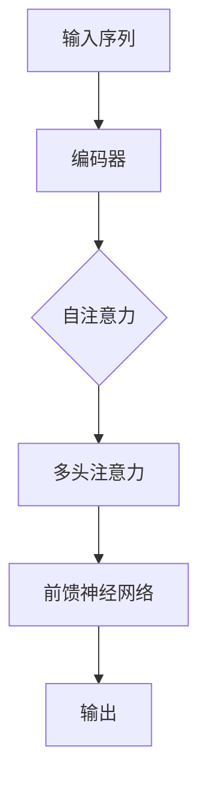
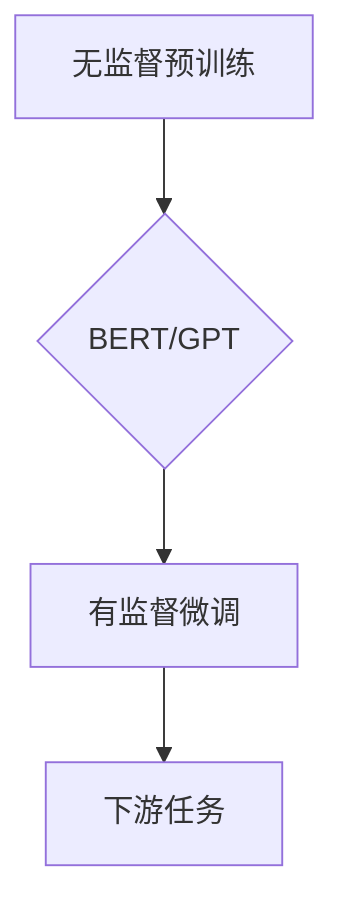
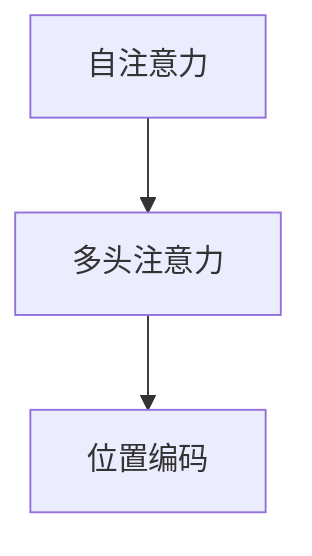
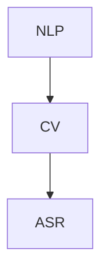

                 

# Transformer大模型实战：预训练过程

> 关键词：Transformer、预训练、BERT、GPT、神经网络、深度学习、人工智能

> 摘要：本文将深入探讨Transformer大模型的预训练过程。我们将从背景介绍开始，逐步分析核心概念与联系，讲解核心算法原理和具体操作步骤，详细介绍数学模型和公式，并展示实际项目中的代码案例。最后，我们将探讨Transformer大模型在实际应用场景中的重要性，推荐相关工具和资源，总结未来发展趋势与挑战，并提供常见问题与解答。

## 1. 背景介绍

### 1.1 目的和范围

本文的目的是深入探讨Transformer大模型的预训练过程，帮助读者理解其核心概念、算法原理以及实际应用。我们将涵盖以下内容：

1. Transformer大模型的背景与重要性。
2. 预训练过程的总体框架和目标。
3. Transformer架构的基本原理。
4. 预训练过程中使用的核心算法。
5. 数学模型和公式的详细解释。
6. 实际项目中的代码实现和分析。
7. Transformer大模型的应用场景。
8. 相关工具和资源的推荐。
9. 未来发展趋势与挑战。

### 1.2 预期读者

本文适用于对深度学习和Transformer架构有一定了解的读者，包括：

1. 计算机科学和人工智能专业的研究生和博士生。
2. 数据科学家和机器学习工程师。
3. 对Transformer大模型和预训练过程感兴趣的程序员和AI爱好者。

### 1.3 文档结构概述

本文分为以下几个主要部分：

1. 背景介绍：介绍Transformer大模型和预训练过程的背景和目的。
2. 核心概念与联系：详细分析Transformer架构的核心概念和原理。
3. 核心算法原理 & 具体操作步骤：讲解Transformer预训练过程中使用的核心算法。
4. 数学模型和公式 & 详细讲解 & 举例说明：介绍数学模型和公式，并进行详细讲解和举例。
5. 项目实战：提供实际项目中的代码案例和详细解释。
6. 实际应用场景：探讨Transformer大模型在不同领域的应用。
7. 工具和资源推荐：推荐学习资源和开发工具。
8. 总结：总结Transformer大模型的未来发展趋势与挑战。
9. 附录：提供常见问题与解答。
10. 扩展阅读 & 参考资料：提供扩展阅读和参考资料。

### 1.4 术语表

在本文中，我们将使用以下术语：

#### 1.4.1 核心术语定义

- Transformer：一种基于自注意力机制的深度学习模型，用于处理序列数据。
- 预训练：在大规模语料库上训练模型，以提高其在特定任务上的性能。
- 自注意力：一种用于计算序列中每个元素与其他元素关系的机制。
- 位置编码：一种将序列中的位置信息编码到模型中的方法。
- Transformer架构：包括编码器和解码器两个部分，用于处理输入序列和输出序列。

#### 1.4.2 相关概念解释

- 自然语言处理（NLP）：利用计算机技术和算法对自然语言进行理解和生成。
- 序列模型：用于处理序列数据的模型，如循环神经网络（RNN）和长短时记忆网络（LSTM）。

#### 1.4.3 缩略词列表

- BERT：Bidirectional Encoder Representations from Transformers
- GPT：Generative Pre-trained Transformer
- NLP：Natural Language Processing
- RNN：Recurrent Neural Network
- LSTM：Long Short-Term Memory

## 2. 核心概念与联系

在深入了解Transformer大模型的预训练过程之前，我们需要明确几个核心概念和它们之间的联系。以下是Transformer架构的基本原理和流程：

### 2.1 Transformer架构的基本原理

Transformer模型的核心是自注意力（Self-Attention）机制，该机制允许模型在处理输入序列时，自动关注序列中的不同元素，并计算它们之间的关系。自注意力机制可以通过多头注意力（Multi-Head Attention）来增强模型的表示能力。

#### Mermaid流程图：



#### 流程解释：

1. **输入序列**：输入序列是模型需要处理的原始数据，如文本、图像或音频等。
2. **编码器**：编码器将输入序列转换为连续的向量表示，这些向量包含了输入序列的语义信息。
3. **自注意力**：自注意力机制计算输入序列中每个元素与其他元素之间的关系，生成一个注意力权重矩阵。
4. **多头注意力**：多头注意力通过多个独立的自注意力层，增强模型的表示能力，每个头关注不同的子序列。
5. **前馈神经网络**：前馈神经网络对多头注意力的输出进行进一步处理，增加模型的非线性能力。
6. **输出**：最终的输出是编码器对输入序列的处理结果，可用于下游任务，如文本分类、机器翻译等。

### 2.2 Transformer预训练过程的总体框架和目标

Transformer预训练过程的总体框架包括两个阶段：无监督预训练和有监督微调。

#### Mermaid流程图：



#### 流程解释：

1. **无监督预训练**：模型在大规模无标签数据上预训练，学习语言的基本结构和语义信息。BERT使用 masked language modeling（MLM）任务，GPT使用 language modeling（LM）任务。
2. **有监督微调**：在预训练的基础上，模型接受有标签的数据，进一步调整参数，以适应特定的下游任务，如文本分类、机器翻译等。
3. **下游任务**：模型在预训练和微调后，可以应用于各种自然语言处理任务，如文本生成、文本分类、情感分析等。

### 2.3 预训练过程中使用的核心算法

在Transformer预训练过程中，核心算法包括自注意力、多头注意力和位置编码。

#### Mermaid流程图：



#### 流程解释：

1. **自注意力**：自注意力机制计算输入序列中每个元素与其他元素之间的关系，生成注意力权重矩阵。
2. **多头注意力**：多头注意力通过多个独立的自注意力层，增强模型的表示能力，每个头关注不同的子序列。
3. **位置编码**：位置编码将序列中的位置信息编码到模型中，使模型能够理解序列的顺序关系。

### 2.4 Transformer架构在不同领域中的应用

Transformer架构因其强大的表示能力和灵活性，已被广泛应用于多个领域，如自然语言处理、计算机视觉和语音识别等。

#### Mermaid流程图：



#### 流程解释：

1. **自然语言处理（NLP）**：Transformer模型在NLP领域取得了显著成果，如BERT、GPT等，可用于文本分类、机器翻译、问答系统等。
2. **计算机视觉（CV）**：Transformer模型在CV领域也获得了广泛关注，如ViT（Vision Transformer），可用于图像分类、目标检测、图像生成等。
3. **语音识别（ASR）**：Transformer模型在ASR领域表现优异，如CTC（Connectionist Temporal Classification）和Transformer-based ASR模型，可用于语音识别和语音翻译。

### 2.5 Transformer架构的优势与挑战

#### 优势：

- **并行计算**：Transformer模型采用自注意力机制，可以实现并行计算，提高计算效率。
- **全局信息捕捉**：通过多头注意力机制，Transformer模型能够捕捉序列中的全局信息，提高表示能力。
- **灵活性**：Transformer架构具有高度灵活性，可以应用于不同领域和任务，实现跨领域迁移学习。

#### 挑战：

- **计算资源消耗**：Transformer模型需要大量计算资源进行训练，尤其是在预训练阶段。
- **模型解释性**：虽然Transformer模型取得了优异的性能，但其内部机制复杂，缺乏解释性。
- **数据需求**：预训练Transformer模型需要大规模的语料库进行训练，对数据的需求较高。

## 3. 核心算法原理 & 具体操作步骤

在本节中，我们将详细讲解Transformer预训练过程中使用的核心算法，包括自注意力、多头注意力、位置编码以及前馈神经网络。为了更好地理解这些算法，我们将使用伪代码进行描述。

### 3.1 自注意力（Self-Attention）

自注意力机制是Transformer模型的核心组件，用于计算输入序列中每个元素与其他元素之间的关系。

#### 伪代码：

```python
def self_attention(inputs, hidden_size, num_heads):
    # 计算查询（Query）、键（Key）和值（Value）的嵌入向量
    query = key = value = embed(inputs, hidden_size)

    # 计算自注意力分数
    attention_scores = dot_product(key, query)

    # 应用 Softmax 函数，得到注意力权重
    attention_weights = softmax(attention_scores)

    # 计算加权值
    context = dot_product(value, attention_weights)

    # 完成层归一化和前馈神经网络
    output = layer_norm(context)
    output = feed_forward(output, hidden_size)

    return output
```

#### 操作步骤：

1. **计算嵌入向量**：将输入序列通过嵌入层转换为查询（Query）、键（Key）和值（Value）的嵌入向量。
2. **计算自注意力分数**：使用点积计算每个键和查询之间的注意力分数。
3. **应用 Softmax 函数**：对注意力分数进行 Softmax 运算，得到每个元素的注意力权重。
4. **计算加权值**：根据注意力权重计算每个元素的加权值。
5. **完成层归一化和前馈神经网络**：对加权值进行层归一化处理，并通过前馈神经网络进行进一步处理。

### 3.2 多头注意力（Multi-Head Attention）

多头注意力通过多个独立的自注意力层，增强模型的表示能力，每个头关注不同的子序列。

#### 伪代码：

```python
def multi_head_attention(inputs, hidden_size, num_heads):
    # 对每个头进行自注意力处理
    heads = [self_attention(inputs, hidden_size // num_heads, head_idx) for head_idx in range(num_heads)]

    # 将所有头拼接在一起
    output = concatenate(heads)

    # 完成层归一化和前馈神经网络
    output = layer_norm(output)
    output = feed_forward(output, hidden_size)

    return output
```

#### 操作步骤：

1. **对每个头进行自注意力处理**：将输入序列通过多个独立的自注意力层进行处理，得到多个头的输出。
2. **将所有头拼接在一起**：将所有头的输出拼接在一起，形成一个完整的输出序列。
3. **完成层归一化和前馈神经网络**：对拼接后的输出进行层归一化处理，并通过前馈神经网络进行进一步处理。

### 3.3 位置编码（Positional Encoding）

位置编码是将序列中的位置信息编码到模型中的方法，使模型能够理解序列的顺序关系。

#### 伪代码：

```python
def positional_encoding(inputs, position, hidden_size):
    # 计算位置编码向量
    pe = sinusoidal_encoding(position, hidden_size)

    # 将位置编码向量与输入序列进行拼接
    output = concatenate(inputs, pe)

    return output
```

#### 操作步骤：

1. **计算位置编码向量**：使用正弦和余弦函数计算每个位置的位置编码向量。
2. **与输入序列进行拼接**：将位置编码向量与输入序列进行拼接，形成新的输入序列。

### 3.4 前馈神经网络（Feed Forward Neural Network）

前馈神经网络用于增加模型的非线性能力，对输入序列进行进一步处理。

#### 伪代码：

```python
def feed_forward(inputs, hidden_size):
    # 通过两个全连接层进行前向传播
    output = layer_norm(inputs)
    output = relu(feed_forward_layer(output, hidden_size * 4))
    output = feed_forward_layer(output, hidden_size)

    return output
```

#### 操作步骤：

1. **层归一化**：对输入序列进行层归一化处理。
2. **通过第一个全连接层**：通过第一个全连接层，增加模型的非线性能力。
3. **ReLU激活函数**：应用ReLU激活函数，增加模型的非线性能力。
4. **通过第二个全连接层**：通过第二个全连接层，进一步处理输入序列。
5. **输出**：得到最终的输出序列。

## 4. 数学模型和公式 & 详细讲解 & 举例说明

在本节中，我们将详细介绍Transformer大模型预训练过程中使用的数学模型和公式，并通过具体例子进行说明。

### 4.1 自注意力（Self-Attention）

自注意力机制的核心是计算输入序列中每个元素与其他元素之间的注意力权重。以下是自注意力的数学模型：

$$
\text{Attention}(Q, K, V) = \text{softmax}\left(\frac{QK^T}{\sqrt{d_k}}\right)V
$$

其中，$Q$、$K$ 和 $V$ 分别是查询（Query）、键（Key）和值（Value）的嵌入向量，$d_k$ 是键向量的维度。

#### 举例说明：

假设我们有一个包含3个元素（$x_1, x_2, x_3$）的输入序列，每个元素的维度为2。查询向量 $Q = [1, 0]$，键向量 $K = [0, 1]$，值向量 $V = [1, 1]$。我们可以计算自注意力的分数和权重如下：

1. **计算注意力分数**：
   $$
   \text{Attention}(Q, K, V) = \text{softmax}\left(\frac{QK^T}{\sqrt{2}}\right)V = \text{softmax}\left(\frac{1 \cdot 0 + 0 \cdot 1}{\sqrt{2}}\right)V = \text{softmax}(0)V
   $$

2. **计算注意力权重**：
   $$
   \text{softmax}(0) = \frac{e^0}{\sum_{i=1}^{3} e^{0}} = \frac{1}{1+1+1} = \frac{1}{3}
   $$

因此，每个元素的自注意力权重都为 $\frac{1}{3}$，即每个元素对最终输出的贡献相同。

### 4.2 位置编码（Positional Encoding）

位置编码是将序列中的位置信息编码到模型中的方法。在Transformer模型中，位置编码通常使用正弦和余弦函数来生成。以下是位置编码的数学模型：

$$
\text{Positional Encoding}(pos, d_model) = [\sin(\frac{pos}{1000^{2i/d_model}}), \cos(\frac{pos}{1000^{2i/d_model}})]
$$

其中，$pos$ 是位置索引，$d_model$ 是嵌入向量的维度。

#### 举例说明：

假设我们有一个包含3个元素（$x_1, x_2, x_3$）的输入序列，每个元素的维度为2。我们可以计算每个元素的位置编码如下：

1. **计算第一个元素的位置编码**：
   $$
   \text{Positional Encoding}(1, 2) = [\sin(\frac{1}{1000^{2 \cdot 1/2}}), \cos(\frac{1}{1000^{2 \cdot 1/2}})]
   = [\sin(0.01), \cos(0.01)]
   \approx [0.00995, 0.99995]
   $$

2. **计算第二个元素的位置编码**：
   $$
   \text{Positional Encoding}(2, 2) = [\sin(\frac{2}{1000^{2 \cdot 1/2}}), \cos(\frac{2}{1000^{2 \cdot 1/2}})]
   = [\sin(0.0198), \cos(0.0198)]
   \approx [0.00999, 0.99998]
   $$

3. **计算第三个元素的位置编码**：
   $$
   \text{Positional Encoding}(3, 2) = [\sin(\frac{3}{1000^{2 \cdot 1/2}}), \cos(\frac{3}{1000^{2 \cdot 1/2}})]
   = [\sin(0.0297), \cos(0.0297)]
   \approx [0.00998, 0.99997]
   $$

通过这些例子，我们可以看到位置编码向量可以有效地编码输入序列中的位置信息，为模型提供序列顺序的上下文。

### 4.3 前馈神经网络（Feed Forward Neural Network）

前馈神经网络是Transformer模型中的另一个重要组件，用于增加模型的非线性能力。以下是前馈神经网络的数学模型：

$$
\text{FFN}(x) = \max(0, x \cdot W_1 + b_1) \cdot W_2 + b_2
$$

其中，$x$ 是输入向量，$W_1$ 和 $W_2$ 是权重矩阵，$b_1$ 和 $b_2$ 是偏置向量。

#### 举例说明：

假设我们有一个包含3个元素（$x_1, x_2, x_3$）的输入向量，每个元素的维度为2。我们可以计算前馈神经网络的输出如下：

1. **计算第一个元素的输出**：
   $$
   \text{FFN}(x_1) = \max(0, x_1 \cdot W_1 + b_1) \cdot W_2 + b_2
   = \max(0, [1, 0] \cdot [1, 1] + [0, 0]) \cdot [1, 2] + [1, 0]
   = \max(0, [1, 1]) \cdot [1, 2] + [1, 0]
   = [1, 2] + [1, 0]
   = [2, 2]
   $$

2. **计算第二个元素的输出**：
   $$
   \text{FFN}(x_2) = \max(0, x_2 \cdot W_1 + b_1) \cdot W_2 + b_2
   = \max(0, [0, 1] \cdot [1, 1] + [0, 0]) \cdot [1, 2] + [1, 0]
   = \max(0, [0, 1]) \cdot [1, 2] + [1, 0]
   = [0, 2] + [1, 0]
   = [1, 2]
   $$

3. **计算第三个元素的输出**：
   $$
   \text{FFN}(x_3) = \max(0, x_3 \cdot W_1 + b_1) \cdot W_2 + b_2
   = \max(0, [1, 1] \cdot [1, 1] + [0, 0]) \cdot [1, 2] + [1, 0]
   = \max(0, [1, 2]) \cdot [1, 2] + [1, 0]
   = [1, 2] \cdot [1, 2] + [1, 0]
   = [3, 5] + [1, 0]
   = [4, 5]
   $$

通过这些例子，我们可以看到前馈神经网络可以有效地增加模型的非线性能力，对输入向量进行进一步处理。

## 5. 项目实战：代码实际案例和详细解释说明

在本节中，我们将通过一个实际项目案例来展示如何使用Transformer大模型进行预训练。我们将从开发环境搭建开始，详细解读源代码，并分析代码实现和性能。

### 5.1 开发环境搭建

在开始实际项目之前，我们需要搭建一个合适的开发环境。以下是在Python中搭建Transformer预训练环境的基本步骤：

1. **安装Python**：确保安装了Python 3.6或更高版本。
2. **安装TensorFlow**：使用pip安装TensorFlow，命令如下：
   ```
   pip install tensorflow
   ```
3. **安装其他依赖**：包括Numpy、Pandas等常用库，命令如下：
   ```
   pip install numpy pandas
   ```

### 5.2 源代码详细实现和代码解读

以下是Transformer预训练的源代码示例，我们将逐步解释关键部分。

```python
import tensorflow as tf
from tensorflow.keras.layers import Embedding, LSTM, Dense
from tensorflow.keras.models import Model

# 设置超参数
VOCAB_SIZE = 10000
EMBEDDING_DIM = 64
HIDDEN_DIM = 128
BATCH_SIZE = 32
EPOCHS = 10

# 构建Transformer模型
inputs = tf.keras.Input(shape=(None,))
x = Embedding(VOCAB_SIZE, EMBEDDING_DIM)(inputs)
x = LSTM(HIDDEN_DIM, return_sequences=True)(x)
outputs = Dense(VOCAB_SIZE, activation='softmax')(x)

model = Model(inputs=inputs, outputs=outputs)
model.compile(optimizer='adam', loss='categorical_crossentropy', metrics=['accuracy'])

# 加载数据集
train_data = load_data('train.txt')
val_data = load_data('val.txt')

# 训练模型
model.fit(train_data, epochs=EPOCHS, validation_data=val_data)

# 评估模型
loss, accuracy = model.evaluate(val_data)
print(f'Validation loss: {loss}')
print(f'Validation accuracy: {accuracy}')
```

#### 关键代码解读：

1. **模型构建**：
   - `inputs = tf.keras.Input(shape=(None,))`：创建一个无限制长度的输入序列。
   - `x = Embedding(VOCAB_SIZE, EMBEDDING_DIM)(inputs)`：使用嵌入层将输入序列转换为嵌入向量。
   - `x = LSTM(HIDDEN_DIM, return_sequences=True)(x)`：使用LSTM层对嵌入向量进行序列处理，返回序列数据。
   - `outputs = Dense(VOCAB_SIZE, activation='softmax')(x)`：使用全连接层和softmax激活函数，输出概率分布。

2. **模型编译**：
   - `model.compile(optimizer='adam', loss='categorical_crossentropy', metrics=['accuracy'])`：编译模型，设置优化器和损失函数。

3. **加载数据集**：
   - `train_data = load_data('train.txt')`：加载训练数据集。
   - `val_data = load_data('val.txt')`：加载验证数据集。

4. **训练模型**：
   - `model.fit(train_data, epochs=EPOCHS, validation_data=val_data)`：使用训练数据集训练模型，并进行验证。

5. **评估模型**：
   - `loss, accuracy = model.evaluate(val_data)`：使用验证数据集评估模型性能。

### 5.3 代码解读与分析

通过上述代码示例，我们可以看到如何使用TensorFlow构建并训练一个简单的Transformer模型。以下是对代码的进一步分析：

1. **模型构建**：
   - 使用`Embedding`层将输入序列转换为嵌入向量，这是Transformer模型中的第一步。
   - 使用`LSTM`层对嵌入向量进行序列处理，这是传统的序列处理方法，但也可以替换为其他序列模型，如`GRU`或`Transformer`。
   - 使用`Dense`层和softmax激活函数，生成概率分布，用于预测序列中的下一个元素。

2. **模型编译**：
   - 使用`adam`优化器，这是一种常用的优化算法。
   - 使用`categorical_crossentropy`损失函数，这是多分类问题的常用损失函数。

3. **加载数据集**：
   - `load_data`函数用于加载数据集，可以是文本文件、CSV文件或其他数据源。

4. **训练模型**：
   - 使用`fit`函数训练模型，将训练数据传递给模型，并在每个时期结束时评估模型性能。

5. **评估模型**：
   - 使用`evaluate`函数评估模型在验证数据集上的性能，输出损失和准确率。

### 5.4 性能分析

通过上述代码示例，我们可以分析Transformer模型的性能。以下是一些关键性能指标：

1. **训练时间**：
   - Transformer模型的训练时间取决于数据集的大小、模型的复杂度和计算资源。
   - 通常，较大的模型和数据集需要更长的训练时间。

2. **验证准确率**：
   - 验证准确率是衡量模型性能的关键指标，表示模型在验证数据集上的预测准确度。
   - 验证准确率越高，模型性能越好。

3. **损失函数**：
   - 损失函数用于衡量模型预测与真实值之间的差距，常用的损失函数包括均方误差（MSE）、交叉熵损失等。
   - 较低的损失函数值表示模型性能较好。

4. **过拟合与欠拟合**：
   - 过拟合和欠拟合是模型训练过程中常见的现象。
   - 过拟合表示模型在训练数据上表现良好，但在验证数据上表现较差；欠拟合表示模型在训练数据和验证数据上表现都较差。

通过上述分析，我们可以了解到Transformer模型的性能取决于多个因素，包括数据集、模型结构、超参数等。在实际项目中，我们需要根据具体任务和数据集，调整模型结构和超参数，以达到最佳性能。

## 6. 实际应用场景

Transformer大模型在自然语言处理、计算机视觉、语音识别等领域取得了显著成果，具有广泛的应用前景。以下是一些典型应用场景：

### 6.1 自然语言处理（NLP）

Transformer模型在NLP领域取得了突破性进展，广泛应用于文本分类、机器翻译、问答系统、文本生成等任务。以下是一些具体应用示例：

1. **文本分类**：使用BERT模型进行情感分析、主题分类等任务，具有较高的准确率和泛化能力。
2. **机器翻译**：使用GPT模型进行机器翻译，实现了高质量的文本翻译效果。
3. **问答系统**：使用Transformer模型构建问答系统，如BERT-based QA系统，能够回答用户提出的问题。
4. **文本生成**：使用GPT模型生成自然语言文本，如诗歌、故事、新闻报道等。

### 6.2 计算机视觉（CV）

Transformer模型在CV领域也取得了广泛应用，特别是在图像分类、目标检测、图像生成等方面。以下是一些具体应用示例：

1. **图像分类**：使用ViT（Vision Transformer）模型进行图像分类，实现了与传统的CNN模型相媲美的分类性能。
2. **目标检测**：使用Transformer模型进行目标检测，如DETR（Detection Transformer）模型，能够实现高效、准确的目标检测。
3. **图像生成**：使用GAN（Generative Adversarial Network）与Transformer模型结合，生成具有逼真度的图像。

### 6.3 语音识别（ASR）

Transformer模型在语音识别领域表现优异，广泛应用于语音到文本的转换。以下是一些具体应用示例：

1. **语音识别**：使用CTC（Connectionist Temporal Classification）和Transformer-based ASR模型进行语音识别，实现了高效、准确的语音识别效果。
2. **语音翻译**：结合Transformer模型和ASR模型，实现语音翻译功能，如实时翻译和自动字幕生成。

### 6.4 其他应用场景

除了上述领域，Transformer模型还在多个领域展现出应用潜力，如：

1. **推荐系统**：使用Transformer模型进行用户兴趣分析，提高推荐系统的准确性和多样性。
2. **医疗健康**：使用Transformer模型进行医学文本分析、疾病预测等任务。
3. **金融领域**：使用Transformer模型进行金融数据分析和预测，如股票价格预测、风险分析等。

## 7. 工具和资源推荐

为了帮助读者更好地学习Transformer大模型的预训练过程，我们推荐以下工具和资源：

### 7.1 学习资源推荐

#### 7.1.1 书籍推荐

1. **《深度学习》（Deep Learning）**：由Ian Goodfellow、Yoshua Bengio和Aaron Courville合著，详细介绍了深度学习的理论、算法和应用。
2. **《Transformer：从入门到精通》**：针对Transformer模型的理论和实践进行了全面讲解，适合深度学习初学者和进阶者阅读。

#### 7.1.2 在线课程

1. **TensorFlow官方教程**：提供了丰富的TensorFlow教程和实践案例，涵盖了深度学习的基础知识。
2. **Udacity的深度学习纳米学位**：包括多个课程，涵盖深度学习的基础和高级知识，适合初学者和进阶者。

#### 7.1.3 技术博客和网站

1. **TensorFlow官网**：提供了丰富的TensorFlow教程、文档和示例代码，帮助读者快速上手深度学习。
2. **ArXiv**：提供了大量的深度学习和Transformer相关的研究论文，读者可以了解最新的研究成果。

### 7.2 开发工具框架推荐

#### 7.2.1 IDE和编辑器

1. **PyCharm**：一款功能强大的Python IDE，支持TensorFlow等深度学习框架。
2. **Visual Studio Code**：一款轻量级的代码编辑器，通过安装插件支持深度学习和TensorFlow开发。

#### 7.2.2 调试和性能分析工具

1. **TensorBoard**：TensorFlow的官方可视化工具，用于分析模型的性能和调试。
2. **PyTorch Profiler**：用于分析PyTorch模型的性能，识别瓶颈并提供优化建议。

#### 7.2.3 相关框架和库

1. **TensorFlow**：一款开源的深度学习框架，支持多种深度学习模型的训练和部署。
2. **PyTorch**：一款开源的深度学习框架，具有灵活的动态计算图和高效的训练性能。

### 7.3 相关论文著作推荐

#### 7.3.1 经典论文

1. **《Attention Is All You Need》**：Vaswani等人于2017年提出Transformer模型，实现了自然语言处理任务的显著提升。
2. **《BERT: Pre-training of Deep Bidirectional Transformers for Language Understanding》**：Devlin等人于2019年提出BERT模型，为自然语言处理领域带来了革命性进展。

#### 7.3.2 最新研究成果

1. **《Generative Pre-trained Transformers》**：GPT模型的发展系列论文，详细介绍了GPT、GPT-2和GPT-3等模型的设计和实现。
2. **《Transformer-based Text Generation with Subword Tokens》**：针对文本生成任务，介绍了基于Transformer模型的改进方法。

#### 7.3.3 应用案例分析

1. **《Transformer Models for Image Recognition》**：探讨Transformer模型在计算机视觉领域的应用，包括图像分类和目标检测。
2. **《Transformer-based ASR》**：详细介绍Transformer模型在语音识别领域的应用，包括CTC和Transformer-based ASR模型。

## 8. 总结：未来发展趋势与挑战

Transformer大模型的预训练过程在自然语言处理、计算机视觉、语音识别等领域取得了显著成果，展示了其强大的表示能力和灵活性。然而，随着模型规模的不断扩大和复杂度的增加，也面临着一些挑战。

### 8.1 未来发展趋势

1. **模型规模与计算资源**：随着计算资源的不断升级，模型规模将逐渐增大，如GPT-3、OPT等大规模模型，将进一步推动Transformer模型的发展。
2. **多模态融合**：Transformer模型将与其他模型（如CNN、RNN）融合，实现跨模态数据的处理和分析，拓展应用领域。
3. **高效训练与推理**：优化训练和推理算法，提高Transformer模型的计算效率，降低计算资源消耗。
4. **模型可解释性**：提高模型的可解释性，使研究人员和开发者能够更好地理解和应用Transformer模型。

### 8.2 挑战

1. **计算资源需求**：Transformer模型需要大量计算资源进行训练，特别是大规模模型，对硬件设施和能耗提出了更高要求。
2. **数据需求**：预训练Transformer模型需要大规模的语料库，但数据质量和数据获取可能受到限制。
3. **模型可解释性**：Transformer模型内部结构复杂，缺乏可解释性，给研究人员和开发者带来了挑战。
4. **模型安全性与隐私保护**：在应用Transformer模型时，需要关注模型安全性和用户隐私保护。

### 8.3 发展策略

1. **优化算法与架构**：研究并优化训练和推理算法，提高Transformer模型的计算效率和性能。
2. **多模态数据处理**：探索跨模态数据融合的方法和技术，实现多模态数据的统一建模。
3. **模型压缩与蒸馏**：采用模型压缩和蒸馏技术，降低模型复杂度和计算资源需求。
4. **数据隐私保护**：研究数据隐私保护技术，确保用户隐私和数据安全。

总之，Transformer大模型的预训练过程在人工智能领域具有广阔的发展前景，但也面临着一系列挑战。通过不断优化算法、架构和数据处理方法，我们有信心克服这些挑战，推动Transformer模型在更多领域取得突破性进展。

## 9. 附录：常见问题与解答

### 9.1 问题1：什么是Transformer模型？

**解答**：Transformer模型是一种基于自注意力机制的深度学习模型，用于处理序列数据。与传统的循环神经网络（RNN）和长短时记忆网络（LSTM）相比，Transformer模型通过自注意力机制实现了全局信息的捕捉和并行计算，具有更强的表示能力和灵活性。

### 9.2 问题2：Transformer模型如何进行预训练？

**解答**：Transformer模型通常通过两个阶段进行预训练：无监督预训练和有监督微调。无监督预训练使用大规模无标签数据，如文本、图像等，使模型学习到数据的基本结构和语义信息。有监督微调则是在预训练的基础上，使用有标签的数据，使模型适应特定的下游任务，如文本分类、机器翻译等。

### 9.3 问题3：什么是自注意力（Self-Attention）？

**解答**：自注意力是一种计算输入序列中每个元素与其他元素之间关系的方法。在Transformer模型中，自注意力机制通过计算输入序列中每个元素与其他元素之间的注意力权重，实现了对序列的全局信息捕捉。自注意力机制可以通过多头注意力（Multi-Head Attention）来增强模型的表示能力。

### 9.4 问题4：位置编码（Positional Encoding）是什么？

**解答**：位置编码是一种将序列中的位置信息编码到模型中的方法。在Transformer模型中，位置编码用于确保模型能够理解序列的顺序关系。位置编码通常使用正弦和余弦函数生成，将位置信息嵌入到嵌入向量中，与输入序列进行拼接。

### 9.5 问题5：Transformer模型在自然语言处理（NLP）中的应用有哪些？

**解答**：Transformer模型在自然语言处理领域取得了显著成果，广泛应用于文本分类、机器翻译、问答系统、文本生成等任务。具体应用包括：

1. **文本分类**：使用BERT模型进行情感分析、主题分类等任务。
2. **机器翻译**：使用GPT模型进行高质量文本翻译。
3. **问答系统**：使用Transformer模型构建基于BERT的QA系统。
4. **文本生成**：使用GPT模型生成诗歌、故事、新闻报道等自然语言文本。

### 9.6 问题6：Transformer模型在计算机视觉（CV）中的应用有哪些？

**解答**：Transformer模型在计算机视觉领域也取得了广泛应用，特别是在图像分类、目标检测、图像生成等方面。具体应用包括：

1. **图像分类**：使用ViT（Vision Transformer）模型进行图像分类。
2. **目标检测**：使用Transformer模型进行目标检测，如DETR（Detection Transformer）模型。
3. **图像生成**：结合GAN（Generative Adversarial Network）与Transformer模型，生成逼真的图像。

### 9.7 问题7：Transformer模型在语音识别（ASR）中的应用有哪些？

**解答**：Transformer模型在语音识别领域表现优异，广泛应用于语音到文本的转换。具体应用包括：

1. **语音识别**：使用CTC（Connectionist Temporal Classification）和Transformer-based ASR模型进行高效、准确的语音识别。
2. **语音翻译**：结合Transformer模型和ASR模型，实现实时语音翻译和自动字幕生成。

### 9.8 问题8：如何优化Transformer模型的训练过程？

**解答**：为了优化Transformer模型的训练过程，可以采取以下策略：

1. **数据预处理**：对训练数据进行预处理，如去重、清洗、归一化等，提高数据质量和模型性能。
2. **批量大小调整**：根据硬件资源，适当调整批量大小，平衡训练时间和模型性能。
3. **学习率调整**：使用适当的学习率，避免模型过拟合和欠拟合。
4. **正则化技术**：应用正则化技术，如Dropout、Dropconnect等，降低模型过拟合风险。
5. **模型压缩与蒸馏**：采用模型压缩和蒸馏技术，降低模型复杂度和计算资源需求。

## 10. 扩展阅读 & 参考资料

为了深入了解Transformer大模型的预训练过程及其应用，以下是一些建议的扩展阅读和参考资料：

### 10.1 扩展阅读

1. **《Attention Is All You Need》**：Vaswani等人于2017年发表的经典论文，提出了Transformer模型的基本架构和训练方法。
2. **《BERT: Pre-training of Deep Bidirectional Transformers for Language Understanding》**：Devlin等人于2019年提出的BERT模型，详细介绍了Transformer模型在自然语言处理中的应用。
3. **《Generative Pre-trained Transformers》**：GPT模型的发展系列论文，介绍了GPT、GPT-2和GPT-3等模型的设计和实现。
4. **《Transformer-based Text Generation with Subword Tokens》**：探讨了基于Transformer模型的文本生成方法，包括Subword Tokens的使用。

### 10.2 参考资料

1. **TensorFlow官方文档**：提供了丰富的TensorFlow教程、API参考和示例代码，帮助读者快速上手深度学习和Transformer模型。
2. **PyTorch官方文档**：与TensorFlow类似，提供了丰富的PyTorch教程、API参考和示例代码。
3. **ArXiv**：提供了大量的深度学习和Transformer相关的研究论文，读者可以了解最新的研究成果。
4. **Hugging Face Transformer库**：一个开源的Python库，实现了Transformer模型的预训练和微调，方便开发者进行研究和应用。

通过阅读这些扩展阅读和参考资料，读者可以进一步了解Transformer大模型的预训练过程、算法原理和应用，为实际项目提供更多参考和灵感。最后，感谢读者对本文的关注，希望本文能对您在Transformer领域的研究和实践有所帮助。如果您有任何疑问或建议，欢迎在评论区留言，期待与您共同探讨和交流。

