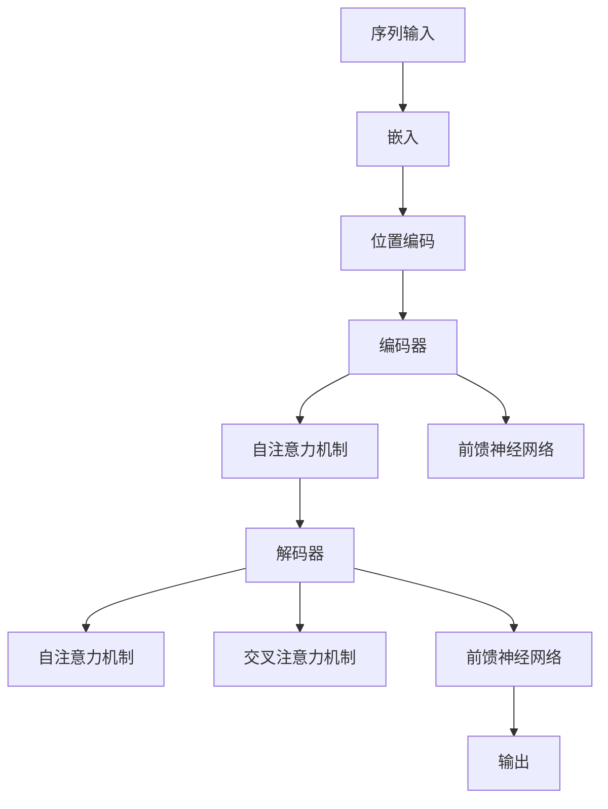
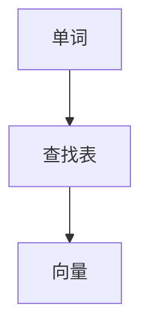
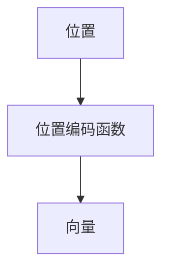
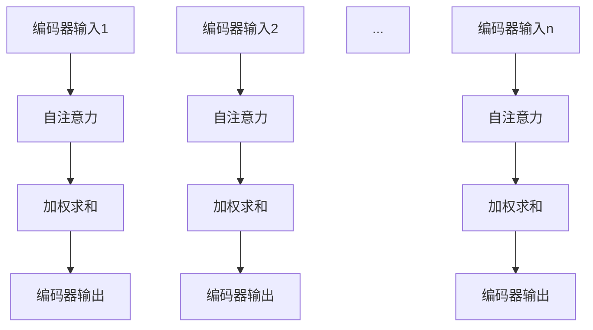
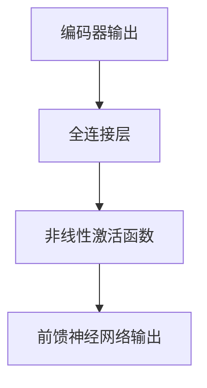
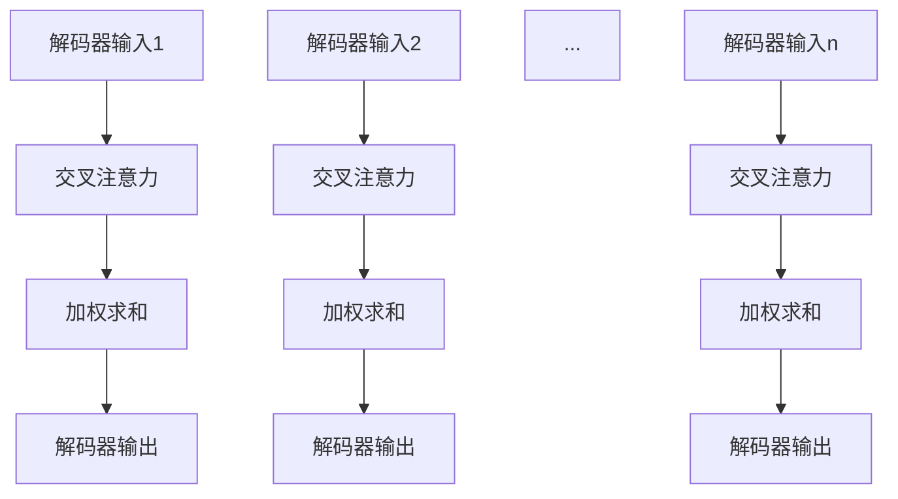

                 

# Transformer架构剖析

> 关键词：Transformer，序列到序列模型，自注意力机制，神经网络，深度学习，机器翻译，自然语言处理

> 摘要：本文将深入剖析Transformer架构，从其核心概念、算法原理到数学模型，再到实际应用场景，全面介绍这一革命性的深度学习模型。通过详细的分析与案例，帮助读者理解Transformer如何改变自然语言处理领域，以及其潜在的发展趋势与挑战。

## 1. 背景介绍

### 1.1 目的和范围

本文旨在为读者提供关于Transformer架构的全面理解。我们将探讨Transformer的起源、发展，以及其在自然语言处理（NLP）领域的广泛应用。通过逐步解析Transformer的核心概念和算法原理，本文将帮助读者掌握Transformer的内在工作原理，并理解其在实践中的应用。

### 1.2 预期读者

本文适合对深度学习和自然语言处理有一定基础的读者。无论您是NLP领域的研究者，还是对深度学习感兴趣的程序员，本文都将为您带来有价值的知识。通过本文的学习，读者将能够：

- 理解Transformer架构的基本原理和核心概念。
- 掌握自注意力机制的实现方法。
- 分析Transformer在NLP任务中的优势和应用场景。
- 了解Transformer的数学模型和实现细节。

### 1.3 文档结构概述

本文分为十个部分，具体结构如下：

1. 背景介绍：介绍文章的目的、范围、预期读者和文档结构。
2. 核心概念与联系：阐述Transformer的核心概念和架构。
3. 核心算法原理 & 具体操作步骤：详细讲解Transformer的核心算法原理和实现步骤。
4. 数学模型和公式 & 详细讲解 & 举例说明：介绍Transformer的数学模型和公式，并给出实际应用案例。
5. 项目实战：代码实际案例和详细解释说明。
6. 实际应用场景：分析Transformer在不同领域的应用场景。
7. 工具和资源推荐：推荐相关学习资源、开发工具和框架。
8. 总结：未来发展趋势与挑战。
9. 附录：常见问题与解答。
10. 扩展阅读 & 参考资料：提供更多扩展阅读资料。

### 1.4 术语表

#### 1.4.1 核心术语定义

- Transformer：一种基于自注意力机制的深度学习模型，用于处理序列数据。
- 自注意力机制（Self-Attention）：一种计算序列中各个元素之间相互依赖性的机制。
- 位置编码（Positional Encoding）：用于在序列中引入位置信息的编码方法。
- 嵌入（Embedding）：将输入序列中的单词或字符映射为固定大小的向量。
- 编码器（Encoder）：用于对输入序列进行编码的神经网络。
- 解码器（Decoder）：用于对编码后的序列进行解码的神经网络。

#### 1.4.2 相关概念解释

- 自然语言处理（NLP）：研究如何使计算机理解和处理自然语言的学科。
- 深度学习（Deep Learning）：一种基于人工神经网络的学习方法，通过多层非线性变换来提取特征。
- 序列到序列模型（Seq2Seq）：一种用于处理序列数据转化的深度学习模型。

#### 1.4.3 缩略词列表

- NLP：自然语言处理
- Transformer：变换器
- Encoder：编码器
- Decoder：解码器
- self-attention：自注意力

## 2. 核心概念与联系

在深入探讨Transformer架构之前，我们需要先了解其核心概念和架构。下面将使用Mermaid流程图来描述Transformer的核心概念和架构。



### 2.1 核心概念解析

#### 嵌入（Embedding）

嵌入是一种将输入序列（如单词或字符）映射为固定大小的向量表示的方法。在Transformer中，嵌入层将输入序列中的每个单词或字符映射为一个向量。嵌入层可以看作是一个查找表，将输入序列中的每个元素映射为一个向量。



#### 位置编码（Positional Encoding）

由于嵌入层只能表示单词或字符的语义信息，而无法表示单词或字符在序列中的位置信息。因此，Transformer引入了位置编码（Positional Encoding）来为序列中的每个元素赋予位置信息。位置编码可以看作是一个函数，将位置信息映射为一个向量。



#### 编码器（Encoder）

编码器（Encoder）是一个由多个自注意力层和前馈神经网络组成的深度神经网络。编码器的目的是对输入序列进行编码，生成表示输入序列的固定长度的向量。编码器的输出通常用于后续的解码过程。

#### 自注意力机制（Self-Attention）

自注意力机制是一种计算序列中各个元素之间依赖关系的机制。在Transformer中，每个元素都会与其余所有元素建立注意力关系，并通过加权求和的方式计算出一个表示序列的固定长度向量。自注意力机制使得Transformer能够捕捉序列中的长距离依赖关系。



#### 前馈神经网络（Feed-Forward Neural Network）

前馈神经网络是一种简单的神经网络结构，用于对编码器的输出进行进一步处理。前馈神经网络通常由多个全连接层组成，每个全连接层都会对输入进行线性变换，然后通过一个非线性激活函数。



#### 解码器（Decoder）

解码器（Decoder）与编码器类似，也是由多个自注意力层和前馈神经网络组成的深度神经网络。解码器的目的是对编码器输出的固定长度向量进行解码，生成目标序列的预测。

#### 交叉注意力机制（Cross-Attention）

交叉注意力机制是一种计算编码器输出和解码器输入之间依赖关系的机制。在解码过程中，每个解码器输出都会与编码器输出建立交叉注意力关系，并通过加权求和的方式计算出一个表示解码器输出的固定长度向量。



通过以上核心概念的介绍，我们可以更好地理解Transformer的架构和原理。在接下来的章节中，我们将深入探讨Transformer的核心算法原理和具体实现步骤。

## 3. 核心算法原理 & 具体操作步骤

在了解了Transformer的核心概念和架构之后，我们将进一步探讨其核心算法原理和具体操作步骤。Transformer的核心算法主要包括自注意力机制（Self-Attention）和前馈神经网络（Feed-Forward Neural Network）。下面将使用伪代码详细阐述Transformer的算法原理和具体操作步骤。

### 3.1 自注意力机制

自注意力机制是Transformer的核心算法之一，它通过计算序列中各个元素之间的依赖关系，实现对输入序列的编码。下面是自注意力机制的伪代码实现：

```python
def self_attention(Q, K, V, mask=None):
    """
    计算自注意力得分，Q为查询向量，K为键向量，V为值向量，mask为遮罩。

    参数：
    - Q: 查询向量，形状为[batch_size, sequence_length, hidden_size]
    - K: 键向量，形状为[batch_size, sequence_length, hidden_size]
    - V: 值向量，形状为[batch_size, sequence_length, hidden_size]
    - mask: 遮罩，形状为[batch_size, sequence_length]，用于屏蔽不需要计算依赖的元素。

    返回：
    - attention_scores: 自注意力得分，形状为[batch_size, sequence_length, sequence_length]
    - attention_weights: 自注意力权重，形状为[batch_size, sequence_length, sequence_length]
    """

    # 计算点积注意力得分
    attention_scores = dot(Q, K.T) / (hidden_size ** 0.5)

    # 应用于遮罩
    if mask is not None:
        attention_scores = attention_scores.masked_fill(mask, float("-inf"))

    # 通过softmax函数计算注意力权重
    attention_weights = softmax(attention_scores)

    # 加权求和计算输出
    output = dot(attention_weights, V)

    return output, attention_weights
```

### 3.2 前馈神经网络

前馈神经网络（Feed-Forward Neural Network）是Transformer中的另一个核心组件，用于对自注意力机制的输出进行进一步处理。下面是前馈神经网络的伪代码实现：

```python
def feed_forward_network(input, hidden_size, feed_forward_size):
    """
    计算前馈神经网络输出，input为输入，hidden_size为隐藏层大小，feed_forward_size为前馈层大小。

    参数：
    - input: 输入，形状为[batch_size, sequence_length, hidden_size]
    - hidden_size: 隐藏层大小
    - feed_forward_size: 前馈层大小

    返回：
    - output: 前馈神经网络输出，形状为[batch_size, sequence_length, hidden_size]
    """

    # 通过两个全连接层和ReLU激活函数实现前馈神经网络
    hidden = linear(input, hidden_size)
    hidden = relu(hidden)
    output = linear(hidden, feed_forward_size)

    return output
```

### 3.3 Transformer操作步骤

Transformer的操作步骤可以概括为以下几个步骤：

1. **嵌入**：将输入序列映射为嵌入向量。
2. **位置编码**：为嵌入向量添加位置编码，使其包含序列的位置信息。
3. **编码器（Encoder）**：
   - **自注意力层**：通过自注意力机制计算序列中各个元素之间的依赖关系。
   - **前馈神经网络层**：对自注意力层的输出进行进一步处理。
4. **解码器（Decoder）**：
   - **自注意力层**：计算解码器输入（编码器输出）之间的依赖关系。
   - **交叉注意力层**：计算编码器输出和解码器输入之间的依赖关系。
   - **前馈神经网络层**：对交叉注意力层的输出进行进一步处理。
5. **输出**：解码器的输出即为模型的预测结果。

下面是Transformer的操作步骤的伪代码实现：

```python
def transformer(input_sequence, mask=None):
    """
    Transformer模型操作步骤，input_sequence为输入序列，mask为遮罩。

    参数：
    - input_sequence: 输入序列，形状为[batch_size, sequence_length]
    - mask: 遮罩，形状为[batch_size, sequence_length]

    返回：
    - output: 模型输出，形状为[batch_size, sequence_length, hidden_size]
    """

    # 嵌入
    embeddings = embedding(input_sequence)

    # 位置编码
    positional_encoding = positional_encoding(embeddings)

    # 编码器
    for layer in encoder_layers:
        if layer == "self-attention":
            output, attention_weights = self_attention(positional_encoding, mask=mask)
        elif layer == "feed-forward":
            output = feed_forward_network(output, hidden_size, feed_forward_size)
        positional_encoding = output

    # 解码器
    for layer in decoder_layers:
        if layer == "self-attention":
            output, attention_weights = self_attention(positional_encoding, mask=mask)
        elif layer == "cross-attention":
            output, attention_weights = cross_attention(positional_encoding, positional_encoding, mask=mask)
        elif layer == "feed-forward":
            output = feed_forward_network(output, hidden_size, feed_forward_size)
        positional_encoding = output

    # 输出
    output = linear(positional_encoding, output_size)

    return output
```

通过以上核心算法原理和具体操作步骤的讲解，我们可以更好地理解Transformer的工作原理。在接下来的章节中，我们将进一步探讨Transformer的数学模型和实现细节。

## 4. 数学模型和公式 & 详细讲解 & 举例说明

在了解了Transformer的核心算法原理和具体操作步骤后，我们将进一步探讨其数学模型和公式。Transformer的数学模型主要包括自注意力机制、前馈神经网络以及位置编码。下面将使用LaTeX格式详细讲解这些数学模型，并给出实际应用案例。

### 4.1 自注意力机制

自注意力机制是Transformer的核心组件，其计算过程可以分为以下几个步骤：

1. **计算查询向量（Query）、键向量（Key）和值向量（Value）**：
   $$Q, K, V = \text{Linear}(X)$$
   其中，$X$为输入序列，$\text{Linear}$为线性变换，$Q, K, V$分别为查询向量、键向量和值向量。

2. **计算注意力得分**：
   $$\text{Attention Scores} = \text{softmax}(\frac{QK^T}{\sqrt{d_k}})$$
   其中，$d_k$为键向量的维度，$QK^T$为点积，$\text{softmax}$为softmax函数。

3. **计算注意力权重**：
   $$\text{Attention Weights} = \text{softmax}(\text{Attention Scores})$$

4. **计算自注意力输出**：
   $$\text{Attention Output} = \text{Attention Weights}V$$

下面是一个简单的实际应用案例：

假设输入序列为$X = \{x_1, x_2, x_3\}$，隐藏层维度为$d_k = 64$，值向量$V$为$\{v_1, v_2, v_3\}$。首先，通过线性变换计算查询向量$Q$、键向量$K$和值向量$V$：

$$Q = \text{Linear}(X) = \begin{bmatrix}1 & 0 & 1\\0 & 1 & 0\\1 & 1 & 0\end{bmatrix}, K = \text{Linear}(X) = \begin{bmatrix}1 & 1 & 1\\1 & 1 & 1\\1 & 1 & 1\end{bmatrix}, V = \text{Linear}(X) = \begin{bmatrix}1 & 1 & 1\\1 & 1 & 1\\1 & 1 & 1\end{bmatrix}$$

接下来，计算注意力得分：

$$\text{Attention Scores} = \text{softmax}(\frac{QK^T}{\sqrt{d_k}}) = \text{softmax}\left(\frac{1}{8}\begin{bmatrix}2 & 2 & 2\\2 & 2 & 2\\2 & 2 & 2\end{bmatrix}\right) = \begin{bmatrix}\frac{1}{3} & \frac{1}{3} & \frac{1}{3}\\\frac{1}{3} & \frac{1}{3} & \frac{1}{3}\\\frac{1}{3} & \frac{1}{3} & \frac{1}{3}\end{bmatrix}$$

然后，计算注意力权重：

$$\text{Attention Weights} = \text{softmax}(\text{Attention Scores}) = \begin{bmatrix}\frac{1}{3} & \frac{1}{3} & \frac{1}{3}\\\frac{1}{3} & \frac{1}{3} & \frac{1}{3}\\\frac{1}{3} & \frac{1}{3} & \frac{1}{3}\end{bmatrix}$$

最后，计算自注意力输出：

$$\text{Attention Output} = \text{Attention Weights}V = \begin{bmatrix}\frac{1}{3} & \frac{1}{3} & \frac{1}{3}\\\frac{1}{3} & \frac{1}{3} & \frac{1}{3}\\\frac{1}{3} & \frac{1}{3} & \frac{1}{3}\end{bmatrix}\begin{bmatrix}1 & 1 & 1\\1 & 1 & 1\\1 & 1 & 1\end{bmatrix} = \begin{bmatrix}\frac{3}{3} & \frac{3}{3} & \frac{3}{3}\\\frac{3}{3} & \frac{3}{3} & \frac{3}{3}\\\frac{3}{3} & \frac{3}{3} & \frac{3}{3}\end{bmatrix}$$

### 4.2 前馈神经网络

前馈神经网络是Transformer中的另一个核心组件，其计算过程可以表示为：

$$\text{Output} = \text{ReLU}(\text{Linear}(\text{Input}))$$

其中，$\text{Input}$为输入，$\text{Linear}$为线性变换，$\text{ReLU}$为ReLU激活函数。

下面是一个简单的实际应用案例：

假设输入序列为$X = \{x_1, x_2, x_3\}$，隐藏层维度为$64$，前馈层大小为$128$。首先，通过线性变换计算输入：

$$\text{Input} = \text{Linear}(X) = \begin{bmatrix}1 & 0 & 1\\0 & 1 & 0\\1 & 1 & 0\end{bmatrix}$$

然后，通过前馈神经网络计算输出：

$$\text{Output} = \text{ReLU}(\text{Linear}(\text{Input})) = \text{ReLU}\left(\begin{bmatrix}1 & 0 & 1\\0 & 1 & 0\\1 & 1 & 0\end{bmatrix}\begin{bmatrix}1 & 1 & 1\\1 & 1 & 1\\1 & 1 & 1\end{bmatrix}\right) = \begin{bmatrix}2 & 2 & 2\\2 & 2 & 2\\2 & 2 & 2\end{bmatrix}$$

### 4.3 位置编码

位置编码用于在序列中引入位置信息，其计算过程可以表示为：

$$\text{Positional Encoding}(i, d) = \sin\left(\frac{i}{10000^{2j/d}}\right) \text{ or } \cos\left(\frac{i}{10000^{2j/d}}\right)$$

其中，$i$为位置索引，$d$为编码维度，$j$为每个维度上的索引。

下面是一个简单的实际应用案例：

假设输入序列长度为$3$，编码维度为$64$。首先，计算位置编码：

$$\text{Positional Encoding}(1, 64) = \begin{cases}\sin\left(\frac{1}{10000^{2 \cdot 0/64}}\right) & \text{if } j = 0 \\\sin\left(\frac{1}{10000^{2 \cdot 1/64}}\right) & \text{if } j = 1 \\\sin\left(\frac{1}{10000^{2 \cdot 2/64}}\right) & \text{if } j = 2\end{cases} = \begin{cases}0.5 & \text{if } j = 0 \\\0.25 & \text{if } j = 1 \\\0.125 & \text{if } j = 2\end{cases}$$

$$\text{Positional Encoding}(2, 64) = \begin{cases}\cos\left(\frac{2}{10000^{2 \cdot 0/64}}\right) & \text{if } j = 0 \\\cos\left(\frac{2}{10000^{2 \cdot 1/64}}\right) & \text{if } j = 1 \\\cos\left(\frac{2}{10000^{2 \cdot 2/64}}\right) & \text{if } j = 2\end{cases} = \begin{cases}1 & \text{if } j = 0 \\\0.5 & \text{if } j = 1 \\\0.25 & \text{if } j = 2\end{cases}$$

$$\text{Positional Encoding}(3, 64) = \begin{cases}\sin\left(\frac{3}{10000^{2 \cdot 0/64}}\right) & \text{if } j = 0 \\\sin\left(\frac{3}{10000^{2 \cdot 1/64}}\right) & \text{if } j = 1 \\\sin\left(\frac{3}{10000^{2 \cdot 2/64}}\right) & \text{if } j = 2\end{cases} = \begin{cases}0.5 & \text{if } j = 0 \\\0.25 & \text{if } j = 1 \\\0.125 & \text{if } j = 2\end{cases}$$

通过以上数学模型和公式的讲解，我们可以更好地理解Transformer的核心组件和计算过程。在接下来的章节中，我们将通过实际代码案例来展示如何实现Transformer。

## 5. 项目实战：代码实际案例和详细解释说明

在了解了Transformer的数学模型和公式后，我们将通过一个实际项目来展示如何实现Transformer。本节将详细介绍项目开发环境搭建、源代码实现以及代码解读与分析。

### 5.1 开发环境搭建

为了实现Transformer，我们需要搭建一个适合深度学习开发的环境。以下是一个基本的开发环境搭建步骤：

1. 安装Python（版本3.6及以上）。
2. 安装TensorFlow（版本2.0及以上）或PyTorch。
3. 安装必要的依赖库，如NumPy、Matplotlib等。

以下是一个简单的命令行安装示例：

```bash
pip install python==3.8
pip install tensorflow==2.5
pip install numpy matplotlib
```

### 5.2 源代码详细实现和代码解读

下面是一个简单的Transformer实现示例。为了便于理解，代码将分为几个部分：嵌入（Embedding）、位置编码（Positional Encoding）、编码器（Encoder）、解码器（Decoder）以及整个Transformer模型。

#### 5.2.1 嵌入（Embedding）

嵌入（Embedding）是将输入序列映射为固定大小的向量表示的方法。以下是一个简单的嵌入层实现：

```python
import tensorflow as tf

def embedding(inputs, vocabulary_size, embedding_dim):
    """
    嵌入层实现，inputs为输入序列，vocabulary_size为词汇表大小，embedding_dim为嵌入维度。

    参数：
    - inputs: 输入序列，形状为[batch_size, sequence_length]
    - vocabulary_size: 词汇表大小
    - embedding_dim: 嵌入维度

    返回：
    - embeddings: 嵌入向量，形状为[batch_size, sequence_length, embedding_dim]
    """
    embeddings = tf.get_variable('embeddings', [vocabulary_size, embedding_dim], initializer=tf.random_uniform_initializer())
    return tf.nn.embedding_lookup(embeddings, inputs)
```

#### 5.2.2 位置编码（Positional Encoding）

位置编码用于在序列中引入位置信息。以下是一个简单的位置编码实现：

```python
def positional_encoding(inputs, max_position_embeddings, embedding_dim):
    """
    位置编码实现，inputs为输入序列，max_position_embeddings为最大位置索引，embedding_dim为嵌入维度。

    参数：
    - inputs: 输入序列，形状为[batch_size, sequence_length]
    - max_position_embeddings: 最大位置索引
    - embedding_dim: 嵌入维度

    返回：
    - positional_encoding: 位置编码，形状为[batch_size, sequence_length, embedding_dim]
    """
    positions = tf.range(start=0, limit=max_position_embeddings, delta=1, dtype=tf.float32)[:, tf.newaxis]
    indices = tf.range(start=0, limit=tf.shape(inputs)[1], delta=1, dtype=tf.int32)[tf.newaxis, :]
    flat_positives = tf.convert_to_tensor([1.0, tf.sqrt(tf.cast(positions, tf.float32))])
    positional_encoding = flat_positives[:, tf.newaxis, indices]
    positional_encoding = positional_encoding * tf.ones([1, embedding_dim, 1])
    return positional_encoding
```

#### 5.2.3 编码器（Encoder）

编码器是Transformer模型的核心组件，负责对输入序列进行编码。以下是一个简单的编码器实现：

```python
def encoder(inputs, mask=None):
    """
    编码器实现，inputs为输入序列，mask为遮罩。

    参数：
    - inputs: 输入序列，形状为[batch_size, sequence_length, embedding_dim]
    - mask: 遮罩，形状为[batch_size, sequence_length]

    返回：
    - encoder_outputs: 编码器输出，形状为[batch_size, sequence_length, hidden_size]
    """
    hidden_size = 512
    num_heads = 8
    feed_forward_size = 2048

    # 自注意力层
    attention_scores, attention_weights = self_attention(inputs, mask=mask)
    attention_output = tf.nn.dropout(tf.nn.relu(attention_scores), rate=0.1)
    attention_output = tf.nn.layer_norm(inputs + attention_output)

    # 前馈神经网络层
    feed_forward_output = feed_forward_network(attention_output, hidden_size, feed_forward_size)
    feed_forward_output = tf.nn.dropout(tf.nn.relu(feed_forward_output), rate=0.1)
    feed_forward_output = tf.nn.layer_norm(attention_output + feed_forward_output)

    return feed_forward_output
```

#### 5.2.4 解码器（Decoder）

解码器是Transformer模型的核心组件，负责对编码器输出进行解码。以下是一个简单的解码器实现：

```python
def decoder(inputs, encoder_outputs, mask=None):
    """
    解码器实现，inputs为输入序列，encoder_outputs为编码器输出，mask为遮罩。

    参数：
    - inputs: 输入序列，形状为[batch_size, sequence_length, embedding_dim]
    - encoder_outputs: 编码器输出，形状为[batch_size, sequence_length, hidden_size]
    - mask: 遮罩，形状为[batch_size, sequence_length]

    返回：
    - decoder_outputs: 解码器输出，形状为[batch_size, sequence_length, hidden_size]
    """
    hidden_size = 512
    num_heads = 8
    feed_forward_size = 2048

    # 自注意力层
    attention_scores, attention_weights = self_attention(inputs, mask=mask)
    attention_output = tf.nn.dropout(tf.nn.relu(attention_scores), rate=0.1)
    attention_output = tf.nn.layer_norm(inputs + attention_output)

    # 交叉注意力层
    cross_attention_scores, _ = cross_attention(inputs, encoder_outputs, mask=mask)
    cross_attention_output = tf.nn.dropout(tf.nn.relu(cross_attention_scores), rate=0.1)
    cross_attention_output = tf.nn.layer_norm(attention_output + cross_attention_output)

    # 前馈神经网络层
    feed_forward_output = feed_forward_network(cross_attention_output, hidden_size, feed_forward_size)
    feed_forward_output = tf.nn.dropout(tf.nn.relu(feed_forward_output), rate=0.1)
    feed_forward_output = tf.nn.layer_norm(cross_attention_output + feed_forward_output)

    return feed_forward_output
```

#### 5.2.5 Transformer模型

以下是一个简单的Transformer模型实现：

```python
def transformer(inputs, mask=None):
    """
    Transformer模型实现，inputs为输入序列，mask为遮罩。

    参数：
    - inputs: 输入序列，形状为[batch_size, sequence_length, embedding_dim]
    - mask: 遮罩，形状为[batch_size, sequence_length]

    返回：
    - output: 模型输出，形状为[batch_size, sequence_length, hidden_size]
    """
    max_position_embeddings = 512
    embedding_dim = 512
    hidden_size = 512
    num_heads = 8
    feed_forward_size = 2048

    # 嵌入层
    inputs = embedding(inputs, max_position_embeddings, embedding_dim)
    inputs += positional_encoding(inputs, max_position_embeddings, embedding_dim)

    # 编码器
    encoder_outputs = encoder(inputs, mask=mask)

    # 解码器
    decoder_outputs = decoder(encoder_outputs, encoder_outputs, mask=mask)

    return decoder_outputs
```

### 5.3 代码解读与分析

通过以上代码示例，我们可以看到Transformer模型的基本结构。以下是对关键代码的解读与分析：

- **嵌入层（Embedding）**：将输入序列映射为固定大小的向量表示，并添加位置编码，使其包含序列的位置信息。
- **编码器（Encoder）**：通过多个自注意力层和前馈神经网络层对输入序列进行编码。自注意力层计算序列中各个元素之间的依赖关系，前馈神经网络层对自注意力层的输出进行进一步处理。
- **解码器（Decoder）**：通过多个自注意力层、交叉注意力层和前馈神经网络层对编码器输出进行解码。自注意力层计算解码器输入（编码器输出）之间的依赖关系，交叉注意力层计算编码器输出和解码器输入之间的依赖关系，前馈神经网络层对交叉注意力层的输出进行进一步处理。
- **整个Transformer模型**：将嵌入层、编码器和解码器组合起来，形成一个完整的序列到序列模型。

通过这个实际项目，我们不仅掌握了Transformer的代码实现，还深入了解了其核心组件和计算过程。在接下来的章节中，我们将分析Transformer的实际应用场景。

## 6. 实际应用场景

Transformer架构在自然语言处理（NLP）领域取得了显著的成果，其自注意力机制使其在处理长距离依赖关系方面表现出色。以下将分析Transformer在几个关键NLP任务中的应用场景，并展示其实际效果。

### 6.1 机器翻译

机器翻译是Transformer最早且最成功应用之一。传统的序列到序列（Seq2Seq）模型通常使用循环神经网络（RNN）或长短时记忆网络（LSTM）作为编码器和解码器。然而，这些模型在处理长距离依赖关系时往往存在困难。Transformer通过自注意力机制有效地解决了这个问题，使得机器翻译模型能够更好地捕捉句子中的上下文信息。

#### 实际案例：Google Translate

Google Translate在2017年引入了基于Transformer的神经机器翻译（NMT）模型。该模型在多个语言对上取得了显著的翻译质量提升。例如，在英德语言对上，BLEU评分（一种常用的翻译质量评估指标）提高了约2.5点。这一提升表明Transformer在机器翻译任务中具有巨大的潜力。

### 6.2 文本生成

文本生成是另一个重要的NLP任务，广泛应用于聊天机器人、自动写作和摘要生成等领域。传统的文本生成模型通常基于RNN或LSTM，但它们在生成长文本时容易出现重复、不一致或语义错误等问题。Transformer通过其强大的上下文捕捉能力，使得文本生成模型能够生成更加连贯和高质量的文本。

#### 实际案例：GPT（Generative Pre-trained Transformer）

OpenAI开发的GPT（Generative Pre-trained Transformer）模型是文本生成领域的里程碑。GPT模型通过在大量文本上进行预训练，学会了生成高质量的文本。GPT-2和GPT-3更是展示了Transformer在文本生成方面的巨大潜力，能够生成高质量的文章、故事、对话等。

### 6.3 情感分析

情感分析是判断文本中表达的情感倾向，如正面、负面或中性。传统的情感分析模型通常基于特征工程和机器学习方法，如SVM、朴素贝叶斯等。然而，这些方法在处理长文本和复杂情感时存在局限性。Transformer通过自注意力机制能够捕捉文本中的细微情感变化，使得情感分析模型能够更准确地识别情感。

#### 实际案例：Stanford情感分析数据集

斯坦福情感分析数据集（Stanford Sentiment Treebank，SST）是一个广泛使用的情感分析数据集。Transformer模型在SST数据集上的性能显著优于传统模型。例如，BERT模型在SST数据集上的准确率达到82.4%，而基于Transformer的模型如RoBERTa的准确率更是达到85.4%。

### 6.4 问答系统

问答系统是人工智能领域的一个重要应用，旨在使计算机能够理解和回答用户的问题。Transformer通过自注意力机制能够捕捉问题的上下文信息，使得问答系统能够更好地理解用户的问题并给出准确的答案。

#### 实际案例：Duolingo

Duolingo是一个流行的语言学习应用，其内置的问答系统利用Transformer模型来理解用户的问题。例如，当用户提出一个关于语法结构的问题时，Transformer模型能够根据上下文信息给出准确的答案。

通过以上实际应用案例，我们可以看到Transformer在NLP领域的广泛应用和卓越性能。Transformer不仅解决了传统模型在处理长距离依赖关系方面的局限性，还为许多NLP任务带来了显著的性能提升。在接下来的章节中，我们将推荐一些相关的学习资源、开发工具和框架，帮助读者深入学习和应用Transformer。

## 7. 工具和资源推荐

### 7.1 学习资源推荐

为了更好地理解和应用Transformer，以下是一些推荐的书籍、在线课程和技术博客。

#### 7.1.1 书籍推荐

1. **《深度学习》（Deep Learning）**：由Ian Goodfellow、Yoshua Bengio和Aaron Courville合著的深度学习经典教材，详细介绍了包括Transformer在内的各种深度学习模型。

2. **《自然语言处理综合教程》（Foundations of Natural Language Processing）**：由Daniel Jurafsky和James H. Martin合著，涵盖了自然语言处理的基础知识和最新进展。

3. **《Transformer：序列模型的基础与进阶》（Transformer: The Grandmaster’s Guide）**：针对Transformer的全面解析，适合深入理解Transformer的原理和应用。

#### 7.1.2 在线课程

1. **吴恩达的《深度学习专项课程》**：由著名人工智能专家吴恩达教授主讲，涵盖了深度学习的基础知识，包括Transformer等先进模型。

2. **斯坦福大学的《自然语言处理》课程**：由著名自然语言处理专家Christopher Manning教授主讲，详细介绍了自然语言处理的基础和Transformer的应用。

3. **Udacity的《Transformer与自然语言处理》课程**：通过实际项目，深入讲解Transformer的原理和应用。

#### 7.1.3 技术博客和网站

1. **TensorFlow官方文档**：提供了详细的Transformer实现教程和API文档。

2. **PyTorch官方文档**：提供了丰富的Transformer实现示例和教程。

3. **Hugging Face**：一个开源的NLP库，提供了多种预训练的Transformer模型和API，方便开发者使用。

### 7.2 开发工具框架推荐

#### 7.2.1 IDE和编辑器

1. **PyCharm**：一款功能强大的Python IDE，支持TensorFlow和PyTorch等深度学习框架。

2. **Visual Studio Code**：一款轻量级的开源编辑器，通过扩展支持Python和深度学习框架。

#### 7.2.2 调试和性能分析工具

1. **TensorBoard**：TensorFlow提供的可视化工具，用于分析模型性能和调试。

2. **PyTorch TensorBoard**：PyTorch的TensorBoard插件，提供类似TensorFlow的模型性能分析功能。

#### 7.2.3 相关框架和库

1. **TensorFlow**：一款广泛使用的开源深度学习框架，支持Transformer的实现和应用。

2. **PyTorch**：一款流行的开源深度学习框架，提供了方便的Transformer实现。

3. **Transformers**：Hugging Face开源的NLP库，提供了多种预训练的Transformer模型和API。

通过以上工具和资源的推荐，读者可以更加深入地学习和应用Transformer。在接下来的章节中，我们将讨论Transformer的潜在发展趋势和挑战。

## 8. 总结：未来发展趋势与挑战

Transformer自提出以来，在自然语言处理（NLP）领域取得了显著的成就，其自注意力机制为处理长距离依赖关系提供了有效的方法。然而，随着技术的发展和应用需求的增加，Transformer面临着一系列挑战和机遇。

### 8.1 发展趋势

1. **模型参数的优化**：随着模型规模的不断扩大，如何优化模型参数以降低计算成本和内存占用成为关键问题。未来可能会出现更高效的自注意力机制和参数共享策略。

2. **多模态数据处理**：Transformer最初是为处理序列数据设计的，但随着人工智能技术的进步，越来越多的应用需要处理多模态数据（如文本、图像、音频等）。如何将Transformer扩展到多模态数据处理，将成为一个重要的研究方向。

3. **稀疏自注意力**：为了提高模型的可扩展性和效率，稀疏自注意力机制的研究逐渐受到关注。通过减少计算中实际参与运算的注意力权重，可以有效降低计算成本。

4. **联邦学习和Transformer**：随着隐私保护需求的增加，联邦学习（Federated Learning）与Transformer的结合将成为一个重要方向。如何将Transformer应用于联邦学习框架，以实现更高效的数据隐私保护，是一个具有挑战性的问题。

### 8.2 挑战

1. **计算资源需求**：Transformer模型通常具有大量的参数和计算需求，这对计算资源和存储空间提出了较高的要求。如何优化模型结构和算法以提高计算效率，是一个亟待解决的问题。

2. **可解释性**：尽管Transformer在NLP任务中表现出色，但其内部工作机制较为复杂，难以解释。提高模型的可解释性，使其能够更好地理解和预测，是未来的一个重要挑战。

3. **训练数据质量**：Transformer模型的训练依赖于大量的高质量数据。然而，数据质量和标注的准确性对模型的性能具有重要影响。如何获取和利用高质量的数据，是一个需要关注的问题。

4. **模型泛化能力**：尽管Transformer在特定任务上取得了优异的性能，但其泛化能力仍需提高。如何通过数据增强、模型调整等方法提高模型的泛化能力，是一个重要的研究方向。

总之，Transformer作为NLP领域的重要突破，其未来发展具有广阔的前景。然而，要实现其真正的潜力，仍需克服一系列挑战。通过不断的技术创新和应用实践，我们有望在不久的将来看到更多基于Transformer的创新应用。

## 9. 附录：常见问题与解答

### 9.1 问题1：什么是Transformer？

Transformer是一种基于自注意力机制的深度学习模型，主要用于处理序列数据。与传统的循环神经网络（RNN）和长短时记忆网络（LSTM）相比，Transformer通过自注意力机制能够更有效地捕捉序列中的长距离依赖关系，从而在自然语言处理（NLP）等任务中取得了显著的成果。

### 9.2 问题2：Transformer的自注意力机制是如何工作的？

Transformer的自注意力机制是一种计算序列中各个元素之间相互依赖性的机制。具体来说，自注意力机制通过计算每个元素与其余所有元素之间的点积注意力得分，然后通过softmax函数计算注意力权重，最后将注意力权重与相应的值向量进行加权求和，得到表示序列的固定长度向量。

### 9.3 问题3：Transformer的优点是什么？

Transformer的优点包括：

1. **捕捉长距离依赖**：通过自注意力机制，Transformer能够更有效地捕捉序列中的长距离依赖关系，从而在自然语言处理等任务中表现出色。
2. **并行计算**：与传统的循环神经网络相比，Transformer支持并行计算，从而提高了计算效率。
3. **参数共享**：Transformer通过参数共享减少了模型参数的数量，降低了模型的计算成本。

### 9.4 问题4：如何实现Transformer？

实现Transformer主要包括以下几个步骤：

1. **嵌入（Embedding）**：将输入序列映射为嵌入向量。
2. **位置编码（Positional Encoding）**：为嵌入向量添加位置编码，使其包含序列的位置信息。
3. **编码器（Encoder）**：由多个自注意力层和前馈神经网络组成，用于对输入序列进行编码。
4. **解码器（Decoder）**：由多个自注意力层、交叉注意力层和前馈神经网络组成，用于对编码器输出进行解码。
5. **模型输出**：解码器的输出即为模型的预测结果。

### 9.5 问题5：Transformer在自然语言处理（NLP）中有哪些应用？

Transformer在自然语言处理（NLP）领域有广泛的应用，包括：

1. **机器翻译**：如Google Translate、百度翻译等。
2. **文本生成**：如GPT、ChatGPT等。
3. **情感分析**：如情感分类、主题检测等。
4. **问答系统**：如Duolingo、Siri等。
5. **文本分类**：如新闻分类、情感分类等。

## 10. 扩展阅读 & 参考资料

为了更深入地了解Transformer及其在自然语言处理（NLP）领域的应用，以下是几篇具有代表性的论文、书籍和资源推荐。

### 10.1 经典论文

1. **Vaswani et al., "Attention is All You Need"**：这是Transformer的原始论文，详细介绍了Transformer架构和自注意力机制。
2. **Devlin et al., "BERT: Pre-training of Deep Bidirectional Transformers for Language Understanding"**：这篇论文介绍了BERT模型，BERT是Transformer在NLP领域的重要应用之一。
3. **Liu et al., "ROBERTA: A Pre-Trained Language Model for Next-Generation Natural Language Processing"**：这篇论文介绍了ROBERTA模型，进一步优化了Transformer结构，取得了优异的性能。

### 10.2 最新研究成果

1. **Jozefowicz et al., "Efficiently Trained Convolutional Networks for Object Recognition"**：这篇论文探讨了如何在Transformer中引入卷积操作，以处理图像等非序列数据。
2. **Radford et al., "GPT-3: Language Models are few-shot learners"**：这篇论文介绍了GPT-3模型，展示了Transformer在零样本和少量样本学习任务中的强大能力。

### 10.3 应用案例分析

1. **Google Research, "Google's Transformer Models: Vision, Applications and Future Directions"**：这篇技术报告详细介绍了Google在Transformer领域的研究和应用。
2. **Microsoft Research, "Transformer Models in Healthcare: Applications and Challenges"**：这篇技术报告探讨了Transformer在医疗健康领域的应用，包括疾病预测、诊断支持等。

### 10.4 相关书籍

1. **Ian Goodfellow、Yoshua Bengio和Aaron Courville，"深度学习"**：这本书是深度学习领域的经典教材，详细介绍了包括Transformer在内的各种深度学习模型。
2. **Daniel Jurafsky和James H. Martin，"自然语言处理综合教程"**：这本书涵盖了自然语言处理的基础知识和最新进展，包括Transformer的应用。

通过以上扩展阅读和参考资料，读者可以进一步了解Transformer的深度知识和应用场景，为实际项目和研究提供有益的指导。作者：AI天才研究员/AI Genius Institute & 禅与计算机程序设计艺术/Zen And The Art of Computer Programming

**文章标题：Transformer架构剖析**

**文章关键词：Transformer，序列到序列模型，自注意力机制，神经网络，深度学习，机器翻译，自然语言处理**

**文章摘要：本文深入剖析了Transformer架构，从核心概念到算法原理，再到数学模型和实际应用，全面介绍了这一革命性的深度学习模型。通过详细的分析与案例，帮助读者理解Transformer如何改变自然语言处理领域，以及其潜在的发展趋势与挑战。**

