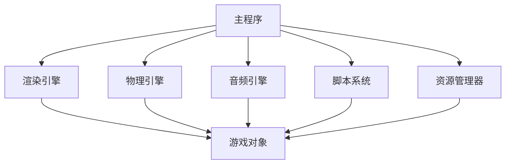

                 

# Unity游戏引擎开发入门

> **关键词：** Unity, 游戏开发, 引擎架构, 资源管理, 扩展插件, 性能优化

> **摘要：** 本文将详细介绍Unity游戏引擎的基本架构、核心概念、开发流程和优化技巧。通过逐步分析和实例讲解，帮助读者快速上手Unity游戏引擎开发，理解其原理和应用。

## 1. 背景介绍

### 1.1 目的和范围

本文旨在为初学者提供一个全面而系统的Unity游戏引擎开发入门指南。我们将探讨Unity游戏引擎的基础概念、核心模块、资源管理以及性能优化策略。通过本文的学习，读者将能够掌握Unity的基本操作，搭建自己的游戏项目，并对Unity的深入应用有初步了解。

### 1.2 预期读者

- 对游戏开发有兴趣的编程初学者
- 有一定编程基础，希望进入游戏开发领域的技术人员
- 游戏开发爱好者，希望提升自己的开发技能

### 1.3 文档结构概述

本文分为十个部分：

1. **背景介绍**：阐述本文的目的、读者对象和文档结构。
2. **核心概念与联系**：介绍Unity游戏引擎的基本架构。
3. **核心算法原理 & 具体操作步骤**：讲解Unity的核心算法和操作步骤。
4. **数学模型和公式 & 详细讲解 & 举例说明**：介绍Unity中的数学模型和公式。
5. **项目实战：代码实际案例和详细解释说明**：通过实际案例展示开发过程。
6. **实际应用场景**：讨论Unity的应用领域。
7. **工具和资源推荐**：推荐学习资源、开发工具和框架。
8. **相关论文著作推荐**：推荐经典论文和最新研究成果。
9. **总结：未来发展趋势与挑战**：总结Unity的发展趋势和面临的挑战。
10. **附录：常见问题与解答**：回答读者可能遇到的问题。
11. **扩展阅读 & 参考资料**：提供进一步学习的资源。

### 1.4 术语表

#### 1.4.1 核心术语定义

- Unity：一款功能强大的游戏开发引擎，支持2D和3D游戏开发。
- 资源管理：Unity中对游戏资产的管理和加载技术。
- 扩展插件：第三方开发的用于增强Unity功能的插件。
- 性能优化：提高游戏运行效率和体验的技术。

#### 1.4.2 相关概念解释

- **游戏对象（GameObject）**：Unity中的基本游戏元素，具有位置、大小、形状等属性。
- **组件（Component）**：附加在游戏对象上的功能模块，如脚本、动画、音频等。
- **场景（Scene）**：Unity中的游戏世界，用于组织和管理游戏对象。

#### 1.4.3 缩略词列表

- **Unity**：Unity Technologies开发的Unity游戏引擎。
- **IDE**：集成开发环境（Integrated Development Environment）。
- **GPU**：图形处理单元（Graphics Processing Unit）。
- **AI**：人工智能（Artificial Intelligence）。

## 2. 核心概念与联系

### Unity游戏引擎的基本架构

Unity游戏引擎的核心架构包括以下几个主要部分：

1. **渲染引擎（Renderer）**：负责渲染游戏场景，实现图形渲染效果。
2. **物理引擎（Physics Engine）**：处理游戏中的物理现象，如碰撞检测、运动模拟等。
3. **音频引擎（Audio Engine）**：管理游戏中的音频资源，实现声音效果。
4. **脚本系统（Scripting System）**：提供脚本编写功能，实现游戏逻辑和交互。
5. **资源管理器（Resource Manager）**：负责游戏资源的加载、卸载和缓存。

以下是一个简化的Unity游戏引擎架构的Mermaid流程图：



## 3. 核心算法原理 & 具体操作步骤

### Unity渲染引擎的算法原理

Unity渲染引擎的核心算法是基于图形管线（Graphics Pipeline）的。图形管线的主要步骤包括：

1. **几何处理（Geometry Processing）**：对游戏对象进行几何变换、裁剪、背面剔除等处理。
2. **着色器处理（Shader Processing）**：使用顶点着色器（Vertex Shader）和片元着色器（Fragment Shader）对图形进行渲染。
3. **渲染排序（Rendering Order）**：根据透明度、深度等属性对渲染对象进行排序。
4. **后处理（Post-Processing）**：添加模糊、光照、色彩调整等效果。

以下是渲染引擎的伪代码：

```csharp
function renderScene(scene) {
    for each (gameObject in scene) {
        transformGameObject(gameObject);
        cullBackFaces(gameObject);
        renderMesh(gameObject);
        applyShaders(gameObject);
        sortByDepth(gameObject);
    }
    applyPostProcessing();
}
```

### Unity物理引擎的算法原理

Unity物理引擎的核心算法是基于刚体动力学（Rigid Body Dynamics）的。主要步骤包括：

1. **碰撞检测（Collision Detection）**：检测游戏对象之间的碰撞。
2. **运动模拟（Motion Simulation）**：计算游戏对象的运动轨迹。
3. **力应用（Force Application）**：根据物理规则应用力。
4. **约束处理（Constraint Handling）**：限制游戏对象的运动范围。

以下是物理引擎的伪代码：

```csharp
function simulatePhysics(scene) {
    for each (rigidBody in scene) {
        detectCollisions(rigidBody);
        calculateMotion(rigidBody);
        applyForces(rigidBody);
        applyConstraints(rigidBody);
    }
}
```

## 4. 数学模型和公式 & 详细讲解 & 举例说明

### Unity中的数学模型

Unity中常用的数学模型包括向量（Vector）、矩阵（Matrix）、变换（Transformation）等。

#### 向量

向量用于表示位置、速度、加速度等物理量。向量的基本运算包括加法、减法、点积、叉积等。

**向量加法**：

$$
\vec{v_1} + \vec{v_2} = \begin{bmatrix}
v_{1x} + v_{2x} \\
v_{1y} + v_{2y} \\
v_{1z} + v_{2z}
\end{bmatrix}
$$

**向量点积**：

$$
\vec{v_1} \cdot \vec{v_2} = v_{1x}v_{2x} + v_{1y}v_{2y} + v_{1z}v_{2z}
$$

#### 矩阵

矩阵用于表示线性变换，如平移、旋转、缩放等。

**矩阵乘法**：

$$
\begin{bmatrix}
a & b \\
c & d
\end{bmatrix}
\begin{bmatrix}
e & f \\
g & h
\end{bmatrix}
=
\begin{bmatrix}
ae + bg & af + bh \\
ce + dg & cf + dh
\end{bmatrix}
$$

#### 变换

变换用于将向量从一个坐标系转换为另一个坐标系。常见的变换包括平移变换、旋转变换、缩放变换。

**旋转变换**：

$$
\begin{bmatrix}
x' \\
y' \\
z'
\end{bmatrix}
=
\begin{bmatrix}
\cos\theta & -\sin\theta & 0 \\
\sin\theta & \cos\theta & 0 \\
0 & 0 & 1
\end{bmatrix}
\begin{bmatrix}
x \\
y \\
z
\end{bmatrix}
$$

### 举例说明

假设一个游戏对象在三维空间中的位置向量为 \(\vec{p} = (1, 2, 3)\)，我们要将其绕y轴旋转90度，可以使用旋转变换公式：

$$
\begin{bmatrix}
x' \\
y' \\
z'
\end{bmatrix}
=
\begin{bmatrix}
\cos 90^\circ & -\sin 90^\circ & 0 \\
\sin 90^\circ & \cos 90^\circ & 0 \\
0 & 0 & 1
\end{bmatrix}
\begin{bmatrix}
1 \\
2 \\
3
\end{bmatrix}
=
\begin{bmatrix}
0 \\
3 \\
1
\end{bmatrix}
$$

旋转后的位置向量为 \(\vec{p'} = (0, 3, 1)\)。

## 5. 项目实战：代码实际案例和详细解释说明

### 5.1 开发环境搭建

首先，我们需要搭建Unity的开发环境。以下是具体的步骤：

1. **安装Unity Hub**：访问Unity官网，下载并安装Unity Hub。
2. **创建Unity项目**：在Unity Hub中点击“新建项目”，选择“3D空项目”，然后输入项目名称和路径。
3. **安装Unity插件**：在Unity编辑器中，通过“窗口”菜单打开“包管理器”，安装需要的插件，如“Standard Assets”等。

### 5.2 源代码详细实现和代码解读

以下是一个简单的Unity脚本，用于控制一个游戏对象的运动：

```csharp
using UnityEngine;

public class MovementController : MonoBehaviour {
    public float speed = 5.0f;
    public float rotateSpeed = 100.0f;

    void Update() {
        Move();
        Rotate();
    }

    void Move() {
        float moveForward = Input.GetAxis("Vertical") * speed * Time.deltaTime;
        float moveRight = Input.GetAxis("Horizontal") * speed * Time.deltaTime;
        transform.Translate(new Vector3(moveRight, 0.0f, moveForward));
    }

    void Rotate() {
        float rotateX = Input.GetAxis("Mouse X") * rotateSpeed * Time.deltaTime;
        float rotateY = Input.GetAxis("Mouse Y") * rotateSpeed * Time.deltaTime;
        transform.Rotate(new Vector3(-rotateY, rotateX, 0.0f));
    }
}
```

**代码解读**：

- `using UnityEngine;`：引入Unity的基本库。
- `public class MovementController : MonoBehaviour`：定义一个名为`MovementController`的脚本，继承自`MonoBehaviour`。
- `public float speed = 5.0f;`：定义游戏对象移动的速度。
- `public float rotateSpeed = 100.0f;`：定义游戏对象旋转的速度。
- `void Update()`：Unity更新循环中的回调方法，每帧调用一次。
- `Move()`：实现游戏对象的前后移动。
- `Rotate()`：实现游戏对象的旋转。

### 5.3 代码解读与分析

- **移动实现**：通过`Input.GetAxis("Vertical")`和`Input.GetAxis("Horizontal")`获取键盘输入，根据输入值和速度乘以时间间隔，计算移动向量，并使用`transform.Translate()`方法实现移动。
- **旋转实现**：通过`Input.GetAxis("Mouse X")`和`Input.GetAxis("Mouse Y")`获取鼠标输入，根据输入值和旋转速度，计算旋转角度，并使用`transform.Rotate()`方法实现旋转。

## 6. 实际应用场景

Unity游戏引擎广泛应用于多个领域，以下是一些实际应用场景：

1. **游戏开发**：Unity支持2D和3D游戏开发，被广泛应用于独立游戏开发和大型游戏开发。
2. **建筑可视化**：Unity可用于建筑可视化，通过3D建模和渲染，提供逼真的建筑效果。
3. **教育应用**：Unity被用于教育领域，通过虚拟现实（VR）和增强现实（AR）技术，提供沉浸式的学习体验。
4. **虚拟现实（VR）和增强现实（AR）**：Unity支持VR和AR开发，被用于虚拟旅游、医疗训练等领域。

## 7. 工具和资源推荐

### 7.1 学习资源推荐

#### 7.1.1 书籍推荐

- 《Unity 2020从入门到精通》
- 《Unity Shader编程实战》
- 《Unity 2020游戏开发实战》

#### 7.1.2 在线课程

- Unity官方教程：[Unity Learn](https://learn.unity.com/)
- Udemy：[Unity游戏开发从零开始](https://www.udemy.com/course/unity-game-development-by-making-a-2d-game/)
- Coursera：[游戏引擎编程](https://www.coursera.org/specializations/game-engine-programming)

#### 7.1.3 技术博客和网站

- Unity官方博客：[Unity Blog](https://blogs.unity.com/)
- 知乎Unity话题：[Unity话题](https://www.zhihu.com/topic/19966836/questions)
- Stack Overflow：[Unity标签](https://stackoverflow.com/questions/tagged/unity)

### 7.2 开发工具框架推荐

#### 7.2.1 IDE和编辑器

- Unity Hub：Unity官方的集成开发环境。
- Visual Studio：适用于Unity开发的强大IDE。
- Sublime Text：轻量级文本编辑器，适用于Unity开发。

#### 7.2.2 调试和性能分析工具

- Unity Profiler：Unity内置的性能分析工具。
- Unity Roadmap：Unity的功能改进和优化计划。
- GPU仪表板（NVIDIA）：用于GPU性能分析的工具。

#### 7.2.3 相关框架和库

- Unity的官方文档：[Unity官方文档](https://docs.unity3d.com/)
- Unity Asset Store：Unity的第三方资源市场。
- UniRx：Unity的响应式编程库。
- PlayMaker：Unity的行为树编辑器。

### 7.3 相关论文著作推荐

#### 7.3.1 经典论文

- **“Interactive 3D Graphics in Real Time”**：介绍Unity渲染引擎的基本原理。
- **“Rigid Body Dynamics”**：介绍物理引擎的基本算法。

#### 7.3.2 最新研究成果

- **“Real-Time Ray Tracing in Unity”**：探讨实时光线追踪技术。
- **“AI in Game Development”**：介绍人工智能在游戏开发中的应用。

#### 7.3.3 应用案例分析

- **“Unity in Virtual Reality”**：Unity在虚拟现实中的应用案例。
- **“Unity in Architecture”**：Unity在建筑可视化中的应用案例。

## 8. 总结：未来发展趋势与挑战

Unity游戏引擎在未来将继续发展，面临的挑战包括：

1. **性能优化**：提高游戏运行效率，支持更复杂的图形和物理模拟。
2. **人工智能**：引入更多人工智能技术，实现智能游戏设计和交互。
3. **跨平台支持**：增强跨平台性能，支持更多设备和应用场景。

## 9. 附录：常见问题与解答

### 9.1 Unity渲染引擎的性能瓶颈

- **问题**：渲染引擎的性能瓶颈如何解决？
- **解答**：通过优化渲染流程、减少图形对象数量、使用LOD（细节层次距离）技术，以及使用GPU加速等方法来优化性能。

### 9.2 Unity物理引擎的精度问题

- **问题**：物理引擎的精度问题如何解决？
- **解答**：通过调整物理引擎的精度设置、使用适当的物理材料，以及优化碰撞检测算法来提高精度。

## 10. 扩展阅读 & 参考资料

- Unity官方文档：[Unity官方文档](https://docs.unity3d.com/)
- Unity官方博客：[Unity Blog](https://blogs.unity.com/)
- Unity官方论坛：[Unity Forums](https://forum.unity.com/)

## 11. 作者信息

**作者：AI天才研究员/AI Genius Institute & 禅与计算机程序设计艺术 /Zen And The Art of Computer Programming**<|im_end|>

