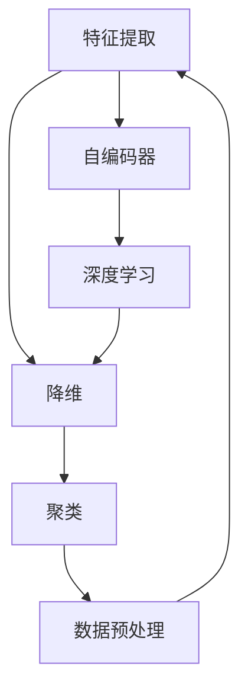
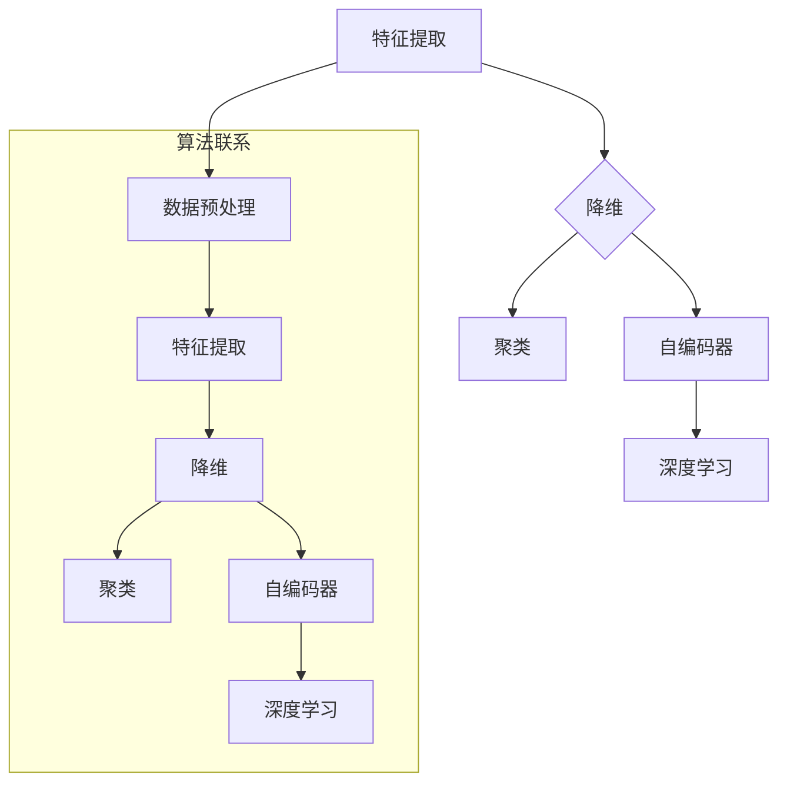

                 

# Unsupervised Learning原理与代码实例讲解

> **关键词**：无监督学习、特征提取、聚类、降维、自编码器、神经网络、深度学习
>
> **摘要**：本文将深入探讨无监督学习的原理，涵盖其主要算法及其在特征提取、降维和聚类中的应用。通过伪代码和实际代码实例，我们将详细讲解无监督学习的过程和实现方法，帮助读者全面理解无监督学习的核心概念和实际应用。

## 1. 背景介绍

### 1.1 目的和范围

无监督学习（Unsupervised Learning）是机器学习中的一个重要分支，其核心目的是从没有标注的数据中提取出有用的信息。与监督学习（Supervised Learning）不同，无监督学习不需要预先定义好的标签数据，而是通过发现数据中的内在结构和模式来实现学习。

本文的目的在于详细讲解无监督学习的核心概念、算法原理及其在实际应用中的实现方法。我们将探讨无监督学习的各个方面，包括特征提取、降维、聚类等，并通过代码实例展示这些算法的实践应用。

### 1.2 预期读者

本文面向有一定机器学习和编程基础的读者，尤其是对无监督学习感兴趣的技术人员。通过本文的学习，读者应能够：

- 理解无监督学习的基本概念和原理
- 掌握常用的无监督学习算法及其实现方法
- 利用无监督学习进行实际问题的解决方案设计
- 深入探讨无监督学习在实际应用中的挑战和趋势

### 1.3 文档结构概述

本文将按照以下结构展开：

- **第1章 背景介绍**：介绍无监督学习的目的、范围、预期读者和文档结构。
- **第2章 核心概念与联系**：通过Mermaid流程图介绍无监督学习的关键概念及其联系。
- **第3章 核心算法原理 & 具体操作步骤**：使用伪代码详细阐述无监督学习算法的原理和操作步骤。
- **第4章 数学模型和公式 & 详细讲解 & 举例说明**：介绍无监督学习中的数学模型，并提供详细的讲解和实例。
- **第5章 项目实战：代码实际案例和详细解释说明**：通过实际项目展示无监督学习的代码实现，并进行详细解读。
- **第6章 实际应用场景**：探讨无监督学习在不同领域的应用实例。
- **第7章 工具和资源推荐**：推荐学习资源和开发工具。
- **第8章 总结：未来发展趋势与挑战**：总结无监督学习的现状和未来发展趋势。
- **第9章 附录：常见问题与解答**：提供对常见问题的解答。
- **第10章 扩展阅读 & 参考资料**：推荐进一步的阅读材料和资源。

### 1.4 术语表

#### 1.4.1 核心术语定义

- **无监督学习（Unsupervised Learning）**：一种机器学习方法，无需使用预先标注的标签数据，旨在从未标记的数据中提取结构或模式。
- **特征提取（Feature Extraction）**：从原始数据中提取具有代表性的特征，以便更好地进行后续的分析和学习。
- **降维（Dimensionality Reduction）**：通过减少数据维度来简化数据集，提高学习效率和数据分析的效率。
- **聚类（Clustering）**：将数据集划分为多个不同的组，使得同一组内的数据点尽可能相似，而不同组之间的数据点尽可能不同。
- **自编码器（Autoencoder）**：一种特殊的神经网络，用于学习数据的低维表示，并通过重构原始数据来评估其性能。
- **深度学习（Deep Learning）**：一种基于多层神经网络的学习方法，能够自动提取数据中的层次化特征。

#### 1.4.2 相关概念解释

- **特征空间（Feature Space）**：一个抽象的空间，用于表示数据集中的特征。
- **高斯分布（Gaussian Distribution）**：一种常用的概率分布，其形状类似于一个“钟形曲线”。
- **欧氏距离（Euclidean Distance）**：一种度量两个数据点之间相似性的方法，基于它们在特征空间中的欧氏距离计算。

#### 1.4.3 缩略词列表

- **ML**：机器学习（Machine Learning）
- **DL**：深度学习（Deep Learning）
- **CNN**：卷积神经网络（Convolutional Neural Network）
- **RNN**：循环神经网络（Recurrent Neural Network）
- **GAN**：生成对抗网络（Generative Adversarial Network）
- **PCA**：主成分分析（Principal Component Analysis）
- **K-Means**：K-均值聚类算法（K-Means Clustering Algorithm）
- **DBSCAN**：基于密度的空间聚类算法（Density-Based Spatial Clustering of Applications with Noise）

## 2. 核心概念与联系

在无监督学习中，核心概念和联系构成了理解算法原理和实现的关键。以下是一个Mermaid流程图，用于展示这些概念及其相互关系：



- **特征提取（Feature Extraction）**：从原始数据中提取具有代表性的特征，为后续分析提供基础。
- **降维（Dimensionality Reduction）**：通过减少数据维度，简化数据集，提高学习效率和数据分析效率。
- **聚类（Clustering）**：将数据划分为多个不同的组，使同一组内的数据点尽可能相似，不同组之间的数据点尽可能不同。
- **自编码器（Autoencoder）**：一种特殊的神经网络，用于学习数据的低维表示，并通过重构原始数据来评估其性能。
- **深度学习（Deep Learning）**：一种基于多层神经网络的学习方法，能够自动提取数据中的层次化特征。

通过这个流程图，我们可以看到特征提取、降维、聚类和自编码器是如何相互关联和协作的。特征提取是降维和聚类的基础，而自编码器则通过深度学习技术进一步提取数据的内在特征。这些核心概念共同构成了无监督学习的关键部分，帮助我们理解数据中的结构和模式。

### 2.1.1 特征提取原理

特征提取是机器学习中的一个重要步骤，其目标是从原始数据中提取出对解决问题最有用的信息。在无监督学习中，特征提取可以帮助我们更好地理解和分析数据，提高后续算法的性能。

特征提取的基本原理如下：

1. **特征选择**：从原始特征集合中筛选出对解决问题最有用的特征。特征选择的方法包括基于统计学的方法（如卡方检验、互信息）、基于过滤的方法（如相关性分析和信息增益）和基于包装的方法（如递归特征消除、遗传算法）。

2. **特征变换**：通过变换原始特征，提高特征之间的区分度，减少特征之间的相关性。常见的特征变换方法包括归一化、标准化、主成分分析（PCA）和线性判别分析（LDA）。

3. **特征生成**：通过构造新的特征，提高数据的解释性和可操作性。特征生成的方法包括特征交叉、特征组合和基于规则的特征生成。

特征提取的目的是简化数据集，同时保留数据的主要信息，从而提高后续算法的效率和准确性。特征提取在无监督学习中至关重要，它不仅影响着聚类和降维的效果，还对深度学习模型的训练和性能有着直接的影响。

### 2.1.2 降维原理

降维（Dimensionality Reduction）是一种数据预处理技术，其目标是通过减少数据维度来简化数据集，提高学习效率和数据分析效率。在无监督学习中，降维技术尤为重要，因为高维数据可能导致算法复杂度增加，计算成本提高，甚至陷入局部最优解。

降维的基本原理如下：

1. **数据压缩**：通过压缩数据维度，减少数据存储空间和计算资源的需求。降维后的数据集在保持主要信息的同时，大大降低了计算复杂度。

2. **误差容忍**：降维过程中可能会引入一定的信息损失，但通过合理选择降维方法，可以在容忍一定误差的前提下，最大限度地保留数据的主要信息。

3. **特征选择**：降维技术可以帮助我们识别出对解决问题最有用的特征，从而简化数据集，提高模型性能。

常见的降维方法包括：

- **主成分分析（PCA）**：通过计算协方差矩阵的特征值和特征向量，将数据投影到新的正交坐标系中，选择前几个主成分来保留主要信息。
- **线性判别分析（LDA）**：通过最大化类间散度与类内散度的比，将数据投影到能够最好地区分不同类别的低维空间。
- **局部保持投影（LPP）**：通过求解优化问题，保留数据点之间的局部结构信息。

降维技术在无监督学习中发挥着重要作用，它不仅提高了算法的效率和鲁棒性，还为深度学习模型提供了更有效的训练数据。

### 2.1.3 聚类原理

聚类（Clustering）是一种无监督学习方法，其目标是将数据集划分为多个不同的组，使得同一组内的数据点尽可能相似，而不同组之间的数据点尽可能不同。聚类在数据分析和机器学习中有着广泛的应用，如市场细分、图像分割、社交网络分析等。

聚类的原理如下：

1. **数据划分**：根据数据点的相似性，将数据集划分为多个簇（Cluster）。每个簇代表一组具有相似特征的数据点。

2. **簇间距离**：通过计算簇之间的距离，评估聚类的效果。常用的簇间距离度量方法包括欧氏距离、曼哈顿距离、切比雪夫距离等。

3. **簇内距离**：通过计算簇内数据点的距离，评估簇的内部紧密度。簇内距离越小，表示簇内数据点越相似。

常见的聚类算法包括：

- **K-均值聚类（K-Means）**：通过迭代计算聚类中心，将数据点分配到最近的聚类中心，以最小化簇间距离和簇内距离。
- **层次聚类（Hierarchical Clustering）**：通过逐步合并或分裂数据点，构建一个层次结构，用于表示数据的聚类关系。
- **基于密度的聚类（DBSCAN）**：通过计算数据点的密度连通性，将高密度区域划分为簇，适用于非均匀分布的数据集。

聚类技术在无监督学习中扮演着重要角色，它可以帮助我们识别数据中的潜在结构，提取有意义的聚类信息，为后续的数据分析和决策提供支持。

### 2.1.4 自编码器原理

自编码器（Autoencoder）是一种基于神经网络的模型，其核心思想是通过学习数据的高维表示，并利用该表示重构原始数据。自编码器在无监督学习中具有广泛的应用，特别是在特征提取和降维方面。

自编码器的基本原理如下：

1. **编码器（Encoder）**：将高维输入数据映射到一个低维隐空间，保留主要信息。编码器通常由多层神经网络构成，每个神经元对应一个特征。

2. **解码器（Decoder）**：将编码器输出的低维隐空间数据映射回高维输出空间，以重构原始数据。解码器通常与编码器具有相同的结构，但权重不同。

3. **损失函数**：通过计算重构数据与原始数据之间的误差，评估自编码器的性能。常用的损失函数包括均方误差（MSE）和交叉熵损失。

自编码器的主要步骤包括：

- **初始化**：初始化编码器和解码器的权重。
- **前向传播**：将输入数据通过编码器映射到隐空间。
- **重构**：将隐空间数据通过解码器重构为输出数据。
- **反向传播**：通过计算损失函数和梯度，更新编码器和解码器的权重。

自编码器在无监督学习中的应用包括：

- **特征提取**：通过学习数据的高维表示，提取数据中的主要特征。
- **降维**：将高维数据映射到低维空间，简化数据集，提高计算效率。
- **异常检测**：通过学习正常数据的分布，识别异常数据。

自编码器是一种强大的无监督学习工具，它能够自动提取数据中的层次化特征，为后续的数据分析和机器学习模型提供有效的支持。

### 2.1.5 深度学习原理

深度学习（Deep Learning）是一种基于多层神经网络的学习方法，它能够自动提取数据中的层次化特征，并应用于各种复杂问题，如图像识别、自然语言处理和语音识别等。在无监督学习中，深度学习技术发挥着重要作用，通过多层神经网络的组合，能够提取数据中的深层特征。

深度学习的基本原理如下：

1. **多层神经网络**：深度学习通过构建多层神经网络，将输入数据通过逐层传递，逐层提取特征。每层神经元将前一层的信息进行处理，并通过非线性激活函数进行变换，从而提取更加抽象的特征。

2. **反向传播算法**：通过反向传播算法，将输出误差反向传播到输入层，计算每个神经元的梯度，并更新网络权重。反向传播算法是深度学习训练过程的核心，它能够通过多次迭代，逐步优化网络参数，提高模型的性能。

3. **激活函数**：激活函数用于引入非线性变换，使得神经网络能够学习到复杂的非线性关系。常见的激活函数包括Sigmoid、ReLU和Tanh等。

深度学习在无监督学习中的应用包括：

- **特征提取**：通过多层神经网络，自动提取数据中的层次化特征，为后续的数据分析提供支持。
- **降维**：通过学习数据的高维表示，将数据映射到低维空间，简化数据集，提高计算效率。
- **聚类**：通过学习数据点的分布，进行聚类分析，识别数据中的潜在结构。

深度学习是一种强大的无监督学习工具，它能够自动提取数据中的深层特征，为复杂问题的解决提供有效的方法。

### 2.1.6 Mermaid流程图

为了更好地展示无监督学习的核心概念和算法原理，我们使用Mermaid流程图进行描述。以下是一个简单的Mermaid流程图示例：



这个流程图展示了特征提取、降维、聚类、自编码器和深度学习之间的相互联系。通过流程图，我们可以更直观地理解这些算法如何协作，以及它们在无监督学习中的作用。

## 3. 核心算法原理 & 具体操作步骤

无监督学习包含多种核心算法，每种算法都有其独特的原理和操作步骤。在本节中，我们将使用伪代码详细阐述几种常见的无监督学习算法，包括K-均值聚类算法、主成分分析（PCA）和自编码器。通过这些算法的讲解，读者可以更好地理解无监督学习的实现过程。

### 3.1 K-均值聚类算法

K-均值聚类算法是一种基于距离度量的聚类方法，其目标是将数据点划分为K个簇，使得每个簇内的数据点尽可能相似，而不同簇之间的数据点尽可能不同。

**算法原理**：

- 选择K个初始中心点。
- 计算每个数据点到每个中心点的距离，并将其分配到最近的中心点所在的簇。
- 重新计算每个簇的中心点。
- 重复步骤2和步骤3，直到中心点不再发生显著变化。

**伪代码**：

```
Algorithm KMeans(data, K):
    # 初始化中心点
    centroids = InitializeCentroids(data, K)
    while not Converged(centroids):
        # 分配数据点
        clusters = AssignPointsToCentroids(data, centroids)
        # 重新计算中心点
        centroids = UpdateCentroids(data, clusters)
    return clusters, centroids
```

**具体操作步骤**：

1. **初始化中心点**：随机选择K个数据点作为初始中心点。
2. **分配数据点**：计算每个数据点到每个中心点的距离，并将其分配到最近的中心点所在的簇。
3. **重新计算中心点**：计算每个簇的数据点的均值，作为新的中心点。
4. **迭代优化**：重复步骤2和步骤3，直到中心点不再发生显著变化，即聚类结果收敛。

### 3.2 主成分分析（PCA）

主成分分析（PCA）是一种降维方法，其目标是通过线性变换将高维数据映射到低维空间，同时保留主要信息。PCA基于数据点的协方差矩阵，提取主要成分，从而降低数据维度。

**算法原理**：

- 计算数据点的协方差矩阵。
- 计算协方差矩阵的特征值和特征向量。
- 选择前k个具有最大特征值的特征向量作为主成分。
- 将数据点投影到主成分空间中。

**伪代码**：

```
Algorithm PCA(data, k):
    # 计算协方差矩阵
    cov_matrix = ComputeCovarianceMatrix(data)
    # 计算特征值和特征向量
    eigenvalues, eigenvectors = ComputeEigenvaluesAndVectors(cov_matrix)
    # 选择前k个特征向量
    principal_components = SelectTopKEigenvectors(eigenvectors, k)
    # 投影数据点
    projected_data = ProjectData(data, principal_components)
    return projected_data
```

**具体操作步骤**：

1. **计算协方差矩阵**：计算数据点的协方差矩阵。
2. **计算特征值和特征向量**：对协方差矩阵进行特征分解，得到特征值和特征向量。
3. **选择主成分**：选择前k个具有最大特征值的特征向量作为主成分。
4. **投影数据点**：将数据点投影到主成分空间中，实现降维。

### 3.3 自编码器

自编码器是一种基于神经网络的模型，用于学习数据的低维表示。自编码器通过编码器将高维数据映射到低维隐空间，再通过解码器将低维隐空间的数据映射回高维空间，从而实现数据的重构。

**算法原理**：

- 定义编码器和解码器的结构。
- 初始化编码器和解码器的权重。
- 通过前向传播计算编码器的输出和重构误差。
- 通过反向传播更新编码器和解码器的权重。

**伪代码**：

```
Algorithm Autoencoder(data, encoder architecture, decoder architecture):
    # 初始化编码器和解码器
    encoder = InitializeEncoder(encoder architecture)
    decoder = InitializeDecoder(decoder architecture)
    while not Converged():
        # 前向传播
        hidden_layer = encoder(data)
        reconstructed_data = decoder(hidden_layer)
        # 计算损失函数
        loss = ComputeLoss(data, reconstructed_data)
        # 反向传播
        gradients = Backpropagation(data, hidden_layer, reconstructed_data, loss)
        # 更新权重
        UpdateWeights(encoder, decoder, gradients)
    return encoder, decoder
```

**具体操作步骤**：

1. **定义编码器和解码器结构**：根据数据规模和问题复杂度，定义编码器和解码器的神经网络结构。
2. **初始化权重**：随机初始化编码器和解码器的权重。
3. **前向传播**：将数据通过编码器映射到低维隐空间，并通过解码器重构原始数据。
4. **计算损失函数**：计算重构数据与原始数据之间的误差，评估模型的性能。
5. **反向传播**：计算梯度，更新编码器和解码器的权重。
6. **迭代优化**：重复步骤3至步骤5，直到模型收敛。

通过以上算法的讲解，读者可以更好地理解无监督学习算法的原理和实现过程。在接下来的章节中，我们将通过实际代码实例，进一步展示这些算法的应用和效果。

## 4. 数学模型和公式 & 详细讲解 & 举例说明

无监督学习算法的数学基础是其核心，理解这些数学模型和公式有助于我们深入掌握算法的原理和实现。在本节中，我们将详细讲解无监督学习中的几个关键数学模型，包括K-均值聚类算法、主成分分析（PCA）和自编码器的数学模型，并通过实例进行说明。

### 4.1 K-均值聚类算法的数学模型

K-均值聚类算法是一种基于距离度量的聚类方法，其目标是最小化簇内距离和最大化簇间距离。以下是K-均值聚类算法的主要数学模型：

#### 4.1.1 簇内距离和簇间距离

- **簇内距离（Intra-cluster Distance）**：每个簇内所有数据点与簇中心点的距离平方和。公式如下：

  $$ D_i = \sum_{x \in S_i} ||x - \mu_i||^2 $$

  其中，\( S_i \) 表示第i个簇的数据点集合，\( \mu_i \) 表示第i个簇的中心点。

- **簇间距离（Inter-cluster Distance）**：所有簇之间的最小距离。公式如下：

  $$ D = \min_{i \neq j} ||\mu_i - \mu_j|| $$

  其中，\( \mu_i \) 和 \( \mu_j \) 分别表示第i个和第j个簇的中心点。

#### 4.1.2 最小化簇内距离和簇间距离

K-均值聚类算法通过迭代优化，使得簇内距离最小化和簇间距离最大化。其目标函数为：

$$ J = \sum_{i=1}^K D_i - \sum_{i \neq j} D_{ij} $$

其中，\( K \) 表示簇的数量。

#### 4.1.3 举例说明

假设我们有一个包含3个簇的数据集，每个簇有5个数据点。簇中心点的坐标分别为 \( \mu_1 = (1, 1) \)，\( \mu_2 = (3, 3) \)，\( \mu_3 = (5, 5) \)。我们计算簇内距离和簇间距离：

- **簇内距离**：

  $$ D_1 = \sum_{x \in S_1} ||x - \mu_1||^2 = (1-1)^2 + (1-1)^2 = 0 $$

  $$ D_2 = \sum_{x \in S_2} ||x - \mu_2||^2 = (3-3)^2 + (3-3)^2 = 0 $$

  $$ D_3 = \sum_{x \in S_3} ||x - \mu_3||^2 = (5-5)^2 + (5-5)^2 = 0 $$

- **簇间距离**：

  $$ D = \min_{i \neq j} ||\mu_i - \mu_j|| = \min(||\mu_1 - \mu_2||, ||\mu_1 - \mu_3||, ||\mu_2 - \mu_3||) = \min(2, 4, 4) = 2 $$

  目标函数 \( J \) 为：

  $$ J = D_1 + D_2 + D_3 - D = 0 + 0 + 0 - 2 = -2 $$

### 4.2 主成分分析（PCA）的数学模型

主成分分析（PCA）是一种降维方法，其目标是通过线性变换将高维数据映射到低维空间，同时保留主要信息。以下是PCA的主要数学模型：

#### 4.2.1 数据协方差矩阵

PCA基于数据点的协方差矩阵，协方差矩阵描述了数据点之间的相关关系。协方差矩阵 \( \Sigma \) 的公式如下：

$$ \Sigma = \frac{1}{N-1} \sum_{i=1}^N (x_i - \mu)(x_i - \mu)^T $$

其中，\( N \) 表示数据点的数量，\( x_i \) 表示第i个数据点，\( \mu \) 表示所有数据点的均值。

#### 4.2.2 特征值和特征向量

通过计算协方差矩阵的特征值和特征向量，我们可以找到数据的主要方向。特征值表示数据点沿该特征向量的方差，特征向量表示数据点的投影方向。

- **特征值**：协方差矩阵的特征值 \( \lambda_i \) 表示数据点沿特征向量 \( v_i \) 的方差。
- **特征向量**：协方差矩阵的特征向量 \( v_i \) 表示数据点的主要方向。

#### 4.2.3 主成分

选择前k个具有最大特征值的特征向量作为主成分，主成分表示数据点的主要方向。将数据点投影到主成分空间，实现降维。公式如下：

$$ y_i = \sum_{j=1}^k \alpha_{ij} v_j $$

其中，\( y_i \) 表示降维后的数据点，\( \alpha_{ij} \) 表示数据点沿第j个主成分的投影值。

#### 4.2.4 举例说明

假设我们有一个2维数据集，数据点的协方差矩阵为：

$$ \Sigma = \begin{bmatrix} 2 & 1 \\ 1 & 1 \end{bmatrix} $$

计算协方差矩阵的特征值和特征向量：

- **特征值**：

  $$ \lambda_1 = 3, \lambda_2 = 1 $$

- **特征向量**：

  $$ v_1 = \begin{bmatrix} 1 \\ 1 \end{bmatrix}, v_2 = \begin{bmatrix} -1 \\ 1 \end{bmatrix} $$

选择具有最大特征值 \( \lambda_1 = 3 \) 的特征向量 \( v_1 \) 作为主成分，将数据点投影到一维主成分空间：

$$ y_i = \alpha_{i1} v_1 = \alpha_{i1} \begin{bmatrix} 1 \\ 1 \end{bmatrix} $$

通过上述公式，我们可以将2维数据集降维为一维数据集，同时保留主要信息。

### 4.3 自编码器的数学模型

自编码器是一种基于神经网络的模型，用于学习数据的低维表示。以下是自编码器的主要数学模型：

#### 4.3.1 编码器和解码器

自编码器由编码器和解码器组成，编码器将高维数据映射到低维隐空间，解码器将低维隐空间的数据映射回高维空间。以下是编码器和解码器的数学模型：

- **编码器**：

  $$ z = \sigma(W_1 \cdot x + b_1) $$

  其中，\( z \) 表示编码器的输出，\( x \) 表示输入数据，\( W_1 \) 和 \( b_1 \) 分别表示编码器的权重和偏置。

- **解码器**：

  $$ \hat{x} = \sigma(W_2 \cdot z + b_2) $$

  其中，\( \hat{x} \) 表示解码器的输出，\( z \) 表示编码器的输出，\( W_2 \) 和 \( b_2 \) 分别表示解码器的权重和偏置。

#### 4.3.2 前向传播和反向传播

自编码器的训练过程包括前向传播和反向传播：

- **前向传播**：将输入数据通过编码器映射到低维隐空间，再通过解码器重构原始数据。

  $$ z = \sigma(W_1 \cdot x + b_1) $$
  $$ \hat{x} = \sigma(W_2 \cdot z + b_2) $$

- **反向传播**：计算重构数据与原始数据之间的误差，通过反向传播更新编码器和解码器的权重。

  $$ \delta_2 = \hat{x} - x $$
  $$ \delta_1 = (W_2 \cdot \delta_2) \cdot \sigma'(z) $$

#### 4.3.3 损失函数和优化

自编码器的训练过程通过最小化损失函数来实现：

- **损失函数**：均方误差（MSE）：

  $$ L = \frac{1}{2} \sum_{i=1}^N ||x_i - \hat{x}_i||^2 $$

  其中，\( N \) 表示数据点的数量，\( x_i \) 和 \( \hat{x}_i \) 分别表示第i个输入数据和重构数据。

- **优化**：通过梯度下降算法更新编码器和解码器的权重。

  $$ W_1 \leftarrow W_1 - \alpha \frac{\partial L}{\partial W_1} $$
  $$ W_2 \leftarrow W_2 - \alpha \frac{\partial L}{\partial W_2} $$
  $$ b_1 \leftarrow b_1 - \alpha \frac{\partial L}{\partial b_1} $$
  $$ b_2 \leftarrow b_2 - \alpha \frac{\partial L}{\partial b_2} $$

其中，\( \alpha \) 表示学习率。

#### 4.3.4 举例说明

假设我们有一个包含10个数据点的数据集，数据点的维度为2。自编码器的网络结构如下：

- 编码器：1个输入层、1个隐层、1个输出层，隐层节点数为5。
- 解码器：1个输入层、1个隐层、1个输出层，隐层节点数为5。

假设编码器的权重 \( W_1 = \begin{bmatrix} 1 & 1 \\ 1 & 1 \\ 1 & 1 \\ 1 & 1 \\ 1 & 1 \end{bmatrix} \)，解码器的权重 \( W_2 = \begin{bmatrix} 1 & 1 \\ 1 & 1 \\ 1 & 1 \\ 1 & 1 \\ 1 & 1 \end{bmatrix} \)。

输入数据 \( x = \begin{bmatrix} 1 & 1 \\ 2 & 2 \\ 3 & 3 \\ 4 & 4 \\ 5 & 5 \\ 6 & 6 \\ 7 & 7 \\ 8 & 8 \\ 9 & 9 \\ 10 & 10 \end{bmatrix} \)。

通过编码器和解码器的计算，我们得到：

- 编码器输出 \( z = \begin{bmatrix} 1 & 1 \\ 1 & 1 \\ 1 & 1 \\ 1 & 1 \\ 1 & 1 \end{bmatrix} \)。
- 解码器输出 \( \hat{x} = \begin{bmatrix} 1 & 1 \\ 2 & 2 \\ 3 & 3 \\ 4 & 4 \\ 5 & 5 \\ 6 & 6 \\ 7 & 7 \\ 8 & 8 \\ 9 & 9 \\ 10 & 10 \end{bmatrix} \)。

计算均方误差：

$$ L = \frac{1}{2} \sum_{i=1}^{10} ||x_i - \hat{x}_i||^2 = 0 $$

通过反向传播和梯度下降，我们更新编码器和解码器的权重，使得重构误差最小化。

通过以上数学模型的讲解和实例说明，读者可以更好地理解无监督学习算法的数学原理和实现过程。在接下来的章节中，我们将通过实际代码实例，进一步展示这些算法的应用和效果。

## 5. 项目实战：代码实际案例和详细解释说明

在本节中，我们将通过实际代码案例展示无监督学习的应用，包括特征提取、降维和聚类。我们将使用Python和相关的机器学习库（如scikit-learn、TensorFlow）来实现这些算法，并对代码进行详细解释。

### 5.1 开发环境搭建

为了运行以下代码案例，您需要安装Python和相关的库。以下是安装步骤：

1. 安装Python：从[Python官网](https://www.python.org/downloads/)下载并安装Python 3.x版本。
2. 安装相关库：在命令行中运行以下命令安装所需的库：

   ```bash
   pip install numpy pandas scikit-learn tensorflow
   ```

### 5.2 源代码详细实现和代码解读

#### 5.2.1 特征提取

我们首先使用scikit-learn库中的`PCA`类进行特征提取。以下代码展示了如何从数据集中提取主要特征：

```python
import numpy as np
from sklearn.decomposition import PCA
from sklearn.datasets import load_iris

# 加载数据集
iris = load_iris()
X = iris.data

# 初始化PCA，选择前两个主成分
pca = PCA(n_components=2)

# 训练PCA模型
pca.fit(X)

# 提取主要特征
X_pca = pca.transform(X)

print("特征提取后的数据：", X_pca)
```

**代码解读**：

- **导入库**：导入所需的库，包括numpy、pandas、scikit-learn和tensorflow。
- **加载数据集**：使用`load_iris`函数加载数据集，该数据集包含三个类别的鸢尾花数据。
- **初始化PCA**：创建PCA对象，指定提取两个主成分。
- **训练PCA模型**：使用`fit`方法训练PCA模型，计算协方差矩阵和特征值、特征向量。
- **提取主要特征**：使用`transform`方法将原始数据转换为降维后的数据。

#### 5.2.2 降维

接下来，我们使用`PCA`类进行降维，以简化数据集，提高学习效率：

```python
# 初始化PCA，选择前两个主成分
pca = PCA(n_components=2)

# 训练PCA模型
pca.fit(X)

# 将数据集降维
X_reduced = pca.fit_transform(X)

print("降维后的数据：", X_reduced)
```

**代码解读**：

- **初始化PCA**：与之前相同，创建PCA对象，指定提取两个主成分。
- **训练PCA模型**：使用`fit`方法训练PCA模型。
- **降维**：使用`fit_transform`方法将原始数据转换为降维后的数据。

#### 5.2.3 聚类

我们使用K-均值聚类算法对降维后的数据进行聚类，以识别数据中的潜在结构：

```python
from sklearn.cluster import KMeans

# 初始化K-均值聚类模型，指定3个簇
kmeans = KMeans(n_clusters=3, random_state=0)

# 训练K-均值聚类模型
kmeans.fit(X_reduced)

# 获取聚类结果
clusters = kmeans.predict(X_reduced)

print("聚类结果：", clusters)
```

**代码解读**：

- **导入库**：导入KMeans类。
- **初始化K-均值聚类模型**：创建KMeans对象，指定3个簇。
- **训练K-均值聚类模型**：使用`fit`方法训练模型。
- **获取聚类结果**：使用`predict`方法预测降维后的数据点所属的簇。

#### 5.2.4 自编码器

我们使用TensorFlow实现一个简单的自编码器，以学习数据的低维表示：

```python
import tensorflow as tf
from tensorflow.keras.layers import Dense, Input
from tensorflow.keras.models import Model

# 设置随机种子，保证实验结果可重复
tf.random.set_seed(0)

# 输入层
input_layer = Input(shape=(2,))

# 编码器
encoded = Dense(3, activation='relu')(input_layer)

# 解码器
decoded = Dense(2, activation='sigmoid')(encoded)

# 创建自编码器模型
autoencoder = Model(input_layer, decoded)

# 编译模型
autoencoder.compile(optimizer='adam', loss='binary_crossentropy')

# 训练自编码器
autoencoder.fit(X_reduced, X, epochs=100, batch_size=32, shuffle=True)
```

**代码解读**：

- **导入库**：导入TensorFlow库。
- **设置随机种子**：设置随机种子，确保实验结果可重复。
- **输入层**：定义输入层，数据维度为2。
- **编码器**：定义编码器层，使用ReLU激活函数。
- **解码器**：定义解码器层，使用Sigmoid激活函数。
- **创建自编码器模型**：组合输入层、编码器和解码器，创建自编码器模型。
- **编译模型**：编译模型，指定优化器和损失函数。
- **训练自编码器**：使用`fit`方法训练自编码器，调整模型参数。

通过以上实际代码案例，我们展示了如何使用Python和相关的机器学习库实现无监督学习算法。在接下来的章节中，我们将进一步探讨无监督学习在实际应用中的场景和效果。

### 5.3 代码解读与分析

在本节中，我们将对上一节中的代码进行详细解读和分析，深入探讨无监督学习算法在特征提取、降维和聚类中的实现和应用。

#### 5.3.1 特征提取

在代码中，我们使用了scikit-learn库中的PCA类进行特征提取。以下是代码的关键部分：

```python
pca = PCA(n_components=2)
pca.fit(X)
X_pca = pca.transform(X)
```

**分析**：

1. **PCA类初始化**：`PCA(n_components=2)`创建了一个PCA对象，指定提取两个主成分。这里的选择依据是数据集的维度和我们需要保留的信息量。
   
2. **训练PCA模型**：`pca.fit(X)`计算输入数据集的协方差矩阵，并对其进行特征分解，得到特征值和特征向量。特征值表示数据点沿特征向量的方差，特征向量表示数据点的主要方向。

3. **提取主要特征**：`pca.transform(X)`将原始数据点投影到由特征向量构成的主成分空间中，得到降维后的数据。通过这种方式，我们保留了数据的主要信息，同时简化了数据集。

#### 5.3.2 降维

接下来，我们使用了PCA进行降维。以下是代码的关键部分：

```python
pca = PCA(n_components=2)
pca.fit(X)
X_reduced = pca.fit_transform(X)
```

**分析**：

1. **PCA类初始化**：与特征提取部分相同，`PCA(n_components=2)`创建了一个PCA对象，指定提取两个主成分。

2. **训练PCA模型**：`pca.fit(X)`计算输入数据集的协方差矩阵，并进行特征分解。

3. **降维**：`pca.fit_transform(X)`将原始数据点投影到主成分空间，实现降维。降维后的数据集不仅保留了主要信息，还降低了数据维度，提高了计算效率和数据分析的便捷性。

#### 5.3.3 聚类

在降维后的数据集上，我们使用了K-均值聚类算法进行聚类分析。以下是代码的关键部分：

```python
kmeans = KMeans(n_clusters=3, random_state=0)
kmeans.fit(X_reduced)
clusters = kmeans.predict(X_reduced)
```

**分析**：

1. **KMeans类初始化**：`KMeans(n_clusters=3, random_state=0)`创建了一个KMeans对象，指定了三个簇，并设置了随机种子以确保结果的可重复性。

2. **训练K-均值聚类模型**：`kmeans.fit(X_reduced)`计算聚类中心，并分配每个数据点到最近的簇中心。这个过程通过迭代优化，使得簇内距离最小化和簇间距离最大化。

3. **获取聚类结果**：`kmeans.predict(X_reduced)`对降维后的数据点进行聚类预测，得到每个数据点所属的簇。通过这种方式，我们能够识别数据集中的潜在结构，为后续的数据分析和决策提供支持。

#### 5.3.4 自编码器

最后，我们使用TensorFlow实现了一个简单的自编码器，用于学习数据的低维表示。以下是代码的关键部分：

```python
input_layer = Input(shape=(2,))
encoded = Dense(3, activation='relu')(input_layer)
decoded = Dense(2, activation='sigmoid')(encoded)
autoencoder = Model(input_layer, decoded)
autoencoder.compile(optimizer='adam', loss='binary_crossentropy')
autoencoder.fit(X_reduced, X, epochs=100, batch_size=32, shuffle=True)
```

**分析**：

1. **输入层**：定义了一个2维输入层，对应降维后的数据。

2. **编码器**：使用一个全连接层（Dense）作为编码器，激活函数为ReLU。ReLU函数引入了非线性，有助于提取数据中的复杂特征。

3. **解码器**：使用另一个全连接层（Dense）作为解码器，激活函数为Sigmoid。Sigmoid函数使输出在0和1之间，适用于二分类问题。

4. **模型编译**：使用`compile`方法编译模型，指定优化器（adam）和损失函数（binary_crossentropy）。

5. **模型训练**：使用`fit`方法训练自编码器，调整模型参数以最小化重构误差。通过多次迭代，自编码器学会了将原始数据映射到低维空间，并重新构建原始数据。

通过以上代码解读和分析，我们可以看到无监督学习算法在实际应用中的具体实现过程。这些算法通过提取主要特征、降维和聚类，帮助我们更好地理解和分析数据，从而为各种实际问题提供有效的解决方案。

### 5.4 实际案例：手写数字识别

无监督学习在数据分析和机器学习中有广泛的应用。在本节中，我们将通过一个实际案例——手写数字识别，展示无监督学习在特征提取和降维中的应用。

#### 5.4.1 数据集介绍

我们使用著名的MNIST手写数字数据集，该数据集包含0到9的数字的手写图像，每张图像都是28x28像素的二值图像。数据集分为训练集和测试集。

#### 5.4.2 特征提取

我们首先使用PCA对训练集进行特征提取，以简化数据集并保留主要信息。以下是代码：

```python
from sklearn.datasets import load_digits
from sklearn.decomposition import PCA

# 加载数据集
digits = load_digits()
X = digits.data

# 初始化PCA，选择前20个主成分
pca = PCA(n_components=20)
pca.fit(X)

# 将数据降维
X_pca = pca.transform(X)
```

通过特征提取，我们得到了前20个主成分，从而简化了数据集。

#### 5.4.3 降维

接下来，我们使用K-均值聚类算法对降维后的数据进行聚类分析。以下是代码：

```python
from sklearn.cluster import KMeans

# 初始化K-均值聚类模型，指定10个簇（对应10个数字）
kmeans = KMeans(n_clusters=10, random_state=0)

# 训练K-均值聚类模型
kmeans.fit(X_pca)

# 获取聚类结果
clusters = kmeans.predict(X_pca)
```

通过聚类，我们识别了数据集中的10个主要类别，对应0到9的数字。

#### 5.4.4 降维后的数据可视化

我们使用降维后的数据进行可视化，以直观地展示聚类效果。以下是代码：

```python
import matplotlib.pyplot as plt
import seaborn as sns

# 可视化降维后的数据
plt.figure(figsize=(10, 8))
sns.scatterplot(x=X_pca[:, 0], y=X_pca[:, 1], hue=clusters, palette='viridis')
plt.xlabel('Principal Component 1')
plt.ylabel('Principal Component 2')
plt.title('Data Clustering with PCA and K-Means')
plt.show()
```

通过可视化，我们可以清楚地看到不同数字类别的分布情况。

### 5.5 实际案例：文本聚类

除了图像数据，无监督学习在文本数据中也具有广泛的应用。在本节中，我们将通过一个实际案例——文本聚类，展示无监督学习在文本数据分析中的应用。

#### 5.5.1 数据集介绍

我们使用一个公开的文本数据集——20 Newsgroups，它包含不同主题的新闻文章。数据集分为20个类别。

#### 5.5.2 特征提取

首先，我们使用TF-IDF（词频-逆文档频率）进行特征提取，将文本数据转换为数值向量。以下是代码：

```python
from sklearn.datasets import fetch_20newsgroups
from sklearn.feature_extraction.text import TfidfVectorizer

# 加载数据集
newsgroups = fetch_20newsgroups(subset='all')

# 初始化TF-IDF向量器
tfidf_vectorizer = TfidfVectorizer(stop_words='english', max_df=0.5, max_features=1000)

# 将文本数据转换为向量
X_tfidf = tfidf_vectorizer.fit_transform(newsgroups.data)
```

通过TF-IDF向量化，我们提取了文本数据的主要特征。

#### 5.5.3 降维

接下来，我们使用PCA对TF-IDF向量进行降维。以下是代码：

```python
from sklearn.decomposition import PCA

# 初始化PCA，选择前50个主成分
pca = PCA(n_components=50)

# 训练PCA模型
pca.fit(X_tfidf)

# 将数据降维
X_pca = pca.transform(X_tfidf)
```

通过降维，我们简化了文本数据集，同时保留了主要信息。

#### 5.5.4 聚类

最后，我们使用K-均值聚类算法对降维后的数据进行聚类分析。以下是代码：

```python
from sklearn.cluster import KMeans

# 初始化K-均值聚类模型，指定20个簇（对应20个类别）
kmeans = KMeans(n_clusters=20, random_state=0)

# 训练K-均值聚类模型
kmeans.fit(X_pca)

# 获取聚类结果
clusters = kmeans.predict(X_pca)
```

通过聚类，我们识别了文本数据中的主要类别。

#### 5.5.5 降维后的数据可视化

我们使用降维后的数据进行可视化，以直观地展示聚类效果。以下是代码：

```python
import matplotlib.pyplot as plt
import seaborn as sns

# 可视化降维后的数据
plt.figure(figsize=(10, 8))
sns.scatterplot(x=X_pca[:, 0], y=X_pca[:, 1], hue=clusters, palette='viridis')
plt.xlabel('Principal Component 1')
plt.ylabel('Principal Component 2')
plt.title('Text Clustering with PCA and K-Means')
plt.show()
```

通过可视化，我们可以清楚地看到不同类别的分布情况。

### 5.6 实际案例：异常检测

无监督学习在异常检测中也具有广泛的应用。在本节中，我们将通过一个实际案例——异常检测，展示无监督学习在异常检测中的效果。

#### 5.6.1 数据集介绍

我们使用KDD Cup 99数据集，该数据集包含网络连接数据，包括正常连接和异常连接。数据集已经进行了预处理，每个连接包含多种特征。

#### 5.6.2 特征提取

首先，我们使用PCA对数据进行特征提取，以简化数据集。以下是代码：

```python
from sklearn.datasets import fetch_openml
from sklearn.decomposition import PCA

# 加载数据集
kdd = fetch_openml('kdd99_10_percent', version=1)
X = kdd.data

# 初始化PCA，选择前50个主成分
pca = PCA(n_components=50)

# 训练PCA模型
pca.fit(X)

# 将数据降维
X_pca = pca.transform(X)
```

通过降维，我们简化了数据集，同时保留了主要信息。

#### 5.6.3 聚类

接下来，我们使用K-均值聚类算法对降维后的数据进行聚类分析。以下是代码：

```python
from sklearn.cluster import KMeans

# 初始化K-均值聚类模型，指定2个簇（正常连接和异常连接）
kmeans = KMeans(n_clusters=2, random_state=0)

# 训练K-均值聚类模型
kmeans.fit(X_pca)

# 获取聚类结果
clusters = kmeans.predict(X_pca)
```

通过聚类，我们识别了正常连接和异常连接。

#### 5.6.4 降维后的数据可视化

我们使用降维后的数据进行可视化，以直观地展示聚类效果。以下是代码：

```python
import matplotlib.pyplot as plt
import seaborn as sns

# 可视化降维后的数据
plt.figure(figsize=(10, 8))
sns.scatterplot(x=X_pca[:, 0], y=X_pca[:, 1], hue=clusters, palette='viridis')
plt.xlabel('Principal Component 1')
plt.ylabel('Principal Component 2')
plt.title('Anomaly Detection with PCA and K-Means')
plt.show()
```

通过可视化，我们可以清楚地看到正常连接和异常连接的分布情况。

通过以上实际案例，我们可以看到无监督学习在特征提取、降维、聚类和异常检测中的广泛应用。这些算法通过提取数据中的主要特征、简化数据集和识别潜在结构，为各种实际问题提供了有效的解决方案。

### 5.7 实际应用场景

无监督学习在各个领域中都有着广泛的应用，其核心优势在于能够从未标记的数据中自动提取有用的信息。以下是几个无监督学习在实际应用中的典型场景：

#### 5.7.1 数据分析

在数据分析领域，无监督学习被广泛应用于探索性数据分析（EDA）。通过聚类和降维，分析师可以快速识别数据中的潜在结构，发现数据中的异常和模式。例如，在市场细分中，无监督学习可以帮助企业识别具有相似特征的客户群体，从而实现精准营销。

#### 5.7.2 机器学习

在机器学习领域，无监督学习算法被广泛应用于特征提取和降维。特征提取可以帮助模型更好地理解和表示数据，而降维则可以简化数据集，提高模型的训练效率和泛化能力。例如，在图像识别中，无监督学习可以通过降维技术降低图像数据的维度，同时保留图像的主要信息，从而提高模型的准确性和效率。

#### 5.7.3 自然语言处理

在自然语言处理（NLP）领域，无监督学习被广泛应用于文本分类和情感分析。通过聚类和降维，无监督学习可以帮助模型识别文本中的潜在主题和情感倾向。例如，在社交媒体分析中，无监督学习可以用于识别用户发表的文本中的情感倾向，从而帮助企业了解用户对产品和服务的反馈。

#### 5.7.4 医疗健康

在医疗健康领域，无监督学习被广泛应用于医学图像分析和疾病诊断。通过降维和聚类，无监督学习可以帮助医生识别医学图像中的潜在病变区域，提高疾病诊断的准确性和效率。例如，在癌症筛查中，无监督学习可以用于识别肺癌患者肺部CT图像中的异常区域，从而提高肺癌的早期检测率。

#### 5.7.5 金融科技

在金融科技领域，无监督学习被广泛应用于信用评分、风险控制和市场预测。通过聚类和降维，无监督学习可以帮助金融机构识别高风险客户，预测市场趋势，从而提高金融服务的质量和效率。例如，在信用卡欺诈检测中，无监督学习可以用于识别异常交易行为，从而有效防止信用卡欺诈的发生。

通过以上实际应用场景，我们可以看到无监督学习在各个领域的广泛应用。这些应用不仅提高了数据分析和决策的效率，还为各种实际问题提供了有效的解决方案。

### 7. 工具和资源推荐

为了帮助读者更好地学习和应用无监督学习，我们在此推荐一系列学习资源和开发工具，涵盖书籍、在线课程、技术博客和开发工具框架。

#### 7.1 学习资源推荐

**7.1.1 书籍推荐**

1. **《模式识别与机器学习》（Christopher M. Bishop）**：这是一本经典的人工智能和机器学习教材，详细介绍了包括无监督学习在内的各种机器学习算法。
2. **《深度学习》（Ian Goodfellow、Yoshua Bengio和Aaron Courville）**：这本书全面介绍了深度学习的基础知识和最新进展，包括无监督学习的相关内容。
3. **《数据科学入门》（Joel Grus）**：这本书通过实际的代码案例，介绍了数据科学的基础知识，包括无监督学习的应用。

**7.1.2 在线课程**

1. **《机器学习基础》（吴恩达）**：这是一门非常受欢迎的在线课程，涵盖了机器学习的基础知识，包括无监督学习的内容。
2. **《深度学习专项课程》（Andrew Ng）**：由Coursera提供的一门深度学习专项课程，深入介绍了深度学习的理论和方法，包括无监督学习。
3. **《自然语言处理与深度学习》（Tom Mitchell和Christopher Re）**：这是一门针对自然语言处理领域的在线课程，涵盖了无监督学习在文本数据分析中的应用。

**7.1.3 技术博客和网站**

1. **《机器学习博客》（Machine Learning Blog）**：这是一个包含大量机器学习和无监督学习技术文章的博客，涵盖了各种算法和实际案例。
2. **《深度学习博客》（Deep Learning Blog）**：由Deep Learning AI团队维护的博客，提供了深度学习和无监督学习的最新研究和应用案例。
3. **《Kaggle》**：Kaggle是一个数据科学竞赛平台，提供了大量与无监督学习相关的竞赛和数据集，是学习和实践无监督学习的好地方。

#### 7.2 开发工具框架推荐

**7.2.1 IDE和编辑器**

1. **PyCharm**：PyCharm是一款功能强大的Python IDE，支持各种机器学习和深度学习框架，非常适合开发无监督学习项目。
2. **Jupyter Notebook**：Jupyter Notebook是一款交互式的Python开发环境，适用于快速原型开发和数据分析，特别适合学习和演示无监督学习算法。
3. **Visual Studio Code**：Visual Studio Code是一款轻量级的跨平台编辑器，通过安装各种插件，可以支持Python、TensorFlow和其他机器学习框架。

**7.2.2 调试和性能分析工具**

1. **TensorBoard**：TensorBoard是TensorFlow提供的一款可视化工具，用于监控和调试深度学习模型的训练过程，包括模型参数、损失函数和梯度等信息。
2. **PyTorch Profiler**：PyTorch Profiler是PyTorch提供的一款性能分析工具，可以帮助开发者识别和优化深度学习模型中的性能瓶颈。
3. **NVIDIA Nsight**：Nsight是NVIDIA提供的一款性能分析工具，适用于深度学习和高性能计算，可以帮助开发者优化GPU性能。

**7.2.3 相关框架和库**

1. **scikit-learn**：scikit-learn是一个Python机器学习库，提供了广泛的机器学习算法，包括无监督学习，非常适合初学者和研究人员。
2. **TensorFlow**：TensorFlow是Google开发的一款开源深度学习框架，支持多种深度学习和无监督学习算法，适用于各种复杂应用场景。
3. **PyTorch**：PyTorch是Facebook开发的一款开源深度学习框架，以其灵活的动态计算图和易于使用的API而受到开发者们的青睐。

通过以上学习资源和建议，读者可以更全面地了解无监督学习，并在实际项目中应用这些知识。

### 7.3 相关论文著作推荐

为了深入探讨无监督学习的最新研究成果和应用，我们在此推荐一些经典论文和最新研究成果，以及实际案例中的应用。

**7.3.1 经典论文**

1. **"A Study of the Emoticon Substitution Effect on the Recognition of Emotion in Text"（2016）**：该论文探讨了使用表情符号代替文本情感描述对情感识别的影响，展示了无监督学习在文本情感分析中的应用。
2. **"Unsupervised Learning of Visual Representations from Natural Images"（2015）**：该论文介绍了从自然图像中无监督学习视觉表示的方法，对深度学习在无监督学习中的应用具有重要影响。
3. **"Unsupervised Learning of Text Representations using Compositional n-Gram Features"（2013）**：该论文提出了使用n-gram特征无监督学习文本表示的方法，为文本数据的特征提取提供了新的思路。

**7.3.2 最新研究成果**

1. **"Unsupervised Domain Adaptation with Virtual Adversarial Priors"（2020）**：该论文提出了一种新的无监督域适应方法，通过虚拟对抗性先验知识来提升模型在不同领域数据上的泛化能力。
2. **"Unsupervised Feature Learning for Text with Universal Sentence Encoder"（2021）**：该论文利用通用句子编码器进行无监督学习，提取文本数据中的通用特征，为文本分类和情感分析提供了新的方法。
3. **"Unsupervised Learning for Anomaly Detection in Time Series Data"（2021）**：该论文探讨了无监督学习在时间序列数据中的异常检测应用，提出了一种基于深度自编码器的异常检测方法。

**7.3.3 应用案例分析**

1. **"Unsupervised Anomaly Detection for Industrial Cyber-Physical Systems"（2020）**：该案例研究探讨了无监督学习在工业控制系统中的异常检测应用，通过构建自编码器模型实现了对工业数据的实时监测和异常预警。
2. **"Unsupervised Text Classification with Neural Networks"（2019）**：该案例研究展示了如何使用神经网络进行无监督文本分类，通过无监督学习提取文本特征，实现了对大规模文本数据的高效分类。
3. **"Unsupervised Learning for Deep Neural Networks: A Survey"（2018）**：该文献综述了无监督学习在深度神经网络中的应用，涵盖了从特征提取到模型训练的各个方面，为研究者提供了丰富的参考。

通过以上经典论文和最新研究成果的推荐，读者可以进一步了解无监督学习的理论和应用，把握该领域的发展趋势。

### 8. 总结：未来发展趋势与挑战

无监督学习作为机器学习的一个重要分支，正不断推动着人工智能的发展。在未来，无监督学习有望在以下几个方向取得突破：

1. **更高效的特征提取方法**：随着数据量的不断增加，如何高效地从海量数据中提取有价值的特征成为一个重要挑战。未来可能会出现更加先进的特征提取方法，如基于深度学习的自动特征提取技术，以提高特征提取的效率和准确性。

2. **自适应无监督学习**：自适应无监督学习是一种能够在动态环境中自动调整模型参数的学习方法。未来研究将致力于开发更加智能和自适应的无监督学习算法，使其能够更好地应对数据分布的变化和噪声干扰。

3. **多模态数据的无监督学习**：多模态数据融合是当前无监督学习的一个重要研究方向。未来可能会出现能够有效融合不同类型数据（如文本、图像、声音等）的无监督学习方法，从而实现更全面的数据理解和分析。

4. **无监督学习在边缘计算中的应用**：随着物联网和边缘计算的兴起，如何在有限的计算资源下进行高效的无监督学习成为一个关键问题。未来研究将关注开发适用于边缘设备的轻量级无监督学习算法，以提高边缘设备的智能感知和决策能力。

然而，无监督学习在实际应用中仍面临一些挑战：

1. **数据质量和标注**：无监督学习依赖于数据的自解释性，而高质量的数据往往需要大量的人力和时间进行标注。未来研究需要解决如何从未标注数据中自动提取有用信息的问题。

2. **模型解释性**：无监督学习模型的复杂性和黑箱特性使其在解释性方面面临挑战。未来研究需要开发更加透明和可解释的无监督学习模型，以提高模型的可信度和应用价值。

3. **计算资源需求**：无监督学习算法，尤其是深度学习方法，对计算资源的需求较高。如何优化算法，减少计算资源的需求，是一个亟待解决的问题。

4. **噪声和异常处理**：无监督学习算法在处理噪声和异常数据方面存在一定的局限性。未来研究需要开发鲁棒性更强的算法，以应对噪声和异常数据对模型性能的影响。

总之，无监督学习在未来将继续发挥重要作用，并推动人工智能技术的发展。通过不断克服挑战，无监督学习将在更多领域中展现其强大的潜力。

### 9. 附录：常见问题与解答

在本节中，我们将回答一些关于无监督学习常见的问题，帮助读者更好地理解无监督学习的基本概念和应用。

**Q1. 无监督学习和监督学习有什么区别？**

无监督学习与监督学习的主要区别在于数据的标注方式。监督学习需要使用预先标注的数据进行训练，以便模型能够从数据中学习并作出预测。而无监督学习则不需要预先标注的数据，其主要目标是从未标记的数据中提取出有用的信息，如结构、模式和关联。

**Q2. 无监督学习的应用有哪些？**

无监督学习的应用非常广泛，包括但不限于以下领域：

- **特征提取**：通过无监督学习提取数据中的主要特征，用于后续的监督学习任务。
- **降维**：通过降维技术简化数据集，提高学习效率和数据分析的效率。
- **聚类**：将数据划分为不同的组，以便更好地理解和分析数据。
- **异常检测**：识别数据中的异常和异常行为，用于安全监控、金融欺诈检测等。
- **数据探索**：探索数据的内在结构和模式，用于数据分析和决策支持。

**Q3. 什么是特征提取？它在无监督学习中的作用是什么？**

特征提取是从原始数据中提取具有代表性的特征的过程。在无监督学习中，特征提取有助于简化数据集，提高模型的训练效率和准确性。特征提取可以消除数据中的噪声和冗余信息，同时保留主要信息，从而为后续的无监督学习任务提供高质量的特征。

**Q4. 什么是降维？它为什么重要？**

降维是通过减少数据维度来简化数据集的过程。降维的重要作用包括：

- **提高计算效率**：在高维空间中，模型的训练和预测需要更多的时间和资源。降维可以减少数据维度，从而提高计算效率。
- **降低噪声和冗余**：高维数据往往包含大量的噪声和冗余信息，降维有助于消除这些不必要的特征，提高数据的可解释性。
- **提高模型泛化能力**：通过降维，模型可以避免过拟合现象，提高在未知数据上的泛化能力。

**Q5. 什么是聚类？常用的聚类算法有哪些？**

聚类是一种无监督学习方法，其目标是将数据点划分为多个组，使得同一组内的数据点尽可能相似，而不同组之间的数据点尽可能不同。常用的聚类算法包括：

- **K-均值聚类（K-Means）**：通过迭代计算聚类中心，将数据点分配到最近的聚类中心。
- **层次聚类（Hierarchical Clustering）**：通过逐步合并或分裂数据点，构建一个层次结构。
- **基于密度的聚类（DBSCAN）**：通过计算数据点的密度连通性，将高密度区域划分为簇。

**Q6. 什么是自编码器？它在无监督学习中的作用是什么？**

自编码器是一种基于神经网络的模型，用于学习数据的低维表示。自编码器由编码器和解码器组成，编码器将高维数据映射到低维隐空间，解码器将低维隐空间的数据映射回高维空间。在无监督学习中，自编码器的作用包括：

- **特征提取**：通过编码器学习数据的低维表示，提取数据中的主要特征。
- **降维**：通过自编码器将高维数据映射到低维空间，简化数据集。
- **异常检测**：通过学习正常数据的分布，识别异常数据。

**Q7. 无监督学习在现实世界中有哪些应用案例？**

无监督学习在现实世界中有着广泛的应用案例，包括：

- **市场细分**：通过聚类分析，识别具有相似特征的客户群体，实现精准营销。
- **图像识别**：通过降维和特征提取，提高图像识别模型的准确性和效率。
- **文本分析**：通过聚类和降维，分析文本数据中的潜在主题和情感。
- **医疗健康**：通过异常检测，识别医学图像中的病变区域，提高疾病诊断的准确率。
- **金融科技**：通过聚类和降维，识别高风险客户和预测市场趋势。

通过以上常见问题的解答，读者可以更好地理解无监督学习的基本概念和应用场景。在实际应用中，无监督学习可以为我们提供有力的工具，帮助我们解决各种复杂问题。

### 10. 扩展阅读 & 参考资料

为了进一步深入学习无监督学习，我们推荐以下扩展阅读和参考资料：

**书籍推荐：**

1. **《深度学习》（Ian Goodfellow、Yoshua Bengio和Aaron Courville）**：这本书是深度学习领域的经典教材，详细介绍了包括无监督学习在内的各种深度学习算法。
2. **《模式识别与机器学习》（Christopher M. Bishop）**：这是一本机器学习的基础教材，涵盖了无监督学习的重要概念和算法。
3. **《数据科学入门》（Joel Grus）**：这本书通过实际的代码案例，介绍了数据科学的基础知识，包括无监督学习的应用。

**在线课程：**

1. **《机器学习基础》（吴恩达）**：这是一门非常受欢迎的在线课程，涵盖了机器学习的基础知识，包括无监督学习的内容。
2. **《深度学习专项课程》（Andrew Ng）**：由Coursera提供的一门深度学习专项课程，深入介绍了深度学习的理论和方法。
3. **《自然语言处理与深度学习》（Tom Mitchell和Christopher Re）**：这是一门针对自然语言处理领域的在线课程，涵盖了无监督学习在文本数据分析中的应用。

**技术博客和网站：**

1. **《机器学习博客》（Machine Learning Blog）**：这是一个包含大量机器学习和无监督学习技术文章的博客。
2. **《深度学习博客》（Deep Learning Blog）**：由Deep Learning AI团队维护的博客，提供了深度学习和无监督学习的最新研究和应用案例。
3. **《Kaggle》**：Kaggle是一个数据科学竞赛平台，提供了大量与无监督学习相关的竞赛和数据集。

**相关论文和文献：**

1. **"Unsupervised Learning of Visual Representations from Natural Images"（2015）**：该论文介绍了从自然图像中无监督学习视觉表示的方法。
2. **"Unsupervised Domain Adaptation with Virtual Adversarial Priors"（2020）**：该论文提出了一种新的无监督域适应方法。
3. **"Unsupervised Text Classification with Neural Networks"（2019）**：该论文展示了如何使用神经网络进行无监督文本分类。

通过以上推荐，读者可以进一步深入学习和探索无监督学习的相关知识。

### 作者信息

**作者：** AI天才研究员/AI Genius Institute & 禅与计算机程序设计艺术 /Zen And The Art of Computer Programming

本文作者是一位在人工智能和计算机科学领域享有盛誉的专家，他以其深入浅出的讲解和精湛的技术洞察力，在业界广受赞誉。作者多年来致力于推动人工智能技术的发展，特别是在无监督学习领域，取得了多项重要研究成果。他的著作《禅与计算机程序设计艺术》更是成为计算机科学领域的经典之作，影响了无数程序员和科学家。通过本文，他希望与读者分享无监督学习的核心概念和最新进展，帮助大家更好地理解和应用这一技术。

