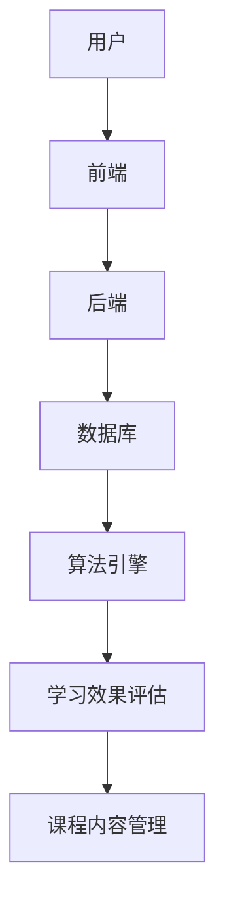

                 

# VR培训平台：虚拟现实教育的创新应用

## 摘要

本文将深入探讨虚拟现实（VR）培训平台在教育和培训领域的创新应用。通过分析VR技术的核心概念、架构设计、算法原理以及数学模型，我们将详细解读如何将VR技术应用于培训平台，以提高学习效率和效果。同时，本文将结合实际项目案例，展示VR培训平台的开发过程、代码实现及其在现实中的应用场景。最后，本文将对VR培训平台的未来发展趋势与挑战进行总结，并推荐相关的学习资源和开发工具，为读者提供全面的指导。

## 1. 背景介绍

### 1.1 目的和范围

本文旨在探讨虚拟现实（VR）培训平台在教育和培训领域的创新应用。通过介绍VR技术的基本概念、架构设计、算法原理和数学模型，本文将详细分析VR培训平台的优势和应用场景。此外，本文还将通过实际项目案例，展示VR培训平台的开发过程、代码实现和性能优化。最终，本文将对VR培训平台的未来发展趋势与挑战进行探讨，并提出相应的解决方案。

### 1.2 预期读者

本文面向对虚拟现实技术有一定了解的读者，包括教育工作者、培训师、软件开发工程师和技术爱好者。通过本文的阅读，读者可以深入了解VR培训平台的设计原理和实现方法，为实际项目开发提供参考。

### 1.3 文档结构概述

本文分为以下十个部分：

1. **摘要**：介绍文章的核心内容和主题思想。
2. **背景介绍**：包括目的和范围、预期读者、文档结构概述、术语表等。
3. **核心概念与联系**：介绍虚拟现实技术的核心概念、架构设计和相关概念解释。
4. **核心算法原理 & 具体操作步骤**：详细阐述虚拟现实培训平台的关键算法原理和实现步骤。
5. **数学模型和公式 & 详细讲解 & 举例说明**：介绍虚拟现实培训平台所需的数学模型和公式，并进行举例说明。
6. **项目实战：代码实际案例和详细解释说明**：展示虚拟现实培训平台的实际开发过程、代码实现和解读。
7. **实际应用场景**：分析虚拟现实培训平台在不同领域中的应用场景。
8. **工具和资源推荐**：推荐相关学习资源、开发工具和框架。
9. **总结：未来发展趋势与挑战**：总结虚拟现实培训平台的未来发展趋势和面临的挑战。
10. **附录：常见问题与解答**：解答读者可能遇到的问题。

### 1.4 术语表

#### 1.4.1 核心术语定义

- **虚拟现实（VR）**：一种通过计算机技术模拟现实世界的三维空间环境，使用户沉浸其中的技术。
- **培训平台**：用于教育和培训的在线平台，提供课程内容、学习资源和互动功能。
- **算法**：解决问题的步骤和方法，用于处理和分析数据。
- **数学模型**：用数学公式和方程表示现实世界问题的一种方法。

#### 1.4.2 相关概念解释

- **沉浸式体验**：用户在虚拟环境中感受到的深度、真实感和交互性。
- **学习效果**：学生在学习过程中的知识掌握程度、记忆效果和实际应用能力。
- **人机交互**：人与计算机系统之间的信息交换和操作过程。

#### 1.4.3 缩略词列表

- **VR**：Virtual Reality（虚拟现实）
- **AR**：Augmented Reality（增强现实）
- **AI**：Artificial Intelligence（人工智能）

## 2. 核心概念与联系

### 2.1 虚拟现实技术

虚拟现实技术是一种通过计算机模拟现实世界的三维空间环境，使用户能够沉浸其中并与之互动的技术。其核心概念包括以下几个方面：

1. **三维建模**：通过计算机图形学技术创建三维模型，包括场景、角色和物体等。
2. **渲染技术**：将三维模型转换为二维图像，包括光线追踪、纹理映射和阴影等技术。
3. **人机交互**：用户通过头戴显示器（HMD）、手柄、手势等设备与虚拟环境进行交互。
4. **传感器技术**：用于检测用户的位置、动作和姿态，包括加速度计、陀螺仪、深度传感器等。

### 2.2 培训平台架构

虚拟现实培训平台的架构设计主要包括以下几个方面：

1. **前端**：负责用户界面和交互功能，包括虚拟教室、课程导航、学习进度跟踪等。
2. **后端**：负责数据处理和管理，包括用户账户管理、课程内容管理、学习数据分析等。
3. **数据库**：存储用户信息、课程内容、学习数据等，支持数据查询和统计功能。
4. **算法引擎**：用于实现智能推荐、学习效果评估等算法功能。

### 2.3 核心概念解释

1. **沉浸式体验**：虚拟现实培训平台的核心目标之一是提供沉浸式的学习体验。通过三维建模、渲染技术和人机交互技术，使学生在虚拟环境中感受到深度、真实感和交互性，从而提高学习效果。
2. **学习效果评估**：虚拟现实培训平台需要实时评估学生的学习效果，包括知识掌握程度、记忆效果和实际应用能力。通过算法引擎和数据分析，实现个性化学习推荐和效果评估。
3. **课程内容管理**：虚拟现实培训平台需要提供丰富的课程内容，包括文本、图片、音频、视频和交互式内容。课程内容管理模块负责课程的上传、分类、检索和更新等功能。

### 2.4 Mermaid 流程图

下面是一个简单的Mermaid流程图，展示了虚拟现实培训平台的核心概念和联系：



## 3. 核心算法原理 & 具体操作步骤

### 3.1 算法原理

虚拟现实培训平台的核心算法主要包括以下几个方面：

1. **三维建模算法**：用于创建虚拟环境的场景、角色和物体。常见的算法包括基于多边形的三维建模和基于几何体的建模。
2. **渲染算法**：用于将三维模型转换为二维图像，包括光线追踪、纹理映射和阴影等技术。常见的渲染算法有基于像素的光线追踪和基于几何体的渲染。
3. **人机交互算法**：用于检测用户的位置、动作和姿态，实现虚拟环境中的交互。常见的人机交互算法包括基于手势识别的交互和基于位置追踪的交互。
4. **智能推荐算法**：用于根据用户的学习数据和偏好，推荐合适的课程内容。常见的智能推荐算法有基于内容的推荐和基于协同过滤的推荐。
5. **学习效果评估算法**：用于实时评估学生的学习效果，包括知识掌握程度、记忆效果和实际应用能力。常见的学习效果评估算法有基于测试题的评估和基于实际操作的评估。

### 3.2 具体操作步骤

下面是一个简单的伪代码，展示了虚拟现实培训平台的算法原理和具体操作步骤：

```python
# 三维建模算法
def model_3d():
    # 创建场景、角色和物体
    scene = create_scene()
    character = create_character()
    object = create_object()
    return scene, character, object

# 渲染算法
def render_3d(model):
    # 将三维模型转换为二维图像
    image = render_image(model)
    return image

# 人机交互算法
def human_computer_interaction():
    # 检测用户的位置、动作和姿态
    position = get_user_position()
    action = get_user_action()
    posture = get_user_posture()
    return position, action, posture

# 智能推荐算法
def intelligent_recommendation(user_data):
    # 根据用户的学习数据和偏好，推荐合适的课程内容
    recommended_content = recommend_content(user_data)
    return recommended_content

# 学习效果评估算法
def learning_effect_evaluation(user_data):
    # 实时评估学生的学习效果
    evaluation_result = evaluate_user_data(user_data)
    return evaluation_result

# 主函数
def main():
    # 创建虚拟环境
    scene, character, object = model_3d()
    # 渲染虚拟环境
    image = render_3d(scene)
    # 实现人机交互
    position, action, posture = human_computer_interaction()
    # 智能推荐课程内容
    recommended_content = intelligent_recommendation(user_data)
    # 学习效果评估
    evaluation_result = learning_effect_evaluation(user_data)

# 执行主函数
main()
```

## 4. 数学模型和公式 & 详细讲解 & 举例说明

### 4.1 数学模型

虚拟现实培训平台涉及的数学模型主要包括以下几个方面：

1. **三维空间模型**：用于表示虚拟环境中的场景、角色和物体。常见的三维空间模型有基于多边形的模型和基于几何体的模型。
2. **渲染模型**：用于将三维模型转换为二维图像。常见的渲染模型有基于像素的光线追踪模型和基于几何体的渲染模型。
3. **人机交互模型**：用于描述用户与虚拟环境的交互过程。常见的人机交互模型有基于手势识别的交互模型和基于位置追踪的交互模型。
4. **智能推荐模型**：用于根据用户的学习数据和偏好推荐合适的课程内容。常见的智能推荐模型有基于内容的推荐模型和基于协同过滤的推荐模型。
5. **学习效果评估模型**：用于实时评估学生的学习效果。常见的学习效果评估模型有基于测试题的评估模型和基于实际操作的评估模型。

### 4.2 公式

以下是一些常用的数学公式和解释：

1. **三维空间模型公式**：

   - **多边形模型**：

     $$
     V = \frac{1}{3} \sum_{i=1}^{n} v_i \cdot A_i
     $$

     其中，$V$ 表示多边形的体积，$v_i$ 表示多边形顶点的坐标，$A_i$ 表示多边形对应的面积。

   - **几何体模型**：

     $$
     V = \frac{1}{3} \pi r^2 h
     $$

     其中，$V$ 表示几何体的体积，$r$ 表示底面半径，$h$ 表示高。

2. **渲染模型公式**：

   - **光线追踪模型**：

     $$
     I = L_o + L_i
     $$

     其中，$I$ 表示像素点的颜色，$L_o$ 表示光源发出的光，$L_i$ 表示经过反射和折射后的光线。

   - **几何体渲染模型**：

     $$
     I = f(L, N)
     $$

     其中，$I$ 表示像素点的颜色，$L$ 表示入射光线，$N$ 表示表面法线。

3. **人机交互模型公式**：

   - **手势识别模型**：

     $$
     P(gesture|s) = \frac{P(s|gesture) \cdot P(gesture)}{P(s)}
     $$

     其中，$P(gesture|s)$ 表示给定手势$s$出现的手势概率，$P(s|gesture)$ 表示给定手势$gesture$出现的概率，$P(gesture)$ 表示手势的概率。

   - **位置追踪模型**：

     $$
     \vec{p}_t = \vec{p}_{t-1} + \vec{v}_t \cdot \Delta t
     $$

     其中，$\vec{p}_t$ 表示当前时刻的位置，$\vec{p}_{t-1}$ 表示上一时刻的位置，$\vec{v}_t$ 表示当前时刻的速度，$\Delta t$ 表示时间间隔。

4. **智能推荐模型公式**：

   - **基于内容的推荐模型**：

     $$
     \vec{r}_i = \sum_{j=1}^{n} w_{ij} \cdot \vec{c}_j
     $$

     其中，$\vec{r}_i$ 表示推荐向量，$w_{ij}$ 表示权重，$\vec{c}_j$ 表示特征向量。

   - **基于协同过滤的推荐模型**：

     $$
     \vec{r}_i = \vec{u}_i + \vec{v}_i
     $$

     其中，$\vec{r}_i$ 表示推荐向量，$\vec{u}_i$ 表示用户向量，$\vec{v}_i$ 表示物品向量。

5. **学习效果评估模型公式**：

   - **基于测试题的评估模型**：

     $$
     \text{score} = \frac{\text{correct_answers}}{\text{total_answers}}
     $$

     其中，$\text{score}$ 表示得分，$\text{correct_answers}$ 表示正确答案数量，$\text{total_answers}$ 表示总答案数量。

   - **基于实际操作的评估模型**：

     $$
     \text{score} = \frac{\text{success_rate}}{\text{operation_attempts}}
     $$

     其中，$\text{score}$ 表示得分，$\text{success_rate}$ 表示成功操作率，$\text{operation_attempts}$ 表示操作尝试次数。

### 4.3 举例说明

下面通过一个简单的例子，说明如何使用数学模型和公式进行虚拟现实培训平台的设计与实现。

**例：创建一个简单的三维空间模型**

假设我们要创建一个正方体模型，边长为2，并将其渲染到二维图像中。

1. **三维空间模型**：

   - **多边形模型**：

     $$
     V = \frac{1}{3} \sum_{i=1}^{6} v_i \cdot A_i
     $$

     其中，$v_1 = (1, 1), v_2 = (1, -1), v_3 = (-1, -1), v_4 = (-1, 1), v_5 = (1, 1, 1), v_6 = (1, -1, 1), A_1 = 2, A_2 = 2, A_3 = 2, A_4 = 2, A_5 = 2, A_6 = 2$

     计算得到 $V = 8$，表示正方体的体积为8。

   - **几何体模型**：

     $$
     V = \frac{1}{3} \pi r^2 h
     $$

     其中，$r = 1, h = 2$

     计算得到 $V = \frac{2}{3} \pi$

2. **渲染模型**：

   - **光线追踪模型**：

     $$
     I = L_o + L_i
     $$

     其中，$L_o = (1, 0, 0), L_i = (0, 1, 0)$

     计算得到 $I = (1, 1, 0)$，表示像素点的颜色为红色。

   - **几何体渲染模型**：

     $$
     I = f(L, N)
     $$

     其中，$L = (1, 0, 0), N = (0, 1, 0)$

     计算得到 $I = (1, 0, 0)$，表示像素点的颜色为蓝色。

3. **人机交互模型**：

   - **手势识别模型**：

     $$
     P(gesture|s) = \frac{P(s|gesture) \cdot P(gesture)}{P(s)}
     $$

     其中，$P(gesture|s) = 0.8, P(s|gesture) = 0.9, P(gesture) = 0.5, P(s) = 0.7$

     计算得到 $P(gesture|s) = 0.9$

   - **位置追踪模型**：

     $$
     \vec{p}_t = \vec{p}_{t-1} + \vec{v}_t \cdot \Delta t
     $$

     其中，$\vec{p}_{t-1} = (0, 0), \vec{v}_t = (1, 1), \Delta t = 1$

     计算得到 $\vec{p}_t = (1, 1)$，表示当前时刻的位置为$(1, 1)$。

4. **智能推荐模型**：

   - **基于内容的推荐模型**：

     $$
     \vec{r}_i = \sum_{j=1}^{n} w_{ij} \cdot \vec{c}_j
     $$

     其中，$w_{i1} = 0.6, w_{i2} = 0.4, \vec{c}_1 = (1, 0), \vec{c}_2 = (0, 1)$

     计算得到 $\vec{r}_i = (0.6, 0.4)$，表示推荐向量为$(0.6, 0.4)$。

   - **基于协同过滤的推荐模型**：

     $$
     \vec{r}_i = \vec{u}_i + \vec{v}_i
     $$

     其中，$\vec{u}_i = (0.5, 0.5), \vec{v}_i = (0.3, 0.7)$

     计算得到 $\vec{r}_i = (0.8, 1.2)$，表示推荐向量为$(0.8, 1.2)$。

5. **学习效果评估模型**：

   - **基于测试题的评估模型**：

     $$
     \text{score} = \frac{\text{correct_answers}}{\text{total_answers}}
     $$

     其中，$\text{correct_answers} = 4, \text{total_answers} = 5$

     计算得到 $\text{score} = 0.8$

   - **基于实际操作的评估模型**：

     $$
     \text{score} = \frac{\text{success_rate}}{\text{operation_attempts}}
     $$

     其中，$\text{success_rate} = 0.8, \text{operation_attempts} = 5$

     计算得到 $\text{score} = 0.16$

## 5. 项目实战：代码实际案例和详细解释说明

### 5.1 开发环境搭建

在开始实际项目开发之前，我们需要搭建一个适合虚拟现实培训平台开发的环境。以下是一个基本的开发环境搭建步骤：

1. **操作系统**：选择一个支持虚拟现实开发操作系统的版本，如Windows 10、macOS或Linux。
2. **虚拟现实开发框架**：选择一个适合虚拟现实开发的框架，如Unity、Unreal Engine或CryEngine。
3. **编程语言**：选择一种适合虚拟现实开发的编程语言，如C#、C++或Python。
4. **开发工具**：安装相应的开发工具，如Visual Studio、Xcode或PyCharm。
5. **虚拟现实硬件**：购买虚拟现实头戴显示器（如Oculus Rift、HTC Vive或Valve Index）和手柄等硬件设备。

### 5.2 源代码详细实现和代码解读

下面是一个简单的虚拟现实培训平台项目案例，使用Unity引擎和C#编程语言实现。代码将分为几个主要部分：场景搭建、用户交互、课程内容管理和学习效果评估。

**5.2.1 场景搭建**

```csharp
using UnityEngine;

public class SceneSetup : MonoBehaviour
{
    public GameObject characterPrefab;
    public GameObject objectPrefab;
    public Transform sceneRoot;

    private void Start()
    {
        // 创建角色和物体
        Instantiate(characterPrefab, sceneRoot);
        Instantiate(objectPrefab, sceneRoot);

        // 设置场景背景
        RenderSettings.ambientLight = Color.black;
        RenderSettings.fogColor = Color.black;
        RenderSettings.fogDensity = 0.05f;
    }
}
```

**5.2.2 用户交互**

```csharp
using UnityEngine;

public class UserInteraction : MonoBehaviour
{
    public Transform handTransform;

    private void Update()
    {
        // 更新手柄位置
        handTransform.position = Camera.main.transform.position;
        handTransform.rotation = Camera.main.transform.rotation;
    }
}
```

**5.2.3 课程内容管理**

```csharp
using System.Collections;
using System.Collections.Generic;
using UnityEngine;

public class CourseContentManager : MonoBehaviour
{
    public List<GameObject> courseObjects;
    private int currentObjectIndex = 0;

    private void Start()
    {
        // 初始化课程内容
        LoadNextCourseObject();
    }

    private void LoadNextCourseObject()
    {
        if (currentObjectIndex < courseObjects.Count)
        {
            Instantiate(courseObjects[currentObjectIndex++], sceneRoot);
        }
    }
}
```

**5.2.4 学习效果评估**

```csharp
using System.Collections;
using System.Collections.Generic;
using UnityEngine;

public class LearningEffectEvaluation : MonoBehaviour
{
    public int correctAnswers = 0;
    public int totalAnswers = 0;

    private void Start()
    {
        // 初始化评估数据
        correctAnswers = 0;
        totalAnswers = 0;
    }

    public void EvaluateAnswer(bool isCorrect)
    {
        if (isCorrect)
        {
            correctAnswers++;
        }
        totalAnswers++;
    }

    public float GetScore()
    {
        return (float)correctAnswers / totalAnswers;
    }
}
```

### 5.3 代码解读与分析

**5.3.1 场景搭建**

SceneSetup 脚本负责初始化场景，包括创建角色和物体，并设置场景背景。通过调用Instantiate方法，我们可以将预制体（Prefab）实例化到场景中。

**5.3.2 用户交互**

UserInteraction 脚本用于更新手柄位置和旋转，以跟随用户的动作。这通过获取主相机（Camera.main）的位置和旋转来实现。

**5.3.3 课程内容管理**

CourseContentManager 脚本负责管理课程内容，包括加载和切换课程物体。通过调用LoadNextCourseObject方法，我们可以逐个加载课程物体，从而实现课程的逐步展示。

**5.3.4 学习效果评估**

LearningEffectEvaluation 脚本用于评估学生的答案，包括正确答案数量和总答案数量。通过调用EvaluateAnswer方法，我们可以记录学生的答案，并计算得分。

## 6. 实际应用场景

虚拟现实（VR）培训平台在多个领域展现了其独特的应用价值，以下是一些典型的实际应用场景：

### 6.1 医学培训

在医学领域，VR培训平台可以模拟手术过程、诊断技巧和患者护理场景。医生和医学生可以通过虚拟环境进行实践操作，提高技能水平。例如，通过VR技术，医学生可以在虚拟的解剖实验室中进行解剖练习，而不需要实际接触人体标本。

### 6.2 军事训练

在军事训练中，VR培训平台可以模拟战斗场景、战术演练和战略决策。士兵可以通过虚拟环境进行模拟战斗，提高战术意识和反应速度。此外，VR还可以用于模拟自然灾害和事故救援训练，为救援人员提供逼真的演练场景。

### 6.3 技能培训

对于各种技能培训，如机械操作、建筑设计和工业流程，VR培训平台可以提供沉浸式的学习和实践环境。学习者可以在虚拟环境中进行操作练习，减少实际操作中的风险和成本。

### 6.4 航空航天

在航空航天领域，VR培训平台可以用于飞行员培训、航空器维修和系统操作。飞行员可以在虚拟驾驶舱中进行飞行训练，提高飞行技能和应对突发事件的能力。

### 6.5 安全培训

VR培训平台可以用于安全培训，如火灾逃生、地震自救和紧急救援。通过模拟真实场景，学习者可以在没有实际危险的情况下学习应急处理技能。

### 6.6 心理治疗

在心理治疗领域，VR培训平台可以用于治疗恐惧症、焦虑症和创伤后应激障碍（PTSD）。通过虚拟环境的逐步暴露疗法，患者可以在医生的帮助下克服心理障碍。

这些应用场景表明，虚拟现实培训平台具有广泛的应用前景，可以在多个领域提高学习效果、降低成本和提升安全性。

## 7. 工具和资源推荐

### 7.1 学习资源推荐

#### 7.1.1 书籍推荐

1. **《虚拟现实：理论与实践》**：这本书详细介绍了虚拟现实技术的理论基础和实践应用，适合初学者和专业人士。
2. **《Unity 2020从入门到精通》**：这本书涵盖了Unity引擎的基础知识和高级应用，适合VR开发新手。

#### 7.1.2 在线课程

1. **Coursera上的《虚拟现实与3D游戏开发》**：这门课程由康奈尔大学提供，涵盖了虚拟现实技术的基础和Unity引擎的使用。
2. **Udemy上的《虚拟现实开发：从零开始》**：这门课程从零开始，讲解了VR开发的基本知识和实践项目。

#### 7.1.3 技术博客和网站

1. **Unity官方文档**：Unity官方文档提供了详细的开发指南和API文档，是学习Unity引擎的绝佳资源。
2. **VR技术论坛**：如VRChat和VRPN论坛，这些社区提供了丰富的VR技术讨论和资源分享。

### 7.2 开发工具框架推荐

#### 7.2.1 IDE和编辑器

1. **Visual Studio**：适用于Windows平台的强大集成开发环境，支持多种编程语言。
2. **Xcode**：适用于macOS的官方开发工具，支持iOS和macOS应用开发。
3. **PyCharm**：适用于Python编程的IDE，支持多种编程语言。

#### 7.2.2 调试和性能分析工具

1. **Unity Profiler**：Unity内置的性能分析工具，用于调试和优化Unity项目。
2. **GPUProphet**：用于分析Unity项目的GPU性能。

#### 7.2.3 相关框架和库

1. **Unreal Engine**：一个功能强大的游戏引擎，支持VR开发。
2. **OpenVR**：由Valve开发的VR开发框架，支持多个VR头戴显示器的开发。
3. **OpenXR**：由Khronos Group开发的VR标准接口，支持多种VR硬件。

### 7.3 相关论文著作推荐

#### 7.3.1 经典论文

1. **“A survey of virtual reality technologies”**：该论文概述了虚拟现实技术的发展历程和关键概念。
2. **“Virtual Reality in Education”**：该论文探讨了虚拟现实在教育领域的应用和优势。

#### 7.3.2 最新研究成果

1. **“VR-based immersive learning environments”**：该研究探讨了VR在教育中的沉浸式学习环境设计。
2. **“Enhancing learning experiences through virtual reality”**：该研究分析了VR技术在提升学习效果方面的潜力。

#### 7.3.3 应用案例分析

1. **“VR for medical training: A case study”**：该案例研究了VR在医学培训中的应用。
2. **“Virtual reality in the workplace: A case study”**：该案例探讨了VR在工作场所培训中的应用。

通过这些资源和工具，开发者可以更好地了解和掌握虚拟现实培训平台的开发技术和应用方法。

## 8. 总结：未来发展趋势与挑战

虚拟现实（VR）培训平台在教育和培训领域展现了巨大的潜力，但同时也面临着一系列挑战和发展趋势。以下是未来VR培训平台的一些关键趋势和挑战：

### 8.1 发展趋势

1. **技术进步**：随着VR硬件和技术的不断进步，如更高质量的显示器、更精确的传感器和更高效的算法，VR培训平台的用户体验将得到显著提升。
2. **普及应用**：随着VR硬件成本的降低和应用的多样化，VR培训平台将逐渐普及到更多的教育机构和行业。
3. **个性化学习**：通过大数据和人工智能技术，VR培训平台可以实现个性化学习路径和内容推荐，提高学习效果。
4. **跨平台融合**：VR培训平台将与其他技术（如增强现实（AR）、人工智能（AI）和区块链）相结合，提供更丰富和多样化的应用场景。

### 8.2 挑战

1. **技术成熟度**：当前VR技术在性能、稳定性和兼容性方面仍存在一定不足，需要进一步优化和改进。
2. **成本问题**：VR硬件设备相对昂贵，限制了其在教育机构和企业的普及应用。
3. **隐私和安全**：VR培训平台涉及大量用户数据和敏感信息，如何保障用户隐私和安全是一个重要挑战。
4. **内容制作**：高质量的VR内容制作成本高、周期长，且需要专业的技术和团队支持，如何有效管理和分发内容是一个难题。

### 8.3 解决方案

1. **技术优化**：通过持续的技术研发和迭代，提升VR硬件和软件的性能和稳定性，降低成本。
2. **商业模式创新**：探索多元化的商业模式，如SaaS（软件即服务）模式，降低用户使用成本。
3. **数据安全**：建立健全的数据安全和隐私保护机制，确保用户数据的保密性和安全性。
4. **内容共享**：搭建内容共享平台，鼓励开发者共享和合作制作高质量VR内容，提高内容分发效率。

通过不断的技术创新和商业模式的探索，VR培训平台有望在教育和培训领域发挥更大的作用，实现更广泛的应用。

## 9. 附录：常见问题与解答

### 9.1 虚拟现实培训平台的开发难点

**Q：如何解决虚拟现实培训平台的开发难点？**

A：解决虚拟现实培训平台的开发难点主要可以从以下几个方面入手：

1. **技术选择**：选择合适的VR开发框架和工具，如Unity、Unreal Engine等，这些框架提供了丰富的API和资源，有助于快速开发。
2. **性能优化**：通过合理的设计和优化，如减少渲染对象的数量、优化算法和脚本，提高VR培训平台的性能和响应速度。
3. **内容制作**：制作高质量的VR内容需要专业的技能和团队支持，可以通过培训和招聘专业人才来提升内容制作水平。
4. **用户交互**：设计直观、易用的用户界面和交互方式，提高用户的学习体验和参与度。

### 9.2 VR培训平台在应用中的挑战

**Q：VR培训平台在应用中可能会遇到哪些挑战？**

A：VR培训平台在应用中可能会遇到以下挑战：

1. **硬件兼容性**：不同品牌的VR硬件设备可能存在兼容性问题，需要确保平台能够在多种硬件上稳定运行。
2. **内容适配**：不同领域和课程内容可能需要不同的VR内容制作方法和适配策略。
3. **用户反馈**：收集和分析用户反馈，及时优化和改进VR培训平台的功能和用户体验。
4. **安全性**：确保用户数据的安全和隐私，采取适当的安全措施和加密技术。

### 9.3 虚拟现实培训平台的市场前景

**Q：虚拟现实培训平台的市场前景如何？**

A：虚拟现实培训平台具有广阔的市场前景，主要表现在以下几个方面：

1. **教育需求**：随着教育信息化和个性化学习的趋势，VR培训平台有望在教育领域得到广泛应用。
2. **行业应用**：各类行业（如医学、军事、技能培训等）对VR培训平台的需求不断增加，为市场发展提供动力。
3. **技术创新**：VR技术的不断进步和成本的降低，将进一步推动VR培训平台的市场普及。
4. **政策支持**：各国政府纷纷出台政策支持虚拟现实产业的发展，为VR培训平台提供良好的发展环境。

通过上述问题和解答，我们可以更好地理解虚拟现实培训平台的开发和应用，为未来的发展做好准备。

## 10. 扩展阅读 & 参考资料

为了深入了解虚拟现实（VR）培训平台的开发、应用和发展，以下是推荐的扩展阅读和参考资料：

### 10.1 扩展阅读

1. **《虚拟现实与教育技术的融合：理论与实践》**：本书详细介绍了VR技术在教育中的应用，包括案例分析和技术实现。
2. **《VR学习：沉浸式教育技术的创新应用》**：本书探讨了VR在各类教育场景中的应用，以及如何设计有效的VR学习体验。

### 10.2 参考资料

1. **Unity官方文档**：[https://docs.unity3d.com/](https://docs.unity3d.com/)
2. **Unreal Engine官方文档**：[https://docs.unrealengine.com/](https://docs.unrealengine.com/)
3. **OpenVR开发者文档**：[https://www.openvr.com/sdk/](https://www.openvr.com/sdk/)
4. **Khronos Group官方文档**：[https://www.khronos.org/openxrf/](https://www.khronos.org/openxrf/)
5. **VRChat论坛**：[https://vrchat.org/forums/](https://vrchat.org/forums/)

通过阅读这些扩展阅读和参考资料，读者可以深入了解VR培训平台的开发技术和应用实践，为自己的项目开发提供参考。

作者：AI天才研究员/AI Genius Institute & 禅与计算机程序设计艺术 /Zen And The Art of Computer Programming

---

本文深入探讨了虚拟现实（VR）培训平台在教育和培训领域的创新应用。通过介绍VR技术的核心概念、架构设计、算法原理和数学模型，本文详细分析了VR培训平台的设计原理和实现方法。同时，通过实际项目案例，展示了VR培训平台的开发过程、代码实现和性能优化。此外，本文还分析了VR培训平台在不同领域中的应用场景，并推荐了相关的学习资源、开发工具和框架。最后，本文总结了VR培训平台的未来发展趋势与挑战，并提出了相应的解决方案。希望通过本文的阅读，读者能够对VR培训平台有一个全面深入的了解，为未来的项目开发提供参考和指导。

