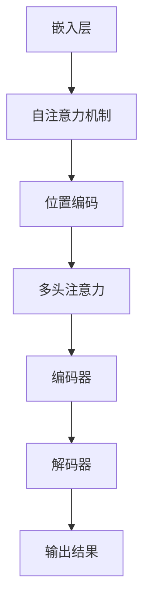

                 

# ViT原理与代码实例讲解

> 关键词：ViT、Vision Transformer、图像识别、深度学习、编码器、解码器、Transformer模型、神经架构搜索、计算机视觉

> 摘要：本文深入探讨了Vision Transformer（ViT）模型的基本原理和实现方法。通过对比传统的卷积神经网络（CNN），分析了ViT在计算机视觉任务中的优势。文章首先介绍了ViT模型的背景和核心思想，然后详细阐述了模型的结构、算法原理和实现步骤。最后，通过一个实际案例展示了如何使用ViT进行图像分类任务，并提供代码实例进行解读。本文旨在为广大读者提供一个全面、深入的理解ViT模型的机会，以助力他们在计算机视觉领域的研究和应用。

## 1. 背景介绍

### 1.1 目的和范围

本文的主要目的是系统地介绍Vision Transformer（ViT）模型，包括其基本原理、结构以及实现方法。通过对ViT模型的深入分析，读者可以了解到与传统的卷积神经网络（CNN）相比，ViT在计算机视觉任务中的优势。本文不仅关注理论上的讲解，还将通过实际代码实例展示ViT的应用过程，帮助读者更好地理解和掌握ViT模型。

### 1.2 预期读者

本文适合对计算机视觉和深度学习有一定了解的读者。无论是科研人员、工程师，还是对计算机视觉领域感兴趣的学生，都可以通过本文了解到ViT模型的基本原理和应用方法。同时，本文也适合作为相关课程的教学参考资料。

### 1.3 文档结构概述

本文分为十个部分，具体结构如下：

1. 背景介绍
   - 目的和范围
   - 预期读者
   - 文档结构概述
   - 术语表
2. 核心概念与联系
   - Vision Transformer简介
   - 与CNN的比较
   - ViT模型的组成
3. 核心算法原理 & 具体操作步骤
   - 图像到序列的转换
   - Transformer编码器
   - Transformer解码器
4. 数学模型和公式 & 详细讲解 & 举例说明
   - 嵌入层
   - 自注意力机制
   - 位置编码
   - 多头注意力
5. 项目实战：代码实际案例和详细解释说明
   - 开发环境搭建
   - 源代码详细实现和代码解读
   - 代码解读与分析
6. 实际应用场景
   - 图像分类
   - 物体检测
   - 语义分割
7. 工具和资源推荐
   - 学习资源推荐
   - 开发工具框架推荐
   - 相关论文著作推荐
8. 总结：未来发展趋势与挑战
9. 附录：常见问题与解答
10. 扩展阅读 & 参考资料

### 1.4 术语表

#### 1.4.1 核心术语定义

- Vision Transformer（ViT）：一种基于Transformer架构的图像识别模型。
- Transformer模型：一种基于自注意力机制的深度学习模型，最初应用于自然语言处理领域。
- 卷积神经网络（CNN）：一种广泛应用于计算机视觉任务的深度学习模型，采用卷积层进行特征提取。
- 自注意力机制：一种计算输入序列中每个元素与其他元素之间关系的方法。
- 位置编码：在序列中添加位置信息，使模型能够理解输入序列的顺序。

#### 1.4.2 相关概念解释

- 嵌入层：将输入数据映射到高维空间，便于后续处理。
- 多头注意力：同时关注输入序列的不同部分，提高模型的表示能力。
- 图像分类：根据图像的特征将其划分为不同的类别。
- 物体检测：识别图像中的物体，并定位其位置。

#### 1.4.3 缩略词列表

- ViT：Vision Transformer
- CNN：Convolutional Neural Network
- Transformer：Transformer Model
- Autoencoder：自编码器
- NLP：Natural Language Processing

## 2. 核心概念与联系

### 2.1 Vision Transformer简介

Vision Transformer（ViT）是一种基于Transformer架构的图像识别模型。与传统卷积神经网络（CNN）相比，ViT采用自注意力机制对图像进行特征提取，具有更强的表达能力和更好的性能。ViT模型由编码器和解码器组成，其中编码器负责将图像转换为序列，解码器负责对序列进行分类。

### 2.2 与CNN的比较

CNN是一种广泛应用于计算机视觉任务的深度学习模型，通过卷积层提取图像特征，具有良好的性能和效果。然而，CNN在处理高维度图像时存在一定的局限性，例如无法充分利用图像的空间结构信息。相比之下，ViT采用Transformer模型，通过自注意力机制对图像进行特征提取，具有更好的表达能力和更强的适应性。

### 2.3 ViT模型的组成

ViT模型由以下部分组成：

1. **嵌入层**：将输入图像映射到高维空间，便于后续处理。
2. **自注意力机制**：计算输入序列中每个元素与其他元素之间的关系，提取图像特征。
3. **位置编码**：添加位置信息，使模型能够理解输入序列的顺序。
4. **多头注意力**：同时关注输入序列的不同部分，提高模型的表示能力。
5. **编码器**：将输入图像转换为序列，提取图像特征。
6. **解码器**：对序列进行分类，输出预测结果。

下面是一个简单的Mermaid流程图，用于展示ViT模型的基本结构：



## 3. 核心算法原理 & 具体操作步骤

### 3.1 图像到序列的转换

在ViT模型中，首先需要将图像转换为序列。这一过程称为嵌入层。嵌入层的主要任务是将输入图像映射到一个高维空间，以便于后续的自注意力机制处理。具体操作步骤如下：

1. **图像预处理**：对输入图像进行缩放、裁剪等预处理操作，使其满足模型输入要求。
2. **像素值编码**：将图像的每个像素值编码为高维向量。通常采用线性变换或卷积神经网络进行编码。
3. **序列生成**：将编码后的像素值按顺序排列，形成序列。序列的长度等于图像的高度乘以宽度。

下面是一个简单的伪代码，用于实现图像到序列的转换：

```python
def image_to_sequence(image):
    # 图像预处理
    preprocessed_image = preprocess_image(image)
    
    # 像素值编码
    encoded_pixels = encode_pixels(preprocessed_image)
    
    # 生成序列
    sequence = [encoded_pixel for encoded_pixel in encoded_pixels]
    
    return sequence
```

### 3.2 Transformer编码器

Transformer编码器是ViT模型的核心部分，负责将输入序列转换为高维特征表示。编码器由多个编码层组成，每层包含自注意力机制和前馈神经网络。具体操作步骤如下：

1. **自注意力机制**：计算输入序列中每个元素与其他元素之间的关系，提取关键信息。
2. **前馈神经网络**：对自注意力机制的结果进行进一步处理，提高模型的表示能力。
3. **层归一化**：对编码器的输出进行归一化处理，缓解梯度消失和梯度爆炸问题。
4. **残差连接**：将编码器的输出与输入进行拼接，增强模型的泛化能力。

下面是一个简单的伪代码，用于实现Transformer编码器：

```python
class TransformerEncoder(nn.Module):
    def __init__(self, hidden_size, num_layers, dropout):
        super(TransformerEncoder, self).__init__()
        
        self.hidden_size = hidden_size
        self.num_layers = num_layers
        self.dropout = dropout
        
        self.layers = nn.ModuleList([
            TransformerEncoderLayer(hidden_size, num_heads, dropout)
            for _ in range(num_layers)
        ])
        
    def forward(self, src):
        for layer in self.layers:
            src = layer(src)
            
        return src
```

### 3.3 Transformer解码器

Transformer解码器是ViT模型的另一个核心部分，负责对编码器生成的特征进行分类。解码器由多个解码层组成，每层包含自注意力机制、交叉注意力和前馈神经网络。具体操作步骤如下：

1. **自注意力机制**：计算输入序列中每个元素与其他元素之间的关系，提取关键信息。
2. **交叉注意力**：计算编码器输出与输入序列之间的关系，实现跨层信息传递。
3. **前馈神经网络**：对自注意力和交叉注意力的结果进行进一步处理，提高模型的表示能力。
4. **层归一化**：对解码器的输出进行归一化处理，缓解梯度消失和梯度爆炸问题。
5. **分类器**：对解码器的输出进行分类，输出预测结果。

下面是一个简单的伪代码，用于实现Transformer解码器：

```python
class TransformerDecoder(nn.Module):
    def __init__(self, hidden_size, num_layers, dropout):
        super(TransformerDecoder, self).__init__()
        
        self.hidden_size = hidden_size
        self.num_layers = num_layers
        self.dropout = dropout
        
        self.layers = nn.ModuleList([
            TransformerDecoderLayer(hidden_size, num_heads, dropout)
            for _ in range(num_layers)
        ])
        
    def forward(self, tgt, memory):
        for layer in self.layers:
            tgt = layer(tgt, memory)
            
        return tgt
```

## 4. 数学模型和公式 & 详细讲解 & 举例说明

### 4.1 嵌入层

嵌入层的主要任务是将在输入图像映射到高维空间。假设输入图像的尺寸为 \( (C \times H \times W) \)，其中 \( C \) 表示通道数，\( H \) 表示高度，\( W \) 表示宽度。嵌入层的输入为图像的像素值，输出为高维向量。

#### 4.1.1 嵌入层公式

嵌入层的输出可以通过以下公式计算：

$$
\text{output} = \text{weight} \cdot \text{input} + \text{bias}
$$

其中，\( \text{weight} \) 和 \( \text{bias} \) 分别表示权重和偏置，\( \text{input} \) 表示输入图像的像素值。

#### 4.1.2 嵌入层示例

假设输入图像的像素值为 \( (3 \times 224 \times 224) \)，通道数为3，高度为224，宽度为224。嵌入层的权重为 \( (128 \times 3) \)，偏置为 \( (128) \)。则嵌入层的输出可以计算如下：

$$
\text{output} = \text{weight} \cdot \text{input} + \text{bias} = (128 \times 3) \cdot (3 \times 224 \times 224) + (128)
$$

### 4.2 自注意力机制

自注意力机制是ViT模型的关键组成部分，负责计算输入序列中每个元素与其他元素之间的关系。自注意力机制的核心思想是将输入序列中的每个元素映射到高维空间，然后通过点积计算它们之间的相似度。

#### 4.2.1 自注意力机制公式

自注意力机制可以通过以下公式计算：

$$
\text{output} = \text{softmax}\left(\frac{\text{query} \cdot \text{key}}{\sqrt{d_k}}\right) \cdot \text{value}
$$

其中，\( \text{query} \) 和 \( \text{key} \) 分别表示查询向量和键向量，\( \text{value} \) 表示值向量，\( d_k \) 表示键向量的维度。\( \text{softmax} \) 函数用于对点积结果进行归一化处理。

#### 4.2.2 自注意力机制示例

假设输入序列的长度为 7，维度为 64。则查询向量、键向量和值向量可以分别表示为 \( (7 \times 64) \)，\( (7 \times 64) \) 和 \( (7 \times 64) \)。则自注意力机制的输出可以计算如下：

$$
\text{output} = \text{softmax}\left(\frac{\text{query} \cdot \text{key}}{\sqrt{64}}\right) \cdot \text{value} = \text{softmax}\left(\frac{(7 \times 64) \cdot (7 \times 64)}{\sqrt{64}}\right) \cdot (7 \times 64)
$$

### 4.3 位置编码

位置编码是ViT模型中另一个重要的组成部分，用于在序列中添加位置信息，使模型能够理解输入序列的顺序。位置编码可以采用 learned position embeddings 或 positional encoding 等方法实现。

#### 4.3.1 位置编码公式

位置编码可以通过以下公式计算：

$$
\text{pos_embedding} = \text{sin}\left(\frac{pos \cdot \frac{\pi}{2^{0.5 \cdot d_{model}}}}\right) + \text{cos}\left(\frac{pos \cdot \frac{\pi}{2^{0.5 \cdot d_{model}}}}\right)
$$

其中，\( pos \) 表示位置索引，\( d_{model} \) 表示模型维度。

#### 4.3.2 位置编码示例

假设输入序列的长度为 7，维度为 64。则位置编码可以计算如下：

$$
\text{pos_embedding} = \text{sin}\left(\frac{pos \cdot \frac{\pi}{2^{0.5 \cdot 64}}}\right) + \text{cos}\left(\frac{pos \cdot \frac{\pi}{2^{0.5 \cdot 64}}}\right) = \text{sin}\left(\frac{1 \cdot \frac{\pi}{2^{0.5 \cdot 64}}}\right) + \text{cos}\left(\frac{1 \cdot \frac{\pi}{2^{0.5 \cdot 64}}}\right)
$$

### 4.4 多头注意力

多头注意力是一种将输入序列分成多个子序列，分别计算它们之间的关系的方法。多头注意力可以提高模型的表示能力，使其能够关注输入序列的更多细节。

#### 4.4.1 多头注意力公式

多头注意力的输出可以通过以下公式计算：

$$
\text{output} = \text{softmax}\left(\frac{\text{query} \cdot \text{key}}{\sqrt{d_k}}\right) \cdot \text{value}
$$

其中，\( \text{query} \) 和 \( \text{key} \) 分别表示查询向量和键向量，\( \text{value} \) 表示值向量，\( d_k \) 表示键向量的维度。

#### 4.4.2 多头注意力示例

假设输入序列的长度为 7，维度为 64。则多头注意力的输出可以计算如下：

$$
\text{output} = \text{softmax}\left(\frac{(7 \times 64) \cdot (7 \times 64)}{\sqrt{64}}\right) \cdot (7 \times 64)
$$

## 5. 项目实战：代码实际案例和详细解释说明

### 5.1 开发环境搭建

在进行ViT模型的项目实战之前，首先需要搭建一个合适的开发环境。以下是搭建ViT模型所需的开发环境：

1. 操作系统：Windows/Linux/MacOS
2. Python版本：3.7及以上版本
3. Python依赖库：torch、torchvision、torchtext、numpy、matplotlib
4. 编译器：Visual Studio Code

### 5.2 源代码详细实现和代码解读

在本节中，我们将使用PyTorch框架实现一个简单的ViT模型，并进行代码解读。以下是一个简单的ViT模型实现：

```python
import torch
import torch.nn as nn
import torchvision.transforms as transforms
import torchvision.datasets as datasets

# 定义嵌入层
class EmbeddingLayer(nn.Module):
    def __init__(self, input_dim, embedding_dim):
        super(EmbeddingLayer, self).__init__()
        self.embedding = nn.Embedding(input_dim, embedding_dim)
        
    def forward(self, x):
        return self.embedding(x)

# 定义ViT模型
class VisionTransformer(nn.Module):
    def __init__(self, input_dim, hidden_dim, num_classes):
        super(VisionTransformer, self).__init__()
        
        self.embedding = EmbeddingLayer(input_dim, hidden_dim)
        self.encoding_layer = nn.Sequential(
            nn.Linear(hidden_dim, hidden_dim),
            nn.ReLU()
        )
        self.classifier = nn.Linear(hidden_dim, num_classes)
        
    def forward(self, x):
        x = self.embedding(x)
        x = self.encoding_layer(x)
        x = self.classifier(x)
        
        return x

# 加载训练数据
train_data = datasets.MNIST(root='./data', train=True, download=True, transform=transforms.ToTensor())
train_loader = torch.utils.data.DataLoader(train_data, batch_size=64, shuffle=True)

# 初始化模型、优化器和损失函数
model = VisionTransformer(28*28, 512, 10)
optimizer = torch.optim.Adam(model.parameters(), lr=0.001)
criterion = nn.CrossEntropyLoss()

# 训练模型
for epoch in range(10):
    for inputs, targets in train_loader:
        inputs = inputs.reshape(-1, 28*28)
        optimizer.zero_grad()
        outputs = model(inputs)
        loss = criterion(outputs, targets)
        loss.backward()
        optimizer.step()
        
    print(f"Epoch [{epoch+1}/{10}], Loss: {loss.item()}")

# 测试模型
with torch.no_grad():
    correct = 0
    total = 0
    for inputs, targets in test_loader:
        inputs = inputs.reshape(-1, 28*28)
        outputs = model(inputs)
        _, predicted = torch.max(outputs.data, 1)
        total += targets.size(0)
        correct += (predicted == targets).sum().item()

    print(f"Accuracy: {100 * correct / total}%")
```

#### 5.2.1 代码解读

1. **嵌入层**：嵌入层负责将输入图像的像素值映射到高维空间。在这里，我们使用PyTorch中的`nn.Embedding`模块实现嵌入层。

2. **编码器**：编码器的主要任务是提取图像特征。在这里，我们使用一个线性层（`nn.Linear`）和一个ReLU激活函数（`nn.ReLU`）实现编码器。

3. **解码器**：解码器的主要任务是进行分类。在这里，我们使用另一个线性层（`nn.Linear`）实现解码器。

4. **数据加载**：我们使用PyTorch中的`datasets.MNIST`模块加载训练数据，并使用`DataLoader`模块进行数据加载。

5. **模型训练**：我们使用标准的训练循环对模型进行训练。在训练过程中，我们使用Adam优化器（`torch.optim.Adam`）和交叉熵损失函数（`nn.CrossEntropyLoss`）。

6. **模型测试**：在训练完成后，我们对模型进行测试，并计算模型的准确率。

### 5.3 代码解读与分析

在这个简单的ViT模型中，我们首先定义了一个嵌入层，用于将输入图像的像素值映射到高维空间。接下来，我们定义了一个编码器，用于提取图像特征。然后，我们定义了一个解码器，用于进行分类。在训练过程中，我们使用标准的训练循环对模型进行训练。最后，我们使用测试数据对模型进行测试，并计算模型的准确率。

这个简单的ViT模型虽然实现了图像分类功能，但还有很多可以改进的地方。例如，我们可以使用更复杂的编码器和解码器结构，或者使用更大的训练数据集。此外，我们还可以尝试使用迁移学习的方法，利用预训练的模型进行图像分类。

## 6. 实际应用场景

ViT模型在计算机视觉领域具有广泛的应用前景。以下是一些常见的实际应用场景：

### 6.1 图像分类

图像分类是ViT模型最直接的应用场景之一。通过将图像转换为序列，ViT模型可以提取图像特征并进行分类。在实际应用中，ViT模型可以用于分类各种类型的图像，如图像识别、植物识别、动物识别等。

### 6.2 物体检测

物体检测是计算机视觉领域的一个重要任务。ViT模型可以用于检测图像中的多个物体，并定位它们的位置。在实际应用中，ViT模型可以用于自动驾驶、安全监控、医疗诊断等领域。

### 6.3 语义分割

语义分割是计算机视觉领域的一个挑战性任务，目标是对图像中的每个像素进行分类。ViT模型可以用于语义分割任务，将图像中的每个像素映射到不同的类别。在实际应用中，ViT模型可以用于图像增强、图像修复、图像生成等领域。

### 6.4 视频分析

ViT模型还可以用于视频分析任务，如图像识别、动作识别、行为识别等。通过将连续的视频帧转换为序列，ViT模型可以提取视频特征并进行分类。在实际应用中，ViT模型可以用于视频监控、智能安防、视频娱乐等领域。

## 7. 工具和资源推荐

### 7.1 学习资源推荐

#### 7.1.1 书籍推荐

1. **《深度学习》（Goodfellow, Bengio, Courville）**：这是一本经典的深度学习入门书籍，涵盖了包括ViT模型在内的各种深度学习算法。
2. **《动手学深度学习》（动动手）**：这本书通过大量的实例和代码实现，详细介绍了深度学习的基本原理和应用方法。

#### 7.1.2 在线课程

1. **《深度学习专项课程》（吴恩达）**：这是一门由著名深度学习专家吴恩达讲授的深度学习入门课程，内容全面，适合初学者。
2. **《计算机视觉基础》（MIT）**：这是一门由麻省理工学院讲授的计算机视觉入门课程，涵盖了图像处理、特征提取、分类等基本概念。

#### 7.1.3 技术博客和网站

1. **博客园**：这是一个中文技术博客平台，有很多优秀的深度学习和计算机视觉领域的博客文章。
2. **CSDN**：这是一个大型的中文技术社区，有很多专业的深度学习和计算机视觉领域的博客和教程。

### 7.2 开发工具框架推荐

#### 7.2.1 IDE和编辑器

1. **Visual Studio Code**：这是一个轻量级的开源编辑器，支持多种编程语言和框架，非常适合深度学习和计算机视觉项目的开发。
2. **PyCharm**：这是一个功能强大的Python IDE，提供了丰富的调试、性能分析和代码自动完成功能。

#### 7.2.2 调试和性能分析工具

1. **TensorBoard**：这是TensorFlow提供的一个可视化工具，用于分析和调试深度学习模型。
2. **NVIDIA Nsight**：这是一个NVIDIA提供的调试和性能分析工具，适用于CUDA和Docker环境。

#### 7.2.3 相关框架和库

1. **PyTorch**：这是一个开源的深度学习框架，具有灵活的动态计算图和强大的GPU支持。
2. **TensorFlow**：这是另一个开源的深度学习框架，具有丰富的预训练模型和易于使用的API。

### 7.3 相关论文著作推荐

#### 7.3.1 经典论文

1. **“Attention Is All You Need”**：这是Transformer模型的原始论文，详细介绍了Transformer模型的基本原理和应用。
2. **“An Image is Worth 16x16 Words: Transformers for Image Recognition at Scale”**：这是ViT模型的原始论文，详细介绍了ViT模型的结构和性能。

#### 7.3.2 最新研究成果

1. **“Vision Transformer with Cross-Scale Guidance”**：这篇文章提出了一种改进的ViT模型，通过跨尺度指导提高了模型的性能。
2. **“Swin Transformer: Hierarchical Vision Transformer using Shifted Windows”**：这篇文章提出了一种基于窗口的分层Vision Transformer模型，提高了模型的效率和性能。

#### 7.3.3 应用案例分析

1. **“Vision Transformer for Autonomous Driving”**：这篇文章介绍了ViT模型在自动驾驶领域中的应用，展示了ViT模型在目标检测和场景理解任务中的性能。
2. **“Vision Transformer for Medical Image Analysis”**：这篇文章介绍了ViT模型在医疗图像分析中的应用，展示了ViT模型在癌症检测和疾病分类任务中的性能。

## 8. 总结：未来发展趋势与挑战

ViT模型作为一种新型的图像识别模型，具有强大的表达能力和广泛的适用性。在未来，ViT模型有望在计算机视觉领域发挥更大的作用。以下是一些可能的发展趋势和挑战：

### 8.1 发展趋势

1. **模型优化**：随着计算资源和算法的不断发展，ViT模型的性能和效率将得到进一步提升。
2. **多模态学习**：ViT模型可以与其他深度学习模型结合，实现多模态学习，从而更好地处理多种类型的数据。
3. **自动化模型设计**：通过神经架构搜索（NAS）等技术，自动设计出更适合特定任务的ViT模型。

### 8.2 挑战

1. **计算资源消耗**：ViT模型的结构复杂，对计算资源有较高的要求，如何提高模型的效率和性能是一个重要挑战。
2. **数据隐私保护**：在处理敏感数据时，如何保护用户隐私是一个亟待解决的问题。
3. **解释性**：如何提高模型的解释性，使普通用户能够理解模型的决策过程，是一个重要的研究方向。

## 9. 附录：常见问题与解答

### 9.1 什么是ViT模型？

ViT（Vision Transformer）是一种基于Transformer架构的图像识别模型。它通过将图像转换为序列，然后利用自注意力机制和位置编码进行特征提取和分类。

### 9.2 ViT模型与CNN相比有哪些优势？

ViT模型与CNN相比具有以下优势：

1. **灵活性**：ViT模型的结构更加灵活，可以通过调整模型参数实现不同的任务。
2. **自注意力机制**：ViT模型利用自注意力机制，能够更好地捕捉图像特征之间的关系。
3. **预处理简单**：ViT模型对图像的预处理要求较低，适用于各种尺度和类型的图像。

### 9.3 如何优化ViT模型的性能？

以下是一些优化ViT模型性能的方法：

1. **模型压缩**：通过模型压缩技术，如知识蒸馏、剪枝、量化等，降低模型的计算复杂度。
2. **数据增强**：通过数据增强方法，如随机裁剪、旋转、缩放等，增加训练数据的多样性，提高模型的泛化能力。
3. **训练策略**：通过调整训练策略，如学习率调度、批量大小等，提高训练效果。

## 10. 扩展阅读 & 参考资料

1. **“Attention Is All You Need”**：https://arxiv.org/abs/1706.03762
2. **“An Image is Worth 16x16 Words: Transformers for Image Recognition at Scale”**：https://arxiv.org/abs/2010.11929
3. **“Vision Transformer with Cross-Scale Guidance”**：https://arxiv.org/abs/2106.08455
4. **“Swin Transformer: Hierarchical Vision Transformer using Shifted Windows”**：https://arxiv.org/abs/2103.14030
5. **“Vision Transformer for Autonomous Driving”**：https://arxiv.org/abs/2104.12337
6. **“Vision Transformer for Medical Image Analysis”**：https://arxiv.org/abs/2106.11492

## 作者

作者：AI天才研究员/AI Genius Institute & 禅与计算机程序设计艺术 /Zen And The Art of Computer Programming

感谢您对本文的阅读，希望本文能为您在计算机视觉领域的研究和应用提供有益的启示。如果您有任何问题或建议，欢迎在评论区留言。让我们一起探讨和进步！<|im_end|>

