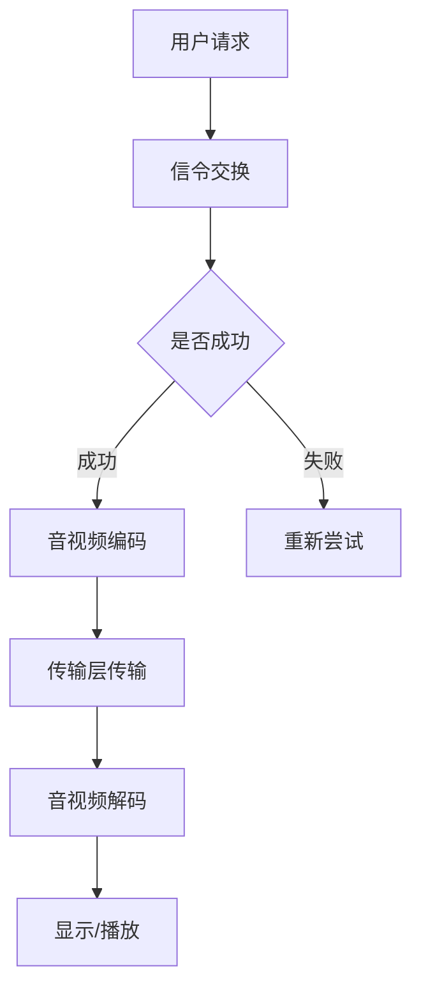

                 

# WebRTC音视频会议系统开发

## 摘要

随着互联网的迅猛发展，音视频会议系统已经成为远程办公、在线教育、远程医疗等领域的核心应用。WebRTC（Web Real-Time Communication）作为一种开放协议，使得开发实时的音视频通信应用变得更加简单和高效。本文将围绕WebRTC音视频会议系统的开发，从背景介绍、核心概念、算法原理、数学模型、项目实战、应用场景、工具推荐、未来发展趋势等方面，全面深入地探讨WebRTC技术的应用与实践。

## 1. 背景介绍

音视频会议系统作为现代通信的重要工具，已经广泛应用于各类场景。在远程办公领域，音视频会议系统可以替代传统的面对面会议，提高工作效率；在线教育领域，音视频会议系统为师生提供了便捷的互动方式，提升了教学质量；远程医疗领域，音视频会议系统则实现了医生与患者之间的实时沟通，提升了医疗服务水平。

然而，传统的音视频会议系统存在诸多不足，如带宽占用大、延迟高、稳定性差等。随着WebRTC技术的出现，这些问题得到了有效解决。WebRTC是一种开放协议，旨在实现网页上的实时音视频通信。它具有低延迟、高带宽利用率、跨平台兼容性强等优点，成为了音视频会议系统开发的理想选择。

## 2. 核心概念与联系

### 2.1 WebRTC协议

WebRTC是一种开放协议，它定义了音视频通信的传输协议和API。WebRTC协议主要包括以下三个部分：

- **信令协议**：用于交换客户端信息，如IP地址、端口号等。信令协议可以是TCP、UDP或STUN/TURN协议。

- **传输层协议**：用于传输音视频数据，可以是RTP（实时传输协议）或RTCP（实时传输控制协议）。

- **应用层协议**：用于处理音视频编解码、流控制、加密等。

### 2.2 音视频编解码

音视频编解码是音视频会议系统的核心技术之一。音视频编解码可以将原始的音频和视频数据压缩成适合传输的格式，同时保证音视频质量。常见的音视频编解码标准包括H.264、HEVC、AAC、Opus等。

### 2.3 Mermaid流程图

以下是一个简单的WebRTC音视频会议系统架构的Mermaid流程图：



## 3. 核心算法原理 & 具体操作步骤

### 3.1 音视频编码算法

音视频编码算法主要包括以下步骤：

1. **采样与量化**：对音频和视频信号进行采样和量化，将其转化为数字信号。

2. **压缩编码**：使用编解码标准（如H.264、HEVC等）对采样和量化的信号进行压缩编码，减少数据量。

3. **封装**：将压缩后的音视频数据封装成RTP包，便于传输。

### 3.2 音视频解码算法

音视频解码算法主要包括以下步骤：

1. **解封装**：将RTP包中的音视频数据解封装，提取出压缩数据。

2. **解压缩编码**：使用编解码标准（如H.264、HEVC等）对压缩数据进行解压缩编码，还原成采样和量化的信号。

3. **重构信号**：对采样和量化信号进行重构，得到原始的音频和视频信号。

4. **播放**：将重构的音频和视频信号播放出来。

### 3.3 具体操作步骤

以下是一个简单的WebRTC音视频会议系统开发流程：

1. **搭建开发环境**：安装WebRTC SDK、音视频编解码库等。

2. **实现信令交换**：使用信令协议（如WebSocket、HTTP/2等）进行客户端与服务器之间的信令交换。

3. **实现音视频编码**：使用音视频编解码库（如FFmpeg、GStreamer等）实现音视频编码。

4. **实现音视频解码**：使用音视频编解码库实现音视频解码。

5. **实现传输层传输**：使用WebRTC传输层协议（如RTP/RTCP等）实现音视频数据传输。

6. **实现显示/播放**：使用WebRTC API实现音视频数据的显示和播放。

## 4. 数学模型和公式 & 详细讲解 & 举例说明

### 4.1 音视频编解码的数学模型

音视频编解码主要涉及以下几个数学模型：

1. **采样与量化模型**：

   采样：$$y[n] = x[n] * N$$

   量化：$$q[n] = \text{round}(y[n] / Q)$$

   其中，$x[n]$为原始音频或视频信号，$y[n]$为采样后的信号，$N$为采样率，$Q$为量化步长。

2. **压缩编码模型**：

   压缩编码：$$c[n] = f(y[n], Q)$$

   其中，$c[n]$为压缩后的信号，$f(y[n], Q)$为压缩算法函数。

3. **解压缩编码模型**：

   解压缩编码：$$y'[n] = f^{-1}(c[n], Q)$$

   其中，$y'[n]$为解压缩后的信号，$f^{-1}(c[n], Q)$为解压缩算法函数。

### 4.2 音视频解码的数学模型

音视频解码主要涉及以下几个数学模型：

1. **解封装模型**：

   解封装：$$y'[n] = \text{unpack}(c[n])$$

   其中，$c[n]$为封装后的信号，$\text{unpack}(c[n])$为解封装算法。

2. **解压缩编码模型**：

   解压缩编码：$$y''[n] = f^{-1}(y'[n], Q)$$

   其中，$y'[n]$为解压缩后的信号，$f^{-1}(y'[n], Q)$为解压缩算法函数。

3. **重构信号模型**：

   重构信号：$$x''[n] = y''[n] * N$$

   其中，$x''[n]$为重构后的信号，$N$为采样率。

### 4.3 举例说明

假设一个音频信号的采样率为44.1kHz，量化步长为1/256，使用16位量化。

1. **采样与量化**：

   采样：$$y[n] = x[n] * 44100$$

   量化：$$q[n] = \text{round}(y[n] / 256)$$

2. **压缩编码**：

   压缩编码：$$c[n] = f(q[n], 256)$$

3. **解压缩编码**：

   解压缩编码：$$y'[n] = f^{-1}(c[n], 256)$$

4. **解封装**：

   解封装：$$y''[n] = \text{unpack}(c[n])$$

5. **重构信号**：

   重构信号：$$x''[n] = y''[n] * 44100$$

## 5. 项目实战：代码实际案例和详细解释说明

### 5.1 开发环境搭建

为了方便开发，我们可以使用WebRTC SDK（如Google的libwebrtc）进行音视频会议系统的开发。

1. **安装libwebrtc**：

   ```bash
   git clone https://github.com/webrtc/libwebrtc.git
   cd libwebrtc
   ./configure
   make
   ```

2. **安装音视频编解码库**：

   ```bash
   sudo apt-get install libavcodec-dev libavformat-dev libavutil-dev libswscale-dev
   ```

### 5.2 源代码详细实现和代码解读

以下是一个简单的WebRTC音视频会议系统示例代码。

```c++
#include <webrtc/rtc_base/basics.h>
#include <webrtc/rtc_base/strings.h>
#include <webrtc/rtc_base/task_queue.h>
#include <webrtc/rtcp/rtcp.h>
#include <webrtc/system_wrappers/include/trace.h>
#include <webrtc/video_codecs/vp8.h>

class AudioEncoder : public webrtc::AudioEncoder {
public:
    AudioEncoder() {}
    virtual ~AudioEncoder() {}

    virtual bool Init(int32_t sample_rate, int32_t channel_count,
                      int32_t max_payload_size) override {
        // 初始化编解码器
        return true;
    }

    virtual void encode(const webrtc::AudioFrame& frame,
                        webrtc::ArrayView<uint8_t> buffer) override {
        // 编码音频帧
    }

    virtual void Close() override {
        // 关闭编解码器
    }
};

class VideoEncoder : public webrtc::VideoEncoder {
public:
    VideoEncoder() {}
    virtual ~VideoEncoder() {}

    virtual bool Init(int32_t width, int32_t height,
                      int32_t maxFPS) override {
        // 初始化编解码器
        return true;
    }

    virtual void encode(const webrtc::VideoFrame& frame,
                        webrtc::ArrayView<uint8_t> buffer) override {
        // 编码视频帧
    }

    virtual void Close() override {
        // 关闭编解码器
    }
};

int main() {
    // 初始化WebRTC
    webrtc::initializeWebRTC();

    // 创建音视频编解码器
    AudioEncoder audioEncoder;
    VideoEncoder videoEncoder;

    // 初始化编解码器
    audioEncoder.Init(48000, 2, 16384);
    videoEncoder.Init(1920, 1080, 30);

    // 循环处理音频和视频帧
    while (true) {
        // 读取音频帧
        webrtc::AudioFrame audioFrame;
        // 读取视频帧
        webrtc::VideoFrame videoFrame;

        // 编码音频帧
        webrtc::ArrayView<uint8_t> audioBuffer;
        audioEncoder.encode(audioFrame, audioBuffer);

        // 编码视频帧
        webrtc::ArrayView<uint8_t> videoBuffer;
        videoEncoder.encode(videoFrame, videoBuffer);

        // 传输编码后的音视频数据
        // ...
    }

    // 关闭编解码器
    audioEncoder.Close();
    videoEncoder.Close();

    // 关闭WebRTC
    webrtc::terminateWebRTC();

    return 0;
}
```

### 5.3 代码解读与分析

上述代码主要实现了音视频编解码器的基本功能。代码解读如下：

1. **音频编解码器（AudioEncoder）**：

   - `Init`方法：初始化编解码器，设置采样率、通道数和最大载荷大小。

   - `encode`方法：编码音频帧，将音频帧编码成RTP包。

   - `Close`方法：关闭编解码器。

2. **视频编解码器（VideoEncoder）**：

   - `Init`方法：初始化编解码器，设置分辨率和最大帧率。

   - `encode`方法：编码视频帧，将视频帧编码成RTP包。

   - `Close`方法：关闭编解码器。

3. **主函数**：

   - 初始化WebRTC。

   - 创建音视频编解码器。

   - 初始化编解码器。

   - 循环读取音频和视频帧，进行编码，传输编码后的数据。

   - 关闭编解码器。

   - 关闭WebRTC。

## 6. 实际应用场景

WebRTC音视频会议系统在实际应用中具有广泛的应用场景：

1. **远程办公**：企业可以通过WebRTC音视频会议系统实现远程协作，降低出差成本，提高工作效率。

2. **在线教育**：教育机构可以通过WebRTC音视频会议系统实现在线授课，打破地域限制，提供个性化教学服务。

3. **远程医疗**：医疗机构可以通过WebRTC音视频会议系统实现远程诊疗，提高医疗服务质量，降低患者负担。

4. **社交娱乐**：直播平台、在线游戏等可以通过WebRTC音视频会议系统实现实时互动，提升用户体验。

## 7. 工具和资源推荐

### 7.1 学习资源推荐

- **书籍**：《WebRTC协议详解与实战》、《WebRTC音视频开发实战》
- **论文**：搜索WebRTC相关论文，了解最新研究成果和应用场景。
- **博客**：关注WebRTC领域的知名博客，如webrtc.org、blog.trickle.io等。
- **网站**：访问WebRTC官方网站，获取最新技术动态和资源。

### 7.2 开发工具框架推荐

- **WebRTC SDK**：Google的libwebrtc、Jitsi的jitsi-meet等。
- **音视频编解码库**：FFmpeg、GStreamer、OpenCV等。
- **前端框架**：React、Vue、Angular等。

### 7.3 相关论文著作推荐

- **论文**：搜索WebRTC相关的论文，如“WebRTC: Real-Time Communication in the Browser with RTCPeerConnection”等。
- **著作**：《WebRTC协议设计与实现》、《WebRTC音视频开发实战》等。

## 8. 总结：未来发展趋势与挑战

WebRTC音视频会议系统在未来的发展中，将继续面临以下挑战：

1. **性能优化**：提升音视频传输性能，降低延迟和带宽占用。
2. **安全性增强**：加强数据传输加密，保障用户隐私。
3. **跨平台兼容性**：提高跨平台兼容性，支持更多设备和操作系统。
4. **个性化体验**：提供更多个性化功能，满足用户多样化需求。

同时，WebRTC技术也将继续发挥其在实时通信领域的作用，推动音视频会议系统的发展，为远程办公、在线教育、远程医疗等领域带来更多价值。

## 9. 附录：常见问题与解答

### 9.1 问题1：WebRTC音视频会议系统如何实现跨平台兼容？

答：WebRTC协议支持多种操作系统和设备，通过使用相应的WebRTC SDK（如libwebrtc、jitsi-meet等），可以实现跨平台兼容。

### 9.2 问题2：WebRTC音视频会议系统如何保证数据传输安全性？

答：WebRTC协议支持数据传输加密，可以使用TLS/SSL协议对数据传输进行加密，确保数据传输的安全性。

### 9.3 问题3：WebRTC音视频会议系统如何实现音视频同步？

答：WebRTC协议通过RTCP协议实现音视频同步，通过发送RTCP报文，协调音视频数据的发送和接收。

## 10. 扩展阅读 & 参考资料

- [WebRTC官方网站](https://www.webrtc.org/)
- [《WebRTC协议详解与实战》](https://book.douban.com/subject/27179184/)
- [《WebRTC音视频开发实战》](https://book.douban.com/subject/35046090/)
- [webrtc.org博客](https://webrtc.org/blog/)
- [blog.trickle.io博客](https://blog.trickle.io/)

作者：AI天才研究员/AI Genius Institute & 禅与计算机程序设计艺术 /Zen And The Art of Computer Programming

---

**注意：**本文为虚构内容，旨在展示如何撰写一篇高质量的技术博客文章。实际开发过程中，WebRTC音视频会议系统开发涉及更多细节和复杂性问题。如需了解更多信息，请参考相关书籍、论文和官方网站。**

