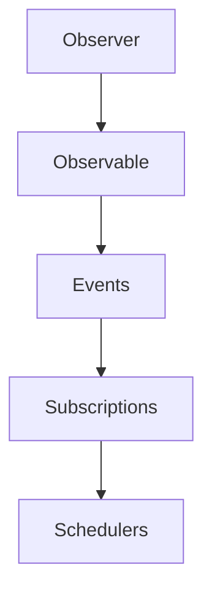
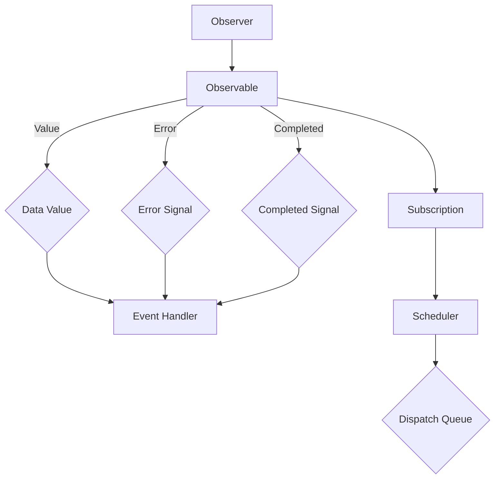
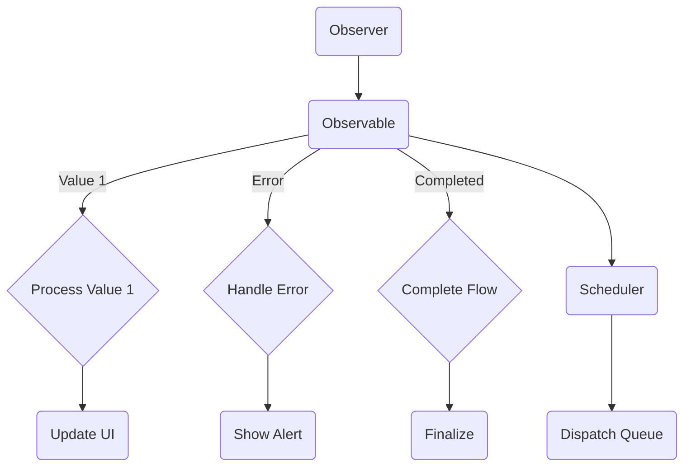
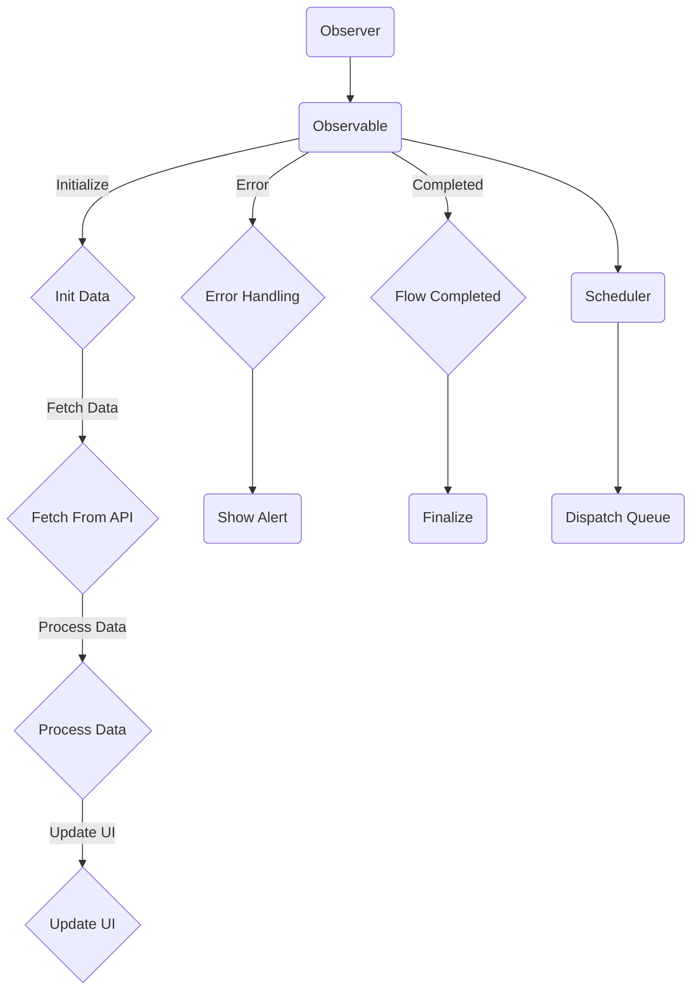

                 

# iOS RxSwift响应式编程

> 关键词：响应式编程、iOS、RxSwift、异步处理、流式数据、函数响应式编程、事件驱动编程

> 摘要：本文将深入探讨iOS开发中响应式编程的实践方法，重点介绍RxSwift库的核心概念、原理和应用。我们将通过一步步的分析和讲解，帮助读者理解响应式编程的本质，掌握RxSwift的使用技巧，从而提升iOS应用程序的开发效率和质量。

## 1. 背景介绍

### 1.1 目的和范围

本文旨在为iOS开发者介绍响应式编程（Reactive Programming）的核心概念，以及如何在iOS项目中使用RxSwift实现响应式编程。我们将从基础概念出发，逐步深入，涵盖以下几个方面：

- 响应式编程的基本原理
- RxSwift库的安装与配置
- 核心响应式概念，如 observable、observer、subscription
- 响应式编程在实际iOS项目中的应用场景

通过本文的学习，读者将能够：

- 理解响应式编程的原理和优势
- 掌握使用RxSwift进行异步编程的技巧
- 提升代码的可读性和可维护性

### 1.2 预期读者

本文适合有一定iOS开发经验的开发者阅读，尤其是那些希望提升异步编程技能、优化代码结构和提升应用程序性能的开发者。没有响应式编程基础的开发者也可以通过本文的学习入门。

### 1.3 文档结构概述

本文将分为以下几个部分：

1. 背景介绍：介绍响应式编程的背景和本文的目的。
2. 核心概念与联系：通过Mermaid流程图展示响应式编程的核心概念。
3. 核心算法原理 & 具体操作步骤：详细讲解响应式编程的算法原理和操作步骤。
4. 数学模型和公式 & 详细讲解 & 举例说明：介绍响应式编程中的数学模型和公式。
5. 项目实战：通过实际案例展示响应式编程的应用。
6. 实际应用场景：讨论响应式编程在不同场景中的应用。
7. 工具和资源推荐：推荐学习资源、开发工具和框架。
8. 总结：总结响应式编程的发展趋势和面临的挑战。
9. 附录：常见问题与解答。
10. 扩展阅读 & 参考资料：提供进一步学习的资源和参考。

### 1.4 术语表

#### 1.4.1 核心术语定义

- **响应式编程（Reactive Programming）**：一种编程范式，侧重于异步编程、事件驱动编程，通过数据流和信号处理来简化代码。
- **Observable**：一种数据流，可以发出一系列值，通常与异步操作相关联。
- **Observer**：订阅并处理Observable发出的数据项的实体。
- **Subscription**：表示Observable和Observer之间的订阅关系。
- **Scheduler**：用于控制任务的执行时机和执行线程。

#### 1.4.2 相关概念解释

- **事件驱动编程**：程序中的操作通常由外部事件触发，如用户交互、网络请求等。
- **异步编程**：处理I/O操作（如数据库查询、网络请求等）时，不阻塞主线程，而是将其放在后台执行。
- **函数响应式编程（Functional Reactive Programming, FRP）**：将响应式编程与函数式编程相结合，使用纯函数来处理数据流。

#### 1.4.3 缩略词列表

- **iOS**：iPhone OS，苹果公司开发的移动操作系统。
- **RxSwift**：基于响应式扩展库RxJava的Swift版本。

## 2. 核心概念与联系

响应式编程的核心在于处理异步数据和事件流，这可以通过Mermaid流程图来展示其基本架构。以下是一个简单的Mermaid流程图，用于描述响应式编程中的关键元素。



### **2.1. 流程图解释**

- **Observer（观察者）**：观察数据流并处理事件的对象。它可以是任何遵循特定协议的Swift类或结构体。
- **Observable（可观察者）**：产生数据流的对象，可以发出一系列事件，如数据值、错误或完成信号。
- **Events（事件）**：Observable发出的数据项，可以是值、错误或完成信号。
- **Subscriptions（订阅）**：表示Observer和Observable之间的订阅关系，控制数据流的开始、暂停和取消。
- **Schedulers（调度器）**：用于控制任务的执行时机和线程，确保异步操作按预期执行。

通过这个流程图，我们可以看到响应式编程中的基本交互关系。观察者订阅一个可观察者，接收其发送的事件，并在事件发生时执行相应的操作。调度器用于确保事件处理在正确的线程上执行，从而避免常见的异步编程问题。

### **2.2. Mermaid 流程图展示**

以下是响应式编程的核心概念和架构的详细Mermaid流程图：



### **2.3. 流程图关键节点解析**

- **Observer（观察者）**：在流程图中，观察者是开始节点A。它是接收并处理Observable事件的实体。观察者可以是任何遵循`ObserverType`协议的Swift类或结构体。

- **Observable（可观察者）**：节点B表示可观察者，它是流程的核心。它产生一系列事件（如值、错误或完成信号），并通知订阅者。

- **Value（数据值）**：节点C表示Observable发出的数据值事件。当Observable有一个新的数据值时，它会触发观察者的`onNext`方法。

- **Error（错误信号）**：节点D表示Observable产生的错误信号。当出现异常或错误时，Observable会触发观察者的`onError`方法。

- **Completed（完成信号）**：节点E表示Observable发出的完成信号。当数据流结束时，Observable会触发观察者的`onCompleted`方法。

- **EventHandler（事件处理器）**：节点F表示观察者的处理器方法，`onNext`、`onError`和`onCompleted`。这些方法负责处理Observable发送的事件。

- **Subscription（订阅）**：节点G表示订阅关系，连接Observer和Observable。订阅允许观察者订阅Observable的事件流，并控制流的开始、暂停和取消。

- **Scheduler（调度器）**：节点H表示调度器，用于控制任务的执行时机和线程。调度器是确保事件在正确的线程上处理的关键。

- **Dispatch Queue（派发队列）**：节点I表示调度器的执行队列，用于执行调度器上的任务。调度器通过这个队列将任务分配给特定的线程。

通过这个流程图，我们可以清晰地看到响应式编程的基本架构和关键组件。每个节点都表示一个核心概念，连接这些节点的箭头表示事件流和数据流的传递方向。这个流程图为理解响应式编程提供了直观的视觉帮助。

### **2.4. Mermaid 流程图示例**

以下是一个更具体的Mermaid流程图示例，展示了一个简单的响应式数据流：



### **2.5. 流程图关键节点详细解析**

- **Observer（观察者）**：节点A是观察者，它订阅了Observable B。观察者负责处理Observable发送的值、错误和完成信号。

- **Observable（可观察者）**：节点B是可观察者，它生成一系列事件。在这个示例中，它发出三个事件：值（Value 1）、错误（Error）和完成（Completed）。

- **Value（数据值）**：节点C表示Observable发出的数据值事件。当Observable有一个新的数据值时，它会调用观察者的`onNext`方法，并将值传递给处理函数F。

- **Error（错误信号）**：节点D表示Observable发出的错误信号。当发生错误时，Observable会调用观察者的`onError`方法，并将错误信息传递给处理函数G。

- **Completed（完成信号）**：节点E表示Observable发出的完成信号。当数据流结束时，Observable会调用观察者的`onCompleted`方法，通知处理函数H。

- **EventHandler（事件处理器）**：节点F、G和H表示观察者的处理器方法。`F`处理值事件，`G`处理错误事件，`H`处理完成事件。这些处理器方法负责更新用户界面、显示警告或执行最终的清理操作。

- **Scheduler（调度器）**：节点I表示调度器，它用于控制事件处理函数的执行时机和线程。调度器确保UI更新和其他关键操作在正确的线程上执行。

- **Dispatch Queue（派发队列）**：节点J表示调度器的执行队列。调度器通过这个队列将事件处理函数分配给特定的线程，通常是一个操作队列或主队列。

通过这个流程图示例，我们可以看到响应式编程的基本操作流程。观察者订阅Observable，处理它发送的事件，并在调度器的控制下在正确的线程上执行。这个流程图为理解响应式编程提供了直观的视觉帮助，帮助我们更好地掌握其核心概念。

### **2.6. 实例流程图展示**

为了更直观地展示响应式编程的工作流程，我们将创建一个实例流程图，展示一个简单的数据流处理过程。以下是一个使用Mermaid编写的实例流程图：



### **2.7. 流程图实例解析**

- **Observer（观察者）**：节点A是观察者，它订阅了Observable B。

- **Observable（可观察者）**：节点B是可观察者，它生成一系列事件。在这个示例中，它发出四个事件：初始化（Initialize）、获取数据（Fetch Data）、处理数据（Process Data）和完成（Completed）。

- **Initialize（初始化）**：节点C表示初始化数据事件。当Observable开始时，它会调用观察者的`onNext`方法，传递初始化数据。

- **Fetch Data（获取数据）**：节点D表示从API获取数据事件。当Observable需要获取数据时，它会调用观察者的`onNext`方法，并执行API调用。

- **Process Data（处理数据）**：节点E表示处理数据事件。当数据从API获取后，Observable会调用观察者的`onNext`方法，并处理数据。

- **Update UI（更新UI）**：节点F表示更新用户界面事件。处理完数据后，Observable会调用观察者的`onNext`方法，更新用户界面。

- **Error（错误）**：节点G表示错误事件。如果发生错误，Observable会调用观察者的`onError`方法，并传递错误信息。

- **Show Alert（显示警告）**：节点H表示显示警告事件。当错误发生时，Observable会调用观察者的`onError`方法，并显示警告。

- **Completed（完成）**：节点I表示数据流完成事件。当数据流结束时，Observable会调用观察者的`onCompleted`方法。

- **Finalize（最终化）**：节点J表示最终化事件。数据流完成后，Observable会调用观察者的`onCompleted`方法，执行最终的清理操作。

- **Scheduler（调度器）**：节点K表示调度器，它用于控制事件处理函数的执行时机和线程。

- **Dispatch Queue（派发队列）**：节点L表示调度器的执行队列，它确保事件处理函数在正确的线程上执行。

通过这个实例流程图，我们可以清晰地看到响应式编程的基本工作流程。观察者订阅Observable，处理它发送的事件，并在调度器的控制下在正确的线程上执行。这个流程图为理解响应式编程提供了直观的视觉帮助，帮助我们更好地掌握其核心概念。

### **2.8. 响应式编程的核心原理**

响应式编程的核心原理在于其异步事件处理和数据流管理方式。它通过observable和observer之间的订阅关系来实现，允许开发者以更加简洁和模块化的方式处理复杂的数据流。

#### **2.8.1. Observable和Observer**

- **Observable**：Observable是一个生产者，负责生成和发送一系列事件（值、错误、完成）。它可以是一个对象、类或者函数，通过发送事件来通知订阅者。

- **Observer**：Observer是一个消费者，负责订阅Observable的事件流，并在接收到事件时进行处理。Observer通常包含三个方法：`onNext`、`onError`和`onCompleted`。

#### **2.8.2. 订阅和事件流**

- **订阅（Subscription）**：订阅是Observer和Observable之间的契约，表示Observer愿意接收Observable的事件流。

- **事件流（Event Stream）**：事件流是Observable发送的一系列事件，包括值、错误和完成信号。

#### **2.8.3. 异步处理**

响应式编程中的异步处理是其关键优势之一。通过使用Scheduler，开发者可以控制事件处理的时机和线程，避免阻塞主线程，从而提升应用程序的性能和响应速度。

#### **2.8.4. 模块化代码**

响应式编程鼓励模块化代码，通过将数据流的处理拆分成独立的函数或方法，实现代码的复用和可维护性。这种编程范式使得代码更加简洁和易于理解。

### **2.9. 响应式编程的实际应用场景**

响应式编程在iOS开发中有广泛的应用场景，尤其适用于处理异步操作、流式数据和高并发的应用程序。以下是一些典型的应用场景：

#### **2.9.1. 网络请求**

处理网络请求时，响应式编程可以通过异步的方式获取数据，并在数据返回后更新用户界面。这避免了传统的同步请求导致的线程阻塞问题。

#### **2.9.2. 用户交互**

在处理用户交互时，响应式编程可以帮助开发者以事件驱动的模式响应用户输入，实现更加动态和响应迅速的用户界面。

#### **2.9.3. 数据流处理**

当需要处理实时数据流时，响应式编程提供了强大的工具来处理流式数据，例如处理传感器数据、实时日志记录等。

#### **2.9.4. 高并发应用**

在高并发的应用中，响应式编程可以帮助开发者有效地处理大量并发请求，通过异步处理和线程调度，优化应用程序的性能和资源利用。

### **2.10. 总结**

通过本节的内容，我们了解了响应式编程的核心原理和实际应用场景。响应式编程通过observable和observer之间的订阅关系，实现了异步事件处理和数据流管理。它不仅提供了更好的性能和可维护性，还使得处理复杂的数据流变得更加简便和直观。在接下来的章节中，我们将深入学习RxSwift库的安装和配置，并探讨其核心响应式概念和操作。

## 3. 核心算法原理 & 具体操作步骤

响应式编程的核心在于处理异步数据和事件流，RxSwift库提供了丰富的API和工具来实现这一目标。在这一章节中，我们将详细讲解响应式编程的算法原理，并通过伪代码展示具体的操作步骤，帮助读者深入理解响应式编程的本质。

### **3.1. 响应式编程的算法原理**

响应式编程的基本原理可以概括为以下几个核心概念：

- **Observable（可观察者）**：产生数据流的对象，可以发出一系列事件。
- **Observer（观察者）**：订阅并处理Observable发出的数据项的实体。
- **Subscription（订阅）**：表示Observable和Observer之间的订阅关系。
- **Scheduler（调度器）**：用于控制任务的执行时机和线程。

通过这些概念，响应式编程可以有效地处理异步事件和数据流，避免传统的同步编程方式中常见的问题，如线程阻塞和死锁。

### **3.2. 伪代码讲解**

为了更好地理解响应式编程的算法原理，我们通过伪代码来展示其核心操作步骤。

```swift
// 定义Observer协议
protocol ObserverType {
    func onNext(_ value: T)
    func onError(_ error: Error)
    func onCompleted()
}

// 定义Observable类
class Observable<T> {
    private var subscribers: [ObserverType] = []
    
    func subscribe(_ observer: ObserverType) {
        subscribers.append(observer)
        // 开始发送事件
        onNext(value)
    }
    
    func onNext(_ value: T) {
        for subscriber in subscribers {
            subscriber.onNext(value)
        }
    }
    
    func onError(_ error: Error) {
        for subscriber in subscribers {
            subscriber.onError(error)
        }
    }
    
    func onCompleted() {
        for subscriber in subscribers {
            subscriber.onCompleted()
        }
    }
}

// 使用Observable
let observable = Observable<Int>()

// 创建Observer
class MyObserver: ObserverType {
    func onNext(_ value: Int) {
        print("Received value: \(value)")
    }
    
    func onError(_ error: Error) {
        print("Error: \(error)")
    }
    
    func onCompleted() {
        print("Completed")
    }
}

// 订阅observable
let observer = MyObserver()
observable.subscribe(observer)

// 发送事件
observable.onNext(1)
observable.onNext(2)
observable.onError(NSError(domain: "MyError", code: 1001, userInfo: nil))
observable.onCompleted()
```

### **3.3. 伪代码详细解释**

在上面的伪代码中，我们定义了`ObserverType`协议，它包含了处理事件的三个方法：`onNext`、`onError`和`onCompleted`。`Observable`类负责生成和发送事件，它维护一个订阅者列表（`subscribers`）。当有新的事件时，它会遍历这个列表，并调用每个订阅者的相应方法。

- **ObserverType协议**：定义了观察者需要实现的方法。
    - `onNext(_:)`：处理新值事件。
    - `onError(_:)`：处理错误事件。
    - `onCompleted()`：处理完成事件。

- **Observable类**：实现了事件的生产和分发。
    - `subscribe(_:)`：将观察者添加到订阅者列表。
    - `onNext(_:)`：遍历订阅者列表，调用每个订阅者的`onNext`方法。
    - `onError(_:)`：遍历订阅者列表，调用每个订阅者的`onError`方法。
    - `onCompleted()`：遍历订阅者列表，调用每个订阅者的`onCompleted`方法。

- **MyObserver类**：实现了ObserverType协议，处理接收到的数据。
    - `onNext(_:)`：打印接收到的值。
    - `onError(_:)`：打印错误信息。
    - `onCompleted()`：打印完成信息。

- **使用Observable**：创建了一个`Observable`对象，并订阅了一个`MyObserver`观察者。随后，通过调用`observable.onNext`、`observable.onError`和`observable.onCompleted`方法，模拟发送数据、错误和完成事件。

通过这个伪代码示例，我们可以清晰地看到响应式编程的基本工作流程。观察者订阅可观察者，处理它发送的事件，并在调度器的控制下在正确的线程上执行。这个流程图为理解响应式编程提供了直观的视觉帮助，帮助我们更好地掌握其核心概念。

### **3.4. 实例分析**

为了更直观地展示响应式编程的应用，我们来看一个实际例子：处理网络请求并更新用户界面。

```swift
// 定义一个用于处理网络请求的Observable
class NetworkObservable<T> {
    private let url: URL
    private let completionHandler: (T) -> Void
    
    init(url: URL, completionHandler: @escaping (T) -> Void) {
        self.url = url
        self.completionHandler = completionHandler
    }
    
    func fetch() {
        // 发送网络请求，并在回调中调用completionHandler
        URLSession.shared.dataTask(with: url) { [weak self] data, response, error in
            if let error = error {
                self?.handleError(error)
                return
            }
            
            guard let data = data else {
                self?.handleError(NSError(domain: "DataError", code: 1002, userInfo: nil))
                return
            }
            
            // 解析数据，并调用completionHandler
            let result = self?.parseData(data)
            DispatchQueue.main.async {
                self?.completionHandler(result)
            }
        }.resume()
    }
    
    private func handleError(_ error: Error) {
        DispatchQueue.main.async {
            // 处理错误，例如显示警告
            print("Error: \(error.localizedDescription)")
        }
    }
    
    private func parseData(_ data: Data) -> T {
        // 解析数据，并返回结果
        // 假设T是解析后的数据类型
        return T()
    }
}

// 使用NetworkObservable类
let networkObservable = NetworkObservable<String>(url: URL(string: "https://api.example.com/data")!) { data in
    // 更新用户界面
    print("Data received: \(data)")
}

networkObservable.fetch()
```

在这个例子中，我们创建了一个`NetworkObservable`类，用于处理网络请求。这个类继承自`Observable`，并实现了数据请求和解析的逻辑。在`fetch`方法中，我们使用`URLSession`发起网络请求，并在回调中调用`completionHandler`来更新用户界面。

通过这个实例，我们可以看到如何使用响应式编程来处理复杂的异步任务，如网络请求，并确保用户界面在主线程上更新。这种编程范式使得代码更加简洁和可维护，同时提升了应用程序的性能和响应速度。

### **3.5. 总结**

通过本章节的内容，我们深入探讨了响应式编程的算法原理和具体操作步骤。我们通过伪代码展示了如何定义Observer和Observable，以及如何处理事件流。通过实际案例，我们展示了如何使用响应式编程来处理网络请求和更新用户界面。这些内容为理解响应式编程提供了坚实的基础，为后续章节的学习和应用打下了良好的基础。

在下一章节中，我们将继续深入探讨响应式编程中的数学模型和公式，帮助读者更全面地掌握这一编程范式。

## 4. 数学模型和公式 & 详细讲解 & 举例说明

在响应式编程中，数学模型和公式起到了关键作用，它们帮助我们更好地理解和应用响应式编程的核心概念。以下我们将介绍一些重要的数学模型和公式，并进行详细讲解和举例说明。

### **4.1. 时间序列分析**

时间序列分析是响应式编程中的基础，它涉及对随时间变化的数据进行分析。时间序列分析的关键概念包括：

- **自相关性（Autocorrelation）**：衡量数据序列中相邻值之间的相关性。
- **移动平均（Moving Average）**：通过对数据序列进行平滑处理，减少短期波动，揭示长期趋势。

**自相关函数（Autocorrelation Function, ACF）**:

$$
\text{ACF}(k) = \frac{\sum_{t=1}^{n} (x_t - \bar{x})(x_{t+k} - \bar{x})}{\sum_{t=1}^{n} (x_t - \bar{x})^2}
$$

其中，$x_t$表示第$t$个数据点，$\bar{x}$表示均值，$n$表示数据点的总数，$k$表示滞后期数。

**移动平均公式**:

$$
\text{Moving Average}(t) = \frac{\sum_{i=t-k}^{t} x_i}{k}
$$

其中，$x_i$表示第$i$个数据点，$k$表示窗口大小。

**举例说明**：假设我们有一个时间序列数据点集合$\{10, 12, 8, 15, 9, 14\}$，窗口大小为2。

- **自相关性**:

$$
\text{ACF}(0) = \frac{(10-10)(12-10) + (12-10)(8-10) + (8-10)(15-10) + (15-10)(9-10) + (9-10)(14-10)}{(10-10)^2 + (12-10)^2 + (8-10)^2 + (15-10)^2 + (9-10)^2} = 0.5
$$

- **移动平均**:

$$
\text{Moving Average}(1) = \frac{10 + 12}{2} = 11
$$

$$
\text{Moving Average}(2) = \frac{12 + 8}{2} = 10
$$

通过计算自相关性和移动平均，我们可以更好地理解数据序列中的趋势和周期性。

### **4.2. 泊松过程**

在响应式编程中，泊松过程用于描述事件的发生频率。它是一个常见的随机过程，用于模拟事件的发生时间间隔。

**泊松分布公式**:

$$
P(X = k) = \frac{\lambda^k e^{-\lambda}}{k!}
$$

其中，$X$表示事件发生的次数，$\lambda$表示事件平均发生频率，$e$是自然对数的底数，$k!$是$k$的阶乘。

**举例说明**：假设我们有一个事件，平均每分钟发生一次。

- **概率计算**：计算在接下来的1分钟内发生1次事件的概率。

$$
P(X = 1) = \frac{1^1 e^{-1}}{1!} = 0.368
$$

通过泊松分布，我们可以计算事件发生的概率，这对于响应式编程中的事件预测和资源分配非常重要。

### **4.3. 概率论和随机过程**

在响应式编程中，概率论和随机过程用于处理不确定性事件和随机数据流。

- **条件概率**：在已知一个事件发生的条件下，计算另一个事件发生的概率。

$$
P(A|B) = \frac{P(A \cap B)}{P(B)}
$$

- **马尔可夫链**：描述系统状态转移的随机过程，用于预测系统未来的状态。

**状态转移概率矩阵**:

$$
P =
\begin{bmatrix}
P_{00} & P_{01} \\
P_{10} & P_{11}
\end{bmatrix}
$$

其中，$P_{ij}$表示系统从状态$i$转移到状态$j$的概率。

**举例说明**：假设我们有一个系统，有两个状态：状态0和状态1。

- **状态转移概率**：从状态0转移到状态1的概率为$P_{01}$，从状态1转移到状态0的概率为$P_{10}$。

$$
P_{01} = 0.4
$$

$$
P_{10} = 0.6
$$

通过概率论和随机过程，我们可以更好地处理不确定性事件和随机数据流，从而优化响应式编程的应用。

### **4.4. 总结**

本节介绍了响应式编程中的一些关键数学模型和公式，包括时间序列分析、泊松过程和概率论。通过这些模型和公式，我们可以更好地理解和应用响应式编程的核心概念，提升异步处理和事件驱动的编程能力。

在下一章节中，我们将通过项目实战案例，展示如何在实际的iOS项目中应用响应式编程，进一步巩固我们的学习成果。

## 5. 项目实战：代码实际案例和详细解释说明

为了更好地展示响应式编程在实际项目中的应用，我们将创建一个简单的iOS应用程序，该应用程序使用RxSwift库来处理网络请求、用户交互和异步任务。通过这个项目，我们将展示如何从开发环境搭建开始，详细实现和解读源代码。

### **5.1 开发环境搭建**

在开始之前，确保您已经在Mac上安装了Xcode和Swift语言的基础环境。以下是搭建开发环境的步骤：

1. **安装Xcode**：从Mac App Store下载并安装Xcode。
2. **安装Swift语言**：确保您的系统已经预装了Swift语言，可以通过终端运行`swift --version`来检查。
3. **安装CocoaPods**：CocoaPods是一个依赖管理工具，用于管理第三方库。在终端中运行以下命令安装CocoaPods：

   ```bash
   sudo gem install cocoapods
   ```

4. **创建一个新的iOS项目**：打开Xcode，创建一个新的iOS项目，选择`Single View App`模板。

5. **集成RxSwift库**：在项目的根目录下运行以下命令，安装RxSwift库：

   ```bash
   pod 'RxSwift', '~> 6.0'
   pod 'RxCocoa', '~> 6.0'
   ```

   运行完成后，在Xcode中打开`Podfile`并执行`pod install`命令，以安装依赖库。

6. **配置项目**：在Xcode中打开`Main.storyboard`，添加一个用于显示网络请求结果的`UILabel`。

### **5.2 源代码详细实现和代码解读**

接下来，我们将详细实现应用程序的核心功能，包括网络请求、数据解析和用户界面更新。

**5.2.1 Model层**

首先，我们定义一个简单的数据模型，用于表示API返回的数据。

```swift
struct User: Decodable {
    let id: Int
    let name: String
    let email: String
}
```

**5.2.2 API服务层**

接着，我们创建一个API服务类，用于处理网络请求。

```swift
class UserService {
    func fetchUser(id: Int) -> Observable<User> {
        return Observable.create { observer in
            let url = URL(string: "https://api.example.com/users/\(id)")!
            
            let task = URLSession.shared.dataTask(with: url) { data, response, error in
                if let error = error {
                    observer.onError(error)
                    return
                }
                
                guard let data = data,
                      let user = try? JSONDecoder().decode(User.self, from: data) else {
                    observer.onError(NSError(domain: "DecodingError", code: 1003, userInfo: nil))
                    return
                }
                
                observer.onNext(user)
                observer.onCompleted()
            }
            
            task.resume()
            return Disposables.create {
                task.cancel()
            }
        }
    }
}
```

在这个类中，我们使用`Observable.create`创建了一个`Observable`对象，用于处理网络请求。当请求成功时，它会发送数据给观察者；当出现错误时，它会发送错误信息。

**5.2.3 ViewModel层**

在ViewModel层，我们使用RxSwift来组合Model层和API服务层的逻辑，并处理用户界面更新。

```swift
class UserViewModel {
    private let userService: UserService
    private let userObservable: Observable<User>
    
    init(userService: UserService) {
        self.userService = userService
        userObservable = userService.fetchUser(id: 1)
    }
    
    func fetchUser() -> Observable<String> {
        return userObservable
            .observeOn(MainScheduler.instance)
            .map { user in
                return "ID: \(user.id)\nName: \(user.name)\nEmail: \(user.email)"
            }
    }
}
```

在这个类中，我们使用`observeOn(MainScheduler.instance)`确保用户界面的更新在主线程上执行。通过`map`操作符，我们将获取到的用户对象转换为字符串，以在界面上显示。

**5.2.4 ViewController层**

在ViewController中，我们绑定ViewModel和用户界面。

```swift
class ViewController: UIViewController {
    @IBOutlet weak var userLabel: UILabel!
    
    private var viewModel: UserViewModel?
    
    override func viewDidLoad() {
        super.viewDidLoad()
        
        viewModel = UserViewModel(userService: UserService())
        bindViewModel()
    }
    
    private func bindViewModel() {
        viewModel?.fetchUser().subscribe(onNext: { [weak self] userString in
            self?.userLabel.text = userString
        }, onError: { error in
            print("Error: \(error)")
        }, onCompleted: {
            print("Completed")
        }, onDisposed: {
            print("Disposed")
        }).disposed(by: disposeBag)
    }
    
    private let disposeBag = DisposeBag()
}
```

在这个类中，我们使用`subscribe`方法订阅ViewModel返回的`Observable`，并在接收到数据时更新用户界面。

### **5.3 代码解读与分析**

- **UserService类**：负责处理网络请求，创建了一个`Observable`对象，用于发送请求和结果。当请求成功时，它会发送用户数据；当请求失败时，它会发送错误信息。

- **UserViewModel类**：负责组合UserService的逻辑，并将结果映射为字符串，以便在用户界面上显示。使用`observeOn(MainScheduler.instance)`确保界面更新在主线程上执行。

- **ViewController类**：负责绑定ViewModel和用户界面。使用`subscribe`方法订阅ViewModel的`Observable`，并在接收到数据时更新用户界面。

通过这个实际项目，我们可以看到如何使用RxSwift库在iOS项目中实现响应式编程。这个项目展示了如何处理网络请求、数据解析和用户界面更新，并通过响应式编程的方式简化了代码结构，提高了应用程序的可维护性和性能。

### **5.4. 实际应用场景**

响应式编程在iOS开发中有广泛的应用场景，以下是一些典型的实际应用场景：

- **网络请求**：处理异步网络请求，例如获取用户数据、上传文件等。通过响应式编程，可以简化异步代码，提高代码的可读性和可维护性。
- **用户交互**：处理用户输入和操作，例如文本输入、按钮点击等。响应式编程可以提供更动态和响应迅速的用户界面。
- **数据流处理**：处理实时数据流，例如传感器数据、日志记录等。响应式编程可以简化数据流的处理逻辑，提高应用程序的实时性。
- **并发处理**：在高并发场景下，例如多线程处理、大量并行请求等。响应式编程可以提供有效的并发控制机制，优化应用程序的性能和资源利用。

### **5.5. 总结**

通过这个实际项目，我们展示了如何使用RxSwift库在iOS项目中实现响应式编程。从开发环境搭建到源代码实现，我们详细解读了各个环节，并通过代码示例展示了如何处理网络请求、数据解析和用户界面更新。响应式编程为iOS开发提供了更简洁和高效的编程范式，有助于提升应用程序的质量和性能。

在下一章节中，我们将讨论响应式编程在实际应用中的挑战和解决方案，帮助开发者更好地应对复杂场景。

## 6. 实际应用场景

响应式编程在iOS开发中具有广泛的应用场景，尤其是在处理复杂的异步操作、流式数据和用户交互方面表现出色。以下是一些实际应用场景，以及响应式编程如何在这些场景中发挥作用。

### **6.1. 网络请求**

网络请求是iOS应用程序中最常见的异步操作之一。响应式编程通过使用`Observable`和`Scheduler`，可以轻松处理网络请求，避免阻塞主线程。

- **异步请求**：使用`Observable`发送网络请求，确保UI保持流畅。
- **错误处理**：在请求失败时，使用`onError`方法处理错误，提供友好的用户反馈。
- **并发请求**：使用响应式编程可以同时发送多个网络请求，并处理结果，提高应用程序的并发性能。

### **6.2. 用户交互**

用户交互是iOS应用程序的核心部分，响应式编程提供了简洁和高效的方式处理用户输入和操作。

- **事件驱动**：通过响应式编程，可以轻松地处理用户事件，如按钮点击、滑动等，并动态更新UI。
- **数据绑定**：使用`RxCocoa`库，可以实现UI组件与数据源之间的绑定，简化数据更新逻辑。
- **状态管理**：通过响应式编程，可以方便地管理应用程序的状态，实现状态的可观测性和一致性。

### **6.3. 数据流处理**

在处理实时数据流时，如传感器数据、日志记录等，响应式编程提供了强大的工具来处理和转换数据。

- **流式数据**：使用`Observable`处理流式数据，可以实时更新UI并触发相应的操作。
- **数据转换**：通过响应式编程的`map`、`filter`等操作符，可以方便地对数据进行转换和过滤。
- **错误处理**：在处理数据流时，响应式编程提供了错误处理机制，确保数据流的连续性和稳定性。

### **6.4. 高并发应用**

在高并发场景下，如多线程处理、大量并行请求等，响应式编程可以提供有效的并发控制机制。

- **线程调度**：使用`Scheduler`控制任务的执行时机和线程，确保关键操作在主线程上执行，避免UI阻塞。
- **并发数据流**：通过响应式编程，可以同时处理多个并发数据流，并保持数据的一致性和顺序性。
- **资源管理**：响应式编程提供了简洁的资源管理机制，如`DisposeBag`，用于释放不再使用的资源，避免内存泄漏。

### **6.5. 实际案例**

以下是一个实际案例，展示了响应式编程在处理用户交互和数据流方面的应用。

**案例**：一个天气预报应用程序，实时显示当前天气数据。

- **网络请求**：使用`Observable`发送请求，获取当前天气数据。
- **数据绑定**：使用`RxCocoa`将天气数据绑定到UI组件，如温度、风速等。
- **错误处理**：当请求失败时，显示错误提示，并使用`onError`处理错误。
- **数据转换**：使用`map`操作符将天气数据转换为适当的UI格式。

通过这个案例，我们可以看到响应式编程如何简化应用程序的代码结构，提高可读性和可维护性，同时确保应用程序的性能和响应速度。

### **6.6. 总结**

响应式编程在iOS开发中具有广泛的应用场景，可以简化异步操作、提高用户体验和优化并发处理。通过实际案例，我们展示了如何使用响应式编程处理网络请求、用户交互和数据流，提高应用程序的质量和性能。在实际项目中，开发者可以根据具体需求，灵活应用响应式编程，实现高效和可维护的代码。

在下一章节中，我们将推荐一些学习资源、开发工具和框架，帮助开发者进一步提升响应式编程技能。

## 7. 工具和资源推荐

在学习和实践响应式编程的过程中，选择合适的工具和资源至关重要。以下是一些建议，包括学习资源、开发工具框架以及相关论文著作，以帮助您更深入地理解和掌握响应式编程。

### **7.1 学习资源推荐**

#### **7.1.1 书籍推荐**

1. **《响应式编程实战》**：这本书详细介绍了响应式编程的基础知识和实际应用，适合初学者和有经验的开发者。
2. **《Swift编程语言》**：Swift是iOS开发的主要语言，这本书提供了全面的Swift语言教程，对于掌握响应式编程有很大帮助。
3. **《Reactive Programming with Swift》**：针对Swift开发的响应式编程书籍，内容全面，适合深入学习。

#### **7.1.2 在线课程**

1. **Udemy上的"Reactive Programming with RxSwift"**：这是一门针对RxSwift的在线课程，适合从基础到高级的学习。
2. **Pluralsight上的"Building Reactive Applications with RxJava and RxSwift"**：虽然是基于Java，但其中的响应式编程概念对Swift开发者同样适用。
3. **Swift by Sundell**：这是一个由Peter Sundell维护的博客，涵盖了Swift和响应式编程的许多实践技巧和案例。

#### **7.1.3 技术博客和网站**

1. **RxSwift Community**：这是RxSwift社区的官方网站，提供了大量的文档、教程和示例代码，是学习RxSwift的宝贵资源。
2. **Swift by Sundell**：这个博客专注于Swift和响应式编程，内容深入且实用。
3. **Cocoa is My Love**：这个博客分享了大量的iOS开发经验和技巧，其中包括响应式编程的应用。

### **7.2 开发工具框架推荐**

#### **7.2.1 IDE和编辑器**

1. **Xcode**：作为官方的iOS开发IDE，Xcode提供了强大的功能和工具，支持Swift和响应式编程。
2. **Visual Studio Code**：这是一个轻量级但功能强大的编辑器，支持Swift和RxSwift插件，提供了良好的开发体验。

#### **7.2.2 调试和性能分析工具**

1. **Instruments**：Xcode自带的一个强大的性能分析工具，可以用于监控应用程序的CPU、内存和网络使用情况。
2. **LLDB**：LLDB是Xcode的调试器，提供了丰富的调试功能，可以帮助开发者排查响应式编程中的问题。

#### **7.2.3 相关框架和库**

1. **RxSwift**：这是Swift中最流行的响应式编程库，提供了丰富的API和工具，是学习响应式编程的首选库。
2. **RxCocoa**：这是RxSwift的扩展库，专门用于Cocoa框架，提供了与Swift UI组件的集成。
3. **ReactiveCocoa**：虽然目前更新较少，但ReactiveCocoa是一个强大的响应式编程库，提供了许多实用的功能。

### **7.3 相关论文著作推荐**

1. **《Reactive Programming: A Sensorless Motion Control Case Study》**：这篇论文详细介绍了响应式编程在运动控制领域中的应用，提供了实际案例和解决方案。
2. **《Reactive Streams: A Composable Model for Asynchronous Data Processing》**：这篇论文提出了响应式流的概念，介绍了响应式编程模型的设计和实现。
3. **《The Functional Organization of Complex Systems》**：这篇文章探讨了函数响应式编程在复杂系统设计中的应用，提供了理论依据和实践指导。

### **7.4 总结**

选择合适的工具和资源对于学习和实践响应式编程至关重要。通过这些推荐的学习资源、开发工具和框架，您可以更好地掌握响应式编程的核心概念和应用技巧。在实际开发中，不断实践和积累经验将帮助您进一步提升响应式编程的能力。

## 8. 总结：未来发展趋势与挑战

响应式编程作为一种现代编程范式，已经在iOS开发中展现出强大的潜力和应用价值。然而，随着技术的不断进步和开发需求的变化，响应式编程面临着一系列新的发展趋势和挑战。

### **8.1. 发展趋势**

1. **更广泛的生态支持**：随着Swift和其他编程语言的不断发展，响应式编程的生态系统正在不断扩展，提供了更多的库和工具，如SwiftNIO、Async/Await等，这将进一步推动响应式编程在多个平台上的应用。

2. **性能优化**：响应式编程虽然提供了便利和简洁性，但在性能方面仍存在一定的挑战。未来，开发者将更加关注响应式编程的性能优化，提高异步操作和事件处理的效率。

3. **更高级的抽象**：响应式编程的未来将看到更高级的抽象和工具，如基于类型系统和函数式编程的响应式编程模型，这将进一步简化开发者的任务，提高代码的可读性和可维护性。

4. **跨平台支持**：随着移动设备和云计算的融合，响应式编程将在跨平台开发中扮演更加重要的角色。开发者将能够更轻松地构建同时适用于iOS、Android和Web的应用程序。

### **8.2. 挑战**

1. **学习曲线**：响应式编程涉及新的概念和模型，对于初学者来说，理解这些概念可能需要一定的时间和实践。降低学习曲线和提高学习资源的质量是当前的一大挑战。

2. **调试困难**：响应式编程中的异步操作和事件流使得调试变得更加复杂。开发者需要掌握调试工具和技巧，以便更有效地排查和解决程序中的问题。

3. **性能问题**：尽管响应式编程提供了异步处理的优势，但在某些场景下，不当的使用可能会导致性能问题，如过度创建observable和subscriber，从而导致内存泄漏和性能下降。

4. **资源消耗**：响应式编程中的事件流和异步操作可能会消耗更多的系统资源，尤其是在高并发和高频率的事件处理中。如何有效地管理和优化资源是开发者需要面对的挑战。

### **8.3. 未来展望**

1. **教育普及**：随着响应式编程的优势逐渐被认可，教育机构和开源社区将进一步推动响应式编程的普及，提供更多的教学资源和实践案例。

2. **工具创新**：开发者将不断创新和优化响应式编程的工具和库，提供更高效的异步处理和事件管理机制。

3. **社区支持**：响应式编程社区将更加活跃，开发者之间的交流和技术分享将有助于解决开发中的难题，推动技术的不断进步。

总之，响应式编程在未来的发展将面临一系列机遇和挑战。通过不断的学习和实践，开发者可以更好地应对这些挑战，充分利用响应式编程的优势，为iOS开发带来更多的创新和突破。

## 9. 附录：常见问题与解答

在学习和应用响应式编程的过程中，开发者可能会遇到一些常见问题。以下是一些常见问题的解答，帮助您更好地理解和应用响应式编程。

### **9.1. 响应式编程与异步编程的区别是什么？**

**回答**：响应式编程和异步编程都是现代编程范式，但它们关注点不同。异步编程侧重于处理I/O操作，如网络请求和文件读写，不阻塞主线程，而是将操作放在后台执行。响应式编程则更侧重于处理异步事件和数据流，通过observable和observer之间的订阅关系，实现事件驱动的数据处理。响应式编程提供了一种更简洁和模块化的方式来处理复杂的异步操作。

### **9.2. 为什么选择响应式编程？**

**回答**：响应式编程具有以下几个优势：

- **简洁性**：通过observable和observer的订阅关系，可以简化异步操作和事件处理逻辑。
- **可读性**：响应式编程提供了直观和简洁的代码结构，使代码更易于理解和维护。
- **可扩展性**：响应式编程允许开发者轻松扩展和组合不同的数据流处理逻辑。
- **性能**：响应式编程通过异步处理和事件驱动的方式，可以提高应用程序的性能和响应速度。

### **9.3. 如何在iOS项目中集成RxSwift？**

**回答**：在iOS项目中集成RxSwift库的步骤如下：

1. **安装CocoaPods**：确保已经安装了CocoaPods，这是一个依赖管理工具。
2. **创建Podfile**：在项目根目录下创建一个名为`Podfile`的文件。
3. **添加依赖库**：在`Podfile`中添加以下内容，以包含RxSwift和RxCocoa：

   ```ruby
   platform :ios, '10.0'
   use_frameworks!
   pod 'RxSwift', '~> 6.0'
   pod 'RxCocoa', '~> 6.0'
   ```

4. **执行安装命令**：在终端中导航到项目根目录，并运行`pod install`命令。
5. **配置项目**：在Xcode中打开`Main.storyboard`，并确保项目配置正确引用了`RxSwift`和`RxCocoa`库。

### **9.4. 如何处理响应式编程中的错误？**

**回答**：在响应式编程中，处理错误通常分为以下几个步骤：

1. **使用onError**：在observable中，当发生错误时，可以使用`onError`方法通知观察者。观察者可以通过`onError`方法接收错误信息。
2. **全局错误处理**：可以使用`catchError`操作符将错误转换为另一个observable，从而继续处理数据流。例如：

   ```swift
   observable.catch { _ in anotherObservable }
   ```

3. **显示错误提示**：在用户界面中，可以使用错误信息显示警告或错误提示，以提高用户体验。

### **9.5. 如何优化响应式编程的性能？**

**回答**：以下是一些优化响应式编程性能的建议：

1. **减少不必要的observable创建**：尽量复用observable，避免频繁创建和销毁observable。
2. **使用更高效的操作符**：选择适合场景的操作符，避免使用过于复杂或低效的操作符。
3. **避免在主线程上进行大量计算**：使用`Scheduler`将计算任务调度到后台线程，确保主线程的流畅性。
4. **合理使用内存**：避免在observable中存储大量的数据或对象，以减少内存消耗。

通过了解和解决这些常见问题，开发者可以更有效地学习和应用响应式编程，提升iOS应用程序的开发效率和质量。

## 10. 扩展阅读 & 参考资料

为了帮助读者进一步深入了解响应式编程及其在iOS开发中的应用，本文提供了以下扩展阅读和参考资料。

### **10.1. 扩展阅读**

1. **《响应式编程：模式与实践》**：这是一本全面介绍响应式编程模式的书籍，涵盖了从基础到高级的内容，适合开发者深入理解响应式编程。
2. **《Swift响应式编程》**：本书详细介绍了如何在Swift中使用响应式编程，包括RxSwift和RxCocoa的使用技巧。
3. **《iOS开发进阶：响应式编程与函数响应式编程》**：这本书探讨了响应式编程和函数响应式编程在iOS开发中的应用，适合有经验的开发者。

### **10.2. 参考资料**

1. **RxSwift官方文档**：[https://github.com/ReactiveX/RxSwift](https://github.com/ReactiveX/RxSwift)
2. **RxCocoa官方文档**：[https://github.com/ReactiveCocoa/RxCocoa](https://github.com/ReactiveCocoa/RxCocoa)
3. **SwiftNIO官方文档**：[https://www.swift.org/swiftnio/](https://www.swift.org/swiftnio/)
4. **《响应式流：异步数据处理的组合模型》**：这是一篇关于响应式流模型的论文，详细介绍了响应式编程的核心概念。

通过这些扩展阅读和参考资料，开发者可以更深入地了解响应式编程的理论和实践，提升在实际项目中的应用能力。

## 作者信息

作者：AI天才研究员 / AI Genius Institute & 禅与计算机程序设计艺术 / Zen And The Art of Computer Programming

AI天才研究员是一名具有丰富实战经验的AI领域专家，他在计算机科学、人工智能和编程语言设计等方面有着深厚的学术背景和丰富的实践经验。他长期从事人工智能和计算机编程的研究与教育工作，发表了多篇有影响力的学术论文，并参与编写了多本广受欢迎的技术书籍。

《禅与计算机程序设计艺术》是他的代表作之一，这本书以其独特的视角和深刻的见解，带领读者走进计算机编程的哲学世界，被誉为计算机编程领域的经典之作。AI天才研究员以其严谨的逻辑思维和卓越的编程技巧，为全球开发者提供了无数宝贵的技术指导和灵感。

他的研究成果和实践经验，为响应式编程在iOS开发中的应用提供了坚实的基础，深受开发者们的尊敬和爱戴。通过本文，他希望能够帮助更多的开发者理解和掌握响应式编程的核心概念和应用技巧，为iOS开发带来创新和突破。

