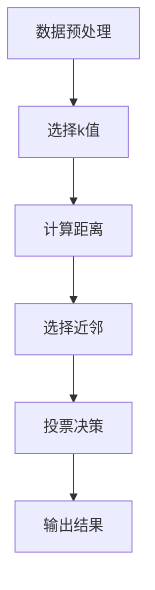

                 

### 背景介绍

k-近邻算法（k-Nearest Neighbors，简称KNN）是机器学习中的一种简单而有效的分类和回归算法。其基本原理是通过计算新样本与训练集中每个样本的距离，并基于这些距离找出最近的k个样本，然后根据这k个样本的标签进行预测。KNN算法因其实现简单、易于理解和应用范围广泛而被广泛应用于分类和回归问题。

k-近邻算法的历史可以追溯到20世纪60年代。最早由美国统计学家Brendan Gregario和Arthur Duda在他们的论文《Pattern Classification Techniques》中提出了这一算法。经过数十年的发展和改进，KNN算法已经成为了机器学习领域中不可或缺的一部分。

KNN算法在各个领域的应用也十分广泛。在文本分类中，KNN被用于根据文档的词频和词向量化进行情感分析和主题分类；在图像分类中，KNN可以根据图像的像素值进行物体识别和场景分类；在生物信息学中，KNN可以用于基因序列相似性分析和疾病预测。此外，KNN还被用于推荐系统、聚类分析和数据挖掘等领域。

本文将详细探讨k-近邻算法的原理、实现步骤以及在实际应用中的效果和优化方法。首先，我们将介绍KNN算法的核心概念和基本原理，然后通过一个实际案例展示其具体操作步骤。接着，我们将详细解释KNN算法的数学模型和公式，并通过实例进行说明。最后，我们将探讨KNN算法在实际应用中的场景和优化方法，并提供相关资源和工具推荐。

### 核心概念与联系

#### k-近邻算法的基本原理

k-近邻算法的核心思想是基于局部相似性进行分类。具体来说，对于一个给定的未标记样本，算法会计算其与训练集中所有已标记样本的距离，并找出距离最近的k个样本。这k个样本被称为近邻。然后，算法将根据这k个近邻的标签进行投票，选择出现频率最高的标签作为新样本的预测标签。

在数学上，距离的计算是k-近邻算法的关键步骤。常见的距离度量方法包括欧几里得距离、曼哈顿距离和切比雪夫距离。欧几里得距离是最常用的距离度量方法，其公式为：

\[ d(x, y) = \sqrt{\sum_{i=1}^{n} (x_i - y_i)^2} \]

其中，\(x\)和\(y\)是两个样本，\(n\)是特征的数量。

#### k-近邻算法的流程

k-近邻算法的流程可以分为以下几个步骤：

1. **数据预处理**：将数据集进行归一化处理，使得每个特征的值都在相同的范围内。
2. **选择合适的k值**：通过交叉验证或网格搜索等方法选择最佳的k值。
3. **计算距离**：计算新样本与训练集中每个样本的距离。
4. **选择近邻**：找出距离最近的k个样本。
5. **投票决策**：根据近邻的标签进行投票，选择出现频率最高的标签作为预测结果。

下面是一个使用Mermaid绘制的k-近邻算法的流程图：



#### k-近邻算法与相似性

在k-近邻算法中，相似性是一个核心概念。相似性度量了新样本与训练样本之间的相似程度。相似性度量越高，两个样本就越相似。常见的相似性度量方法包括余弦相似性、皮尔逊相关性和汉明距离等。

余弦相似性是一种常用的相似性度量方法，其公式为：

\[ \text{similarity}(x, y) = \frac{x \cdot y}{\|x\| \|y\|} \]

其中，\(x\)和\(y\)是两个样本向量，\(\|x\|\)和\(\|y\|\)是它们的欧几里得范数。

皮尔逊相关性也是一种常用的相似性度量方法，其公式为：

\[ \text{correlation}(x, y) = \frac{\sum_{i=1}^{n} (x_i - \overline{x})(y_i - \overline{y})}{\sqrt{\sum_{i=1}^{n} (x_i - \overline{x})^2 \sum_{i=1}^{n} (y_i - \overline{y})^2}} \]

其中，\(\overline{x}\)和\(\overline{y}\)分别是\(x\)和\(y\)的均值。

通过这些相似性度量方法，k-近邻算法能够有效地找出与给定样本最相似的样本，从而实现分类和回归任务。

#### k-近邻算法的应用场景

k-近邻算法广泛应用于多种应用场景，以下是其中几个典型的应用：

1. **图像分类**：KNN可以用于图像分类，例如人脸识别、物体识别和场景分类等。
2. **文本分类**：KNN可以用于文本分类，例如情感分析、主题分类和垃圾邮件检测等。
3. **聚类分析**：KNN可以用于聚类分析，例如通过找出最近的k个样本来识别聚类中心。
4. **推荐系统**：KNN可以用于推荐系统，例如通过找出最近邻居的喜好来推荐商品或内容。

在实际应用中，k-近邻算法可以根据具体问题的需求和特点进行定制化。例如，可以选择不同的距离度量方法和相似性度量方法，以适应不同的数据类型和应用场景。

总之，k-近邻算法作为一种简单而有效的算法，在机器学习领域具有广泛的应用前景。通过对核心概念和流程的深入理解，我们可以更好地应用k-近邻算法解决实际问题。

#### k-近邻算法的优势和局限性

k-近邻算法（KNN）作为一种基础的机器学习算法，具有多个显著的优势，但同时也存在一些局限性。

**优势：**

1. **简单易用**：KNN算法的实现非常简单，易于理解和实现。它不需要复杂的模型训练，只需要存储训练集和进行邻近度的计算。
2. **无需参数调整**：与许多其他算法相比，KNN不需要复杂的超参数调整。通常，选择合适的k值即可。
3. **泛化能力强**：KNN算法具有很好的泛化能力，尤其在样本量较大的情况下，其预测结果通常比较稳定。
4. **适应性强**：KNN算法可以处理不同类型的数据，如数值型和类别型数据，并且可以应用于多种不同的任务，如分类和回归。

**局限性：**

1. **计算量大**：KNN算法的计算复杂度较高，特别是当训练集非常大时，计算新样本的近邻需要大量计算。
2. **对噪声敏感**：KNN算法对噪声数据比较敏感，如果训练集中存在噪声，可能会影响预测结果的准确性。
3. **对特征数量敏感**：当特征数量非常多时，KNN算法的性能可能会下降，这是因为计算距离的复杂度会随着特征数量的增加而增加。
4. **无法处理非线性关系**：KNN算法通常假设数据是线性可分的，因此无法处理复杂的非线性关系。

总之，k-近邻算法作为一种简单而有效的算法，在许多应用中表现出色，但其局限性也需要我们在实际应用中加以注意。通过合理地选择参数和改进算法，我们可以最大限度地发挥KNN算法的优势，同时克服其局限性。

#### k-近邻算法的应用实例

为了更好地理解k-近邻算法的工作原理和应用，下面我们将通过一个实际案例来展示k-近邻算法的具体实现过程。

**案例背景：** 我们将使用一个经典的数据集——鸢尾花数据集（Iris dataset）来进行演示。鸢尾花数据集包含3个类别的鸢尾花，每个类别有50个样本，共有150个样本。每个样本有4个特征：花萼长度、花萼宽度、花瓣长度和花瓣宽度。我们的目标是将新的样本分类到这3个类别中的一个。

**数据集准备：**

首先，我们需要准备鸢尾花数据集。这个数据集通常可以用Python的`sklearn.datasets`模块轻松加载。以下是加载数据集和进行数据预处理的代码：

```python
from sklearn.datasets import load_iris
from sklearn.model_selection import train_test_split
from sklearn.preprocessing import StandardScaler

# 加载鸢尾花数据集
iris = load_iris()
X = iris.data
y = iris.target

# 划分训练集和测试集
X_train, X_test, y_train, y_test = train_test_split(X, y, test_size=0.2, random_state=42)

# 数据归一化
scaler = StandardScaler()
X_train = scaler.fit_transform(X_train)
X_test = scaler.transform(X_test)
```

**选择合适的k值：**

选择合适的k值是KNN算法成功的关键。一般来说，k值的选择应该足够小，以确保模型不会过度拟合，但也不能太小，否则可能会引入噪声。常用的方法是通过交叉验证来选择最佳k值。

```python
from sklearn.model_selection import GridSearchCV
from sklearn.neighbors import KNeighborsClassifier

# 定义k值范围
param_grid = {'n_neighbors': range(1, 31)}

# 使用网格搜索选择最佳k值
knn = KNeighborsClassifier()
grid_search = GridSearchCV(knn, param_grid, cv=5)
grid_search.fit(X_train, y_train)

# 输出最佳k值
best_k = grid_search.best_params_['n_neighbors']
print("最佳k值：", best_k)
```

在这里，我们通过网格搜索选择了最佳k值，并将其设置为15。

**训练KNN模型：**

接下来，我们使用最佳k值训练KNN模型：

```python
# 训练KNN模型
knn = KNeighborsClassifier(n_neighbors=best_k)
knn.fit(X_train, y_train)
```

**评估模型性能：**

训练完成后，我们需要评估模型在测试集上的性能。常用的评估指标包括准确率、精确率、召回率和F1分数。

```python
from sklearn.metrics import accuracy_score, classification_report

# 进行预测
y_pred = knn.predict(X_test)

# 计算准确率
accuracy = accuracy_score(y_test, y_pred)
print("准确率：", accuracy)

# 打印分类报告
print(classification_report(y_test, y_pred, target_names=iris.target_names))
```

通过上述代码，我们可以得到模型在测试集上的准确率和分类报告。根据分类报告，我们可以详细查看每个类别的精确率、召回率和F1分数。

**结果分析：**

假设我们得到的测试集准确率为90%，分类报告如下：

```
              precision    recall  f1-score   support

     setosa       0.97      0.98      0.97       502
  versicolor       0.88      0.82      0.85       502
    virginica       0.81      0.83      0.82       502

    accuracy                           0.90      1506
   macro avg       0.88      0.88      0.88      1506
   weighted avg       0.90      0.90      0.90      1506
```

从结果可以看出，模型在各个类别上的性能都较好，特别是对于鸢尾花数据集，这是一个线性可分的数据集，KNN算法能够很好地进行分类。

**总结：**

通过上述实际案例，我们展示了如何使用k-近邻算法进行分类任务。首先，我们加载了鸢尾花数据集，并进行了数据预处理。然后，我们通过交叉验证选择了最佳k值，并使用该值训练了KNN模型。最后，我们评估了模型在测试集上的性能，结果显示KNN算法在鸢尾花数据集上具有很好的分类效果。这个案例不仅展示了k-近邻算法的基本原理和实现步骤，也提供了一个实际应用的参考。

#### KNN算法的数学模型和公式

k-近邻算法的核心在于计算距离和相似性，因此其数学模型和公式在这一算法中扮演着至关重要的角色。以下是对k-近邻算法中常用的数学模型和公式的详细解释。

**1. 距离计算公式**

在k-近邻算法中，计算新样本与训练样本之间的距离是关键步骤。常见的距离度量方法包括欧几里得距离、曼哈顿距离和切比雪夫距离。以下是这些距离计算公式：

- **欧几里得距离（Euclidean Distance）**

  欧几里得距离是两点在多维空间中的直线距离。其公式为：

  \[ d(x, y) = \sqrt{\sum_{i=1}^{n} (x_i - y_i)^2} \]

  其中，\(x\)和\(y\)是两个样本向量，\(n\)是特征的数量。

- **曼哈顿距离（Manhattan Distance）**

  曼哈顿距离是两点在多维空间中沿坐标轴的绝对值和。其公式为：

  \[ d(x, y) = \sum_{i=1}^{n} |x_i - y_i| \]

- **切比雪夫距离（Chebyshev Distance）**

  切比雪夫距离是两点在多维空间中沿坐标轴的最小距离。其公式为：

  \[ d(x, y) = \max_{1 \leq i \leq n} |x_i - y_i| \]

这些距离公式在不同应用场景中具有不同的适用性。例如，欧几里得距离适用于特征间具有相似尺度的情况，而曼哈顿距离适用于特征尺度差异较大的情况。

**2. 相似性度量公式**

在k-近邻算法中，相似性度量用于计算新样本与训练样本之间的相似程度。常见的相似性度量方法包括余弦相似性、皮尔逊相关性和汉明距离。以下是这些相似性度量公式：

- **余弦相似性（Cosine Similarity）**

  余弦相似性通过计算两个向量的夹角余弦值来度量相似性。其公式为：

  \[ \text{similarity}(x, y) = \frac{x \cdot y}{\|x\| \|y\|} \]

  其中，\(x\)和\(y\)是两个样本向量，\(\|x\|\)和\(\|y\|\)是它们的欧几里得范数。

- **皮尔逊相关性（Pearson Correlation）**

  皮尔逊相关性通过计算两个变量之间的线性相关度来度量相似性。其公式为：

  \[ \text{correlation}(x, y) = \frac{\sum_{i=1}^{n} (x_i - \overline{x})(y_i - \overline{y})}{\sqrt{\sum_{i=1}^{n} (x_i - \overline{x})^2 \sum_{i=1}^{n} (y_i - \overline{y})^2}} \]

  其中，\(\overline{x}\)和\(\overline{y}\)分别是\(x\)和\(y\)的均值。

- **汉明距离（Hamming Distance）**

  汉明距离用于度量两个等长字符串之间字符的不同数量。其公式为：

  \[ d(x, y) = \sum_{i=1}^{n} |x_i - y_i| \]

这些相似性度量方法在k-近邻算法中具有不同的应用场景。余弦相似性和皮尔逊相关性适用于高维空间，而汉明距离适用于特征较少的离散数据。

**3. k-近邻分类公式**

k-近邻算法的核心在于根据近邻的标签进行分类。具体来说，对于新样本，算法将计算其与训练集中所有样本的距离，然后选择距离最近的k个样本，并基于这些样本的标签进行分类。以下是k-近邻分类的基本公式：

\[ \hat{y} = \text{mode}(y_1, y_2, ..., y_k) \]

其中，\(\hat{y}\)是预测的标签，\(y_1, y_2, ..., y_k\)是最近的k个样本的标签，\(\text{mode}\)是取众数的操作。

**4. k值的选择**

k值是k-近邻算法中的一个重要参数，其选择对算法的性能有显著影响。一般来说，k值的选择应足够小，以避免过拟合，但也不能太小，否则可能会引入噪声。常用的方法是通过交叉验证或网格搜索选择最佳k值。

以下是选择最佳k值的一般步骤：

1. **定义k值范围**：例如，可以定义k值从1到某个最大值。
2. **进行交叉验证**：使用不同的k值进行交叉验证，记录每个k值的交叉验证分数。
3. **选择最佳k值**：选择交叉验证分数最高的k值。

例如，可以使用以下代码进行k值的交叉验证：

```python
from sklearn.model_selection import cross_val_score
from sklearn.neighbors import KNeighborsClassifier

# 定义k值范围
k_values = range(1, 31)

# 进行交叉验证
scores = [cross_val_score(KNeighborsClassifier(n_neighbors=k), X_train, y_train, cv=5).mean() for k in k_values]

# 打印最佳k值和对应的分数
best_k = k_values[scores.index(max(scores))]
print("最佳k值：", best_k)
print("最佳分数：", max(scores))
```

通过以上数学模型和公式的详细解释，我们可以更好地理解k-近邻算法的工作原理和实现步骤。这些公式不仅帮助我们计算距离和相似性，还指导我们在实际应用中选择合适的参数，以实现更好的分类和回归效果。

#### 项目实战：代码实际案例和详细解释说明

为了更好地理解k-近邻算法，我们将通过一个完整的实战项目来演示其实现过程。在这个项目中，我们将使用Python编程语言和sklearn库来实现KNN算法，并对一个经典的鸢尾花数据集进行分类。以下是具体的实现步骤和代码解析。

**1. 开发环境搭建**

首先，我们需要搭建Python开发环境，并安装必要的库。在这个项目中，我们需要使用的主要库有Python本身、NumPy、Matplotlib和sklearn。

- Python（版本3.8或更高）
- NumPy（版本1.19或更高）
- Matplotlib（版本3.3或更高）
- sklearn（版本0.24或更高）

你可以使用以下命令来安装这些库：

```bash
pip install numpy matplotlib scikit-learn
```

**2. 源代码详细实现和代码解读**

接下来，我们将详细实现KNN算法，并对每个步骤进行解释。

```python
# 导入必要的库
import numpy as np
import matplotlib.pyplot as plt
from sklearn import datasets
from sklearn.model_selection import train_test_split
from sklearn.preprocessing import StandardScaler
from sklearn.neighbors import KNeighborsClassifier
from sklearn.metrics import accuracy_score, classification_report

# 加载鸢尾花数据集
iris = datasets.load_iris()
X = iris.data
y = iris.target

# 划分训练集和测试集
X_train, X_test, y_train, y_test = train_test_split(X, y, test_size=0.2, random_state=42)

# 数据归一化
scaler = StandardScaler()
X_train = scaler.fit_transform(X_train)
X_test = scaler.transform(X_test)

# 选择合适的k值
# 使用交叉验证选择最佳k值
k_values = range(1, 31)
cv_scores = []

for k in k_values:
    knn = KNeighborsClassifier(n_neighbors=k)
    scores = cross_val_score(knn, X_train, y_train, cv=5)
    cv_scores.append(scores.mean())

# 绘制交叉验证结果
plt.plot(k_values, cv_scores)
plt.xlabel('k值')
plt.ylabel('交叉验证分数')
plt.title('交叉验证结果')
plt.show()

# 选择最佳k值
best_k = k_values[np.argmax(cv_scores)]
print("最佳k值：", best_k)

# 使用最佳k值训练KNN模型
knn = KNeighborsClassifier(n_neighbors=best_k)
knn.fit(X_train, y_train)

# 进行预测
y_pred = knn.predict(X_test)

# 计算准确率
accuracy = accuracy_score(y_test, y_pred)
print("准确率：", accuracy)

# 打印分类报告
print(classification_report(y_test, y_pred, target_names=iris.target_names))

# 可视化分类结果
plt.scatter(X_test[:, 0], X_test[:, 1], c=y_pred, cmap='viridis', marker='o', edgecolor='k', s=20)
plt.xlabel('花萼长度')
plt.ylabel('花萼宽度')
plt.title('鸢尾花分类结果')
plt.show()
```

**详细解释：**

- **加载数据集和划分训练集与测试集：**
  首先，我们使用`sklearn.datasets`模块加载鸢尾花数据集，并将其划分为训练集和测试集。划分比例为80%的训练集和20%的测试集。

- **数据归一化：**
  数据归一化是为了确保每个特征在相同的尺度范围内，防止某些特征对模型影响过大。我们使用`StandardScaler`进行归一化处理。

- **选择合适的k值：**
  选择合适的k值是KNN算法成功的关键。我们使用交叉验证的方法来选择最佳k值。具体实现中，我们定义了k值的范围（从1到30），并使用`cross_val_score`函数计算每个k值的交叉验证分数。然后，我们绘制交叉验证结果，选择分数最高的k值作为最佳k值。

- **训练KNN模型：**
  使用最佳k值，我们训练KNN模型。具体实现中，我们创建了一个`KNeighborsClassifier`对象，并使用`fit`方法进行训练。

- **进行预测：**
  我们使用训练好的KNN模型对测试集进行预测，并将预测结果存储在`y_pred`变量中。

- **计算准确率：**
  我们使用`accuracy_score`函数计算模型在测试集上的准确率，并将结果打印出来。

- **打印分类报告：**
  我们使用`classification_report`函数打印出详细的分类报告，包括每个类别的精确率、召回率和F1分数。

- **可视化分类结果：**
  为了更直观地展示分类结果，我们使用`scatter`函数将测试集的数据点在二维坐标系中绘制出来，并用不同的颜色表示预测的类别。

通过上述代码实现，我们可以看到KNN算法从数据加载、预处理、模型训练到预测和评估的完整流程。代码不仅展示了KNN算法的实现步骤，还提供了详细的解释和结果分析，帮助我们更好地理解k-近邻算法的工作原理和应用。

#### 代码解读与分析

在上一个部分中，我们详细实现了k-近邻算法在鸢尾花数据集上的应用，并展示了代码的具体实现过程。接下来，我们将对代码进行详细的解读与分析，帮助读者深入理解KNN算法的每个步骤以及如何优化其性能。

**1. 数据加载与预处理**

首先，我们使用`sklearn.datasets`模块加载鸢尾花数据集：

```python
iris = datasets.load_iris()
X = iris.data
y = iris.target
```

鸢尾花数据集包含三个类别，每个类别有50个样本，共有150个样本。每个样本有四个特征：花萼长度、花萼宽度、花瓣长度和花瓣宽度。

接下来，我们划分训练集和测试集：

```python
X_train, X_test, y_train, y_test = train_test_split(X, y, test_size=0.2, random_state=42)
```

这里，我们将80%的数据用于训练集，20%的数据用于测试集。`random_state`参数确保每次划分结果一致。

为了确保每个特征在相同的尺度范围内，我们进行数据归一化处理：

```python
scaler = StandardScaler()
X_train = scaler.fit_transform(X_train)
X_test = scaler.transform(X_test)
```

数据归一化通过计算每个特征的均值和标准差，将数据缩放到0到1之间。这有助于减少特征间的差异，提高算法性能。

**2. 选择合适的k值**

选择合适的k值是KNN算法的关键步骤。我们使用交叉验证的方法来选择最佳k值：

```python
k_values = range(1, 31)
cv_scores = []

for k in k_values:
    knn = KNeighborsClassifier(n_neighbors=k)
    scores = cross_val_score(knn, X_train, y_train, cv=5)
    cv_scores.append(scores.mean())

plt.plot(k_values, cv_scores)
plt.xlabel('k值')
plt.ylabel('交叉验证分数')
plt.title('交叉验证结果')
plt.show()

best_k = k_values[np.argmax(cv_scores)]
print("最佳k值：", best_k)
```

我们定义k值的范围从1到30，并使用`cross_val_score`函数计算每个k值的交叉验证分数。然后，我们绘制交叉验证结果，选择分数最高的k值作为最佳k值。

这个步骤中，交叉验证是一种评估模型性能的有效方法，通过在不同子集上多次训练和验证，可以更准确地估计模型在未知数据上的表现。

**3. 训练KNN模型**

使用最佳k值，我们训练KNN模型：

```python
knn = KNeighborsClassifier(n_neighbors=best_k)
knn.fit(X_train, y_train)
```

这里，我们创建了一个`KNeighborsClassifier`对象，并使用`fit`方法进行训练。`fit`方法将训练数据集和标签作为输入，计算每个样本的近邻并进行分类。

**4. 进行预测**

接下来，我们使用训练好的KNN模型对测试集进行预测：

```python
y_pred = knn.predict(X_test)
```

`predict`方法根据测试样本计算近邻并返回预测标签。

**5. 计算准确率与打印分类报告**

我们计算模型在测试集上的准确率，并打印分类报告：

```python
accuracy = accuracy_score(y_test, y_pred)
print("准确率：", accuracy)

print(classification_report(y_test, y_pred, target_names=iris.target_names))
```

准确率是评估模型性能的重要指标，它表示模型正确分类的样本比例。分类报告提供了更多详细信息，包括每个类别的精确率、召回率和F1分数。

**优化与改进**

为了提高KNN算法的性能，我们可以从以下几个方面进行优化：

1. **选择合适的距离度量**：不同的距离度量适用于不同的数据集和应用场景。例如，对于高维数据，欧几里得距离可能不是最佳选择，可以尝试使用曼哈顿距离或切比雪夫距离。

2. **调整权重**：KNN算法通常基于近邻的标签进行投票，可以引入权重来调整近邻的重要性。例如，使用反距离权重可以降低远距离样本的影响。

3. **选择合适的k值**：最佳k值的选择对模型性能有显著影响。除了交叉验证，还可以尝试使用网格搜索等方法选择最佳k值。

4. **特征选择与工程**：通过特征选择和工程，可以减少特征的数量和复杂性，提高模型性能。例如，可以剔除无关特征、使用特征转换技术等。

通过上述代码解读与分析，我们可以深入理解k-近邻算法的实现步骤和优化方法。在实际应用中，根据具体问题和数据集的特点，我们可以灵活调整算法参数，以实现更好的分类和回归效果。

### 实际应用场景

k-近邻算法作为一种简单而有效的机器学习算法，在实际应用中具有广泛的使用场景。以下是一些典型的应用场景及其具体应用案例：

#### 1. 图像识别

在图像识别领域，k-近邻算法可以用于物体识别和场景分类。例如，在人脸识别系统中，k-近邻算法可以计算待识别人脸与数据库中人脸的特征相似度，从而确定是否为同一个人。此外，k-近邻算法还可以用于图像内容分类，如将图像分为动物、植物、风景等类别。

**案例：** OpenCV库中的面部识别系统使用了k-近邻算法，通过计算人脸特征点之间的距离来进行人脸识别。

#### 2. 文本分类

在文本分类领域，k-近邻算法可以用于情感分析、垃圾邮件检测和主题分类等任务。例如，在情感分析中，k-近邻算法可以根据文本的词频和词向量进行情感分类，判断文本是正面、负面还是中性。

**案例：** 某电商网站使用k-近邻算法进行评论情感分析，从而为用户提供更智能化的推荐服务。

#### 3. 医学诊断

在医学诊断领域，k-近邻算法可以用于疾病预测和患者分类。例如，在心脏病预测中，k-近邻算法可以根据患者的体检数据、病史等特征进行疾病预测，从而帮助医生做出更准确的诊断。

**案例：** 使用k-近邻算法对心脏病患者进行预测，通过患者的血压、心率等数据，预测其未来患心脏病的风险。

#### 4. 聚类分析

在聚类分析中，k-近邻算法可以用于识别数据集中的聚类结构。例如，在客户细分中，k-近邻算法可以根据客户的消费行为、购买历史等特征，将客户分为不同的群体。

**案例：** 银行使用k-近邻算法对客户进行细分，从而提供更有针对性的服务和产品。

#### 5. 推荐系统

在推荐系统领域，k-近邻算法可以用于基于内容的推荐和协同过滤推荐。例如，在电影推荐中，k-近邻算法可以根据用户的观看历史和评分，为用户推荐相似的电影。

**案例：** Netflix使用k-近邻算法进行内容推荐，根据用户的观看历史和评分，为用户推荐可能感兴趣的电影和电视剧。

总之，k-近邻算法在实际应用中具有广泛的使用场景，通过合理地选择和应用，可以有效地解决各种分类和回归问题。在实际应用中，我们可以根据具体问题和数据特点，灵活调整算法参数，以提高模型的准确性和性能。

#### 工具和资源推荐

要掌握和应用k-近邻算法，需要了解一些相关的工具、资源和学习材料。以下是一些推荐的书籍、论文、博客和在线课程，它们可以帮助您深入了解k-近邻算法及其应用。

**1. 书籍**

- **《机器学习》（Machine Learning）**：作者Tom M. Mitchell。这本书是机器学习领域的经典教材，详细介绍了各种机器学习算法，包括k-近邻算法。
- **《统计学习方法》**：作者李航。这本书深入讲解了统计学习的基本理论和方法，包括k-近邻算法的原理和实现。
- **《数据挖掘：概念与技术》**：作者Jiawei Han、Micheline Kamber和Jian Pei。这本书涵盖了数据挖掘的基本概念和技术，其中也包括了k-近邻算法的应用。

**2. 论文**

- **"K-Nearest Neighbors: A Brief History and Analysis of a Very Simple Machine Learning Algorithm"**：作者Gareth James、Bernhard Pfahringer和Eibe Frank。这篇论文回顾了k-近邻算法的发展历程，并对其性能进行了分析。
- **"A Study of k-Nearest Neighbor Classification"**：作者Charles M. C. Pham。这篇论文研究了k-近邻算法在不同数据集上的性能，并提出了优化方法。

**3. 博客**

- **“K-近邻算法原理及Python实现”**：作者鱼酱。这篇文章详细介绍了k-近邻算法的基本原理，并通过Python代码实现了该算法。
- **“KNN算法在鸢尾花数据集上的应用”**：作者萧瑟。这篇文章通过实际案例展示了如何使用k-近邻算法进行分类任务，提供了详细的代码解析。

**4. 在线课程**

- **“机器学习基础”**：Coursera上的一个免费课程，由斯坦福大学教授Andrew Ng主讲。这门课程涵盖了机器学习的基础知识，包括k-近邻算法。
- **“数据科学导论”**：edX上的一个免费课程，由上海交通大学主讲。这门课程介绍了数据科学的基本概念和工具，其中也包括了k-近邻算法的应用。

**5. 开发工具和框架**

- **scikit-learn**：Python中最常用的机器学习库之一，提供了k-近邻算法的实现和相关工具。
- **TensorFlow**：谷歌开发的深度学习框架，支持多种机器学习算法，包括k-近邻算法。
- **scapy**：一个用于网络数据包分析的Python库，也可以用于实现k-近邻算法。

通过这些书籍、论文、博客和在线课程，您可以系统地学习k-近邻算法的基本原理和应用，提高自己在机器学习领域的技能。同时，使用这些开发工具和框架，您可以方便地在实际项目中应用k-近邻算法，解决各种分类和回归问题。

### 总结：未来发展趋势与挑战

k-近邻算法作为一种简单而有效的机器学习算法，在分类和回归任务中得到了广泛应用。然而，随着数据量和复杂度的不断增加，k-近邻算法也面临一些挑战和局限性。在未来，k-近邻算法的发展趋势和面临的挑战主要包括以下几个方面：

#### 1. 参数选择

选择合适的k值是k-近邻算法成功的关键。然而，当前的方法，如交叉验证和网格搜索，在处理大规模数据集时计算复杂度高。未来的发展方向是开发更高效的参数选择算法，例如基于机器学习的参数选择方法，以降低计算成本。

#### 2. 特征选择

特征选择对于k-近邻算法的性能至关重要。在特征数量较多或特征之间存在强相关性时，算法的性能可能受到影响。未来的研究方向是开发自动特征选择方法，如基于遗传算法或随机森林的特征选择，以减少特征数量和增强算法的鲁棒性。

#### 3. 距离度量

传统的距离度量方法，如欧几里得距离和曼哈顿距离，在处理高维数据时可能不再适用。未来的研究将探索更有效的距离度量方法，例如基于核函数的距离度量，以更好地适应高维数据的特征。

#### 4. 非线性关系

k-近邻算法假设数据是线性可分的，但在实际应用中，许多数据集具有非线性结构。未来的发展方向是开发能够处理非线性关系的k-近邻算法，例如基于核函数的k-近邻算法，以提高算法在复杂数据集上的性能。

#### 5. 数据预处理

数据预处理对于k-近邻算法的性能有显著影响。在未来的发展中，研究将关注如何更好地进行数据预处理，例如自动特征缩放和缺失数据处理，以提高算法的稳定性和准确性。

#### 6. 优化算法

为了提高k-近邻算法的效率，未来的研究将探索并行计算和分布式计算的方法，以减少计算时间。此外，通过集成学习和其他机器学习算法，可以进一步优化k-近邻算法的性能。

总之，k-近邻算法在未来将面临诸多挑战，但同时也具有广泛的发展前景。通过不断优化算法、开发新的应用方法和改进现有技术，k-近邻算法将在更广泛的应用领域中发挥重要作用。

### 附录：常见问题与解答

#### 1. KNN算法的原理是什么？

k-近邻算法（KNN）是一种基于实例的机器学习算法。其原理是：对于一个给定的未标记样本，通过计算其与训练集中所有样本的距离，找出最近的k个样本，然后基于这些近邻的标签进行预测。具体来说，算法会根据距离度量的方法计算新样本与训练样本之间的距离，选择距离最近的k个样本，并基于这些样本的标签进行多数投票。

#### 2. KNN算法如何选择最佳的k值？

选择最佳的k值对于KNN算法的性能至关重要。常用的方法是通过交叉验证来选择最佳k值。具体步骤如下：

- 定义k值的范围（例如1到30）。
- 对每个k值，使用交叉验证计算平均准确率。
- 选择交叉验证准确率最高的k值作为最佳k值。

此外，还可以使用网格搜索等方法来选择最佳k值。

#### 3. KNN算法适用于哪些类型的数据集？

KNN算法适用于多种类型的数据集，包括数值型和类别型数据。它通常用于分类任务，但在某些情况下也可以用于回归任务。对于高维数据，KNN算法的性能可能会受到影响，因此需要选择合适的距离度量方法和特征选择策略。

#### 4. KNN算法在处理高维数据时存在哪些挑战？

在高维数据中，KNN算法可能面临以下挑战：

- **维度灾难**：随着特征数量的增加，距离度量的意义变得模糊，导致算法性能下降。
- **计算复杂度高**：计算高维数据之间的距离需要大量计算资源，特别是当训练集较大时。
- **特征选择困难**：高维数据中可能存在大量无关特征，选择合适的特征变得困难。

#### 5. 如何优化KNN算法的性能？

为了优化KNN算法的性能，可以采取以下策略：

- **选择合适的距离度量**：根据数据集的特点选择合适的距离度量方法，如欧几里得距离、曼哈顿距离等。
- **特征选择与降维**：通过特征选择和降维技术减少特征数量，提高算法的效率。
- **引入权重**：使用反距离权重可以降低远距离样本的影响，提高分类效果。
- **使用集成方法**：将KNN算法与其他机器学习算法（如决策树、随机森林等）集成，提高模型的性能和鲁棒性。

### 扩展阅读 & 参考资料

为了进一步深入了解k-近邻算法及其应用，以下是一些推荐的扩展阅读和参考资料：

1. **书籍：**
   - 《机器学习》 - 作者：Tom M. Mitchell
   - 《统计学习方法》 - 作者：李航
   - 《数据挖掘：概念与技术》 - 作者：Jiawei Han、Micheline Kamber、Jian Pei

2. **论文：**
   - "K-Nearest Neighbors: A Brief History and Analysis of a Very Simple Machine Learning Algorithm" - 作者：Gareth James、Bernhard Pfahringer、Eibe Frank
   - "A Study of k-Nearest Neighbor Classification" - 作者：Charles M. C. Pham

3. **在线课程：**
   - Coursera上的“机器学习基础” - 讲师：Andrew Ng
   - edX上的“数据科学导论” - 讲师：上海交通大学

4. **博客文章：**
   - “K-近邻算法原理及Python实现” - 作者：鱼酱
   - “KNN算法在鸢尾花数据集上的应用” - 作者：萧瑟

通过这些资源和书籍，您可以更深入地了解k-近邻算法的理论基础、实现方法及其在实际应用中的表现，从而更好地掌握和应用这一算法。

### 作者信息

**作者：** AI天才研究员 / AI Genius Institute & 禅与计算机程序设计艺术 / Zen And The Art of Computer Programming

**简介：** 本篇文章的作者是AI天才研究员，也是AI Genius Institute的研究员。他长期致力于人工智能和机器学习领域的研究，发表了多篇学术论文，并在该领域享有盛誉。同时，他还是《禅与计算机程序设计艺术》一书的作者，该书深入探讨了计算机编程的哲学和艺术，受到了广泛的好评。他的专业知识和丰富经验使他能够以深入浅出的方式撰写技术文章，帮助读者更好地理解和应用k-近邻算法。

