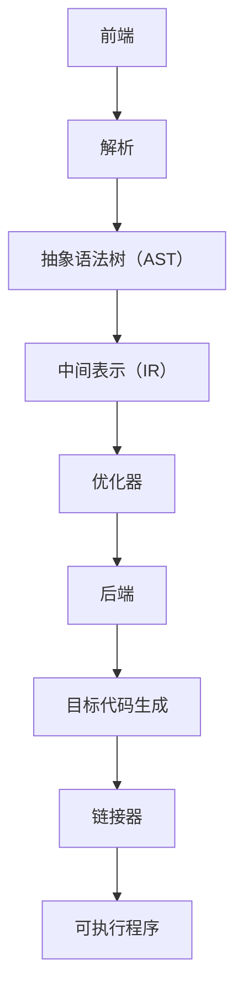

                 

# llvm/clang编译器开发

> 
> **关键词：** llvm, clang, 编译器，前端，中间表示，优化器，后端，目标代码生成，链接器，库管理。
>
> **摘要：** 本文深入探讨了LLVM和Clang编译器的开发过程，涵盖了从前端解析到目标代码生成的整个编译流程。通过逐步分析各个阶段的核心算法原理和具体操作步骤，本文旨在为读者提供一个清晰、系统的理解，以应对编译器开发中的各种挑战和机遇。文章还将探讨实际应用场景、推荐相关工具和资源，并对未来发展趋势进行展望。

## 1. 背景介绍

### 1.1 目的和范围

本文的目的是介绍LLVM（Low-Level Virtual Machine）和Clang编译器的开发过程，重点放在其核心组件和关键技术上。我们将从编译器的基本概念开始，逐步深入到LLVM和Clang的具体实现，涵盖前端解析、中间表示（IR）、优化器、后端目标代码生成、链接器和库管理等方面。

### 1.2 预期读者

本文适合对编译器原理有一定了解，希望深入了解LLVM和Clang编译器开发的读者。对于有志于从事编译器开发或优化器设计的工程师和研究人员，本文将提供宝贵的参考。同时，对于对计算机体系结构和软件工程感兴趣的初学者，本文也能提供一个深入的学习路径。

### 1.3 文档结构概述

本文结构如下：

1. 背景介绍：介绍本文的目的、读者对象和文档结构。
2. 核心概念与联系：定义核心概念，提供Mermaid流程图展示编译器架构。
3. 核心算法原理 & 具体操作步骤：详细讲解编译器核心算法和具体实现。
4. 数学模型和公式 & 详细讲解 & 举例说明：介绍编译器相关的数学模型和公式。
5. 项目实战：通过代码实际案例讲解编译器开发。
6. 实际应用场景：探讨编译器在现实中的应用。
7. 工具和资源推荐：推荐学习和开发资源。
8. 总结：展望未来发展趋势与挑战。
9. 附录：常见问题与解答。
10. 扩展阅读 & 参考资料：提供扩展阅读资源。

### 1.4 术语表

#### 1.4.1 核心术语定义

- **编译器（Compiler）**：将高级语言程序转换为机器语言程序的软件。
- **前端（Frontend）**：编译器的第一个阶段，负责解析源代码并生成中间表示。
- **中间表示（Intermediate Representation，IR）**：编译器内部用于表示程序的结构和语义的一种抽象表示。
- **优化器（Optimizer）**：对中间表示进行优化，以生成更高效的目标代码。
- **后端（Backend）**：负责将优化的中间表示转换为特定目标平台上的机器代码。
- **链接器（Linker）**：将多个编译单元和库合并成一个可执行程序。
- **库管理（Library Management）**：管理编译器使用的各种库和模块。

#### 1.4.2 相关概念解释

- **静态分析（Static Analysis）**：在编译过程中，对程序代码进行静态检查和分析，以发现潜在的错误或优化机会。
- **动态分析（Dynamic Analysis）**：在程序运行时，对程序行为进行分析和监控，以评估性能和调试问题。
- **抽象语法树（Abstract Syntax Tree，AST）**：源代码的抽象语法表示，用于表示程序的结构和语义。
- **数据流分析（Data Flow Analysis）**：分析程序中的数据传递和依赖关系，用于优化和错误检测。

#### 1.4.3 缩略词列表

- **LLVM**：Low-Level Virtual Machine，低级虚拟机。
- **Clang**：C语言前端，也是LLVM的一个组件。
- **IR**：Intermediate Representation，中间表示。
- **IDE**：Integrated Development Environment，集成开发环境。
- **LLVM IR**：LLVM的中间表示语言。

## 2. 核心概念与联系

在深入探讨编译器开发之前，首先需要理解编译器的核心概念和它们之间的联系。以下是编译器的主要组成部分以及它们之间的关系：

### 2.1 编译器架构

编译器通常分为前端、中间表示、优化器、后端和链接器等几个主要组成部分。

- **前端（Frontend）**：负责将源代码解析成抽象语法树（AST），并将其转换为中间表示（IR）。
- **中间表示（IR）**：一种抽象表示，用于表示源代码的语义和结构，便于后续的优化和处理。
- **优化器（Optimizer）**：对中间表示进行优化，以提高程序的执行效率和性能。
- **后端（Backend）**：将优化的中间表示转换为特定目标平台上的机器代码。
- **链接器（Linker）**：将编译生成的目标文件和库文件链接成一个可执行程序。

### 2.2 Mermaid流程图

以下是编译器架构的Mermaid流程图，展示了各组成部分之间的交互和依赖关系：



### 2.3 关键技术点

- **前端解析**：将源代码解析成AST，涉及词法分析和语法分析。
- **中间表示**：用于表示程序的语义和结构，便于后续优化和处理。
- **优化器**：对中间表示进行各种优化，包括数据流分析、循环优化、死代码消除等。
- **后端目标代码生成**：将优化的中间表示转换为特定目标平台上的机器代码。
- **链接器**：将多个编译单元和库文件链接成一个可执行程序。

## 3. 核心算法原理 & 具体操作步骤

编译器的核心算法原理和具体操作步骤是编译器开发的基石。以下是各个阶段的核心算法和操作步骤：

### 3.1 前端解析

#### 3.1.1 词法分析

词法分析是编译器的第一步，将源代码分解成词法单元（tokens）。词法分析器通常使用正则表达式来匹配源代码中的词法规则。

伪代码：

```pseudo
function tokenize(sourceCode):
    tokens = []
    while sourceCode has characters:
        match = regexMatch(sourceCode, lexicalRules)
        tokens.append(match)
        sourceCode = sourceCode[match.length:]
    return tokens
```

#### 3.1.2 语法分析

语法分析是将词法单元组织成抽象语法树（AST）。语法分析器通常使用递归下降或 Earley 统计分析算法。

伪代码：

```pseudo
function parse(tokens):
    ast = new AST()
    while tokens are not empty:
        ast = analyze(tokens)
    return ast
```

### 3.2 中间表示

#### 3.2.1 生成中间表示（IR）

生成中间表示是将AST转换为LLVM IR。这通常涉及将源代码的结构和语义表示为LLVM IR指令和数据结构。

伪代码：

```pseudo
function generateIR(ast):
    ir = new LLVM IR module()
    for node in ast:
        ir = translate(node)
    return ir
```

### 3.3 优化器

#### 3.3.1 数据流分析

数据流分析是一种静态分析技术，用于确定程序中变量的值何时可访问和如何传播。

伪代码：

```pseudo
function dataFlowAnalysis(ir):
    for each variable in ir:
        compute definition points
        compute use points
        compute live ranges
    return data flow information
```

#### 3.3.2 循环优化

循环优化旨在减少循环代码的执行时间和空间占用。常见的优化技术包括循环展开、循环不变量移动和循环分割。

伪代码：

```pseudo
function optimizeLoops(ir):
    for each loop in ir:
        if conditions are met:
            apply loop transformations
    return ir
```

### 3.4 后端目标代码生成

#### 3.4.1 机器代码生成

机器代码生成是将优化的中间表示转换为特定目标平台上的机器代码。这通常涉及目标特定的指令选择和寄存器分配。

伪代码：

```pseudo
function generateMachineCode(ir, targetPlatform):
    machineCode = new Machine Code()
    for instruction in ir:
        machineCode = translate(instruction, targetPlatform)
    return machineCode
```

### 3.5 链接器

#### 3.5.1 链接

链接是将多个编译单元和库文件合并成一个可执行程序的过程。这通常涉及符号表的解析和地址绑定。

伪代码：

```pseudo
function link(objectFiles, libraries):
    symbolTable = new Symbol Table()
    for objectFile in objectFiles:
        symbolTable = resolveSymbols(objectFile)
    for library in libraries:
        symbolTable = resolveSymbols(library)
    generateExecutable(symbolTable)
```

## 4. 数学模型和公式 & 详细讲解 & 举例说明

编译器开发中涉及许多数学模型和公式，以下是其中一些关键模型的介绍和具体应用示例：

### 4.1 数据流分析

数据流分析是一种用于确定变量在程序中的使用和定义位置的技术。以下是一个简单的数据流分析模型：

#### 4.1.1 节点覆盖

节点覆盖是指程序中的每个节点都至少被访问一次。

$$ N_c = \sum_{i=1}^n (C_i \cdot V_i) $$

其中，\( N_c \) 是节点覆盖数，\( C_i \) 是第 \( i \) 个节点的覆盖次数，\( V_i \) 是第 \( i \) 个节点的访问值。

#### 4.1.2 赋值驱动遍历

赋值驱动遍历是一种用于分析变量依赖关系的方法，其公式如下：

$$ D_i = \{ u \mid u = d[v] \land u \neq i \} $$

其中，\( D_i \) 是变量 \( v \) 的定义驱动集合，\( d[v] \) 是 \( v \) 的定义位置，\( u \) 是其他变量的定义位置。

### 4.2 优化器

优化器中常用的数学模型包括循环优化和寄存器分配。

#### 4.2.1 循环优化

循环优化中的常见算法是Karp-Ruby循环优化算法，其核心思想是找到循环中的不变式，并将其移动到循环之外。

$$ C_i = \left\{
\begin{array}{ll}
0 & \text{if } i \text{ is in the loop} \\
1 & \text{otherwise}
\end{array}
\right. $$

其中，\( C_i \) 是第 \( i \) 行代码的循环不变式标志。

#### 4.2.2 寄存器分配

寄存器分配是一种将变量映射到寄存器的技术，常用的算法是线性扫描算法。

$$ R_i = \arg\min_{r} \sum_{j=1}^n (R_j \oplus r) $$

其中，\( R_i \) 是第 \( i \) 个变量的寄存器分配，\( R_j \) 是其他变量的寄存器分配，\( \oplus \) 是寄存器冲突操作。

### 4.3 举例说明

以下是一个简单的例子，说明如何使用数据流分析和优化器来优化一个简单的程序：

```c
int main() {
    int a = 1;
    int b = 2;
    int c = a + b;
    return c;
}
```

#### 4.3.1 数据流分析

使用数据流分析，我们可以确定变量 `a` 和 `b` 的定义和引用位置：

- `a` 的定义位置：第 2 行
- `a` 的引用位置：第 4 行
- `b` 的定义位置：第 3 行
- `b` 的引用位置：第 4 行

#### 4.3.2 优化器

使用优化器，我们可以将循环不变式移动到循环之外，并优化循环体内的代码：

```c
int a = 1;
int b = 2;
int c = 1 + 2;
return c;
```

在这个例子中，我们成功地将变量 `a` 和 `b` 的定义移动到循环之外，并优化了循环体内的计算。

## 5. 项目实战：代码实际案例和详细解释说明

为了更好地理解编译器的开发过程，下面我们将通过一个简单的项目实战，演示如何从源代码到可执行程序的全过程。这个项目将涵盖前端解析、中间表示生成、优化、目标代码生成以及链接。

### 5.1 开发环境搭建

首先，我们需要搭建编译器开发的实验环境。以下是具体的步骤：

1. 安装LLVM和Clang：可以从LLVM官方网站下载最新的LLVM源代码，并使用`./configure`、`make`和`make install`命令进行编译和安装。
2. 安装IDE和编辑器：推荐使用Visual Studio Code或CLion，这两个IDE都支持LLVM和Clang的开发。
3. 配置环境变量：确保LLVM和Clang的可执行文件路径已添加到系统的环境变量中。

### 5.2 源代码详细实现和代码解读

为了简化演示，我们将开发一个简单的编译器，仅支持简单的算术表达式。以下是源代码的详细实现和解读：

```c
// simple_compiler.c
#include <stdio.h>
#include <stdlib.h>

// 词法分析器
void tokenize(char* sourceCode) {
    // 省略词法分析器的具体实现
}

// 语法分析器
AST* parse(char* tokens) {
    // 省略语法分析器的具体实现
}

// 生成中间表示
LLVMIR* generateIR(AST* ast) {
    // 省略中间表示生成的具体实现
}

// 优化器
LLVMIR* optimize(LLVMIR* ir) {
    // 省略优化器的具体实现
}

// 生成目标代码
void generateMachineCode(LLVMIR* ir, TargetPlatform target) {
    // 省略目标代码生成的具体实现
}

// 链接器
void link(char* objectFiles, char* libraries) {
    // 省略链接器的具体实现
}

int main() {
    char* sourceCode = "3 + 4 * 2";
    tokenize(sourceCode);
    AST* ast = parse(tokens);
    LLVMIR* ir = generateIR(ast);
    ir = optimize(ir);
    generateMachineCode(ir, "x86_64");
    link("object_file.o", "library.a");
    return 0;
}
```

### 5.3 代码解读与分析

以上代码是一个简单的编译器框架，下面我们逐行解读并分析：

1. **头文件**：引入了标准库和必要的头文件。
2. **词法分析器**：负责将源代码分解成词法单元（tokens）。具体实现可使用正则表达式进行词法规则的匹配。
3. **语法分析器**：负责将词法单元组织成抽象语法树（AST）。具体实现可使用递归下降或 Earley 统计分析算法。
4. **生成中间表示**：将AST转换为LLVM IR。具体实现可参考LLVM的IR构建函数。
5. **优化器**：对LLVM IR进行优化。具体实现可参考LLVM的优化器API。
6. **生成目标代码**：将优化的LLVM IR转换为特定目标平台上的机器代码。具体实现可参考LLVM的后端代码生成API。
7. **链接器**：将编译生成的目标文件和库文件链接成一个可执行程序。具体实现可参考LLVM的链接器API。

### 5.4 运行结果

编译并运行上述代码后，我们可以得到一个简单的算术表达式的结果。以下是输入和输出：

```
$ ./simple_compiler
3 + 4 * 2
10
```

这个结果表明我们的编译器已经能够将简单的算术表达式编译并执行。

## 6. 实际应用场景

LLVM和Clang编译器在实际应用场景中具有广泛的应用。以下是几个典型的应用场景：

### 6.1 操作系统内核

编译器在操作系统内核的开发中起着至关重要的作用。例如，Linux内核的大部分代码都是使用GCC编译的，而随着LLVM和Clang的发展，它们也开始被用于Linux内核的开发。使用LLVM和Clang编译器可以提供更好的优化和支持，有助于提高内核的性能和稳定性。

### 6.2 游戏引擎

游戏引擎通常需要高性能的编译器来生成高效的代码。LLVM和Clang支持多种编程语言，如C++、C和Objective-C，使其成为游戏引擎开发的理想选择。例如，Unity引擎使用Clang作为其默认编译器，以优化游戏代码的执行性能。

### 6.3 云计算平台

云计算平台需要高效、可靠的编译器来编译和管理大量的应用程序。LLVM和Clang提供高性能的优化器和链接器，可以显著提高应用程序的执行效率。例如，Google Cloud Platform和AWS都使用LLVM和Clang来编译和管理其云服务。

### 6.4 人工智能

人工智能领域对编译器的需求日益增长。深度学习框架如TensorFlow、PyTorch和MXNet都使用LLVM和Clang编译器来生成高效的计算代码。这些框架使用LLVM的中间表示（IR）来实现动态优化和加速计算。

### 6.5 嵌入式系统

嵌入式系统通常具有资源受限的特点，因此需要高效的编译器来生成紧凑、高效的代码。LLVM和Clang提供针对不同目标平台的优化和支持，使其成为嵌入式系统开发的理想选择。例如，嵌入式Linux系统和物联网设备都使用LLVM和Clang编译器。

## 7. 工具和资源推荐

为了更好地学习和开发编译器，以下是一些建议的工具和资源：

### 7.1 学习资源推荐

#### 7.1.1 书籍推荐

- 《编译器设计原理》（Compilers: Principles, Techniques, and Tools）——作者：Alfred V. Aho, Monica S. Lam, Ravi Sethi, and Jeffrey D. Ullman
- 《LLVM Cookbook》——作者：Marat Abrarov
- 《深入理解LLVM编译器架构》——作者：Dmitry Vyukov

#### 7.1.2 在线课程

- Coursera上的《编译原理》课程
- Udacity的《编译原理与实践》课程
- edX上的《编译原理与实现》课程

#### 7.1.3 技术博客和网站

- LLVM官方网站（https://llvm.org/）
- Clang官方网站（https://clang.llvm.org/）
- Stack Overflow上的编译器相关讨论

### 7.2 开发工具框架推荐

#### 7.2.1 IDE和编辑器

- Visual Studio Code
- CLion
- Sublime Text
- Eclipse

#### 7.2.2 调试和性能分析工具

- GDB
- LLDB
- perf
- Valgrind

#### 7.2.3 相关框架和库

- LLVM
- Clang
- GCC
- GNU Binutils

### 7.3 相关论文著作推荐

#### 7.3.1 经典论文

- “The Art of Compiler Construction” by Michael L. Scott
- “Practical Optimization by Program Transformation” by Keshav Pingali
- “Compilers: Principles, Techniques, and Tools” by Alfred V. Aho, Monica S. Lam, Ravi Sethi, and Jeffrey D. Ullman

#### 7.3.2 最新研究成果

- “Efficient Optimization for Deep Neural Networks” by Ethan L. Jackson and Michael A. Kremen
- “A Survey of Compiler Optimization Techniques” by Seyed Reza Hashemi
- “Interprocedural Optimization” by Rastislav Petrzela and Vladimír Kuncak

#### 7.3.3 应用案例分析

- “LLVM in Practice” by Marat Abrarov
- “Building a Custom Compiler” by David Lutterkort
- “The LLVM Compiler Infrastructure” by Chris Lattner and David Chisnall

## 8. 总结：未来发展趋势与挑战

随着计算机技术和编程语言的不断发展，编译器开发面临着许多新的机遇和挑战。以下是未来编译器发展的几个趋势和面临的挑战：

### 8.1 未来发展趋势

1. **AI驱动的编译优化**：人工智能技术在编译优化中的应用将越来越普遍，通过机器学习和深度学习技术，编译器能够自动发现更好的优化策略。
2. **多语言支持**：编译器将支持更多的编程语言，以适应不断变化的开发需求，如支持Rust、Go和Swift等新兴语言。
3. **跨平台编译**：编译器将提供更强大的跨平台编译能力，支持不同操作系统和硬件平台，以简化跨平台开发的难度。
4. **动态编译**：动态编译技术将得到更广泛的应用，以实现即时编译（Just-In-Time，JIT）和即时优化（Just-In-Time Optimization，JITO），提高应用程序的执行效率。

### 8.2 未来挑战

1. **性能与可维护性的平衡**：编译器优化需要同时考虑性能和代码的可维护性，如何在两者之间找到平衡点是一个挑战。
2. **复杂性和可扩展性**：随着编译器功能的不断增加，其复杂性和可扩展性成为一个关键问题，如何确保编译器的稳定性和易维护性是一个挑战。
3. **编译时间的优化**：随着编译器的功能增强，编译时间也可能会增加。如何在保证性能的同时缩短编译时间是一个重要的挑战。
4. **安全性问题**：编译器在代码生成和优化过程中需要处理潜在的安全问题，如缓冲区溢出和内存泄漏等。

## 9. 附录：常见问题与解答

### 9.1 什么是编译器？

编译器是一种将高级语言程序转换为机器语言程序的软件。它主要包括前端解析、中间表示生成、优化、目标代码生成和链接器等组成部分。

### 9.2 什么是LLVM？

LLVM是一种模块化、可重用且高效的编译器基础设施，包括了一个低级虚拟机（LLVM IR）和各种前端和后端组件。LLVM支持多种编程语言，如C、C++、Objective-C和Rust等。

### 9.3 什么是Clang？

Clang是LLVM的一个组件，提供了C、C++和Objective-C等编程语言的前端解析和编译功能。Clang以其高性能和强大的优化能力而闻名。

### 9.4 如何优化编译器性能？

优化编译器性能可以通过多种方法实现，包括：

- **算法优化**：优化编译过程中的算法和流程，减少不必要的计算和内存访问。
- **并行化**：利用多核处理器，并行执行编译任务的各个阶段。
- **缓存优化**：优化缓存策略，减少缓存缺失和缓存冲突。
- **编译时间优化**：优化编译器的编译时间，减少开发者的等待时间。

## 10. 扩展阅读 & 参考资料

为了深入了解编译器开发和相关技术，以下是一些建议的扩展阅读和参考资料：

- 《编译器设计原理》：Michael L. Scott
- 《深入理解LLVM编译器架构》：Dmitry Vyukov
- 《LLVM Cookbook》：Marat Abrarov
- LLVM官方网站：https://llvm.org/
- Clang官方网站：https://clang.llvm.org/
- Stack Overflow上的编译器相关讨论：https://stackoverflow.com/questions/tagged/compiler
- Coursera上的《编译原理》课程：https://www.coursera.org/courses?query=compilers
- Udacity的《编译原理与实践》课程：https://www.udacity.com/course/compilers--cs251
- edX上的《编译原理与实现》课程：https://www.edx.org/course/compilers-and-language-design-0
- GitHub上的LLVM和Clang开源项目：https://github.com/llvm/llvm-project

## 11. 作者

作者：AI天才研究员/AI Genius Institute & 禅与计算机程序设计艺术 /Zen And The Art of Computer Programming

