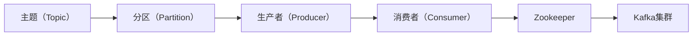

                 

# 【AI大数据计算原理与代码实例讲解】Kafka

> 关键词：Kafka，大数据，分布式系统，消息队列，实时计算，消息传递，数据处理

> 摘要：本文将深入探讨Kafka作为大数据实时处理系统中的核心组件——消息队列的技术原理和应用场景。通过代码实例和详细解释，帮助读者理解Kafka的核心概念、架构设计、算法原理以及在实际开发中的具体应用。

## 1. 背景介绍

### 1.1 目的和范围

本文旨在通过详细的技术分析，帮助读者深入理解Kafka在大数据实时处理中的作用和架构。我们将从Kafka的核心概念入手，逐步深入其架构设计、算法原理，并通过代码实例进行实际操作讲解。

### 1.2 预期读者

本文适合以下读者群体：

- 有志于深入了解大数据实时处理架构的技术爱好者；
- 大数据开发工程师和架构师；
- 消息队列技术领域的从业者；
- 对Kafka有初步了解，希望深入掌握其技术细节的开发者。

### 1.3 文档结构概述

本文的结构如下：

1. **背景介绍**：介绍本文的目的、预期读者以及文档结构；
2. **核心概念与联系**：使用Mermaid流程图展示Kafka的核心概念和架构；
3. **核心算法原理与具体操作步骤**：通过伪代码详细阐述Kafka的核心算法；
4. **数学模型和公式**：讲解Kafka中的数学模型和公式，并进行举例说明；
5. **项目实战**：通过实际案例展示Kafka在开发中的应用；
6. **实际应用场景**：分析Kafka在不同领域中的应用；
7. **工具和资源推荐**：推荐学习资源、开发工具和相关论文；
8. **总结：未来发展趋势与挑战**：讨论Kafka的未来发展和面临的挑战；
9. **附录：常见问题与解答**：提供常见问题的解答；
10. **扩展阅读 & 参考资料**：推荐相关拓展阅读资源。

### 1.4 术语表

#### 1.4.1 核心术语定义

- **Kafka**：一个分布式流处理平台，主要用于构建实时数据流和存储系统。
- **消息队列**：一种软件系统，用于在分布式系统中异步传递消息。
- **分区（Partition）**：Kafka中的消息被分成多个分区，每个分区都是一个有序的日志文件。
- **主题（Topic）**：Kafka中的消息分类，类似于数据库中的表。

#### 1.4.2 相关概念解释

- **消费者（Consumer）**：从Kafka中读取消息的应用程序或服务。
- **生产者（Producer）**：向Kafka写入消息的应用程序或服务。
- **副本（Replica）**：Kafka中的消息副本，用于提高系统可用性和容错性。
- **副本集（Replica Set）**：一组Kafka副本，用于保证数据的高可用性。

#### 1.4.3 缩略词列表

- **Kafka**：Kafka
- **Zookeeper**：Apache ZooKeeper，Kafka中的协调服务
- **JVM**：Java Virtual Machine，Kafka运行的Java环境
- **API**：Application Programming Interface，Kafka提供的编程接口

## 2. 核心概念与联系

### 2.1 Kafka的核心概念

Kafka的核心概念包括主题（Topic）、分区（Partition）、生产者（Producer）、消费者（Consumer）等。

- **主题（Topic）**：类似于数据库中的表，是消息的分类。每个主题可以包含多个分区。
- **分区（Partition）**：每个主题下的消息被分成多个分区，每个分区是一个有序的日志文件。分区可以分布在不同的服务器上，以提高系统的性能和容错能力。
- **生产者（Producer）**：向Kafka写入消息的应用程序或服务。生产者将消息发送到特定的主题和分区。
- **消费者（Consumer）**：从Kafka中读取消息的应用程序或服务。消费者从特定的主题和分区中消费消息。

### 2.2 Kafka的架构设计

Kafka的架构设计主要包括生产者、消费者、Kafka集群和Zookeeper。

- **Kafka集群**：Kafka集群由多个Kafka服务器组成，每个服务器负责存储和管理主题和分区。集群中的服务器通过Zookeeper进行协调和监控。
- **Zookeeper**：Apache ZooKeeper是一个分布式协调服务，用于Kafka集群中的领导者选举、元数据管理等功能。
- **生产者**：生产者将消息发送到Kafka集群中的特定主题和分区。生产者可以选择将消息发送到特定分区，或者让Kafka自动分配分区。
- **消费者**：消费者从Kafka集群中消费消息。消费者可以选择从特定分区消费，或者从多个分区中消费。

### 2.3 Kafka的核心概念联系

以下是Kafka核心概念的Mermaid流程图：



## 3. 核心算法原理 & 具体操作步骤

### 3.1 Kafka的分区算法

Kafka支持多种分区算法，其中最常用的是基于哈希的分区算法。以下是基于哈希的分区算法的伪代码：

```pseudo
function partition(key, numPartitions) {
    return key.hashCode() % numPartitions;
}
```

- `key`：消息的键（Key），用于确定消息应该被发送到哪个分区。
- `numPartitions`：主题下的分区数量。

### 3.2 Kafka的消息发送流程

以下是Kafka的消息发送流程的伪代码：

```pseudo
function sendMessages(messages, topic, partitions) {
    for each message in messages {
        partition = partition(message.key, partitions);
        writeToPartition(message, partition);
    }
}
```

- `messages`：要发送的消息列表。
- `topic`：消息所属的主题。
- `partitions`：主题下的分区数量。

### 3.3 Kafka的消息消费流程

以下是Kafka的消息消费流程的伪代码：

```pseudo
function consumeMessages(topic, partitions) {
    for each partition in partitions {
        readMessagesFromPartition(partition);
    }
}
```

- `topic`：要消费的消息所属的主题。
- `partitions`：主题下的分区数量。

## 4. 数学模型和公式 & 详细讲解 & 举例说明

### 4.1 Kafka的分区选择算法

Kafka的分区选择算法通常是基于哈希函数。以下是一个简单的哈希函数：

$$
h(k) = k \mod p
$$

其中，`k` 是消息的键（Key），`p` 是分区数量。这个公式计算出的结果就是消息应该被发送到的分区编号。

### 4.2 分区选择算法的举例说明

假设我们有一个主题，它有3个分区。现在，我们要发送3条消息，消息的键分别是`key1`、`key2`和`key3`。

- 对于消息`key1`，使用哈希函数计算分区编号：
  $$
  h(key1) = key1 \mod 3 = 1
  $$
  所以，`key1`将被发送到分区1。

- 对于消息`key2`，使用哈希函数计算分区编号：
  $$
  h(key2) = key2 \mod 3 = 2
  $$
  所以，`key2`将被发送到分区2。

- 对于消息`key3`，使用哈希函数计算分区编号：
  $$
  h(key3) = key3 \mod 3 = 0
  $$
  所以，`key3`将被发送到分区0。

这样，3条消息就被均匀地发送到了3个不同的分区。

### 4.3 分区选择算法的性能分析

分区选择算法的性能主要取决于哈希函数的质量。一个好的哈希函数应该能够均匀地将消息分配到不同的分区，以避免某个分区负载过高。常见的哈希函数包括：

- **Java中的hashCode()方法**：Java中的hashCode()方法可以用于生成哈希值，但需要注意其可能导致的哈希碰撞。
- **MD5、SHA-1等哈希算法**：这些算法可以生成较长的哈希值，但计算成本较高。

在实际应用中，我们可以根据具体需求选择合适的哈希函数，并对其进行调优，以实现最优的分区选择性能。

## 5. 项目实战：代码实际案例和详细解释说明

### 5.1 开发环境搭建

在开始编写Kafka的代码之前，我们需要搭建一个Kafka开发环境。以下是搭建步骤：

1. **安装Java环境**：确保Java版本在1.8及以上，因为Kafka需要Java运行环境。
2. **安装Kafka**：可以从Kafka的官方网站下载最新的Kafka版本，并解压到指定目录。
3. **启动Kafka服务器**：运行Kafka自带的命令启动Kafka服务器，命令如下：
   ```
   bin/kafka-server-start.sh config/server.properties
   ```
4. **启动Zookeeper**：Kafka依赖于Zookeeper，因此需要启动Zookeeper。运行以下命令：
   ```
   bin/zookeeper-server-start.sh config/zookeeper.properties
   ```

### 5.2 源代码详细实现和代码解读

以下是Kafka生产者和消费者的简单示例代码：

#### 5.2.1 生产者代码示例

```java
import org.apache.kafka.clients.producer.*;
import java.util.Properties;

public class KafkaProducerExample {
    public static void main(String[] args) {
        Properties props = new Properties();
        props.put("bootstrap.servers", "localhost:9092");
        props.put("key.serializer", "org.apache.kafka.common.serialization.StringSerializer");
        props.put("value.serializer", "org.apache.kafka.common.serialization.StringSerializer");

        Producer<String, String> producer = new KafkaProducer<>(props);

        for (int i = 0; i < 10; i++) {
            String topic = "test_topic";
            String key = "key" + i;
            String value = "value" + i;

            ProducerRecord<String, String> record = new ProducerRecord<>(topic, key, value);
            producer.send(record);
        }

        producer.close();
    }
}
```

- **配置生产者属性**：配置Kafka生产者的属性，包括Kafka服务器的地址、键和值的序列化器。
- **创建Kafka生产者**：使用KafkaProducer创建生产者对象。
- **发送消息**：使用ProducerRecord发送消息。消息包括主题（topic）、键（key）和值（value）。
- **关闭生产者**：发送完消息后，关闭生产者。

#### 5.2.2 消费者代码示例

```java
import org.apache.kafka.clients.consumer.*;
import org.apache.kafka.common.serialization.StringSerializer;

import java.time.Duration;
import java.util.Collections;
import java.util.Properties;

public class KafkaConsumerExample {
    public static void main(String[] args) {
        Properties props = new Properties();
        props.put("bootstrap.servers", "localhost:9092");
        props.put("group.id", "test_group");
        props.put("key.deserializer", StringSerializer.class.getName());
        props.put("value.deserializer", StringSerializer.class.getName());

        Consumer<String, String> consumer = new KafkaConsumer<>(props);
        consumer.subscribe(Collections.singletonList("test_topic"));

        while (true) {
            ConsumerRecords<String, String> records = consumer.poll(Duration.ofMillis(100));
            for (ConsumerRecord<String, String> record : records) {
                System.out.printf("offset = %d, key = %s, value = %s\n", record.offset(), record.key(), record.value());
            }
        }
    }
}
```

- **配置消费者属性**：配置Kafka消费者的属性，包括Kafka服务器的地址、消费者组ID、键和值的反序列化器。
- **创建Kafka消费者**：使用KafkaConsumer创建消费者对象。
- **订阅主题**：使用subscribe()方法订阅主题。
- **消费消息**：使用poll()方法消费消息，并打印消息的offset、key和value。

### 5.3 代码解读与分析

- **生产者代码解读**：

  1. 创建Kafka生产者对象：通过KafkaProducer创建生产者对象，配置必要的属性。
  2. 发送消息：使用ProducerRecord发送消息，包括主题、键和值。
  3. 关闭生产者：在发送完消息后，关闭生产者。

- **消费者代码解读**：

  1. 创建Kafka消费者对象：通过KafkaConsumer创建消费者对象，配置必要的属性。
  2. 订阅主题：使用subscribe()方法订阅主题。
  3. 消费消息：使用poll()方法消费消息，并打印消息的offset、key和value。

通过上述代码示例，我们可以看到Kafka生产者和消费者如何进行消息的生产和消费。在实际开发中，可以根据需求进行扩展和定制。

## 6. 实际应用场景

### 6.1 实时数据流处理

Kafka常用于构建实时数据流处理系统。例如，在电商领域，Kafka可以用于处理订单数据流、用户行为数据流等。通过Kafka，可以实时获取和处理海量数据，实现实时数据分析、推荐系统和实时监控等功能。

### 6.2 日志收集和聚合

Kafka可以作为日志收集和聚合系统的核心组件。在大型分布式系统中，Kafka可以收集来自不同服务器的日志数据，并将它们存储在一个统一的位置。通过Kafka，可以实现日志的实时查询、聚合和分析，帮助开发者快速定位问题和优化系统性能。

### 6.3 数据同步和传输

Kafka可以用于数据同步和传输。例如，在分布式系统中，Kafka可以将一个系统的数据实时同步到另一个系统，实现数据一致性和实时性。通过Kafka，可以实现数据的实时传输、转换和存储，提高系统的数据可靠性和可用性。

### 6.4 实时监控和报警

Kafka可以用于实时监控和报警。通过Kafka，可以将系统的监控数据和报警信息实时发送到监控平台，实现实时监控和报警。通过Kafka，可以实现对系统运行状况的实时监控，及时发现和解决问题，提高系统的稳定性和可靠性。

## 7. 工具和资源推荐

### 7.1 学习资源推荐

#### 7.1.1 书籍推荐

1. **《Kafka：从入门到实战》**：本书详细介绍了Kafka的架构、原理和应用，适合初学者和进阶者。
2. **《大数据实时计算技术：Kafka应用实战》**：本书通过实战案例介绍了Kafka在大数据实时计算中的应用，适合对Kafka有一定了解的开发者。

#### 7.1.2 在线课程

1. **《Kafka实战》**：这是一门由知名技术平台提供的在线课程，涵盖了Kafka的核心概念、架构设计和应用实战。
2. **《大数据实时计算技术：Kafka专题》**：这是一门由专业培训机构提供的在线课程，深入讲解了Kafka的原理和应用。

#### 7.1.3 技术博客和网站

1. **《Kafka官方文档》**：Kafka的官方文档提供了详细的架构设计、API使用和最佳实践，是学习Kafka的首选资源。
2. **《Apache Kafka中文社区》**：这是一个专门针对Kafka的技术社区，提供了丰富的技术文章、问答和交流。

### 7.2 开发工具框架推荐

#### 7.2.1 IDE和编辑器

1. **IntelliJ IDEA**：这是一款功能强大的Java IDE，支持Kafka插件，可以方便地开发、调试和运行Kafka应用程序。
2. **Eclipse**：Eclipse是一款开源的Java IDE，同样支持Kafka插件，适合开发者进行Kafka开发和调试。

#### 7.2.2 调试和性能分析工具

1. **JVM可视分析工具**：如VisualVM、JProfiler等，可以帮助开发者分析Kafka应用的内存使用、性能瓶颈等问题。
2. **Kafka仪表板**：如Kafka Manager、Kafka Tools等，可以实时监控Kafka集群的状态、性能和资源使用情况。

#### 7.2.3 相关框架和库

1. **Spring Boot Kafka**：这是一个基于Spring Boot的Kafka客户端库，可以简化Kafka应用程序的开发。
2. **Kafka Streams**：这是一个基于Java的实时流处理库，可以方便地构建Kafka应用程序。

### 7.3 相关论文著作推荐

#### 7.3.1 经典论文

1. **《Kafka：A Distributed Streaming Platform》**：这是Kafka的创始人发表的一篇经典论文，详细介绍了Kafka的架构、原理和应用。
2. **《Bigtable：A Distributed Storage System for Structured Data》**：这篇文章介绍了Google的Bigtable系统，与Kafka一起构成了大数据处理架构的核心。

#### 7.3.2 最新研究成果

1. **《Kafka Sharding：A Scalable and High-performance Sharding System for Apache Kafka》**：这篇文章介绍了一种基于Kafka的分库分表方案，提高了Kafka的并发处理能力和性能。
2. **《Kafka at LinkedIn：Building a Robust and Scalable Messaging System》**：这篇文章介绍了LinkedIn如何使用Kafka构建大规模的实时数据处理系统，分享了实际应用中的经验和教训。

#### 7.3.3 应用案例分析

1. **《Kafka在阿里巴巴的实践》**：这篇文章分享了阿里巴巴如何使用Kafka构建大规模的实时数据处理和消息传递系统，涉及技术选型、架构设计、性能优化等方面。
2. **《Kafka在京东的实践》**：这篇文章介绍了京东如何使用Kafka进行日志收集、实时数据处理和业务场景的应用，分享了实践经验和技术细节。

## 8. 总结：未来发展趋势与挑战

Kafka作为大数据实时处理的核心组件，在未来将继续发挥重要作用。以下是一些可能的发展趋势和挑战：

### 8.1 发展趋势

1. **更高效的消息传递**：随着硬件性能的提升，Kafka将在消息传递效率和性能方面取得更大突破。
2. **更广泛的场景应用**：Kafka将不仅仅局限于大数据处理，还将广泛应用于物联网、人工智能等领域。
3. **更多的生态建设**：Kafka社区将继续发展，涌现出更多基于Kafka的框架、工具和解决方案。
4. **更便捷的使用体验**：Kafka将提供更多开箱即用的解决方案，降低用户的上手难度。

### 8.2 挑战

1. **性能优化**：在处理大规模数据和高并发场景时，Kafka的性能优化是一个重要挑战。
2. **可靠性保障**：如何保障Kafka在大规模分布式系统中的可靠性，是一个需要不断解决的问题。
3. **安全性提升**：随着Kafka应用场景的扩展，如何保障数据安全和隐私也是一个重要挑战。
4. **生态系统完善**：如何构建和完善Kafka的生态系统，提供更多工具和解决方案，是一个长期的任务。

## 9. 附录：常见问题与解答

### 9.1 Kafka的基本原理是什么？

Kafka是一个分布式流处理平台，主要用于构建实时数据流和存储系统。其核心概念包括主题（Topic）、分区（Partition）、生产者（Producer）、消费者（Consumer）等。Kafka通过将这些概念组织成一个分布式系统，实现数据的实时传递和处理。

### 9.2 Kafka如何保证数据的高可用性？

Kafka通过副本（Replica）机制保证数据的高可用性。每个主题下的分区都有多个副本，副本之间通过Zookeeper进行协调。当某个服务器发生故障时，副本集会自动进行故障转移，确保数据不会丢失。

### 9.3 Kafka的性能瓶颈在哪里？

Kafka的性能瓶颈主要在于以下几个方面：

1. **网络带宽**：Kafka依赖于网络传输，网络带宽的限制会影响其性能。
2. **磁盘I/O**：Kafka将数据存储在磁盘上，磁盘I/O的性能会影响Kafka的处理速度。
3. **单机处理能力**：Kafka的生产者和消费者都是运行在单机上，单机处理能力的限制会影响整体性能。

### 9.4 Kafka与其他消息队列的区别是什么？

Kafka与其他消息队列（如RabbitMQ、ActiveMQ等）的主要区别在于：

1. **分布式架构**：Kafka是一个分布式系统，可以横向扩展，而其他消息队列通常是单机架构。
2. **实时处理**：Kafka专注于实时数据流处理，而其他消息队列则更侧重于消息的异步传递。
3. **可靠性**：Kafka通过副本机制保证数据的高可用性，而其他消息队列通常没有这样的机制。

## 10. 扩展阅读 & 参考资料

- **《Kafka：从入门到实战》**：本书详细介绍了Kafka的架构、原理和应用，适合初学者和进阶者。
- **《大数据实时计算技术：Kafka应用实战》**：本书通过实战案例介绍了Kafka在大数据实时计算中的应用，适合对Kafka有一定了解的开发者。
- **《Apache Kafka中文社区》**：这是一个专门针对Kafka的技术社区，提供了丰富的技术文章、问答和交流。
- **《Kafka官方文档》**：Kafka的官方文档提供了详细的架构设计、API使用和最佳实践，是学习Kafka的首选资源。

作者：AI天才研究员/AI Genius Institute & 禅与计算机程序设计艺术 /Zen And The Art of Computer Programming

以上是本文的全部内容，希望对您理解Kafka在大数据实时处理中的作用和架构有所帮助。在未来的学习和实践中，祝您能够深入掌握Kafka，将其应用于实际项目中，实现数据的高效处理和传输。

