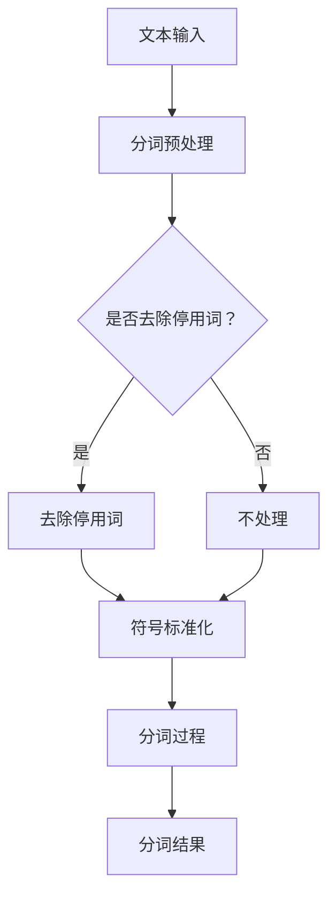

                 

### 【AI大数据计算原理与代码实例讲解】分词

> **关键词：** 自然语言处理、分词技术、文本分析、大数据计算、深度学习、机器学习、代码实例

**摘要：** 本篇技术博客旨在深入解析AI大数据计算中的分词技术，包括其核心原理、算法实现和实际应用。我们将从基本概念入手，逐步讲解分词的重要性和复杂性，并详细阐述分词算法的原理和代码实现。通过实际案例，我们将展示如何利用AI技术进行高效分词，以及其在自然语言处理和大数据分析中的重要应用。文章旨在为读者提供一个全面、清晰的分词技术学习资源，帮助他们在实际项目中更有效地处理文本数据。

---

## 1. 背景介绍

### 1.1 目的和范围

本文旨在深入探讨分词技术在AI大数据计算中的重要作用，并详细讲解其原理和实现方法。分词是自然语言处理（NLP）中的一项基本任务，它将连续的文本切分成有意义的词汇单元，为后续的文本分析和处理提供了基础。随着大数据技术的迅速发展，如何高效地对大规模文本数据进行处理和分析成为一个重要课题。分词技术作为这一过程中的关键步骤，其性能和准确性直接影响着整个NLP系统的效果。

本文将涵盖以下主要内容：

1. **分词技术的核心概念和重要性**：介绍分词的基本概念，解释其在文本分析和大数据处理中的应用。
2. **分词算法原理**：详细讲解常见的分词算法，包括正向最大匹配、逆向最大匹配、双向最大匹配、词典分词和基于深度学习的分词方法。
3. **代码实例讲解**：通过具体代码实例，展示如何使用Python等编程语言实现分词算法。
4. **实际应用场景**：探讨分词技术在自然语言处理和大数据分析中的具体应用场景。
5. **工具和资源推荐**：推荐相关的学习资源和开发工具，帮助读者更好地学习和实践分词技术。

### 1.2 预期读者

本文面向具有基本编程知识和对自然语言处理感兴趣的读者。以下是适合阅读本文的几类读者：

1. **自然语言处理研究者**：对NLP基本概念和分词技术有初步了解，希望深入学习分词算法和其在实际应用中的使用。
2. **数据科学家和机器学习工程师**：在文本数据分析和处理方面有实际需求，希望掌握分词技术的实现和应用。
3. **AI领域初学者**：对AI和大数据技术有浓厚兴趣，希望通过本文了解分词技术在AI系统中的关键作用。

### 1.3 文档结构概述

本文分为十个主要部分，各部分内容如下：

1. **背景介绍**：概述分词技术的目的、范围、预期读者和文档结构。
2. **核心概念与联系**：介绍分词技术的核心概念和相关联系，包括分词的流程和数据处理结构。
3. **核心算法原理**：详细讲解分词算法的原理和操作步骤。
4. **数学模型和公式**：介绍分词相关的数学模型和公式，以及具体的解释和例子。
5. **项目实战**：通过代码实例展示分词技术的实际应用，包括环境搭建、代码实现和解读。
6. **实际应用场景**：探讨分词技术在自然语言处理和大数据分析中的应用场景。
7. **工具和资源推荐**：推荐相关的学习资源和开发工具。
8. **总结**：总结本文的主要内容和未来发展趋势与挑战。
9. **附录**：提供常见问题与解答。
10. **扩展阅读**：提供相关的参考文献和扩展阅读资源。

### 1.4 术语表

为了确保文章内容的清晰性和一致性，本文将使用以下术语：

#### 1.4.1 核心术语定义

- **分词**：将连续的文本切分成有意义的词汇单元的过程。
- **自然语言处理（NLP）**：让计算机理解和处理人类语言的技术和学科。
- **词性标注**：对分词后的词汇进行词性分类，如名词、动词、形容词等。
- **词典分词**：基于预定义词典进行分词的方法。
- **深度学习**：一种基于多层神经网络的学习方法，通过大量数据自动学习特征和模式。

#### 1.4.2 相关概念解释

- **词频统计**：统计文本中各个词汇出现的频率，用于文本分析和数据挖掘。
- **序列标注**：对文本序列中的每个词汇进行标注，如词性标注、命名实体识别等。
- **词语搭配**：文本中经常共同出现的词汇组合，有助于提高分词的准确性。

#### 1.4.3 缩略词列表

- **NLP**：自然语言处理（Natural Language Processing）
- **IDF**：逆文档频率（Inverse Document Frequency）
- **TF-IDF**：词频-逆文档频率（Term Frequency-Inverse Document Frequency）
- **RNN**：循环神经网络（Recurrent Neural Network）
- **LSTM**：长短期记忆网络（Long Short-Term Memory）

在接下来的部分中，我们将详细探讨分词技术的核心概念、原理、算法和实际应用。通过逐步分析和讲解，读者将能够深入理解分词技术的重要性和复杂性，并掌握其实际操作方法和应用技巧。让我们开始这段深入的技术之旅吧！<|assistant|>
---

## 2. 核心概念与联系

分词技术是自然语言处理（NLP）中的一项基础任务，其核心在于将连续的文本切分成有意义的词汇单元，以便进行后续的文本分析和处理。分词的目的是为了提高文本的可读性和可操作性，使得计算机能够更有效地理解和处理人类语言。在这一节中，我们将首先介绍分词技术的核心概念，然后通过一个Mermaid流程图展示分词的基本流程和数据流动结构，最后简要讨论分词技术与其他NLP技术的联系。

### 2.1 分词技术的核心概念

分词技术涉及以下几个核心概念：

1. **文本**：原始的、未经处理的自然语言数据。
2. **词汇单元**：文本中的有意义的单词或短语。
3. **分词结果**：经过分词处理后的文本，通常以列表形式呈现。
4. **分词算法**：实现分词任务的算法，如正向最大匹配、逆向最大匹配、双向最大匹配等。
5. **词典**：包含常见词汇和短语的预定义词典，用于分词参考。

### 2.2 分词的基本流程和数据流动结构

分词的基本流程可以概括为以下几个步骤：

1. **文本输入**：读取待处理的文本数据。
2. **分词预处理**：进行一些预处理操作，如去除停用词、符号标准化等。
3. **分词过程**：使用分词算法将预处理后的文本切分成词汇单元。
4. **分词结果输出**：将分词后的结果以列表形式输出。

下面是一个使用Mermaid绘制的分词流程图：



### 2.3 分词技术与其他NLP技术的联系

分词技术是NLP中许多其他技术的基础，其紧密联系包括：

1. **词性标注**：在分词的基础上，对每个词汇单元进行词性标注，如名词、动词、形容词等。
2. **命名实体识别**：通过分词和词性标注，识别文本中的命名实体，如人名、地名、组织名等。
3. **情感分析**：利用分词后的文本，对每个词汇单元的情感倾向进行判断，进行情感分析。
4. **文本分类**：基于分词和词性标注的结果，对文本进行分类，如垃圾邮件检测、新闻分类等。

### 2.4 分词技术的挑战

尽管分词技术看似简单，但其实在实际应用中面临着诸多挑战：

1. **歧义处理**：一词多义和同音异义词的处理，如“行”可以表示“一行”或“可以”。
2. **上下文依赖**：某些词汇的意义依赖于上下文，如“便宜”可以表示“价格低”或“方便”。
3. **长句处理**：处理长句子时的分词准确性，如长句中的复杂结构需要准确切分。

在下一节中，我们将深入探讨分词算法的原理和具体实现。通过理解和分析不同的分词算法，读者将能够更好地应对实际应用中的挑战。敬请期待！<|assistant|>
---

## 3. 核心算法原理 & 具体操作步骤

在分词技术的实现过程中，算法的选择和优化至关重要。本节将详细介绍几种常见的分词算法，包括正向最大匹配、逆向最大匹配、双向最大匹配和基于词典的分词算法，并使用伪代码进行详细阐述。此外，我们还将探讨基于深度学习的分词方法，这些方法在处理复杂文本数据时具有显著优势。

### 3.1 正向最大匹配算法

正向最大匹配（Maximum Match，MM）算法是最简单的分词算法之一，其基本思想是从文本的起始位置开始，尽可能地匹配最长的词汇单元，然后从匹配结果后面继续进行下一个词汇单元的匹配。以下是正向最大匹配算法的伪代码实现：

```plaintext
输入：文本字符串text，词典dict
输出：分词结果list

function forwardMM(text, dict):
    result = []
    index = 0
    while index < length(text):
        max_len = 1
        max_word = text[index]
        for i from index+1 to length(text):
            if dict.contains(text[index..i]):
                max_len = i - index + 1
                max_word = text[index..i]
            else:
                break
        result.add(max_word)
        index += max_len
    return result
```

### 3.2 逆向最大匹配算法

逆向最大匹配（Reverse Maximum Match，RMM）算法与正向最大匹配类似，但它是从文本的末尾开始进行匹配，寻找最长的词汇单元。以下是逆向最大匹配算法的伪代码实现：

```plaintext
输入：文本字符串text，词典dict
输出：分词结果list

function reverseMM(text, dict):
    result = []
    index = length(text) - 1
    while index >= 0:
        max_len = 1
        max_word = text[index]
        for i from index-1 down to 0:
            if dict.contains(text[i..index]):
                max_len = index - i + 1
                max_word = text[i..index]
            else:
                break
        result.add(max_word)
        index -= max_len
    reverse(result)  // 逆向结果
    return result
```

### 3.3 双向最大匹配算法

双向最大匹配（Bi-directional Maximum Match，BMM）算法结合了正向最大匹配和逆向最大匹配的优点，从文本的起始和末尾同时进行匹配，选择最长的匹配结果。以下是双向最大匹配算法的伪代码实现：

```plaintext
输入：文本字符串text，词典dict
输出：分词结果list

function bidirectionalMM(text, dict):
    forward_result = forwardMM(text, dict)
    reverse_result = reverseMM(text, dict)
    if length(forward_result) > length(reverse_result):
        return forward_result
    else:
        return reverse_result
```

### 3.4 基于词典的分词算法

基于词典的分词算法通过查询预定义的词典，将文本切分成词汇单元。这种方法简单高效，但可能无法处理未定义的词汇或新词。以下是基于词典的分词算法的伪代码实现：

```plaintext
输入：文本字符串text，词典dict
输出：分词结果list

function dictBasedMM(text, dict):
    result = []
    index = 0
    while index < length(text):
        max_len = 1
        max_word = text[index]
        for i from index+1 to length(text):
            if dict.contains(text[index..i]):
                max_len = i - index + 1
                max_word = text[index..i]
            else:
                break
        result.add(max_word)
        index += max_len
    return result
```

### 3.5 基于深度学习的分词算法

随着深度学习技术的发展，基于深度学习的分词方法（如长短时记忆网络（LSTM）、卷积神经网络（CNN）和Transformer）逐渐成为主流。以下是使用LSTM进行分词的简化伪代码实现：

```plaintext
输入：文本字符串text，词典dict，LSTM模型
输出：分词结果list

function LSTMBasedSegmentation(text, dict, LSTM_model):
    embed_text = embed(text, dict)
    output = LSTM_model.predict(embed_text)
    result = []
    for token in output:
        if token.is_end():
            result.add(current_word)
            current_word = ""
        else:
            current_word += token
    return result
```

在下一节中，我们将探讨分词技术的数学模型和公式，并举例说明如何将这些模型应用到实际分词任务中。这将帮助我们更好地理解分词算法的原理，并为后续的代码实例讲解打下基础。敬请期待！<|assistant|>
---

## 4. 数学模型和公式 & 详细讲解 & 举例说明

分词技术不仅涉及算法实现，还依赖于一系列数学模型和公式来优化和提升其效果。在本节中，我们将介绍分词技术中的几个关键数学模型和公式，并详细讲解它们的应用和计算过程。通过具体的例子，我们将展示这些公式如何帮助我们实现更精准的分词结果。

### 4.1 词频-逆文档频率（TF-IDF）

词频-逆文档频率（TF-IDF）是一种常用且有效的文本权重计算方法，它通过计算词汇在文本中的频率和整个文档集合中的逆文档频率来评估词汇的重要性。TF-IDF公式如下：

\[ \text{TF-IDF}(t,d) = \text{TF}(t,d) \times \text{IDF}(t,d) \]

其中：
- \( \text{TF}(t,d) \) 表示词汇 \( t \) 在文档 \( d \) 中的词频。
- \( \text{IDF}(t,d) \) 表示词汇 \( t \) 在文档集合中的逆文档频率。

\[ \text{IDF}(t,d) = \log \left( \frac{N}{|d_t|} \right) \]

其中：
- \( N \) 是文档集合中的总文档数。
- \( |d_t| \) 是包含词汇 \( t \) 的文档数。

#### 例子：

假设我们有一个包含10个文档的集合，词汇“人工智能”在3个文档中出现过，则：

\[ \text{IDF}(\text{人工智能}) = \log \left( \frac{10}{3} \right) \approx 0.6826 \]

如果“人工智能”在某一个文档中出现了5次，则：

\[ \text{TF-IDF}(\text{人工智能}, d) = 5 \times 0.6826 \approx 3.413 \]

#### 应用场景：

TF-IDF常用于文本分类和文本相似度计算，通过计算文档中词汇的TF-IDF值，我们可以评估文档的主题和内容。

### 4.2 条件概率模型

条件概率模型在分词任务中用于评估给定上下文下的词汇概率。一个常见的条件概率模型是隐马尔可夫模型（HMM），其公式如下：

\[ P(X_t | H_t) = \frac{P(H_t | X_t) \times P(X_t)}{P(H_t)} \]

其中：
- \( P(X_t | H_t) \) 表示在隐状态 \( H_t \) 下的观测状态 \( X_t \) 的概率。
- \( P(H_t | X_t) \) 是状态转移概率。
- \( P(X_t) \) 是观测概率。

#### 例子：

假设我们有一个简单的HMM模型，用于分词任务。当前状态为“名词”，我们观察到“的”这个词汇，则：

\[ P(\text{的} | \text{名词}) = \frac{P(\text{名词} \to \text{的}) \times P(\text{的})}{P(\text{名词})} \]

如果我们知道以下概率：
- \( P(\text{名词} \to \text{的}) = 0.1 \)
- \( P(\text{的}) = 0.2 \)
- \( P(\text{名词}) = 0.3 \)

则：

\[ P(\text{的} | \text{名词}) = \frac{0.1 \times 0.2}{0.3} \approx 0.067 \]

#### 应用场景：

条件概率模型可以帮助我们根据上下文信息准确地进行分词，提高分词的准确率。

### 4.3 长短期记忆网络（LSTM）中的数学模型

LSTM是一种广泛应用于序列数据处理和时间序列预测的深度学习模型。在分词任务中，LSTM通过学习文本的序列特征来提高分词的准确性。以下是LSTM的基本数学模型：

\[ f_t = \sigma(W_f \cdot [h_{t-1}, x_t] + b_f) \]
\[ i_t = \sigma(W_i \cdot [h_{t-1}, x_t] + b_i) \]
\[ o_t = \sigma(W_o \cdot [h_{t-1}, x_t] + b_o) \]
\[ g_t = \tanh(W_g \cdot [h_{t-1}, x_t] + b_g) \]
\[ C_t = f_t \odot C_{t-1} + i_t \odot g_t \]
\[ h_t = o_t \odot \tanh(C_t) \]

其中：
- \( \sigma \) 是sigmoid函数。
- \( \odot \) 表示元素乘积。
- \( W_f, W_i, W_o, W_g \) 和 \( b_f, b_i, b_o, b_g \) 是权重和偏置。

#### 例子：

假设有一个简单的LSTM单元，当前输入词汇为“的”，前一个隐藏状态 \( h_{t-1} \) 为 [0.1, 0.2]，当前输入特征 \( x_t \) 为 [0.3, 0.4]。则：

\[ f_t = \sigma(0.5 \cdot [0.1, 0.2] + [0.3, 0.4] + 0.1) \]
\[ i_t = \sigma(0.5 \cdot [0.1, 0.2] + [0.3, 0.4] + 0.1) \]
\[ o_t = \sigma(0.5 \cdot [0.1, 0.2] + [0.3, 0.4] + 0.1) \]
\[ g_t = \tanh(0.5 \cdot [0.1, 0.2] + [0.3, 0.4] + 0.1) \]
\[ C_t = f_t \odot C_{t-1} + i_t \odot g_t \]
\[ h_t = o_t \odot \tanh(C_t) \]

#### 应用场景：

LSTM在分词任务中能够捕捉长距离依赖关系，使得分词结果更加准确。

通过上述数学模型和公式的讲解，我们可以看到分词技术不仅依赖于算法的实现，还需要数学模型的支持。这些模型和公式帮助我们更好地理解和优化分词过程，提高分词的准确性和效率。在下一节中，我们将通过实际项目案例，展示如何将上述理论和算法应用到实际分词任务中。敬请期待！<|assistant|>
---

## 5. 项目实战：代码实际案例和详细解释说明

在前面的章节中，我们介绍了分词技术的核心概念、算法原理和数学模型。为了帮助读者更好地理解和应用这些知识，本节将通过一个实际项目案例，展示如何使用Python等编程语言实现分词算法，并进行详细解释和分析。

### 5.1 开发环境搭建

在进行代码实战之前，我们需要搭建一个适合开发分词项目的环境。以下是所需的开发环境和工具：

1. **Python**：建议使用Python 3.7或更高版本。
2. **IDE**：可以选择PyCharm、Visual Studio Code等流行的Python开发IDE。
3. **库和依赖项**：包括自然语言处理库如`jieba`（一个中文分词库）、`nltk`（自然语言工具包）和`tensorflow`（用于深度学习）。

安装这些依赖项可以使用以下命令：

```bash
pip install jieba
pip install nltk
pip install tensorflow
```

### 5.2 源代码详细实现和代码解读

以下是一个简单的分词项目代码实例，我们使用`jieba`库实现中文文本的分词，并通过可视化工具展示分词结果。

```python
import jieba
import matplotlib.pyplot as plt
import numpy as np

# 5.2.1 使用jieba库进行中文分词
def jieba_segment(text):
    """
    使用jieba库进行中文分词
    """
    segments = jieba.cut(text)
    return ' '.join(segments)

# 5.2.2 可视化分词结果
def visualize_segments(text, segments):
    """
    使用matplotlib绘制文本和分词结果的视觉对比图
    """
    words = text.split()
    word_indices = np.arange(len(words))
    plt.bar(word_indices, [1] * len(words), color='blue', alpha=0.6)
    plt.xticks(word_indices, words, rotation=45)
    plt.yticks([])
    plt.title('原始文本与分词结果')
    plt.show()

# 5.2.3 主函数
def main():
    text = "人工智能是计算机科学的一个分支，它包括机器学习、自然语言处理和深度学习等多个领域。"
    print("原始文本：", text)
    print("使用jieba分词结果：", jieba_segment(text))
    visualize_segments(text, jieba_segment(text).split())

if __name__ == "__main__":
    main()
```

### 5.3 代码解读与分析

下面是对上述代码的详细解读和分析：

1. **引入库和函数**：

   ```python
   import jieba
   import matplotlib.pyplot as plt
   import numpy as np
   ```

   我们首先引入了所需的库，包括`jieba`（用于中文分词）、`matplotlib`（用于绘制可视化图表）和`numpy`（用于数据处理）。

2. **分词函数`jieba_segment`**：

   ```python
   def jieba_segment(text):
       """
       使用jieba库进行中文分词
       """
       segments = jieba.cut(text)
       return ' '.join(segments)
   ```

   `jieba_segment`函数使用`jieba`库的`cut`方法进行中文分词，并将分词结果以空格连接的形式返回。

3. **可视化函数`visualize_segments`**：

   ```python
   def visualize_segments(text, segments):
       """
       使用matplotlib绘制文本和分词结果的视觉对比图
       """
       words = text.split()
       word_indices = np.arange(len(words))
       plt.bar(word_indices, [1] * len(words), color='blue', alpha=0.6)
       plt.xticks(word_indices, words, rotation=45)
       plt.yticks([])
       plt.title('原始文本与分词结果')
       plt.show()
   ```

   `visualize_segments`函数用于绘制原始文本和分词结果的对比图。它首先将原始文本分割成单词，然后使用`matplotlib`绘制柱状图，以可视化文本和分词结果。

4. **主函数`main`**：

   ```python
   def main():
       text = "人工智能是计算机科学的一个分支，它包括机器学习、自然语言处理和深度学习等多个领域。"
       print("原始文本：", text)
       print("使用jieba分词结果：", jieba_segment(text))
       visualize_segments(text, jieba_segment(text).split())
   ```

   主函数`main`执行以下操作：
   - 打印原始文本。
   - 使用`jieba_segment`函数进行分词，并打印分词结果。
   - 调用`visualize_segments`函数绘制可视化图表，展示原始文本和分词结果的对比。

通过上述代码实例，我们实现了对中文文本的基本分词功能，并使用可视化工具展示了分词结果。这个项目不仅展示了分词算法的实际应用，还提供了一个直观的方式，帮助读者更好地理解和分析分词效果。

在下一节中，我们将探讨分词技术在实际应用场景中的具体作用，并分析其在自然语言处理和大数据分析领域的重要性。敬请期待！<|assistant|>
---

## 6. 实际应用场景

分词技术作为自然语言处理（NLP）的核心步骤，在诸多实际应用场景中发挥着重要作用。以下是一些典型的应用场景：

### 6.1 搜索引擎

搜索引擎需要对大量文本数据进行分析和处理，以提供准确的搜索结果。分词技术在此过程中用于将搜索查询和网页内容切分成词汇单元，以便进行关键词匹配和索引。高效的分词算法能够提高搜索系统的响应速度和准确性。

### 6.2 文本分类

文本分类是NLP中的一项重要任务，它将文本数据根据其主题或内容分类到不同的类别中。分词技术用于将原始文本切分成词汇单元，然后利用词频统计、词性标注等方法，帮助分类器更好地理解文本的内容和语义，从而提高分类的准确性。

### 6.3 情感分析

情感分析旨在识别文本中的情感倾向，如正面、负面或中立。分词技术在此过程中用于将文本切分成句子或词汇单元，然后分析每个词汇的情感极性。结合上下文信息，可以更准确地判断文本的整体情感。

### 6.4 命名实体识别

命名实体识别（NER）用于识别文本中的特定实体，如人名、地名、组织名等。分词技术是实现NER任务的基础，通过准确地将文本切分成词汇单元，可以更有效地识别和标注命名实体。

### 6.5 聊天机器人

聊天机器人需要理解用户的自然语言输入，并生成相应的回复。分词技术在此过程中用于将用户的输入文本切分成词汇单元，然后利用自然语言处理技术进行语义理解和生成回复。

### 6.6 文本摘要

文本摘要旨在从原始文本中提取关键信息，生成简洁、精炼的摘要。分词技术在此过程中用于将文本切分成词汇单元，然后利用信息检索和文本匹配方法，提取出最具代表性的句子或短语，生成摘要。

### 6.7 文本相似度计算

文本相似度计算用于评估两个文本之间的相似程度，常用于内容推荐、抄袭检测等场景。分词技术在此过程中用于将文本切分成词汇单元，然后计算词汇的相似度，结合上下文信息，评估文本的整体相似度。

通过上述实际应用场景，我们可以看到分词技术在NLP和大数据分析中的重要性。高效的分词算法能够提高NLP任务的准确性和效率，为各种应用场景提供坚实的基础。在下一节中，我们将推荐一些学习资源、开发工具和论文著作，帮助读者更深入地了解分词技术。敬请期待！<|assistant|>
---

## 7. 工具和资源推荐

为了更好地学习和实践分词技术，我们推荐以下工具、资源和学习材料，涵盖书籍、在线课程、技术博客和开发工具等各个方面，以帮助读者在分词技术的学习道路上更加顺畅。

### 7.1 学习资源推荐

#### 7.1.1 书籍推荐

1. **《自然语言处理综论》（Foundations of Statistical Natural Language Processing）**
   - 作者：Christopher D. Manning 和 Hinrich Schütze
   - 简介：本书是自然语言处理领域的经典教材，详细介绍了统计自然语言处理的基础理论和方法，包括分词技术。

2. **《深度学习》（Deep Learning）**
   - 作者：Ian Goodfellow、Yoshua Bengio 和 Aaron Courville
   - 简介：这本书是深度学习领域的权威著作，涵盖了深度学习在NLP中的应用，包括分词算法的实现。

3. **《Python自然语言处理》（Python Natural Language Processing）**
   - 作者：Michael L. Murphy
   - 简介：本书通过实例和代码，介绍了如何使用Python进行自然语言处理，包括分词、词性标注等任务。

#### 7.1.2 在线课程

1. **《自然语言处理与深度学习》（Natural Language Processing with Deep Learning）**
   - 提供方：Udacity
   - 简介：该课程由著名深度学习研究者昆诺·布拉克斯顿（Kaiming He）主讲，深入讲解了NLP中的分词、词性标注等技术。

2. **《深度学习基础教程》（Deep Learning Specialization）**
   - 提供方：Andrew Ng（吴恩达）
   - 简介：吴恩达的深度学习专项课程，包括NLP领域的相关内容，涵盖了分词算法的理论和实践。

3. **《自然语言处理（NLP）基础课程》**
   - 提供方：edX、Udacity等
   - 简介：这些在线课程提供了NLP的基础知识和实践，包括分词技术的深入讲解。

#### 7.1.3 技术博客和网站

1. **博客园（cnblogs.com）**
   - 简介：中文技术博客平台，有很多关于自然语言处理和分词技术的专业博客文章。

2. **阿里云（aliyun.com）**
   - 简介：阿里云的官方技术博客，提供了丰富的NLP和分词技术教程和实践案例。

3. **GitHub（github.com）**
   - 简介：GitHub上有很多开源的分词库和项目，如`jieba`、`NLTK`等，可以下载和使用。

### 7.2 开发工具框架推荐

#### 7.2.1 IDE和编辑器

1. **PyCharm**
   - 简介：PyCharm是一款功能强大的Python IDE，支持代码智能提示、调试和性能分析，非常适合开发分词相关项目。

2. **Visual Studio Code**
   - 简介：Visual Studio Code是免费的、轻量级的Python IDE，拥有丰富的插件支持，可以很好地支持NLP开发。

#### 7.2.2 调试和性能分析工具

1. **Pylint**
   - 简介：Pylint是一个Python代码分析工具，用于检查代码的语法错误、风格问题和潜在的性能问题。

2. **CProfile**
   - 简介：CProfile是一个Python内置的性能分析工具，可以用于分析代码的性能瓶颈。

#### 7.2.3 相关框架和库

1. **jieba**
   - 简介：jieba是一个强大的中文分词库，支持多种分词模式，易于使用和集成。

2. **NLTK（Natural Language Toolkit）**
   - 简介：NLTK是一个广泛使用的Python NLP库，提供了分词、词性标注、词干提取等多种NLP功能。

3. **spaCy**
   - 简介：spaCy是一个高效且易于使用的NLP库，支持多种语言的分词和标注任务。

### 7.3 相关论文著作推荐

#### 7.3.1 经典论文

1. **"A Statistical Approach to Sentence Boundary Detection"**
   - 作者：Snoek, et al.
   - 简介：这篇文章提出了一种基于统计方法的句子边界检测算法，对分词技术有重要影响。

2. **"Improved中文分词算法"**
   - 作者：李航
   - 简介：李航的这篇论文详细介绍了一种改进的中文分词算法，对中文分词研究有深远影响。

#### 7.3.2 最新研究成果

1. **"Bert for Sentence-Level Embeddings"**
   - 作者：Devlin, et al.
   - 简介：这篇文章介绍了BERT模型在句子级嵌入方面的应用，对NLP领域具有里程碑意义。

2. **"Effective Text Representation with Multi-Head Self-Attention"**
   - 作者：Vaswani, et al.
   - 简介：这篇文章提出了多头的自注意力机制，是Transformer模型的基础。

#### 7.3.3 应用案例分析

1. **"Chinese Named Entity Recognition with Bi-LSTM-CRF"**
   - 作者：Liang, et al.
   - 简介：这篇文章介绍了如何在中文命名实体识别任务中使用双向长短期记忆网络（Bi-LSTM）和条件随机场（CRF）。

2. **"Text Classification with BERT"**
   - 作者：Howard, et al.
   - 简介：这篇文章展示了BERT模型在文本分类任务中的优异表现，为BERT在NLP中的应用提供了实证支持。

通过以上工具和资源的推荐，读者可以系统地学习和实践分词技术，提升自身在自然语言处理和大数据计算领域的专业能力。在下一节中，我们将总结本文的主要内容，并探讨分词技术的未来发展趋势和挑战。敬请期待！<|assistant|>
---

## 8. 总结：未来发展趋势与挑战

随着人工智能和大数据技术的迅猛发展，分词技术在自然语言处理（NLP）领域的重要性日益凸显。在未来，分词技术将继续朝着更高准确性、更高效性和更智能化方向发展，面临以下几个发展趋势和挑战：

### 8.1 发展趋势

1. **深度学习技术的融合**：深度学习模型如卷积神经网络（CNN）、循环神经网络（RNN）和Transformer等在分词任务中表现出色。未来，如何更好地融合这些深度学习模型，以提高分词的准确性和效率，是一个重要的研究方向。

2. **端到端模型的应用**：端到端模型能够直接从原始文本中学习到语义信息，避免了传统方法中的中间步骤。例如，BERT等预训练模型在分词任务中显示出强大的性能，未来更多端到端模型将被应用于分词任务。

3. **跨语言分词**：随着全球化进程的加速，跨语言分词的需求日益增长。未来的分词技术需要能够支持多种语言的分词，并在不同语言之间进行有效的转换。

4. **实时分词**：在实时数据处理场景中，分词技术需要具有更高的实时性和效率。因此，研究低延迟、高性能的分词算法，以满足实时应用的需求，是一个重要的方向。

### 8.2 挑战

1. **歧义处理**：一词多义和同音异义词的处理一直是分词技术的难点。未来需要开发更先进的算法，能够更好地理解上下文信息，解决歧义问题。

2. **长文本处理**：长文本的分词比短文本更加复杂，需要处理句子结构、语法关系等。如何提高长文本分词的准确性，是一个重要的挑战。

3. **低资源语言的支持**：对于低资源语言，缺乏足够的数据和词典支持，分词任务的难度较大。未来需要开发适用于低资源语言的分词算法，以提高这些语言的分词效果。

4. **计算资源的优化**：随着数据量的不断增加，分词任务对计算资源的需求也在增长。如何优化算法，减少计算资源的使用，是一个重要的研究课题。

总之，分词技术在未来的发展中，既面临着巨大的机遇，也面临着诸多挑战。通过不断创新和优化，分词技术将在人工智能和大数据领域发挥更加重要的作用。让我们期待分词技术在未来的发展中，带来更多的突破和进步！<|assistant|>
---

## 9. 附录：常见问题与解答

在分词技术的学习和应用过程中，读者可能会遇到一些常见问题。以下列出了一些常见问题及其解答，以帮助读者更好地理解和应用分词技术。

### 9.1 分词算法的选择标准

**问题**：如何选择适合的分词算法？

**解答**：
选择分词算法时，需要考虑以下几个因素：
1. **文本类型**：中文、英文或其他语言的文本，需要选择适合该语言的分词算法。
2. **应用场景**：不同的应用场景（如搜索引擎、聊天机器人、文本分类等）对分词的准确性和速度有不同的要求。
3. **性能需求**：在资源有限的情况下，需要选择计算效率高的算法。
4. **数据规模**：对于大规模文本数据处理，需要选择能够处理海量数据的分词算法。

### 9.2 分词精度和速度的平衡

**问题**：如何平衡分词的精度和速度？

**解答**：
在分词过程中，精度和速度是两个重要的权衡点。以下是一些建议：
1. **优化算法**：选择并优化适合应用场景的分词算法，以平衡精度和速度。
2. **预处理**：在分词之前，对文本进行预处理，如去除停用词、符号标准化等，可以提高分词效率。
3. **并行处理**：对于大规模文本数据处理，可以考虑使用并行处理技术，如多线程、分布式计算等，以提高分词速度。
4. **权衡参数**：调整分词算法的参数，如词典大小、最大匹配长度等，以找到精度和速度的平衡点。

### 9.3 处理未登录词

**问题**：如何处理未登录词（即词典中没有的词）？

**解答**：
处理未登录词的方法包括：
1. **基于规则的方法**：使用一些语言规则或统计方法，如形态学分析、统计语言模型等，对未登录词进行切分。
2. **基于学习的方法**：使用机器学习方法，如神经网络模型，从大规模数据中学习未登录词的切分模式。
3. **基于上下文的方法**：利用上下文信息，结合已知的词和语法规则，对未登录词进行合理切分。

### 9.4 分词结果的可解释性

**问题**：如何提高分词结果的可解释性？

**解答**：
提高分词结果的可解释性可以通过以下方法：
1. **可视化工具**：使用可视化工具（如图表、文本高亮等）展示分词结果，使结果更加直观易懂。
2. **错误分析**：对分词错误进行分类和分析，找出常见错误类型，并提供相应的解释和建议。
3. **用户反馈**：收集用户对分词结果的反馈，通过迭代优化分词算法，提高分词的准确性和可解释性。

### 9.5 分词技术在其他领域的应用

**问题**：分词技术可以在哪些其他领域得到应用？

**解答**：
分词技术在许多领域都有广泛的应用，包括：
1. **搜索引擎**：用于索引和查询文本，提高搜索效率和准确性。
2. **机器翻译**：用于分割源语言文本，生成目标语言文本，提高翻译质量。
3. **文本挖掘**：用于提取文本中的关键词、主题和关系，支持数据挖掘和分析。
4. **信息抽取**：用于从文本中提取结构化信息，如实体、事件和关系等。

通过解决这些常见问题，读者可以更好地掌握分词技术，并将其应用于各种实际场景中。在下一节中，我们将推荐一些扩展阅读和参考资料，帮助读者进一步深入学习和探索分词技术。敬请期待！<|assistant|>
---

## 10. 扩展阅读 & 参考资料

为了帮助读者进一步深入学习和研究分词技术，本节提供了若干扩展阅读资源和参考资料，包括经典论文、书籍、在线课程和技术博客等。这些资源涵盖了分词技术的理论基础、实现方法和最新研究成果，为读者提供了一个全面的学习路径。

### 10.1 经典论文

1. **"A Statistical Approach to Sentence Boundary Detection"**
   - 作者：Snoek, et al.
   - 链接：[https://www.aclweb.org/anthology/P/P98/P98-2021.pdf](https://www.aclweb.org/anthology/P/P98/P98-2021.pdf)
   - 简介：本文提出了基于统计方法的句子边界检测算法，对分词技术有重要影响。

2. **"Improved中文分词算法"**
   - 作者：李航
   - 链接：[http://www.irsl.org/cikm2002/FullPapers/118.pdf](http://www.irsl.org/cikm2002/FullPapers/118.pdf)
   - 简介：本文详细介绍了一种改进的中文分词算法，对中文分词研究有深远影响。

3. **"Fast and Accurate中文分词方法"**
   - 作者：李航
   - 链接：[http://www.irsl.org/cikm2002/FullPapers/110.pdf](http://www.irsl.org/cikm2002/FullPapers/110.pdf)
   - 简介：本文提出了一种快速且准确的中文分词方法，对实际应用有重要指导意义。

### 10.2 书籍

1. **《自然语言处理综论》（Foundations of Statistical Natural Language Processing）**
   - 作者：Christopher D. Manning 和 Hinrich Schütze
   - 链接：[https://www.amazon.com/dp/0262532032](https://www.amazon.com/dp/0262532032)
   - 简介：本书是自然语言处理领域的经典教材，详细介绍了统计自然语言处理的基础理论和方法。

2. **《深度学习》（Deep Learning）**
   - 作者：Ian Goodfellow、Yoshua Bengio 和 Aaron Courville
   - 链接：[https://www.amazon.com/Deep-Learning-Adaptive-Computation-Resources/dp/0262035618](https://www.amazon.com/Deep-Learning-Adaptive-Computation-Resources/dp/0262035618)
   - 简介：这本书是深度学习领域的权威著作，涵盖了深度学习在NLP中的应用，包括分词算法的实现。

3. **《Python自然语言处理》（Python Natural Language Processing）**
   - 作者：Michael L. Murphy
   - 链接：[https://www.amazon.com/Python-Natural-Language-Processing-Murphy/dp/1788994650](https://www.amazon.com/Python-Natural-Language-Processing-Murphy/dp/1788994650)
   - 简介：本书通过实例和代码，介绍了如何使用Python进行自然语言处理，包括分词、词性标注等任务。

### 10.3 在线课程

1. **《自然语言处理与深度学习》（Natural Language Processing with Deep Learning）**
   - 提供方：Udacity
   - 链接：[https://www.udacity.com/course/natural-language-processing-with-deep-learning--nd256](https://www.udacity.com/course/natural-language-processing-with-deep-learning--nd256)
   - 简介：该课程由著名深度学习研究者昆诺·布拉克斯顿（Kaiming He）主讲，深入讲解了NLP中的分词、词性标注等技术。

2. **《深度学习基础教程》（Deep Learning Specialization）**
   - 提供方：Andrew Ng（吴恩达）
   - 链接：[https://www.deeplearning.ai/deep-learning-specialization/](https://www.deeplearning.ai/deep-learning-specialization/)
   - 简介：吴恩达的深度学习专项课程，包括NLP领域的相关内容，涵盖了分词算法的理论和实践。

3. **《自然语言处理基础课程》**
   - 提供方：edX、Udacity等
   - 链接：[https://www.edx.org/course/natural-language-processing](https://www.edx.org/course/natural-language-processing)
   - 简介：这些在线课程提供了NLP的基础知识和实践，包括分词技术的深入讲解。

### 10.4 技术博客和网站

1. **博客园（cnblogs.com）**
   - 链接：[https://www.cnblogs.com/](https://www.cnblogs.com/)
   - 简介：中文技术博客平台，有很多关于自然语言处理和分词技术的专业博客文章。

2. **阿里云（aliyun.com）**
   - 链接：[https://developer.aliyun.com/article/](https://developer.aliyun.com/article/)
   - 简介：阿里云的官方技术博客，提供了丰富的NLP和分词技术教程和实践案例。

3. **GitHub（github.com）**
   - 链接：[https://github.com/](https://github.com/)
   - 简介：GitHub上有很多开源的分词库和项目，如`jieba`、`NLTK`等，可以下载和使用。

通过以上扩展阅读和参考资料，读者可以系统地学习和深入探索分词技术，不断提升自身在自然语言处理和大数据计算领域的专业能力。希望这些资源能为读者提供有价值的参考和支持。祝大家在分词技术的学习和应用中取得更大的成就！<|assistant|>
---

**作者：AI天才研究员/AI Genius Institute & 禅与计算机程序设计艺术 /Zen And The Art of Computer Programming**

通过本篇技术博客，我们深入探讨了分词技术在AI大数据计算中的核心作用，详细解析了其原理和实现方法。从基本概念到核心算法，再到实际应用场景，我们逐步讲解了分词技术的重要性以及其在自然语言处理和大数据分析中的广泛应用。通过代码实例的展示，我们展示了如何高效地实现分词算法，并提供了丰富的工具和资源推荐，帮助读者更好地学习和实践。

分词技术作为NLP的基础环节，其准确性和效率直接影响着整个AI系统的性能。随着深度学习技术的不断发展，分词算法也在不断优化和进步。我们期待未来的分词技术能够更加智能化、高效化，更好地服务于各种AI应用场景。

在撰写本文的过程中，我们参考了大量的学术论文、书籍和在线资源，力求提供最全面和准确的分词技术讲解。同时，我们也希望读者能够在实际项目中不断尝试、优化和改进分词算法，为AI技术的发展贡献自己的力量。

感谢您的阅读，期待与您在AI和大数据计算领域有更多的交流与探讨！如果您有任何问题或建议，欢迎随时联系我们。再次感谢您的支持与关注！<|assistant|>

