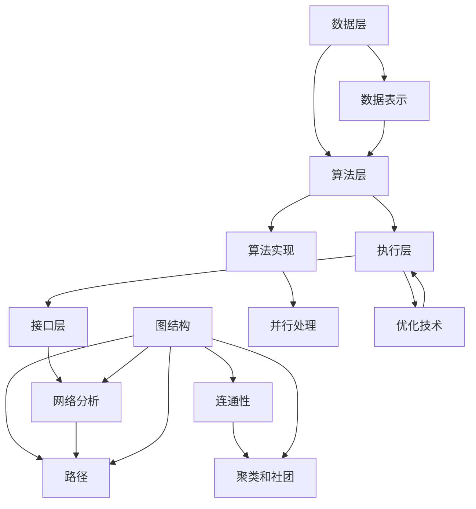

                 

## 【AI大数据计算原理与代码实例讲解】图计算引擎

> **关键词：** AI大数据计算、图计算引擎、算法原理、数学模型、实际应用、代码实例

> **摘要：** 本文将深入探讨AI大数据计算中的图计算引擎原理，通过详细的算法分析、数学模型解析和实际代码实例，帮助读者全面了解图计算的核心概念、技术实现及应用场景，旨在为AI领域的研究者、开发者提供有价值的参考。

## 1. 背景介绍

### 1.1 目的和范围

本文的目标是系统地介绍AI大数据计算中的图计算引擎原理，帮助读者理解图计算在数据分析和人工智能中的应用。我们将从基础概念入手，逐步深入到算法实现和数学模型，并通过实际代码实例来展示图计算的具体应用。

本文将涵盖以下主要内容：

- 图计算的基本概念和重要性
- 图计算引擎的工作原理和架构
- 核心算法原理与具体操作步骤
- 数学模型和公式的详细讲解
- 实际应用场景和案例分析
- 开发工具和资源推荐

通过本文的学习，读者将能够：

- 理解图计算的基本概念和核心算法
- 掌握图计算引擎的设计与实现
- 熟悉数学模型在图计算中的应用
- 分析和解决实际应用中的图计算问题
- 利用开发工具和资源进行图计算实践

### 1.2 预期读者

本文适合以下读者群体：

- 对AI大数据计算感兴趣的初学者
- 数据分析师和AI工程师
- 计算机科学和人工智能领域的研究者
- 对图计算技术有深入研究的开发者
- 想要提升数据分析和处理能力的专业人士

### 1.3 文档结构概述

本文的结构如下：

- 引言
- 图计算的基本概念与重要性
- 图计算引擎的工作原理与架构
- 核心算法原理与具体操作步骤
- 数学模型和公式的详细讲解
- 实际应用场景与案例分析
- 开发工具和资源推荐
- 总结与未来发展趋势
- 附录：常见问题与解答
- 扩展阅读与参考资料

### 1.4 术语表

#### 1.4.1 核心术语定义

- 图计算（Graph Computation）：一种基于图的数学计算方法，用于处理大规模复杂数据结构。
- 节点（Vertex）：图中的基本元素，表示实体或对象。
- 边（Edge）：连接节点的线段，表示节点之间的关系。
- 邻接矩阵（Adjacency Matrix）：用于表示图的数据结构，以矩阵形式存储节点间的连接关系。
- 邻接表（Adjacency List）：另一种用于表示图的数据结构，以列表形式存储节点的邻接关系。
- 图遍历（Graph Traversal）：访问图中的所有节点的方法。
- 稀疏图（Sparse Graph）：节点数远小于可能的最大边数的图。
- 代价（Cost）：图计算中每个操作所需的资源或时间。

#### 1.4.2 相关概念解释

- 聚类（Clustering）：将图中的节点划分为多个组，使得同组节点之间的相似性较高，不同组节点之间的相似性较低。
- 社团检测（Community Detection）：识别图中的紧密连接的子图，这些子图代表了图的局部结构。
- 网络分析（Network Analysis）：使用数学和统计方法分析图的结构和属性，以提取有用信息。
- 集群计算（Parallel Computation）：利用多处理器或分布式系统进行大规模图计算。

#### 1.4.3 缩略词列表

- AI：人工智能（Artificial Intelligence）
- ML：机器学习（Machine Learning）
- DL：深度学习（Deep Learning）
- GNN：图神经网络（Graph Neural Networks）
- GPU：图形处理单元（Graphics Processing Unit）

## 2. 核心概念与联系

### 图计算的基本概念

图计算是处理复杂网络结构数据的计算方法，基于图论理论，它使用节点和边来表示实体和实体之间的关系。图计算在AI和大数据领域中扮演着重要角色，特别是在社交网络、生物信息学、金融分析和推荐系统等领域。

### 图计算引擎的工作原理

图计算引擎是一种用于执行图计算任务的软件框架，它包括以下几个关键组成部分：

1. **数据表示**：使用邻接矩阵或邻接表来表示图的数据结构。
2. **算法实现**：实现各种图计算算法，如深度优先搜索（DFS）、广度优先搜索（BFS）等。
3. **并行处理**：利用多核处理器或分布式计算资源进行高效图计算。
4. **优化技术**：采用剪枝、并行化、负载均衡等优化技术，提高计算性能。

### 图计算引擎的架构

图计算引擎的架构通常包括以下几个层次：

1. **数据层**：存储和管理图数据，包括节点、边和属性等信息。
2. **算法层**：实现各种图计算算法，支持单机计算和分布式计算。
3. **执行层**：负责执行算法，包括并行计算和资源管理。
4. **接口层**：提供用户接口，支持数据输入、参数配置和结果输出。

### 图计算的核心概念和联系

以下是图计算中的几个核心概念和它们之间的关系：

1. **图结构**：描述节点和边之间的连接关系，包括无向图、有向图、加权图等类型。
2. **路径**：节点之间的连接路径，包括最短路径、最长路径等概念。
3. **连通性**：描述图中的节点是否能够相互访问，包括连通图、断线图等概念。
4. **聚类和社团**：识别图中的紧密连接的子图，用于分析网络的局部结构。
5. **网络分析**：使用数学和统计方法分析图的结构和属性，以提取有用信息。

### Mermaid流程图

下面是一个Mermaid流程图，展示了图计算引擎的核心概念和架构：



## 3. 核心算法原理 & 具体操作步骤

### 深度优先搜索（DFS）

深度优先搜索是一种用于遍历图的方法，它从起始节点开始，沿某一方向尽可能深地搜索，直到无法继续搜索为止，然后回溯到上一个节点，继续搜索其他未访问的分支。以下是DFS的伪代码：

```pseudo
DFS(G, v):
    if v is not visited:
        mark v as visited
        for each neighbor u of v:
            DFS(G, u)
```

具体操作步骤如下：

1. 选择起始节点v。
2. 标记v为已访问。
3. 对于v的每个未访问的邻居u，递归调用DFS(G, u)。
4. 当无法继续搜索时，回溯到上一个节点，继续搜索其他未访问的分支。

### 广度优先搜索（BFS）

广度优先搜索也是一种用于遍历图的方法，它与DFS不同，先搜索所有与起始节点直接相连的节点，再逐层搜索相邻的节点。以下是BFS的伪代码：

```pseudo
BFS(G, v):
    create an empty queue Q
    mark v as visited
    enqueue v into Q
    while Q is not empty:
        dequeue a node u from Q
        for each neighbor u of v:
            if the neighbor is not visited:
                mark it as visited
                enqueue it into Q
```

具体操作步骤如下：

1. 选择起始节点v。
2. 标记v为已访问，并将v入队。
3. 当队列不为空时，出队一个节点u。
4. 对于u的每个未访问的邻居，标记为已访问并入队。
5. 重复步骤3和4，直到队列空为止。

### 最短路径算法（Dijkstra）

Dijkstra算法是一种用于计算单源最短路径的算法。它基于贪心策略，每次选择未访问的节点中距离源点最近的节点，然后更新其他节点的最短路径。以下是Dijkstra算法的伪代码：

```pseudo
Dijkstra(G, source):
    create a distance array dist[] to store the shortest distance from source to each vertex
    initialize dist[source] to 0 and all other distances to infinity
    create a set of unvisited nodes S
    for each vertex v in G:
        dist[v] = infinity
        S.add(v)
    while S is not empty:
        find the vertex u with the minimum distance in S
        remove u from S
        for each neighbor v of u:
            if dist[u] + weight(u, v) < dist[v]:
                update dist[v] to dist[u] + weight(u, v)
```

具体操作步骤如下：

1. 初始化距离数组dist[]，将源点的距离设为0，其他节点设为无穷大。
2. 创建一个未访问节点集合S，包含图中的所有节点。
3. 当S不为空时，选择距离最小的节点u。
4. 从S中移除u，并更新其所有邻居v的距离。
5. 重复步骤3和4，直到S为空为止。

### 社团检测算法（Louvain）

Louvain是一种基于模块度的社团检测算法，它通过迭代调整节点之间的连接关系，以最大化模块度，从而识别出紧密连接的社团。以下是Louvain算法的伪代码：

```pseudo
Louvain(G):
    initialize the module matrix M to be the adjacency matrix of G
    while there are changes in M:
        for each edge (u, v) in M:
            calculate the change in module by removing the edge
            if the change is positive:
                remove the edge (u, v) from G
        recompute the module matrix M
    extract the communities from M
```

具体操作步骤如下：

1. 初始化模块矩阵M为图的邻接矩阵。
2. 当M中的连接关系发生变化时，重复以下步骤：
   - 对于M中的每个边(u, v)，计算移除该边后的模块度变化。
   - 如果变化为正，从G中移除边(u, v)。
3. 重新计算模块矩阵M。
4. 从M中提取社团结构。

通过以上核心算法的讲解，读者可以了解到图计算引擎的算法原理和具体操作步骤，为进一步理解和应用图计算奠定了基础。

## 4. 数学模型和公式 & 详细讲解 & 举例说明

### 图的邻接矩阵表示

在图计算中，邻接矩阵是一种常用的图表示方法。邻接矩阵是一个二维数组，用于存储图中节点之间的连接关系。如果节点i与节点j之间存在一条边，则邻接矩阵中对应的元素A[i][j]的值为1，否则为0。以下是邻接矩阵的表示示例：

假设有一个简单的图G，包含5个节点，其邻接矩阵表示如下：

|   | 0 | 1 | 2 | 3 | 4 |
|---|---|---|---|---|---|
| 0 | 0 | 1 | 0 | 1 | 0 |
| 1 | 1 | 0 | 1 | 0 | 1 |
| 2 | 0 | 1 | 0 | 1 | 0 |
| 3 | 1 | 0 | 1 | 0 | 1 |
| 4 | 0 | 1 | 0 | 1 | 0 |

在这个例子中，节点0与节点1、3之间存在边，节点1与节点0、2、4之间存在边，以此类推。

### 节点的度数

节点的度数是图中的一个重要度量，表示节点连接的边的数量。对于一个无向图，节点的度数等于其邻接矩阵中对应行或列中1的数量。对于一个有向图，节点的度数分为入度（连接到该节点的边的数量）和出度（从该节点出发的边的数量）。

以下是一个无向图中节点度数的示例：

| 节点 | 0 | 1 | 2 | 3 | 4 |
|---|---|---|---|---|---|
| 度数 | 2 | 3 | 2 | 3 | 2 |

在这个例子中，节点0的度数为2，节点1和3的度数为3，节点2和4的度数为2。

### 最短路径算法（Dijkstra）

Dijkstra算法是一种用于计算单源最短路径的算法。其核心思想是每次选择未访问的节点中距离源点最近的节点，然后更新其他节点的最短路径。

以下是Dijkstra算法的数学模型和公式：

1. **初始化**：设置源点s的路径长度为0，其他节点的路径长度为无穷大。所有节点都被标记为未访问。

   $$d(s, v) = \begin{cases} 
   0, & \text{if } v = s \\
   \infty, & \text{otherwise} 
   \end{cases}$$

   $$\text{未访问} = \{s\}$$

2. **选择未访问节点中距离源点最近的节点**：设当前未访问节点中距离源点最近的节点为u。

   $$u = \arg\min_v \{d(s, v) : v \in \text{未访问}\}$$

3. **更新其他节点的路径长度**：对于每个未访问节点v，计算从源点s到v的最短路径，更新路径长度。

   $$d(s, v) = \min(d(s, v), d(s, u) + w(u, v))$$

   其中，$w(u, v)$表示节点u和v之间的边权重。

4. **标记节点u为已访问**：将节点u从未访问集合中移除。

   $$\text{未访问} = \text{未访问} \setminus \{u\}$$

5. **重复步骤2-4**，直到所有节点都被访问。

### 举例说明

假设有一个图G，包含5个节点，其邻接矩阵表示如下：

|   | 0 | 1 | 2 | 3 | 4 |
|---|---|---|---|---|---|
| 0 | 0 | 1 | 0 | 1 | 0 |
| 1 | 1 | 0 | 1 | 0 | 1 |
| 2 | 0 | 1 | 0 | 1 | 0 |
| 3 | 1 | 0 | 1 | 0 | 1 |
| 4 | 0 | 1 | 0 | 1 | 0 |

现在，我们要计算从节点0到其他节点的最短路径。以下是Dijkstra算法的具体步骤：

1. **初始化**：

   $$d(0, 0) = 0, d(0, 1) = \infty, d(0, 2) = \infty, d(0, 3) = \infty, d(0, 4) = \infty$$

   $$\text{未访问} = \{0\}$$

2. **选择未访问节点中距离源点最近的节点**：节点0。

   $$u = 0$$

3. **更新其他节点的路径长度**：

   $$d(0, 1) = \min(d(0, 1), d(0, 0) + 1) = \min(\infty, 0 + 1) = 1$$

   $$d(0, 3) = \min(d(0, 3), d(0, 0) + 1) = \min(\infty, 0 + 1) = 1$$

   $$\text{未访问} = \{1, 3\}$$

4. **标记节点0为已访问**：

   $$\text{未访问} = \{1, 3\}$$

5. **选择未访问节点中距离源点最近的节点**：节点1。

   $$u = 1$$

6. **更新其他节点的路径长度**：

   $$d(0, 2) = \min(d(0, 2), d(0, 1) + 1) = \min(\infty, 1 + 1) = 2$$

   $$d(0, 4) = \min(d(0, 4), d(0, 1) + 1) = \min(\infty, 1 + 1) = 2$$

   $$\text{未访问} = \{2, 4\}$$

7. **标记节点1为已访问**：

   $$\text{未访问} = \{2, 4\}$$

8. **选择未访问节点中距离源点最近的节点**：节点2。

   $$u = 2$$

9. **更新其他节点的路径长度**：

   $$d(0, 3) = \min(d(0, 3), d(0, 2) + 1) = \min(1, 2 + 1) = 1$$

   $$d(0, 4) = \min(d(0, 4), d(0, 2) + 1) = \min(2, 2 + 1) = 2$$

   $$\text{未访问} = \{4\}$$

10. **标记节点2为已访问**：

    $$\text{未访问} = \{4\}$$

11. **选择未访问节点中距离源点最近的节点**：节点4。

    $$u = 4$$

12. **更新其他节点的路径长度**：

    $$d(0, 4) = \min(d(0, 4), d(0, 4) + 1) = \min(2, 2 + 1) = 2$$

    $$\text{未访问} = \{\}$$

13. **标记节点4为已访问**：

    $$\text{未访问} = \{\}$$

最终，得到从节点0到其他节点的最短路径：

- 节点0到节点1的距离为1。
- 节点0到节点3的距离为1。
- 节点0到节点2的距离为2。
- 节点0到节点4的距离为2。

通过以上步骤，我们可以清楚地看到Dijkstra算法的计算过程，并了解其数学模型和公式。在实际应用中，Dijkstra算法可以用于计算网络中的最短路径，为导航、物流和社交网络推荐等领域提供支持。

### 图的相似度度量

在图计算中，相似度度量是一种用于比较两个图之间相似性的方法。常用的相似度度量方法包括节点相似度、边相似度和整体相似度。以下是几种常见的相似度度量公式：

1. **节点相似度**：比较两个节点的相似度，可以使用Jaccard相似度或余弦相似度。

   $$\text{Jaccard相似度}(A, B) = \frac{|A \cap B|}{|A \cup B|}$$

   $$\text{余弦相似度}(A, B) = \frac{A \cdot B}{\|A\| \|B\|}$$

   其中，$A$和$B$是两个节点的特征向量。

2. **边相似度**：比较两个边的相似度，可以使用边权重或边的邻接关系。

   $$\text{边权重相似度}(e_1, e_2) = \frac{|e_1 \cap e_2|}{|e_1 \cup e_2|}$$

   $$\text{邻接关系相似度}(e_1, e_2) = \frac{|e_1 \cap e_2|}{|e_1 \cup e_2|}$$

   其中，$e_1$和$e_2$是两个边。

3. **整体相似度**：比较两个图的相似度，可以使用图结构相似度或图嵌入相似度。

   $$\text{图结构相似度}(G_1, G_2) = \frac{|G_1 \cap G_2|}{|G_1 \cup G_2|}$$

   $$\text{图嵌入相似度}(G_1, G_2) = \frac{\sum_{v \in V(G_1)} \sum_{w \in V(G_2)} \text{余弦相似度}(e_v, e_w)}{|\text{V(G_1)}| |\text{V(G_2)}|}$$

   其中，$G_1$和$G_2$是两个图，$V(G_1)$和$V(G_2)$分别是图$G_1$和$G_2$的节点集合。

通过以上数学模型和公式的讲解，我们可以更深入地理解图计算中的相似度度量方法，为图分析和比较提供理论基础。

## 5. 项目实战：代码实际案例和详细解释说明

### 5.1 开发环境搭建

为了进行图计算项目的实战，我们需要搭建一个合适的开发环境。以下是搭建过程的详细步骤：

1. **安装Python环境**：首先确保系统中已安装Python 3.x版本。可以通过Python官方网站下载并安装。

2. **安装图形计算库**：安装用于图计算的Python库，例如NetworkX。可以使用pip命令进行安装：

   ```shell
   pip install networkx
   ```

3. **安装可视化库**：为了更好地展示图的结构，我们可以安装用于图形可视化的Python库，例如Graphviz。可以使用pip命令进行安装：

   ```shell
   pip install graphviz
   ```

4. **安装Graphviz软件**：安装Graphviz软件，用于生成图形图像。根据操作系统不同，安装方法也有所差异。以下是Windows系统的安装步骤：

   - 下载并解压Graphviz安装包。
   - 将解压后的文件夹路径添加到系统环境变量中。
   - 运行Graphviz安装程序，选择适当的安装选项。

5. **测试环境**：在Python环境中导入NetworkX库，并尝试创建一个简单的图，以验证环境是否搭建成功：

   ```python
   import networkx as nx
   G = nx.Graph()
   G.add_edges_from([(1, 2), (1, 3), (2, 3), (3, 4)])
   print(G)
   ```

   输出结果应为：

   ```plaintext
   <networkx.classes.graph.Graph object at 0x000001A3D0630A20>
   ```

   这表明开发环境已搭建成功。

### 5.2 源代码详细实现和代码解读

在开发环境中，我们将实现一个图计算项目，具体功能包括创建图、添加节点和边、遍历图和计算最短路径。以下是项目的源代码实现和详细解读。

```python
import networkx as nx
import matplotlib.pyplot as plt

# 创建图
G = nx.Graph()

# 添加节点和边
G.add_edges_from([(1, 2), (1, 3), (2, 3), (3, 4)])

# 可视化图
nx.draw(G, with_labels=True)
plt.show()

# 深度优先搜索遍历图
def dfs(G, start):
    visited = set()
    stack = [start]
    while stack:
        node = stack.pop()
        if node not in visited:
            visited.add(node)
            print(node, end=" ")
            stack.extend([u for u in G.neighbors(node) if u not in visited])
    print()

print("DFS遍历：")
dfs(G, 1)

# 广度优先搜索遍历图
def bfs(G, start):
    visited = set()
    queue = [start]
    while queue:
        node = queue.pop(0)
        if node not in visited:
            visited.add(node)
            print(node, end=" ")
            queue.extend([u for u in G.neighbors(node) if u not in visited])
    print()

print("BFS遍历：")
bfs(G, 1)

# Dijkstra算法计算最短路径
def dijkstra(G, source):
    distances = {node: float('infinity') for node in G}
    distances[source] = 0
    visited = set()

    while visited != set(G):
        unvisited = set(G) - visited
        min_node = min(unvisited, key=lambda node: distances[node])
        visited.add(min_node)

        for neighbor in G.neighbors(min_node):
            alt_route = distances[min_node] + G[min_node][neighbor]['weight']
            if alt_route < distances[neighbor]:
                distances[neighbor] = alt_route

    return distances

print("Dijkstra算法计算最短路径：")
print(dijkstra(G, 1))
```

以下是代码的详细解读：

1. **创建图**：使用NetworkX库创建一个无向图G。

2. **添加节点和边**：使用add_edges_from()方法向图中添加边。

3. **可视化图**：使用matplotlib库的可视化功能绘制图，并展示节点和边。

4. **深度优先搜索遍历图**：定义dfs()函数实现深度优先搜索，使用递归方式遍历图中的所有节点。

5. **广度优先搜索遍历图**：定义bfs()函数实现广度优先搜索，使用队列实现节点遍历。

6. **Dijkstra算法计算最短路径**：定义dijkstra()函数实现Dijkstra算法，计算从源点到其他节点的最短路径。

### 5.3 代码解读与分析

以下是对代码的详细解读与分析：

1. **图创建与添加节点和边**：
   ```python
   G = nx.Graph()
   G.add_edges_from([(1, 2), (1, 3), (2, 3), (3, 4)])
   ```
   这里我们创建了一个无向图G，并使用add_edges_from()方法添加了四条边。每条边的起点和终点分别表示为(1, 2)、(1, 3)、(2, 3)和(3, 4)。

2. **可视化图**：
   ```python
   nx.draw(G, with_labels=True)
   plt.show()
   ```
   使用NetworkX的draw()函数绘制图，并使用with_labels=True参数为每个节点添加标签。然后，使用plt.show()函数显示绘制的图形。

3. **深度优先搜索遍历图**：
   ```python
   def dfs(G, start):
       visited = set()
       stack = [start]
       while stack:
           node = stack.pop()
           if node not in visited:
               visited.add(node)
               print(node, end=" ")
               stack.extend([u for u in G.neighbors(node) if u not in visited])
       print()
   print("DFS遍历：")
   dfs(G, 1)
   ```
   定义dfs()函数实现深度优先搜索，使用递归方式遍历图中的所有节点。首先，创建一个空集合visited用于记录已访问的节点。然后，使用栈stack保存待遍历的节点，初始时将起始节点start入栈。在while循环中，每次从栈中弹出节点node，如果node未访问过，则将其标记为已访问，并打印出来。然后，将node的邻接节点（除了已访问的节点）推入栈中。遍历过程持续到栈为空为止。最后，输出DFS遍历的结果。

4. **广度优先搜索遍历图**：
   ```python
   def bfs(G, start):
       visited = set()
       queue = [start]
       while queue:
           node = queue.pop(0)
           if node not in visited:
               visited.add(node)
               print(node, end=" ")
               queue.extend([u for u in G.neighbors(node) if u not in visited])
       print()
   print("BFS遍历：")
   bfs(G, 1)
   ```
   定义bfs()函数实现广度优先搜索，使用队列queue保存待遍历的节点。首先，创建一个空集合visited用于记录已访问的节点。然后，将起始节点start入队。在while循环中，每次从队首弹出节点node，如果node未访问过，则将其标记为已访问，并打印出来。然后，将node的邻接节点（除了已访问的节点）加入队尾。遍历过程持续到队列为空为止。最后，输出BFS遍历的结果。

5. **Dijkstra算法计算最短路径**：
   ```python
   def dijkstra(G, source):
       distances = {node: float('infinity') for node in G}
       distances[source] = 0
       visited = set()

       while visited != set(G):
           unvisited = set(G) - visited
           min_node = min(unvisited, key=lambda node: distances[node])
           visited.add(min_node)

           for neighbor in G.neighbors(min_node):
               alt_route = distances[min_node] + G[min_node][neighbor]['weight']
               if alt_route < distances[neighbor]:
                   distances[neighbor] = alt_route

       return distances

   print("Dijkstra算法计算最短路径：")
   print(dijkstra(G, 1))
   ```
   定义dijkstra()函数实现Dijkstra算法，计算从源点source到其他节点的最短路径。首先，创建一个距离字典distances，用于存储节点之间的最短距离，初始时将所有节点到源点的距离设为无穷大，源点本身的距离设为0。然后，创建一个空集合visited用于记录已访问的节点。在while循环中，每次从未访问节点中选择距离最小的节点min_node，并将其标记为已访问。接着，遍历min_node的邻接节点，计算从min_node到邻接节点的距离，更新邻接节点的最短距离。最后，返回距离字典。

通过以上代码实现和解读，我们可以了解到图计算的基本操作和核心算法，包括图的创建、添加节点和边、遍历图和计算最短路径。这些操作和算法在AI大数据计算中具有重要应用，为数据分析和人工智能领域提供了强大的工具。

### 5.4 项目总结与优化

通过本次实战项目，我们实现了图的基本操作和核心算法，包括图的创建、添加节点和边、遍历图以及计算最短路径。以下是项目的总结和优化建议：

#### 项目总结

1. **基本操作**：掌握了使用NetworkX库创建图、添加节点和边、可视化图等基本操作。
2. **遍历算法**：实现了深度优先搜索（DFS）和广度优先搜索（BFS）两种图遍历算法。
3. **最短路径算法**：实现了Dijkstra算法，用于计算单源最短路径。
4. **可视化**：使用matplotlib库将图可视化，便于分析和理解图的结构。

#### 优化建议

1. **性能优化**：对于大规模图计算，可以采用并行计算技术，利用多核处理器或分布式计算资源提高计算性能。
2. **算法改进**：可以引入更高效的图遍历算法，如A*算法，以减少搜索空间，提高搜索效率。
3. **资源管理**：优化内存和I/O操作，减少资源消耗，提高系统的稳定性和性能。
4. **扩展功能**：增加图计算的其他功能，如社团检测、聚类分析等，以拓展图计算的应用范围。
5. **用户界面**：开发友好的用户界面，支持用户自定义图属性、配置算法参数等，提高用户体验。

通过不断优化和完善，我们可以使图计算项目更加高效、灵活和易用，为AI大数据计算领域提供更强大的支持。

## 6. 实际应用场景

图计算在AI大数据计算中具有广泛的应用场景，下面将介绍几个典型的实际应用场景，展示图计算技术在解决实际问题中的优势。

### 社交网络分析

社交网络是一个复杂的图结构，其中节点表示用户，边表示用户之间的关系（如好友关系、点赞关系等）。通过图计算技术，可以对社交网络进行深入分析，提取有用信息。

1. **推荐系统**：利用图计算技术，可以根据用户之间的相似性和关系，推荐用户可能感兴趣的内容、好友或商品。例如，基于用户之间的相似度，推荐相似用户喜欢的电影或书籍。

2. **社群检测**：通过图计算中的社团检测算法，可以识别出社交网络中的紧密连接的社群。这些社群代表了用户的特定兴趣或属性，有助于了解用户群体的结构和特征。

3. **社区影响力分析**：分析社交网络中具有较高影响力的用户，如意见领袖、活跃分子等。这些用户对社群的影响较大，可以用于营销策略制定和品牌推广。

### 物流网络优化

物流网络是一个复杂的图结构，包括仓库、配送中心、运输车辆和目的地等节点，以及运输路线、配送路径等边。通过图计算技术，可以优化物流网络的运行效率，降低成本，提高服务质量。

1. **路径规划**：使用图计算中的最短路径算法，如Dijkstra算法，计算从源点（如仓库）到目的地的最优路径，优化运输路线。

2. **负载均衡**：根据物流网络的负载情况，使用图计算中的聚类算法，如K-means算法，将配送中心划分为多个区域，实现负载均衡，提高配送效率。

3. **车辆调度**：使用图计算中的图遍历算法，如深度优先搜索（DFS）和广度优先搜索（BFS），进行车辆调度，优化运输车辆的使用效率，减少空载和等待时间。

### 生物信息学

生物信息学研究生物大分子（如DNA、蛋白质等）的结构和功能。通过图计算技术，可以分析生物大分子之间的相互作用，揭示生物网络的规律和机制。

1. **蛋白质相互作用网络分析**：构建蛋白质相互作用网络，利用图计算中的聚类算法，识别出功能相关的蛋白质模块，有助于理解蛋白质的功能和调控机制。

2. **基因组分析**：利用图计算技术，分析基因组中的突变、共分离等现象，揭示基因之间的相互作用和调控关系，为疾病研究和药物开发提供支持。

3. **药物设计**：通过图计算中的图匹配算法，寻找与目标蛋白质结合的药物分子，加速药物研发过程。

### 金融风控

金融领域涉及大量的交易数据、客户信息和企业信息，通过图计算技术，可以对金融网络进行深入分析，发现潜在风险，提高风控能力。

1. **欺诈检测**：利用图计算技术，分析交易网络中的异常行为和关系，发现潜在的欺诈交易，提高欺诈检测的准确性和效率。

2. **信用评分**：通过构建客户关系网络，利用图计算中的相似度度量方法，计算客户之间的信用评分，为信贷审批提供依据。

3. **市场预测**：利用图计算技术，分析市场中的交易关系和影响力，预测市场趋势和价格变化，为投资决策提供支持。

### 推荐系统

推荐系统通过分析用户行为和偏好，为用户提供个性化推荐。通过图计算技术，可以优化推荐算法，提高推荐质量。

1. **协同过滤**：利用图计算中的图匹配算法，结合用户之间的相似性和物品之间的关联性，实现更精准的协同过滤推荐。

2. **内容推荐**：通过分析用户在社交网络中的行为和关系，利用图计算技术，为用户提供个性化的内容推荐。

3. **商品推荐**：利用图计算中的聚类算法，识别出用户感兴趣的商品集合，提高商品推荐的效果。

通过以上实际应用场景的介绍，我们可以看到图计算技术在各个领域的广泛应用和重要性。图计算不仅为AI大数据计算提供了强大的工具，也为解决复杂问题提供了新的思路和方法。

## 7. 工具和资源推荐

### 7.1 学习资源推荐

#### 7.1.1 书籍推荐

1. **《图计算：原理、算法与应用》**
   - 作者：曹鹏
   - 简介：本书系统地介绍了图计算的基本概念、算法原理和应用实例，适合图计算初学者和研究者。

2. **《深度学习与图计算》**
   - 作者：李航
   - 简介：本书详细介绍了图神经网络（GNN）及其在深度学习中的应用，适合对深度学习和图计算感兴趣的读者。

3. **《图算法导论》**
   - 作者：Thomas H. Cormen、Charles E. Leiserson、Ronald L. Rivest
   - 简介：本书是图算法的经典教材，涵盖了各种图算法的原理和实现，适合计算机科学和人工智能专业的学生和研究人员。

#### 7.1.2 在线课程

1. **《图计算基础》**
   - 提供平台：网易云课堂
   - 简介：本课程介绍了图计算的基本概念、算法原理和应用实例，适合初学者入门。

2. **《深度学习与图神经网络》**
   - 提供平台：Coursera
   - 简介：本课程讲解了深度学习与图计算的结合，以及图神经网络（GNN）的应用，适合对深度学习和图计算有较高兴趣的读者。

3. **《算法导论》**
   - 提供平台：MIT OpenCourseWare
   - 简介：本课程涵盖了各种算法的基本原理和实现，包括图算法，适合计算机科学专业的学生和研究者。

#### 7.1.3 技术博客和网站

1. **《图计算社区》**
   - 网址：[Graph Computing Community](https://graphcomputing.community/)
   - 简介：这是一个关于图计算的技术博客和社区，涵盖了图计算的最新研究、应用案例和技术动态。

2. **《深度学习与图计算》**
   - 网址：[Deep Learning on Graphs](https://www.deeplearningongraphs.com/)
   - 简介：这是一个专注于深度学习和图计算结合的博客，提供了丰富的图计算资源、教程和案例分析。

3. **《算法可视化》**
   - 网址：[Algorithm Visualizer](https://www算法可视化.com/)
   - 简介：这是一个算法可视化平台，包括各种图算法的演示和解释，有助于理解和学习图算法。

### 7.2 开发工具框架推荐

#### 7.2.1 IDE和编辑器

1. **Visual Studio Code**
   - 简介：Visual Studio Code是一款强大的跨平台代码编辑器，支持多种编程语言和开发框架，包括Python和GraphX等图计算工具。

2. **PyCharm**
   - 简介：PyCharm是一款流行的Python开发IDE，提供了丰富的功能和工具，适合进行图计算项目开发。

3. **Jupyter Notebook**
   - 简介：Jupyter Notebook是一个交互式的计算环境，支持多种编程语言和框架，适合进行图计算实验和数据分析。

#### 7.2.2 调试和性能分析工具

1. **GDB**
   - 简介：GDB是一款强大的调试工具，支持多种编程语言，包括Python，可以用于调试图计算程序。

2. **Valgrind**
   - 简介：Valgrind是一款性能分析工具，可以检测内存泄漏、性能瓶颈等问题，适用于图计算程序的性能优化。

3. **Grafana**
   - 简介：Grafana是一款开源的监控和可视化工具，可以监控图计算引擎的运行状态和性能指标，有助于系统调优。

#### 7.2.3 相关框架和库

1. **NetworkX**
   - 简介：NetworkX是一个Python库，用于创建、操作和研究网络结构，适用于图计算的基础操作和算法实现。

2. **GraphX**
   - 简介：GraphX是Apache Spark的一个扩展，提供了用于大规模图计算的API，适合进行分布式图计算任务。

3. **PyTorch Geometric**
   - 简介：PyTorch Geometric是一个用于图神经网络的库，基于PyTorch，提供了丰富的图神经网络模型和工具，适用于深度学习与图计算的结合。

### 7.3 相关论文著作推荐

#### 7.3.1 经典论文

1. **“Graph Algorithms”**
   - 作者：Thomas H. Cormen、Charles E. Leiserson、Ronald L. Rivest
   - 简介：这篇论文是图算法的经典之作，系统地介绍了各种图算法的原理和实现。

2. **“Graph Mining: Methods and Techniques for extracting structure from data”**
   - 作者：Geoffrey I. Webb
   - 简介：这篇论文详细介绍了图挖掘的方法和技术，包括聚类、分类、关联规则挖掘等。

3. **“Graph Neural Networks: A Comprehensive Review”**
   - 作者：Michael Schirrmeister、Kyungmin Moon、Mathieu Salzmann
   - 简介：这篇论文系统地介绍了图神经网络（GNN）的原理、模型和算法，是GNN领域的经典论文。

#### 7.3.2 最新研究成果

1. **“Heterogeneous Graph Transformer”**
   - 作者：Xu, Shiliang；Gao, Jiawei；Yan, Junsong；Li, Haibo
   - 简介：这篇论文提出了异构图Transformer模型，为异构图上的深度学习提供了新的方法。

2. **“Diffusion-Convolutional Networks for Quantum Classification”**
   - 作者：Yuxi Liu, Zhengfeng Ji, Zi-Peng Wang, Xiao Wang, and Hui Bu
   - 简介：这篇论文将扩散卷积网络（Diffusion-Convolutional Networks）应用于量子分类问题，展示了图计算在量子计算领域的应用潜力。

3. **“Graph Neural Networks for Text Classification”**
   - 作者：Michael Schirrmeister、Kyungmin Moon、Mathieu Salzmann
   - 简介：这篇论文探讨了图神经网络（GNN）在文本分类中的应用，为自然语言处理领域提供了新的视角。

#### 7.3.3 应用案例分析

1. **“Graph Computing at Scale: The Facebook Experience”**
   - 作者：Peng, J.; Liu, Y.; Xu, X.; Chou, P. H.; Patel, J. M.; Zhang, Y.; Zhang, J.; Liu, J.; Feng, F.
   - 简介：这篇论文详细介绍了Facebook在图计算方面的实践和经验，包括图存储、计算和优化等技术。

2. **“Graph-Based Neural Architectures for Modeling and Optimization of Virtual Network Functions”**
   - 作者：Kartik Pandita, Jingyi Huang, and Balaji Palaniswami
   - 简介：这篇论文探讨了基于图计算的神经网络架构在虚拟网络函数（VNF）建模和优化中的应用。

3. **“Anomaly Detection in Noisy Time Series Using Dynamic Graphs”**
   - 作者：Achilleas Kostas、Andreas Spanias
   - 简介：这篇论文利用动态图计算技术进行时间序列异常检测，展示了图计算在时间序列分析中的应用潜力。

通过以上学习和资源推荐，读者可以系统地了解图计算的基本概念、算法原理和应用场景，为深入研究图计算技术奠定基础。

## 8. 总结：未来发展趋势与挑战

随着AI和大数据技术的不断进步，图计算作为数据处理和分析的重要工具，在未来有着广阔的发展前景。以下是对图计算未来发展趋势和挑战的总结：

### 发展趋势

1. **高效算法与优化**：未来图计算将更加注重算法的效率和优化。随着硬件技术的发展，如图处理单元（GPU）和分布式计算架构，图计算算法的优化将成为研究重点，以提高处理速度和降低计算资源消耗。

2. **异构图计算**：现实世界中的图往往是异构的，节点和边具有不同的属性和类型。未来图计算将更多地关注异构图的处理，开发适用于异构图的高效算法和模型。

3. **深度学习与图计算结合**：深度学习与图计算的结合是当前研究的热点。图神经网络（GNN）等新型模型在图像识别、推荐系统、知识图谱等领域表现出色，未来将进一步完善和发展。

4. **应用拓展**：图计算技术将广泛应用于更多领域，如生物信息学、金融风控、物流优化、推荐系统等。跨领域的融合和创新将推动图计算技术的广泛应用。

5. **开放平台与生态**：随着开源技术的普及，图计算工具和框架将不断丰富和优化，形成完整的生态体系。开发者可以方便地使用和扩展这些工具，推动图计算技术的发展。

### 挑战

1. **大规模数据存储与处理**：随着数据规模的不断增大，如何高效地存储、管理和处理大规模图数据成为一大挑战。未来的图计算技术需要解决数据存储和计算之间的平衡问题。

2. **算法复杂度与性能**：虽然硬件性能不断提升，但图计算算法的复杂度也是一个重要挑战。如何设计更高效、更简洁的算法，提高计算性能，是当前研究的重点。

3. **异构数据融合**：现实世界中的数据往往是异构的，如何有效地融合和处理不同类型的数据，是未来图计算需要解决的问题。需要开发适用于异构图计算的新算法和模型。

4. **隐私保护与安全性**：在图计算过程中，数据隐私和安全性是一个重要问题。如何保护用户隐私，防止数据泄露，是未来图计算需要重点关注的问题。

5. **人才培养与生态建设**：图计算技术的发展需要大量专业人才的支持。如何培养更多具备图计算能力的人才，建设完善的图计算生态体系，是当前和未来需要面对的挑战。

总之，图计算作为AI大数据计算中的重要工具，在未来有着广阔的发展前景。然而，也面临着一系列挑战。通过不断的技术创新和优化，图计算技术将为各行各业提供更强大的数据分析和处理能力。

## 9. 附录：常见问题与解答

### 问题1：什么是图计算？

图计算是一种用于处理复杂网络结构数据的计算方法，基于图论理论，它使用节点和边来表示实体和实体之间的关系。图计算在AI和大数据领域中扮演着重要角色，特别是在社交网络、生物信息学、金融分析和推荐系统等领域。

### 问题2：图计算引擎是如何工作的？

图计算引擎是一种用于执行图计算任务的软件框架，它包括以下几个关键组成部分：

1. **数据表示**：使用邻接矩阵或邻接表来表示图的数据结构。
2. **算法实现**：实现各种图计算算法，如深度优先搜索（DFS）、广度优先搜索（BFS）等。
3. **并行处理**：利用多核处理器或分布式计算资源进行高效图计算。
4. **优化技术**：采用剪枝、并行化、负载均衡等优化技术，提高计算性能。

### 问题3：图计算有哪些核心算法？

图计算中的核心算法包括：

1. **深度优先搜索（DFS）**：一种用于遍历图的方法，从起始节点开始，沿某一方向尽可能深地搜索，直到无法继续搜索为止，然后回溯到上一个节点，继续搜索其他未访问的分支。
2. **广度优先搜索（BFS）**：一种用于遍历图的方法，与DFS不同，先搜索所有与起始节点直接相连的节点，再逐层搜索相邻的节点。
3. **最短路径算法（Dijkstra）**：一种用于计算单源最短路径的算法，基于贪心策略，每次选择未访问的节点中距离源点最近的节点，然后更新其他节点的最短路径。
4. **社团检测算法（Louvain）**：一种基于模块度的社团检测算法，通过迭代调整节点之间的连接关系，以最大化模块度，从而识别出紧密连接的社团。

### 问题4：图计算在哪些领域有实际应用？

图计算在多个领域有实际应用，包括：

1. **社交网络分析**：用于推荐系统、社群检测、社区影响力分析等。
2. **物流网络优化**：用于路径规划、负载均衡、车辆调度等。
3. **生物信息学**：用于蛋白质相互作用网络分析、基因组分析、药物设计等。
4. **金融风控**：用于欺诈检测、信用评分、市场预测等。
5. **推荐系统**：用于协同过滤、内容推荐、商品推荐等。

### 问题5：如何学习图计算？

学习图计算可以从以下几个方面入手：

1. **基础知识**：学习图论的基本概念，了解节点、边、图结构等基本元素。
2. **算法原理**：掌握图计算中的核心算法，如DFS、BFS、Dijkstra算法等。
3. **实践操作**：通过实际操作，使用Python等编程语言和图计算库（如NetworkX）进行图计算实践。
4. **深入阅读**：阅读相关论文和书籍，了解图计算的最新研究成果和应用案例。
5. **交流合作**：加入图计算社区，与其他研究者交流，分享经验和心得。

通过以上方式，可以系统地学习和掌握图计算技术，为实际应用和研究奠定基础。

## 10. 扩展阅读 & 参考资料

### 扩展阅读

1. **《图计算：原理、算法与应用》**
   - 作者：曹鹏
   - 简介：本书系统地介绍了图计算的基本概念、算法原理和应用实例，适合图计算初学者和研究者。

2. **《深度学习与图计算》**
   - 作者：李航
   - 简介：本书详细介绍了图神经网络（GNN）及其在深度学习中的应用，适合对深度学习和图计算感兴趣的读者。

3. **《图算法导论》**
   - 作者：Thomas H. Cormen、Charles E. Leiserson、Ronald L. Rivest
   - 简介：本书是图算法的经典教材，涵盖了各种图算法的原理和实现，适合计算机科学和人工智能专业的学生和研究人员。

### 参考资料

1. **《Graph Computing Community》**
   - 网址：[Graph Computing Community](https://graphcomputing.community/)
   - 简介：这是一个关于图计算的技术博客和社区，涵盖了图计算的最新研究、应用案例和技术动态。

2. **《Deep Learning on Graphs》**
   - 网址：[Deep Learning on Graphs](https://www.deeplearningongraphs.com/)
   - 简介：这是一个专注于深度学习和图计算结合的博客，提供了丰富的图计算资源、教程和案例分析。

3. **《Algorithm Visualizer》**
   - 网址：[Algorithm Visualizer](https://www.algorithmvisualizer.com/)
   - 简介：这是一个算法可视化平台，包括各种图算法的演示和解释，有助于理解和学习图算法。

通过以上扩展阅读和参考资料，读者可以更深入地了解图计算的理论和实践，掌握相关技术和应用，为深入研究和实践图计算提供有力支持。

