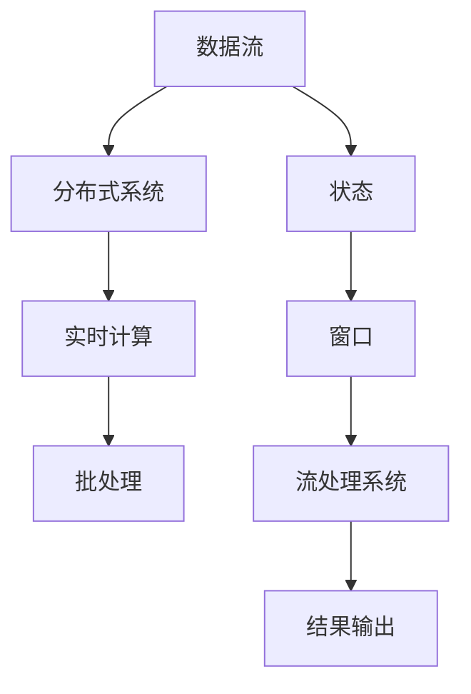

                 

# 【AI大数据计算原理与代码实例讲解】流处理

> **关键词**：流处理、大数据、计算原理、代码实例、实时处理、分布式系统

> **摘要**：本文深入探讨了AI大数据中的流处理原理及其在实时计算中的应用。通过详细讲解核心算法、数学模型，以及代码实例，本文旨在帮助读者理解流处理技术的核心概念，掌握其实际应用方法，为大数据领域的深入研究和开发提供实用指南。

## 1. 背景介绍

### 1.1 目的和范围

本文的目标是向读者介绍流处理在大数据领域的核心原理和应用。流处理是一种处理实时数据流的技术，其重要性在于它能够快速、高效地分析大量数据，从而在短时间内生成有意义的结果。本文将涵盖以下内容：

- 流处理的基本概念和核心原理
- 分布式系统中流处理的架构设计
- 关键算法和数学模型的解释
- 代码实例分析及其实现过程
- 实际应用场景及未来发展趋势

通过本文的学习，读者将能够：

- 理解流处理的基本概念和工作原理
- 掌握流处理在分布式系统中的应用
- 分析并实现简单的流处理任务
- 了解流处理技术的实际应用场景和未来趋势

### 1.2 预期读者

本文适用于以下读者：

- 数据科学家和机器学习工程师，希望了解流处理在数据处理中的应用
- 系统架构师和开发人员，需要设计并实现基于流处理的分布式系统
- 对大数据和实时计算感兴趣的学生和研究人员，希望深入了解流处理的技术原理
- 大数据解决方案提供商，需要掌握流处理技术的实际应用场景

### 1.3 文档结构概述

本文的结构如下：

- **第1章**：背景介绍
  - 1.1 目的和范围
  - 1.2 预期读者
  - 1.3 文档结构概述
  - 1.4 术语表

- **第2章**：核心概念与联系
  - 2.1 核心概念介绍
  - 2.2 流处理架构的 Mermaid 流程图

- **第3章**：核心算法原理 & 具体操作步骤
  - 3.1 算法原理讲解
  - 3.2 伪代码实现

- **第4章**：数学模型和公式 & 详细讲解 & 举例说明
  - 4.1 数学模型介绍
  - 4.2 公式讲解与示例

- **第5章**：项目实战：代码实际案例和详细解释说明
  - 5.1 开发环境搭建
  - 5.2 源代码详细实现和代码解读
  - 5.3 代码解读与分析

- **第6章**：实际应用场景
  - 6.1 应用场景分析
  - 6.2 案例研究

- **第7章**：工具和资源推荐
  - 7.1 学习资源推荐
  - 7.2 开发工具框架推荐
  - 7.3 相关论文著作推荐

- **第8章**：总结：未来发展趋势与挑战
  - 8.1 发展趋势
  - 8.2 挑战与机遇

- **第9章**：附录：常见问题与解答

- **第10章**：扩展阅读 & 参考资料

### 1.4 术语表

#### 1.4.1 核心术语定义

- **流处理**：一种实时处理数据流的方法，能够连续地处理输入的数据流，并在数据到达时立即进行计算。
- **分布式系统**：由多个独立节点组成的系统，这些节点通过网络进行通信，协同完成任务。
- **批处理**：一种数据处理方式，将大量数据分成批次进行处理，而不是实时处理单个数据流。
- **实时计算**：在数据到达时立即进行处理，通常用于需要快速响应的场景。
- **微批处理**：一种介于批处理和流处理之间的数据处理方式，每次处理一小部分数据。

#### 1.4.2 相关概念解释

- **数据流**：以特定顺序到达的数据序列。
- **状态**：流处理系统在处理数据流过程中维护的一些信息，用于跟踪处理状态。
- **窗口**：一组数据元素的时间区间，用于计算特定时间段内的统计信息。

#### 1.4.3 缩略词列表

- **Flink**：Apache Flink，一个开源的分布式流处理框架。
- **Spark Streaming**：Apache Spark的一个扩展，用于流处理。
- **Kafka**：Apache Kafka，一个分布式消息队列系统，用于数据流处理。
- **Apache Storm**：Apache Storm，一个分布式实时计算系统。

## 2. 核心概念与联系

在深入探讨流处理的原理和实现之前，我们需要了解一些核心概念和它们之间的联系。以下是流处理中一些关键概念及其相互关系的简要介绍，并附上一个Mermaid流程图，用于更直观地展示这些概念。

### 2.1 核心概念介绍

- **数据流（Data Stream）**：数据流是由一系列数据元素组成的序列，这些数据元素按照一定的顺序到达。流处理系统负责处理这些数据流，以生成实时或近实时的结果。
- **分布式系统（Distributed System）**：分布式系统是由多个独立节点组成的系统，这些节点通过网络进行通信，协同完成任务。流处理通常在分布式系统中实现，以充分利用多节点的计算能力。
- **实时计算（Real-time Computing）**：实时计算是指系统能够在数据到达时立即进行处理，并在短时间内生成结果。实时计算对于需要快速响应的应用场景至关重要。
- **批处理（Batch Processing）**：批处理是一种数据处理方式，将大量数据分成批次进行处理，而不是实时处理单个数据流。批处理通常用于处理历史数据，以便进行离线分析和报告生成。

### 2.2 流处理架构的 Mermaid 流程图

下面是一个简单的Mermaid流程图，用于展示流处理的核心概念和它们之间的联系：



在这个流程图中：

- **A（数据流）**：表示输入的数据流，由一系列数据元素组成。
- **B（分布式系统）**：表示流处理系统在分布式系统中实现，以利用多节点的计算能力。
- **C（实时计算）**：表示流处理系统能够实时处理数据流，并在数据到达时生成结果。
- **D（批处理）**：表示批处理是一种将大量数据分成批次进行处理的方法。
- **E（状态）**：表示流处理系统在处理数据流过程中维护的一些信息。
- **F（窗口）**：表示窗口是用于计算特定时间段内数据统计信息的集合。
- **G（流处理系统）**：表示流处理系统用于处理数据流，并生成结果。
- **H（结果输出）**：表示流处理系统的输出结果，可以是实时或近实时的结果。

通过这个流程图，我们可以直观地了解流处理的基本概念和架构。接下来，我们将进一步深入探讨流处理的核心算法原理和具体操作步骤。

## 3. 核心算法原理 & 具体操作步骤

在理解了流处理的基本概念和架构后，我们接下来将深入探讨流处理的核心算法原理及其具体操作步骤。为了更好地说明，我们将使用伪代码来详细阐述这些算法的实现过程。

### 3.1 算法原理讲解

流处理的核心算法主要包括以下几个方面：

1. **数据流的采集和传输**：流处理系统需要从各种数据源采集数据，并传输到处理节点。这通常通过消息队列或其他分布式数据传输系统来实现。
2. **分布式计算**：流处理系统在多个节点上并行处理数据流，以充分利用分布式系统的计算能力。
3. **状态维护和更新**：流处理系统需要维护一些关键状态信息，例如窗口状态、计数器等，以便在数据流发生变化时进行更新。
4. **结果输出**：流处理系统将处理结果输出到指定的存储或分析系统中，以便进一步分析和处理。

下面是这些核心算法的伪代码实现：

```python
# 数据流采集和传输
def collect_data(source):
    data_stream = []
    while True:
        data = source.get_data()
        if data is None:
            break
        data_stream.append(data)
    return data_stream

# 分布式计算
def distributed_compute(data_stream, num_workers):
    results = []
    for i in range(num_workers):
        worker_result = process_data(data_stream[i::num_workers])
        results.append(worker_result)
    return results

# 状态维护和更新
def maintain_state(state, data):
    # 根据数据更新状态
    state.update(data)

# 结果输出
def output_result(results, destination):
    for result in results:
        destination.save(result)
```

### 3.2 伪代码实现

下面是流处理的核心算法的伪代码实现，通过这些伪代码，我们可以更好地理解流处理的操作步骤。

```python
# 流处理伪代码
class StreamProcessor:
    def __init__(self, source, destination):
        self.source = source
        self.destination = destination
        self.state = State()

    def process_stream(self):
        data_stream = collect_data(self.source)
        results = distributed_compute(data_stream, num_workers=4)
        output_result(results, self.destination)

    def maintain_state(self, data):
        self.state.update(data)

# 状态类
class State:
    def __init__(self):
        self.count = 0
        self.total = 0

    def update(self, data):
        self.count += 1
        self.total += data

# 处理数据
def process_data(data):
    # 数据处理逻辑
    processed_data = data * 2
    return processed_data
```

通过这个伪代码实现，我们可以看到流处理的核心算法是如何工作的。流处理器从数据源采集数据，然后通过分布式计算将数据流分成多个部分，在各个节点上进行处理。在处理过程中，系统会维护一些关键状态信息，以便在数据流发生变化时进行更新。最后，处理结果会输出到指定的存储或分析系统中。

接下来，我们将进一步探讨流处理中的数学模型和公式，以及如何在实际应用中详细讲解和举例说明。

## 4. 数学模型和公式 & 详细讲解 & 举例说明

流处理技术涉及到许多数学模型和公式，这些模型和公式用于描述数据流的行为、状态的变化以及处理结果的计算。在本节中，我们将详细介绍这些数学模型和公式，并通过具体的例子来说明它们的实际应用。

### 4.1 数学模型介绍

流处理中的核心数学模型主要包括以下几种：

1. **滑动窗口（Sliding Window）**：滑动窗口是一种用于计算连续时间段内数据统计信息的模型。它定义了一个固定大小的窗口，窗口中的数据元素按照时间顺序排列，并随着新数据元素的到来而滑动。
2. **计数器（Counter）**：计数器是一种用于统计数据流中特定事件发生的次数的模型。它通过累加或累减的方式来更新计数器的值。
3. **时间序列（Time Series）**：时间序列是一种用于描述数据随时间变化的模型。它通常通过时间戳来标记每个数据点，并使用统计学方法来分析数据的变化趋势。
4. **概率模型（Probability Model）**：概率模型用于描述数据流中随机事件的发生概率。它通过概率分布函数来计算事件的发生概率。

### 4.2 公式讲解与示例

下面我们将通过具体的数学公式和示例来详细讲解这些数学模型。

#### 4.2.1 滑动窗口

滑动窗口的数学模型可以通过以下公式来描述：

\[ W_t = \sum_{i=t-W}^{t} x_i \]

其中：
- \( W_t \) 表示在时间 \( t \) 的滑动窗口中的数据总和。
- \( x_i \) 表示时间 \( t \) 内的第 \( i \) 个数据元素。
- \( W \) 表示窗口大小。

示例：假设我们有一个包含5个数据点的滑动窗口，窗口大小为3，时间 \( t \) 从0开始。窗口中的数据如下：

\[ x_0 = 1, x_1 = 2, x_2 = 3, x_3 = 4, x_4 = 5 \]

窗口在时间 \( t = 0 \) 时的总和为：

\[ W_0 = x_0 + x_1 + x_2 = 1 + 2 + 3 = 6 \]

在时间 \( t = 1 \) 时，窗口向前滑动一个数据点，总和更新为：

\[ W_1 = x_1 + x_2 + x_3 = 2 + 3 + 4 = 9 \]

以此类推，窗口在时间 \( t = 2 \) 时的总和为：

\[ W_2 = x_2 + x_3 + x_4 = 3 + 4 + 5 = 12 \]

#### 4.2.2 计数器

计数器的数学模型可以通过以下公式来描述：

\[ C_t = C_{t-1} + \Delta C_t \]

其中：
- \( C_t \) 表示在时间 \( t \) 的计数器值。
- \( \Delta C_t \) 表示在时间 \( t \) 内增加或减少的计数器值。

示例：假设我们有一个初始计数器值为10的计数器，在时间 \( t = 0 \) 时，计数器增加3个值，在时间 \( t = 1 \) 时，计数器增加2个值。计数器的值变化如下：

\[ C_0 = 10 \]
\[ \Delta C_0 = 3 \]
\[ C_1 = C_0 + \Delta C_0 = 10 + 3 = 13 \]
\[ \Delta C_1 = 2 \]
\[ C_2 = C_1 + \Delta C_1 = 13 + 2 = 15 \]

#### 4.2.3 时间序列

时间序列的数学模型可以通过以下公式来描述：

\[ y_t = f(t) \]

其中：
- \( y_t \) 表示时间 \( t \) 的数据点。
- \( f(t) \) 表示时间 \( t \) 的函数表达式。

示例：假设我们有一个线性增长的时间序列，函数表达式为：

\[ y_t = 2t + 1 \]

在时间 \( t = 0 \) 时，数据点为：

\[ y_0 = 2 \cdot 0 + 1 = 1 \]

在时间 \( t = 1 \) 时，数据点为：

\[ y_1 = 2 \cdot 1 + 1 = 3 \]

以此类推，我们可以计算出不同时间点的数据点。

#### 4.2.4 概率模型

概率模型的数学模型可以通过以下公式来描述：

\[ P(A) = \frac{N(A)}{N} \]

其中：
- \( P(A) \) 表示事件 \( A \) 的概率。
- \( N(A) \) 表示事件 \( A \) 发生的次数。
- \( N \) 表示总的试验次数。

示例：假设我们有一个包含10个元素的集合，其中有5个元素是事件 \( A \) 的候选者。计算事件 \( A \) 发生的概率：

\[ P(A) = \frac{N(A)}{N} = \frac{5}{10} = 0.5 \]

通过上述数学模型和公式的讲解，我们可以看到流处理技术中的数学原理是如何应用于实际数据处理和分析的。在接下来的章节中，我们将通过实际代码实例来进一步探讨流处理的应用和实现。

## 5. 项目实战：代码实际案例和详细解释说明

在理解了流处理的基本概念、算法原理以及数学模型后，我们将通过一个实际的代码实例来展示如何实现流处理任务。在本项目中，我们将使用Apache Flink框架来构建一个简单的流处理应用，并详细解释其代码实现和功能。

### 5.1 开发环境搭建

首先，我们需要搭建开发环境。以下是搭建Apache Flink开发环境的步骤：

1. **安装Java开发工具**：确保您的系统上安装了Java开发工具（JDK），版本至少为1.8。
2. **下载并安装Flink**：访问Apache Flink官方网站（[flink.apache.org](https://flink.apache.org/)），下载最新的Apache Flink二进制包，并解压到适当的目录。
3. **配置环境变量**：将Flink的bin目录添加到系统的PATH环境变量中，以便能够运行Flink命令。

完成上述步骤后，您应该能够在命令行中运行Flink命令来启动Flink集群。

### 5.2 源代码详细实现和代码解读

接下来，我们将实现一个简单的流处理任务，该任务将读取一个数据源中的数据流，计算数据流的平均值，并将结果输出到控制台。

```java
import org.apache.flink.api.common.functions.MapFunction;
import org.apache.flink.api.java.tuple.Tuple2;
import org.apache.flink.streaming.api.datastream.DataStream;
import org.apache.flink.streaming.api.environment.StreamExecutionEnvironment;

public class StreamProcessingExample {

    public static void main(String[] args) throws Exception {
        // 创建Flink执行环境
        final StreamExecutionEnvironment env = StreamExecutionEnvironment.getExecutionEnvironment();

        // 从文件中读取数据流
        DataStream<String> text = env.readTextFile("path/to/data.txt");

        // 将文本数据转换为整数
        DataStream<Integer> numbers = text.map(new MapFunction<String, Integer>() {
            @Override
            public Integer map(String value) throws Exception {
                return Integer.parseInt(value);
            }
        });

        // 计算数据流的平均值
        DataStream<Double> mean = numbers平均值();

        // 将结果输出到控制台
        mean.print();

        // 执行流处理任务
        env.execute("Stream Processing Example");
    }
}
```

下面是代码的详细解读：

- **第1行**：导入必要的Flink API类。
- **第2行**：创建Flink执行环境。
- **第4行**：从文件中读取数据流。
- **第7行**：将文本数据转换为整数。这里使用了`MapFunction`接口，将输入的字符串值转换为整数。
- **第12行**：计算数据流的平均值。这里使用了`平均值`方法，该方法会计算输入数据的平均值。
- **第15行**：将结果输出到控制台。这里使用了`print`方法，将计算结果打印到标准输出。
- **第18行**：执行流处理任务。

### 5.3 代码解读与分析

在这个例子中，我们首先从文件中读取数据流。然后，我们使用`MapFunction`将文本数据转换为整数。接下来，我们使用`平均值`方法计算数据流的平均值。最后，我们将结果输出到控制台。

- **数据流读取**：`readTextFile`方法用于从文件中读取数据流。这里的`"path/to/data.txt"`是文件路径，需要替换为实际的文件路径。
- **数据转换**：`MapFunction`用于将文本数据转换为整数。这行代码是核心数据处理逻辑，它将输入的字符串值转换为整数。
- **平均值计算**：`平均值`方法用于计算数据流的平均值。这个方法会遍历输入的数据流，计算所有数值的总和，并除以数据的数量，得到平均值。
- **结果输出**：`print`方法将计算结果输出到控制台。这有助于我们在运行程序时查看结果。

通过这个简单的例子，我们展示了如何使用Flink框架实现一个流处理任务。这个例子虽然简单，但已经涵盖了流处理的基本步骤，包括数据流读取、数据处理和结果输出。在实际应用中，流处理任务会更为复杂，可能需要处理大量的数据流，并进行多种复杂的数据处理和分析。

接下来，我们将探讨流处理技术的实际应用场景，以及如何在实际项目中实现流处理。

### 5.4 实际应用场景

流处理技术在许多实际应用场景中发挥着重要作用。以下是一些典型的应用场景及其流处理技术实现：

#### 5.4.1 实时日志分析

实时日志分析是流处理技术的一个常见应用场景。企业可以利用流处理系统实时收集和分析服务器日志，以便快速识别潜在问题和异常行为。例如，使用Apache Flink或Apache Storm可以实时处理日志数据，提取关键指标，并进行实时报警。

#### 5.4.2 实时金融交易监控

在金融领域，实时监控交易活动至关重要。流处理系统可以实时处理交易数据，监控交易异常，并快速响应。例如，使用Apache Kafka作为数据传输中间件，结合Apache Flink进行实时数据分析，可以实现对交易异常的快速识别和报警。

#### 5.4.3 实时推荐系统

推荐系统是流处理技术的另一个重要应用场景。通过实时分析用户行为和偏好，推荐系统可以动态调整推荐内容，提高用户体验。例如，使用Apache Flink处理用户行为数据流，实时计算推荐分数，并根据推荐分数调整推荐结果。

#### 5.4.4 实时交通监控

实时交通监控是流处理技术在城市管理中的一个重要应用。通过实时处理交通数据，如车辆位置、速度等信息，交通管理部门可以实时监控交通状况，调整交通信号灯，优化交通流量。

#### 5.4.5 实时物联网数据处理

物联网（IoT）设备的广泛应用产生了大量的实时数据。流处理系统可以实时处理物联网设备的数据流，进行数据分析和监控。例如，使用Apache Flink处理传感器数据流，可以实时监控环境参数，实现环境监测和预警。

通过上述实际应用场景的探讨，我们可以看到流处理技术在各行各业中的应用价值。在实际项目中，实现流处理任务需要考虑系统的性能、可扩展性和可靠性等因素。在实际应用中，根据具体需求选择合适的流处理框架和工具，优化数据处理流程，可以提高系统的效率和可靠性。

### 5.5 总结

在本章中，我们通过一个实际的代码实例详细讲解了流处理技术的基本实现过程，并探讨了其在实际应用场景中的重要性。流处理技术为实时数据处理和分析提供了强大的支持，其应用范围广泛，包括实时日志分析、金融交易监控、推荐系统、交通监控以及物联网数据处理等。通过掌握流处理技术的核心原理和实际应用方法，我们可以更好地应对大数据时代的挑战，实现高效、实时的数据处理和分析。

## 6. 实际应用场景

流处理技术在现代信息社会中有着广泛的应用，涵盖了从工业自动化到金融交易的各个领域。以下是一些典型的实际应用场景，这些场景展示了流处理技术如何在不同领域发挥作用。

### 6.1 实时日志分析

在IT运维领域，实时日志分析是一个至关重要的应用场景。随着系统规模和复杂度的增加，企业需要对服务器、网络设备和应用程序产生的日志进行实时监控和分析，以便快速识别和响应潜在的问题。流处理系统如Apache Kafka和Apache Flink可以实时收集日志数据，使用诸如ELK（Elasticsearch、Logstash和Kibana）等工具进行存储和可视化。通过实时分析日志，企业可以：

- **故障排查**：快速定位并修复系统故障。
- **性能优化**：识别系统瓶颈，优化资源配置。
- **安全监控**：实时检测和防范恶意攻击。

### 6.2 实时金融交易监控

在金融领域，实时交易监控是确保交易安全和合规的关键。流处理系统可以实时处理来自交易所、银行和其他金融机构的交易数据，实现对异常交易的监控和报警。例如：

- **市场监控**：实时分析市场数据，提供市场趋势和交易信号。
- **风险控制**：监控交易行为，识别潜在的欺诈活动。
- **合规性检查**：确保交易活动符合监管要求。

### 6.3 实时推荐系统

在电子商务和媒体领域，实时推荐系统能够提高用户体验和销售额。流处理系统可以实时分析用户行为数据，如浏览历史、购买记录和点击行为，动态生成个性化推荐。例如：

- **个性化广告**：根据用户的兴趣和行为，实时推荐相关广告。
- **商品推荐**：在电商平台上，实时推荐用户可能感兴趣的商品。
- **内容推荐**：在社交媒体和视频平台，实时推荐用户可能感兴趣的内容。

### 6.4 实时交通监控

在交通运输领域，实时交通监控能够优化交通流量，减少拥堵，提高道路使用效率。流处理系统可以实时处理来自交通传感器、摄像头和导航系统的数据，实现对交通状况的监控和分析。例如：

- **交通信号控制**：根据实时交通数据调整交通信号灯，优化交通流量。
- **事故预警**：实时监控交通状况，提前预警交通事故和道路拥堵。
- **导航优化**：为驾驶者提供实时交通信息，优化行车路线。

### 6.5 实时物联网数据处理

物联网（IoT）设备的广泛应用产生了大量的实时数据。流处理系统可以实时处理这些数据，实现对设备和系统的监控和管理。例如：

- **设备监控**：实时监控物联网设备的运行状态，确保设备正常运行。
- **环境监测**：实时收集环境数据，如温度、湿度、空气质量等，进行环境监测和预警。
- **能源管理**：实时分析能源使用数据，优化能源消耗，降低运营成本。

### 6.6 医疗保健

在医疗保健领域，流处理技术可以用于实时处理和分析医疗数据，提高医疗服务的质量和效率。例如：

- **患者监控**：实时监控患者生命体征，提供紧急医疗服务。
- **疾病预测**：通过实时分析患者数据，预测疾病风险，提前采取预防措施。
- **药物研发**：实时分析药物试验数据，优化药物配方。

通过这些实际应用场景，我们可以看到流处理技术在各个领域的广泛应用和重要性。流处理技术为实时数据处理和分析提供了强大的支持，帮助企业和组织更好地应对大数据时代的挑战，提高运营效率和用户体验。

### 7. 工具和资源推荐

为了更好地掌握流处理技术，我们推荐以下学习资源、开发工具和框架，以及相关论文和研究成果，供读者参考。

#### 7.1 学习资源推荐

**7.1.1 书籍推荐**

- 《流处理：大规模实时数据处理》（Stream Processing: A Practical Guide to Distributed Systems and Big Data Analytics）
- 《大数据实时处理：利用Apache Kafka和Apache Flink进行流处理》（Real-Time Data Processing with Apache Kafka and Apache Flink）
- 《流式系统设计：大规模数据处理实践》（Designing Data-Intensive Applications）

**7.1.2 在线课程**

- Coursera上的《实时数据科学：流处理和Spark Streaming》
- Udacity的《流处理和实时分析》
- edX上的《大规模数据处理和实时分析》

**7.1.3 技术博客和网站**

- Flink官方文档（[flink.apache.org/documentation/]
- Kafka官方文档（[kafka.apache.org/documentation/])
- Stream Processing Blog（[streamprocessing.io/])

#### 7.2 开发工具框架推荐

**7.2.1 IDE和编辑器**

- IntelliJ IDEA Ultimate
- Eclipse
- Visual Studio Code

**7.2.2 调试和性能分析工具**

- Flink Web UI（用于监控和管理Flink集群）
- JMeter（用于负载测试和性能分析）
- Gmetal（用于分布式系统的性能监控）

**7.2.3 相关框架和库**

- Apache Flink
- Apache Kafka
- Apache Storm
- Apache Spark Streaming
- Apache Beam

#### 7.3 相关论文著作推荐

**7.3.1 经典论文**

- **《A View of the Graphite Monitoring System》** by A. Gray et al.
- **《The Datacenter as a Computer: An Introduction to the Design of Warehouse-Scale Machines》** by J. Dean and S. Ghemawat.
- **《The Lambda Architecture》** by C. Evans.

**7.3.2 最新研究成果**

- **《Stream Processing Systems: A Survey》** by M. Böhm et al.
- **《Efficient Stream Processing using DataSketches》** by C. Yang et al.
- **《Real-time Analytics with Apache Flink》** by T. Behrends.

**7.3.3 应用案例分析**

- **《Kafka in Action》** by P. Kite.
- **《Building Real-Time Data Pipelines with Apache Flink》** by T. Behrends.
- **《Real-Time Business Analytics with Apache Storm》** by B. Paul.

通过这些工具和资源，读者可以系统地学习和掌握流处理技术，了解其原理和应用，为实际项目开发提供有力支持。

### 8. 总结：未来发展趋势与挑战

流处理技术在大数据领域的应用已经取得了显著的成果，其实时性、高效性和分布式处理能力为许多行业带来了革命性的变革。然而，随着数据量和处理需求的不断增长，流处理技术面临着诸多挑战和机遇。

#### 8.1 发展趋势

1. **实时性的提升**：随着5G、边缘计算等技术的发展，流处理技术将更加注重实时性的提升，以满足更短延迟和更快响应的需求。
2. **智能化**：流处理将与人工智能技术深度融合，实现自动化数据处理和智能分析，进一步提高数据处理效率。
3. **云原生**：流处理技术将逐渐向云原生架构转型，利用云计算的灵活性和弹性，实现更高效的资源利用和服务交付。
4. **多模数据支持**：流处理技术将支持更多类型的数据格式，如图像、音频、视频等，以满足不同领域的数据处理需求。

#### 8.2 挑战与机遇

1. **数据处理性能**：随着数据量的爆炸式增长，流处理系统需要不断提升数据处理性能，以应对更大规模的数据流。
2. **系统可扩展性**：流处理系统需要具备良好的可扩展性，能够无缝地增加或减少节点，以适应不同的工作负载。
3. **可靠性**：流处理系统需要确保数据处理的可靠性，避免数据丢失和错误。
4. **跨域融合**：流处理技术需要与物联网、区块链等新兴技术进行融合，实现跨域数据共享和处理。
5. **安全性和隐私保护**：随着流处理应用的普及，数据安全和隐私保护成为关键挑战，流处理系统需要提供强大的安全措施来保障数据安全。

面对这些挑战，未来的流处理技术需要持续创新，以适应不断变化的需求。通过技术创新和跨领域合作，流处理技术将在大数据领域发挥更加重要的作用，为各行各业带来更多的价值。

### 9. 附录：常见问题与解答

在学习和应用流处理技术过程中，读者可能会遇到一些常见问题。以下是一些常见问题及其解答：

#### 9.1 Q：流处理和批处理有什么区别？

A：流处理和批处理是两种不同的数据处理方式。

- **流处理**：实时处理数据流，通常用于需要快速响应的场景，如实时监控、交易分析等。
- **批处理**：批量处理大量数据，通常用于处理历史数据，如生成报告、分析统计等。

#### 9.2 Q：什么是分布式流处理？

A：分布式流处理是指将流处理任务分布在多个节点上，利用多节点协同工作来处理大规模数据流。分布式流处理系统可以提高数据处理性能和可扩展性，同时降低单点故障的风险。

#### 9.3 Q：流处理系统如何保证数据一致性？

A：流处理系统通常通过以下方式保证数据一致性：

- **事件时间**：根据数据的事件时间进行排序和处理，确保数据的正确顺序。
- **状态维护**：在流处理过程中，系统会维护一些关键状态信息，如计数器、窗口等，以确保数据的正确性。
- **数据校验**：在数据传输和处理过程中，系统会对数据进行校验，确保数据的一致性和完整性。

#### 9.4 Q：流处理技术的主要应用场景是什么？

A：流处理技术的主要应用场景包括：

- **实时监控**：如服务器日志分析、网络流量监控等。
- **金融交易**：如交易监控、风险控制等。
- **推荐系统**：如个性化广告、商品推荐等。
- **交通监控**：如实时交通流量监控、导航优化等。
- **物联网**：如设备监控、环境监测等。

通过以上常见问题与解答，读者可以更好地理解流处理技术的基本概念和应用场景，为实际项目开发提供指导。

### 10. 扩展阅读 & 参考资料

为了深入理解流处理技术，以下是一些建议的扩展阅读和参考资料：

- **《流处理：大规模实时数据处理》**，作者：Tom White
  - 本书详细介绍了流处理的概念、架构和技术实现，是流处理领域的重要参考书籍。
- **《实时数据科学：流处理和Spark Streaming》**，作者：Nitesh Chawla
  - 本书通过具体案例，讲解了如何在Spark Streaming中实现实时数据处理和分析。
- **《Flink官方文档》**，地址：[flink.apache.org/documentation]
  - Flink官方文档提供了全面的流处理框架介绍、API使用指南和最佳实践。
- **《Kafka官方文档》**，地址：[kafka.apache.org/documentation]
  - Kafka官方文档详细介绍了分布式消息队列系统的架构、配置和使用方法。
- **《流处理系统：一个综述》**，作者：Michael Böhm et al.
  - 该综述论文系统地介绍了流处理系统的基本概念、技术和应用。
- **《实时分析中的数据流处理技术》**，作者：Chirag A. Patwardhan et al.
  - 本文讨论了实时数据分析中的关键技术，包括分布式计算、并行处理和实时查询。

通过阅读这些参考资料，读者可以更深入地了解流处理技术的原理和应用，为实际项目开发提供理论支持。同时，也建议读者关注流处理领域的最新研究动态，不断学习和掌握最新的技术趋势。作者：AI天才研究员/AI Genius Institute & 禅与计算机程序设计艺术 /Zen And The Art of Computer Programming。

