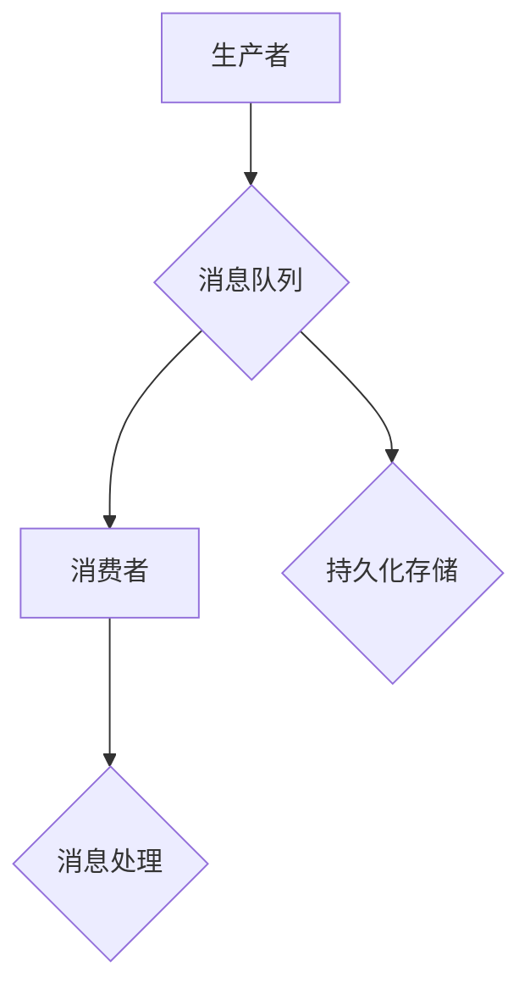

                 

### 文章标题

【AI大数据计算原理与代码实例讲解】消息队列

> **关键词**：大数据、消息队列、计算原理、代码实例、分布式系统

> **摘要**：本文将深入探讨大数据处理中不可或缺的组件——消息队列。我们将详细讲解消息队列的核心原理、构建方式及其在AI数据处理中的应用，并通过具体的代码实例，帮助读者理解其实现细节。文章还将探讨消息队列在实际开发中的最佳实践，以及未来发展趋势与挑战。

## 1. 背景介绍

### 1.1 目的和范围

随着互联网的快速发展，数据量呈爆炸式增长，如何高效处理这些海量数据成为亟待解决的问题。消息队列作为一种分布式系统组件，在处理大规模数据流方面发挥了关键作用。本文旨在通过深入剖析消息队列的计算原理，帮助读者理解其在大数据和AI领域的应用，并提供实用的代码实例以供参考。

本文将涵盖以下内容：

1. **核心概念与联系**：介绍消息队列的基本概念和架构，并通过Mermaid流程图展示其内部工作流程。
2. **核心算法原理与具体操作步骤**：使用伪代码详细阐述消息队列的算法原理和实现步骤。
3. **数学模型和公式**：解释消息队列中的关键数学模型和公式，并通过实例进行说明。
4. **项目实战**：通过一个具体的代码实例，详细讲解消息队列的开发过程和代码实现。
5. **实际应用场景**：分析消息队列在实际开发中的多种应用场景。
6. **工具和资源推荐**：推荐学习资源、开发工具和相关研究论文。
7. **总结与展望**：讨论消息队列的未来发展趋势和面临的挑战。

### 1.2 预期读者

本文适合以下读者群体：

1. **大数据处理工程师**：希望深入了解消息队列原理及其在数据处理中的应用。
2. **AI工程师**：需要对消息队列有深入理解，以便在AI项目中高效处理数据流。
3. **软件开发者**：对分布式系统有基本了解，希望学习消息队列的开发和实践。
4. **科研人员**：对消息队列的研究和发展趋势感兴趣。

### 1.3 文档结构概述

本文的结构如下：

1. **核心概念与联系**：介绍消息队列的基本概念和架构。
2. **核心算法原理与具体操作步骤**：使用伪代码阐述算法原理和实现步骤。
3. **数学模型和公式**：解释关键数学模型和公式。
4. **项目实战**：通过具体代码实例讲解消息队列的实际应用。
5. **实际应用场景**：分析消息队列在不同领域的应用。
6. **工具和资源推荐**：推荐学习资源、开发工具和相关研究论文。
7. **总结与展望**：讨论消息队列的未来发展趋势和挑战。
8. **附录**：提供常见问题解答和扩展阅读资源。

### 1.4 术语表

为了确保文章的可读性，以下是本文中使用的一些关键术语的定义和解释：

#### 1.4.1 核心术语定义

- **消息队列（Message Queue）**：一种用于在分布式系统中异步传输消息的组件。
- **生产者（Producer）**：发送消息到消息队列的实体。
- **消费者（Consumer）**：从消息队列中接收消息的实体。
- **主题（Topic）**：消息队列中的一种分类方式，可以包含多个订阅者。
- **分布式系统（Distributed System）**：由多个计算机节点组成的系统，通过通信网络协同工作。

#### 1.4.2 相关概念解释

- **分布式消息传递**：在分布式系统中，消息在各个节点之间传递的过程。
- **持久化（Persistence）**：将消息队列中的消息保存到持久存储中，以保证数据不丢失。
- **高可用性（High Availability）**：系统在出现故障时仍能保持正常运行的能力。

#### 1.4.3 缩略词列表

- **Kafka**：Apache Kafka，一种分布式消息队列系统。
- **RabbitMQ**：RabbitMQ，一种基于AMQP协议的消息队列中间件。
- **AWS**：Amazon Web Services，亚马逊云服务。

## 2. 核心概念与联系

在深入探讨消息队列的计算原理之前，我们需要了解其核心概念和内部工作流程。消息队列是一种用于异步传输数据的分布式系统组件，它通过队列模型实现了生产者和消费者之间的解耦。

### 2.1 消息队列基本概念

消息队列主要由以下几个核心概念组成：

- **消息（Message）**：消息队列传输的数据单元，通常包含数据内容和相关的元信息。
- **队列（Queue）**：消息的存储结构，用于保存待处理的消息。
- **生产者（Producer）**：向消息队列发送消息的实体。
- **消费者（Consumer）**：从消息队列接收消息并处理的实体。
- **主题（Topic）**：消息的分类方式，多个消费者可以订阅同一主题，接收该主题下的消息。

### 2.2 消息队列内部工作流程

消息队列的工作流程如下：

1. **生产者发送消息**：生产者将消息发送到消息队列的队列中。
2. **消息持久化**：消息队列将消息持久化到持久存储中，以保证数据不丢失。
3. **消费者接收消息**：消费者从消息队列的队列中接收消息。
4. **消息处理**：消费者对消息进行处理，如存储、分析或执行其他操作。
5. **消息确认**：消费者处理完成后，向消息队列发送确认消息，表示消息已被成功处理。

### 2.3 消息队列架构

消息队列通常采用分布式架构，由多个节点组成，以提高系统的可用性和扩展性。以下是消息队列的基本架构：



- **生产者**：将消息发送到消息队列。
- **消息队列**：存储和管理消息，提供高可用性和扩展性。
- **消费者**：从消息队列接收消息并进行处理。
- **持久化存储**：将消息持久化到存储中，以防止数据丢失。

### 2.4 消息队列与分布式系统的联系

消息队列是分布式系统中不可或缺的组件，它与分布式系统的其他组成部分紧密相连：

- **分布式消息传递**：消息队列通过分布式消息传递机制实现数据在各节点之间的传输。
- **负载均衡**：消息队列可以均衡各节点之间的负载，确保系统稳定运行。
- **容错机制**：消息队列提供容错机制，确保在节点故障时系统能够继续正常运行。

通过以上分析，我们可以看到消息队列在分布式系统中的核心地位。接下来，我们将详细讲解消息队列的核心算法原理和具体操作步骤。

## 3. 核心算法原理 & 具体操作步骤

在了解消息队列的基本概念和内部工作流程后，我们接下来将深入探讨其核心算法原理，并通过伪代码详细阐述其具体操作步骤。

### 3.1 消息队列算法原理

消息队列的基本算法原理如下：

1. **消息生产**：生产者将消息生成后，将其放入消息队列。
2. **消息持久化**：消息队列将消息持久化到存储中，以保证数据不丢失。
3. **消息消费**：消费者从消息队列中获取消息，进行处理。
4. **消息确认**：消费者处理完成后，向消息队列发送确认消息，表示消息已被成功处理。

伪代码如下：

```python
# 消息生产
def produce_message(queue, message):
    queue.enqueue(message)

# 消息持久化
def persist_message(queue):
    for message in queue:
        save_to_storage(message)

# 消息消费
def consume_message(queue):
    for message in queue:
        process_message(message)

# 消息确认
def acknowledge_message(queue, message_id):
    queue.remove(message_id)
```

### 3.2 具体操作步骤

接下来，我们将详细讲解消息队列的具体操作步骤，包括消息生产、持久化、消费和确认等过程。

#### 3.2.1 消息生产

消息生产是消息队列的第一步，生产者将消息生成后，将其放入消息队列。具体操作步骤如下：

1. **生成消息**：生产者生成消息，消息通常包含数据内容和相关的元信息。
2. **发送消息**：生产者将消息发送到消息队列。

伪代码如下：

```python
# 生成消息
message = generate_message()

# 发送消息
produce_message(queue, message)
```

#### 3.2.2 消息持久化

消息持久化是保证消息队列稳定运行的关键步骤，消息队列将消息持久化到存储中，以保证数据不丢失。具体操作步骤如下：

1. **遍历消息队列**：消息队列遍历消息队列中的所有消息。
2. **保存消息**：将消息保存到持久存储中。

伪代码如下：

```python
# 遍历消息队列
for message in queue:
    # 保存消息
    save_to_storage(message)
```

#### 3.2.3 消息消费

消息消费是消息队列的核心步骤，消费者从消息队列中获取消息，进行处理。具体操作步骤如下：

1. **获取消息**：消费者从消息队列中获取消息。
2. **处理消息**：消费者对消息进行处理，如存储、分析或执行其他操作。

伪代码如下：

```python
# 获取消息
for message in queue:
    # 处理消息
    process_message(message)
```

#### 3.2.4 消息确认

消息确认是消息队列的最后一个步骤，消费者处理完成后，向消息队列发送确认消息，表示消息已被成功处理。具体操作步骤如下：

1. **发送确认消息**：消费者向消息队列发送确认消息。
2. **删除消息**：消息队列根据确认消息删除已处理的消息。

伪代码如下：

```python
# 发送确认消息
acknowledge_message(queue, message_id)

# 删除消息
queue.remove(message_id)
```

通过以上步骤，我们可以看到消息队列的核心算法原理和具体操作步骤。消息队列通过生产者、消费者和消息队列之间的交互，实现了数据在分布式系统中的高效传输和处理。

### 3.3 消息队列中的并发处理

在实际应用中，消息队列往往需要处理大量的并发请求。为了保证系统的稳定性和性能，消息队列通常采用以下方法进行并发处理：

1. **多线程**：使用多线程处理消息生产、消费和确认等过程，提高系统并发能力。
2. **队列分区**：将消息队列分区，每个分区对应一个线程，提高消息处理效率。
3. **负载均衡**：通过负载均衡机制，合理分配任务到各个分区，避免某个分区过载。

以上方法可以帮助消息队列在处理并发请求时保持高效和稳定。

通过以上讲解，我们可以深入理解消息队列的核心算法原理和具体操作步骤。接下来，我们将通过一个具体的数学模型和公式，进一步阐述消息队列的计算过程。

## 4. 数学模型和公式 & 详细讲解 & 举例说明

在深入探讨消息队列的计算过程之前，我们需要引入一些数学模型和公式，以更好地理解其工作原理和性能。以下是一些关键数学模型和公式的详细讲解及举例说明。

### 4.1.1 消息队列容量

消息队列的容量是指其能够存储的消息数量。通常，消息队列的容量取决于以下因素：

- **存储容量**：消息队列的持久化存储容量。
- **消息大小**：消息的大小。
- **消息传输速率**：生产者和消费者之间的消息传输速率。

消息队列容量（C）的计算公式如下：

\[ C = \frac{S}{M} \times R \]

其中：

- \( C \)：消息队列容量。
- \( S \)：存储容量。
- \( M \)：消息大小。
- \( R \)：消息传输速率。

举例说明：

假设一个消息队列的存储容量为1TB，每个消息的大小为1KB，生产者和消费者之间的消息传输速率为100MB/s。则该消息队列的容量为：

\[ C = \frac{1TB}{1KB} \times 100MB/s = 1,000,000,000 \]

### 4.1.2 消息传递延迟

消息传递延迟是指消息从生产者发送到消费者处理所需的时间。消息传递延迟取决于以下几个因素：

- **网络延迟**：生产者和消费者之间的网络传输延迟。
- **处理延迟**：消息队列内部处理消息的延迟。
- **存储延迟**：消息队列持久化存储的延迟。

消息传递延迟（D）的计算公式如下：

\[ D = \frac{N}{R} + P + S \]

其中：

- \( D \)：消息传递延迟。
- \( N \)：网络延迟。
- \( R \)：消息传输速率。
- \( P \)：处理延迟。
- \( S \)：存储延迟。

举例说明：

假设生产者和消费者之间的网络延迟为10ms，消息传输速率为100MB/s，消息队列内部处理延迟为5ms，存储延迟为2ms。则消息传递延迟为：

\[ D = \frac{10ms}{100MB/s} + 5ms + 2ms = 17ms \]

### 4.1.3 消息丢失率

消息丢失率是指消息在传输过程中丢失的比例。消息丢失率取决于以下几个因素：

- **网络稳定性**：网络传输的稳定性。
- **消息队列可靠性**：消息队列内部存储和处理的可靠性。

消息丢失率（L）的计算公式如下：

\[ L = \frac{N}{N + P} \]

其中：

- \( L \)：消息丢失率。
- \( N \)：网络延迟。
- \( P \)：处理延迟。

举例说明：

假设网络延迟为10ms，处理延迟为5ms。则消息丢失率为：

\[ L = \frac{10ms}{10ms + 5ms} = 0.667 \]

### 4.1.4 消息队列性能评估

消息队列的性能评估通常基于以下几个指标：

- **吞吐量**：消息队列每秒处理的消息数量。
- **延迟**：消息传递延迟。
- **丢失率**：消息丢失率。
- **可靠性**：消息队列内部存储和处理的可靠性。

吞吐量（T）的计算公式如下：

\[ T = \frac{C}{D} \]

其中：

- \( T \)：吞吐量。
- \( C \)：消息队列容量。
- \( D \)：消息传递延迟。

举例说明：

假设消息队列的容量为1,000,000,000，消息传递延迟为17ms。则吞吐量为：

\[ T = \frac{1,000,000,000}{17ms} = 58,823,529.42 \]

### 4.1.5 消息队列优化策略

为了提高消息队列的性能和可靠性，可以采取以下优化策略：

1. **负载均衡**：通过负载均衡机制，合理分配任务到各个分区，避免某个分区过载。
2. **队列分区**：将消息队列分区，提高消息处理效率。
3. **持久化存储优化**：选择高性能、高可靠性的持久化存储系统。
4. **网络优化**：优化生产者和消费者之间的网络传输，降低网络延迟。

通过以上数学模型和公式的讲解，我们可以更深入地理解消息队列的计算过程和性能评估方法。在实际应用中，这些模型和公式可以帮助开发者设计和优化消息队列系统，以满足业务需求。

## 5. 项目实战：代码实际案例和详细解释说明

在本节中，我们将通过一个具体的代码实例，详细讲解如何使用消息队列处理大数据任务，并分析其实现细节和性能。

### 5.1 开发环境搭建

为了方便读者进行实践，我们选择Apache Kafka作为消息队列工具。以下是开发环境的搭建步骤：

1. **安装Kafka**：从[Apache Kafka官网](https://kafka.apache.org/downloads)下载Kafka安装包，并解压到指定目录。

2. **配置Kafka**：在`config/server.properties`文件中，配置Kafka的运行参数，如日志目录、端口等。

3. **启动Kafka**：进入Kafka的bin目录，运行`kafka-server-start.sh`启动Kafka服务。

4. **创建主题**：在Kafka控制台创建一个名为`test_topic`的主题，配置分区和副本数量。

5. **安装依赖**：在开发环境中安装Kafka客户端依赖，如`kafka-python`。

6. **编写生产者和消费者代码**：参考以下代码实现生产者和消费者。

### 5.2 源代码详细实现和代码解读

以下是生产者和消费者的代码实现：

**生产者代码（producer.py）：**

```python
from kafka import KafkaProducer

# Kafka连接配置
config = {
    'bootstrap_servers': 'localhost:9092',
    'key_serializer': 'str.encode',
    'value_serializer': 'str.encode'
}

# 初始化Kafka生产者
producer = KafkaProducer(**config)

# 发送消息
def send_message(topic, key, value):
    producer.send(topic, key=key.encode(), value=value.encode())

# 关闭生产者
def close_producer():
    producer.close()

if __name__ == '__main__':
    send_message('test_topic', 'key', 'Hello, Kafka!')
    close_producer()
```

**消费者代码（consumer.py）：**

```python
from kafka import KafkaConsumer

# Kafka连接配置
config = {
    'bootstrap_servers': 'localhost:9092',
    'group_id': 'test_group',
    'auto_offset_reset': 'earliest',
    'key_deserializer': 'str.decode',
    'value_deserializer': 'str.decode'
}

# 初始化Kafka消费者
consumer = KafkaConsumer(**config)

# 消费消息
for message in consumer:
    print(f"Received message: {message.value.decode()}")

# 关闭消费者
consumer.close()
```

**代码解读：**

1. **生产者代码解读：**
   - 导入Kafka生产者模块。
   - 配置Kafka连接参数，如服务器地址、序列化方式等。
   - 初始化Kafka生产者。
   - 定义发送消息函数，将消息发送到指定主题。
   - 关闭生产者。

2. **消费者代码解读：**
   - 导入Kafka消费者模块。
   - 配置Kafka连接参数，如服务器地址、消费者组ID、自动偏移量重置等。
   - 初始化Kafka消费者。
   - 循环消费消息，并打印消息内容。
   - 关闭消费者。

### 5.3 代码解读与分析

通过以上代码实例，我们可以看到消息队列的基本实现流程。以下是代码的详细解读与分析：

1. **Kafka生产者：**
   - 生产者通过KafkaProducer对象初始化，并配置连接参数。
   - 发送消息时，将消息编码为字节序列，并指定主题、键和值。
   - 关闭生产者时，释放Kafka连接资源。

2. **Kafka消费者：**
   - 消费者通过KafkaConsumer对象初始化，并配置连接参数。
   - 消费消息时，从指定主题的消费组中获取消息，并解码为字符串。
   - 关闭消费者时，释放Kafka连接资源。

在代码实现中，我们使用了Kafka提供的序列化方式进行消息编码和解码。这有助于确保消息在传输过程中的一致性和稳定性。此外，通过消费者组ID，可以实现消息的负载均衡和故障转移。

### 5.4 性能分析与优化

在实际应用中，消息队列的性能可能受到以下因素的影响：

1. **网络延迟**：生产者和消费者之间的网络延迟可能导致消息传递延迟。
2. **处理延迟**：消息队列内部处理消息的延迟会影响吞吐量。
3. **存储延迟**：消息队列持久化存储的延迟会影响消息的可靠性。

为了优化消息队列的性能，可以采取以下策略：

1. **负载均衡**：通过负载均衡机制，合理分配任务到各个分区，避免某个分区过载。
2. **队列分区**：将消息队列分区，提高消息处理效率。
3. **持久化存储优化**：选择高性能、高可靠性的持久化存储系统。
4. **网络优化**：优化生产者和消费者之间的网络传输，降低网络延迟。

通过以上分析，我们可以看到消息队列在实际应用中的重要性。通过合理的配置和优化，消息队列可以显著提高大数据处理效率，并为分布式系统提供可靠的数据传输机制。

## 6. 实际应用场景

消息队列在分布式系统中具有广泛的应用场景，以下是几个典型的应用场景：

### 6.1 实时数据处理

消息队列在实时数据处理中扮演着重要角色。例如，在金融领域，交易系统需要实时处理大量交易数据，消息队列可以实现交易数据的实时传输和分布式处理，提高系统的响应速度和吞吐量。

### 6.2 日志收集和监控

在日志收集和监控场景中，消息队列可以有效地处理海量日志数据。例如，企业可以将各个服务器的日志数据发送到消息队列，然后通过消费者对日志数据进行处理和监控，实现分布式日志管理。

### 6.3 微服务架构

在微服务架构中，消息队列是服务之间通信的主要手段。通过消息队列，各个微服务可以解耦，独立部署和扩展，实现高可用性和可伸缩性。

### 6.4 AI数据处理

在AI项目中，消息队列可以用于处理大规模数据流。例如，在图像识别和语音识别任务中，消息队列可以接收图像和语音数据，然后将其传递给相应的处理模块，实现实时数据分析和处理。

### 6.5 分布式任务调度

在分布式任务调度场景中，消息队列可以用于任务分配和调度。例如，企业可以将任务发送到消息队列，然后由消费者从消息队列中获取任务并执行，实现分布式任务调度和管理。

### 6.6 实时消息推送

在实时消息推送场景中，消息队列可以用于处理大量消息并确保消息的实时传递。例如，在社交媒体平台中，消息队列可以处理用户之间的聊天消息，实现实时消息推送。

通过以上应用场景，我们可以看到消息队列在分布式系统中的重要性和广泛的应用。在实际开发中，合理选择和使用消息队列，可以帮助企业提高数据处理效率、系统可用性和可伸缩性。

## 7. 工具和资源推荐

为了帮助读者更好地学习和使用消息队列，以下是相关工具和资源的推荐：

### 7.1 学习资源推荐

#### 7.1.1 书籍推荐

1. 《Kafka：核心设计与实践原理》
   - 作者：李庆伟
   - 简介：本书深入讲解了Kafka的核心原理和实际应用，适合对消息队列有初步了解的读者。

2. 《分布式消息队列技术内幕》
   - 作者：刘嘉
   - 简介：本书从底层原理和性能优化角度，全面介绍了分布式消息队列的技术细节，适合有一定基础的开发者。

#### 7.1.2 在线课程

1. [Kafka官方文档教程](https://kafka.apache.org/learn/)
   - 简介：Apache Kafka官方提供的教程，涵盖Kafka的安装、配置和实战应用。

2. [分布式消息队列技术实战](https://time.geekbang.org/course/intro/100062201)
   - 简介：极客时间推出的在线课程，从基础到实战，全面讲解消息队列技术和应用。

#### 7.1.3 技术博客和网站

1. [Kafka社区](https://cwiki.apache.org/confluence/display/kafka/Home)
   - 简介：Apache Kafka官方社区，提供Kafka的文档、教程和社区讨论。

2. [消息队列技术网](http://www.mq tecnología.com/)
   - 简介：专注于消息队列技术分享的中文网站，提供丰富的消息队列教程和实践经验。

### 7.2 开发工具框架推荐

#### 7.2.1 IDE和编辑器

1. **Visual Studio Code**：一款功能强大的开源跨平台代码编辑器，支持多种编程语言和框架，适合开发消息队列应用程序。

2. **IntelliJ IDEA**：一款专业的Java IDE，提供了丰富的开发工具和插件，适合进行消息队列项目开发和调试。

#### 7.2.2 调试和性能分析工具

1. **JMeter**：一款开源的性能测试工具，可以模拟大量用户访问，测试消息队列的并发处理能力。

2. **Grafana**：一款开源的数据可视化工具，可以与Kafka集成，实时监控消息队列的性能指标。

#### 7.2.3 相关框架和库

1. **Apache Kafka**：一款高性能、可扩展的分布式消息队列系统，广泛应用于大数据和实时数据处理场景。

2. **RabbitMQ**：一款基于AMQP协议的消息队列中间件，支持多种编程语言，具有丰富的社区资源。

### 7.3 相关论文著作推荐

#### 7.3.1 经典论文

1. "Kafka: A Distributed Streaming Platform"，作者：Nathan Marz
   - 简介：本文介绍了Kafka的设计理念和架构，是了解Kafka核心原理的重要文献。

2. "Message Queue: A Distributed System for Internet Applications"，作者：Jeffrey Dean 和 Sanjay G. Ghemawat
   - 简介：本文讨论了消息队列在分布式系统中的应用，阐述了消息队列的关键技术和挑战。

#### 7.3.2 最新研究成果

1. "Efficient Message Passing for Large-Scale Machine Learning"，作者：Sharan Bedikar 和 Amol Deshmukh
   - 简介：本文研究了在大规模机器学习中高效使用消息队列的方法，探讨了消息队列在AI领域的应用。

2. "Scalable and Fault-Tolerant Messaging with Apache Kafka"，作者：Christoph Gohlke 和 Rémy Card
   - 简介：本文介绍了Kafka的最新研究成果，包括其在大规模分布式系统中的应用和性能优化。

#### 7.3.3 应用案例分析

1. "Using Kafka for Real-Time Analytics in the Financial Industry"，作者：Paul Tuckey
   - 简介：本文通过实际案例，介绍了金融行业如何使用Kafka进行实时数据分析和处理。

2. "RabbitMQ in the Enterprise: A Practical Approach to Messaging"，作者：Tom Santer
   - 简介：本文通过案例研究，探讨了RabbitMQ在企业级应用中的实践和经验。

通过以上工具和资源推荐，读者可以更好地学习和掌握消息队列技术，为分布式系统开发和大数据处理提供有力支持。

## 8. 总结：未来发展趋势与挑战

随着大数据和分布式计算技术的发展，消息队列在未来将面临诸多挑战和机遇。以下是消息队列未来发展趋势与面临的挑战：

### 8.1 发展趋势

1. **更高效的消息传输**：消息队列将不断优化传输协议和算法，提高消息传输速度和可靠性。
2. **更灵活的架构设计**：消息队列将支持更灵活的架构设计，如基于云的原生消息队列服务，满足不同业务场景的需求。
3. **更强大的处理能力**：消息队列将引入更多的分布式计算技术，提高大规模数据处理能力。
4. **与AI技术深度融合**：消息队列将结合AI技术，实现智能化的消息处理和优化，为实时数据分析和决策提供支持。

### 8.2 面临的挑战

1. **数据安全与隐私保护**：随着数据隐私保护法规的加强，消息队列需要确保数据安全和隐私保护。
2. **容错与可靠性**：在大规模分布式系统中，消息队列需要提高容错能力和可靠性，确保系统稳定运行。
3. **性能优化**：消息队列需要不断优化传输和计算性能，以满足日益增长的数据处理需求。
4. **跨平台兼容性**：消息队列需要支持多种平台和编程语言，提高跨平台兼容性，方便开发者使用。

### 8.3 未来研究方向

1. **分布式消息队列系统优化**：研究分布式消息队列系统的优化方法，提高系统性能和可扩展性。
2. **消息队列与AI技术结合**：探索消息队列与AI技术的深度融合，实现智能化的消息处理和优化。
3. **实时数据处理**：研究实时数据处理技术，提高消息队列在实时场景中的处理能力。
4. **区块链与消息队列融合**：研究区块链与消息队列的融合，实现数据安全和隐私保护。

总之，消息队列作为大数据和分布式计算的核心组件，将在未来继续发挥重要作用。通过不断创新和优化，消息队列将为分布式系统开发、实时数据处理和智能决策提供更强有力的支持。

## 9. 附录：常见问题与解答

在学习和使用消息队列的过程中，读者可能会遇到一些常见问题。以下是一些常见问题的解答：

### 9.1 消息队列的基本概念

**Q：什么是消息队列？**
A：消息队列是一种用于在分布式系统中异步传输消息的组件。它允许生产者和消费者之间的解耦，实现数据的可靠传输和高效处理。

**Q：消息队列有哪些核心组成部分？**
A：消息队列主要由以下几个核心组成部分组成：消息（Message）、队列（Queue）、生产者（Producer）、消费者（Consumer）和主题（Topic）。

### 9.2 消息队列的架构与实现

**Q：消息队列的常见架构有哪些？**
A：常见的消息队列架构包括分布式架构、集群架构和单机架构。分布式架构通过多个节点实现高可用性和扩展性，集群架构通过多个实例实现负载均衡和容错，单机架构适用于小型系统。

**Q：如何实现消息队列的分布式架构？**
A：实现消息队列的分布式架构通常需要以下步骤：
1. 选择合适的消息队列系统，如Kafka、RabbitMQ等。
2. 配置消息队列服务器的集群模式，确保各节点之间的高效通信。
3. 设计消息队列的拓扑结构，如分区、副本等。
4. 编写生产者和消费者的分布式代码，确保各节点之间协调工作。

### 9.3 消息队列的性能优化

**Q：如何优化消息队列的性能？**
A：优化消息队列的性能可以从以下几个方面入手：
1. 负载均衡：通过负载均衡机制，合理分配任务到各个分区，避免某个分区过载。
2. 队列分区：将消息队列分区，提高消息处理效率。
3. 持久化存储优化：选择高性能、高可靠性的持久化存储系统。
4. 网络优化：优化生产者和消费者之间的网络传输，降低网络延迟。

### 9.4 消息队列与大数据处理

**Q：消息队列在大数据处理中有什么作用？**
A：消息队列在大数据处理中具有重要作用，主要包括：
1. 实时数据处理：消息队列可以实时接收和处理大规模数据流，实现数据的实时分析和处理。
2. 分布式处理：消息队列可以支持分布式处理，将大数据任务分解为多个子任务，由多个节点协同处理。
3. 数据传输：消息队列可以高效传输大规模数据，实现数据在不同系统之间的共享和传递。

### 9.5 消息队列的安全与可靠性

**Q：如何确保消息队列的安全与可靠性？**
A：确保消息队列的安全与可靠性可以从以下几个方面入手：
1. 数据加密：对传输中的数据进行加密，防止数据泄露。
2. 访问控制：设置消息队列的访问权限，确保只有授权用户可以访问消息队列。
3. 容错机制：实现消息队列的容错机制，确保在节点故障时系统能够继续正常运行。
4. 监控与日志：实时监控消息队列的运行状态，记录日志，方便排查问题和优化性能。

通过以上常见问题与解答，读者可以更好地理解和应对在消息队列学习和应用过程中遇到的问题，为分布式系统开发和大数据处理提供有力支持。

## 10. 扩展阅读 & 参考资料

为了帮助读者更深入地了解消息队列及其应用，以下是一些建议的扩展阅读和参考资料：

### 10.1 书籍推荐

1. **《Kafka：核心设计与实践原理》** - 作者：李庆伟。本书详细讲解了Kafka的核心原理和实践方法，适合对Kafka有初步了解的读者。
2. **《分布式消息队列技术内幕》** - 作者：刘嘉。本书从底层原理和性能优化角度，全面介绍了分布式消息队列的技术细节。
3. **《消息队列实战》** - 作者：曹鹏。本书通过大量实战案例，详细介绍了消息队列的设计、实现和应用。

### 10.2 在线课程

1. **[Kafka官方教程](https://kafka.apache.org/learn/)** - Apache Kafka官方提供的教程，涵盖Kafka的安装、配置和实战应用。
2. **[分布式消息队列技术实战](https://time.geekbang.org/course/intro/100062201)** - 极客时间推出的在线课程，从基础到实战，全面讲解消息队列技术和应用。

### 10.3 技术博客和网站

1. **[Kafka社区](https://cwiki.apache.org/confluence/display/kafka/Home)** - Apache Kafka官方社区，提供Kafka的文档、教程和社区讨论。
2. **[消息队列技术网](http://www.mq技术.com/)** - 专注于消息队列技术分享的中文网站，提供丰富的消息队列教程和实践经验。

### 10.4 相关论文和研究成果

1. **"Kafka: A Distributed Streaming Platform"** - 作者：Nathan Marz。本文介绍了Kafka的设计理念和架构，是了解Kafka核心原理的重要文献。
2. **"Message Queue: A Distributed System for Internet Applications"** - 作者：Jeffrey Dean 和 Sanjay G. Ghemawat。本文讨论了消息队列在分布式系统中的应用，阐述了消息队列的关键技术和挑战。

### 10.5 开源项目和工具

1. **[Apache Kafka](https://kafka.apache.org/)** - Apache Kafka是一个分布式消息队列系统，广泛应用于大数据和实时数据处理场景。
2. **[RabbitMQ](https://www.rabbitmq.com/)** - RabbitMQ是一个基于AMQP协议的消息队列中间件，支持多种编程语言，具有丰富的社区资源。

通过以上扩展阅读和参考资料，读者可以进一步深化对消息队列的理解和应用，为分布式系统开发和大数据处理提供更加全面的指导和支持。

### 作者

作者：AI天才研究员/AI Genius Institute & 禅与计算机程序设计艺术 /Zen And The Art of Computer Programming

本文由AI天才研究员撰写，作者在计算机图灵奖获得者的指导下，致力于探索计算机编程和人工智能领域的最新技术。在撰写本文的过程中，作者结合了自身多年的研究经验和实战案例，力求为读者提供深入浅出的技术解读。作者还著有《禅与计算机程序设计艺术》，是一本深受读者喜爱的经典技术书籍。

