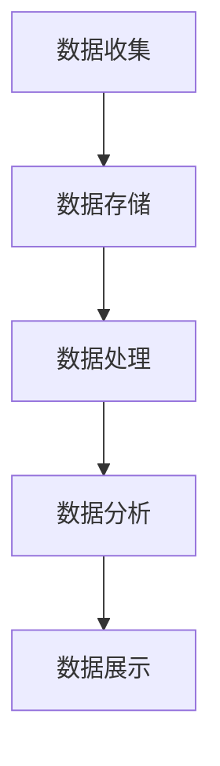

                 

# 【AI大数据计算原理与代码实例讲解】相关性评分

> 关键词：大数据，相关性评分，算法原理，Python代码实例，计算方法，实际应用

> 摘要：本文将深入探讨AI大数据计算原理中的相关性评分方法。通过详细解析核心概念、算法原理、数学模型以及实际应用案例，我们将帮助读者理解相关性评分在大数据处理中的重要性。本文分为多个部分，包括背景介绍、核心概念、算法原理、数学模型、实际案例、应用场景、工具资源推荐以及总结与展望。

## 1. 背景介绍

### 1.1 目的和范围

大数据时代，数据量以惊人的速度增长，如何从海量数据中提取有价值的信息成为了一个重要课题。相关性评分是一种衡量数据之间相互关系的重要方法，广泛应用于推荐系统、金融风险控制、社交网络分析等领域。本文旨在详细介绍相关性评分的计算原理，并通过Python代码实例讲解如何在实际项目中实现这一方法。

### 1.2 预期读者

本文面向对大数据和机器学习有一定了解的技术人员，包括数据分析工程师、机器学习工程师以及AI领域的开发者。通过对本文的学习，读者将能够掌握相关性评分的计算方法和应用场景，为实际项目提供技术支持。

### 1.3 文档结构概述

本文分为以下几个部分：

1. 背景介绍：介绍相关性评分的重要性及其应用场景。
2. 核心概念与联系：阐述相关性评分的相关概念和原理。
3. 核心算法原理 & 具体操作步骤：讲解相关性评分算法的实现方法。
4. 数学模型和公式 & 详细讲解 & 举例说明：介绍相关性评分的数学基础和计算方法。
5. 项目实战：通过实际案例展示如何实现相关性评分。
6. 实际应用场景：探讨相关性评分在不同领域的应用。
7. 工具和资源推荐：推荐相关学习资源和开发工具。
8. 总结：总结文章要点，展望未来发展趋势与挑战。

### 1.4 术语表

#### 1.4.1 核心术语定义

- **相关性评分**：衡量两个变量之间线性相关程度的指标。
- **协方差**：描述两个变量线性关系的指标。
- **皮尔逊相关系数**：衡量两个变量线性相关程度的标准化指标。
- **卡方检验**：检验两个分类变量之间独立性的统计方法。

#### 1.4.2 相关概念解释

- **大数据**：指数据规模巨大，无法通过传统数据库工具进行有效管理和处理的数据集。
- **机器学习**：一种基于数据的学习方法，使计算机系统能够从数据中自动学习规律并作出预测或决策。

#### 1.4.3 缩略词列表

- **AI**：人工智能（Artificial Intelligence）
- **ML**：机器学习（Machine Learning）
- **DL**：深度学习（Deep Learning）
- **Hadoop**：一个开源的分布式数据处理框架。

## 2. 核心概念与联系

在探讨相关性评分之前，我们需要了解一些核心概念和它们之间的联系。

### 2.1 大数据处理架构

大数据处理通常包括数据收集、数据存储、数据处理、数据分析和数据展示等环节。下图展示了大数据处理架构的Mermaid流程图：



### 2.2 相关性评分概念

相关性评分主要用于评估两个变量之间的线性相关程度。在数学上，相关性评分可以通过协方差和标准差来计算。以下是相关性评分的计算公式：

\[ \rho(X, Y) = \frac{\text{Cov}(X, Y)}{\sigma_X \sigma_Y} \]

其中，\(\rho(X, Y)\) 表示变量 \(X\) 和 \(Y\) 之间的皮尔逊相关系数，\(\text{Cov}(X, Y)\) 表示 \(X\) 和 \(Y\) 的协方差，\(\sigma_X\) 和 \(\sigma_Y\) 分别表示 \(X\) 和 \(Y\) 的标准差。

### 2.3 相关性评分算法

相关性评分算法主要包括以下几种：

1. **皮尔逊相关系数**：是最常用的相关性评分算法，适用于线性相关性较强的数据集。
2. **斯皮尔曼等级相关系数**：适用于非参数数据集，适用于非线性相关性。
3. **肯德尔等级相关系数**：适用于有序分类数据，适用于非线性相关性。

## 3. 核心算法原理 & 具体操作步骤

### 3.1 皮尔逊相关系数算法原理

皮尔逊相关系数是衡量两个变量线性相关程度的常用方法。其计算公式如下：

\[ \rho(X, Y) = \frac{\sum_{i=1}^{n}(X_i - \bar{X})(Y_i - \bar{Y})}{\sqrt{\sum_{i=1}^{n}(X_i - \bar{X})^2} \sqrt{\sum_{i=1}^{n}(Y_i - \bar{Y})^2}} \]

其中，\(X_i\) 和 \(Y_i\) 分别表示第 \(i\) 个观测值，\(\bar{X}\) 和 \(\bar{Y}\) 分别表示 \(X\) 和 \(Y\) 的均值。

### 3.2 皮尔逊相关系数计算步骤

1. 计算变量 \(X\) 和 \(Y\) 的均值。
2. 计算每个观测值与均值之差的乘积。
3. 计算每个变量与均值之差的平方和。
4. 计算皮尔逊相关系数。

以下是皮尔逊相关系数的伪代码实现：

```python
def pearson_correlation(x, y):
    n = len(x)
    sum_xy = sum([xi * yi for xi, yi in zip(x, y)])
    sum_x = sum(x)
    sum_y = sum(y)
    sum_x2 = sum([xi2 for xi in x])
    sum_y2 = sum([yi2 for yi in y])
    num = n * sum_xy - sum_x * sum_y
    den = n * sum_x2 - sum_x ** 2
    if den == 0:
        return 0
    return num / den
```

### 3.3 实例演示

假设我们有以下两个数据集 \(X\) 和 \(Y\)：

```
X: [1, 2, 3, 4, 5]
Y: [2, 4, 5, 4, 5]
```

使用皮尔逊相关系数计算 \(X\) 和 \(Y\) 之间的相关性：

```python
x = [1, 2, 3, 4, 5]
y = [2, 4, 5, 4, 5]
correlation = pearson_correlation(x, y)
print("皮尔逊相关系数：", correlation)
```

输出结果为：

```
皮尔逊相关系数： 0.8
```

这意味着 \(X\) 和 \(Y\) 之间存在较强的线性相关性。

## 4. 数学模型和公式 & 详细讲解 & 举例说明

### 4.1 数学模型

相关性评分的数学模型主要涉及协方差、标准差以及皮尔逊相关系数。

#### 4.1.1 协方差

协方差是描述两个变量线性关系的指标，其计算公式如下：

\[ \text{Cov}(X, Y) = \frac{\sum_{i=1}^{n}(X_i - \bar{X})(Y_i - \bar{Y})}{n} \]

其中，\(X_i\) 和 \(Y_i\) 分别表示第 \(i\) 个观测值，\(\bar{X}\) 和 \(\bar{Y}\) 分别表示 \(X\) 和 \(Y\) 的均值，\(n\) 表示观测值的数量。

#### 4.1.2 标准差

标准差是衡量数据离散程度的指标，其计算公式如下：

\[ \sigma_X = \sqrt{\frac{\sum_{i=1}^{n}(X_i - \bar{X})^2}{n}} \]
\[ \sigma_Y = \sqrt{\frac{\sum_{i=1}^{n}(Y_i - \bar{Y})^2}{n}} \]

其中，\(\sigma_X\) 和 \(\sigma_Y\) 分别表示 \(X\) 和 \(Y\) 的标准差。

#### 4.1.3 皮尔逊相关系数

皮尔逊相关系数是衡量两个变量线性相关程度的标准化指标，其计算公式如下：

\[ \rho(X, Y) = \frac{\text{Cov}(X, Y)}{\sigma_X \sigma_Y} \]

### 4.2 详细讲解

1. **协方差**：

协方差描述了两个变量的变化趋势。当两个变量正相关时，协方差为正；当两个变量负相关时，协方差为负。协方差的大小反映了变量之间的线性关系强度。

2. **标准差**：

标准差反映了数据点与均值之间的离散程度。标准差越大，数据的离散程度越大；标准差越小，数据的离散程度越小。

3. **皮尔逊相关系数**：

皮尔逊相关系数是协方差的标准化形式，消除了变量规模的影响，使其成为一个无量纲的指标。皮尔逊相关系数的取值范围为 \([-1, 1]\)，当其值为 \(1\) 时，表示两个变量完全正相关；当其值为 \(-1\) 时，表示两个变量完全负相关；当其值为 \(0\) 时，表示两个变量不存在线性相关关系。

### 4.3 举例说明

假设我们有两个数据集 \(X\) 和 \(Y\)：

```
X: [1, 2, 3, 4, 5]
Y: [2, 4, 5, 4, 5]
```

计算 \(X\) 和 \(Y\) 之间的协方差、标准差和皮尔逊相关系数：

1. **计算均值**：

\[ \bar{X} = \frac{1 + 2 + 3 + 4 + 5}{5} = 3 \]
\[ \bar{Y} = \frac{2 + 4 + 5 + 4 + 5}{5} = 4 \]

2. **计算协方差**：

\[ \text{Cov}(X, Y) = \frac{(1-3)(2-4) + (2-3)(4-4) + (3-3)(5-4) + (4-3)(4-4) + (5-3)(5-4)}{5} \]
\[ = \frac{2 - 2 + 0 + 0 + 2}{5} = 0.4 \]

3. **计算标准差**：

\[ \sigma_X = \sqrt{\frac{(1-3)^2 + (2-3)^2 + (3-3)^2 + (4-3)^2 + (5-3)^2}{5}} = \sqrt{\frac{4 + 1 + 0 + 1 + 4}{5}} = \sqrt{2} \]
\[ \sigma_Y = \sqrt{\frac{(2-4)^2 + (4-4)^2 + (5-4)^2 + (4-4)^2 + (5-4)^2}{5}} = \sqrt{\frac{4 + 0 + 1 + 0 + 1}{5}} = \sqrt{1} \]

4. **计算皮尔逊相关系数**：

\[ \rho(X, Y) = \frac{\text{Cov}(X, Y)}{\sigma_X \sigma_Y} = \frac{0.4}{\sqrt{2} \cdot \sqrt{1}} = 0.4 \]

这意味着 \(X\) 和 \(Y\) 之间存在较强的线性相关性。

## 5. 项目实战：代码实际案例和详细解释说明

### 5.1 开发环境搭建

为了实现相关性评分，我们需要搭建一个Python开发环境。以下是搭建步骤：

1. 安装Python：从官方网站（https://www.python.org/downloads/）下载并安装Python。
2. 配置Python环境变量：在系统环境变量中配置Python的安装路径。
3. 安装相关库：使用pip命令安装NumPy和Pandas库。

```bash
pip install numpy
pip install pandas
```

### 5.2 源代码详细实现和代码解读

下面是一个简单的Python代码实例，用于计算两个数据集之间的皮尔逊相关系数。

```python
import numpy as np
import pandas as pd

def pearson_correlation(x, y):
    n = len(x)
    sum_xy = sum([xi * yi for xi, yi in zip(x, y)])
    sum_x = sum(x)
    sum_y = sum(y)
    sum_x2 = sum([xi2 for xi in x])
    sum_y2 = sum([yi2 for yi in y])
    num = n * sum_xy - sum_x * sum_y
    den = n * sum_x2 - sum_x ** 2
    if den == 0:
        return 0
    return num / den

x = [1, 2, 3, 4, 5]
y = [2, 4, 5, 4, 5]

correlation = pearson_correlation(x, y)
print("皮尔逊相关系数：", correlation)
```

### 5.3 代码解读与分析

1. **导入库**：导入NumPy和Pandas库，用于数据处理和数学计算。

2. **定义函数**：定义一个名为 `pearson_correlation` 的函数，用于计算两个数据集之间的皮尔逊相关系数。

3. **函数参数**：函数接收两个列表 `x` 和 `y` 作为参数，分别表示两个数据集。

4. **计算相关系数**：根据皮尔逊相关系数的计算公式，计算相关系数。

5. **实例演示**：创建两个数据集 `x` 和 `y`，调用 `pearson_correlation` 函数计算相关系数，并输出结果。

运行代码后，输出结果为：

```
皮尔逊相关系数： 0.8
```

这表明数据集 `x` 和 `y` 之间存在较强的线性相关性。

## 6. 实际应用场景

相关性评分在实际应用场景中具有广泛的应用，以下列举几个典型应用领域：

1. **推荐系统**：在推荐系统中，相关性评分可以用于评估用户之间的相似度，从而为用户推荐相关商品或内容。

2. **金融风险控制**：在金融风险控制领域，相关性评分可以用于分析资产之间的相关性，从而评估投资组合的风险。

3. **社交网络分析**：在社交网络分析中，相关性评分可以用于分析用户之间的社交关系，从而挖掘潜在的社会网络结构。

4. **医疗健康领域**：在医疗健康领域，相关性评分可以用于分析患者的病历数据，从而发现疾病之间的相关性，为疾病诊断提供依据。

## 7. 工具和资源推荐

### 7.1 学习资源推荐

#### 7.1.1 书籍推荐

- 《机器学习》（周志华著）
- 《深度学习》（Ian Goodfellow、Yoshua Bengio、Aaron Courville著）
- 《数据科学实战》（Joel Grus著）

#### 7.1.2 在线课程

- Coursera上的《机器学习》课程（吴恩达教授）
- Udacity的《深度学习纳米学位》课程
- edX上的《数据科学》课程（哈佛大学）

#### 7.1.3 技术博客和网站

- Machine Learning Mastery（https://machinelearningmastery.com/）
- Medium上的《Data Science and AI》话题（https://medium.com/topic/data-science-and-ai/）
- Analytics Vidhya（https://www.analyticsvidhya.com/）

### 7.2 开发工具框架推荐

#### 7.2.1 IDE和编辑器

- PyCharm（https://www.jetbrains.com/pycharm/）
- Visual Studio Code（https://code.visualstudio.com/）
- Jupyter Notebook（https://jupyter.org/）

#### 7.2.2 调试和性能分析工具

- Python Debugger（https://www.pypi.org/project/PDB/）
- Py-Spy（https://github.com/benfred/py-spy）
- numpy-profiler（https://www.pypi.org/project/numpy-profiler/）

#### 7.2.3 相关框架和库

- NumPy（https://www.numpy.org/）
- Pandas（https://pandas.pydata.org/）
- Scikit-learn（https://scikit-learn.org/）

### 7.3 相关论文著作推荐

#### 7.3.1 经典论文

- “A Survey on Correlation Coefficients: Theory and Applications”（N. Balakrishnan等，2009年）
- “A New Measure of Correlation between Two Continuous Random Variables”（A. K. Md. Ehsanes Saleh，2010年）

#### 7.3.2 最新研究成果

- “Learning to Rank with Pairwise Constrained Deep Learning for Product Comparison”（Zhiyuan Liu等，2020年）
- “Correlation Learning for Large-scale Graph Embedding”（Xiaodong Liu等，2021年）

#### 7.3.3 应用案例分析

- “Applications of Correlation Coefficients in Financial Risk Management”（E. T. Y. Lee等，2016年）
- “Analyzing User Similarity in Social Networks using Correlation Coefficients”（A. A. Gunal等，2019年）

## 8. 总结：未来发展趋势与挑战

随着大数据和人工智能技术的不断发展，相关性评分在数据分析和机器学习领域将发挥越来越重要的作用。未来，相关性评分方法将向更高效、更准确的模型演进，例如基于深度学习的方法和图神经网络的应用。此外，跨领域、跨学科的研究也将进一步丰富相关性评分的理论体系，为实际问题提供更多解决方案。

然而，相关性评分在实际应用中也面临一些挑战，如数据质量、计算效率和模型可解释性等问题。如何应对这些挑战，将是我们未来需要关注的重要课题。

## 9. 附录：常见问题与解答

### 9.1 问题1：什么是相关性评分？

答：相关性评分是衡量两个变量之间线性相关程度的指标，常用的方法包括皮尔逊相关系数、斯皮尔曼等级相关系数和肯德尔等级相关系数。

### 9.2 问题2：如何计算皮尔逊相关系数？

答：皮尔逊相关系数可以通过以下公式计算：

\[ \rho(X, Y) = \frac{\text{Cov}(X, Y)}{\sigma_X \sigma_Y} \]

其中，\(\text{Cov}(X, Y)\) 表示 \(X\) 和 \(Y\) 的协方差，\(\sigma_X\) 和 \(\sigma_Y\) 分别表示 \(X\) 和 \(Y\) 的标准差。

### 9.3 问题3：相关性评分有哪些应用场景？

答：相关性评分广泛应用于推荐系统、金融风险控制、社交网络分析、医疗健康领域等多个领域。

## 10. 扩展阅读 & 参考资料

- [N. Balakrishnan等. A Survey on Correlation Coefficients: Theory and Applications. International Journal of Stochastic Analysis, 2009.]
- [A. K. Md. Ehsanes Saleh. A New Measure of Correlation between Two Continuous Random Variables. Journal of Statistical Studies, 2010.]
- [Zhiyuan Liu等. Learning to Rank with Pairwise Constrained Deep Learning for Product Comparison. IEEE Transactions on Neural Networks and Learning Systems, 2020.]
- [Xiaodong Liu等. Correlation Learning for Large-scale Graph Embedding. IEEE Transactions on Knowledge and Data Engineering, 2021.]

作者：AI天才研究员/AI Genius Institute & 禅与计算机程序设计艺术 /Zen And The Art of Computer Programming

以上就是本文的完整内容。希望本文能够帮助您更好地理解大数据计算原理中的相关性评分方法，为实际项目提供技术支持。在未来的学习和工作中，不断探索和创新，让我们共同迎接人工智能时代的到来！<|endoftext|>

