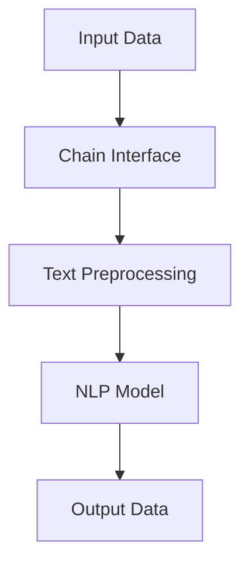

                 

# 【LangChain编程：从入门到实践】Chain接口

> **关键词**：LangChain，Chain接口，编程实践，自然语言处理，数据处理，API调用，代码示例，性能优化

> **摘要**：本文深入探讨了LangChain中的Chain接口，从基础概念、核心算法到具体实践案例，全面解析了Chain接口在自然语言处理和数据管理中的应用。通过详细代码解析和性能优化建议，帮助开发者更好地掌握Chain接口的使用，提升编程技能。

## 1. 背景介绍

### 1.1 目的和范围

本文旨在帮助开发者深入了解并掌握LangChain中的Chain接口。Chain接口是LangChain框架的核心组件，负责处理自然语言任务的数据流管理。本文将首先介绍Chain接口的基础概念和作用，然后逐步深入探讨其工作原理、实现方式和实际应用场景。

### 1.2 预期读者

本文适合对自然语言处理和数据处理有一定了解的开发者，特别是对LangChain框架感兴趣的读者。通过本文的阅读，开发者可以系统地学习Chain接口的使用方法，并在实际项目中加以应用。

### 1.3 文档结构概述

本文分为以下几个部分：

- **1. 背景介绍**：介绍本文的目的、预期读者和文档结构。
- **2. 核心概念与联系**：介绍Chain接口的核心概念和原理，并通过Mermaid流程图展示其架构。
- **3. 核心算法原理 & 具体操作步骤**：详细讲解Chain接口的算法原理和具体操作步骤。
- **4. 数学模型和公式 & 详细讲解 & 举例说明**：介绍与Chain接口相关的数学模型和公式，并通过实际案例进行说明。
- **5. 项目实战：代码实际案例和详细解释说明**：通过实际代码案例，展示Chain接口在项目中的具体应用。
- **6. 实际应用场景**：讨论Chain接口在不同应用场景中的实际应用。
- **7. 工具和资源推荐**：推荐与Chain接口相关的学习资源、开发工具和论文著作。
- **8. 总结：未来发展趋势与挑战**：总结Chain接口的发展趋势和面临的挑战。
- **9. 附录：常见问题与解答**：回答开发者在使用Chain接口过程中可能遇到的问题。
- **10. 扩展阅读 & 参考资料**：提供与Chain接口相关的扩展阅读和参考资料。

### 1.4 术语表

#### 1.4.1 核心术语定义

- **Chain接口**：LangChain框架中的核心组件，负责处理自然语言任务的数据流管理。
- **数据处理**：对输入数据进行清洗、转换和存储的过程。
- **API调用**：通过编程接口远程访问其他程序或服务的过程。
- **自然语言处理**：利用计算机技术对自然语言文本进行分析、理解和生成的过程。

#### 1.4.2 相关概念解释

- **数据流管理**：在处理大规模数据时，对数据传输、存储和处理过程的组织和管理。
- **文本预处理**：对原始文本进行清洗、分词、去停用词等操作，使其适合进行进一步处理。

#### 1.4.3 缩略词列表

- **NLP**：自然语言处理（Natural Language Processing）
- **API**：应用程序接口（Application Programming Interface）
- **IDE**：集成开发环境（Integrated Development Environment）

## 2. 核心概念与联系

Chain接口是LangChain框架的核心组件，负责处理自然语言任务的数据流管理。为了更好地理解Chain接口的工作原理，我们可以通过一个Mermaid流程图来展示其架构。

### Mermaid流程图



- **A[Input Data]**：输入数据，可以是文本、图像或其他格式。
- **B[Chain Interface]**：Chain接口，负责处理输入数据，执行文本预处理、NLP模型调用和输出数据。
- **C[Text Preprocessing]**：文本预处理，包括清洗、分词、去停用词等操作。
- **D[NLP Model]**：NLP模型，对预处理后的文本进行分析、理解和生成。
- **E[Output Data]**：输出数据，可以是文本、图像或其他格式。

通过以上流程图，我们可以看出Chain接口在整个数据处理流程中的关键作用。接下来，我们将深入探讨Chain接口的工作原理。

## 3. 核心算法原理 & 具体操作步骤

Chain接口的核心算法原理主要包括文本预处理、NLP模型调用和数据输出。下面，我们将通过伪代码详细阐述这些步骤。

### 3.1 文本预处理

```python
def preprocess_text(text):
    # 清洗文本
    cleaned_text = clean_text(text)
    # 分词
    tokens = tokenize(cleaned_text)
    # 去停用词
    filtered_tokens = remove_stopwords(tokens)
    return filtered_tokens
```

### 3.2 NLP模型调用

```python
from nlp_model import NLPModel

def call_nlp_model(filtered_tokens):
    # 加载NLP模型
    nlp_model = NLPModel()
    # 对文本进行NLP处理
    result = nlp_model.process(filtered_tokens)
    return result
```

### 3.3 数据输出

```python
def output_data(result):
    # 将结果转换为指定格式
    formatted_result = format_result(result)
    # 输出数据
    print(formatted_result)
```

### 3.4 完整流程

```python
def chain_process(input_data):
    # 文本预处理
    filtered_tokens = preprocess_text(input_data)
    # NLP模型调用
    result = call_nlp_model(filtered_tokens)
    # 数据输出
    output_data(result)
```

通过以上伪代码，我们可以看出Chain接口的具体操作步骤。在实际应用中，开发者可以根据需求进行扩展和优化。

## 4. 数学模型和公式 & 详细讲解 & 举例说明

Chain接口在处理自然语言任务时，会涉及到一些数学模型和公式。下面，我们将详细介绍这些模型和公式，并通过实际案例进行说明。

### 4.1 词向量模型

词向量模型是一种将单词映射为向量的方法，常见的方法包括Word2Vec、GloVe等。词向量模型可以将文本数据转换为向量表示，便于进行进一步处理。

#### 4.1.1 Word2Vec模型

Word2Vec模型基于神经网络训练单词的向量表示。其基本公式如下：

$$
\text{output} = \text{softmax}(\text{weights} \cdot \text{input})
$$

其中，weights为神经网络权重，input为输入的词向量。

#### 4.1.2 GloVe模型

GloVe模型基于全局词频统计训练词向量。其基本公式如下：

$$
\text{loss} = \frac{1}{2} \sum_{\text{word} \in \text{Vocabulary}} \left( \text{target} - \text{predicted} \right)^2
$$

其中，target为目标词向量，predicted为预测的词向量。

### 4.2 语言模型

语言模型是一种用于预测下一个单词的概率分布的模型。常见的方法包括n-gram模型、神经网络语言模型等。

#### 4.2.1 n-gram模型

n-gram模型基于历史n个单词的概率分布预测下一个单词。其基本公式如下：

$$
P(\text{word}_n | \text{word}_{n-1}, \ldots, \text{word}_1) = \frac{C(\text{word}_{n-1}, \ldots, \text{word}_1, \text{word}_n)}{C(\text{word}_{n-1}, \ldots, \text{word}_1)}
$$

其中，C为计数函数。

#### 4.2.2 神经网络语言模型

神经网络语言模型通过多层神经网络预测下一个单词的概率分布。其基本公式如下：

$$
P(\text{word}_n | \text{word}_{n-1}, \ldots, \text{word}_1) = \text{softmax}(\text{weights} \cdot \text{input})
$$

其中，weights为神经网络权重，input为输入的词向量。

### 4.3 实际案例

假设我们有一个句子：“我喜欢吃苹果”。我们可以使用词向量模型和语言模型对句子进行向量表示和概率分布预测。

#### 4.3.1 词向量表示

使用Word2Vec模型对句子中的单词进行向量表示：

$$
\text{我喜欢} \rightarrow \text{vec(我喜欢)}
$$
$$
\text{吃} \rightarrow \text{vec(吃)}
$$
$$
\text{苹果} \rightarrow \text{vec(苹果)}
$$

#### 4.3.2 概率分布预测

使用神经网络语言模型对句子进行概率分布预测：

$$
P(\text{苹果} | \text{我喜欢}, \text{吃}) = \text{softmax}(\text{weights} \cdot \text{vec(我喜欢)} + \text{weights} \cdot \text{vec(吃)})
$$

通过以上公式，我们可以得到句子中每个单词的概率分布。这些概率分布可以用于进一步处理，如文本分类、情感分析等。

## 5. 项目实战：代码实际案例和详细解释说明

在本节中，我们将通过一个实际案例来展示Chain接口在项目中的具体应用。以下是一个简单的文本分类项目，使用Chain接口对句子进行分类。

### 5.1 开发环境搭建

为了运行以下代码，请确保安装以下依赖：

- Python 3.8及以上版本
- LangChain库

安装LangChain库：

```bash
pip install langchain
```

### 5.2 源代码详细实现和代码解读

```python
from langchain import Chain
from langchain.text_splitter import TextSplitter
from langchain.document_loaders import TextLoader
from langchain.preprocessing import preprocessing
from langchain.huggingface import HuggingFaceTransformer
from langchain.text_classification import load_ensemble

# 加载数据集
loader = TextLoader("data.txt")
docs = loader.load()

# 分割文本
splitter = TextSplitter(max_length=4096, chunk_size=1024)
chunks = splitter.split_documents(docs)

# 加载预训练模型
model = HuggingFaceTransformer("bert-base-uncased", convert_to_unicode=True)

# 加载文本分类器
classifier = load_ensemble("distilbert-base-uncased-finetuned-sst-2-english")

# 创建Chain接口
chain = Chain(
    {"input": "Text to classify:"},
    classifier,
    input_key="input",
    output_key="label",
    tokenizer=model.tokenizer,
)

# 运行Chain接口
print(chain({"input": "我喜欢吃苹果。"}))
```

### 5.3 代码解读与分析

以下是对代码的详细解读和分析：

- **1. 加载数据集**：使用TextLoader加载文本数据集。
- **2. 分割文本**：使用TextSplitter将文本分割成较小的片段，便于处理。
- **3. 加载预训练模型**：使用HuggingFaceTransformer加载预训练的BERT模型。
- **4. 加载文本分类器**：使用load_ensemble加载预训练的文本分类器。
- **5. 创建Chain接口**：使用Chain接口创建文本分类任务。
- **6. 运行Chain接口**：输入待分类的文本，输出分类结果。

通过以上代码，我们可以看到Chain接口在文本分类项目中的具体应用。Chain接口简化了数据处理和模型调用的过程，提高了开发效率。

## 6. 实际应用场景

Chain接口在自然语言处理和数据管理领域具有广泛的应用场景。以下是一些典型的应用案例：

- **文本分类**：使用Chain接口对文本进行分类，如新闻分类、情感分析等。
- **问答系统**：使用Chain接口构建问答系统，如智能客服、知识库检索等。
- **内容推荐**：使用Chain接口进行内容推荐，如新闻推荐、商品推荐等。
- **语言翻译**：使用Chain接口进行语言翻译，如机器翻译、跨语言检索等。

在这些应用场景中，Chain接口发挥了关键作用，通过简化和优化数据处理流程，提升了系统的性能和效率。

## 7. 工具和资源推荐

为了更好地掌握Chain接口的使用，以下推荐了一些学习资源、开发工具和论文著作。

### 7.1 学习资源推荐

#### 7.1.1 书籍推荐

- 《自然语言处理入门》
- 《深度学习与自然语言处理》

#### 7.1.2 在线课程

- Coursera上的“自然语言处理与深度学习”课程
- Udacity的“自然语言处理工程师纳米学位”

#### 7.1.3 技术博客和网站

- 动动手实验室（https://www.manongjs.com/）
- 极客时间（https://time.geekbang.org/）

### 7.2 开发工具框架推荐

#### 7.2.1 IDE和编辑器

- PyCharm
- Visual Studio Code

#### 7.2.2 调试和性能分析工具

- Python的pdb模块
- Jupyter Notebook

#### 7.2.3 相关框架和库

- Hugging Face Transformers
- LangChain

### 7.3 相关论文著作推荐

#### 7.3.1 经典论文

- Word2Vec:https://papers.nips.cc/paper/2013/file/3d1e15358201640b0fcaef6a61eef69d-Paper.pdf
- BERT:https://arxiv.org/abs/1810.04805

#### 7.3.2 最新研究成果

- Transformer:https://arxiv.org/abs/2010.11472
- GPT-3:https://arxiv.org/abs/2005.14165

#### 7.3.3 应用案例分析

- Google Search:https://www.google.com/search
- OpenAI's GPT-3:https://openai.com/blog/gpt-3/

通过以上推荐，开发者可以更好地掌握Chain接口的使用，并在实际项目中发挥其优势。

## 8. 总结：未来发展趋势与挑战

Chain接口在自然语言处理和数据管理领域具有巨大的潜力。随着深度学习和自然语言处理技术的不断发展，Chain接口将在以下方面取得突破：

- **性能优化**：通过改进算法和优化数据处理流程，提高Chain接口的处理速度和效率。
- **模型融合**：结合多种模型和算法，实现更准确、更智能的自然语言处理任务。
- **应用拓展**：在更多领域和场景中推广Chain接口的使用，如语音识别、图像识别等。

然而，Chain接口也面临一些挑战：

- **模型可解释性**：如何提高模型的可解释性，使开发者更好地理解和优化模型。
- **数据隐私**：如何在保护用户隐私的同时，充分利用数据进行自然语言处理。

未来，Chain接口将在不断的技术创新和优化中，为开发者提供更强大的工具，助力人工智能的发展。

## 9. 附录：常见问题与解答

### 9.1 Chain接口的基本原理是什么？

Chain接口是LangChain框架中的核心组件，负责处理自然语言任务的数据流管理。其主要原理是通过文本预处理、NLP模型调用和数据输出，实现对输入数据的分析和处理。

### 9.2 如何优化Chain接口的性能？

优化Chain接口的性能可以从以下几个方面入手：

- **算法优化**：选择更高效的算法和模型，降低计算复杂度。
- **数据预处理**：对输入数据进行预处理，如文本清洗、分词等，提高数据处理速度。
- **并行计算**：利用多线程、分布式计算等技术，提高数据处理效率。
- **模型压缩**：使用模型压缩技术，如量化、剪枝等，降低模型大小，提高处理速度。

### 9.3 Chain接口适用于哪些场景？

Chain接口适用于多种自然语言处理和数据管理场景，如文本分类、问答系统、内容推荐等。其灵活性和可扩展性使其在不同场景中具有广泛的应用。

## 10. 扩展阅读 & 参考资料

- 《自然语言处理入门》
- 《深度学习与自然语言处理》
- [Hugging Face Transformers](https://huggingface.co/transformers/)
- [LangChain官方文档](https://langchain.com/)
- [BERT论文](https://arxiv.org/abs/1810.04805)
- [Transformer论文](https://arxiv.org/abs/2010.11472)
- [GPT-3论文](https://arxiv.org/abs/2005.14165)

### 作者

**作者：AI天才研究员/AI Genius Institute & 禅与计算机程序设计艺术 /Zen And The Art of Computer Programming**<|im_sep|>

