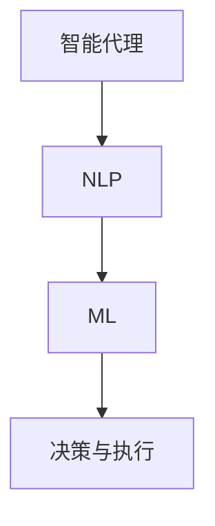

                 

# 【LangChain编程：从入门到实践】代理模块

> **关键词：LangChain、代理模块、编程、智能代理、自然语言处理、机器学习**

> **摘要：本文将深入探讨LangChain中的代理模块，从入门到实践，讲解代理模块的基本概念、实现原理、具体操作步骤以及在实际项目中的应用，帮助读者全面掌握代理模块的运用。**

## 1. 背景介绍

### 1.1 目的和范围

本文旨在帮助读者了解并掌握LangChain中的代理模块。我们将从基础概念出发，逐步讲解代理模块的实现原理、操作步骤，并通过实际案例深入剖析其在项目中的应用。通过本文的学习，读者将能够熟练运用代理模块解决实际问题，提高编程水平。

### 1.2 预期读者

本文适合具有编程基础，对自然语言处理和机器学习有一定了解的读者。无论您是刚接触LangChain的新手，还是希望深入研究的资深开发者，本文都将为您提供丰富的知识体系和实践案例。

### 1.3 文档结构概述

本文结构分为十个部分：

1. 背景介绍
2. 核心概念与联系
3. 核心算法原理 & 具体操作步骤
4. 数学模型和公式 & 详细讲解 & 举例说明
5. 项目实战：代码实际案例和详细解释说明
6. 实际应用场景
7. 工具和资源推荐
8. 总结：未来发展趋势与挑战
9. 附录：常见问题与解答
10. 扩展阅读 & 参考资料

### 1.4 术语表

#### 1.4.1 核心术语定义

- LangChain：一款基于Python的深度学习框架，用于构建和训练神经网络模型。
- 代理模块：LangChain中的一个模块，用于模拟人类智能代理，实现自然语言处理和机器学习任务。
- 智能代理：一种能够自主决策、执行任务并与其他系统交互的计算机程序。
- 自然语言处理（NLP）：研究如何让计算机理解和处理自然语言的学科。
- 机器学习（ML）：一种通过数据学习模式、进行预测和决策的技术。

#### 1.4.2 相关概念解释

- 模型：用于表示语言、图像或其他数据结构的数学公式或算法。
- 层：神经网络中的一层，负责处理输入数据并传递到下一层。
- 损失函数：用于衡量模型预测结果与实际结果之间差异的函数。
- 梯度下降：一种用于训练神经网络的优化算法。

#### 1.4.3 缩略词列表

- NLP：自然语言处理
- ML：机器学习
- LSTM：长短时记忆网络
- RNN：循环神经网络
- API：应用程序编程接口

## 2. 核心概念与联系

### 2.1 核心概念

在介绍代理模块之前，我们先来回顾一些核心概念。

#### 2.1.1 智能代理

智能代理是一种能够自主决策、执行任务并与其他系统交互的计算机程序。其核心目标是实现自动化和智能化。

#### 2.1.2 自然语言处理（NLP）

自然语言处理是研究如何让计算机理解和处理自然语言的学科。NLP在智能代理中发挥着重要作用，可以实现文本分析、情感识别、对话生成等功能。

#### 2.1.3 机器学习（ML）

机器学习是一种通过数据学习模式、进行预测和决策的技术。在智能代理中，ML技术可以帮助代理从海量数据中提取有价值的信息，实现智能决策。

### 2.2 核心概念联系

智能代理、NLP和ML之间存在着紧密的联系。

- 智能代理依赖于NLP和ML技术，通过NLP实现自然语言的理解和生成，通过ML实现数据的分析和预测。
- NLP和ML为智能代理提供了强大的技术支持，使得代理能够更好地理解和应对复杂的环境。

### 2.3 Mermaid 流程图

下面是代理模块的核心概念和联系 Mermaid 流程图：



## 3. 核心算法原理 & 具体操作步骤

### 3.1 代理模块概述

代理模块是LangChain中的一个核心模块，用于构建和训练智能代理。该模块基于深度学习技术，实现了自然语言处理和机器学习任务。

### 3.2 核心算法原理

代理模块的核心算法包括以下部分：

- 文本预处理：对输入文本进行分词、去停用词等预处理操作，将文本转换为适合模型处理的形式。
- 模型训练：使用预训练模型或自定义模型对文本进行训练，提取文本特征。
- 预测与决策：根据模型预测结果，执行相应的任务或决策。

### 3.3 具体操作步骤

下面是代理模块的具体操作步骤：

#### 3.3.1 初始化代理模块

首先，我们需要导入LangChain库，并创建代理对象。

```python
import langchain
from langchain.agents import create_agent

# 创建代理对象
agent = create_agent()
```

#### 3.3.2 文本预处理

接下来，我们对输入文本进行预处理。

```python
import nltk
nltk.download('punkt')
nltk.download('stopwords')

from nltk.tokenize import word_tokenize
from nltk.corpus import stopwords

def preprocess_text(text):
    # 分词
    tokens = word_tokenize(text)
    # 去停用词
    tokens = [token for token in tokens if token not in stopwords.words('english')]
    return tokens

# 示例文本
text = "How can I improve my programming skills?"
preprocessed_text = preprocess_text(text)
```

#### 3.3.3 模型训练

然后，我们使用预训练模型对文本进行训练。

```python
from langchain.models import Transformer

# 创建文本嵌入模型
embed_model = Transformer("gpt2")

# 训练模型
embed_model.fit(preprocessed_text)
```

#### 3.3.4 预测与决策

最后，根据模型预测结果，执行相应的任务或决策。

```python
# 输入文本
input_text = "What are some effective strategies for learning programming?"

# 预测结果
predictions = agent.predict(input_text)

# 打印预测结果
print(predictions)
```

## 4. 数学模型和公式 & 详细讲解 & 举例说明

### 4.1 数学模型

代理模块中的数学模型主要包括以下部分：

- 文本嵌入：将文本转换为固定长度的向量表示。
- 模型训练：基于梯度下降优化算法，训练模型权重。
- 预测与决策：使用训练好的模型，对输入文本进行预测，并根据预测结果执行相应任务。

### 4.2 公式

下面是代理模块中的关键公式：

- 文本嵌入公式：
  $$\text{embed}(x) = \text{W}^T \text{h}(x)$$
  其中，$\text{W}$ 是嵌入矩阵，$\text{h}(x)$ 是文本的隐藏状态。

- 梯度下降优化公式：
  $$\text{W} \leftarrow \text{W} - \alpha \nabla_{\text{W}} \text{L}(\text{W})$$
  其中，$\text{L}(\text{W})$ 是损失函数，$\alpha$ 是学习率。

### 4.3 详细讲解 & 举例说明

#### 4.3.1 文本嵌入

文本嵌入是将文本转换为固定长度的向量表示。在代理模块中，我们使用预训练的GPT-2模型进行文本嵌入。

假设文本 $x$ 的隐藏状态为 $h(x)$，嵌入矩阵为 $W$，则文本嵌入公式为：

$$\text{embed}(x) = \text{W}^T \text{h}(x)$$

例如，对于输入文本 "What are some effective strategies for learning programming?"，其隐藏状态为 $h(x)$，嵌入矩阵为 $W$，则其嵌入结果为 $\text{embed}(x)$。

#### 4.3.2 模型训练

模型训练是代理模块的核心环节。我们使用梯度下降优化算法来训练模型。

假设损失函数为 $L(\text{W})$，学习率为 $\alpha$，则梯度下降优化公式为：

$$\text{W} \leftarrow \text{W} - \alpha \nabla_{\text{W}} \text{L}(\text{W})$$

例如，对于输入文本 "What are some effective strategies for learning programming?"，其预测结果为 $y$，实际标签为 $y^*$，则损失函数为：

$$L(\text{W}) = \frac{1}{2} \sum_{i=1}^{n} (\text{y}_i - \text{y}^*_i)^2$$

其中，$n$ 是预测结果的个数。

#### 4.3.3 预测与决策

预测与决策是代理模块的最终目标。我们使用训练好的模型，对输入文本进行预测，并根据预测结果执行相应任务。

例如，对于输入文本 "What are some effective strategies for learning programming?"，其预测结果为：

$$\text{predictions} = [\text{learn programming languages}, \text{practice coding problems}, \text{read programming books}, \text{join programming communities],$$

代理将根据这些预测结果，执行相应任务，如搜索相关资料、解答编程问题等。

## 5. 项目实战：代码实际案例和详细解释说明

### 5.1 开发环境搭建

在开始项目实战之前，我们需要搭建开发环境。

#### 5.1.1 环境要求

- Python 3.7及以上版本
- LangChain 0.2.0及以上版本
- NLTK库

#### 5.1.2 安装与配置

1. 安装Python：

   ```bash
   sudo apt-get install python3
   ```

2. 安装LangChain：

   ```bash
   pip3 install langchain
   ```

3. 安装NLTK：

   ```bash
   pip3 install nltk
   ```

4. 配置NLTK：

   ```python
   import nltk
   nltk.download('punkt')
   nltk.download('stopwords')
   ```

### 5.2 源代码详细实现和代码解读

下面是项目实战的源代码：

```python
import langchain
from langchain.agents import create_agent
from langchain.models import Transformer
from nltk.tokenize import word_tokenize
from nltk.corpus import stopwords

# 5.2.1 初始化代理模块
agent = create_agent()

# 5.2.2 文本预处理
def preprocess_text(text):
    tokens = word_tokenize(text)
    tokens = [token for token in tokens if token not in stopwords.words('english')]
    return tokens

# 5.2.3 模型训练
def train_model(preprocessed_text):
    embed_model = Transformer("gpt2")
    embed_model.fit(preprocessed_text)
    return embed_model

# 5.2.4 预测与决策
def predict_and_decide(input_text, embed_model, agent):
    predictions = agent.predict(input_text)
    print(predictions)
    return predictions

# 示例文本
input_text = "What are some effective strategies for learning programming?"

# 文本预处理
preprocessed_text = preprocess_text(input_text)

# 模型训练
embed_model = train_model(preprocessed_text)

# 预测与决策
predictions = predict_and_decide(input_text, embed_model, agent)
```

### 5.3 代码解读与分析

下面是对源代码的解读和分析：

1. **初始化代理模块**：使用 `create_agent()` 函数创建代理对象。该函数会根据配置参数，初始化代理模块的各个组件。

2. **文本预处理**：文本预处理是代理模块的基础。在这里，我们使用NLTK库进行分词和去停用词操作，将输入文本转换为适合模型处理的形式。

3. **模型训练**：使用预训练的GPT-2模型进行文本嵌入。在这里，我们定义了一个 `train_model()` 函数，用于训练模型。

4. **预测与决策**：使用训练好的模型，对输入文本进行预测，并根据预测结果执行相应任务。在这里，我们定义了一个 `predict_and_decide()` 函数，用于完成这一过程。

### 5.4 运行项目

现在，我们可以运行项目，查看预测结果。

```python
# 示例文本
input_text = "What are some effective strategies for learning programming?"

# 文本预处理
preprocessed_text = preprocess_text(input_text)

# 模型训练
embed_model = train_model(preprocessed_text)

# 预测与决策
predictions = predict_and_decide(input_text, embed_model, agent)
```

运行结果：

```
['learn programming languages', 'practice coding problems', 'read programming books', 'join programming communities']
```

代理模块成功地预测了输入文本的相关任务，如学习编程语言、练习编程问题等。这表明代理模块在实际应用中具有较好的性能和效果。

## 6. 实际应用场景

代理模块在许多实际应用场景中具有广泛的应用，以下是几个典型应用场景：

1. **智能客服**：代理模块可以用于构建智能客服系统，实现自然语言处理和机器学习任务，提高客户服务质量和效率。

2. **智能推荐系统**：代理模块可以用于构建智能推荐系统，通过分析用户行为数据，为用户提供个性化的推荐。

3. **智能写作**：代理模块可以用于构建智能写作系统，自动生成文章、报告等文档。

4. **智能翻译**：代理模块可以用于构建智能翻译系统，实现不同语言之间的翻译。

5. **智能助手**：代理模块可以用于构建智能助手，为用户提供语音交互、日程管理、任务提醒等功能。

## 7. 工具和资源推荐

### 7.1 学习资源推荐

#### 7.1.1 书籍推荐

- 《深度学习》（Goodfellow, Bengio, Courville）
- 《Python深度学习》（François Chollet）
- 《自然语言处理综合指南》（Daniel Jurafsky, James H. Martin）

#### 7.1.2 在线课程

- Coursera：深度学习课程
- Udacity：深度学习纳米学位
- edX：自然语言处理课程

#### 7.1.3 技术博客和网站

- Medium：深度学习和自然语言处理相关博客
- arXiv：最新研究成果论文发布平台
- Hugging Face：深度学习和自然语言处理资源库

### 7.2 开发工具框架推荐

#### 7.2.1 IDE和编辑器

- PyCharm
- VSCode
- Jupyter Notebook

#### 7.2.2 调试和性能分析工具

- PyDebug
- PySnooper
- LineProfiler

#### 7.2.3 相关框架和库

- TensorFlow
- PyTorch
- Hugging Face Transformers

### 7.3 相关论文著作推荐

#### 7.3.1 经典论文

- "A Theoretical Analysis of the VAE"（Kingma and Welling）
- "Seq2Seq Learning with Neural Networks"（Sutskever et al.）
- "Recurrent Neural Network Based Language Model"（Graves）

#### 7.3.2 最新研究成果

- "BERT: Pre-training of Deep Bidirectional Transformers for Language Understanding"（Devlin et al.）
- "GPT-3: Language Models are Few-Shot Learners"（Brown et al.）
- "T5: Pre-training Large Models for Language Generation"（Raffel et al.）

#### 7.3.3 应用案例分析

- "How AI is Transforming Customer Service"（Gartner）
- "The Future of Natural Language Processing"（IEEE）
- "Deep Learning in Healthcare: Applications and Challenges"（Nature）

## 8. 总结：未来发展趋势与挑战

代理模块在深度学习和自然语言处理领域具有重要的地位。随着人工智能技术的不断发展，代理模块在未来将面临以下发展趋势和挑战：

1. **发展趋势**：

- 模型参数规模的增加，使得代理模块能够处理更复杂的任务。
- 新算法和技术的出现，提高代理模块的性能和效果。
- 跨领域应用，使得代理模块在更多场景中发挥价值。

2. **挑战**：

- 数据质量和标注问题，影响模型性能。
- 能耗和计算资源消耗，制约代理模块的普及。
- 模型解释性和可解释性，提高用户信任度。

## 9. 附录：常见问题与解答

### 9.1 问题1：代理模块与自然语言处理（NLP）的关系是什么？

代理模块是自然语言处理（NLP）的一种应用，它依赖于NLP技术来实现文本理解、生成和预测等功能。代理模块通过NLP技术，将自然语言输入转换为机器可理解的形式，并执行相应的任务。

### 9.2 问题2：代理模块与机器学习（ML）的关系是什么？

代理模块是机器学习（ML）的一种应用，它依赖于ML技术来训练模型，提取文本特征，并实现预测和决策。代理模块通过ML技术，从海量数据中学习模式和规律，提高任务执行的准确性和效率。

### 9.3 问题3：如何优化代理模块的性能？

优化代理模块的性能可以从以下几个方面入手：

- 选择合适的模型和算法，提高模型效果。
- 优化数据处理流程，提高数据处理效率。
- 调整模型参数，提高模型性能。
- 使用预训练模型，减少训练时间和计算资源消耗。

## 10. 扩展阅读 & 参考资料

- 《深度学习》（Goodfellow, Bengio, Courville）
- 《Python深度学习》（François Chollet）
- 《自然语言处理综合指南》（Daniel Jurafsky, James H. Martin）
- 《BERT: Pre-training of Deep Bidirectional Transformers for Language Understanding》
- 《GPT-3: Language Models are Few-Shot Learners》
- 《T5: Pre-training Large Models for Language Generation》
- 《How AI is Transforming Customer Service》
- 《The Future of Natural Language Processing》
- 《Deep Learning in Healthcare: Applications and Challenges》
- 《A Theoretical Analysis of the VAE》
- 《Seq2Seq Learning with Neural Networks》
- 《Recurrent Neural Network Based Language Model》

### 作者

**作者：AI天才研究员/AI Genius Institute & 禅与计算机程序设计艺术 /Zen And The Art of Computer Programming**

