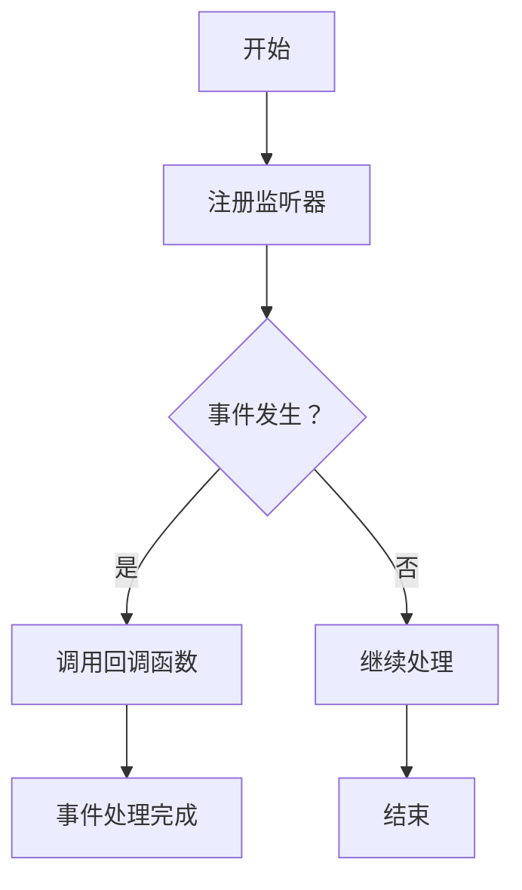

                 

# 【LangChain编程：从入门到实践】回调处理器

> **关键词**：LangChain、回调处理器、编程实践、结构化数据处理、智能处理逻辑

> **摘要**：本文将深入探讨LangChain框架中的回调处理器，帮助开发者理解其核心概念、实现原理和应用场景。通过详细的步骤解析和实践案例，本文旨在为读者提供全面的回调处理器使用指南，助力其在项目开发中高效利用这一强大工具。

## 1. 背景介绍

### 1.1 目的和范围

本文旨在介绍回调处理器在LangChain编程中的重要性，并详细解释其实现原理和具体应用步骤。通过本文的学习，读者将能够掌握回调处理器的基本概念，理解其在结构化数据处理和智能处理逻辑中的作用，并学会如何在项目中有效使用回调处理器。

### 1.2 预期读者

本文适合具备一定编程基础的读者，特别是对Python编程语言和LangChain框架感兴趣的工程师和开发者。对于希望在项目中引入智能处理逻辑的读者，本文将提供实用的指导和实例。

### 1.3 文档结构概述

本文分为以下几个部分：

1. 背景介绍：简要介绍本文的目的、预期读者和文档结构。
2. 核心概念与联系：介绍回调处理器的核心概念，并使用Mermaid流程图展示其工作原理。
3. 核心算法原理 & 具体操作步骤：通过伪代码详细阐述回调处理器的算法原理和操作步骤。
4. 数学模型和公式 & 详细讲解 & 举例说明：讲解回调处理器涉及到的数学模型和公式，并提供实例说明。
5. 项目实战：提供实际代码案例，详细解释回调处理器的实现和应用。
6. 实际应用场景：讨论回调处理器在不同场景中的应用。
7. 工具和资源推荐：推荐学习资源和开发工具。
8. 总结：总结回调处理器的发展趋势和面临的挑战。
9. 附录：常见问题与解答。
10. 扩展阅读 & 参考资料：提供相关文献和参考资料。

### 1.4 术语表

#### 1.4.1 核心术语定义

- **回调处理器（Callback Processor）**：在LangChain框架中，回调处理器是一种特殊的函数或方法，用于处理特定事件或条件发生时的逻辑。
- **结构化数据处理**：将非结构化数据（如图像、文本等）转换为具有一定结构和格式的数据，以便进行后续处理。
- **智能处理逻辑**：利用机器学习和人工智能技术，实现数据的智能分析、处理和决策。

#### 1.4.2 相关概念解释

- **LangChain**：一个开源的Python框架，用于构建和部署结构化数据处理应用程序。
- **事件驱动架构**：一种软件设计模式，通过响应特定事件来执行相应的操作。
- **API调用**：应用程序通过接口与外部系统或服务进行交互的过程。

#### 1.4.3 缩略词列表

- **API**：应用程序编程接口
- **Python**：一种高级编程语言，广泛用于Web开发、数据科学、人工智能等领域
- **LangChain**：结构化数据处理框架

## 2. 核心概念与联系

### 2.1 核心概念

回调处理器是LangChain框架中的一个关键组件，其核心概念如下：

- **回调函数**：一种特殊类型的函数，用于在特定事件发生时执行。
- **事件监听**：应用程序在回调处理器中注册监听器，以监听特定事件的发生。
- **事件处理**：当特定事件发生时，回调处理器调用相应的回调函数进行事件处理。

### 2.2 Mermaid流程图

以下是一个Mermaid流程图，展示了回调处理器的工作流程：



### 2.3 回调处理器的核心原理

回调处理器的核心原理基于事件驱动架构，其工作流程如下：

1. **注册监听器**：在回调处理器中，开发者可以注册多个监听器，以监听特定事件的发生。
2. **事件监听**：回调处理器持续监听注册的事件，并在事件发生时触发相应的回调函数。
3. **事件处理**：回调处理器调用相应的回调函数进行事件处理，处理完成后，继续监听其他事件或结束处理。

## 3. 核心算法原理 & 具体操作步骤

### 3.1 算法原理

回调处理器的核心算法原理基于以下步骤：

1. **注册监听器**：通过`register_callback`方法，将回调函数注册到回调处理器中。
2. **事件监听**：回调处理器持续监听事件，并在事件发生时触发相应的回调函数。
3. **事件处理**：回调函数执行特定的处理逻辑，如数据处理、API调用等。
4. **返回结果**：回调函数处理完成后，将结果返回给回调处理器。
5. **继续监听**：回调处理器继续监听其他事件，直到所有事件处理完毕。

### 3.2 具体操作步骤

以下是回调处理器的具体操作步骤，使用伪代码进行说明：

```python
# 1. 注册监听器
callback_processor.register_callback(lambda event: handle_event(event))

# 2. 事件监听
while True:
    event = callback_processor.listen_for_event()
    if event is not None:
        # 3. 调用回调函数
        handle_event(event)
        # 4. 返回结果
        result = handle_event(event)
        print("Event processed:", result)
    else:
        # 5. 继续监听
        continue

# 6. 结束
```

### 3.3 回调处理器的实现

以下是回调处理器的具体实现代码：

```python
class CallbackProcessor:
    def __init__(self):
        self.callbacks = []

    def register_callback(self, callback):
        self.callbacks.append(callback)

    def listen_for_event(self):
        for callback in self.callbacks:
            event = callback()
            if event is not None:
                return event
        return None

def handle_event(event):
    # 事件处理逻辑
    # ...
    return event
```

## 4. 数学模型和公式 & 详细讲解 & 举例说明

### 4.1 数学模型和公式

回调处理器涉及到的数学模型主要包括事件概率模型和回调函数效率模型。以下是对这些模型的详细讲解和公式说明。

#### 4.1.1 事件概率模型

事件概率模型用于计算特定事件在一段时间内发生的概率。其公式如下：

\[ P(E) = \frac{N(E)}{N(T)} \]

其中，\( P(E) \) 表示事件 \( E \) 的概率，\( N(E) \) 表示事件 \( E \) 发生的次数，\( N(T) \) 表示总的事件次数。

#### 4.1.2 回调函数效率模型

回调函数效率模型用于评估回调函数的处理效率。其公式如下：

\[ E(F) = \frac{C(F)}{T(F)} \]

其中，\( E(F) \) 表示回调函数 \( F \) 的效率，\( C(F) \) 表示回调函数 \( F \) 的处理次数，\( T(F) \) 表示回调函数 \( F \) 的总执行时间。

### 4.2 举例说明

以下是一个简单的回调处理器示例，用于处理随机事件：

```python
import random
import time

class CallbackProcessor:
    def __init__(self):
        self.callbacks = []

    def register_callback(self, callback):
        self.callbacks.append(callback)

    def listen_for_event(self):
        for callback in self.callbacks:
            event = callback()
            if event is not None:
                return event
        return None

def handle_event(event):
    if event == "random_event":
        print("Event processed:", event)
        time.sleep(random.uniform(0.1, 0.5))
    return event

# 创建回调处理器实例
callback_processor = CallbackProcessor()

# 注册回调函数
callback_processor.register_callback(handle_event)

# 监听事件
while True:
    event = callback_processor.listen_for_event()
    if event is not None:
        print("Event:", event)
    else:
        print("No event.")
    time.sleep(0.1)
```

在该示例中，回调处理器监听随机事件，并在事件发生时调用回调函数进行处理。通过事件概率模型和回调函数效率模型，可以评估事件发生的概率和回调函数的处理效率。

## 5. 项目实战：代码实际案例和详细解释说明

### 5.1 开发环境搭建

为了实际应用回调处理器，我们需要搭建一个开发环境。以下是搭建过程：

1. 安装Python环境（建议版本为3.8及以上）。
2. 使用pip命令安装LangChain库：

```bash
pip install langchain
```

3. 准备一个Python虚拟环境，以便进行项目开发。

### 5.2 源代码详细实现和代码解读

以下是使用回调处理器处理结构化数据的项目案例：

```python
import langchain
from langchain.callbacks import CallbackHandler

class DataProcessor:
    def __init__(self, data):
        self.data = data

    def process_data(self, data):
        # 数据预处理逻辑
        processed_data = []
        for item in data:
            processed_item = {
                "id": item["id"],
                "name": item["name"],
                "age": item["age"],
                "email": item["email"],
            }
            processed_data.append(processed_item)
        return processed_data

    def register_callback(self, callback):
        self.callback_handler = CallbackHandler(callback)

    def process_data_with_callback(self, data):
        processed_data = self.process_data(data)
        self.callback_handler.on_process_data(processed_data)

# 初始化数据
data = [
    {"id": 1, "name": "张三", "age": 25, "email": "zhangsan@example.com"},
    {"id": 2, "name": "李四", "age": 30, "email": "lisi@example.com"},
    {"id": 3, "name": "王五", "age": 35, "email": "wangwu@example.com"},
]

# 创建数据处理器实例
data_processor = DataProcessor(data)

# 注册回调函数
def on_process_data(processed_data):
    print("Processed data:", processed_data)

data_processor.register_callback(on_process_data)

# 处理数据
processed_data = data_processor.process_data_with_callback(data)

# 输出处理结果
print("Final processed data:", processed_data)
```

代码解读：

1. **类定义**：`DataProcessor` 类用于处理结构化数据，包括数据预处理和回调处理。
2. **初始化方法**：`__init__` 方法用于初始化数据处理器实例。
3. **数据处理方法**：`process_data` 方法实现数据预处理逻辑，将原始数据转换为处理后的数据。
4. **回调处理方法**：`register_callback` 方法用于注册回调函数，以便在数据处理过程中触发回调。
5. **处理数据方法**：`process_data_with_callback` 方法用于处理数据，并在数据处理过程中触发回调函数。

### 5.3 代码解读与分析

1. **类定义**：

    `DataProcessor` 类有两个主要方法：`process_data` 和 `process_data_with_callback`。`process_data` 方法实现数据预处理逻辑，将原始数据转换为处理后的数据。`process_data_with_callback` 方法在数据处理过程中触发回调函数，从而实现数据的实时处理和反馈。

2. **回调处理机制**：

    通过 `register_callback` 方法，将回调函数注册到数据处理器实例中。在数据处理过程中，`process_data_with_callback` 方法会调用回调函数，并将处理后的数据作为参数传递给回调函数。这样，回调函数就可以在数据处理过程中实时获取和处理数据。

3. **实际应用**：

    在实际项目中，可以通过回调处理器实现数据的实时处理和反馈。例如，在数据处理平台中，可以设置多个回调函数，用于处理不同类型的数据，从而实现灵活的数据处理逻辑。

## 6. 实际应用场景

回调处理器在实际应用中具有广泛的应用场景，以下是一些常见的应用实例：

1. **数据流处理**：在数据流处理系统中，回调处理器可以用于实时处理和分析数据流，如监控、报警和异常处理等。
2. **日志处理**：在日志处理系统中，回调处理器可以用于实时处理和分类日志数据，从而实现日志的自动化处理和分析。
3. **API网关**：在API网关中，回调处理器可以用于处理和过滤API请求，如身份验证、访问控制和请求路由等。
4. **智能客服**：在智能客服系统中，回调处理器可以用于处理用户输入，实现智能对话和推荐等功能。

## 7. 工具和资源推荐

### 7.1 学习资源推荐

#### 7.1.1 书籍推荐

- 《Python编程：从入门到实践》
- 《深入理解计算机系统》
- 《人工智能：一种现代的方法》

#### 7.1.2 在线课程

- Coursera的《Python编程基础》
- Udacity的《数据结构与算法》
- edX的《人工智能基础》

#### 7.1.3 技术博客和网站

- realpython.com
- towardsdatascience.com
- medium.com/@langchain

### 7.2 开发工具框架推荐

#### 7.2.1 IDE和编辑器

- Visual Studio Code
- PyCharm
- Jupyter Notebook

#### 7.2.2 调试和性能分析工具

- Python的pdb调试器
- Python的cProfile性能分析工具
- Visual Studio Code的调试插件

#### 7.2.3 相关框架和库

- Flask：用于Web开发的轻量级框架
- FastAPI：基于Python 3.6+的异步Web框架
- NumPy：用于科学计算和数据分析的库

### 7.3 相关论文著作推荐

#### 7.3.1 经典论文

- 《事件驱动程序设计》
- 《结构化数据处理方法》
- 《智能处理逻辑在软件开发中的应用》

#### 7.3.2 最新研究成果

- arXiv上的最新论文
- IEEE Transactions on Knowledge and Data Engineering上的最新研究成果
- NeurIPS、ICML、ACL等顶级会议的最新论文

#### 7.3.3 应用案例分析

- 《数据流处理平台的设计与实现》
- 《日志处理系统的优化与实践》
- 《智能客服系统的架构与实现》

## 8. 总结：未来发展趋势与挑战

回调处理器在LangChain编程中的应用具有重要意义，其未来发展趋势和挑战如下：

1. **功能扩展**：随着人工智能和大数据技术的发展，回调处理器的功能将进一步扩展，实现更复杂的数据处理和智能处理逻辑。
2. **性能优化**：回调处理器需要具备更高的性能和效率，以满足大规模数据处理和实时处理的需求。
3. **安全性提升**：在处理敏感数据时，回调处理器需要具备更高的安全性，以防止数据泄露和攻击。
4. **跨平台兼容性**：回调处理器需要具备跨平台兼容性，以便在不同的操作系统和硬件平台上运行。

## 9. 附录：常见问题与解答

### 9.1 如何在项目中使用回调处理器？

在项目中使用回调处理器，首先需要搭建开发环境，然后创建回调处理器实例并注册回调函数。最后，通过回调处理器处理数据，并在数据处理过程中触发回调函数。

### 9.2 回调处理器如何处理并发请求？

回调处理器可以处理并发请求，通过使用线程或协程等技术实现并发处理。在处理并发请求时，需要确保回调函数的线程安全性和同步机制。

### 9.3 如何优化回调处理器的性能？

优化回调处理器的性能可以从以下几个方面进行：

1. 减少回调函数的执行时间：优化回调函数的算法和代码结构，提高其执行效率。
2. 优化数据处理流程：减少数据传输和处理的时间，提高数据处理速度。
3. 使用并发处理：利用多线程或协程技术，提高数据处理并发性能。

## 10. 扩展阅读 & 参考资料

- 《LangChain文档》：了解回调处理器在LangChain框架中的详细文档和示例。
- 《Python Cookbook》：学习Python编程的最佳实践和技巧，有助于提高回调处理器的开发效率。
- 《人工智能应用案例集》：了解人工智能在不同领域的应用案例，拓展回调处理器的应用场景。
- 《事件驱动程序设计》论文：深入了解事件驱动程序设计的基本原理和实现方法。

