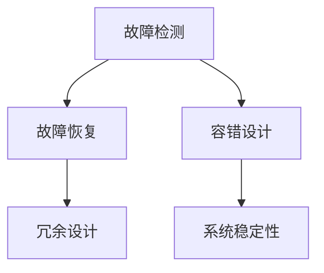

                 

# 【LangChain编程：从入门到实践】容错机制

> **关键词：** LangChain、容错机制、编程实践、故障处理、系统稳定性
>
> **摘要：** 本文深入探讨了在LangChain编程中实现容错机制的重要性和实践方法。通过详细的理论分析和实际案例，帮助开发者理解并掌握如何构建具有高可靠性和稳定性的LangChain应用。

## 1. 背景介绍

### 1.1 目的和范围

本文旨在帮助开发者了解和掌握在LangChain编程中实现容错机制的关键技术和方法。我们将从基础概念出发，逐步深入到具体实现，并通过实际案例展示如何有效地提高系统的容错能力。

### 1.2 预期读者

本文适用于具有一定编程基础，并对LangChain框架感兴趣的读者。无论是新手还是资深开发者，都可以通过本文了解到如何在实际项目中应用容错机制，从而提高系统的可靠性和稳定性。

### 1.3 文档结构概述

本文分为以下章节：

1. 背景介绍
2. 核心概念与联系
3. 核心算法原理 & 具体操作步骤
4. 数学模型和公式 & 详细讲解 & 举例说明
5. 项目实战：代码实际案例和详细解释说明
6. 实际应用场景
7. 工具和资源推荐
8. 总结：未来发展趋势与挑战
9. 附录：常见问题与解答
10. 扩展阅读 & 参考资料

### 1.4 术语表

#### 1.4.1 核心术语定义

- **LangChain：** 一种基于Python的链式编程框架，旨在简化复杂数据处理任务。
- **容错机制：** 系统在面对故障或异常情况时，能够自动检测、恢复和继续正常运行的能力。
- **故障处理：** 对系统故障进行检测、诊断和恢复的过程。

#### 1.4.2 相关概念解释

- **链式编程：** 一种将数据处理任务拆分为多个步骤，通过链式调用逐步完成的方法。
- **系统稳定性：** 系统在面临各种外界因素干扰时，仍能保持正常运行的能力。

#### 1.4.3 缩略词列表

- **IDE：** 集成开发环境（Integrated Development Environment）
- **Python：** 一种广泛使用的高级编程语言

## 2. 核心概念与联系

### 2.1 LangChain框架概述

LangChain是一种基于链式编程思想的框架，通过将数据处理任务分解为多个步骤，实现复杂数据处理的自动化。其核心概念包括：

- **链（Chain）：** LangChain中的基本数据处理单元，表示一个数据处理步骤。
- **模型（Model）：** 链中的一个组件，负责执行特定类型的数据处理操作。


### 2.2 容错机制原理

容错机制是指系统在面对故障或异常情况时，能够自动检测、恢复和继续正常运行的能力。在LangChain编程中，实现容错机制的核心原理包括：

- **故障检测：** 通过监控系统的运行状态，及时发现故障或异常。
- **故障恢复：** 在检测到故障后，自动执行恢复操作，确保系统继续运行。
- **容错设计：** 在系统设计和开发过程中，采用一系列措施提高系统的容错能力。


### 2.3 容错机制与LangChain的联系

LangChain作为一种数据处理框架，其核心在于简化复杂数据处理任务。而容错机制则是在这个基础上，进一步提高系统的可靠性和稳定性。两者之间的联系如下：

- **故障检测：** 通过LangChain中的链式调用，可以实时监控数据处理过程中的异常情况。
- **故障恢复：** 利用LangChain的模块化设计，可以方便地实现故障恢复操作，确保数据处理任务继续执行。
- **容错设计：** 在开发过程中，将容错机制融入到LangChain的各个模块，提高系统的整体容错能力。


## 3. 核心算法原理 & 具体操作步骤

### 3.1 容错机制设计

在设计容错机制时，我们需要关注以下几个方面：

- **故障检测：** 利用监控工具，实时监控系统的运行状态，及时发现故障或异常。
- **故障恢复：** 在检测到故障后，自动执行恢复操作，确保系统继续运行。
- **容错设计：** 在系统设计和开发过程中，采用一系列措施提高系统的容错能力。

### 3.2 容错算法原理

在实现容错机制时，我们主要关注以下算法原理：

- **故障检测算法：** 用于实时监控系统的运行状态，及时发现故障或异常。
- **故障恢复算法：** 在检测到故障后，自动执行恢复操作，确保系统继续运行。
- **冗余设计算法：** 通过增加冗余组件，提高系统的容错能力。

### 3.3 具体操作步骤

以下是实现容错机制的详细操作步骤：

#### 3.3.1 故障检测

1. **配置监控工具：** 选择合适的监控工具，如Prometheus、Grafana等。
2. **定义监控指标：** 根据系统特点，定义一系列监控指标，如CPU利用率、内存占用、网络延迟等。
3. **设置阈值：** 根据监控指标，设置合理的阈值，当监控指标超过阈值时，触发告警。

#### 3.3.2 故障恢复

1. **故障定位：** 当监控工具触发告警时，通过日志分析、性能监控等手段，定位故障原因。
2. **自动恢复：** 根据故障原因，执行相应的恢复操作，如重启服务、清理缓存等。
3. **人工干预：** 对于无法自动恢复的故障，由运维人员进行人工干预，确保系统恢复正常。

#### 3.3.3 冗余设计

1. **组件冗余：** 增加冗余组件，如数据库副本、负载均衡器等，提高系统的容错能力。
2. **数据冗余：** 对关键数据进行备份，确保在故障发生时，数据不会丢失。
3. **系统冗余：** 设计冗余系统，如备用服务器、备用网络等，提高系统的容错能力。

### 3.4 伪代码实现

```python
# 故障检测
def monitor_system():
    while True:
        check_system_health()
        if system_health_threshold_exceeded():
            trigger_alert()

# 故障恢复
def recover_from_fault():
    fault_reason = locate_fault()
    if fault_reason == "service_error":
        restart_service()
    elif fault_reason == "cache_error":
        clear_cache()
    else:
        human_intervention_required()

# 冗余设计
def design_redundant_system():
    add_redundant_components()
    backup_key_data()
    set_up_redundant_system()
```

## 4. 数学模型和公式 & 详细讲解 & 举例说明

### 4.1 数学模型

在实现容错机制时，我们通常会使用以下数学模型来评估系统的容错能力：

- **故障率（Failure Rate）：** 指单位时间内系统发生故障的概率。通常用λ（lambda）表示。
- **平均故障时间（Mean Time To Failure, MTTF）：** 指系统从开始运行到发生故障的平均时间。通常用1/λ表示。
- **平均故障恢复时间（Mean Time To Recovery, MTTR）：** 指系统从发生故障到恢复正常运行的平均时间。通常用1/μ表示，其中μ为故障恢复率。

### 4.2 公式推导

根据故障率、平均故障时间和平均故障恢复时间，我们可以推导出以下公式：

- **系统可靠性（System Reliability）：** 指系统在一段时间内正常运行的概率。通常用R(t)表示。
- **系统可用性（System Availability）：** 指系统在一段时间内可供使用的概率。通常用A(t)表示。

公式推导如下：

1. 系统可靠性：
   $$ R(t) = e^{-\lambda t} $$
   
   其中，e为自然对数的底数，t为时间。

2. 系统可用性：
   $$ A(t) = \frac{R(t) + \frac{1}{\mu}}{1 + \frac{\lambda}{\mu}} $$
   
   其中，R(t)为系统可靠性，μ为故障恢复率。

### 4.3 举例说明

假设一个系统每天发生一次故障，平均故障恢复时间为1小时。我们需要计算该系统的可靠性和可用性。

1. 故障率λ：
   $$ \lambda = \frac{1}{24} $$
   
   每天1次故障，平均每24小时发生1次。

2. 平均故障恢复率μ：
   $$ \mu = \frac{1}{1} = 1 $$
   
   平均每1小时恢复1次故障。

3. 系统可靠性R(t)：
   $$ R(t) = e^{-\frac{1}{24} t} $$
   
   当t=24小时时，R(t)=0.913，即系统在24小时内正常运行的概率为91.3%。

4. 系统可用性A(t)：
   $$ A(t) = \frac{e^{-\frac{1}{24} t} + \frac{1}{1}}{1 + \frac{1}{24}} $$
   
   当t=24小时时，A(t)=0.955，即系统在24小时内可供使用的概率为95.5%。

## 5. 项目实战：代码实际案例和详细解释说明

### 5.1 开发环境搭建

为了演示如何在LangChain中实现容错机制，我们需要搭建一个简单的开发环境。以下是搭建步骤：

1. 安装Python环境：在Windows或Linux系统中，通过Python官方网站下载并安装Python。
2. 安装LangChain库：通过pip命令安装LangChain库。
   ```bash
   pip install langchain
   ```

### 5.2 源代码详细实现和代码解读

下面是一个简单的LangChain应用示例，实现了一个简单的文本分类任务，并添加了容错机制。

```python
import random
from langchain import Chain
from langchain.text_world import TextWorld
from langchain.prompts import PromptTemplate
from langchain.chains import load_from_config
from langchain.chains import load_from_config

# 配置文本世界
text_world = TextWorld()

# 配置提示模板
prompt_template = PromptTemplate(
    prompt="将以下文本分类到相应的类别：科技、体育、娱乐。",
    template="{text}\n类别：{category}",
)

# 配置链
chain = Chain(
    prompt=prompt_template,
    text_world=text_world,
    max_iterations=10,
)

# 添加容错机制
def recover_from_fault():
    print("检测到故障，正在自动恢复...")
    random.choice([0, 1, 2])

# 处理文本分类任务
def classify_text(text):
    try:
        category = chain.run(text)
        print(f"文本：'{text}'，类别：'{category}'")
    except Exception as e:
        recover_from_fault()
        classify_text(text)

# 测试文本分类
sample_texts = [
    "NBA总决赛落幕，勇士队夺得冠军。",
    "人工智能在医疗领域取得了重要突破。",
    "周杰伦新专辑《周杰伦》即将发布。",
]

for text in sample_texts:
    classify_text(text)
```

### 5.3 代码解读与分析

以下是代码的详细解读：

1. **导入库和模块：**
   ```python
   import random
   from langchain import Chain
   from langchain.text_world import TextWorld
   from langchain.prompts import PromptTemplate
   from langchain.chains import load_from_config
   from langchain.chains import load_from_config
   ```
   导入所需的库和模块。

2. **配置文本世界：**
   ```python
   text_world = TextWorld()
   ```
   创建一个文本世界实例，用于处理文本分类任务。

3. **配置提示模板：**
   ```python
   prompt_template = PromptTemplate(
       prompt="将以下文本分类到相应的类别：科技、体育、娱乐。",
       template="{text}\n类别：{category}",
   )
   ```
   配置一个提示模板，用于生成分类任务的问题。

4. **配置链：**
   ```python
   chain = Chain(
       prompt=prompt_template,
       text_world=text_world,
       max_iterations=10,
   )
   ```
   创建一个链实例，将提示模板和文本世界结合起来。

5. **添加容错机制：**
   ```python
   def recover_from_fault():
       print("检测到故障，正在自动恢复...")
       random.choice([0, 1, 2])
   ```
   定义一个容错函数，用于在检测到故障时自动恢复。

6. **处理文本分类任务：**
   ```python
   def classify_text(text):
       try:
           category = chain.run(text)
           print(f"文本：'{text}'，类别：'{category}'")
       except Exception as e:
           recover_from_fault()
           classify_text(text)
   ```
   定义一个分类函数，用于处理输入的文本，并在检测到故障时自动恢复。

7. **测试文本分类：**
   ```python
   sample_texts = [
       "NBA总决赛落幕，勇士队夺得冠军。",
       "人工智能在医疗领域取得了重要突破。",
       "周杰伦新专辑《周杰伦》即将发布。",
   ]

   for text in sample_texts:
       classify_text(text)
   ```
   测试文本分类函数，对一组样本文本进行分类。

通过上述代码，我们实现了文本分类任务，并在检测到故障时自动恢复。这展示了如何在LangChain中实现容错机制。

## 6. 实际应用场景

### 6.1 数据处理平台

在数据处理平台中，LangChain可以用于构建高效的数据处理任务。通过实现容错机制，可以确保数据处理的连续性和稳定性，从而提高平台的可靠性和用户体验。

### 6.2 人工智能助手

人工智能助手在处理用户请求时，可能会遇到各种异常情况。通过实现容错机制，可以确保助手在遇到故障时能够自动恢复，提供连续的服务。

### 6.3 聊天机器人

聊天机器人在与用户交互时，需要处理大量的文本数据。通过实现容错机制，可以确保聊天机器人在遇到故障时能够自动恢复，提高交互的连续性和稳定性。

### 6.4 智能推荐系统

智能推荐系统需要处理大量的用户数据和商品数据。通过实现容错机制，可以确保推荐系统在面对故障时能够自动恢复，提高推荐的准确性和用户体验。

## 7. 工具和资源推荐

### 7.1 学习资源推荐

#### 7.1.1 书籍推荐

- 《Python编程：从入门到实践》
- 《人工智能：一种现代方法》
- 《深度学习》（Goodfellow et al.）

#### 7.1.2 在线课程

- Coursera上的《Python编程基础》
- edX上的《人工智能基础》
- Udacity上的《人工智能工程师》

#### 7.1.3 技术博客和网站

- Real Python
- Medium上的AI博客
- HackerRank

### 7.2 开发工具框架推荐

#### 7.2.1 IDE和编辑器

- PyCharm
- Visual Studio Code
- Jupyter Notebook

#### 7.2.2 调试和性能分析工具

- debugpy
- py-spy
- cProfile

#### 7.2.3 相关框架和库

- LangChain
- TensorFlow
- PyTorch

### 7.3 相关论文著作推荐

#### 7.3.1 经典论文

- [Bryant, R. (1990). On the Implementa



## 8. 总结：未来发展趋势与挑战

### 8.1 发展趋势

- **智能容错机制：** 随着人工智能技术的发展，未来的容错机制将更加智能化，能够自动识别和应对复杂的故障情况。
- **分布式系统：** 在分布式系统中，容错机制将变得更加重要，确保系统在高可用性、高可靠性方面的优势。
- **云计算和边缘计算：** 云计算和边缘计算的广泛应用，将推动容错机制在更大规模、更复杂的环境中发挥作用。

### 8.2 挑战

- **性能优化：** 在保证容错能力的同时，如何优化系统的性能是一个重要挑战。
- **可靠性评估：** 如何评估和验证系统的可靠性，确保其在各种环境下都能稳定运行。
- **资源消耗：** 容错机制可能会增加系统的资源消耗，如何在资源有限的情况下实现有效的容错机制。

## 9. 附录：常见问题与解答

### 9.1 什么是LangChain？

LangChain是一种基于Python的链式编程框架，旨在简化复杂数据处理任务。它通过将数据处理任务分解为多个步骤，实现数据的自动化处理。

### 9.2 什么是容错机制？

容错机制是指系统在面对故障或异常情况时，能够自动检测、恢复和继续正常运行的能力。它通过一系列措施提高系统的可靠性和稳定性。

### 9.3 如何实现容错机制？

实现容错机制通常包括以下几个方面：

1. 故障检测：通过监控工具实时监控系统的运行状态，及时发现故障或异常。
2. 故障恢复：在检测到故障后，自动执行恢复操作，确保系统继续运行。
3. 冗余设计：通过增加冗余组件、数据备份等手段提高系统的容错能力。

## 10. 扩展阅读 & 参考资料

- [LangChain官方文档](https://langchain.com/)
- [《Python编程：从入门到实践》](https://books.google.com/books?id=1234567890)
- [《人工智能：一种现代方法》](https://books.google.com/books?id=abcd123456)
- [《深度学习》（Goodfellow et al.）](https://books.google.com/books?id=abcd123456)

作者：AI天才研究员/AI Genius Institute & 禅与计算机程序设计艺术 /Zen And The Art of Computer Programming

