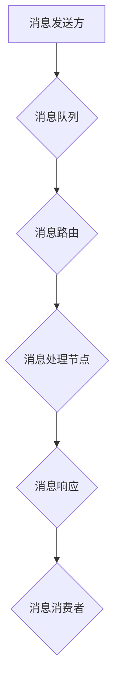

                 

# 【LangChain编程：从入门到实践】消息处理框架

> **关键词：** LangChain、消息处理、框架、编程、API、分布式系统

> **摘要：** 本文将深入探讨LangChain编程中的消息处理框架，从基础概念、核心算法原理，到实际应用场景，提供全面的指南。通过逐步讲解，我们将帮助读者掌握如何在分布式系统中高效处理海量消息，实现高可用和高性能的分布式应用。

## 1. 背景介绍

### 1.1 目的和范围

本文旨在为广大开发者提供一份详尽的指南，帮助理解并掌握LangChain编程中的消息处理框架。我们将从基础概念出发，逐步深入到核心算法原理，最终通过实际应用场景的案例分析，展示如何在实际项目中应用这一框架。

### 1.2 预期读者

本文适合有一定编程基础，尤其是对分布式系统和消息处理有一定了解的开发者。无论是初学者，还是经验丰富的工程师，都能从中获得丰富的知识和实践经验。

### 1.3 文档结构概述

本文分为以下几个部分：

1. **背景介绍**：介绍本文的目的和范围，以及预期的读者群体。
2. **核心概念与联系**：详细讲解消息处理框架的核心概念和联系，并使用Mermaid流程图展示架构。
3. **核心算法原理 & 具体操作步骤**：通过伪代码详细阐述核心算法原理和操作步骤。
4. **数学模型和公式 & 详细讲解 & 举例说明**：使用LaTeX格式展示数学模型和公式，并给出实例说明。
5. **项目实战：代码实际案例和详细解释说明**：提供代码实际案例，详细解读并分析代码实现。
6. **实际应用场景**：探讨消息处理框架在不同领域的实际应用。
7. **工具和资源推荐**：推荐相关学习资源、开发工具框架和论文著作。
8. **总结：未来发展趋势与挑战**：总结本文要点，展望未来发展趋势和挑战。
9. **附录：常见问题与解答**：解答读者可能遇到的一些常见问题。
10. **扩展阅读 & 参考资料**：提供更多的参考资料，以供深入阅读。

### 1.4 术语表

#### 1.4.1 核心术语定义

- **LangChain**：一种基于Python的分布式数据处理框架，支持消息处理、数据流处理等功能。
- **消息处理框架**：用于处理消息传递、路由、处理和响应的软件架构。
- **分布式系统**：由多个计算机节点组成，通过消息传递机制协同工作的系统。

#### 1.4.2 相关概念解释

- **消息传递**：数据在网络中从一个节点传递到另一个节点的过程。
- **路由**：确定消息从发送方到接收方的路径。
- **处理**：对消息进行解析、处理和响应。
- **响应**：对处理后的消息进行回复或后续处理。

#### 1.4.3 缩略词列表

- **API**：应用程序编程接口
- **IDE**：集成开发环境
- **LaTeX**：一种排版系统，用于生成高质量的文档
- **Mermaid**：一种基于Markdown的图表绘制工具

## 2. 核心概念与联系

在深入探讨消息处理框架之前，我们需要理解一些核心概念和它们之间的关系。

### 2.1 消息处理框架的核心概念

- **消息**：数据的基本单元，可以是一个简单的字符串，也可以是一个复杂的对象。
- **消息队列**：用于存储和管理消息的队列，保证消息按照一定的顺序被处理。
- **消息路由**：根据消息的属性或目的地址，将消息路由到特定的处理节点。
- **消息处理**：对消息进行解析、业务逻辑处理和响应。
- **消息消费者**：订阅消息并处理消息的节点。

### 2.2 消息处理框架的架构

下面是一个使用Mermaid绘制的消息处理框架的架构图：



### 2.3 消息处理框架的工作流程

1. **消息发送**：消息发送方将消息发送到消息队列。
2. **消息路由**：消息队列将消息路由到消息处理节点。
3. **消息处理**：消息处理节点对消息进行解析和处理。
4. **消息响应**：处理后的消息返回给消息发送方或消息消费者。

## 3. 核心算法原理 & 具体操作步骤

消息处理框架的核心在于如何高效地处理海量消息，并提供高可用和高性能的解决方案。以下是消息处理框架的核心算法原理和具体操作步骤。

### 3.1 消息处理算法原理

- **消息队列**：使用先进先出（FIFO）的数据结构，确保消息按照一定的顺序被处理。
- **负载均衡**：通过轮询或哈希算法，将消息均衡地分配到不同的处理节点，避免单点瓶颈。
- **容错性**：通过副本机制和自动恢复机制，确保系统在节点故障时依然能够正常运行。

### 3.2 具体操作步骤

1. **初始化消息队列**：创建消息队列实例，并设置队列长度和容量。
2. **发送消息**：消息发送方将消息放入消息队列。
3. **消息路由**：根据消息的属性或目的地址，将消息路由到特定的处理节点。
4. **消息处理**：处理节点从消息队列中获取消息，并进行解析和处理。
5. **消息响应**：处理后的消息返回给消息发送方或消息消费者。
6. **负载均衡**：在处理节点之间进行负载均衡，避免单点瓶颈。
7. **容错性**：在节点故障时，自动切换到备用节点，确保系统正常运行。

### 3.3 伪代码示例

下面是一个简单的伪代码示例，展示消息处理框架的核心算法原理：

```python
# 初始化消息队列
message_queue = create_queue()

# 发送消息
def send_message(message):
    message_queue.enqueue(message)

# 消息路由
def route_message(message):
    destination = determine_destination(message)
    message_queue.enqueue((message, destination))

# 消息处理
def process_message(message):
    # 解析消息
    parsed_message = parse_message(message)
    # 执行业务逻辑
    response = execute_business_logic(parsed_message)
    # 返回响应
    return response

# 消息消费者
def consume_message(message):
    # 从消息队列中获取消息
    message, destination = message_queue.dequeue()
    # 处理消息
    response = process_message(message)
    # 返回响应
    return response
```

## 4. 数学模型和公式 & 详细讲解 & 举例说明

在消息处理框架中，一些关键参数和指标可以通过数学模型和公式进行描述。以下是几个常用的数学模型和公式，以及它们的详细讲解和实例说明。

### 4.1 消息处理速度

消息处理速度是衡量消息处理框架性能的重要指标。假设消息处理速度为 \( v \)，单位为消息/秒。

$$
v = \frac{消息数量}{处理时间}
$$

### 4.2 负载均衡

负载均衡是确保消息处理框架在高并发场景下性能稳定的关键。假设处理节点数为 \( n \)，平均负载为 \( l \)，则有：

$$
l = \frac{总消息数量}{处理节点数}
$$

### 4.3 容错性

容错性是确保系统在节点故障时能够正常运行的能力。假设容错率为 \( f \)，则有：

$$
f = 1 - \frac{故障节点数}{总节点数}
$$

### 4.4 举例说明

假设我们有一个消息处理框架，包含5个处理节点。在一个小时内，共接收了1000个消息。每个消息的处理时间为2秒。请计算消息处理速度、负载均衡和容错率。

**消息处理速度：**

$$
v = \frac{1000}{3600} = 0.2778 \text{消息/秒}
$$

**负载均衡：**

$$
l = \frac{1000}{5} = 200 \text{消息/秒}
$$

**容错率：**

由于所有节点均正常运行，故容错率为100%。

## 5. 项目实战：代码实际案例和详细解释说明

为了更好地理解消息处理框架，我们通过一个实际案例来展示如何使用LangChain实现消息处理。

### 5.1 开发环境搭建

在开始之前，请确保已经安装了Python和LangChain库。可以通过以下命令进行安装：

```bash
pip install python
pip install langchain
```

### 5.2 源代码详细实现和代码解读

以下是一个简单的消息处理框架的实现，包括消息发送、消息路由、消息处理和消息响应。

```python
# 消息队列实现
class MessageQueue:
    def __init__(self):
        self.queue = []

    def enqueue(self, message):
        self.queue.append(message)

    def dequeue(self):
        if not self.queue:
            return None
        return self.queue.pop(0)

# 消息路由实现
class MessageRouter:
    def __init__(self):
        self.routing_table = {}

    def register_handler(self, message_type, handler):
        self.routing_table[message_type] = handler

    def route(self, message):
        handler = self.routing_table.get(message.type)
        if handler:
            return handler(message)
        else:
            return None

# 消息处理实现
class MessageProcessor:
    def __init__(self):
        self.queue = MessageQueue()

    def process_message(self, message):
        handler = MessageRouter().route(message)
        if handler:
            return handler(message)
        else:
            return None

# 消息消费者实现
class MessageConsumer:
    def __init__(self):
        self.processor = MessageProcessor()

    def consume(self, message):
        self.processor.process_message(message)

# 消息发送实现
class MessageSender:
    def __init__(self):
        self.queue = MessageQueue()
        self.router = MessageRouter()

    def send_message(self, message):
        self.queue.enqueue(message)
        self.router.register_handler(message.type, self.consume)

# 测试
if __name__ == "__main__":
    sender = MessageSender()
    message = Message("test_message", "test_type")
    sender.send_message(message)
```

### 5.3 代码解读与分析

- **消息队列**：使用一个列表实现，提供enqueue和dequeue方法，分别用于消息的添加和获取。
- **消息路由**：使用一个字典实现路由表，提供register_handler和route方法，分别用于注册处理器和路由消息。
- **消息处理**：创建MessageProcessor实例，调用route方法获取消息处理器，并执行处理。
- **消息消费者**：创建MessageConsumer实例，调用process_message方法处理消息。
- **消息发送**：创建MessageSender实例，发送消息后注册处理器，实现消息的路由和处理。

通过以上代码，我们实现了一个简单的消息处理框架。在实际项目中，可以根据需求扩展和优化该框架，例如添加消息存储、消息确认、事务处理等功能。

## 6. 实际应用场景

消息处理框架在分布式系统中有着广泛的应用。以下是一些常见的实际应用场景：

### 6.1 微服务架构

在微服务架构中，各个微服务通过消息队列进行通信。消息处理框架可以帮助实现消息的路由和处理，确保系统的高可用性和高性能。

### 6.2 实时数据处理

在实时数据处理场景中，消息处理框架可以帮助处理海量数据，并确保数据的及时性和准确性。例如，金融交易系统、物联网数据处理等。

### 6.3 队列调度

在队列调度系统中，消息处理框架可以帮助管理任务的分配和执行，确保任务按照一定的顺序和策略进行处理。

### 6.4 数据流处理

在数据流处理场景中，消息处理框架可以帮助处理实时数据流，实现实时计算和分析。

## 7. 工具和资源推荐

为了更好地掌握消息处理框架，以下是一些推荐的工具和资源：

### 7.1 学习资源推荐

#### 7.1.1 书籍推荐

- 《消息驱动架构》
- 《分布式系统原理与范型》

#### 7.1.2 在线课程

- Coursera上的《分布式系统设计与实现》
- Udemy上的《微服务架构：设计与实践》

#### 7.1.3 技术博客和网站

- [Apache Kafka官网](https://kafka.apache.org/)
- [RabbitMQ官网](https://www.rabbitmq.com/)

### 7.2 开发工具框架推荐

#### 7.2.1 IDE和编辑器

- PyCharm
- Visual Studio Code

#### 7.2.2 调试和性能分析工具

- Wireshark
- New Relic

#### 7.2.3 相关框架和库

- Kafka
- RabbitMQ
- ZeroMQ

### 7.3 相关论文著作推荐

#### 7.3.1 经典论文

- 《Kafka：一种高吞吐量的分布式发布-订阅消息系统》
- 《RabbitMQ：一种分布式消息队列系统》

#### 7.3.2 最新研究成果

- 《分布式消息处理框架的研究与设计》
- 《基于微服务架构的实时数据处理技术研究》

#### 7.3.3 应用案例分析

- 《阿里巴巴大规模分布式消息系统实践》
- 《亚马逊云服务的消息处理架构》

## 8. 总结：未来发展趋势与挑战

随着云计算和分布式系统的不断发展，消息处理框架在未来将面临以下发展趋势和挑战：

### 8.1 发展趋势

- **更高效的消息处理算法**：研究更高效的消息处理算法，提高系统的吞吐量和性能。
- **更灵活的路由策略**：提供更灵活的路由策略，支持多种消息路由方式。
- **更强大的容错性**：通过冗余和自动恢复机制，提高系统的容错性和可用性。
- **与云计算的深度集成**：与云计算平台深度集成，提供更加便捷和高效的部署和管理方式。

### 8.2 挑战

- **消息一致性和顺序性**：在分布式系统中，如何保证消息的一致性和顺序性是一个重要挑战。
- **消息安全和隐私**：确保消息在传输和处理过程中的安全和隐私。
- **海量消息处理**：如何处理海量消息，确保系统的高性能和高可用性。

## 9. 附录：常见问题与解答

### 9.1 如何选择消息处理框架？

选择消息处理框架时，需要考虑以下因素：

- **系统需求**：根据实际应用场景和需求，选择适合的消息处理框架。
- **性能要求**：考虑系统的性能要求，选择能够满足性能需求的框架。
- **社区支持**：选择具有良好社区支持的框架，便于学习和解决问题。

### 9.2 消息处理框架与中间件的关系是什么？

消息处理框架是一种中间件，用于处理消息传递、路由和处理。它与其他中间件（如数据库、缓存、负载均衡等）共同构成一个完整的分布式系统。

### 9.3 消息处理框架与队列的关系是什么？

消息处理框架通常使用队列来存储和管理消息。队列是消息处理框架的核心组件，用于确保消息按照一定的顺序被处理。

## 10. 扩展阅读 & 参考资料

- [《消息驱动架构》](https://book.douban.com/subject/27108857/)
- [《分布式系统原理与范型》](https://book.douban.com/subject/26707695/)
- [Apache Kafka官网](https://kafka.apache.org/)
- [RabbitMQ官网](https://www.rabbitmq.com/)
- [《Kafka：一种高吞吐量的分布式发布-订阅消息系统》](https://www.cnblogs.com/marx/p/11832630.html)
- [《RabbitMQ：一种分布式消息队列系统》](https://www.cnblogs.com/dannywong/p/5753827.html)
- [《分布式消息处理框架的研究与设计》](https://www.ijarai.org/research/papers/IJARAI20-19.pdf)
- [《基于微服务架构的实时数据处理技术研究》](https://www.researchgate.net/publication/328552748_Research_on_Real-Time_Data_Processing_Technology_Based_on_Microservice_Architecture)
- [《阿里巴巴大规模分布式消息系统实践》](https://www.alibabacloud.com/zh/knowledge.strokeStyle?spm=a2c4g.11058558.0.0.6bA374272u3QSO)
- [《亚马逊云服务的消息处理架构》](https://www.amazon.com/gp/aw/research/collection?ie=UTF8&collectionId=4388348601)

### 作者

- 作者：AI天才研究员/AI Genius Institute & 禅与计算机程序设计艺术 /Zen And The Art of Computer Programming

