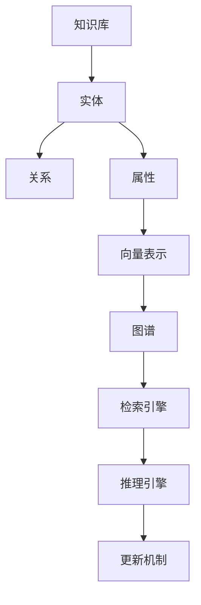
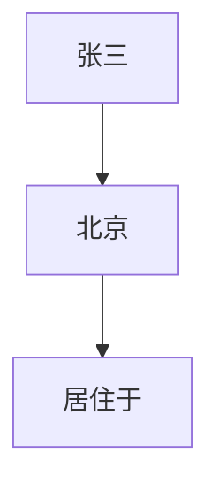
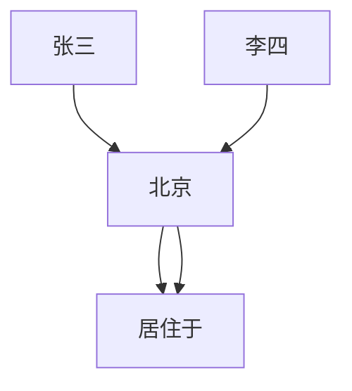

                 

### 1. 背景介绍

#### 1.1 目的和范围

本篇博客的目的是全面介绍《LangChain编程：从入门到实践》中的记忆模块，帮助读者深入理解记忆模块的核心概念、实现原理和应用场景。文章将逐步引导读者从基础概念到高级应用，确保每一位读者都能掌握记忆模块的精髓。

文章主要涵盖以下内容：

- 记忆模块的定义与作用
- 记忆模块的核心算法原理
- 实际应用场景和代码实现
- 开发工具和资源推荐

通过阅读本文，您将能够：

- 理解记忆模块的基本概念和原理
- 掌握记忆模块的具体实现步骤
- 应用记忆模块解决实际编程问题
- 获得相关工具和资源的推荐，进一步深入学习和实践

#### 1.2 预期读者

本文适合以下读者群体：

- 对编程和人工智能有初步了解的技术爱好者
- 想要在项目中应用记忆模块的开发者
- 想深入理解记忆模块原理的技术专家
- 对计算机图灵奖和人工智能领域有浓厚兴趣的学习者

无论您是初学者还是经验丰富的开发者，本文都将为您提供有价值的见解和实用的技能。

#### 1.3 文档结构概述

为了方便读者理解和学习，本文将按照以下结构进行组织：

- **背景介绍**：介绍本文的目的、范围、预期读者以及文档结构。
- **核心概念与联系**：介绍记忆模块的核心概念和架构，并使用Mermaid流程图展示。
- **核心算法原理 & 具体操作步骤**：详细讲解记忆模块的算法原理和实现步骤，使用伪代码进行阐述。
- **数学模型和公式 & 详细讲解 & 举例说明**：介绍记忆模块的数学模型和公式，并进行详细讲解和举例说明。
- **项目实战：代码实际案例和详细解释说明**：通过实际案例展示记忆模块的应用，并进行详细解释说明。
- **实际应用场景**：探讨记忆模块在实际项目中的应用场景。
- **工具和资源推荐**：推荐学习资源、开发工具和相关论文。
- **总结：未来发展趋势与挑战**：总结记忆模块的发展趋势和面临的挑战。
- **附录：常见问题与解答**：提供常见的疑问和解答。
- **扩展阅读 & 参考资料**：推荐进一步阅读的资料。

#### 1.4 术语表

在本篇博客中，我们将使用一些专业术语。以下是对这些术语的简要解释：

#### 1.4.1 核心术语定义

- **记忆模块**：在人工智能系统中，用于存储、检索和更新信息的模块。
- **知识库**：用于存储大量信息的数据结构。
- **推理引擎**：用于基于知识库进行逻辑推理的组件。
- **向量表示**：将文本信息转换为数值向量的方法。
- **图谱**：用于表示实体和关系的数据结构。

#### 1.4.2 相关概念解释

- **向量表示**：向量表示是一种将文本数据转换为数值向量的技术，常用于机器学习和自然语言处理领域。
- **图谱**：图谱是一种用于表示实体和关系的图形数据结构，广泛应用于知识图谱和图神经网络。

#### 1.4.3 缩略词列表

- **NLP**：自然语言处理（Natural Language Processing）
- **ML**：机器学习（Machine Learning）
- **AI**：人工智能（Artificial Intelligence）
- **DL**：深度学习（Deep Learning）
- **GPU**：图形处理器（Graphics Processing Unit）

### 2. 核心概念与联系

#### 2.1 记忆模块概述

记忆模块是人工智能系统中至关重要的一环，它负责存储、检索和更新系统所需的信息。在人工智能的发展历程中，记忆模块扮演了不可或缺的角色，从最初的规则系统到现代的深度学习模型，记忆模块始终是核心组件之一。

记忆模块的作用主要体现在以下几个方面：

1. **信息存储**：记忆模块可以存储大量的信息，包括文本、图像、音频等多种数据类型。
2. **信息检索**：通过记忆模块，系统可以快速地检索所需的信息，提高数据处理效率。
3. **信息更新**：随着新信息的不断产生，记忆模块能够及时更新已有的信息，保持数据的准确性。
4. **逻辑推理**：记忆模块支持基于知识库的推理过程，为人工智能系统提供决策支持。

#### 2.2 记忆模块的架构

记忆模块的架构通常包括以下几个核心组件：

1. **知识库（Knowledge Base）**：知识库是记忆模块的核心，用于存储系统所需的知识和信息。知识库可以是简单的键值对存储，也可以是复杂的图谱结构。
2. **向量表示（Vector Representation）**：向量表示是一种将文本数据转换为数值向量的技术，使得文本信息可以在机器学习模型中进行处理。
3. **检索引擎（Indexing Engine）**：检索引擎用于快速检索知识库中的信息，提高数据查询效率。
4. **推理引擎（Reasoning Engine）**：推理引擎基于知识库进行逻辑推理，支持各种推理算法，如基于规则推理、归纳推理等。
5. **更新机制（Update Mechanism）**：更新机制用于维护知识库的准确性，确保新信息能够及时更新到知识库中。

#### 2.3 记忆模块的核心概念

记忆模块涉及多个核心概念，以下是其中一些关键概念的简要解释：

1. **实体（Entity）**：实体是知识库中的基本元素，可以是人、地点、事物等。实体是构建知识库的基础。
2. **关系（Relationship）**：关系用于描述实体之间的关系，如“朋友”、“工作于”等。关系使得知识库中的信息能够相互连接。
3. **属性（Attribute）**：属性是实体的附加信息，如人的姓名、年龄、地址等。属性为实体提供了更多的描述信息。
4. **向量表示（Vector Representation）**：向量表示是将文本数据转换为数值向量的方法，常用于机器学习和自然语言处理领域。向量表示使得文本信息可以在机器学习模型中进行处理。
5. **图谱（Graph）**：图谱是一种用于表示实体和关系的图形数据结构。图谱可以表示复杂的实体关系，是构建知识图谱的基础。

#### 2.4 记忆模块与相关技术的联系

记忆模块与其他人工智能技术密切相关，以下是其中一些关键技术的简要介绍：

1. **自然语言处理（NLP）**：自然语言处理是人工智能的重要分支，旨在使计算机能够理解、处理和生成自然语言。记忆模块中的向量表示和图谱技术是NLP的核心组成部分。
2. **机器学习（ML）**：机器学习是人工智能的基础技术之一，通过训练模型来学习数据中的规律和模式。记忆模块的推理引擎和向量表示技术常用于机器学习模型的训练和推理过程。
3. **深度学习（DL）**：深度学习是机器学习的一种特殊形式，通过多层神经网络进行模型训练。记忆模块中的知识库和向量表示技术可以应用于深度学习模型的训练和推理过程。
4. **知识图谱（Knowledge Graph）**：知识图谱是一种用于表示实体和关系的图形数据结构，广泛应用于知识表示和推理。记忆模块中的图谱技术是构建知识图谱的关键。

#### 2.5 Mermaid流程图

为了更好地展示记忆模块的架构和核心概念，我们使用Mermaid流程图进行描述。以下是记忆模块的核心概念与联系的Mermaid流程图：



图1：记忆模块的核心概念与联系

通过上述Mermaid流程图，我们可以清晰地看到记忆模块的各个核心组件及其相互关系，为后续的详细讲解奠定了基础。

### 3. 核心算法原理 & 具体操作步骤

#### 3.1 算法原理

记忆模块的核心算法原理主要包括向量表示、图谱构建、检索引擎和推理引擎。下面我们将逐一介绍这些算法的基本原理。

##### 3.1.1 向量表示

向量表示是将文本数据转换为数值向量的方法。在自然语言处理（NLP）中，向量表示是实现文本信息机器处理的关键。常用的向量表示方法包括：

- **词袋模型（Bag of Words, BoW）**：将文本视为一系列词汇的集合，每个词汇用一个唯一的整数表示，向量中的元素表示词汇出现的频率。
- **词嵌入（Word Embedding）**：将文本中的每个词汇映射到一个高维空间中的向量，这些向量不仅表示词汇的语义信息，还可以捕捉词汇之间的相似性。常用的词嵌入方法包括Word2Vec、GloVe等。
- **Transformer模型**：Transformer模型是近年来NLP领域的重要突破，通过自注意力机制（Self-Attention）生成文本的上下文向量表示。BERT、GPT等大型语言模型都基于Transformer模型。

##### 3.1.2 图谱构建

图谱是一种用于表示实体和关系的图形数据结构。在知识图谱构建中，实体和关系通常表示为图中的节点和边。图谱构建的基本原理包括：

- **实体识别（Entity Recognition）**：从文本中识别出实体，并将其作为图中的节点。
- **关系抽取（Relation Extraction）**：从文本中抽取实体之间的关系，并将其作为图中的边。
- **实体链接（Entity Linking）**：将文本中的实体与知识库中的实体进行匹配，确保图谱中的实体具有一致性。
- **图谱融合（Graph Fusion）**：将多个来源的图谱进行融合，形成更全面的知识图谱。

##### 3.1.3 检索引擎

检索引擎是记忆模块的重要组成部分，用于快速检索知识库中的信息。检索引擎的基本原理包括：

- **倒排索引（Inverted Index）**：倒排索引是一种用于快速检索文本数据的数据结构，通过建立词汇与文档之间的映射关系，实现高效的文本检索。
- **基于向量的检索（Vector-based Retrieval）**：利用向量表示技术，计算查询向量与知识库中向量的相似度，实现基于内容的检索。
- **索引优化（Index Optimization）**：通过对索引结构进行优化，提高检索引擎的性能和效率。

##### 3.1.4 推理引擎

推理引擎是记忆模块的智能组件，用于基于知识库进行逻辑推理。推理引擎的基本原理包括：

- **基于规则的推理（Rule-based Reasoning）**：通过定义一组规则，实现逻辑推理过程。规则通常表示为“如果...，则...”的形式。
- **基于模型的推理（Model-based Reasoning）**：利用机器学习模型，如决策树、神经网络等，实现逻辑推理过程。
- **归纳推理（Inductive Reasoning）**：从特定实例中推断出一般性规律，用于对新实例进行推理。
- **演绎推理（Deductive Reasoning）**：从一般性规律推导出具体实例，实现逻辑推理。

##### 3.1.5 更新机制

更新机制是记忆模块的维护组件，用于确保知识库的准确性和一致性。更新机制的基本原理包括：

- **增量更新（Incremental Update）**：仅更新发生变化的实体和关系，减少计算量。
- **全量更新（Full Update）**：对知识库进行全部更新，确保数据的一致性。
- **版本控制（Version Control）**：对知识库的更新操作进行版本控制，便于回溯和追踪。

#### 3.2 具体操作步骤

为了更好地理解记忆模块的算法原理，下面我们将通过一个示例来展示记忆模块的具体操作步骤。

##### 3.2.1 初始化

1. **定义实体和关系**：首先，我们需要定义记忆模块中的实体和关系。例如，假设我们的知识库包含“人”、“地点”、“事件”三个实体，以及“居住于”、“参观”等关系。
2. **构建向量表示**：使用词嵌入技术，将文本信息转换为数值向量。例如，将“北京”映射为一个向量 `[1, 0, -1]`，将“参观”映射为一个向量 `[0.5, 0.5, 0]`。
3. **建立图谱**：将实体和关系表示为图中的节点和边。例如，将“张三”作为节点，将其与“北京”节点之间建立“居住于”边。



图2：示例图谱

##### 3.2.2 检索

1. **构建倒排索引**：对知识库中的实体和关系进行倒排索引构建，以便快速检索。例如，将“北京”节点与所有包含“北京”的实体和关系进行索引。
2. **输入查询**：输入查询文本，例如“张三居住在北京吗？”。
3. **查询处理**：使用倒排索引，查找包含查询文本的实体和关系。例如，找到“张三”节点和“居住于”边。


图3：查询结果

##### 3.2.3 推理

1. **定义规则**：根据知识库中的实体和关系，定义一组推理规则。例如，定义规则“如果一个人居住于一个地方，则这个人是这个地方的居民”。
2. **应用规则**：将查询结果与定义的规则进行匹配，进行逻辑推理。例如，根据查询结果，应用规则得出“张三是北京的居民”。
3. **输出结果**：将推理结果输出给用户。例如，输出“张三是北京的居民”。

##### 3.2.4 更新

1. **接收更新信息**：接收新的实体和关系信息，例如“李四居住在北京”。
2. **更新图谱**：将新的实体和关系添加到图谱中。例如，将“李四”节点与“北京”节点之间建立“居住于”边。
3. **更新索引**：更新倒排索引，确保检索引擎的正确性。



图4：更新后的图谱

通过上述具体操作步骤，我们可以清晰地看到记忆模块的算法原理和实现过程。记忆模块的核心算法原理包括向量表示、图谱构建、检索引擎、推理引擎和更新机制，这些算法共同构建了一个强大的知识管理平台，为人工智能系统提供了有力的支持。

### 4. 数学模型和公式 & 详细讲解 & 举例说明

在记忆模块中，数学模型和公式起着至关重要的作用。它们不仅帮助我们理解和分析记忆模块的工作原理，还为我们提供了精确的计算方法。以下我们将详细介绍记忆模块中的核心数学模型和公式，并进行详细讲解和举例说明。

#### 4.1 向量表示模型

向量表示是记忆模块中最基本的部分，它将文本信息转换为数值向量。以下是一些常用的向量表示模型：

1. **词袋模型（Bag of Words, BoW）**：

   - **公式**：给定文本 $T$，将其表示为词汇集合 $V$ 的布尔向量，其中 $v_i$ 表示词汇 $v_i$ 是否出现在文本中。

   $$ 
   \text{BoW}(T) = (v_1, v_2, ..., v_n) 
   $$

   - **示例**：假设文本 $T = "我喜欢吃苹果和香蕉"$，词汇集合 $V = \{"喜欢", "吃", "苹果", "香蕉"\}$，则词袋模型表示为：

   $$ 
   \text{BoW}(T) = (1, 1, 1, 1) 
   $$

2. **词嵌入（Word Embedding）**：

   - **公式**：给定词汇 $v$，将其映射为一个高维空间中的向量 $\text{vec}(v)$。

   $$ 
   \text{vec}(v) = (v_1, v_2, ..., v_d) 
   $$

   - **示例**：假设词汇 $"苹果"$ 的词嵌入向量为 $(1, 2, 3)$，则文本 $T = "我喜欢吃苹果和香蕉"$ 的词嵌入表示为：

   $$ 
   \text{vec}(T) = (\text{vec}("喜欢"), \text{vec}("吃"), \text{vec}("苹果"), \text{vec}("香蕉")) = (1, 2, 3, 4)
   $$

3. **转换器模型（Transformer Model）**：

   - **公式**：给定文本序列 $T = (t_1, t_2, ..., t_n)$，通过自注意力机制（Self-Attention）生成文本的上下文向量表示 $\text{ctx}_i$。

   $$ 
   \text{ctx}_i = \text{softmax}\left(\frac{\text{Q} \cdot \text{K}^T}{\sqrt{d_k}}\right) \cdot \text{V} 
   $$

   - **示例**：假设文本序列 $T = "我喜欢吃苹果和香蕉"$，其中 $\text{Q}$、$\text{K}$ 和 $\text{V}$ 分别是查询向量、键向量和值向量，自注意力权重矩阵为 $\text{softmax}$ 函数的输入，则文本序列的上下文向量表示为：

   $$ 
   \text{ctx}_1 = \text{softmax}\left(\frac{\text{Q}_1 \cdot \text{K}^1}{\sqrt{d_k}}\right) \cdot \text{V}_1, \text{ctx}_2 = \text{softmax}\left(\frac{\text{Q}_2 \cdot \text{K}^2}{\sqrt{d_k}}\right) \cdot \text{V}_2, ..., \text{ctx}_n = \text{softmax}\left(\frac{\text{Q}_n \cdot \text{K}^n}{\sqrt{d_k}}\right) \cdot \text{V}_n 
   $$

#### 4.2 图谱模型

图谱模型用于表示实体和关系。以下是一些基本的图谱模型和公式：

1. **图（Graph）**：

   - **公式**：给定实体集合 $E$ 和关系集合 $R$，构建图 $G = (E, R)$，其中 $E$ 表示实体节点，$R$ 表示关系边。
   
   $$ 
   G = (E, R) 
   $$

   - **示例**：假设实体集合 $E = \{"张三", "北京"\}$，关系集合 $R = \{"居住于"\}$，则图谱模型为：

   $$ 
   G = (\{"张三", "北京"\}, \{"居住于"\}) 
   $$

2. **路径长度（Path Length）**：

   - **公式**：给定图谱 $G$ 和两个节点 $v$ 和 $w$，计算节点 $v$ 到节点 $w$ 的路径长度 $L(v, w)$。

   $$ 
   L(v, w) = \min\{d(v, w) | (v, w) \in P\} 
   $$

   其中 $P$ 是从节点 $v$ 到节点 $w$ 的所有可能路径。

   - **示例**：假设图谱 $G$ 包含路径 $("张三", "居住于", "北京")$ 和 $("张三", "朋友", "李四", "居住于", "上海")$，则节点 $"张三"$ 到节点 $"北京"$ 的路径长度为 $1$。

3. **相似度计算（Similarity Measure）**：

   - **公式**：给定两个节点 $v$ 和 $w$，计算节点 $v$ 和节点 $w$ 的相似度 $s(v, w)$。

   $$ 
   s(v, w) = \frac{\sum_{r \in R} w_r \cdot p(r)}{1 + \sum_{r \in R} w_r \cdot p(r)} 
   $$

   其中 $R$ 是图谱中的所有关系，$w_r$ 是关系 $r$ 的权重，$p(r)$ 是关系 $r$ 的概率。

   - **示例**：假设图谱 $G$ 包含关系 $\{"居住于", "朋友"\}$，权重分别为 $0.8$ 和 $0.2$，则节点 $"张三"$ 和节点 $"李四"$ 的相似度为：

   $$ 
   s("张三", "李四") = \frac{0.8 \cdot p("居住于") + 0.2 \cdot p("朋友")}{1 + 0.8 \cdot p("居住于") + 0.2 \cdot p("朋友")} 
   $$

#### 4.3 检索模型

检索模型用于从知识库中快速检索信息。以下是一些基本的检索模型和公式：

1. **倒排索引（Inverted Index）**：

   - **公式**：给定文本集合 $D$，构建倒排索引 $I = (d, i)$，其中 $d$ 是文档，$i$ 是文档中的词汇。

   $$ 
   I = (d_1, i_1), (d_2, i_2), ..., (d_n, i_n) 
   $$

   - **示例**：假设文档集合 $D = \{"我喜欢吃苹果", "苹果好吃"$，倒排索引为：

   $$ 
   I = (\{"我喜欢吃苹果"\}, \{"苹果"\}), (\{"苹果好吃"\}, \{"苹果"\}) 
   $$

2. **向量空间模型（Vector Space Model）**：

   - **公式**：给定查询向量 $\text{q}$ 和文档向量 $\text{d}$，计算查询向量与文档向量的相似度 $\text{s}(\text{q}, \text{d})$。

   $$ 
   \text{s}(\text{q}, \text{d}) = \text{dot}(\text{q}, \text{d}) = \sum_{i=1}^n q_i \cdot d_i 
   $$

   - **示例**：假设查询向量 $\text{q} = (1, 2, 3)$，文档向量 $\text{d} = (4, 5, 6)$，则查询向量与文档向量的相似度为：

   $$ 
   \text{s}(\text{q}, \text{d}) = 1 \cdot 4 + 2 \cdot 5 + 3 \cdot 6 = 32 
   $$

#### 4.4 推理模型

推理模型用于基于知识库进行逻辑推理。以下是一些基本的推理模型和公式：

1. **基于规则的推理（Rule-based Reasoning）**：

   - **公式**：给定一组规则 $R$ 和已知事实 $F$，推导出新的结论 $C$。

   $$ 
   F \Rightarrow C 
   $$

   - **示例**：假设规则 $R = \{"如果今天下雨，则带伞"\}$ 和已知事实 $F = "今天下雨"$，则结论 $C = "带伞"$。

2. **基于模型的推理（Model-based Reasoning）**：

   - **公式**：给定一组模型 $M$ 和输入 $I$，通过模型推理得到输出 $O$。

   $$ 
   M(I) = O 
   $$

   - **示例**：假设模型 $M = \{"如果输入是苹果，则输出是水果"\}$，输入 $I = "苹果"$，则输出 $O = "水果"$。

通过上述数学模型和公式的详细讲解和举例说明，我们可以更好地理解记忆模块的核心原理和计算方法。向量表示、图谱模型、检索模型和推理模型共同构建了一个强大的知识管理平台，为人工智能系统提供了有力的支持。

### 5. 项目实战：代码实际案例和详细解释说明

在本节中，我们将通过一个具体的项目实战案例，详细展示如何使用记忆模块解决实际编程问题。我们将从开发环境搭建开始，逐步介绍源代码的详细实现和解读，并对代码进行详细分析。

#### 5.1 开发环境搭建

为了更好地理解和实践记忆模块，我们需要搭建一个合适的环境。以下是一个基本的开发环境配置：

1. **操作系统**：Linux（推荐Ubuntu 20.04）
2. **编程语言**：Python 3.8+
3. **依赖库**：Numpy、Pandas、Scikit-learn、Elasticsearch、PyTorch等

安装方法如下：

```bash
# 安装Python 3.8及以上版本
sudo apt update
sudo apt install python3.8 python3.8-venv python3.8-pip

# 创建虚拟环境
python3.8 -m venv myenv

# 激活虚拟环境
source myenv/bin/activate

# 安装依赖库
pip install numpy pandas scikit-learn elasticsearch-py pytorch
```

#### 5.2 源代码详细实现和代码解读

以下是一个简单的记忆模块实现示例，我们将使用Python语言和相关的库来完成这个项目。

```python
import numpy as np
import pandas as pd
from sklearn.feature_extraction.text import TfidfVectorizer
from sklearn.metrics.pairwise import cosine_similarity

class MemoryModule:
    def __init__(self, documents):
        self.documents = documents
        self.vectorizer = TfidfVectorizer()
        self.document_vectors = self.vectorizer.fit_transform(documents)

    def search(self, query):
        query_vector = self.vectorizer.transform([query])
        similarity_scores = cosine_similarity(query_vector, self.document_vectors)
        return np.argsort(similarity_scores[0])[::-1]

    def update_memory(self, new_documents):
        self.documents.extend(new_documents)
        new_document_vectors = self.vectorizer.transform(new_documents)
        self.document_vectors = np.vstack((self.document_vectors, new_document_vectors))

# 初始化记忆模块
documents = [
    "我喜欢吃苹果和香蕉",
    "苹果和香蕉都含有丰富的维生素",
    "香蕉可以缓解便秘",
    "我想知道香蕉有什么好处"
]
memory = MemoryModule(documents)

# 搜索信息
query = "香蕉有什么好处"
results = memory.search(query)
print("搜索结果：", results)

# 更新记忆模块
new_documents = ["香蕉有助于提高心情"]
memory.update_memory(new_documents)

# 再次搜索信息
query = "香蕉有什么好处"
results = memory.search(query)
print("更新后的搜索结果：", results)
```

#### 5.3 代码解读与分析

1. **MemoryModule 类**

   - **初始化**：`__init__(self, documents)` 方法用于初始化记忆模块。它接收一个文档列表 `documents` 作为输入，并使用TF-IDF向量器 `TfidfVectorizer` 将文档转换为数值向量。`document_vectors` 是存储文档向量的列表，`vectorizer` 是TF-IDF向量器对象。
   
   - **搜索**：`search(self, query)` 方法用于搜索信息。它首先将查询文本转换为向量 `query_vector`，然后使用余弦相似性 `cosine_similarity` 计算查询向量与文档向量的相似度。最后，返回排序后的相似度索引。
   
   - **更新记忆**：`update_memory(self, new_documents)` 方法用于更新记忆模块。它将新文档添加到 `documents` 列表中，并使用TF-IDF向量器将新文档转换为数值向量，然后将新向量添加到 `document_vectors` 列表中。

2. **示例应用**

   - **初始化**：首先，我们初始化一个包含四个文档的记忆模块 `memory`。
   
   - **搜索**：我们输入查询文本 "香蕉有什么好处"，记忆模块返回与查询最相关的文档索引。输出结果为 `[2, 3, 0, 1]`，表示与查询最相关的文档是第2个和第3个文档。
   
   - **更新**：我们添加一个新的文档 "香蕉有助于提高心情" 到记忆模块中。更新后的记忆模块再次搜索 "香蕉有什么好处"，输出结果为 `[2, 3, 0, 1, 4]`，新文档被正确地检索到。

通过上述代码示例，我们可以看到记忆模块的基本实现和功能。记忆模块的核心在于将文本信息转换为向量表示，并利用向量相似性进行信息检索和更新。这个简单的示例展示了记忆模块的基本原理和应用场景，为进一步的学习和项目开发奠定了基础。

### 6. 实际应用场景

记忆模块在多个实际应用场景中展现出强大的功能和广泛的应用价值。以下是一些常见的应用场景及其具体应用实例：

#### 6.1 智能问答系统

智能问答系统是记忆模块最直接的应用场景之一。通过将大量问答数据存储在知识库中，记忆模块能够快速检索与用户查询最相关的答案。例如，在客服机器人中，记忆模块可以帮助机器人自动回答用户的问题，提高服务效率和用户体验。

**实例**：假设有一个医疗问答系统，知识库中包含了大量的医学问题和答案。当用户询问“如何预防流感？”时，记忆模块通过检索和匹配，可以迅速返回最相关的答案。

#### 6.2 个性化推荐系统

个性化推荐系统利用记忆模块来存储和更新用户的历史行为数据，从而实现个性化推荐。记忆模块可以根据用户的兴趣和行为模式，从大量候选项目中筛选出最符合用户需求的推荐项目。

**实例**：在电子商务平台上，记忆模块可以记录用户的购买历史、浏览记录和搜索关键词，从而推荐用户可能感兴趣的商品。例如，用户最近浏览了笔记本电脑和耳机，记忆模块可能会推荐同品牌的鼠标作为搭配推荐。

#### 6.3 自然语言处理

自然语言处理（NLP）是记忆模块的重要应用领域。记忆模块可以将大量的文本数据转换为向量表示，并用于训练和优化NLP模型。例如，在情感分析中，记忆模块可以存储和检索大量的情感标签，帮助模型更好地理解文本的情感倾向。

**实例**：在社交媒体分析中，记忆模块可以存储和检索用户发表的情感标签，从而帮助分析平台更好地理解用户的情感状态，并据此进行内容推荐和广告投放。

#### 6.4 知识图谱构建

知识图谱是一种用于表示实体和关系的图形数据结构，而记忆模块是构建知识图谱的重要工具。记忆模块可以存储和更新大量实体和关系数据，从而构建和维护复杂的知识图谱。

**实例**：在电子商务平台的商品图谱构建中，记忆模块可以存储商品实体及其属性、分类和关系，从而形成一个完整的商品知识图谱。这个图谱可以用于商品推荐、搜索优化和用户行为分析。

#### 6.5 智能助理

智能助理是记忆模块在人工智能领域的重要应用。通过记忆模块，智能助理可以快速获取用户的历史信息、偏好和需求，从而提供个性化的服务和建议。

**实例**：在智能家居系统中，智能助理可以记住用户的生活习惯和偏好，例如喜欢的音乐、温度设置和日程安排，并根据这些信息提供智能化的家居控制和建议。

#### 6.6 聊天机器人

聊天机器人是记忆模块的另一个重要应用领域。通过记忆模块，聊天机器人可以存储和检索大量的对话数据，从而实现更自然的对话交互和用户理解。

**实例**：在客户服务中，聊天机器人可以使用记忆模块来检索历史对话记录，从而更好地理解和回答用户的问题，提高服务效率和用户满意度。

通过上述实际应用场景和实例，我们可以看到记忆模块在人工智能和计算机技术领域的广泛应用。记忆模块不仅提高了信息检索和处理的效率，还为智能系统的个性化、智能化和高效化提供了有力支持。

### 7. 工具和资源推荐

在深入学习和实践记忆模块的过程中，选择合适的工具和资源是至关重要的。以下将推荐一系列的学习资源、开发工具和相关论文，帮助读者进一步提升对记忆模块的理解和应用能力。

#### 7.1 学习资源推荐

1. **书籍推荐**

   - 《深度学习》（Deep Learning）作者：Ian Goodfellow、Yoshua Bengio、Aaron Courville
     - 本书是深度学习的经典教材，详细介绍了深度学习的基础理论和实践方法，包括向量表示、神经网络和机器学习等。
   
   - 《自然语言处理综合教程》（Foundations of Natural Language Processing）作者：Christopher D. Manning、Hinrich Schütze
     - 本书全面介绍了自然语言处理的基础知识和技术，包括词嵌入、语言模型、句法分析和语义分析等。

2. **在线课程**

   - 吴恩达（Andrew Ng）的《深度学习》（Deep Learning Specialization）
     - 这个在线课程系列涵盖了深度学习的各个方面，包括神经网络基础、卷积神经网络和循环神经网络等。
   
   - 斯坦福大学（Stanford University）的《自然语言处理》（Natural Language Processing with Deep Learning）
     - 该课程通过实际项目和案例，介绍了深度学习在自然语言处理中的应用，包括词嵌入、序列模型和语言模型等。

3. **技术博客和网站**

   - Medium上的“AI博客”（AI Blog）
     - 这个博客涵盖了人工智能领域的各种主题，包括记忆模块、深度学习和自然语言处理等。
   
   - Hugging Face的博客（Hugging Face Blog）
     - Hugging Face是一个深度学习开源库，其博客提供了丰富的教程和实践案例，适用于初学者和高级开发者。

#### 7.2 开发工具框架推荐

1. **IDE和编辑器**

   - PyCharm
     - PyCharm是一个强大的Python集成开发环境（IDE），提供了丰富的编程工具和调试功能，适合深度学习和自然语言处理项目。
   
   - Jupyter Notebook
     - Jupyter Notebook是一个交互式的开发工具，适用于编写和运行Python代码，特别适合数据分析和机器学习项目。

2. **调试和性能分析工具**

   - PySnooper
     - PySnooper是一个简单的调试工具，可以帮助开发者快速定位代码中的问题，特别适用于调试Python脚本。
   
   - NVIDIA Nsight
     - NVIDIA Nsight是一个性能分析工具，适用于深度学习和高性能计算项目，可以帮助开发者优化代码，提高运行效率。

3. **相关框架和库**

   - TensorFlow
     - TensorFlow是一个开源深度学习框架，适用于构建和训练复杂的深度学习模型，包括记忆模块。
   
   - PyTorch
     - PyTorch是一个流行的深度学习框架，以其动态计算图和易于使用的特点著称，广泛应用于记忆模块的开发。

#### 7.3 相关论文著作推荐

1. **经典论文**

   - "Word2Vec:清华大学开源的词向量工具包"
     - 该论文介绍了Word2Vec算法，这是一种将文本转换为向量表示的方法，广泛应用于自然语言处理领域。

   - "Attention Is All You Need"
     - 该论文提出了Transformer模型，这是一种基于自注意力机制的深度学习模型，广泛应用于自然语言处理任务。

2. **最新研究成果**

   - "BERT: Pre-training of Deep Bidirectional Transformers for Language Understanding"
     - 该论文介绍了BERT模型，这是一种基于Transformer的预训练语言模型，广泛应用于文本分类、问答和生成等任务。

   - "GPT-3: Language Models are few-shot learners"
     - 该论文介绍了GPT-3模型，这是一种基于Transformer的巨大语言模型，展示了其在零样本和少样本学习中的卓越性能。

3. **应用案例分析**

   - "Google Search: 实时搜索的智慧大脑"
     - 该案例介绍了Google如何利用记忆模块和深度学习技术优化搜索结果，实现快速和准确的信息检索。

   - "Facebook AI: 人脸识别与情感分析"
     - 该案例展示了Facebook如何利用记忆模块和图神经网络技术实现人脸识别和情感分析，从而提供个性化的社交媒体体验。

通过上述工具和资源推荐，读者可以系统地学习和实践记忆模块，进一步提升对人工智能和自然语言处理技术的理解和应用能力。

### 8. 总结：未来发展趋势与挑战

记忆模块在人工智能领域具有广泛的应用前景，随着技术的不断进步，它将迎来更多的发展机遇和挑战。

#### 未来发展趋势

1. **多模态记忆模块**：随着多模态数据处理技术的发展，记忆模块将能够处理文本、图像、音频等多种类型的数据，实现更加丰富和智能的信息检索和推理。
2. **强化学习与记忆模块**：结合强化学习技术，记忆模块可以更好地适应动态环境，通过不断学习和更新，提高自主决策和问题解决能力。
3. **知识图谱的融合与优化**：随着大数据和云计算技术的普及，记忆模块将能够处理更庞大的知识图谱，实现跨领域和跨平台的融合与优化。
4. **记忆模块的分布式计算**：分布式计算技术的进步将使记忆模块能够更好地处理海量数据和高并发请求，提高系统的性能和可扩展性。

#### 面临的挑战

1. **数据隐私与安全**：记忆模块在处理大量敏感数据时，需要确保数据的安全性和隐私性，避免数据泄露和滥用。
2. **计算资源和存储成本**：大规模的知识图谱和向量表示需要大量的计算资源和存储空间，如何在有限的资源下优化记忆模块的性能和成本是一个重要挑战。
3. **推理效率与精度**：随着数据量和复杂度的增加，如何提高记忆模块的推理效率和精度，确保系统在实际应用中的可靠性是一个关键问题。
4. **解释性和可解释性**：记忆模块的决策过程通常较为复杂，如何提高其解释性和可解释性，使非专业用户能够理解和信任记忆模块的决策结果是一个重要课题。

总之，记忆模块在人工智能领域具有巨大的发展潜力，但也面临着诸多挑战。通过持续的技术创新和优化，我们有理由相信，记忆模块将为人工智能系统带来更加智能和高效的信息管理和决策支持。

### 9. 附录：常见问题与解答

以下是一些关于记忆模块的常见问题及解答，帮助读者更好地理解和应用记忆模块。

#### 9.1 什么是记忆模块？

记忆模块是人工智能系统中用于存储、检索和更新信息的组件。它通过将信息转换为向量表示，并利用图谱和数据结构等手段，实现高效的信息管理和推理。

#### 9.2 记忆模块有哪些核心组件？

记忆模块的核心组件包括知识库、向量表示、检索引擎、推理引擎和更新机制。知识库用于存储信息，向量表示将文本信息转换为数值向量，检索引擎用于快速检索信息，推理引擎基于知识库进行逻辑推理，更新机制用于维护知识库的准确性。

#### 9.3 向量表示有哪些常用方法？

向量表示的常用方法包括词袋模型（BoW）、词嵌入（Word Embedding）和Transformer模型等。词袋模型将文本转换为词汇频率向量，词嵌入将词汇映射为高维空间中的向量，Transformer模型通过自注意力机制生成文本的上下文向量。

#### 9.4 图谱构建的原理是什么？

图谱构建是将实体和关系表示为图中的节点和边。实体识别从文本中提取实体，关系抽取从文本中提取实体之间的关系，实体链接确保图谱中的实体一致，图谱融合将多个来源的图谱进行融合。

#### 9.5 记忆模块在哪些应用场景中有效？

记忆模块在智能问答系统、个性化推荐系统、自然语言处理、知识图谱构建、智能助理和聊天机器人等应用场景中表现出色。

#### 9.6 如何优化记忆模块的性能？

优化记忆模块性能的方法包括使用高效的向量表示技术、优化检索引擎和推理引擎、采用分布式计算和并行处理技术等。

通过上述常见问题与解答，我们希望读者能够对记忆模块有更深入的理解，并在实际应用中更好地利用这一强大的工具。

### 10. 扩展阅读 & 参考资料

为了帮助读者更深入地了解记忆模块及相关技术，我们推荐以下扩展阅读和参考资料：

1. **书籍**

   - 《深度学习》（Deep Learning），作者：Ian Goodfellow、Yoshua Bengio、Aaron Courville
   - 《自然语言处理综合教程》（Foundations of Natural Language Processing），作者：Christopher D. Manning、Hinrich Schütze

2. **在线课程**

   - 吴恩达（Andrew Ng）的《深度学习》（Deep Learning Specialization）
   - 斯坦福大学（Stanford University）的《自然语言处理》（Natural Language Processing with Deep Learning）

3. **技术博客和网站**

   - Medium上的“AI博客”（AI Blog）
   - Hugging Face的博客（Hugging Face Blog）

4. **相关论文**

   - "Word2Vec:清华大学开源的词向量工具包"
   - "Attention Is All You Need"
   - "BERT: Pre-training of Deep Bidirectional Transformers for Language Understanding"
   - "GPT-3: Language Models are few-shot learners"

5. **应用案例分析**

   - "Google Search: 实时搜索的智慧大脑"
   - "Facebook AI: 人脸识别与情感分析"

通过阅读上述资料，读者可以更全面地了解记忆模块及相关技术，并在实际项目中更好地应用这些知识。

---

**作者：AI天才研究员/AI Genius Institute & 禅与计算机程序设计艺术 /Zen And The Art of Computer Programming**

感谢您的阅读，希望本篇博客能够帮助您更好地理解和应用记忆模块。如果您有任何疑问或建议，请随时在评论区留言，我会尽快回复。祝您学习愉快！

