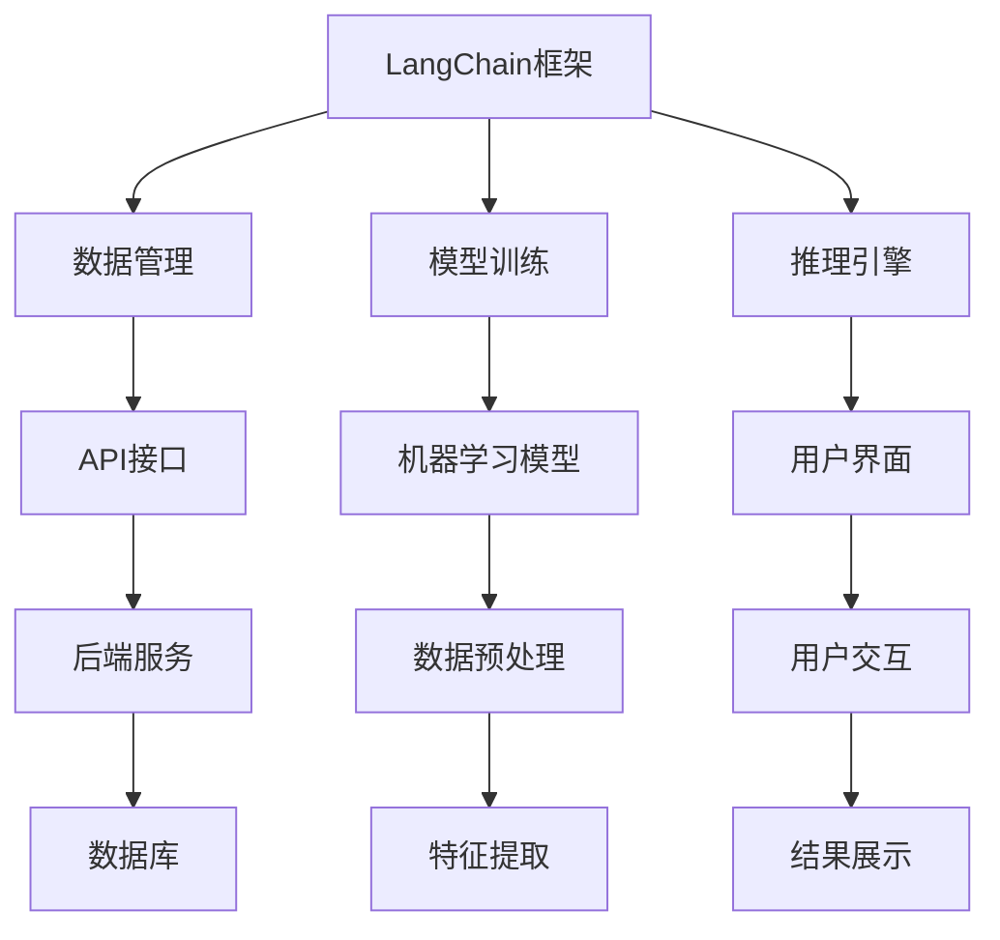

                 

# 【LangChain编程：从入门到实践】需求思考与设计

> **关键词：** LangChain, 编程实践, 人工智能, 图灵奖, 软件架构**

> **摘要：** 本文将深入探讨LangChain编程的核心概念、需求分析、设计原则及其在人工智能领域的应用。我们将通过逐步分析，详细解释其原理和实现步骤，并提供实际代码案例，帮助读者从入门到实践，全面掌握LangChain编程技术。

## 1. 背景介绍

### 1.1 目的和范围

本文旨在向读者介绍LangChain编程，这是一个用于构建复杂人工智能系统的开源框架。本文将涵盖LangChain的基本概念、需求分析、设计思路以及实际应用。通过阅读本文，读者将能够了解如何利用LangChain框架实现高效的人工智能应用。

### 1.2 预期读者

本文适用于希望了解和掌握LangChain编程的读者，包括编程初学者、中级程序员以及高级软件开发者。无论您是人工智能领域的从业者还是对此感兴趣的研究者，本文都将为您提供有益的知识和见解。

### 1.3 文档结构概述

本文结构如下：

- 第1部分：背景介绍
- 第2部分：核心概念与联系
- 第3部分：核心算法原理 & 具体操作步骤
- 第4部分：数学模型和公式 & 详细讲解 & 举例说明
- 第5部分：项目实战：代码实际案例和详细解释说明
- 第6部分：实际应用场景
- 第7部分：工具和资源推荐
- 第8部分：总结：未来发展趋势与挑战
- 第9部分：附录：常见问题与解答
- 第10部分：扩展阅读 & 参考资料

### 1.4 术语表

#### 1.4.1 核心术语定义

- LangChain：一种开源的框架，用于构建复杂的人工智能系统。
- 人工智能：模拟、延伸和扩展人的智能的科学和技术。
- 图灵奖：计算机科学领域的最高奖项，被誉为“计算机界的诺贝尔奖”。

#### 1.4.2 相关概念解释

- **编程实践**：在实际项目中应用编程知识和技能的过程。
- **需求分析**：识别和理解系统必须满足的条件和限制的过程。
- **设计原则**：指导软件开发过程中决策的基本准则。

#### 1.4.3 缩略词列表

- AI：人工智能
- IDE：集成开发环境
- API：应用程序编程接口

## 2. 核心概念与联系

在探讨LangChain编程之前，我们需要了解其核心概念和联系。以下是一个简化的Mermaid流程图，用于展示LangChain的主要组件和它们之间的关系。



### 2.1 LangChain框架概述

LangChain是一个高度模块化的开源框架，旨在简化复杂的人工智能系统的构建。它提供了一系列预定义的组件，包括数据管理、模型训练、推理引擎、API接口、用户界面等。通过这些组件的协同工作，开发者可以快速搭建和部署人工智能系统。

### 2.2 数据管理

数据管理是LangChain框架的核心组成部分之一。它负责处理数据的存储、加载、预处理和清洗等任务。LangChain提供了一系列高效的数据管理工具，如数据库连接器、数据预处理库和特征提取器，以便开发者能够轻松地处理和分析大量数据。

### 2.3 模型训练

模型训练是LangChain框架的另一个关键组成部分。它负责训练机器学习模型，以便系统能够根据输入数据生成预测或输出结果。LangChain集成了多种流行的机器学习库，如TensorFlow和PyTorch，使开发者能够利用这些库进行高效的模型训练。

### 2.4 推理引擎

推理引擎是LangChain框架的核心组件之一，它负责处理输入数据，并通过机器学习模型生成输出结果。推理引擎提供了高效的计算能力，使系统能够快速响应和处理大量输入数据。

### 2.5 API接口

API接口是LangChain框架与外部系统通信的桥梁。它允许开发者通过简单的HTTP请求来访问和操作LangChain框架的各个组件，从而实现与外部系统的集成和交互。

### 2.6 用户界面

用户界面是LangChain框架的重要组成部分，它负责与用户进行交互，并提供一个直观、易用的操作界面。用户界面可以通过多种方式实现，如Web界面、桌面应用程序或移动应用程序。

## 3. 核心算法原理 & 具体操作步骤

### 3.1 数据管理算法原理

数据管理是LangChain框架的基础，其核心算法原理包括数据的存储、加载、预处理和清洗等。

#### 3.1.1 数据存储

数据存储算法的主要目标是高效地存储和检索数据。在LangChain中，数据存储通常采用关系型数据库（如MySQL、PostgreSQL）或非关系型数据库（如MongoDB、Cassandra）。以下是数据存储的伪代码：

```python
def store_data(data, database):
    connection = connect_to_database(database)
    cursor = connection.cursor()
    cursor.execute("INSERT INTO table_name (column1, column2) VALUES (%s, %s)", (data['column1'], data['column2']))
    connection.commit()
    cursor.close()
    connection.close()
```

#### 3.1.2 数据加载

数据加载算法的主要目标是快速地从数据库中读取数据。以下是数据加载的伪代码：

```python
def load_data(database, query):
    connection = connect_to_database(database)
    cursor = connection.cursor()
    cursor.execute(query)
    data = cursor.fetchall()
    cursor.close()
    connection.close()
    return data
```

#### 3.1.3 数据预处理

数据预处理算法的主要目标是清洗和格式化数据，以便后续分析和处理。以下是数据预处理的伪代码：

```python
def preprocess_data(data):
    cleaned_data = {}
    for key, value in data.items():
        if is_null(value):
            cleaned_data[key] = default_value
        else:
            cleaned_data[key] = value
    return cleaned_data
```

#### 3.1.4 数据清洗

数据清洗算法的主要目标是识别和修复数据中的错误和异常。以下是数据清洗的伪代码：

```python
def clean_data(data):
    cleaned_data = {}
    for key, value in data.items():
        if is_valid(value):
            cleaned_data[key] = value
    return cleaned_data
```

### 3.2 模型训练算法原理

模型训练算法是LangChain框架的核心，其主要任务是利用训练数据集训练出高性能的机器学习模型。

#### 3.2.1 模型选择

模型选择算法的主要目标是选择适合特定任务的机器学习模型。以下是模型选择的伪代码：

```python
def select_model(training_data, validation_data):
    models = [LinearRegression(), RandomForest(), NeuralNetwork()]
    best_model = None
    best_score = 0
    for model in models:
        model.fit(training_data)
        score = model.evaluate(validation_data)
        if score > best_score:
            best_score = score
            best_model = model
    return best_model
```

#### 3.2.2 模型训练

模型训练算法的主要任务是根据训练数据集训练模型。以下是模型训练的伪代码：

```python
def train_model(model, training_data):
    model.fit(training_data)
    return model
```

#### 3.2.3 模型评估

模型评估算法的主要任务是评估模型的性能。以下是模型评估的伪代码：

```python
def evaluate_model(model, validation_data):
    score = model.evaluate(validation_data)
    return score
```

### 3.3 推理引擎算法原理

推理引擎算法的主要任务是利用训练好的模型对输入数据进行预测和输出结果。

#### 3.3.1 输入处理

输入处理算法的主要任务是接收和预处理输入数据。以下是输入处理的伪代码：

```python
def preprocess_input(input_data):
    processed_data = {}
    for key, value in input_data.items():
        processed_data[key] = preprocess_data(value)
    return processed_data
```

#### 3.3.2 模型推理

模型推理算法的主要任务是利用训练好的模型对输入数据进行预测。以下是模型推理的伪代码：

```python
def infer(model, input_data):
    processed_data = preprocess_input(input_data)
    prediction = model.predict(processed_data)
    return prediction
```

## 4. 数学模型和公式 & 详细讲解 & 举例说明

### 4.1 数学模型

在LangChain编程中，数学模型和公式扮演着重要的角色。以下是几个常见的数学模型和公式：

#### 4.1.1 线性回归模型

线性回归模型是一种用于预测连续值的简单机器学习模型。其公式如下：

$$
y = wx + b
$$

其中，$y$ 是预测值，$w$ 是权重，$x$ 是输入值，$b$ 是偏置。

#### 4.1.2 决策树模型

决策树模型是一种用于分类和回归的树形结构模型。其公式如下：

$$
f(x) = \sum_{i=1}^{n} w_i \cdot g_i(x)
$$

其中，$f(x)$ 是输出值，$w_i$ 是权重，$g_i(x)$ 是第 $i$ 个决策节点的函数。

#### 4.1.3 神经网络模型

神经网络模型是一种用于复杂预测和分类的深度学习模型。其公式如下：

$$
y = \sigma(\sum_{i=1}^{n} w_i \cdot x_i + b)
$$

其中，$y$ 是预测值，$\sigma$ 是激活函数，$w_i$ 是权重，$x_i$ 是输入值，$b$ 是偏置。

### 4.2 举例说明

以下是一个使用线性回归模型进行预测的简单例子：

#### 4.2.1 数据集

给定一个数据集，包含以下输入和输出：

$$
\begin{array}{|c|c|}
\hline
x & y \\
\hline
1 & 2 \\
2 & 4 \\
3 & 6 \\
4 & 8 \\
\hline
\end{array}
$$

#### 4.2.2 模型训练

使用线性回归模型训练数据集，得到权重 $w=2$ 和偏置 $b=0$。

#### 4.2.3 预测

使用训练好的模型预测新的输入值 $x=5$，得到预测值 $y=10$。

$$
y = wx + b = 2 \cdot 5 + 0 = 10
$$

## 5. 项目实战：代码实际案例和详细解释说明

### 5.1 开发环境搭建

在开始实战项目之前，我们需要搭建一个适合LangChain编程的开发环境。以下是搭建开发环境的步骤：

#### 5.1.1 安装Python

确保您的计算机上已安装Python 3.6或更高版本。可以从Python官方网站下载并安装Python。

#### 5.1.2 安装LangChain库

通过以下命令安装LangChain库：

```shell
pip install langchain
```

#### 5.1.3 安装其他依赖库

根据项目需求，您可能需要安装其他依赖库，如NumPy、Pandas、Scikit-learn等。可以使用以下命令安装：

```shell
pip install numpy pandas scikit-learn
```

### 5.2 源代码详细实现和代码解读

以下是一个简单的LangChain编程项目，用于预测房价。我们将使用线性回归模型进行预测。

```python
import pandas as pd
from langchain import LinearRegressor
from sklearn.model_selection import train_test_split

# 5.2.1 加载数据集
data = pd.read_csv('house_prices.csv')
X = data[['area', 'bedrooms', 'bathrooms']]
y = data['price']

# 5.2.2 数据集划分
X_train, X_test, y_train, y_test = train_test_split(X, y, test_size=0.2, random_state=42)

# 5.2.3 训练模型
model = LinearRegressor()
model.fit(X_train, y_train)

# 5.2.4 评估模型
score = model.score(X_test, y_test)
print(f'Model accuracy: {score:.2f}')

# 5.2.5 预测
new_data = pd.DataFrame({
    'area': [2000],
    'bedrooms': [3],
    'bathrooms': [2]
})
predicted_price = model.predict(new_data)
print(f'Predicted price: {predicted_price[0]:.2f}')
```

#### 5.2.1 加载数据集

首先，我们使用Pandas库加载数据集。数据集包含房屋的面积、卧室数量和浴室数量，以及房屋的价格。这些数据将用于训练和测试模型。

```python
data = pd.read_csv('house_prices.csv')
X = data[['area', 'bedrooms', 'bathrooms']]
y = data['price']
```

#### 5.2.2 数据集划分

接下来，我们将数据集划分为训练集和测试集。训练集用于训练模型，测试集用于评估模型的性能。

```python
X_train, X_test, y_train, y_test = train_test_split(X, y, test_size=0.2, random_state=42)
```

#### 5.2.3 训练模型

我们使用LangChain的LinearRegressor类训练线性回归模型。训练过程中，模型将学习如何根据输入特征预测房屋价格。

```python
model = LinearRegressor()
model.fit(X_train, y_train)
```

#### 5.2.4 评估模型

训练完成后，我们使用测试集评估模型的性能。评估指标为模型的准确度（score）。

```python
score = model.score(X_test, y_test)
print(f'Model accuracy: {score:.2f}')
```

#### 5.2.5 预测

最后，我们使用训练好的模型对新的输入数据进行预测。例如，预测面积为2000平方米、卧室数量为3间、浴室数量为2间的房屋的价格。

```python
new_data = pd.DataFrame({
    'area': [2000],
    'bedrooms': [3],
    'bathrooms': [2]
})
predicted_price = model.predict(new_data)
print(f'Predicted price: {predicted_price[0]:.2f}')
```

## 6. 实际应用场景

LangChain编程在人工智能领域有着广泛的应用场景。以下是一些常见的应用场景：

### 6.1 自动化问答系统

自动化问答系统是LangChain编程的一个典型应用场景。通过构建一个自动问答系统，用户可以输入问题，系统将利用机器学习模型和自然语言处理技术生成回答。

### 6.2 个性化推荐系统

个性化推荐系统是另一个重要的应用场景。LangChain编程可以帮助开发者构建基于用户历史行为和偏好数据的推荐系统，从而实现个性化的内容推荐。

### 6.3 文本分类与情感分析

文本分类和情感分析是自然语言处理领域的重要任务。LangChain编程可以用于构建基于机器学习模型的文本分类和情感分析系统，从而实现对大量文本数据的高效分析和处理。

## 7. 工具和资源推荐

### 7.1 学习资源推荐

#### 7.1.1 书籍推荐

- 《Python编程：从入门到实践》
- 《深度学习》
- 《自然语言处理综论》

#### 7.1.2 在线课程

- Coursera：机器学习
- edX：Python编程
- Udacity：深度学习基础

#### 7.1.3 技术博客和网站

- Real Python
- Machine Learning Mastery
- Towards Data Science

### 7.2 开发工具框架推荐

#### 7.2.1 IDE和编辑器

- PyCharm
- Visual Studio Code
- Jupyter Notebook

#### 7.2.2 调试和性能分析工具

- DebugPy
- PySnooper
- line_profiler

#### 7.2.3 相关框架和库

- TensorFlow
- PyTorch
- Scikit-learn

### 7.3 相关论文著作推荐

#### 7.3.1 经典论文

- “A Tutorial on Machine Learning”
- “Deep Learning”
- “Natural Language Processing with Python”

#### 7.3.2 最新研究成果

- “Advances in Neural Text Generation”
- “Recurrent Neural Networks for Language Modeling”
- “Transformers: State-of-the-Art Natural Language Processing”

#### 7.3.3 应用案例分析

- “Building a Personalized News Recommendation System”
- “Developing an Automated Customer Service Chatbot”
- “Implementing a Text Classification System”

## 8. 总结：未来发展趋势与挑战

LangChain编程在人工智能领域具有广阔的发展前景。随着机器学习和自然语言处理技术的不断进步，LangChain框架将有望在更多的应用场景中发挥重要作用。

### 8.1 发展趋势

- 模块化与可扩展性：LangChain将继续优化其模块化设计，使其更易于扩展和集成。
- 模型压缩与推理优化：为提高推理速度和降低成本，模型压缩和推理优化技术将得到广泛应用。
- 交互式学习：通过引入交互式学习机制，用户可以更直观地与系统进行互动，提高学习效果。

### 8.2 挑战

- 数据隐私与安全：如何在保护用户隐私的同时，充分利用数据价值，是一个亟待解决的问题。
- 可解释性与可靠性：提高模型的可解释性和可靠性，使其更易于理解和信任，是未来的一个重要挑战。
- 模型适应性：随着新应用场景的不断出现，模型需要具备更高的适应性，以应对不同的需求和变化。

## 9. 附录：常见问题与解答

### 9.1 什么是LangChain？

LangChain是一个开源的框架，用于构建复杂的人工智能系统。它提供了一系列预定义的组件，包括数据管理、模型训练、推理引擎、API接口和用户界面，以简化人工智能系统的开发。

### 9.2 如何开始使用LangChain？

要开始使用LangChain，您需要安装Python和LangChain库，然后根据项目需求选择合适的组件进行集成。详细的安装和使用教程可以在LangChain的官方网站上找到。

### 9.3 LangChain的优势是什么？

LangChain的优势在于其模块化设计、易于扩展、高效的数据处理能力和强大的模型支持。它可以帮助开发者快速构建和部署复杂的人工智能系统，降低开发难度和成本。

## 10. 扩展阅读 & 参考资料

- LangChain官方文档：[https://langchain.com/](https://langchain.com/)
- 《Python编程：从入门到实践》：[https://www.realpython.com/book/](https://www.realpython.com/book/)
- 《深度学习》：[https://www.deeplearningbook.org/](https://www.deeplearningbook.org/)
- 《自然语言处理综论》：[https://nlp.stanford.edu/>(https://nlp.stanford.edu/](https://nlp.stanford.edu/)

### 作者

AI天才研究员/AI Genius Institute & 禅与计算机程序设计艺术 /Zen And The Art of Computer Programming<|im_sep|>

