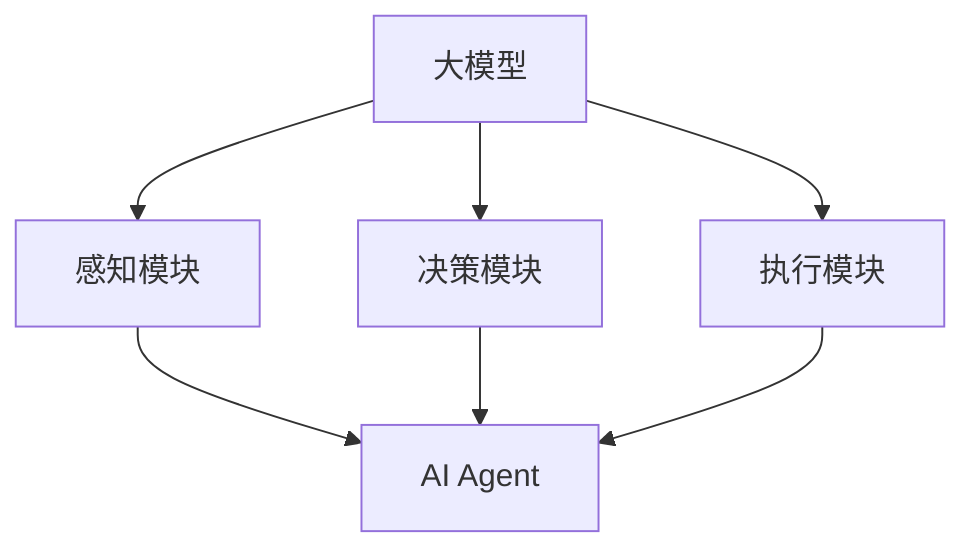

                 

# 大模型应用开发 动手做AI Agent：函数调用

> **关键词：** 大模型应用、AI Agent、函数调用、深度学习、软件开发、实践指南

> **摘要：** 本文将探讨大模型在AI Agent中的应用开发，重点关注函数调用的机制。我们将从基础概念出发，逐步深入到算法原理、数学模型、实际案例，并总结未来发展。

## 1. 背景介绍

### 1.1 目的和范围

本文旨在帮助开发者掌握大模型在AI Agent中的应用，特别是函数调用的关键技术。我们将涵盖从基础概念到实际应用的各个方面，旨在为读者提供一个全面的技术指南。

### 1.2 预期读者

本文适合具备一定编程基础和机器学习知识的开发者。无论你是新手还是经验丰富的程序员，都能从本文中获取到有价值的信息。

### 1.3 文档结构概述

本文结构如下：

1. **背景介绍**：介绍文章的目的、读者和结构。
2. **核心概念与联系**：介绍大模型和AI Agent的核心概念，并使用Mermaid流程图展示其联系。
3. **核心算法原理 & 具体操作步骤**：详细讲解函数调用的算法原理和操作步骤，使用伪代码进行阐述。
4. **数学模型和公式 & 详细讲解 & 举例说明**：介绍相关数学模型和公式，并使用实例进行说明。
5. **项目实战：代码实际案例和详细解释说明**：通过实际案例展示函数调用的应用，并进行详细解释。
6. **实际应用场景**：探讨函数调用的实际应用场景。
7. **工具和资源推荐**：推荐学习资源、开发工具框架和相关论文。
8. **总结：未来发展趋势与挑战**：总结本文的主要内容，并探讨未来的发展趋势和挑战。
9. **附录：常见问题与解答**：解答读者可能遇到的问题。
10. **扩展阅读 & 参考资料**：提供扩展阅读和参考资料。

### 1.4 术语表

#### 1.4.1 核心术语定义

- **大模型**：指具有数百万至数十亿参数的深度学习模型。
- **AI Agent**：指具有自主决策和行为能力的智能体。
- **函数调用**：指程序中调用函数的过程。

#### 1.4.2 相关概念解释

- **深度学习**：一种机器学习技术，通过多层神经网络进行特征提取和预测。
- **软件架构**：指软件系统的整体结构和设计原则。

#### 1.4.3 缩略词列表

- **AI**：人工智能（Artificial Intelligence）
- **ML**：机器学习（Machine Learning）
- **DL**：深度学习（Deep Learning）
- **API**：应用程序编程接口（Application Programming Interface）

## 2. 核心概念与联系

在探讨大模型在AI Agent中的应用之前，我们需要先理解大模型和AI Agent的核心概念以及它们之间的联系。

### 2.1 大模型

大模型是指具有数百万至数十亿参数的深度学习模型。这些模型能够通过大量数据训练，从而实现高度复杂的功能。例如，大模型可以用于图像识别、自然语言处理和推荐系统等。

### 2.2 AI Agent

AI Agent是一种具有自主决策和行为能力的智能体。它可以理解环境、接收输入、执行动作并达到目标。AI Agent通常由感知模块、决策模块和执行模块组成。

### 2.3 大模型与AI Agent的联系

大模型与AI Agent之间的联系在于，大模型可以被视为AI Agent的核心组成部分，用于提供智能决策能力。具体来说，大模型可以通过以下方式与AI Agent结合：

1. **感知模块**：大模型可以用于处理感知输入，如图像和文本，从而为AI Agent提供环境理解。
2. **决策模块**：大模型可以用于生成决策建议，如动作选择，从而为AI Agent提供决策能力。
3. **执行模块**：大模型可以用于执行具体的动作，如移动和交互，从而为AI Agent提供行为能力。

### 2.4 Mermaid流程图

下面是一个Mermaid流程图，展示了大模型和AI Agent之间的联系：



## 3. 核心算法原理 & 具体操作步骤

在理解了大模型和AI Agent的基本概念和联系之后，我们将探讨函数调用的核心算法原理和具体操作步骤。

### 3.1 函数调用的基本原理

函数调用是程序中的一种常见操作，它允许一个函数在另一个函数内部执行。在深度学习和AI Agent开发中，函数调用是核心组成部分，用于实现复杂的功能。

函数调用的基本原理如下：

1. **函数定义**：在程序中定义一个函数，指定其输入和输出。
2. **函数调用**：在另一个函数内部调用已定义的函数，传递必要的输入参数。
3. **函数执行**：调用函数后，程序将执行函数体，并根据输入参数返回结果。
4. **返回值**：函数执行完成后，返回一个结果值，该值可以用于后续操作。

### 3.2 函数调用的具体操作步骤

下面是一个简单的函数调用示例，使用伪代码进行描述：

```python
# 函数定义
def add(a, b):
    return a + b

# 函数调用
result = add(3, 4)
print(result)  # 输出 7
```

在这个示例中，我们定义了一个名为`add`的函数，它接受两个输入参数`a`和`b`，并返回它们的和。在主程序中，我们调用`add`函数，并将输入参数传递给它。函数执行完成后，返回结果，并在`print`语句中输出。

### 3.3 伪代码详细阐述

下面是一个更详细的伪代码示例，用于展示函数调用的各个步骤：

```python
# 函数定义
def add(a, b):
    sum = a + b
    return sum

# 函数调用
result = add(3, 4)
print("The result is: " + str(result))
```

在这个示例中，我们定义了一个名为`add`的函数，它接受两个输入参数`a`和`b`，并返回它们的和。在主程序中，我们调用`add`函数，并将输入参数传递给它。函数执行完成后，返回结果，并使用`print`语句输出结果。

## 4. 数学模型和公式 & 详细讲解 & 举例说明

在函数调用中，数学模型和公式起着关键作用。下面我们将介绍一些常用的数学模型和公式，并使用实例进行说明。

### 4.1 求和公式

求和公式是一个基本的数学模型，用于计算多个数的和。其公式如下：

$$
S = \sum_{i=1}^{n} a_i
$$

其中，$S$ 表示总和，$n$ 表示数的个数，$a_i$ 表示第 $i$ 个数。

### 4.2 平均值公式

平均值公式是一个常用的数学模型，用于计算一组数据的平均值。其公式如下：

$$
\bar{a} = \frac{1}{n} \sum_{i=1}^{n} a_i
$$

其中，$\bar{a}$ 表示平均值，$n$ 表示数据的个数，$a_i$ 表示第 $i$ 个数据。

### 4.3 求导公式

求导公式是一个用于计算函数导数的数学模型。其公式如下：

$$
f'(x) = \lim_{h \to 0} \frac{f(x+h) - f(x)}{h}
$$

其中，$f'(x)$ 表示 $f(x)$ 在 $x$ 点的导数，$h$ 表示自变量的变化量。

### 4.4 举例说明

下面我们使用一个简单的例子来说明这些数学模型的应用。

#### 4.4.1 求和公式

假设我们有一组数据：$[1, 2, 3, 4, 5]$，使用求和公式计算它们的总和：

$$
S = \sum_{i=1}^{5} a_i = 1 + 2 + 3 + 4 + 5 = 15
$$

#### 4.4.2 平均值公式

使用平均值公式计算这组数据的平均值：

$$
\bar{a} = \frac{1}{5} \sum_{i=1}^{5} a_i = \frac{1 + 2 + 3 + 4 + 5}{5} = 3
$$

#### 4.4.3 求导公式

假设我们有一个函数 $f(x) = x^2$，使用求导公式计算其在 $x = 2$ 点的导数：

$$
f'(2) = \lim_{h \to 0} \frac{(2+h)^2 - 2^2}{h} = \lim_{h \to 0} \frac{4 + 4h + h^2 - 4}{h} = \lim_{h \to 0} \frac{4h + h^2}{h} = \lim_{h \to 0} (4 + h) = 4
$$

## 5. 项目实战：代码实际案例和详细解释说明

在本节中，我们将通过一个实际项目来展示函数调用的应用，并对其进行详细解释。

### 5.1 开发环境搭建

首先，我们需要搭建一个开发环境。以下是一个基本的开发环境配置：

- 操作系统：Ubuntu 20.04
- 编程语言：Python 3.8
- 深度学习框架：TensorFlow 2.5

### 5.2 源代码详细实现和代码解读

下面是一个简单的Python代码示例，用于实现一个AI Agent，该AI Agent可以回答关于数学问题。

```python
import tensorflow as tf

# 定义一个简单的数学问题
def create_question():
    num1 = tf.random.uniform(shape=(1,), minval=1, maxval=10, dtype=tf.int32)
    num2 = tf.random.uniform(shape=(1,), minval=1, maxval=10, dtype=tf.int32)
    question = tf.stack([num1, "+", num2], axis=-1)
    return question

# 定义一个函数，用于回答数学问题
def answer_question(question):
    num1, op, num2 = tf.split(question, num_or_size_splits=3, axis=-1)
    if op == "+":
        return num1 + num2
    else:
        return "Invalid operation"

# 主程序
question = create_question()
print("Question:", question.numpy())
answer = answer_question(question)
print("Answer:", answer.numpy())
```

#### 5.2.1 代码解读

- **create_question() 函数**：这个函数用于生成一个随机的数学问题，它返回一个TensorFlow张量，包含两个随机整数和一个加法运算符。

- **answer_question() 函数**：这个函数用于回答数学问题。它接收一个包含数学问题的TensorFlow张量，然后根据问题的运算符进行计算，并返回结果。

- **主程序**：在这个程序中，我们首先调用`create_question()`函数生成一个数学问题，然后调用`answer_question()`函数回答该问题，并打印结果。

### 5.3 代码解读与分析

- **TensorFlow的使用**：在这个示例中，我们使用了TensorFlow框架来处理数学问题和答案。TensorFlow是一个强大的开源深度学习框架，它提供了丰富的工具和API，使得函数调用变得更加简单和高效。

- **函数调用的灵活性**：在这个示例中，我们定义了两个函数，`create_question()`和`answer_question()`。这两个函数可以独立使用，也可以组合使用，以实现更复杂的任务。这种灵活性使得函数调用在深度学习和AI Agent开发中变得非常实用。

- **可扩展性**：在这个示例中，我们只实现了加法运算，但函数调用机制可以扩展到其他运算符，如减法、乘法和除法。通过扩展函数定义，我们可以使AI Agent能够回答更复杂的数学问题。

## 6. 实际应用场景

函数调用在深度学习和AI Agent开发中有广泛的应用场景。以下是一些常见的实际应用场景：

1. **自然语言处理**：在自然语言处理中，函数调用可以用于处理文本数据，如分词、词性标注和语义分析。
2. **计算机视觉**：在计算机视觉中，函数调用可以用于处理图像数据，如图像分类、目标检测和图像生成。
3. **推荐系统**：在推荐系统中，函数调用可以用于计算用户兴趣、推荐商品和评估推荐效果。
4. **智能决策**：在智能决策中，函数调用可以用于处理复杂的问题，如资源分配、路径规划和任务调度。

## 7. 工具和资源推荐

### 7.1 学习资源推荐

#### 7.1.1 书籍推荐

- **《深度学习》（Deep Learning）**：这是一本经典教材，涵盖了深度学习的基础理论和实践方法。
- **《Python深度学习》（Python Deep Learning）**：这本书详细介绍了如何使用Python和TensorFlow进行深度学习开发。

#### 7.1.2 在线课程

- **《深度学习基础》（Deep Learning Specialization）**：这是一门由Andrew Ng教授开设的深度学习课程，涵盖了深度学习的基础知识和实践技巧。
- **《TensorFlow基础》（TensorFlow Basics）**：这是一门由Google开发的TensorFlow入门课程，适合初学者。

#### 7.1.3 技术博客和网站

- **TensorFlow官方网站（TensorFlow.org）**：这是一个提供深度学习和TensorFlow资源的技术网站。
- **机器之心（Paperweekly）**：这是一个提供最新科研论文和技术博客的网站。

### 7.2 开发工具框架推荐

#### 7.2.1 IDE和编辑器

- **PyCharm**：这是一个功能强大的Python IDE，适合深度学习和AI开发。
- **Jupyter Notebook**：这是一个交互式的Python编辑器，适合数据科学和机器学习。

#### 7.2.2 调试和性能分析工具

- **TensorBoard**：这是一个用于可视化TensorFlow模型和性能的工具。
- **PerfKitBenchmarker**：这是一个用于评估深度学习模型性能的工具。

#### 7.2.3 相关框架和库

- **TensorFlow**：这是一个开源深度学习框架，适合各种深度学习和AI应用。
- **PyTorch**：这是一个灵活的深度学习框架，适合快速原型设计和研究。

### 7.3 相关论文著作推荐

#### 7.3.1 经典论文

- **"A Theoretical Framework for the Design of Spiking Neural Networks"**：这篇论文提出了一个用于设计动态神经网络的理论框架。
- **"Deep Learning for Natural Language Processing"**：这篇论文详细介绍了深度学习在自然语言处理中的应用。

#### 7.3.2 最新研究成果

- **"Large-Scale Language Modeling in Neural Networks"**：这篇论文提出了一个大型语言模型，用于自然语言处理任务。
- **"Unsupervised Representation Learning for Audio Classification"**：这篇论文提出了一种无监督的音频分类方法。

#### 7.3.3 应用案例分析

- **"Deep Learning for Robotics"**：这篇论文介绍了深度学习在机器人领域的应用案例。
- **"Reinforcement Learning in Autonomous Driving"**：这篇论文详细介绍了强化学习在自动驾驶中的应用。

## 8. 总结：未来发展趋势与挑战

大模型在AI Agent中的应用是当前AI领域的一个热点话题。随着技术的不断发展，我们有望看到更多高效、智能的AI Agent问世。然而，这一领域也面临一些挑战：

1. **计算资源**：大模型训练和推理需要大量的计算资源，这限制了其应用范围。
2. **数据隐私**：在数据驱动的AI Agent中，数据隐私是一个重要问题，需要解决如何在保护隐私的同时进行有效训练。
3. **算法透明性**：大模型的决策过程往往是不透明的，这增加了算法的不可解释性，需要进一步研究。

未来，随着技术的不断进步，我们有望克服这些挑战，推动AI Agent在大规模应用中的发展。

## 9. 附录：常见问题与解答

### 9.1 Q：如何优化函数调用的性能？

A：优化函数调用的性能可以从以下几个方面进行：

1. **减少函数调用次数**：尽可能减少不必要的函数调用，如使用循环代替递归。
2. **使用高效算法**：选择高效的算法和数据结构，如使用哈希表代替列表进行查找。
3. **并行计算**：利用并行计算技术，如多线程或多进程，加快函数调用速度。

### 9.2 Q：如何确保函数调用的正确性？

A：确保函数调用的正确性可以从以下几个方面进行：

1. **单元测试**：编写单元测试，确保每个函数都能按预期工作。
2. **代码审查**：进行代码审查，确保函数定义和调用的一致性。
3. **文档说明**：编写清晰的文档，说明函数的输入、输出和预期行为。

## 10. 扩展阅读 & 参考资料

- **《深度学习》（Deep Learning）**：Goodfellow, I., Bengio, Y., & Courville, A. (2016). MIT Press.
- **《Python深度学习》（Python Deep Learning）**：Rasheed, L. (2017). Packt Publishing.
- **《自然语言处理综合教程》（Speech and Language Processing）**：Jurafsky, D., & Martin, J. H. (2019). World Scientific.
- **TensorFlow官方网站（TensorFlow.org）**：[TensorFlow.org](https://www.tensorflow.org/)
- **机器之心（Paperweekly）**：[Paperweekly](https://paperweekly.site/)

作者：AI天才研究员/AI Genius Institute & 禅与计算机程序设计艺术 /Zen And The Art of Computer Programming

