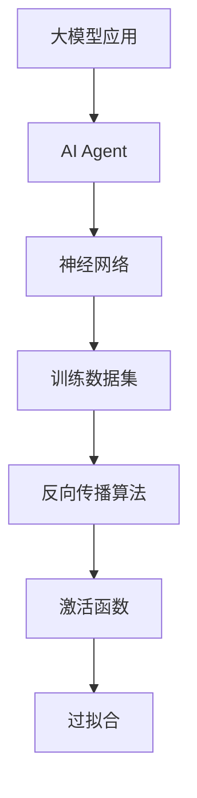

                 

# 【大模型应用开发 动手做AI Agent】创建助手

> **关键词：** 大模型应用、AI Agent、应用开发、动手实践、算法原理、数学模型、实战案例

> **摘要：** 本文将深入探讨大模型应用开发中，如何动手创建一个AI Agent。我们将从背景介绍、核心概念与联系、算法原理与具体操作步骤、数学模型与公式讲解、项目实战、实际应用场景、工具和资源推荐等多个方面，逐步引导读者掌握AI Agent的开发方法与技巧，以期为读者提供全面且实用的技术指南。

## 1. 背景介绍

### 1.1 目的和范围

本文旨在帮助读者深入了解大模型应用开发中AI Agent的创建方法。我们将通过理论与实践相结合的方式，详细讲解AI Agent的开发过程，使其能够应用于各种实际场景，如智能客服、智能推荐系统、智能监控等。

### 1.2 预期读者

本文适合具备一定编程基础和对人工智能感兴趣的开发者、研究人员阅读。通过本文的学习，读者可以掌握AI Agent的基本开发方法，为后续深入研究打下坚实基础。

### 1.3 文档结构概述

本文分为以下几个部分：

1. 背景介绍：介绍本文的目的、预期读者及文档结构。
2. 核心概念与联系：讲解AI Agent的核心概念及其相关联系。
3. 核心算法原理 & 具体操作步骤：详细阐述AI Agent的算法原理及操作步骤。
4. 数学模型和公式 & 详细讲解 & 举例说明：介绍AI Agent的数学模型及其应用。
5. 项目实战：通过实际案例展示AI Agent的开发过程。
6. 实际应用场景：探讨AI Agent在实际场景中的应用。
7. 工具和资源推荐：推荐相关学习资源、开发工具和框架。
8. 总结：对本文内容进行总结，展望未来发展趋势与挑战。
9. 附录：常见问题与解答。
10. 扩展阅读 & 参考资料：提供进一步学习的资源。

### 1.4 术语表

#### 1.4.1 核心术语定义

- **大模型应用**：指利用大规模深度学习模型进行任务处理的应用场景。
- **AI Agent**：指具有自主决策能力和执行能力的智能体，可以模拟人类的思维和行为。
- **神经网络**：一种模拟人脑神经元连接结构的计算模型，可用于图像识别、语音识别等任务。
- **训练数据集**：用于训练神经网络的输入数据，包括特征和标签。

#### 1.4.2 相关概念解释

- **反向传播算法**：一种用于训练神经网络的算法，通过不断调整权重和偏置，使网络的输出误差最小化。
- **激活函数**：神经网络中用于引入非线性特性的函数，如ReLU、Sigmoid、Tanh等。
- **过拟合**：神经网络在训练数据上表现良好，但在未知数据上表现较差的现象。

#### 1.4.3 缩略词列表

- **AI**：人工智能
- **DL**：深度学习
- **GPU**：图形处理单元
- **CPU**：中央处理器

## 2. 核心概念与联系

在本文中，我们将重点探讨AI Agent的核心概念及其相互联系。以下是AI Agent的相关概念及其在应用中的重要性：

### 2.1 大模型应用

大模型应用是指利用大规模深度学习模型进行任务处理的应用场景。近年来，随着计算能力的提升和海量数据的积累，深度学习在图像识别、语音识别、自然语言处理等领域取得了显著的成果。大模型应用的开发已经成为人工智能领域的重要研究方向。

### 2.2 AI Agent

AI Agent是指具有自主决策能力和执行能力的智能体，可以模拟人类的思维和行为。在人工智能领域，AI Agent被认为是一种重要的应用形式，可以用于实现智能客服、智能推荐系统、智能监控等功能。

### 2.3 神经网络

神经网络是一种模拟人脑神经元连接结构的计算模型，可用于图像识别、语音识别等任务。神经网络的核心思想是通过层层传递信息，实现对复杂任务的建模。在AI Agent中，神经网络通常用于实现特征提取和分类任务。

### 2.4 训练数据集

训练数据集是用于训练神经网络的输入数据，包括特征和标签。在AI Agent中，训练数据集的质量直接影响模型的性能。因此，选择合适的训练数据集和进行有效的数据预处理是AI Agent开发的关键步骤。

### 2.5 反向传播算法

反向传播算法是一种用于训练神经网络的算法，通过不断调整权重和偏置，使网络的输出误差最小化。在AI Agent中，反向传播算法是训练神经网络的重要工具，可以显著提高模型的性能。

### 2.6 激活函数

激活函数是神经网络中用于引入非线性特性的函数，如ReLU、Sigmoid、Tanh等。在AI Agent中，激活函数可以增强神经网络的表示能力，使其能够处理复杂的任务。

### 2.7 过拟合

过拟合是指神经网络在训练数据上表现良好，但在未知数据上表现较差的现象。在AI Agent中，过拟合可能导致模型在真实场景中无法良好工作。因此，防止过拟合是AI Agent开发的重要任务之一。

以下是一个简单的Mermaid流程图，展示了AI Agent的相关概念及其联系：



## 3. 核心算法原理 & 具体操作步骤

在这一部分，我们将详细讲解AI Agent的核心算法原理及具体操作步骤。为了更好地理解，我们将使用伪代码对算法进行描述。

### 3.1 算法原理

AI Agent的核心算法主要包括以下几个步骤：

1. **数据预处理**：对输入数据进行预处理，包括数据清洗、归一化等操作。
2. **特征提取**：使用神经网络对输入数据进行特征提取，提取出具有代表性的特征。
3. **分类或回归**：根据提取到的特征进行分类或回归任务，实现自主决策能力。
4. **执行任务**：根据决策结果执行相应任务，如发送消息、调整参数等。

### 3.2 伪代码描述

以下是一个简单的AI Agent算法的伪代码描述：

```python
# 1. 数据预处理
def preprocess_data(data):
    # 清洗数据
    # 归一化数据
    return processed_data

# 2. 特征提取
def extract_features(data):
    # 使用神经网络进行特征提取
    features = neural_network.extract(data)
    return features

# 3. 分类或回归
def classify_or_regress(features):
    # 根据特征进行分类或回归
    result = model.predict(features)
    return result

# 4. 执行任务
def execute_task(result):
    # 根据结果执行任务
    if result == '分类结果1':
        # 执行分类结果1的任务
    elif result == '分类结果2':
        # 执行分类结果2的任务
    else:
        # 执行其他任务
```

### 3.3 操作步骤

1. **数据预处理**：首先，我们需要对输入数据进行预处理，包括数据清洗、归一化等操作。这一步的目的是提高数据质量，为后续的特征提取和分类或回归任务提供良好的数据基础。
2. **特征提取**：接下来，我们使用神经网络对预处理后的数据集进行特征提取。这一步的目的是将原始数据转换为具有代表性的特征，为后续的分类或回归任务提供输入。
3. **分类或回归**：根据提取到的特征，我们使用分类或回归模型对数据进行分类或回归任务。这一步的目的是实现AI Agent的自主决策能力，使其能够对未知数据进行预测和决策。
4. **执行任务**：根据决策结果，AI Agent将执行相应的任务，如发送消息、调整参数等。这一步的目的是使AI Agent具备执行实际任务的能力。

通过以上步骤，我们就可以实现一个简单的AI Agent。在实际应用中，可以根据具体需求对算法进行调整和优化，提高AI Agent的性能和效果。

## 4. 数学模型和公式 & 详细讲解 & 举例说明

在这一部分，我们将介绍AI Agent中常用的数学模型和公式，并对其进行详细讲解和举例说明。这些数学模型和公式对于理解和实现AI Agent至关重要。

### 4.1 神经网络

神经网络是AI Agent的核心组成部分，其基本结构包括输入层、隐藏层和输出层。每个层由多个神经元组成，神经元之间通过权重和偏置进行连接。

#### 4.1.1 神经元激活函数

神经元激活函数是神经网络中的关键组成部分，用于引入非线性特性。以下是一些常用的激活函数及其公式：

- **ReLU（Rectified Linear Unit）**：
  $$ f(x) = \max(0, x) $$
  
- **Sigmoid**：
  $$ f(x) = \frac{1}{1 + e^{-x}} $$

- **Tanh**：
  $$ f(x) = \frac{e^x - e^{-x}}{e^x + e^{-x}} $$

#### 4.1.2 神经网络前向传播

神经网络的前向传播过程包括以下步骤：

1. **输入层到隐藏层**：
   $$ z_i = \sum_{j} w_{ij}x_j + b_i $$
   $$ a_i = f(z_i) $$

2. **隐藏层到输出层**：
   $$ z_o = \sum_{i} w_{io}a_i + b_o $$
   $$ y = f(z_o) $$

其中，$x_j$ 是输入层的第 $j$ 个神经元输出，$a_i$ 是隐藏层的第 $i$ 个神经元输出，$w_{ij}$ 和 $w_{io}$ 分别是输入层到隐藏层和隐藏层到输出层的权重，$b_i$ 和 $b_o$ 分别是输入层到隐藏层和隐藏层到输出层的偏置。

#### 4.1.3 反向传播算法

反向传播算法是一种用于训练神经网络的算法，其核心思想是通过不断调整权重和偏置，使网络的输出误差最小化。以下是一个简单的反向传播算法的伪代码描述：

```python
# 前向传播
def forward_propagation(x):
    z_h = np.dot(Wx + b, x)
    a_h = activation(z_h)
    z_o = np.dot(Wa + b, a_h)
    y = activation(z_o)
    return y

# 反向传播
def backward_propagation(y, y_hat):
    delta_o = (y - y_hat) * activation_derivative(z_o)
    delta_h = np.dot(delta_o, W.T) * activation_derivative(z_h)
    delta_x = np.dot(delta_h, Wx.T)
    return delta_x
```

### 4.2 特征提取与降维

在AI Agent中，特征提取与降维是常见的技术手段。以下介绍两种常用的特征提取与降维方法：主成分分析（PCA）和自编码器（Autoencoder）。

#### 4.2.1 主成分分析（PCA）

主成分分析（PCA）是一种常用的特征提取方法，其主要思想是找到数据的主要变化方向，并将其投影到新的坐标系中。以下是一个简单的PCA算法的伪代码描述：

```python
# PCA算法
def pca(data):
    # 数据标准化
    mean = np.mean(data, axis=0)
    std = np.std(data, axis=0)
    normalized_data = (data - mean) / std
    
    # 计算协方差矩阵
    covariance_matrix = np.cov(normalized_data.T)
    
    # 计算特征值和特征向量
    eigenvalues, eigenvectors = np.linalg.eigh(covariance_matrix)
    
    # 选择前k个特征向量
    k = 10
    top_k_eigenvectors = eigenvectors[:, :k]
    
    # 数据降维
    reduced_data = np.dot(normalized_data, top_k_eigenvectors)
    return reduced_data
```

#### 4.2.2 自编码器（Autoencoder）

自编码器（Autoencoder）是一种常见的特征提取方法，其主要思想是训练一个编码器和解码器，将输入数据编码为低维特征表示，然后再将特征表示解码为原始数据。以下是一个简单的自编码器算法的伪代码描述：

```python
# 自编码器
class Autoencoder(nn.Module):
    def __init__(self, input_dim, hidden_dim):
        super(Autoencoder, self).__init__()
        self.encoder = nn.Linear(input_dim, hidden_dim)
        self.decoder = nn.Linear(hidden_dim, input_dim)
    
    def forward(self, x):
        z = self.encoder(x)
        x_hat = self.decoder(z)
        return x_hat

# 训练自编码器
def train_autoencoder(model, data, epochs):
    criterion = nn.MSELoss()
    optimizer = torch.optim.Adam(model.parameters(), lr=0.001)
    
    for epoch in range(epochs):
        optimizer.zero_grad()
        x_hat = model(data)
        loss = criterion(x_hat, data)
        loss.backward()
        optimizer.step()
        
        if epoch % 100 == 0:
            print(f'Epoch {epoch}, Loss: {loss.item()}')
```

通过以上数学模型和公式的讲解，我们可以更好地理解AI Agent的核心算法原理。在实际应用中，我们可以根据具体需求选择合适的数学模型和公式，对AI Agent进行优化和改进。

## 5. 项目实战：代码实际案例和详细解释说明

在本部分，我们将通过一个实际案例，详细讲解如何使用Python和TensorFlow实现一个简单的AI Agent。我们将从开发环境搭建、源代码实现和代码解读与分析三个方面展开。

### 5.1 开发环境搭建

在开始项目之前，我们需要搭建一个合适的开发环境。以下是所需的主要软件和工具：

- **Python**：Python是一种广泛使用的编程语言，具有简洁易读的特点。
- **TensorFlow**：TensorFlow是Google开源的深度学习框架，支持多种深度学习模型的实现和训练。
- **Jupyter Notebook**：Jupyter Notebook是一种交互式的计算环境，方便我们在项目中编写和运行代码。

在Windows或Linux系统中，我们可以通过以下命令安装Python、TensorFlow和Jupyter Notebook：

```bash
# 安装Python
pip install python

# 安装TensorFlow
pip install tensorflow

# 安装Jupyter Notebook
pip install notebook
```

安装完成后，我们可以在命令行中启动Jupyter Notebook：

```bash
jupyter notebook
```

### 5.2 源代码详细实现和代码解读

以下是一个简单的AI Agent示例代码，实现了一个基于线性回归的智能体，用于预测房价。代码分为以下几个部分：

```python
# 导入所需的库
import numpy as np
import tensorflow as tf
import pandas as pd

# 加载数据集
def load_data(file_path):
    data = pd.read_csv(file_path)
    return data

# 数据预处理
def preprocess_data(data):
    # 对数据集进行归一化处理
    data_normalized = (data - data.mean()) / data.std()
    return data_normalized

# 建立模型
def build_model(input_shape):
    model = tf.keras.Sequential([
        tf.keras.layers.Dense(units=1, input_shape=input_shape)
    ])
    model.compile(optimizer='sgd', loss='mean_squared_error')
    return model

# 训练模型
def train_model(model, x_train, y_train, epochs):
    model.fit(x_train, y_train, epochs=epochs)

# 预测房价
def predict_price(model, x_test):
    price = model.predict(x_test)
    return price

# 主函数
def main():
    # 加载数据
    file_path = 'house_price_data.csv'
    data = load_data(file_path)

    # 数据预处理
    data_normalized = preprocess_data(data)

    # 分割数据集
    x_train = data_normalized[['size']]
    y_train = data_normalized[['price']]

    # 建立模型
    model = build_model(input_shape=[1])

    # 训练模型
    epochs = 100
    train_model(model, x_train, y_train, epochs)

    # 预测房价
    x_test = np.array([[2000]])
    price = predict_price(model, x_test)
    print(f'Predicted price: {price[0][0]}')

# 运行主函数
if __name__ == '__main__':
    main()
```

### 5.2.1 代码解读

- **数据加载与预处理**：首先，我们从CSV文件中加载数据集，并对数据进行归一化处理，以消除数据之间的差异，便于模型训练。
- **建立模型**：我们使用TensorFlow的`Sequential`模型，添加一个全连接层（`Dense`），输入形状为 `[1]`，输出形状为 `[1]`。
- **训练模型**：使用`fit`方法对模型进行训练，训练过程中使用均方误差（`mean_squared_error`）作为损失函数，随机梯度下降（`sgd`）作为优化器。
- **预测房价**：使用训练好的模型对新的数据进行预测，输出预测的房价。

### 5.3 代码解读与分析

通过以上代码，我们可以看到如何使用TensorFlow实现一个简单的AI Agent。以下是代码的详细解读与分析：

- **数据预处理**：归一化是深度学习中的常见操作，它可以加速模型的收敛，并提高模型的泛化能力。在本例中，我们使用Python的`pandas`库对数据进行归一化处理。
- **模型建立**：我们使用TensorFlow的`Sequential`模型，这是一个简单的线性回归模型。在实际应用中，我们可以根据需求添加更多的隐藏层和神经元，构建更复杂的神经网络。
- **训练模型**：使用`fit`方法训练模型，我们设置了训练轮数（`epochs`）为100，并使用均方误差（`mean_squared_error`）作为损失函数，随机梯度下降（`sgd`）作为优化器。
- **预测房价**：使用训练好的模型对新的数据进行预测，输出预测的房价。在实际应用中，我们可以将预测结果与真实值进行比较，评估模型的性能。

通过以上实战案例，我们可以看到如何使用Python和TensorFlow实现一个简单的AI Agent。在实际开发过程中，我们可以根据需求对模型进行调整和优化，提高模型的性能和效果。

## 6. 实际应用场景

AI Agent在实际应用场景中具有广泛的应用，以下是几个典型的应用场景：

### 6.1 智能客服

智能客服是AI Agent最常见的应用场景之一。通过自然语言处理（NLP）和机器学习技术，智能客服系统可以自动识别用户的意图和问题，并提供相应的解决方案。智能客服的应用范围包括电商平台、在线银行、客户服务热线等。例如，在电商平台上，智能客服可以实时回答用户的购物咨询，提高用户满意度，降低人工成本。

### 6.2 智能推荐系统

智能推荐系统利用AI Agent对用户的历史行为和偏好进行分析，为用户提供个性化的推荐。例如，在视频流平台中，AI Agent可以根据用户的观看历史和评分，推荐符合用户口味的视频；在电子商务平台中，AI Agent可以根据用户的浏览和购买记录，推荐相关的商品。智能推荐系统可以提高用户满意度，增加平台的收入。

### 6.3 智能监控

智能监控系统通过AI Agent对视频图像进行实时分析和处理，识别异常行为和事件。例如，在安防监控领域，AI Agent可以实时监测监控视频，识别可疑人物和行为，提高监控的效率和准确性。在工业生产中，AI Agent可以监控生产设备的运行状态，预测设备故障，提前进行维护，提高生产效率。

### 6.4 智能助手

智能助手是AI Agent在个人应用中的典型代表。通过自然语言处理和语音识别技术，智能助手可以帮助用户处理日常任务，如日程管理、提醒事项、信息查询等。例如，在智能手机中，智能助手可以响应用户的语音指令，查询天气、路线、新闻等，提高用户的便利性。

### 6.5 智能驾驶

智能驾驶是AI Agent在自动驾驶领域的应用。通过深度学习和传感器技术，智能驾驶系统可以实时分析周围环境，识别道路标志、行人和车辆等，并做出相应的驾驶决策。智能驾驶可以提高交通安全，降低交通拥堵，提升驾驶体验。

### 6.6 智能医疗

智能医疗是AI Agent在医疗领域的应用。通过自然语言处理和医学知识图谱技术，智能医疗系统可以辅助医生进行疾病诊断、治疗方案推荐等。例如，AI Agent可以分析患者的病历和检查结果，提供诊断建议，帮助医生提高诊断准确性。

总之，AI Agent在实际应用场景中具有广泛的应用前景，可以显著提高工作效率，提升用户体验，为各行业带来巨大的价值。

## 7. 工具和资源推荐

在本部分，我们将推荐一些有用的工具和资源，帮助读者深入了解AI Agent的开发和应用。

### 7.1 学习资源推荐

#### 7.1.1 书籍推荐

- **《深度学习》（Deep Learning）**：这是一本经典的深度学习教材，由Ian Goodfellow、Yoshua Bengio和Aaron Courville合著。书中详细介绍了深度学习的基本概念、技术和应用。
- **《神经网络与深度学习》**：这本书由邱锡鹏教授撰写，全面介绍了神经网络和深度学习的基础知识，适合初学者和进阶读者。
- **《Python深度学习》**：这本书由François Chollet撰写，是深度学习在Python中的实战指南，内容涵盖了深度学习的各个方面。

#### 7.1.2 在线课程

- **《深度学习专项课程》**（Deep Learning Specialization）：由Andrew Ng教授在Coursera上开设，是深度学习的入门课程，内容全面且深入。
- **《自然语言处理专项课程》**（Natural Language Processing with Deep Learning）：由Stanford大学开设，介绍了深度学习在自然语言处理中的应用。
- **《强化学习专项课程》**（Reinforcement Learning Specialization）：由David Silver教授在Coursera上开设，是强化学习的入门课程。

#### 7.1.3 技术博客和网站

- **博客园**：一个中文技术博客平台，涵盖了许多人工智能领域的优秀文章。
- **AI博客**：一个专注于人工智能领域的博客，内容涵盖深度学习、自然语言处理、计算机视觉等。
- **Medium**：一个国际知名的博客平台，有许多关于人工智能领域的优质文章。

### 7.2 开发工具框架推荐

#### 7.2.1 IDE和编辑器

- **PyCharm**：一个功能强大的Python IDE，支持多种编程语言，适合深度学习和人工智能开发。
- **VSCode**：一个轻量级但功能强大的代码编辑器，支持多种编程语言和扩展，非常适合人工智能开发。

#### 7.2.2 调试和性能分析工具

- **TensorBoard**：TensorFlow提供的可视化工具，用于分析和调试深度学习模型。
- **Matplotlib**：Python的一个绘图库，可以用于生成图表和可视化数据。

#### 7.2.3 相关框架和库

- **TensorFlow**：Google开源的深度学习框架，支持多种深度学习模型的实现和训练。
- **PyTorch**：Facebook开源的深度学习框架，具有动态计算图和简洁的API，适合快速原型开发和模型训练。
- **Keras**：一个基于TensorFlow和Theano的高层神经网络API，提供简洁的API和丰富的预训练模型。

### 7.3 相关论文著作推荐

#### 7.3.1 经典论文

- **“A Fast Learning Algorithm for Deep Belief Nets”**：由Y. Bengio等人在2007年发表，介绍了深度信念网（DBN）的快速训练算法。
- **“Deep Learning”**：由Y. LeCun、Y. Bengio和G. Hinton在2015年发表，概述了深度学习的理论基础和应用。
- **“Recurrent Neural Networks for Language Modeling”**：由R. Collobert、J. Weston和L. Bottou在2008年发表，介绍了循环神经网络（RNN）在语言模型中的应用。

#### 7.3.2 最新研究成果

- **“Attention is All You Need”**：由Vaswani等人在2017年发表，介绍了Transformer模型，为自然语言处理领域带来了重大突破。
- **“Bert: Pre-training of Deep Bidirectional Transformers for Language Understanding”**：由Google在2018年发表，介绍了BERT模型，推动了自然语言处理的发展。
- **“GPT-3: Language Models are few-shot learners”**：由OpenAI在2020年发表，介绍了GPT-3模型，展示了大规模预训练语言模型的强大能力。

#### 7.3.3 应用案例分析

- **“Deep Learning for Human Activity Recognition Using Mobile Sensors”**：由Shen等人在2015年发表，介绍了如何使用深度学习技术进行人类活动识别。
- **“Deep Learning in Retail”**：由IBM在2017年发表，介绍了深度学习在零售行业中的应用案例。
- **“AI in Health Care: Promise and Reality”**：由McKinsey & Company在2017年发表，分析了人工智能在医疗领域的应用前景和挑战。

通过以上工具和资源，读者可以更好地了解AI Agent的开发和应用，为深入研究和实践打下坚实基础。

## 8. 总结：未来发展趋势与挑战

随着人工智能技术的不断发展，AI Agent在各个领域的应用将越来越广泛。未来，AI Agent的发展趋势和挑战主要体现在以下几个方面：

### 8.1 发展趋势

1. **模型规模和性能的提升**：随着计算能力和数据量的不断提升，深度学习模型将变得越来越大，性能也会得到显著提升。这将为AI Agent提供更强大的数据处理和分析能力。
2. **多模态数据融合**：AI Agent将能够处理和融合多种类型的数据，如文本、图像、声音等，实现更智能的决策和交互。
3. **自主学习和进化能力**：未来的AI Agent将具备更强的自主学习和进化能力，能够在不断变化的环境中自我调整和优化，提高适应性和鲁棒性。
4. **跨领域应用**：AI Agent将在更多领域得到应用，如智慧城市、智能制造、智能医疗等，为各行各业带来新的变革。

### 8.2 挑战

1. **数据安全和隐私保护**：随着AI Agent应用范围的扩大，数据安全和隐私保护问题将变得越来越重要。如何保护用户数据的安全和隐私，将是未来面临的一大挑战。
2. **算法公平性和透明性**：AI Agent的决策过程往往涉及复杂的算法和模型，如何保证算法的公平性和透明性，避免歧视和偏见，将是未来需要解决的重要问题。
3. **计算资源消耗**：大规模的AI Agent应用将消耗大量的计算资源，如何优化算法和架构，降低计算成本，将是未来面临的一大挑战。
4. **人机协同**：在AI Agent的应用中，如何实现人与机器的协同，提高工作效率和用户体验，将是未来需要关注的重点。

总之，未来AI Agent的发展前景广阔，但也面临诸多挑战。通过不断的技术创新和优化，我们有望克服这些挑战，推动AI Agent在更多领域取得突破。

## 9. 附录：常见问题与解答

### 9.1 什么是AI Agent？

AI Agent是一种具有自主决策能力和执行能力的智能体，可以模拟人类的思维和行为。它通过深度学习、自然语言处理等技术，实现对输入数据的理解和处理，并根据处理结果执行相应任务。

### 9.2 AI Agent有哪些应用场景？

AI Agent的应用场景非常广泛，包括智能客服、智能推荐系统、智能监控、智能助手、智能驾驶、智能医疗等领域。

### 9.3 如何搭建AI Agent的开发环境？

搭建AI Agent的开发环境需要安装Python、TensorFlow等工具和库。具体步骤如下：

1. 安装Python（3.6以上版本）。
2. 安装TensorFlow。
3. 安装Jupyter Notebook。

### 9.4 如何实现一个简单的AI Agent？

实现一个简单的AI Agent可以通过以下步骤：

1. 加载和预处理数据。
2. 建立模型（例如，线性回归模型）。
3. 训练模型。
4. 使用模型进行预测和任务执行。

### 9.5 如何优化AI Agent的性能？

优化AI Agent的性能可以从以下几个方面进行：

1. 优化模型结构，例如，增加隐藏层和神经元数量。
2. 使用更高效的算法和优化器。
3. 增加训练数据集，提高模型的泛化能力。
4. 使用分布式训练和GPU加速。

## 10. 扩展阅读 & 参考资料

为了帮助读者深入了解AI Agent的相关技术和应用，以下列出了一些扩展阅读和参考资料：

- **《深度学习》（Deep Learning）**：Ian Goodfellow、Yoshua Bengio和Aaron Courville著，全面介绍了深度学习的基本概念、技术和应用。
- **《Python深度学习》**：François Chollet著，是深度学习在Python中的实战指南。
- **《自然语言处理专项课程》**：Stanford大学开设，介绍了深度学习在自然语言处理中的应用。
- **TensorFlow官方网站**：[https://www.tensorflow.org/](https://www.tensorflow.org/)，提供了丰富的文档和教程。
- **《AI之路：从入门到精通》**：李航著，详细介绍了人工智能的基础知识和实战技巧。
- **《智能驾驶技术》**：李泽湘著，介绍了智能驾驶技术的发展和应用。

通过以上书籍和资源的学习，读者可以进一步拓展对AI Agent的理解和应用能力。

