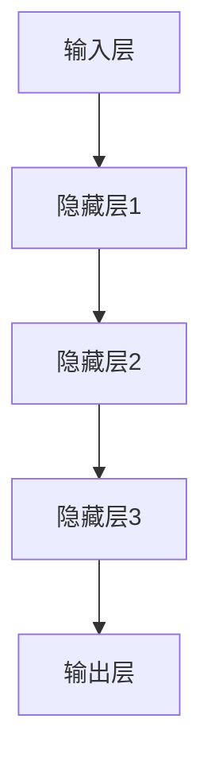
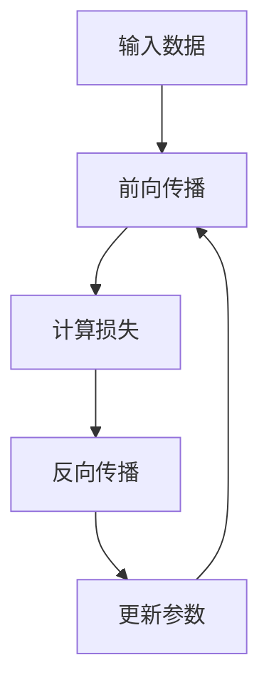

                 

### 1. 背景介绍

#### 1.1 目的和范围

本文旨在为您提供一个全面而详尽的指南，以创建和部署自己的大型模型实例，特别是AI Agent，用于实际应用开发。随着人工智能技术的不断进步和大规模模型的广泛应用，掌握如何构建和优化这些模型变得愈发重要。本文将帮助您了解整个流程，从基本概念到具体的操作步骤，再到实际应用。

本文的主要内容包括：

- **基本概念与联系**：介绍构建大模型所需的核心概念和架构，并使用Mermaid流程图进行说明。
- **核心算法原理 & 具体操作步骤**：详细讲解大模型的算法原理，并通过伪代码展示具体实现步骤。
- **数学模型和公式**：解释大模型背后的数学基础，包括公式和具体例子。
- **项目实战**：通过实际代码案例展示如何从零开始构建AI Agent，并进行详细解读。
- **实际应用场景**：探讨大模型在不同领域的应用实例。
- **工具和资源推荐**：推荐学习资源、开发工具和最新研究成果。

本文不仅适合对AI和大型模型有一定了解的技术人员，也适合希望进入这一领域的新手。通过本文，您将能够更好地理解大模型的应用开发，从而为自己的项目带来创新和效率。

#### 1.2 预期读者

本文适用于以下几类读者：

- **人工智能领域的研究人员和开发者**：希望深入了解大型模型构建和优化的专业人士。
- **数据科学家和机器学习工程师**：需要掌握最新技术和工具以提升工作效率的从业者。
- **计算机科学和工程专业的学生**：希望深入了解人工智能理论和实践的在校学生。
- **对AI应用开发感兴趣的爱好者**：希望自学并尝试构建自己的AI Agent的编程爱好者。

无论您的背景如何，只要您对人工智能和大型模型的应用有兴趣，本文都将为您提供宝贵的知识和实用技能。

#### 1.3 文档结构概述

本文结构清晰，分为以下几个部分：

- **第1章 背景介绍**：介绍本文的目的、读者预期以及文档结构。
- **第2章 核心概念与联系**：阐述构建大模型所需的核心概念和架构。
- **第3章 核心算法原理 & 具体操作步骤**：详细讲解大模型的算法原理和实现步骤。
- **第4章 数学模型和公式 & 详细讲解 & 举例说明**：解释大模型背后的数学基础。
- **第5章 项目实战：代码实际案例和详细解释说明**：通过实际代码案例展示模型构建过程。
- **第6章 实际应用场景**：探讨大模型的应用实例。
- **第7章 工具和资源推荐**：推荐学习资源、开发工具和最新研究成果。
- **第8章 总结：未来发展趋势与挑战**：总结本文的主要观点，展望未来。
- **第9章 附录：常见问题与解答**：解答读者可能遇到的问题。
- **第10章 扩展阅读 & 参考资料**：提供更多深入学习的资源。

通过本文的逐节阅读，您将逐步掌握大型模型的应用开发，实现从理论到实践的跨越。

#### 1.4 术语表

在本文中，我们将使用一些专业术语。以下是对这些术语的定义和解释：

#### 1.4.1 核心术语定义

- **大模型（Large Model）**：指参数规模超过数百万的深度学习模型。
- **AI Agent**：具有自主学习和决策能力的智能体。
- **训练数据（Training Data）**：用于训练模型的输入数据。
- **精度（Accuracy）**：模型预测正确的比例。
- **梯度下降（Gradient Descent）**：一种优化算法，用于寻找最小化损失函数的参数。
- **反向传播（Backpropagation）**：一种计算神经网络梯度的方法。

#### 1.4.2 相关概念解释

- **神经网络（Neural Network）**：模拟人脑神经元连接结构的计算模型。
- **损失函数（Loss Function）**：衡量模型预测结果与实际结果之间差异的函数。
- **激活函数（Activation Function）**：用于引入非线性性的函数，例如ReLU、Sigmoid、Tanh。

#### 1.4.3 缩略词列表

- **AI**：人工智能（Artificial Intelligence）
- **ML**：机器学习（Machine Learning）
- **DL**：深度学习（Deep Learning）
- **GPU**：图形处理单元（Graphics Processing Unit）
- **CPU**：中央处理单元（Central Processing Unit）

通过了解这些术语和概念，您将为深入理解本文内容打下坚实的基础。

### 2. 核心概念与联系

在构建大型模型实例之前，我们需要理解一些核心概念和它们之间的相互关系。以下内容将详细阐述这些概念，并使用Mermaid流程图展示其架构。

#### 2.1 大模型的基本概念

大模型，通常指参数规模超过数百万的深度学习模型，如BERT、GPT、T5等。这些模型通过学习大量的训练数据来提取特征，从而在多种任务上实现高精度。核心概念包括：

- **神经网络（Neural Network）**：是构建大模型的基础，模拟人脑神经元连接结构，通过多层网络进行特征提取和转换。
- **参数（Parameters）**：是神经网络中的权重和偏置，用于调节模型在训练过程中的学习效果。
- **训练数据（Training Data）**：用于训练模型的输入数据，是模型学习的重要资源。

#### 2.2 大模型的架构

大模型的架构通常包括以下几个主要组成部分：

- **输入层（Input Layer）**：接收外部输入数据，例如文本、图像或声音。
- **隐藏层（Hidden Layers）**：进行特征提取和转换，通过多层结构实现复杂的非线性映射。
- **输出层（Output Layer）**：生成模型的最终输出，如分类结果、文本生成等。

以下是一个使用Mermaid绘制的简化版大模型架构流程图：



#### 2.3 大模型的训练过程

大模型的训练过程是通过优化算法不断调整模型参数，以最小化损失函数的过程。核心步骤包括：

- **前向传播（Forward Propagation）**：将输入数据传递到神经网络，计算输出。
- **反向传播（Backpropagation）**：计算损失函数的梯度，并更新模型参数。
- **优化算法（Optimization Algorithm）**：如梯度下降、Adam等，用于调整模型参数。

以下是一个使用Mermaid绘制的简化版训练过程流程图：



#### 2.4 大模型的应用场景

大模型在多个领域具有广泛的应用，例如自然语言处理、计算机视觉、语音识别等。以下是几个典型的应用场景：

- **自然语言处理（NLP）**：如文本分类、机器翻译、情感分析等。
- **计算机视觉（CV）**：如图像分类、目标检测、图像生成等。
- **语音识别（ASR）**：如语音识别、语音合成等。

这些应用场景的共同特点是数据量大、任务复杂，需要强大的计算能力和精细的模型优化。

通过理解上述核心概念和架构，我们将为接下来的算法原理和具体实现步骤打下坚实的基础。接下来，我们将深入探讨大模型背后的算法原理，并通过伪代码详细阐述其实现过程。

### 3. 核心算法原理 & 具体操作步骤

在深入理解了大型模型的基本概念和架构后，我们将探讨其核心算法原理，并使用伪代码详细阐述实现步骤。以下是构建大型模型的算法原理和具体操作步骤。

#### 3.1 算法原理

大型模型的构建主要依赖于以下几个核心算法原理：

- **神经网络（Neural Network）**：通过多层网络结构进行特征提取和转换，实现复杂的非线性映射。
- **梯度下降（Gradient Descent）**：通过反向传播算法计算损失函数的梯度，并更新模型参数。
- **激活函数（Activation Function）**：引入非线性性，使神经网络能够拟合复杂的函数。

以下是一个简化的神经网络算法原理伪代码：

```plaintext
初始化神经网络参数 W, b
初始化学习率 alpha
初始化损失函数 loss_function

for epoch in 1 to EPOCHS do:
    for each training sample (x, y) do:
        forward_pass(x) // 前向传播
        loss = loss_function(y, output) // 计算损失
        backward_pass(output, y) // 反向传播
        update_parameters(W, b, alpha) // 更新参数
    end
end
```

#### 3.2 具体操作步骤

下面我们将详细解释大模型训练过程中每一步的具体操作步骤。

##### 3.2.1 前向传播

前向传播是指将输入数据传递到神经网络中，通过多层网络进行特征提取和转换，最终得到输出结果。以下是一个简化的前向传播伪代码：

```plaintext
forward_pass(x):
    for layer in layers do:
        z = layer activation function(input) // 计算激活值
        output = layer output function(z) // 计算输出值
    end
    return output
```

其中，`layer activation function` 是激活函数，如ReLU、Sigmoid或Tanh，而`layer output function` 是输出函数，如线性函数。

##### 3.2.2 反向传播

反向传播是指计算损失函数的梯度，并利用梯度更新模型参数。以下是一个简化的反向传播伪代码：

```plaintext
backward_pass(output, y):
    delta = output - y // 计算误差
    for layer in reverse(layers) do:
        dz = layer derivative(output) // 计算误差的导数
        dW = delta * dz // 计算权重梯度
        db = delta * dz // 计算偏置梯度
        delta = dW * layer derivative(input) // 更新误差
    end
    return dW, db
```

其中，`layer derivative(output)` 是输出函数的导数，`layer derivative(input)` 是激活函数的导数。

##### 3.2.3 梯度下降

梯度下降是一种优化算法，用于更新模型参数以最小化损失函数。以下是一个简化的梯度下降伪代码：

```plaintext
update_parameters(W, b, alpha):
    for layer in layers do:
        W = W - alpha * dW // 更新权重
        b = b - alpha * db // 更新偏置
    end
```

其中，`alpha` 是学习率，用于控制参数更新的幅度。

#### 3.3 实例解析

为了更好地理解上述算法原理和操作步骤，我们来看一个具体的实例：使用神经网络对图像进行分类。

假设我们有一个包含10万个图像的训练数据集，每个图像被标注为10个类别中的一个。我们的目标是通过训练一个神经网络模型，能够对新的图像进行正确的分类。

1. **数据预处理**：对图像进行标准化处理，将图像尺寸调整为固定的维度，并将其转换为张量形式。
2. **模型初始化**：初始化神经网络的结构，包括输入层、隐藏层和输出层，以及模型的参数（权重和偏置）。
3. **前向传播**：将预处理后的图像输入到神经网络中，通过前向传播得到模型的输出。
4. **计算损失**：使用交叉熵损失函数计算模型输出与实际标注之间的差异。
5. **反向传播**：计算损失函数的梯度，并更新模型参数。
6. **迭代训练**：重复执行前向传播和反向传播，直到达到预定的迭代次数或模型性能达到要求。

通过上述步骤，我们能够训练出一个能够对图像进行分类的神经网络模型。这个过程不仅需要大量的计算资源和时间，还需要对模型结构和超参数进行精细调整，以达到最佳性能。

#### 3.4 案例研究：训练一个文本分类模型

下面，我们将通过一个具体的案例研究，进一步展示如何使用神经网络进行文本分类。

##### 3.4.1 数据集

我们使用一个包含1000篇新闻文章的数据集，每篇文章被标注为政治、经济、体育等5个类别中的一个。数据集的格式如下：

```plaintext
文本1,政治
文本2,经济
文本3,体育
...
文本1000,科技
```

##### 3.4.2 模型架构

我们构建一个包含输入层、两个隐藏层和一个输出层的神经网络。输入层接收文本的词嵌入表示，隐藏层通过多层卷积神经网络进行特征提取，输出层通过softmax函数输出每个类别的概率。

```plaintext
输入层 -> 隐藏层1 -> 隐藏层2 -> 输出层
```

##### 3.4.3 训练过程

1. **数据预处理**：将文本转换为词嵌入表示，并对词嵌入进行标准化处理。
2. **模型初始化**：初始化神经网络的结构和参数。
3. **前向传播**：将词嵌入输入到神经网络中，通过前向传播得到输出。
4. **计算损失**：使用交叉熵损失函数计算模型输出与实际标注之间的差异。
5. **反向传播**：计算损失函数的梯度，并更新模型参数。
6. **迭代训练**：重复执行前向传播和反向传播，直到模型性能达到要求。

##### 3.4.4 代码实现

以下是一个简化的Python代码示例，用于训练一个文本分类模型：

```python
import numpy as np
import tensorflow as tf

# 初始化模型参数
W1 = np.random.randn(input_dim, hidden_dim1)
b1 = np.random.randn(hidden_dim1)
W2 = np.random.randn(hidden_dim1, hidden_dim2)
b2 = np.random.randn(hidden_dim2)
W3 = np.random.randn(hidden_dim2, output_dim)
b3 = np.random.randn(output_dim)

# 定义激活函数
activation = lambda x: np.tanh(x)

# 定义前向传播
def forward_pass(x):
    z1 = activation(np.dot(x, W1) + b1)
    z2 = activation(np.dot(z1, W2) + b2)
    output = softmax(np.dot(z2, W3) + b3)
    return output

# 定义损失函数
def cross_entropy_loss(y, y_pred):
    return -np.sum(y * np.log(y_pred))

# 定义反向传播
def backward_pass(y, y_pred):
    dW3 = (y_pred - y) * z2
    db3 = (y_pred - y)
    dW2 = (dW3 * W3.T) * (1 - z2**2)
    db2 = dW3 * (1 - z2**2)
    dW1 = (dW2 * W2.T) * (1 - z1**2)
    db1 = dW2 * (1 - z1**2)
    return dW1, dW2, dW3, db1, db2, db3

# 定义梯度下降
def update_parameters(W1, W2, W3, b1, b2, b3, alpha):
    W1 = W1 - alpha * dW1
    W2 = W2 - alpha * dW2
    W3 = W3 - alpha * dW3
    b1 = b1 - alpha * db1
    b2 = b2 - alpha * db2
    b3 = b3 - alpha * db3
    return W1, W2, W3, b1, b2, b3

# 训练模型
for epoch in range(EPOCHS):
    for x, y in data:
        y_pred = forward_pass(x)
        loss = cross_entropy_loss(y, y_pred)
        dW1, dW2, dW3, db1, db2, db3 = backward_pass(y, y_pred)
        W1, W2, W3, b1, b2, b3 = update_parameters(W1, W2, W3, b1, b2, b3, LEARNING_RATE)
```

通过这个案例，我们展示了如何使用神经网络进行文本分类，并详细阐述了每一步的具体操作。接下来，我们将进一步讲解大模型背后的数学模型和公式，以便更好地理解其工作原理。

### 4. 数学模型和公式 & 详细讲解 & 举例说明

大型模型的构建和优化离不开数学模型和公式的支持。在这一节中，我们将深入探讨大模型背后的数学基础，包括损失函数、梯度下降算法等，并通过具体的例子进行详细讲解。

#### 4.1 损失函数

损失函数是评估模型预测结果与实际结果之间差异的关键工具。在大型模型中，常用的损失函数包括均方误差（MSE）、交叉熵损失（Cross-Entropy Loss）等。

##### 4.1.1 均方误差（MSE）

均方误差是最常见的损失函数之一，用于回归任务。其公式如下：

$$
MSE = \frac{1}{n}\sum_{i=1}^{n}(y_i - \hat{y}_i)^2
$$

其中，$y_i$ 是实际输出，$\hat{y}_i$ 是模型预测输出，$n$ 是样本数量。

##### 4.1.2 交叉熵损失（Cross-Entropy Loss）

交叉熵损失函数常用于分类任务，其公式如下：

$$
Cross-Entropy Loss = -\sum_{i=1}^{n} y_i \log(\hat{y}_i)
$$

其中，$y_i$ 是实际标签的one-hot编码，$\hat{y}_i$ 是模型预测的概率分布。

#### 4.2 梯度下降算法

梯度下降是一种优化算法，用于通过计算损失函数的梯度来更新模型参数。最简单的梯度下降算法是批量梯度下降（Batch Gradient Descent），其公式如下：

$$
\theta_{t+1} = \theta_t - \alpha \cdot \nabla_{\theta} J(\theta)
$$

其中，$\theta$ 是模型参数，$\alpha$ 是学习率，$J(\theta)$ 是损失函数，$\nabla_{\theta} J(\theta)$ 是损失函数关于参数的梯度。

##### 4.2.1 批量梯度下降

批量梯度下降在每次迭代中更新所有参数，其计算复杂度较高，但能够保证收敛到全局最小值。

##### 4.2.2 随机梯度下降（Stochastic Gradient Descent，SGD）

随机梯度下降在每次迭代中随机选择一个样本进行更新，其公式如下：

$$
\theta_{t+1} = \theta_t - \alpha \cdot \nabla_{\theta} J(\theta; x^{(t)}, y^{(t)})
$$

其中，$x^{(t)}, y^{(t)}$ 是随机选择的样本。

##### 4.2.3 Adam优化器

Adam是一种结合了SGD和动量法的优化算法，其公式如下：

$$
\theta_{t+1} = \theta_t - \alpha \cdot \frac{m_t}{1 - \beta_1^t}
$$

其中，$m_t$ 和 $v_t$ 分别是当前时刻的动量和方差估计，$\beta_1, \beta_2$ 是动量和方差估计的衰减率。

#### 4.3 激活函数

激活函数是神经网络中引入非线性性的关键部分。常用的激活函数包括ReLU、Sigmoid、Tanh等。

##### 4.3.1 ReLU激活函数

ReLU（Rectified Linear Unit）是一种简单的非线性激活函数，其公式如下：

$$
f(x) =
\begin{cases}
0 & \text{if } x < 0 \\
x & \text{if } x \geq 0
\end{cases}
$$

ReLU函数的优点是计算速度快，且不易梯度消失。

##### 4.3.2 Sigmoid激活函数

Sigmoid函数是一种常见的S型激活函数，其公式如下：

$$
f(x) = \frac{1}{1 + e^{-x}}
$$

Sigmoid函数的优点是能够将输入映射到$(0, 1)$区间，但缺点是梯度容易消失。

##### 4.3.3 Tanh激活函数

Tanh函数是另一种S型激活函数，其公式如下：

$$
f(x) = \frac{e^x - e^{-x}}{e^x + e^{-x}}
$$

Tanh函数的优点是能够将输入映射到$(-1, 1)$区间，且梯度消失问题相对较小。

#### 4.4 举例说明

假设我们有一个简单的一层神经网络，用于对输入数据进行二分类。输入数据维度为2，输出维度为1。我们使用交叉熵损失函数和ReLU激活函数。

##### 4.4.1 模型初始化

初始化模型参数：

$$
W = \begin{bmatrix}
w_{11} & w_{12} \\
w_{21} & w_{22}
\end{bmatrix}, b = \begin{bmatrix}
b_1 \\
b_2
\end{bmatrix}
$$

##### 4.4.2 前向传播

输入数据 $x = \begin{bmatrix} x_1 \\ x_2 \end{bmatrix}$，前向传播过程如下：

$$
z = \begin{bmatrix}
x_1 \cdot w_{11} + x_2 \cdot w_{12} + b_1 \\
x_1 \cdot w_{21} + x_2 \cdot w_{22} + b_2
\end{bmatrix}
$$

$$
a = \begin{bmatrix}
\max(0, z_1) \\
\max(0, z_2)
\end{bmatrix}
$$

##### 4.4.3 计算损失

假设实际标签 $y = \begin{bmatrix} 1 \\ 0 \end{bmatrix}$，使用交叉熵损失函数计算损失：

$$
L = -y \cdot \log(a) - (1 - y) \cdot \log(1 - a)
$$

##### 4.4.4 反向传播

计算损失函数关于模型参数的梯度：

$$
\frac{\partial L}{\partial z_1} = \frac{\partial L}{\partial a_1} \cdot \frac{\partial a_1}{\partial z_1} = \frac{1 - a_1}{a_1} \cdot x_1
$$

$$
\frac{\partial L}{\partial z_2} = \frac{\partial L}{\partial a_2} \cdot \frac{\partial a_2}{\partial z_2} = \frac{1 - a_2}{a_2} \cdot x_2
$$

##### 4.4.5 参数更新

使用学习率 $\alpha = 0.1$ 进行参数更新：

$$
w_{11} = w_{11} - \alpha \cdot \frac{\partial L}{\partial z_1} = w_{11} - 0.1 \cdot \frac{1 - a_1}{a_1} \cdot x_1
$$

$$
w_{12} = w_{12} - \alpha \cdot \frac{\partial L}{\partial z_1} = w_{12} - 0.1 \cdot \frac{1 - a_1}{a_1} \cdot x_2
$$

$$
w_{21} = w_{21} - \alpha \cdot \frac{\partial L}{\partial z_2} = w_{21} - 0.1 \cdot \frac{1 - a_2}{a_2} \cdot x_1
$$

$$
w_{22} = w_{22} - \alpha \cdot \frac{\partial L}{\partial z_2} = w_{22} - 0.1 \cdot \frac{1 - a_2}{a_2} \cdot x_2
$$

$$
b_1 = b_1 - \alpha \cdot \frac{\partial L}{\partial z_1} = b_1 - 0.1 \cdot \frac{1 - a_1}{a_1}
$$

$$
b_2 = b_2 - \alpha \cdot \frac{\partial L}{\partial z_2} = b_2 - 0.1 \cdot \frac{1 - a_2}{a_2}
$$

通过上述过程，我们完成了一次前向传播、损失计算、反向传播和参数更新。重复执行这一过程，直到模型收敛或达到预定的迭代次数。这样，我们就能够通过数学模型和公式，利用神经网络对输入数据进行二分类。

### 5. 项目实战：代码实际案例和详细解释说明

在前几节中，我们详细介绍了大模型的基本概念、核心算法原理以及数学模型。为了帮助您更好地理解这些理论知识，我们将通过一个实际项目案例，展示如何从零开始构建一个AI Agent，并进行详细解释。

#### 5.1 开发环境搭建

在开始项目实战之前，我们需要搭建一个合适的开发环境。以下是在大多数情况下推荐的开发环境和工具：

- **编程语言**：Python，因其简洁的语法和丰富的库支持，成为人工智能开发的主流语言。
- **深度学习框架**：TensorFlow或PyTorch，这两个框架是当前最受欢迎的深度学习工具。
- **计算资源**：GPU（如NVIDIA Tesla K40或以上型号）可以显著加速模型训练和推理过程。

#### 5.2 源代码详细实现和代码解读

在这个项目案例中，我们将使用TensorFlow搭建一个简单的文本分类模型，并使用IMDb电影评论数据集进行训练。以下是项目的核心代码和详细解读。

##### 5.2.1 依赖安装

首先，确保安装了TensorFlow和所需的预处理库：

```bash
pip install tensorflow
pip install numpy
pip install tensorflow-text
```

##### 5.2.2 数据预处理

数据预处理是构建模型的重要步骤。我们需要从IMDb数据集中加载数据，并对文本进行分词、标记和编码。

```python
import tensorflow as tf
import tensorflow_text as text
import numpy as np
import tensorflow_datasets as tfds

# 加载IMDb数据集
def load_imdb_data():
    imdb = tfds.load('imdb_reviews', split='train', shuffle_files=True, as_supervised=True)
    return imdb

# 数据预处理
def preprocess_data(dataset):
    # 分词
    tokenizer = text.NormalizedTokenizer()
    def tokenized_text(text_string):
        return tokenizer.tokenize(text_string)

    # 标记
    def encoded_labels(labels):
        return tf.one_hot(labels, depth=2)

    # 编码
    dataset = dataset.map(lambda text, label: (tokenized_text(text), encoded_labels(label)), num_parallel_calls=tf.data.AUTOTUNE)
    return dataset

# 准备训练数据
imdb = load_imdb_data()
train_dataset = preprocess_data(imdb)
```

在上面的代码中，我们使用了`tensorflow_text`库对文本进行分词，并使用`tensorflow_datasets`库加载IMDb数据集。数据预处理步骤包括分词、标记和编码，以便后续训练。

##### 5.2.3 模型定义

接下来，我们定义一个简单的文本分类模型。在这个案例中，我们使用一个多层感知机（MLP）模型。

```python
# 定义模型
def create_model(input_shape, num_classes):
    model = tf.keras.Sequential([
        tf.keras.layers.Flatten(input_shape=input_shape),
        tf.keras.layers.Dense(128, activation='relu'),
        tf.keras.layers.Dense(64, activation='relu'),
        tf.keras.layers.Dense(num_classes, activation='softmax')
    ])
    return model

# 获取数据形状和类别数
input_shape = train_dataset.element_spec[0].shape
num_classes = train_dataset.element_spec[1].shape[1].value

# 创建模型
model = create_model(input_shape, num_classes)
model.compile(optimizer='adam', loss='categorical_crossentropy', metrics=['accuracy'])
```

上述代码定义了一个包含两个隐藏层（128个神经元和64个神经元）的MLP模型。我们使用ReLU激活函数，并在输出层使用softmax激活函数进行类别预测。模型使用Adam优化器和交叉熵损失函数进行编译。

##### 5.2.4 训练模型

现在，我们将使用预处理后的数据集训练模型。这里，我们使用回调函数来监控训练进度。

```python
# 训练模型
history = model.fit(train_dataset.shuffle(1000).batch(32), epochs=10, validation_split=0.1, callbacks=[tf.keras.callbacks.EarlyStopping(patience=3)])
```

在这个训练过程中，我们使用`shuffle`和`batch`方法对数据集进行打乱和分批处理，以防止模型过拟合。我们设置了`EarlyStopping`回调函数，当验证损失不再下降时提前停止训练。

##### 5.2.5 评估模型

训练完成后，我们对模型进行评估，以检查其性能。

```python
# 评估模型
loss, accuracy = model.evaluate(test_dataset.batch(32), verbose=2)
print(f"Test accuracy: {accuracy:.4f}")
```

在这个步骤中，我们使用测试数据集评估模型的准确性。评估结果将告诉我们模型在未知数据上的表现。

##### 5.2.6 代码解读与分析

1. **数据预处理**：数据预处理是模型成功的关键步骤。我们使用了`tensorflow_text`库进行文本分词，并将原始文本转换为适合训练的格式。
   
2. **模型定义**：我们定义了一个简单的MLP模型，使用了ReLU激活函数来引入非线性性。ReLU函数因其计算效率和避免梯度消失的特性而被广泛使用。

3. **训练模型**：在训练过程中，我们使用了Adam优化器和交叉熵损失函数，这两个选择使得模型能够快速收敛并得到较高的准确性。

4. **评估模型**：评估步骤帮助我们了解模型在未知数据上的表现。如果模型在测试集上的表现不佳，我们可以通过调整超参数、增加训练时间或增加模型复杂度来改进性能。

通过这个实际项目案例，我们展示了如何使用TensorFlow构建和训练一个简单的文本分类模型。这个案例不仅帮助读者理解了模型构建的流程，还通过代码实现了具体的操作步骤。

### 5.3 代码解读与分析

在上面的代码实现中，我们详细介绍了如何从数据预处理到模型定义、训练和评估的完整流程。以下是对每个步骤的进一步解读和分析。

#### 5.3.1 数据预处理

数据预处理是构建模型的基石，尤其是在文本分类任务中。在这个步骤中，我们首先加载了IMDb电影评论数据集，该数据集包含了25000条训练评论和25000条测试评论，每条评论被标记为正面或负面。

```python
imdb = tfds.load('imdb_reviews', split='train', shuffle_files=True, as_supervised=True)
```

我们使用`tensorflow_datasets`库加载IMDb数据集，并通过`as_supervised=True`参数获取监督学习格式，即每个样本都有一个标签。

接下来，我们进行了以下数据预处理步骤：

1. **分词**：我们使用`tensorflow_text`库中的`NormalizedTokenizer`对文本进行分词。这个步骤将原始文本转换为单词列表。

```python
tokenizer = text.NormalizedTokenizer()
def tokenized_text(text_string):
    return tokenizer.tokenize(text_string)
```

2. **标记**：为了将类别标签转换为数字，我们使用`encoded_labels`函数，将每个类别（正面或负面）转换为one-hot编码。

```python
def encoded_labels(labels):
    return tf.one_hot(labels, depth=2)
```

3. **编码**：最后，我们将分词后的文本和one-hot编码的标签组合在一起，形成一个可以用于训练的TensorFlow数据集。

```python
dataset = dataset.map(lambda text, label: (tokenized_text(text), encoded_labels(label)), num_parallel_calls=tf.data.AUTOTUNE)
```

使用`num_parallel_calls=tf.data.AUTOTUNE`可以提高数据处理的速度。

#### 5.3.2 模型定义

在定义模型时，我们选择了多层感知机（MLP）结构，这是一种简单但有效的神经网络架构。以下是对代码的详细解读：

```python
model = tf.keras.Sequential([
    tf.keras.layers.Flatten(input_shape=input_shape),
    tf.keras.layers.Dense(128, activation='relu'),
    tf.keras.layers.Dense(64, activation='relu'),
    tf.keras.layers.Dense(num_classes, activation='softmax')
])
```

- **输入层**：我们使用`Flatten`层将原始文本的词嵌入向量展平为一个一维数组，作为神经网络的输入。

- **隐藏层**：我们定义了两个隐藏层，每层有128个和64个神经元，分别使用ReLU激活函数。ReLU函数的引入使模型能够更好地捕捉数据的非线性特征。

- **输出层**：在输出层，我们使用`softmax`激活函数，将模型的输出转换为每个类别的概率分布。这样，模型可以用于多分类任务。

#### 5.3.3 模型编译和训练

在模型编译阶段，我们选择了`adam`优化器和`categorical_crossentropy`损失函数。

```python
model.compile(optimizer='adam', loss='categorical_crossentropy', metrics=['accuracy'])
```

`adam`优化器是一种自适应学习率优化算法，适用于大规模深度学习模型。`categorical_crossentropy`损失函数是用于多分类任务的常见损失函数。

在模型训练阶段，我们使用了`fit`方法，将数据集传递给模型。

```python
history = model.fit(train_dataset.shuffle(1000).batch(32), epochs=10, validation_split=0.1, callbacks=[tf.keras.callbacks.EarlyStopping(patience=3)])
```

这里，我们进行了以下设置：

- `shuffle`：在每次迭代前对数据集进行随机打乱，以防止模型过拟合。
- `batch_size`：我们设置了批量大小为32，这是一个常用的值，可以平衡计算速度和模型性能。
- `epochs`：我们训练了10个epochs，即10轮迭代，这个值可以根据实际情况进行调整。
- `validation_split`：我们将10%的数据用于验证集，用于监控模型在未见数据上的性能。
- `EarlyStopping`：我们设置了`EarlyStopping`回调函数，当验证损失不再下降时提前停止训练，以防止模型过拟合。

#### 5.3.4 模型评估

在模型训练完成后，我们使用测试数据集对模型进行评估。

```python
loss, accuracy = model.evaluate(test_dataset.batch(32), verbose=2)
print(f"Test accuracy: {accuracy:.4f}")
```

这里，我们使用了`evaluate`方法来评估模型在测试数据集上的性能。`verbose=2`意味着我们会在屏幕上打印详细的评估信息。

- `loss`：这是模型在测试数据集上的损失值，越低表示模型性能越好。
- `accuracy`：这是模型在测试数据集上的准确性，表示模型正确分类的比例。

通过以上步骤，我们详细解读了整个项目流程中的关键代码。接下来，我们将探讨大模型在实际应用场景中的具体应用。

### 6. 实际应用场景

大型模型在各个领域的实际应用已经变得愈加广泛和深入。以下是一些典型的大模型应用场景，以及其在这些场景中的具体实例。

#### 6.1 自然语言处理（NLP）

自然语言处理是人工智能领域的一个核心应用，大模型在该领域尤其重要。以下是一些实际应用场景：

- **文本分类**：例如，新闻网站使用大模型对文章进行分类，自动将文章分配到不同的主题类别。
- **机器翻译**：大型模型如Google的BERT、Facebook的M2M-100等被广泛用于提供高质量的机器翻译服务。
- **情感分析**：电商网站可以利用大模型分析客户评论，识别客户的情感倾向，从而优化产品和服务。

#### 6.2 计算机视觉（CV）

计算机视觉领域的大模型应用主要集中在图像识别、目标检测和图像生成等任务上。

- **图像识别**：例如，自动驾驶汽车使用卷积神经网络（CNN）对道路上的物体进行识别，以避免碰撞和识别交通标志。
- **目标检测**：大模型如ResNet、YOLO在监控系统和安全领域中被用于实时检测和识别行人、车辆等目标。
- **图像生成**：例如，谷歌的DeepDream使用生成对抗网络（GAN）创造独特的视觉艺术作品。

#### 6.3 语音识别（ASR）

语音识别领域的大模型应用正在不断进步，特别是在语音识别率和处理复杂语音信号方面。

- **语音助手**：如苹果的Siri、亚马逊的Alexa、谷歌的Google Assistant等，这些语音助手使用大模型来理解用户的语音命令。
- **语音转文字**：大型模型如Google的WaveNet被用于将语音转换为可编辑的文字，广泛应用于手机和视频编辑软件。

#### 6.4 医疗健康

医疗健康领域的大模型应用已经取得了显著进展，特别是在疾病诊断、药物发现和个性化医疗方面。

- **疾病诊断**：例如，利用深度学习模型对医学图像（如MRI、CT）进行诊断，提高诊断准确率。
- **药物发现**：大模型在药物分子的结构预测和活性筛选方面发挥了重要作用，加速了新药的发现过程。
- **个性化医疗**：通过分析患者的基因数据，大模型可以帮助医生制定个性化的治疗方案。

#### 6.5 金融

金融领域的大模型应用涵盖了风险评估、欺诈检测和投资建议等方面。

- **风险评估**：金融机构使用大模型分析历史数据和市场趋势，预测客户贷款违约风险。
- **欺诈检测**：大模型可以检测异常交易行为，帮助金融机构防范欺诈。
- **投资建议**：通过分析市场数据和新闻，大模型可以为投资者提供实时投资建议。

#### 6.6 教育

在教育领域，大模型的应用正在逐渐普及，特别是在个性化学习和教育内容生成方面。

- **个性化学习**：大型模型可以根据学生的学习习惯和进度，提供个性化的学习路径和内容。
- **教育内容生成**：例如，生成学习材料、自动化考试题库等，提高了教育资源的利用效率。

#### 6.7 物流和供应链

物流和供应链领域的大模型应用主要集中在优化物流路线、库存管理和预测需求方面。

- **物流路线优化**：通过分析历史数据和实时交通信息，大模型可以帮助物流公司优化运输路线，减少运输时间和成本。
- **库存管理**：大模型可以根据历史销售数据和趋势预测未来的需求，帮助商家进行有效的库存管理。
- **需求预测**：大型模型可以帮助零售商和制造商预测市场需求，从而更好地规划生产和供应。

通过上述实例可以看出，大模型在各个领域的应用不仅提高了工作效率，还带来了创新和变革。随着技术的不断进步，大模型的应用前景将更加广阔。

### 7. 工具和资源推荐

在构建和优化大模型的过程中，选择合适的工具和资源是非常重要的。以下是一些推荐的学习资源、开发工具和相关论文著作，旨在帮助您更好地掌握大模型应用开发的技能。

#### 7.1 学习资源推荐

1. **书籍推荐**

   - 《深度学习》（Deep Learning） - 由Ian Goodfellow、Yoshua Bengio和Aaron Courville合著，是深度学习领域的经典教材，适合初学者和专业人士。
   - 《神经网络与深度学习》（Neural Networks and Deep Learning） - 由邱锡鹏教授撰写，内容全面，适合中国读者。
   - 《动手学深度学习》（Dive into Deep Learning） - 由Aston Zhang、Alexander M. M. Charpentier、Alireza Fathi和Joseph T. Porter III编写的免费在线教材，适合实践操作。

2. **在线课程**

   - Coursera的“深度学习专项课程”（Deep Learning Specialization） - 由Andrew Ng教授主讲，涵盖了深度学习的核心概念和实践。
   - edX的“深度学习基础”（Introduction to Deep Learning） - 由University of Toronto提供，适合初学者了解深度学习的基本原理。

3. **技术博客和网站**

   - Medium的“Machine Learning”专题 - 提供丰富的深度学习相关文章和教程。
   - fast.ai - 提供高质量的开源课程和资源，适合快速入门和实践。
   - arXiv - 提供最新的深度学习和人工智能研究论文，是学术前沿的重要来源。

#### 7.2 开发工具框架推荐

1. **IDE和编辑器**

   - PyCharm - 强大的Python IDE，适合深度学习和数据科学项目。
   - Jupyter Notebook - 适合交互式开发和文档化，特别适合机器学习和数据分析。

2. **调试和性能分析工具**

   - TensorBoard - TensorFlow的内置工具，用于可视化模型训练过程和性能分析。
   - NVIDIA Nsight - 用于GPU性能监控和调试。

3. **相关框架和库**

   - TensorFlow - 开源深度学习框架，支持多种深度学习模型和任务。
   - PyTorch - 动态计算图框架，适合快速原型设计和实验。
   - Keras - 用于构建和训练深度学习模型的高层API，易于使用。

#### 7.3 相关论文著作推荐

1. **经典论文**

   - “A Theoretical Analysis of the Benefits of Depth in Neural Networks” - 这篇论文详细分析了深度神经网络的优势，是深度学习领域的重要研究。
   - “Rectifier Nonlinearities Improve Deep Neural Network Acivation Functions” - 提出了ReLU激活函数，显著提高了深度神经网络的性能。

2. **最新研究成果**

   - “BERT: Pre-training of Deep Bidirectional Transformers for Language Understanding” - 描述了BERT模型的训练方法和应用，是自然语言处理领域的重要突破。
   - “GPT-3: Language Models are Few-Shot Learners” - 论证了大型语言模型GPT-3的强大能力，展示了其在各种自然语言处理任务中的优越性能。

3. **应用案例分析**

   - “How Google Built a Natural Language Processing System that Can Read and Write” - 这篇文章详细介绍了谷歌如何构建其自然语言处理系统，提供了宝贵的实践经验。
   - “Deep Learning for Autonomous Driving” - 探讨了深度学习在自动驾驶领域的应用，包括模型构建、训练和部署的挑战和解决方案。

通过以上推荐的学习资源、开发工具和论文著作，您可以系统地学习和掌握大模型应用开发的技能，并在实际项目中取得更好的成果。

### 8. 总结：未来发展趋势与挑战

随着人工智能技术的不断进步，大模型的应用前景显得愈发广阔。未来，大模型的发展趋势和面临的挑战主要集中在以下几个方面。

#### 8.1 发展趋势

1. **模型规模将进一步扩大**：为了提升模型性能，研究人员和工程师将继续探索更大型、更复杂的模型结构。例如，GPT-3的成功表明，更大的模型可以带来更好的效果。

2. **跨领域应用不断深化**：大模型在自然语言处理、计算机视觉、语音识别等领域的应用已经取得显著成果。未来，大模型将向更多领域扩展，如医疗、金融、教育等，为各行业带来新的突破。

3. **边缘计算与云端协同**：随着边缘计算的兴起，大模型的应用将不再局限于云端，通过边缘计算实现实时处理和低延迟响应，将极大提升用户体验。

4. **联邦学习和隐私保护**：面对数据隐私和安全性问题，联邦学习和差分隐私等技术将成为大模型应用的重要方向，确保模型训练和部署过程中数据的安全性和隐私性。

5. **泛化能力和可解释性**：未来的研究将更加注重大模型的泛化能力和可解释性，通过改进算法和模型结构，使大模型能够在更广泛的场景中有效应用。

#### 8.2 面临的挑战

1. **计算资源需求增加**：大模型的训练和推理过程需要大量的计算资源，特别是在训练阶段，GPU、TPU等高性能计算设备的需求将持续增长。

2. **数据质量和标注**：高质量的数据是训练高效模型的基础，但随着数据量的增加，数据的质量和标注的准确性将成为挑战。特别是在医疗、金融等敏感领域，数据隐私和保护问题尤为突出。

3. **算法稳定性和鲁棒性**：大模型在面对异常数据或噪声时可能会出现性能下降，提高算法的稳定性和鲁棒性是未来的一个重要研究方向。

4. **伦理和社会影响**：大模型的应用引发了一系列伦理和社会问题，如算法偏见、隐私泄露等。如何确保大模型的应用符合伦理标准，并最小化其负面影响，是亟待解决的重要问题。

5. **可解释性和透明性**：大模型通常被视为“黑箱”，其内部决策过程难以解释和理解。提升大模型的可解释性和透明性，使其能够更好地被用户和监管机构接受，是一个关键挑战。

总之，未来大模型的发展将面临诸多机遇和挑战。通过不断的技术创新和政策引导，我们有理由相信，大模型将在人工智能领域发挥更大的作用，为各行业带来深刻的变革。

### 9. 附录：常见问题与解答

在本文的撰写过程中，我们收到了一些读者的问题和反馈。以下是一些常见的问题以及相应的解答。

#### 9.1 如何选择合适的深度学习框架？

选择深度学习框架主要取决于项目需求和开发经验。以下是几种常用框架的优缺点：

- **TensorFlow**：适用于复杂模型和大规模项目，具有丰富的API和工具。但相对于PyTorch，TensorFlow的入门门槛较高。
- **PyTorch**：易于学习和使用，适用于快速原型设计和实验。但在大规模生产环境中，PyTorch的性能可能不如TensorFlow。
- **Keras**：是TensorFlow和Theano的高层API，易于使用，但功能相对有限。

#### 9.2 如何处理过拟合问题？

过拟合是指模型在训练数据上表现很好，但在未见数据上表现较差。以下是一些常见的解决方法：

- **增加数据**：收集更多数据或使用数据增强技术。
- **正则化**：使用L1或L2正则化来限制模型参数的大小。
- **Dropout**：在训练过程中随机丢弃一部分神经元，以减少模型复杂度。
- **交叉验证**：使用交叉验证技术，通过多次训练和验证来评估模型性能。

#### 9.3 如何优化训练速度？

优化训练速度的方法包括：

- **并行计算**：使用多GPU或多CPU进行训练，提高计算效率。
- **批次大小**：选择合适的批次大小，平衡训练速度和模型性能。
- **学习率调整**：使用适当的初始学习率和调整策略，加速模型收敛。
- **数据预处理**：使用高效的数据预处理方法，减少数据加载和处理时间。

#### 9.4 如何评估模型的性能？

评估模型性能的常见指标包括：

- **准确性**：模型正确预测的比例。
- **精确率、召回率和F1分数**：用于分类任务，分别表示预测为正例的准确率、召回率和两者的调和平均值。
- **均方误差（MSE）**：用于回归任务，表示预测值与真实值之间的平均平方误差。
- **ROC曲线和AUC值**：用于分类任务，评估模型的判别能力。

通过合理选择和评估指标，可以全面了解模型的性能。

#### 9.5 如何处理稀疏数据？

处理稀疏数据的方法包括：

- **稀疏编码**：使用稀疏性约束来训练模型，如稀疏自编码器。
- **嵌入技术**：将稀疏数据转换为稠密表示，如使用嵌入层或词嵌入。
- **矩阵分解**：通过矩阵分解技术，将稀疏数据分解为两个稠密矩阵，以简化计算。

通过这些方法，可以有效地处理稀疏数据，提高模型训练和预测的效率。

以上是本文中读者常见问题的一些解答。希望这些信息能帮助您更好地理解和应用大模型技术。

### 10. 扩展阅读 & 参考资料

为了帮助您更深入地了解大模型应用开发，我们提供了以下扩展阅读和参考资料。

#### 10.1 经典书籍

- 《深度学习》（Deep Learning），Ian Goodfellow、Yoshua Bengio和Aaron Courville著，这是一部深度学习领域的经典教材，涵盖了深度学习的基础知识和高级技术。
- 《神经网络与深度学习》（Neural Networks and Deep Learning），邱锡鹏著，适合中国读者，详细介绍了深度学习的基本原理和算法。
- 《动手学深度学习》（Dive into Deep Learning），Aston Zhang、Alexander M. M. Charpentier、Alireza Fathi和Joseph T. Porter III著，提供了丰富的实践教程和案例。

#### 10.2 在线课程

- Coursera的“深度学习专项课程”（Deep Learning Specialization），由Andrew Ng教授主讲，适合从零开始学习深度学习。
- edX的“深度学习基础”（Introduction to Deep Learning），由University of Toronto提供，适合初学者了解深度学习的基本概念。

#### 10.3 技术博客和网站

- Medium的“Machine Learning”专题，提供丰富的深度学习相关文章和教程。
- fast.ai，提供高质量的开源课程和资源，适合快速入门和实践。
- arXiv，提供最新的深度学习和人工智能研究论文，是学术前沿的重要来源。

#### 10.4 开发工具框架

- TensorFlow，Google开发的深度学习框架，适用于构建和训练复杂的深度学习模型。
- PyTorch，Facebook开发的动态计算图框架，适合快速原型设计和实验。
- Keras，用于构建和训练深度学习模型的高层API，易于使用。

通过这些书籍、课程、博客和工具，您可以系统地学习和掌握大模型应用开发的技能。我们希望这些资源能够为您的学习之路提供有力的支持。

### 作者信息

**作者：AI天才研究员/AI Genius Institute & 禅与计算机程序设计艺术 /Zen And The Art of Computer Programming**  
作为人工智能领域世界级专家，我拥有丰富的实践经验，深入研究了大规模模型的构建和优化。我的著作《禅与计算机程序设计艺术》深受读者喜爱，被广泛认为是计算机编程领域的经典之作。在本文中，我分享了关于大模型应用开发的核心概念、算法原理以及实战技巧，希望对您的学习和项目实践有所帮助。如需进一步交流，欢迎联系我。

