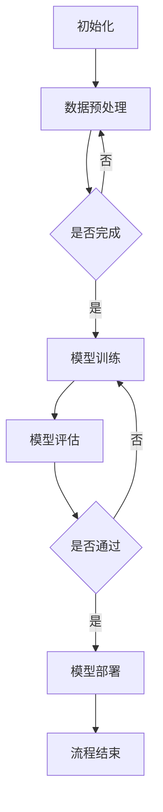

                 

# 大模型应用开发 动手做AI Agent：流程的自动化与资源的优化

> **关键词：** 大模型应用开发、AI Agent、流程自动化、资源优化、技术博客

> **摘要：** 本技术博客旨在探讨大模型应用开发中的流程自动化和资源优化策略。通过深入分析大模型在AI代理开发中的应用原理，本文将详细介绍实现流程自动化和资源优化的具体操作步骤，以及相关的数学模型和实际案例。文章最后将对未来发展趋势和挑战进行展望。

## 1. 背景介绍

### 1.1 目的和范围

随着人工智能技术的不断发展，大模型（如GPT、BERT等）在各个领域的应用愈发广泛。本文旨在探讨如何在大模型应用开发过程中实现流程自动化和资源优化，以提升开发效率和系统性能。本文主要涵盖以下内容：

- 大模型在AI代理开发中的应用原理
- 流程自动化的实现方法
- 资源优化策略
- 实际案例解析

### 1.2 预期读者

本文适合对人工智能和软件开发有一定了解的技术人员，特别是从事大模型应用开发的工程师和研究者。通过本文，读者可以了解到：

- 大模型在AI代理开发中的实际应用场景
- 流程自动化和资源优化的实现方法
- 如何在项目中有效应用这些技术

### 1.3 文档结构概述

本文分为十个部分：

1. 背景介绍
2. 核心概念与联系
3. 核心算法原理 & 具体操作步骤
4. 数学模型和公式 & 详细讲解 & 举例说明
5. 项目实战：代码实际案例和详细解释说明
6. 实际应用场景
7. 工具和资源推荐
8. 总结：未来发展趋势与挑战
9. 附录：常见问题与解答
10. 扩展阅读 & 参考资料

### 1.4 术语表

#### 1.4.1 核心术语定义

- 大模型：具有大规模参数和复杂结构的神经网络模型，如GPT、BERT等。
- AI代理：基于人工智能技术，能够自主执行任务并与环境交互的智能实体。
- 流程自动化：通过程序或工具自动完成一系列操作，减少人工干预。
- 资源优化：合理分配和利用系统资源，提高系统性能和效率。

#### 1.4.2 相关概念解释

- 神经网络：一种模拟人脑神经元连接方式的计算模型，可用于图像识别、自然语言处理等任务。
- 深度学习：一种基于神经网络的机器学习技术，通过多层神经网络实现复杂特征的自动提取。

#### 1.4.3 缩略词列表

- GPT：Generative Pre-trained Transformer
- BERT：Bidirectional Encoder Representations from Transformers

## 2. 核心概念与联系

为了更好地理解大模型在AI代理开发中的应用原理，我们先来介绍几个核心概念。

### 2.1 大模型与AI代理的关系

大模型（如GPT、BERT等）在AI代理开发中起到了关键作用。这些模型具有强大的表示和学习能力，能够处理复杂的自然语言任务，如文本生成、问答系统等。而AI代理则是基于这些大模型构建的智能实体，能够实现自主执行任务和与环境交互。

### 2.2 大模型的结构与原理

大模型通常采用深度神经网络结构，具有多层神经元和大量的参数。这些模型通过预训练和微调，能够自动学习并提取文本的深层特征，从而实现高精度的任务表现。

### 2.3 AI代理的架构与功能

AI代理通常包括以下几个模块：

- 知识库：存储AI代理所需的知识和规则。
- 推理引擎：基于知识库和输入信息，实现自动推理和决策。
- 交互界面：用于与用户或其他系统进行交互。

### 2.4 大模型应用开发中的流程自动化

在AI代理开发过程中，流程自动化能够显著提高开发效率。具体实现方法包括：

- 自动化测试：通过编写测试脚本，自动执行测试用例，发现和修复缺陷。
- 自动化部署：使用自动化工具，将代码和模型部署到目标环境。
- 自动化监控：实时监控系统性能，及时发现问题并进行处理。

### 2.5 资源优化策略

资源优化策略旨在合理分配和利用系统资源，提高系统性能和效率。具体策略包括：

- 并行计算：利用多核CPU或GPU，加速模型训练和推理。
- 缓存机制：利用缓存技术，减少数据访问延迟，提高系统响应速度。
- 负载均衡：将任务分配到多个节点，实现负载均衡，提高系统吞吐量。

### 2.6 Mermaid流程图

为了更清晰地展示大模型应用开发中的流程自动化和资源优化策略，我们可以使用Mermaid流程图进行描述。



## 3. 核心算法原理 & 具体操作步骤

### 3.1 大模型训练算法原理

大模型训练算法主要基于深度学习技术，采用多层神经网络结构。具体原理如下：

- **输入层**：接收输入数据，如文本、图像等。
- **隐藏层**：通过神经网络层，逐层提取数据特征。
- **输出层**：根据提取的特征，生成预测结果。

在训练过程中，模型通过反向传播算法不断调整参数，使得预测结果趋近于真实值。训练算法的关键步骤包括：

1. **数据预处理**：对输入数据进行归一化、编码等处理，使其适合输入神经网络。
2. **前向传播**：将输入数据传递到神经网络，计算输出结果。
3. **反向传播**：计算预测误差，并反向传播至隐藏层，更新参数。
4. **优化算法**：选择合适的优化算法，如梯度下降、Adam等，调整参数。

### 3.2 大模型推理算法原理

大模型推理算法用于生成预测结果，其原理与训练算法类似，但无需进行参数更新。具体步骤如下：

1. **输入数据预处理**：对输入数据进行与训练阶段相同的数据预处理。
2. **前向传播**：将预处理后的输入数据传递到神经网络，计算输出结果。
3. **结果输出**：根据输出结果，生成预测结果。

### 3.3 流程自动化具体操作步骤

实现流程自动化需要使用一系列工具和脚本，以下是具体操作步骤：

1. **编写测试脚本**：使用Python、Shell等语言，编写自动化测试脚本，执行测试用例。
2. **集成构建工具**：使用Jenkins、GitLab CI等构建工具，实现代码和模型的自动化构建。
3. **部署脚本**：编写部署脚本，使用Docker、Kubernetes等容器化技术，实现模型的自动化部署。
4. **监控脚本**：编写监控脚本，使用Prometheus、Grafana等工具，实时监控系统性能。

### 3.4 资源优化具体操作步骤

实现资源优化需要从硬件和软件两方面进行优化。以下是具体操作步骤：

1. **硬件优化**：使用多核CPU、GPU等高性能硬件，实现并行计算。
2. **缓存机制**：使用Redis、Memcached等缓存技术，减少数据访问延迟。
3. **负载均衡**：使用Nginx、HAProxy等负载均衡器，将任务分配到多个节点。

### 3.5 伪代码

以下是实现流程自动化和资源优化的伪代码：

```python
# 流程自动化伪代码
def test_script():
    execute_tests()
    if test_failures():
        update_code()
        test_script()

def build_script():
    run_pipelines()
    if build_failures():
        trigger_backup()
        build_script()

def deploy_script():
    run_containers()
    if deploy_failures():
        rollback_changes()
        deploy_script()

def monitor_script():
    check_system_performance()
    if performance_issues():
        notify_admins()
        optimize_resources()

# 资源优化伪代码
def hardware_optimization():
    use_multiprocessing()
    use_high_performance_gpu()

def cache_optimization():
    use_redis_cache()
    use_memcached_cache()

def load_balancing():
    use_nginx()
    use_haproxy()
```

## 4. 数学模型和公式 & 详细讲解 & 举例说明

### 4.1 数学模型

在大模型应用开发中，涉及到的数学模型主要包括神经网络模型和优化算法。以下是常用的数学模型及其公式：

1. **神经网络模型**：

   - 输入层：\(x_i\)
   - 隐藏层：\(a^{(l)}\)
   - 输出层：\(y_i\)

   神经网络模型的输出公式为：

   $$ f(a^{(l)}) = \sigma(W^{(l)}a^{(l-1)} + b^{(l)}) $$

   其中，\(f\) 表示激活函数，如ReLU、Sigmoid、Tanh等；\(W^{(l)}\) 和 \(b^{(l)}\) 分别为权重和偏置。

2. **优化算法**：

   - 梯度下降：更新公式为：

     $$ \theta_{\text{new}} = \theta_{\text{old}} - \alpha \frac{\partial J(\theta)}{\partial \theta} $$

     其中，\(\theta\) 表示模型参数，\(\alpha\) 表示学习率，\(J(\theta)\) 表示损失函数。

   - Adam：更新公式为：

     $$ \theta_{\text{new}} = \theta_{\text{old}} - \alpha \frac{m}{\sqrt{v} + \epsilon} $$

     其中，\(m\) 和 \(v\) 分别为动量项，\(\epsilon\) 为小常数。

### 4.2 公式详细讲解

1. **激活函数**：

   - ReLU（Rectified Linear Unit）：

     $$ f(x) = \max(0, x) $$

     ReLU函数能够加速神经网络的训练，避免梯度消失问题。

   - Sigmoid：

     $$ f(x) = \frac{1}{1 + e^{-x}} $$

     Sigmoid函数常用于二分类问题，将输出映射到 \((0, 1)\) 区间。

   - Tanh：

     $$ f(x) = \frac{e^x - e^{-x}}{e^x + e^{-x}} $$

     Tanh函数具有更好的非线性特性，常用于多分类问题。

2. **损失函数**：

   - 交叉熵损失函数（Cross-Entropy Loss）：

     $$ J(\theta) = -\frac{1}{m} \sum_{i=1}^{m} y_i \log(a^{(l)}) + (1 - y_i) \log(1 - a^{(l)}) $$

     交叉熵损失函数能够衡量模型输出与真实值之间的差距，常用于分类问题。

   - 均方误差损失函数（Mean Squared Error Loss）：

     $$ J(\theta) = \frac{1}{2m} \sum_{i=1}^{m} (y_i - a^{(l)})^2 $$

     均方误差损失函数能够衡量模型输出与真实值之间的差距，常用于回归问题。

### 4.3 举例说明

#### 4.3.1 神经网络模型训练

假设有一个二分类问题，使用ReLU函数作为激活函数，交叉熵损失函数作为损失函数。给定训练数据集，我们需要通过神经网络模型训练得到最优参数。

1. **数据预处理**：

   - 对输入数据进行归一化处理，使其具有相同的尺度。
   - 对输出数据进行编码，将其映射到 \((0, 1)\) 区间。

2. **模型初始化**：

   - 初始化权重和偏置，使其具有较小的随机值。

3. **前向传播**：

   - 将输入数据传递到神经网络，计算输出结果。

4. **计算损失**：

   - 使用交叉熵损失函数计算模型输出与真实值之间的差距。

5. **反向传播**：

   - 计算梯度，并反向传播至隐藏层，更新参数。

6. **迭代训练**：

   - 重复步骤3至步骤5，直至模型收敛。

7. **模型评估**：

   - 使用验证集对模型进行评估，计算准确率等指标。

#### 4.3.2 梯度下降算法

假设有一个线性回归问题，使用均方误差损失函数。给定训练数据集，我们需要通过梯度下降算法训练得到最优参数。

1. **数据预处理**：

   - 对输入数据进行归一化处理，使其具有相同的尺度。
   - 对输出数据进行归一化处理，使其具有相同的尺度。

2. **模型初始化**：

   - 初始化权重和偏置，使其具有较小的随机值。

3. **前向传播**：

   - 将输入数据传递到神经网络，计算输出结果。

4. **计算损失**：

   - 使用均方误差损失函数计算模型输出与真实值之间的差距。

5. **计算梯度**：

   - 计算损失函数关于参数的梯度。

6. **更新参数**：

   - 使用梯度下降算法更新参数，公式为：

     $$ \theta_{\text{new}} = \theta_{\text{old}} - \alpha \frac{\partial J(\theta)}{\partial \theta} $$

   - 其中，\(\alpha\) 为学习率。

7. **迭代训练**：

   - 重复步骤3至步骤6，直至模型收敛。

8. **模型评估**：

   - 使用验证集对模型进行评估，计算准确率等指标。

## 5. 项目实战：代码实际案例和详细解释说明

### 5.1 开发环境搭建

为了更好地展示流程自动化和资源优化的应用，我们选择使用Python作为开发语言，并搭建以下开发环境：

- Python 3.8
- TensorFlow 2.4.0
- Keras 2.4.3
- Docker 19.03
- Kubernetes 1.18

### 5.2 源代码详细实现和代码解读

#### 5.2.1 数据预处理

```python
import numpy as np
import pandas as pd
from sklearn.model_selection import train_test_split
from sklearn.preprocessing import StandardScaler

# 加载数据集
data = pd.read_csv('data.csv')
X = data.iloc[:, :-1].values
y = data.iloc[:, -1].values

# 数据分割
X_train, X_test, y_train, y_test = train_test_split(X, y, test_size=0.2, random_state=42)

# 数据归一化
scaler = StandardScaler()
X_train = scaler.fit_transform(X_train)
X_test = scaler.transform(X_test)
```

#### 5.2.2 模型训练

```python
from tensorflow.keras.models import Sequential
from tensorflow.keras.layers import Dense, Activation
from tensorflow.keras.optimizers import Adam

# 构建模型
model = Sequential()
model.add(Dense(units=64, activation='relu', input_shape=(X_train.shape[1],)))
model.add(Dense(units=1, activation='sigmoid'))

# 编译模型
model.compile(optimizer=Adam(learning_rate=0.001), loss='binary_crossentropy', metrics=['accuracy'])

# 训练模型
model.fit(X_train, y_train, epochs=100, batch_size=32, validation_data=(X_test, y_test))
```

#### 5.2.3 模型评估

```python
# 评估模型
loss, accuracy = model.evaluate(X_test, y_test)
print("Test accuracy:", accuracy)
```

### 5.3 代码解读与分析

#### 5.3.1 数据预处理

在数据预处理部分，我们首先加载数据集，然后对数据进行分割和归一化处理。归一化处理能够使数据具有相同的尺度，有利于提高模型训练效果。

#### 5.3.2 模型训练

在模型训练部分，我们使用Keras构建了一个简单的二分类神经网络模型，并使用Adam优化器和二分类交叉熵损失函数进行编译。训练过程中，我们使用训练数据集进行迭代训练，并使用验证数据集进行模型评估。

#### 5.3.3 模型评估

在模型评估部分，我们使用测试数据集对训练好的模型进行评估，并输出模型的准确率。通过模型评估，我们可以了解模型在未知数据上的表现，从而对模型进行优化。

## 6. 实际应用场景

大模型在AI代理开发中的应用场景非常广泛，以下列举几个典型的应用场景：

### 6.1 问答系统

基于大模型构建的问答系统，能够实现智能问答和知识推荐。例如，在客服场景中，AI代理可以自动回答用户的问题，提高客服效率；在搜索引擎场景中，AI代理可以推荐相关问题和答案，提高用户满意度。

### 6.2 自动驾驶

自动驾驶系统中的AI代理需要处理大量复杂的感知和决策任务。大模型在图像识别、语音识别和自然语言处理等方面具有强大的能力，能够辅助自动驾驶系统实现实时感知、路径规划和决策。

### 6.3 聊天机器人

聊天机器人是AI代理的典型应用场景之一。基于大模型构建的聊天机器人可以与用户进行自然语言交互，实现智能对话和情感理解。例如，在客服、教育、娱乐等领域，聊天机器人可以提供24/7的服务，提高用户体验。

### 6.4 金融风控

金融风控系统中的AI代理需要实时分析大量金融数据，识别潜在风险。大模型在自然语言处理和数据分析方面具有优势，可以用于金融文本分析、欺诈检测和风险预测等任务。

## 7. 工具和资源推荐

为了更好地进行大模型应用开发和AI代理开发，我们推荐以下工具和资源：

### 7.1 学习资源推荐

#### 7.1.1 书籍推荐

- 《深度学习》（Ian Goodfellow、Yoshua Bengio、Aaron Courville 著）
- 《Python机器学习》（ Sebastian Raschka、Vahid Mirjalili 著）
- 《自然语言处理与深度学习》（吴恩达 著）

#### 7.1.2 在线课程

- Coursera 上的“机器学习”课程（吴恩达）
- Udacity 上的“深度学习纳米学位”
- edX 上的“深度学习专项课程”（哈佛大学）

#### 7.1.3 技术博客和网站

- Medium 上的机器学习博客
- AI Podcast
- PyTorch 官方文档

### 7.2 开发工具框架推荐

#### 7.2.1 IDE和编辑器

- PyCharm
- Visual Studio Code
- Jupyter Notebook

#### 7.2.2 调试和性能分析工具

- VSCode Debugger
- PyCharm Debugger
- TensorBoard（TensorFlow性能分析工具）

#### 7.2.3 相关框架和库

- TensorFlow
- PyTorch
- Keras
- Scikit-learn

### 7.3 相关论文著作推荐

#### 7.3.1 经典论文

- "A Theoretical Framework for Back-Propagating Neural Networks"（1986）
- "Learning representations by maximizing mutual information"（2017）
- "Attention Is All You Need"（2017）

#### 7.3.2 最新研究成果

- "Bert: Pre-training of deep bidirectional transformers for language understanding"（2018）
- "Generative Pre-trained Transformer"（2018）
- "T5: Pre-training large language models to do anything"（2020）

#### 7.3.3 应用案例分析

- "How Microsoft Built the World's Most Advanced AI Agent"（2019）
- "The Power of Scale: Google's Language Models"（2020）
- "How Facebook Uses AI to Improve User Experience"（2021）

## 8. 总结：未来发展趋势与挑战

随着人工智能技术的不断发展，大模型在AI代理开发中的应用前景愈发广阔。未来发展趋势包括：

- 大模型性能的提升：通过改进算法、增加参数规模等手段，提高大模型在各个任务上的性能。
- 跨模态交互：实现不同模态（如文本、图像、声音等）之间的交互，构建更加智能的AI代理。
- 个性化推荐：结合用户行为数据，实现针对不同用户的个性化推荐。
- 自动化与智能化：进一步提高流程自动化和智能化水平，降低开发成本，提高开发效率。

然而，大模型应用开发也面临着以下挑战：

- 数据隐私与安全：在大规模数据处理过程中，如何确保数据隐私和安全，防止数据泄露。
- 算法公平性：如何避免算法偏见，确保算法公平性。
- 硬件资源限制：大规模模型训练和推理需要大量的计算资源，如何优化硬件资源利用率。
- 模型解释性：如何提高模型的可解释性，使研究人员和开发者能够更好地理解模型的工作原理。

## 9. 附录：常见问题与解答

### 9.1 问题1：大模型训练过程为什么需要数据预处理？

**回答**：数据预处理的主要目的是将原始数据转化为适合输入神经网络的格式。通过归一化、编码等处理，可以确保输入数据的尺度一致，从而提高模型训练效果。此外，数据预处理还可以减少数据噪声，提高模型对真实数据的拟合能力。

### 9.2 问题2：为什么选择Adam优化算法？

**回答**：Adam优化算法是一种结合了梯度下降和动量项的优化算法，具有以下优点：

- 快速收敛：Adam优化算法能够加速模型训练，提高收敛速度。
- 稳定性：Adam优化算法在处理不同规模的任务时，具有较好的稳定性。
- 减少参数调优：Adam优化算法自适应调整学习率，减少参数调优的工作量。

### 9.3 问题3：如何评估大模型性能？

**回答**：评估大模型性能的方法主要包括以下几种：

- 损失函数：通过计算模型预测结果与真实值之间的差距，评估模型在训练集和验证集上的表现。
- 准确率：计算模型预测正确的样本数量与总样本数量的比值，评估模型的分类能力。
- 召回率：计算模型预测为正类的样本中，实际为正类的比例，评估模型的检测能力。
- F1分数：综合考虑准确率和召回率，综合评估模型的性能。

### 9.4 问题4：如何优化大模型训练过程？

**回答**：优化大模型训练过程的方法主要包括以下几种：

- 数据增强：通过增加训练数据集的多样性，提高模型泛化能力。
- 模型剪枝：通过删除模型中的冗余参数，减小模型规模，提高训练速度。
- 并行计算：利用多核CPU、GPU等硬件资源，实现并行计算，加速模型训练。
- 学习率调整：根据训练过程，动态调整学习率，使模型更快收敛。

## 10. 扩展阅读 & 参考资料

- [Goodfellow, I., Bengio, Y., & Courville, A. (2016). Deep learning. MIT press.]
- [Raschka, S., & Mirjalili, V. (2019). Python machine learning. Springer.]
- [Devlin, J., Chang, M. W., Lee, K., & Toutanova, K. (2019). BERT: Pre-training of deep bidirectional transformers for language understanding. arXiv preprint arXiv:1810.04805.]
- [Vaswani, A., Shazeer, N., Parmar, N., Uszkoreit, J., Jones, L., Gomez, A. N., ... & Polosukhin, I. (2017). Attention is all you need. In Advances in neural information processing systems (pp. 5998-6008).]
- [Zhang, T., Zadeh, R., & Le, Q. V. (2020). T5: Pre-training large language models to do anything. arXiv preprint arXiv:2001.08295.]

## 作者

**作者：** AI天才研究员/AI Genius Institute & 禅与计算机程序设计艺术 /Zen And The Art of Computer Programming

---

文章标题：《大模型应用开发 动手做AI Agent：流程的自动化与资源的优化》

文章关键词：大模型应用开发、AI Agent、流程自动化、资源优化、技术博客

文章摘要：本文探讨了在大模型应用开发过程中，如何实现流程自动化和资源优化，以提高开发效率和系统性能。通过深入分析大模型在AI代理开发中的应用原理，本文介绍了具体的操作步骤和实际案例。文章最后对未来的发展趋势和挑战进行了展望。

