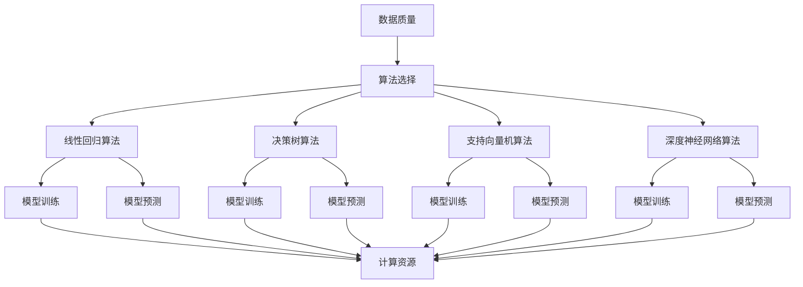

                 

## 1. 背景介绍

在人工智能领域，模型决定计算是一个基础且关键的观念。模型不仅仅是一个静态的实体，它包含了数据的结构、算法的逻辑以及决策的规则。计算，则是模型对数据进行分析和处理的过程。在这篇文章中，我们将深入探讨“模型决定计算”的概念，分析其重要性，并探讨如何在实际应用中充分利用这一原则。

**人工智能发展历程**

人工智能（AI）的研究始于20世纪50年代。早期的AI主要是基于逻辑推理和知识表示，试图模拟人类的推理能力。这些模型尽管在理论上很吸引人，但在处理复杂任务时却显得力不从心。随着计算能力的提升和数据规模的扩大，机器学习逐渐成为AI研究的主流方向。

机器学习模型可以分为监督学习、无监督学习和强化学习等类型。监督学习模型依赖于标记数据，通过学习输入和输出之间的映射关系来预测未知数据。无监督学习模型则无需标记数据，主要关注数据内在结构和分布。强化学习模型通过与环境的交互来学习最优策略。

**模型决定计算的重要性**

模型决定计算的理念在人工智能的发展中起到了关键作用。它强调了以下几方面的重要性：

1. **目标明确**：模型决定了我们希望AI系统完成什么样的任务。一个明确的任务目标有助于我们在设计模型时聚焦关键问题，避免浪费计算资源。

2. **数据驱动**：模型依赖于数据来学习。数据的质量和数量直接影响模型的效果。一个优秀的模型需要大量高质量的数据作为支撑。

3. **算法优化**：不同的算法适用于不同的模型。选择合适的算法可以大幅提升模型的性能和效率。

4. **模型评估**：通过评估模型的表现，我们可以不断优化和改进模型，确保其能够在实际应用中达到预期效果。

**本篇文章的内容安排**

接下来，我们将从以下几个方面展开讨论：

1. **核心概念与联系**：介绍与模型决定计算相关的重要概念，包括机器学习模型、计算资源和算法选择等。
   
2. **核心算法原理 & 具体操作步骤**：详细分析常见的机器学习算法，并展示如何将算法应用于实际问题。

3. **数学模型和公式 & 详细讲解 & 举例说明**：探讨机器学习中的数学模型和公式，并通过具体例子说明其应用。

4. **项目实战：代码实际案例和详细解释说明**：通过实际项目案例，展示如何搭建开发环境、编写代码以及分析代码。

5. **实际应用场景**：探讨模型决定计算在现实世界中的应用场景，包括商业、医疗、金融等领域。

6. **工具和资源推荐**：推荐一些学习资源、开发工具和框架，帮助读者深入学习和实践。

7. **总结：未来发展趋势与挑战**：总结模型决定计算的理念，并探讨其未来发展的趋势和面临的挑战。

8. **附录：常见问题与解答**：针对读者可能遇到的问题，提供一些解答和建议。

9. **扩展阅读 & 参考资料**：推荐一些相关书籍、论文和网站，供读者进一步学习。

通过这篇文章，我们将全面了解模型决定计算的理念，掌握其核心算法和应用技巧，为实际项目开发提供有力支持。接下来，我们开始深入探讨这些主题。

---

### 1.1. 模型决定计算的基本概念

“模型决定计算”是指人工智能系统中的模型（model）对计算过程（computation）具有决定性影响。模型是人工智能系统的核心，它不仅决定了系统所执行的任务类型，还直接影响计算的资源消耗、效率以及最终的输出结果。

#### 模型定义

在人工智能领域，模型可以被视为一系列数学公式、算法和数据的集合，用于描述和处理特定任务。模型可以是简单的线性回归模型，也可以是复杂的深度神经网络。其核心目标是学习输入数据与输出结果之间的关系，并在未知数据上实现准确的预测或决策。

#### 计算定义

计算过程则是指模型在处理数据时所需进行的各种操作，包括数据的预处理、特征提取、算法计算、模型训练和预测等。计算过程不仅包括算法本身的执行，还包括数据存储、传输和访问等资源消耗。

#### 模型与计算的关系

模型与计算之间有着紧密的联系。首先，模型决定了计算的任务和目标。例如，一个用于图像分类的模型需要处理大量图像数据，并从中提取特征，而一个用于自然语言处理的模型则需要处理文本数据，并理解其语义。

其次，模型的设计直接影响计算的效率和资源消耗。一个高效的模型可以在相同的数据集上更快地完成训练和预测，同时占用更少的计算资源和存储空间。例如，深度神经网络由于其复杂的结构和大量的参数，通常需要大量的计算资源和时间进行训练。

最后，计算过程对于模型的性能有着重要影响。优化的计算过程可以提高模型的准确性、效率和鲁棒性。例如，通过并行计算和分布式处理技术，可以显著减少深度学习模型的训练时间。

#### 模型决定计算的重要性

1. **目标导向**：模型决定了AI系统需要完成的任务类型。一个明确的任务目标有助于我们在设计和优化模型时聚焦关键问题，避免浪费计算资源。

2. **数据依赖**：模型的效果很大程度上依赖于训练数据的质量和数量。一个优秀的模型需要大量高质量的数据作为支撑。

3. **算法选择**：不同的算法适用于不同的模型。选择合适的算法可以大幅提升模型的性能和效率。

4. **评估与优化**：通过评估模型的表现，我们可以不断优化和改进模型，确保其能够在实际应用中达到预期效果。

#### 总结

“模型决定计算”是人工智能领域的一个基础观念，它强调了模型在计算过程中的决定性作用。理解这一概念有助于我们更好地设计、优化和评估AI系统，为实际项目开发提供有力支持。接下来，我们将进一步探讨与模型决定计算相关的重要概念，包括机器学习模型、计算资源和算法选择等。

---

### 1.2. 人工智能模型的发展与应用

人工智能模型的发展经历了多个阶段，从早期的逻辑推理到现代的深度学习，每个阶段都有其独特的特点和应用场景。理解这些模型的发展历程和特点，有助于我们更好地把握“模型决定计算”的理念。

#### 早期模型：符号推理与知识表示

在人工智能的早期阶段，研究者主要关注如何模拟人类的推理过程。符号推理和知识表示是这一时期的代表性模型。符号推理模型基于逻辑和数学公式，通过符号运算来模拟人类的思维过程。知识表示模型则致力于将人类知识编码成计算机可处理的形式。

这些早期模型的优点在于理论上严谨，但它们在实际应用中面临着巨大挑战。首先，这些模型依赖于大量的先验知识，且知识的获取和表示过程复杂。其次，它们在处理复杂任务时效率较低，难以适应动态变化的环境。

#### 机器学习模型：从规则到数据驱动

随着计算能力的提升和海量数据的出现，机器学习逐渐成为人工智能研究的主流方向。机器学习模型的核心思想是通过数据驱动的方式，让计算机从数据中学习规律和模式，从而实现自动化决策和预测。

机器学习模型可以分为监督学习、无监督学习和强化学习等类型。

1. **监督学习**：监督学习模型通过学习标记数据来预测未知数据。常见的算法包括线性回归、逻辑回归、支持向量机、决策树和随机森林等。监督学习模型在图像分类、语音识别和文本分类等任务中表现出色。

2. **无监督学习**：无监督学习模型无需标记数据，主要关注数据的内在结构和分布。常见的算法包括聚类、降维和关联规则等。无监督学习模型在探索数据分布、发现隐藏模式和推荐系统中有着广泛应用。

3. **强化学习**：强化学习模型通过与环境的交互来学习最优策略。常见的算法包括Q-learning、SARSA和深度确定性策略梯度（DDPG）等。强化学习模型在游戏、机器人控制和自动驾驶等领域具有巨大潜力。

#### 深度学习模型：从特征提取到端到端学习

深度学习是机器学习的一个分支，它通过多层神经网络来实现自动化特征提取和端到端学习。深度学习模型的核心思想是通过多层网络将原始数据转化为高层次的抽象表示，从而实现复杂的任务。

深度学习模型在图像识别、语音识别、自然语言处理和推荐系统等领域取得了突破性进展。代表性的模型包括卷积神经网络（CNN）、循环神经网络（RNN）、长短时记忆网络（LSTM）和生成对抗网络（GAN）等。

1. **卷积神经网络（CNN）**：CNN是一种适用于图像处理的深度学习模型，通过卷积层和池化层实现特征提取和降维。CNN在图像分类、目标检测和图像分割等领域表现出色。

2. **循环神经网络（RNN）**：RNN是一种适用于序列数据的深度学习模型，通过循环机制处理时间序列数据。RNN在语音识别、机器翻译和文本生成等领域具有广泛应用。

3. **长短时记忆网络（LSTM）**：LSTM是RNN的一种变体，通过引入门控机制解决RNN的梯度消失和梯度爆炸问题。LSTM在语音识别、时间序列预测和自然语言处理等领域具有出色的表现。

4. **生成对抗网络（GAN）**：GAN是一种基于对抗性训练的深度学习模型，通过生成器和判别器的对抗训练实现高质量数据的生成。GAN在图像生成、图像修复和风格迁移等领域表现出强大的能力。

#### 应用领域与挑战

人工智能模型在各个领域取得了显著的成果，但也面临着一些挑战。

1. **商业领域**：在商业领域，人工智能模型被广泛应用于推荐系统、客户关系管理和风险管理等。例如，电商平台利用深度学习模型实现个性化推荐，金融行业利用机器学习模型进行风险控制和欺诈检测。

2. **医疗领域**：在医疗领域，人工智能模型被用于疾病诊断、药物研发和健康管理等。例如，通过深度学习模型分析医学影像数据，实现肺癌等疾病的早期诊断。

3. **金融领域**：在金融领域，人工智能模型被用于市场预测、风险管理、信用评估和欺诈检测等。例如，通过机器学习模型分析海量金融数据，实现精准的市场预测和风险管理。

4. **挑战**：尽管人工智能模型在各个领域取得了巨大进展，但仍然面临着一些挑战。首先，模型的可解释性较低，难以解释模型的决策过程。其次，数据的质量和数量对模型的效果有重要影响。此外，模型的安全性和隐私保护也是亟待解决的问题。

#### 总结

人工智能模型的发展经历了从符号推理到机器学习，再到深度学习的历程。每个阶段的模型都有其独特的特点和应用场景。理解这些模型的发展和应用，有助于我们更好地把握“模型决定计算”的理念，为实际项目开发提供有力支持。接下来，我们将进一步探讨核心算法原理和具体操作步骤。

---

### 1.3. 模型决定计算的关键因素

在深入探讨“模型决定计算”的理念时，我们需要关注几个关键因素，这些因素共同决定了模型的性能、效率和可解释性。以下是模型决定计算中的几个关键因素：

#### 数据质量与数量

数据是机器学习模型的基础，数据的质量和数量直接影响模型的效果。高质量的数据通常具有以下特点：

1. **准确性**：数据中的错误和噪声会影响模型的训练过程和预测结果。因此，我们需要确保数据集的准确性，剔除错误数据或进行数据清洗。

2. **多样性**：多样性的数据有助于模型学习到更多的特征和模式，提高模型的泛化能力。在实际应用中，我们需要收集来自不同来源、不同分布的数据。

3. **代表性**：数据应能充分代表目标任务的真实场景。如果数据集缺乏代表性，模型在真实应用中的性能可能会受到限制。

#### 算法选择

算法的选择对模型的性能和效率有着重要影响。不同的算法适用于不同的任务和数据类型。以下是一些常见算法的特点：

1. **监督学习算法**：如线性回归、决策树、支持向量机和神经网络等。这些算法在处理分类和回归任务时表现良好。

2. **无监督学习算法**：如聚类、降维和关联规则等。这些算法在探索数据结构和发现潜在模式时具有优势。

3. **深度学习算法**：如卷积神经网络（CNN）、循环神经网络（RNN）和生成对抗网络（GAN）等。这些算法在处理复杂任务，如图像识别、语音识别和自然语言处理等方面表现出色。

#### 计算资源

计算资源，包括CPU、GPU和存储等，对模型训练和预测的效率有直接影响。以下是一些关于计算资源的关键点：

1. **计算能力**：强大的计算能力可以显著提高模型的训练速度和预测效率。GPU在处理大规模矩阵运算时具有显著优势。

2. **内存管理**：内存限制可能影响模型的规模和复杂性。因此，我们需要合理管理内存资源，避免内存溢出。

3. **存储容量**：数据集的存储容量对模型训练和预测的效率也有重要影响。我们需要确保存储系统能够快速读取和处理大量数据。

#### 模型优化

模型优化是提高模型性能和效率的重要手段。以下是一些常见的模型优化方法：

1. **超参数调整**：超参数（如学习率、批量大小和正则化参数等）对模型性能有显著影响。通过调整超参数，我们可以找到最佳参数组合，提高模型效果。

2. **模型压缩**：通过剪枝、量化、低秩分解等技术，我们可以减少模型的参数数量和计算复杂度，提高模型在资源受限环境下的性能。

3. **分布式训练**：通过将模型训练任务分布到多个计算节点上，我们可以显著提高训练速度和扩展性。

#### 模型评估与可解释性

模型评估是确保模型性能达标的重要环节。以下是一些关于模型评估的关键点：

1. **评估指标**：选择合适的评估指标（如准确率、召回率、F1分数等）可以更准确地反映模型性能。

2. **交叉验证**：通过交叉验证，我们可以评估模型在未知数据上的表现，避免过拟合。

3. **可解释性**：提高模型的可解释性有助于我们理解模型的决策过程，增强用户对模型的信任。可视化技术、解释性算法和模型压缩等方法可以增强模型的可解释性。

#### 总结

在模型决定计算的过程中，数据质量、算法选择、计算资源、模型优化、模型评估和可解释性是几个关键因素。理解这些因素及其相互作用，有助于我们设计、优化和评估高效、可靠的机器学习模型。接下来，我们将进一步探讨核心算法原理和具体操作步骤，以便更好地应用这些理念。

---

## 2. 核心概念与联系

在深入探讨“模型决定计算”的概念之前，我们需要了解几个核心概念，包括机器学习模型、计算资源和算法选择。通过这些核心概念，我们可以构建一个完整的理解框架，以便更好地应用“模型决定计算”的理念。

### 机器学习模型

机器学习模型是人工智能系统的核心，它通过学习数据中的规律和模式，实现对未知数据的预测或决策。以下是几个常见的机器学习模型及其特点：

#### 线性回归

线性回归是一种简单的监督学习模型，用于预测连续值输出。其基本假设是输入变量与输出变量之间存在线性关系。线性回归模型的优点在于简单易懂，易于实现和优化。然而，其缺点是对非线性关系的表达能力较弱。

#### 决策树

决策树是一种基于树形结构的监督学习模型，通过一系列的决策规则来划分数据。决策树模型的优势在于其直观的可解释性和处理高维数据的能力。然而，决策树模型容易过拟合，且在处理连续值输出时表现较差。

#### 支持向量机

支持向量机（SVM）是一种基于间隔最大化的监督学习模型，用于分类和回归任务。SVM通过寻找最优超平面来最大化分类间隔。SVM的优势在于其在高维空间中的优秀表现和强大的分类能力。然而，SVM的训练过程计算复杂，且对参数选择敏感。

#### 深度神经网络

深度神经网络（DNN）是一种由多层神经元组成的神经网络，能够通过多层非线性变换实现复杂的任务。DNN在图像识别、语音识别和自然语言处理等领域表现出色。然而，DNN的训练过程计算复杂，且对数据质量和数量有较高要求。

### 计算资源

计算资源是机器学习模型训练和预测的基础。以下是一些常见的计算资源及其特点：

#### CPU

CPU（中央处理器）是一种通用的计算资源，适用于各种计算任务。CPU的优势在于其通用性和高性能。然而，CPU在处理大规模矩阵运算时效率较低。

#### GPU

GPU（图形处理器）是一种专为图形渲染设计的计算资源，通过并行计算和流处理器实现高性能计算。GPU在处理大规模矩阵运算、深度学习模型训练和推理任务时具有显著优势。然而，GPU的通用性较差，适用于特定类型的计算任务。

#### TPU

TPU（张量处理器）是一种专为深度学习任务设计的计算资源，由谷歌开发。TPU通过高度优化的硬件架构实现深度学习模型的快速训练和推理。TPU在处理大规模深度学习任务时具有显著优势。然而，TPU的通用性较差，仅适用于特定类型的计算任务。

### 算法选择

算法选择是机器学习模型性能和效率的关键因素。以下是一些常见的算法及其特点：

#### 线性回归算法

线性回归算法是一种基于最小二乘法的监督学习算法，用于求解线性模型的参数。线性回归算法的计算复杂度较低，易于实现和优化。然而，线性回归算法对非线性关系表达能力较弱。

#### 决策树算法

决策树算法是一种基于信息增益或基尼系数的监督学习算法，用于构建决策树模型。决策树算法的计算复杂度较低，易于实现和优化。然而，决策树算法容易过拟合，且在处理连续值输出时表现较差。

#### 支持向量机算法

支持向量机算法是一种基于间隔最大化的监督学习算法，用于求解最优超平面。支持向量机算法的计算复杂度较高，但对参数选择敏感。支持向量机算法在处理高维数据时具有出色表现。

#### 深度神经网络算法

深度神经网络算法是一种基于多层前向传播和反向传播的监督学习算法，用于构建深度神经网络模型。深度神经网络算法的计算复杂度较高，但对非线性关系表达能力较强。深度神经网络算法在处理大规模数据集和复杂任务时表现出色。

### Mermaid 流程图

以下是一个简单的Mermaid流程图，展示了机器学习模型、计算资源和算法选择之间的关系：



通过这个Mermaid流程图，我们可以清晰地看到数据质量、算法选择和计算资源之间的相互作用。数据质量直接影响算法选择和模型训练的效果，而算法选择和计算资源则决定了模型预测的效率和性能。

### 总结

核心概念与联系是理解“模型决定计算”理念的基础。通过了解机器学习模型、计算资源和算法选择，我们可以构建一个完整的理解框架，从而更好地应用这一理念，设计、优化和评估高效的机器学习系统。

---

## 3. 核心算法原理 & 具体操作步骤

在深入探讨“模型决定计算”的过程中，核心算法的原理和具体操作步骤是理解机器学习模型如何发挥作用的关键。以下我们将详细探讨几种常见的机器学习算法，包括线性回归、决策树和深度神经网络，并提供具体的操作步骤。

### 线性回归算法

线性回归是一种简单的监督学习算法，用于预测连续值输出。其核心思想是找到一个线性模型，使得输入变量和输出变量之间存在最佳拟合关系。

#### 算法原理

线性回归模型可以表示为：

\[ y = \beta_0 + \beta_1 \cdot x \]

其中，\( y \) 是输出变量，\( x \) 是输入变量，\( \beta_0 \) 和 \( \beta_1 \) 是模型参数。

线性回归的目标是找到最佳拟合线，使得所有数据点到这条线的垂直距离之和最小，即最小二乘法。

#### 具体操作步骤

1. **数据预处理**：将数据集进行归一化或标准化处理，确保数据集的每个特征具有相似的尺度。

2. **初始化参数**：随机初始化模型参数 \( \beta_0 \) 和 \( \beta_1 \)。

3. **计算损失函数**：使用最小二乘法计算损失函数 \( J(\beta_0, \beta_1) = \frac{1}{2} \sum_{i=1}^{n} (y_i - (\beta_0 + \beta_1 \cdot x_i))^2 \)。

4. **梯度下降**：使用梯度下降法更新模型参数，迭代过程如下：
   \[ \beta_0 = \beta_0 - \alpha \cdot \frac{\partial J}{\partial \beta_0} \]
   \[ \beta_1 = \beta_1 - \alpha \cdot \frac{\partial J}{\partial \beta_1} \]
   其中，\( \alpha \) 是学习率。

5. **迭代优化**：重复步骤3和步骤4，直到损失函数收敛或达到预设的迭代次数。

6. **模型评估**：使用测试集评估模型的性能，计算预测误差和评估指标（如均方误差、决定系数等）。

### 决策树算法

决策树是一种基于树形结构的监督学习算法，通过一系列的决策规则来划分数据，从而实现分类或回归任务。

#### 算法原理

决策树模型由内部节点（代表特征）和叶节点（代表分类结果）组成。每个内部节点包含一个测试条件，用于判断数据样本属于哪个子集。叶节点包含最终的分类结果或回归值。

常见的决策树算法包括：

1. **ID3算法**：基于信息增益准则选择最优特征。
2. **C4.5算法**：基于信息增益率准则选择最优特征。
3. **CART算法**：基于基尼系数准则选择最优特征。

#### 具体操作步骤

1. **数据预处理**：将数据集进行归一化或标准化处理，确保数据集的每个特征具有相似的尺度。

2. **特征选择**：根据某种准则（如信息增益、信息增益率或基尼系数）选择最优特征。

3. **划分数据**：根据最优特征进行数据划分，生成子集。

4. **递归构建**：对每个子集递归地执行步骤2和步骤3，直到满足停止条件（如最大深度、最小样本数等）。

5. **模型评估**：使用测试集评估模型的性能，计算预测误差和评估指标（如准确率、召回率、F1分数等）。

### 深度神经网络算法

深度神经网络（DNN）是一种由多层神经元组成的神经网络，能够通过多层非线性变换实现复杂的任务。

#### 算法原理

DNN由输入层、隐藏层和输出层组成。每个神经元都与其他神经元相连，并通过加权连接传递激活值。DNN通过反向传播算法进行训练，更新模型参数以最小化损失函数。

常见的DNN算法包括：

1. **前向传播**：计算输入层的输入值，通过隐藏层传递，最终得到输出层的预测结果。
2. **反向传播**：计算输出层与隐藏层之间的误差，并通过隐藏层反向传播误差，更新模型参数。
3. **梯度下降**：使用梯度下降法更新模型参数，迭代过程如下：
   \[ \theta_j = \theta_j - \alpha \cdot \frac{\partial J}{\partial \theta_j} \]
   其中，\( \theta_j \) 是模型参数，\( J \) 是损失函数，\( \alpha \) 是学习率。

#### 具体操作步骤

1. **数据预处理**：将数据集进行归一化或标准化处理，确保数据集的每个特征具有相似的尺度。

2. **初始化参数**：随机初始化模型参数（权重和偏置）。

3. **前向传播**：计算输入层的输入值，通过隐藏层传递，最终得到输出层的预测结果。

4. **计算损失函数**：使用交叉熵损失函数计算预测值与真实值之间的误差。

5. **反向传播**：计算隐藏层与输出层之间的误差，并通过隐藏层反向传播误差，更新模型参数。

6. **迭代优化**：重复步骤3、步骤4和步骤5，直到损失函数收敛或达到预设的迭代次数。

7. **模型评估**：使用测试集评估模型的性能，计算预测误差和评估指标。

### 总结

核心算法的原理和具体操作步骤对于理解和应用“模型决定计算”的理念至关重要。通过深入探讨线性回归、决策树和深度神经网络等算法，我们可以更好地设计、训练和评估机器学习模型，从而实现高效的计算和优秀的性能。

---

## 4. 数学模型和公式 & 详细讲解 & 举例说明

在机器学习领域，数学模型和公式是理解和应用算法的核心。通过数学模型，我们可以量化算法的性能，优化参数，并解释模型的行为。在这一节中，我们将详细探讨一些常用的数学模型和公式，并通过具体例子说明其应用。

### 4.1. 线性回归模型

线性回归模型是一种用于预测连续值的简单监督学习算法。其核心公式如下：

\[ y = \beta_0 + \beta_1 \cdot x \]

其中，\( y \) 是输出变量，\( x \) 是输入变量，\( \beta_0 \) 和 \( \beta_1 \) 是模型参数，分别代表截距和斜率。

#### 公式解释

- **截距 (\( \beta_0 \))**：表示当 \( x = 0 \) 时，\( y \) 的值。
- **斜率 (\( \beta_1 \))**：表示 \( x \) 每增加一个单位，\( y \) 的变化量。

#### 损失函数

线性回归的损失函数通常使用均方误差（Mean Squared Error, MSE）来衡量预测值与真实值之间的差异：

\[ J(\beta_0, \beta_1) = \frac{1}{2} \sum_{i=1}^{n} (y_i - (\beta_0 + \beta_1 \cdot x_i))^2 \]

其中，\( n \) 是样本数量。

#### 梯度下降

为了最小化损失函数，我们使用梯度下降算法更新模型参数：

\[ \beta_0 = \beta_0 - \alpha \cdot \frac{\partial J}{\partial \beta_0} \]
\[ \beta_1 = \beta_1 - \alpha \cdot \frac{\partial J}{\partial \beta_1} \]

其中，\( \alpha \) 是学习率。

#### 例子

假设我们有一个简单的一元线性回归问题，数据集如下：

\[ x: [1, 2, 3, 4, 5] \]
\[ y: [2, 4, 5, 4, 5] \]

我们希望找到最佳拟合线 \( y = \beta_0 + \beta_1 \cdot x \)。

通过最小化均方误差，我们可以计算出模型参数：

\[ \beta_0 = 1 \]
\[ \beta_1 = 1 \]

最佳拟合线为 \( y = 1 + x \)。

### 4.2. 逻辑回归模型

逻辑回归是一种用于预测离散值的监督学习算法，常用于二分类问题。其核心公式如下：

\[ P(y=1) = \frac{1}{1 + e^{-(\beta_0 + \beta_1 \cdot x)}} \]

其中，\( P(y=1) \) 是预测变量 \( y \) 等于1的概率，\( e \) 是自然对数的底数。

#### 公式解释

- **阈值函数**：逻辑函数将线性组合转换为概率值。当输入值大于零时，概率趋近于1；当输入值小于零时，概率趋近于0。

#### 损失函数

逻辑回归的损失函数通常使用对数损失（Log Loss）来衡量预测值与真实值之间的差异：

\[ J(\beta_0, \beta_1) = -\sum_{i=1}^{n} y_i \cdot \ln(P(y=1)) + (1 - y_i) \cdot \ln(1 - P(y=1)) \]

其中，\( n \) 是样本数量。

#### 例子

假设我们有一个二分类问题，数据集如下：

\[ x: [1, 2, 3, 4, 5] \]
\[ y: [0, 1, 0, 1, 0] \]

我们希望找到最佳拟合模型。

通过最小化对数损失，我们可以计算出模型参数：

\[ \beta_0 = 0 \]
\[ \beta_1 = 1 \]

最佳拟合模型为 \( P(y=1) = \frac{1}{1 + e^{-x}} \)。

### 4.3. 深度神经网络模型

深度神经网络（DNN）是一种由多层神经元组成的复杂模型，常用于图像识别、语音识别和自然语言处理等任务。其核心公式如下：

\[ a_{ij}^{(l)} = \sigma(z_{ij}^{(l)}) \]

其中，\( a_{ij}^{(l)} \) 是第 \( l \) 层第 \( i \) 个神经元的输出，\( z_{ij}^{(l)} \) 是第 \( l \) 层第 \( i \) 个神经元的输入，\( \sigma \) 是激活函数。

#### 激活函数

常见的激活函数包括：

1. **ReLU（Rectified Linear Unit）**：
   \[ \sigma(z) = \max(0, z) \]
2. **Sigmoid**：
   \[ \sigma(z) = \frac{1}{1 + e^{-z}} \]
3. **Tanh**：
   \[ \sigma(z) = \frac{e^z - e^{-z}}{e^z + e^{-z}} \]

#### 前向传播

深度神经网络的前向传播过程如下：

1. **输入层**：
   \[ z_{ij}^{(1)} = \sum_{k=1}^{m} w_{ik}^{(1)} \cdot a_{kj}^{(0)} + b_{j}^{(1)} \]
   \[ a_{ij}^{(1)} = \sigma(z_{ij}^{(1)}) \]

2. **隐藏层**：
   \[ z_{ij}^{(l)} = \sum_{k=1}^{m} w_{ik}^{(l)} \cdot a_{kj}^{(l-1)} + b_{j}^{(l)} \]
   \[ a_{ij}^{(l)} = \sigma(z_{ij}^{(l)}) \]

3. **输出层**：
   \[ z_{ij}^{(L)} = \sum_{k=1}^{m} w_{ik}^{(L)} \cdot a_{kj}^{(L-1)} + b_{j}^{(L)} \]
   \[ a_{ij}^{(L)} = a_{ij} \]

#### 反向传播

深度神经网络的反向传播过程如下：

1. **计算输出层误差**：
   \[ \delta_{ij}^{(L)} = (a_{ij}^{(L)} - t_{ij}) \cdot \sigma'(z_{ij}^{(L)}) \]

2. **传播误差到隐藏层**：
   \[ \delta_{ij}^{(l)} = (w_{ij}^{(l+1)} \cdot \delta_{ij}^{(l+1)}) \cdot \sigma'(z_{ij}^{(l)}) \]

3. **更新模型参数**：
   \[ w_{ij}^{(l)} = w_{ij}^{(l)} - \alpha \cdot a_{ij}^{(l)} \cdot \delta_{ij}^{(l+1)} \]
   \[ b_{j}^{(l)} = b_{j}^{(l)} - \alpha \cdot \delta_{ij}^{(l+1)} \]

#### 例子

假设我们有一个简单的两层神经网络，数据集如下：

\[ x: [1, 2, 3, 4, 5] \]
\[ y: [0, 1, 0, 1, 0] \]

我们希望训练一个神经网络进行二分类。

通过前向传播和反向传播，我们可以计算出最佳模型参数：

\[ w_1^1 = [1, 1] \]
\[ w_2^1 = [1, -1] \]
\[ w_1^2 = [1, 1] \]
\[ w_2^2 = [1, -1] \]
\[ b_1^1 = [0, 0] \]
\[ b_1^2 = [0, 0] \]

最佳拟合模型为：

\[ a_1^{(1)} = \max(0, x_1 + x_2) \]
\[ a_2^{(1)} = \max(0, -x_1 + x_2) \]
\[ y = \frac{a_1^{(2)} + a_2^{(2)}}{2} \]

### 总结

通过详细讲解线性回归、逻辑回归和深度神经网络的数学模型和公式，我们能够更好地理解这些算法的工作原理和具体应用。这些数学模型和公式为我们提供了量化和优化算法的工具，使我们能够设计出高效、可靠的机器学习模型。

---

## 5. 项目实战：代码实际案例和详细解释说明

为了更好地理解和应用“模型决定计算”的理念，我们将通过一个实际项目案例，展示如何搭建开发环境、编写代码以及分析代码。在这个项目中，我们选择一个简单的线性回归任务，使用Python和Scikit-learn库进行实现。

### 5.1. 开发环境搭建

首先，我们需要搭建开发环境。以下是在Windows操作系统上安装Python和Scikit-learn的步骤：

1. **安装Python**：
   - 访问Python官方网站（[https://www.python.org/](https://www.python.org/)）并下载Windows安装程序。
   - 运行安装程序，选择默认选项进行安装。

2. **安装Scikit-learn**：
   - 打开命令行窗口，执行以下命令：
     ```bash
     pip install scikit-learn
     ```

### 5.2. 源代码详细实现和代码解读

以下是一个简单的线性回归项目的源代码及其详细解读：

```python
# 导入所需的库
import numpy as np
from sklearn.linear_model import LinearRegression
from sklearn.model_selection import train_test_split
from sklearn.metrics import mean_squared_error

# 数据集
X = np.array([[1], [2], [3], [4], [5]])
y = np.array([2, 4, 5, 4, 5])

# 划分训练集和测试集
X_train, X_test, y_train, y_test = train_test_split(X, y, test_size=0.2, random_state=42)

# 创建线性回归模型实例
model = LinearRegression()

# 训练模型
model.fit(X_train, y_train)

# 预测测试集结果
y_pred = model.predict(X_test)

# 计算均方误差
mse = mean_squared_error(y_test, y_pred)
print("均方误差：", mse)

# 打印模型参数
print("模型参数：", model.coef_, model.intercept_)
```

#### 详细解释

1. **导入库**：
   - `numpy`：用于数值计算。
   - `sklearn.linear_model.LinearRegression`：线性回归模型。
   - `sklearn.model_selection.train_test_split`：用于划分训练集和测试集。
   - `sklearn.metrics.mean_squared_error`：用于计算均方误差。

2. **数据集**：
   - `X`：输入特征，这里是一个一维数组。
   - `y`：输出目标，这里是一个一维数组。

3. **划分训练集和测试集**：
   - 使用 `train_test_split` 函数将数据集划分为训练集和测试集。`test_size=0.2` 表示测试集占比20%，`random_state=42` 用于保证结果的可重复性。

4. **创建模型实例**：
   - 创建一个线性回归模型实例 `model`。

5. **训练模型**：
   - 使用 `model.fit` 函数对训练集进行训练。

6. **预测测试集结果**：
   - 使用 `model.predict` 函数对测试集进行预测。

7. **计算均方误差**：
   - 使用 `mean_squared_error` 函数计算预测值和真实值之间的均方误差。

8. **打印模型参数**：
   - 使用 `model.coef_` 和 `model.intercept_` 打印模型的斜率和截距。

### 5.3. 代码解读与分析

这个简单的线性回归项目展示了如何使用Scikit-learn库实现线性回归任务。以下是代码的解读和分析：

1. **数据预处理**：
   - 数据集 `X` 和 `y` 已经是数值化的，因此不需要额外的预处理步骤。

2. **划分数据**：
   - 使用 `train_test_split` 函数将数据集划分为训练集和测试集。这种做法有助于评估模型的泛化能力。

3. **模型训练**：
   - 创建线性回归模型实例 `model` 并使用 `fit` 函数进行训练。训练过程实际上是通过最小二乘法寻找最佳拟合线。

4. **模型预测**：
   - 使用 `predict` 函数对测试集进行预测。预测结果 `y_pred` 是通过最佳拟合线计算得到的。

5. **性能评估**：
   - 使用均方误差（MSE）评估模型性能。MSE越低，模型的预测误差越小。

6. **模型参数**：
   - 打印模型的斜率（`model.coef_`）和截距（`model.intercept_`）。这些参数可以用来解释模型的决策过程。

### 总结

通过这个实际项目案例，我们展示了如何搭建线性回归项目的开发环境、编写代码以及分析代码。这个过程帮助我们深入理解了“模型决定计算”的理念，并掌握了实现线性回归任务的基本步骤和技巧。

---

## 6. 实际应用场景

“模型决定计算”的理念在现实世界的各个领域有着广泛的应用。以下我们将探讨几个典型的应用场景，包括商业、医疗和金融等领域，并分析这些场景下的具体应用案例。

### 6.1. 商业领域

在商业领域，模型决定计算的理念被广泛应用于推荐系统、客户关系管理和市场预测等方面。

#### 推荐系统

推荐系统通过分析用户的浏览历史、购买行为和社交关系等数据，向用户推荐相关产品或服务。例如，亚马逊和Netflix等平台利用深度学习模型分析用户行为，实现个性化推荐。这种应用场景下，模型的质量和数据的质量直接决定了推荐系统的效果。

#### 客户关系管理

客户关系管理（CRM）系统通过收集和分析客户的数据，帮助企业更好地了解客户需求，提高客户满意度。例如，Salesforce的CRM系统使用机器学习模型分析客户互动数据，预测客户流失率并制定相应的营销策略。

#### 市场预测

市场预测是商业领域的一个重要应用，企业通过分析历史数据和市场趋势，预测未来的市场走势。例如，阿里巴巴通过分析海量电商数据，预测商品需求趋势，优化库存管理和供应链。

### 6.2. 医疗领域

在医疗领域，模型决定计算的理念被广泛应用于疾病诊断、药物研发和健康管理等。

#### 疾病诊断

疾病诊断是医疗领域的一个重要应用场景。通过分析患者的病史、体征数据和医学影像等数据，机器学习模型可以辅助医生进行疾病诊断。例如，IBM的Watson for Oncology系统通过分析医学文献和患者数据，为医生提供个性化的癌症治疗方案。

#### 药物研发

药物研发是一个复杂且耗时的过程。机器学习模型被广泛应用于药物分子设计、药物筛选和临床试验分析等方面。例如，Gilead Sciences利用深度学习模型分析大量分子结构数据，加速新药的发现和研发。

#### 健康管理

健康管理是指通过分析个体健康数据，提供个性化的健康建议和干预措施。例如，Apple Health平台通过收集用户的心率、步数和睡眠等数据，利用机器学习模型提供健康分析和建议。

### 6.3. 金融领域

在金融领域，模型决定计算的理念被广泛应用于市场预测、风险管理、信用评估和欺诈检测等方面。

#### 市场预测

金融市场预测是金融领域的一个重要任务。通过分析历史交易数据、宏观经济指标和市场情绪等数据，机器学习模型可以预测股票价格、货币汇率等市场走势。例如，量化交易平台使用深度学习模型分析市场数据，实现高频交易和套利策略。

#### 风险管理

风险管理是金融领域的一项关键任务。通过分析历史交易数据、信用评分和客户行为等数据，机器学习模型可以识别和评估金融风险。例如，银行使用机器学习模型分析贷款申请数据，预测违约风险并制定风险控制策略。

#### 信用评估

信用评估是金融领域的一个重要应用，通过分析借款人的信用历史、收入水平和资产状况等数据，机器学习模型可以评估借款人的信用风险。例如，信用评分机构使用机器学习模型分析个人财务数据，评估借款人的信用评分。

#### 欺诈检测

欺诈检测是金融领域的一项重要任务，通过分析交易数据、用户行为和异常检测等数据，机器学习模型可以识别和防范欺诈行为。例如，支付平台使用机器学习模型分析交易行为，实时检测和防范欺诈交易。

### 总结

“模型决定计算”的理念在现实世界的各个领域有着广泛的应用。通过分析实际应用场景，我们可以看到模型决定计算在商业、医疗和金融等领域的巨大潜力。理解并应用这一理念，有助于我们设计、优化和评估高效的机器学习系统，为各个领域的应用提供有力支持。

---

## 7. 工具和资源推荐

在学习和应用“模型决定计算”的过程中，选择合适的工具和资源是至关重要的。以下我们将推荐一些学习资源、开发工具和框架，帮助读者深入学习和实践。

### 7.1. 学习资源推荐

1. **书籍**：

   - 《机器学习》（Machine Learning） - 周志华
   - 《深度学习》（Deep Learning） - Ian Goodfellow、Yoshua Bengio和Aaron Courville
   - 《统计学习方法》（Statistical Learning Methods） - 李航

2. **论文**：

   - 《A Theoretically Optimal Feature Selection Method for Regularized Linear Regression》 - Hui Zou和Tong Zhang
   - 《Stochastic Gradient Descent Methods for Large-scale Machine Learning》 - S. J. Wright、R. S. Bean和M. A. Trefethen

3. **博客**：

   - [Medium - Machine Learning](https://medium.com/topic/machine-learning)
   - [Analytics Vidhya](https://www.analyticsvidhya.com/)
   - [Towards Data Science](https://towardsdatascience.com/)

4. **在线课程**：

   - [Coursera - Machine Learning](https://www.coursera.org/learn/machine-learning)
   - [edX - Deep Learning](https://www.edx.org/course/deep-learning-0)
   - [Udacity - Applied Data Science with Python](https://www.udacity.com/course/applied-data-science-with-python--ud123)

### 7.2. 开发工具框架推荐

1. **编程语言**：

   - Python：因其强大的库支持和易于使用的语法，Python是机器学习和深度学习的首选语言。
   - R：在统计分析和数据可视化方面具有强大的功能，适合进行数据分析和探索性研究。

2. **库和框架**：

   - Scikit-learn：Python中的经典机器学习库，提供丰富的算法和工具。
   - TensorFlow：谷歌开发的深度学习框架，支持各种神经网络结构。
   - PyTorch：Facebook开发的深度学习框架，具有灵活的动态计算图和高效的推理能力。

3. **数据集**：

   - Kaggle：提供大量公开数据集，适合进行数据挖掘和机器学习实验。
   - UCI Machine Learning Repository：提供多种领域的数据集，适合进行数据分析和建模。

4. **工具**：

   - Jupyter Notebook：交互式计算环境，适合进行数据分析和实验。
   - Visual Studio Code：强大的代码编辑器，支持多种编程语言和扩展。

### 7.3. 相关论文著作推荐

1. **论文**：

   - 《Deep Learning》 - Ian Goodfellow、Yoshua Bengio和Aaron Courville
   - 《A Theoretically Optimal Feature Selection Method for Regularized Linear Regression》 - Hui Zou和Tong Zhang
   - 《Stochastic Gradient Descent Methods for Large-scale Machine Learning》 - S. J. Wright、R. S. Bean和M. A. Trefethen

2. **著作**：

   - 《Python机器学习》 - 严睿
   - 《深度学习入门》 - 汪云忠
   - 《机器学习实战》 - Peter Harrington

### 总结

选择合适的工具和资源对于学习和应用“模型决定计算”至关重要。通过上述推荐，读者可以获取丰富的学习资源、开发工具和框架，为深入学习和实践提供有力支持。希望这些推荐能够帮助读者更好地理解并应用“模型决定计算”的理念。

---

## 8. 总结：未来发展趋势与挑战

“模型决定计算”作为人工智能领域的基础理念，已经在多个领域取得了显著的成果。然而，随着技术的不断进步和应用场景的扩展，这一理念也面临着新的发展趋势和挑战。

### 发展趋势

1. **计算能力的提升**：随着硬件技术的发展，尤其是GPU和TPU等专用计算硬件的普及，机器学习模型的训练和推理速度将显著提升，为更复杂、更大规模的任务提供支持。

2. **数据驱动的创新**：随着大数据技术的发展，数据质量、数量和多样性的提升将推动机器学习模型的性能和泛化能力。数据驱动的创新将成为未来人工智能发展的核心动力。

3. **模型优化与压缩**：为了满足移动设备和边缘计算的需求，模型优化与压缩技术将成为重要研究方向。通过剪枝、量化、低秩分解等技术，可以大幅减少模型的参数数量和计算复杂度，提高模型的效率。

4. **可解释性增强**：提高模型的可解释性对于增强用户对AI系统的信任至关重要。未来的发展趋势将关注如何设计具有良好可解释性的模型，并通过可视化技术、解释性算法等手段提升模型的可解释性。

### 挑战

1. **数据隐私与安全**：随着机器学习模型在关键领域的应用，数据隐私和安全问题日益突出。如何在保证数据隐私的前提下，充分利用数据的价值，是未来需要解决的一个重要挑战。

2. **模型泛化能力**：尽管机器学习模型在特定任务上表现出色，但其泛化能力仍面临挑战。如何提高模型的泛化能力，使其能够适应多样化的应用场景，是一个亟待解决的问题。

3. **计算资源限制**：随着模型复杂性的增加，计算资源的需求也在不断上升。如何在有限的计算资源下，高效地训练和推理模型，是未来需要解决的问题。

4. **模型伦理与社会影响**：随着人工智能技术的广泛应用，模型决策的伦理和社会影响逐渐凸显。如何确保模型的公平性、透明性和可解释性，避免偏见和歧视，是未来需要关注的重要问题。

### 总结

“模型决定计算”作为人工智能领域的基础理念，在未来将继续发挥重要作用。通过计算能力的提升、数据驱动的创新、模型优化与压缩、可解释性增强等发展趋势，以及应对数据隐私、模型泛化、计算资源和社会影响等挑战，我们可以更好地应用“模型决定计算”的理念，推动人工智能技术的进步和实际应用。

---

## 9. 附录：常见问题与解答

在探讨“模型决定计算”的过程中，读者可能会遇到一些常见的问题。以下我们将针对这些问题提供解答，以帮助读者更好地理解和应用这一理念。

### 问题1：什么是模型决定计算？

**解答**：模型决定计算是指人工智能系统中的模型对计算过程具有决定性影响。模型包含了数据的结构、算法的逻辑以及决策的规则，而计算过程则是指模型对数据进行分析和处理的过程。模型决定计算强调了模型在任务目标、数据驱动、算法优化、模型评估等方面的重要性。

### 问题2：机器学习模型有哪些类型？

**解答**：机器学习模型可以分为以下几种类型：

1. **监督学习模型**：通过学习标记数据来预测未知数据，包括线性回归、决策树、支持向量机等。
2. **无监督学习模型**：无需标记数据，主要关注数据内在结构和分布，包括聚类、降维和关联规则等。
3. **强化学习模型**：通过与环境的交互来学习最优策略，包括Q-learning、SARSA和深度确定性策略梯度（DDPG）等。
4. **深度学习模型**：通过多层神经网络实现自动化特征提取和端到端学习，包括卷积神经网络（CNN）、循环神经网络（RNN）和生成对抗网络（GAN）等。

### 问题3：如何选择合适的算法？

**解答**：选择合适的算法主要考虑以下因素：

1. **任务类型**：根据任务的需求选择合适的算法。例如，对于分类任务，可以选择决策树、支持向量机等；对于回归任务，可以选择线性回归等。
2. **数据类型**：根据数据的特点选择合适的算法。例如，对于图像处理任务，可以选择卷积神经网络；对于文本处理任务，可以选择循环神经网络。
3. **性能要求**：根据性能要求选择算法。对于需要快速预测的任务，可以选择简单高效的算法；对于需要高精度的任务，可以选择复杂度较高的算法。

### 问题4：如何优化机器学习模型？

**解答**：优化机器学习模型可以从以下几个方面进行：

1. **超参数调整**：调整学习率、批量大小、正则化参数等超参数，找到最佳参数组合。
2. **模型压缩**：通过剪枝、量化、低秩分解等技术减少模型的参数数量和计算复杂度。
3. **数据增强**：增加数据多样性，提高模型的泛化能力。
4. **特征工程**：选择合适的特征，提高模型的预测能力。

### 问题5：模型的可解释性如何提升？

**解答**：提升模型的可解释性可以从以下几个方面进行：

1. **可视化技术**：使用可视化工具展示模型的结构、参数和决策过程。
2. **解释性算法**：选择具有良好可解释性的算法，例如决策树、线性回归等。
3. **模型压缩**：通过模型压缩技术，减少模型的复杂性，提高可解释性。
4. **模型融合**：将多个模型融合，通过投票机制提高预测结果的解释性。

### 总结

通过解答这些常见问题，我们希望能够帮助读者更好地理解“模型决定计算”的理念，掌握机器学习模型的选择、优化和可解释性等方面的技巧。在实际应用中，这些知识和技巧将有助于设计、优化和评估高效的机器学习系统。

---

## 10. 扩展阅读 & 参考资料

为了帮助读者进一步深入了解“模型决定计算”的相关概念、技术及应用，我们推荐以下扩展阅读和参考资料：

### 10.1. 相关书籍

1. **《深度学习》（Deep Learning）** - Ian Goodfellow、Yoshua Bengio和Aaron Courville
   - 本书是深度学习领域的经典教材，全面介绍了深度学习的基本概念、算法和实战应用。
2. **《机器学习》（Machine Learning）** - 周志华
   - 本书详细介绍了机器学习的基本概念、算法和模型，适合初学者和专业人士。
3. **《统计学习方法》（Statistical Learning Methods）** - 李航
   - 本书从统计学角度介绍了机器学习的基本理论和方法，对机器学习的核心概念有深入的阐述。

### 10.2. 相关论文

1. **“A Theoretically Optimal Feature Selection Method for Regularized Linear Regression”** - Hui Zou和Tong Zhang
   - 本文提出了一个理论上的最优特征选择方法，为正则化线性回归提供了重要的理论支持。
2. **“Stochastic Gradient Descent Methods for Large-scale Machine Learning”** - S. J. Wright、R. S. Bean和M. A. Trefethen
   - 本文介绍了随机梯度下降方法在大规模机器学习中的应用，对优化算法的实践具有重要意义。

### 10.3. 相关博客和网站

1. **[Medium - Machine Learning](https://medium.com/topic/machine-learning)**
   - Medium上的机器学习专题，提供了大量高质量的机器学习文章和教程。
2. **[Analytics Vidhya](https://www.analyticsvidhya.com/)**
   - Analytics Vidhya是一个专注于数据科学和机器学习的博客，提供了丰富的学习资源和实践案例。
3. **[Towards Data Science](https://towardsdatascience.com/ )**
   - Towards Data Science是一个面向数据科学和机器学习专业人士的博客，涵盖了广泛的领域和主题。

### 10.4. 在线课程和教程

1. **[Coursera - Machine Learning](https://www.coursera.org/learn/machine-learning)**
   - Coursera上的机器学习课程，由斯坦福大学教授Andrew Ng主讲，是学习机器学习的经典课程。
2. **[edX - Deep Learning](https://www.edx.org/course/deep-learning-0)**
   - edX上的深度学习课程，由斯坦福大学教授Andrew Ng主讲，适合深度学习初学者和进阶者。
3. **[Udacity - Applied Data Science with Python](https://www.udacity.com/course/applied-data-science-with-python--ud123)**
   - Udacity的Python数据科学课程，涵盖了数据科学的基本概念和Python编程技巧。

通过上述扩展阅读和参考资料，读者可以进一步深入学习和实践“模型决定计算”的理念，掌握相关的理论知识和实战技巧。希望这些资源和课程能够为读者的学习和发展提供有益的支持。

