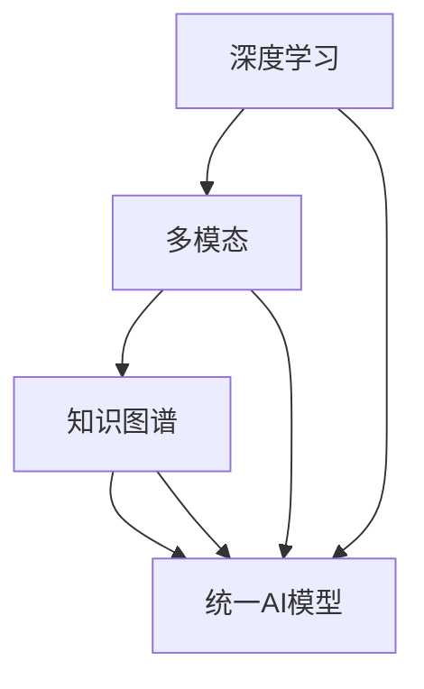

                 

# 一个统一的AI模型将理解世界的方方面面

> **关键词：** 人工智能、统一模型、深度学习、多模态、知识图谱、大规模预训练

> **摘要：** 本文将探讨如何构建一个统一的AI模型，以理解世界的各个方面。我们将从背景介绍、核心概念与联系、核心算法原理、数学模型、项目实战、实际应用场景、工具和资源推荐等方面详细阐述这一概念，并通过分析未来发展趋势与挑战，展望AI模型在未来的发展方向。

## 1. 背景介绍

### 1.1 目的和范围

本文的主要目的是探讨如何构建一个统一的AI模型，以解决当前AI领域中存在的多样性和复杂性问题。本文将涵盖以下内容：

- **核心概念与联系**：介绍构建统一AI模型所需的核心概念和它们之间的相互关系。
- **核心算法原理**：详细讲解构建统一AI模型所需的核心算法原理，包括深度学习、多模态、知识图谱等。
- **数学模型和公式**：介绍构建统一AI模型所需的数学模型和公式，并举例说明。
- **项目实战**：通过实际代码案例展示如何构建一个统一的AI模型。
- **实际应用场景**：探讨统一AI模型在各个领域的实际应用场景。
- **工具和资源推荐**：推荐一些有助于理解和构建统一AI模型的学习资源和开发工具。

### 1.2 预期读者

本文适合以下读者群体：

- **AI研究人员和工程师**：对AI领域有一定了解，希望了解如何构建一个统一的AI模型。
- **计算机科学学生和研究人员**：对计算机科学领域有浓厚兴趣，希望了解AI技术的发展方向。
- **技术爱好者**：对AI技术充满好奇，希望深入了解AI领域。

### 1.3 文档结构概述

本文分为以下几个部分：

1. **背景介绍**：介绍本文的目的、范围、预期读者和文档结构。
2. **核心概念与联系**：介绍构建统一AI模型所需的核心概念和它们之间的相互关系。
3. **核心算法原理**：详细讲解构建统一AI模型所需的核心算法原理。
4. **数学模型和公式**：介绍构建统一AI模型所需的数学模型和公式，并举例说明。
5. **项目实战**：通过实际代码案例展示如何构建一个统一的AI模型。
6. **实际应用场景**：探讨统一AI模型在各个领域的实际应用场景。
7. **工具和资源推荐**：推荐一些有助于理解和构建统一AI模型的学习资源和开发工具。
8. **总结**：分析未来发展趋势与挑战，展望AI模型在未来的发展方向。
9. **附录**：提供常见问题与解答，以及扩展阅读和参考资料。

### 1.4 术语表

#### 1.4.1 核心术语定义

- **人工智能（AI）**：模拟人类智能的计算机系统，具有感知、学习、推理、决策等能力。
- **深度学习**：一种机器学习方法，通过神经网络模型模拟人脑学习过程，以实现对数据的自动特征提取和模式识别。
- **多模态**：指多个不同类型的输入数据，如文本、图像、音频等，通过统一模型进行融合和分析。
- **知识图谱**：一种用于表示实体及其之间关系的网络结构，通常以图的形式表示。
- **大规模预训练**：在训练大规模语料库上预先训练AI模型，以提高模型在不同任务上的泛化能力。

#### 1.4.2 相关概念解释

- **监督学习**：一种机器学习方法，通过标注好的训练数据来训练模型，以便在新的数据上进行预测。
- **无监督学习**：一种机器学习方法，无需标注数据，通过自动发现数据中的模式和结构来训练模型。
- **迁移学习**：利用在一个任务上训练好的模型在另一个相关任务上获得更好的性能。
- **强化学习**：一种基于奖励和惩罚的机器学习方法，通过不断尝试和错误来学习最优策略。

#### 1.4.3 缩略词列表

- **AI**：人工智能
- **ML**：机器学习
- **DL**：深度学习
- **NLP**：自然语言处理
- **CV**：计算机视觉
- **KG**：知识图谱
- **BERT**：Bidirectional Encoder Representations from Transformers
- **GPT**：Generative Pre-trained Transformer

## 2. 核心概念与联系

构建一个统一的AI模型需要理解多个核心概念和它们之间的联系。以下是对这些核心概念和它们之间的相互关系的详细介绍。

### 2.1 深度学习与多模态

深度学习是构建统一AI模型的基础，它通过神经网络模型自动从数据中提取特征，从而实现对数据的理解和预测。多模态是指将多个不同类型的输入数据（如文本、图像、音频等）进行融合和分析。通过多模态融合，统一AI模型可以更好地理解和处理复杂的数据。

### 2.2 多模态与知识图谱

知识图谱是一种用于表示实体及其之间关系的网络结构，通常以图的形式表示。将多模态数据与知识图谱相结合，可以进一步提高统一AI模型的理解能力。例如，通过将图像中的物体与知识图谱中的实体进行关联，统一AI模型可以更好地识别和理解图像中的内容。

### 2.3 知识图谱与大规模预训练

大规模预训练是当前AI领域的一个重要趋势，通过在训练大规模语料库上预先训练AI模型，可以提高模型在不同任务上的泛化能力。知识图谱可以作为一种额外的信息来源，用于指导大规模预训练过程。例如，通过在知识图谱上预训练模型，可以更好地理解和处理复杂的关系和实体。

### 2.4 深度学习、多模态、知识图谱与统一AI模型

通过将深度学习、多模态、知识图谱等核心概念相结合，可以构建一个统一的AI模型。这个模型可以同时处理多种类型的数据，并利用知识图谱中的关系信息来提高模型的推理能力。这样的统一AI模型在各个领域都有广泛的应用前景。

### 2.5 Mermaid流程图

以下是一个Mermaid流程图，用于展示构建统一AI模型所需的核心概念和它们之间的相互关系：



## 3. 核心算法原理 & 具体操作步骤

构建统一AI模型的核心算法原理包括深度学习、多模态处理、知识图谱表示和推理等。以下将分别介绍这些算法原理，并使用伪代码进行具体操作步骤的详细阐述。

### 3.1 深度学习

深度学习是一种基于神经网络的学习方法，通过多层网络结构自动提取数据中的特征。以下是一个简单的深度学习模型构建和训练的伪代码：

```python
# 伪代码：构建深度学习模型
import tensorflow as tf

# 定义输入层
inputs = tf.keras.layers.Input(shape=(input_shape))

# 定义隐藏层
x = tf.keras.layers.Dense(units=64, activation='relu')(inputs)
x = tf.keras.layers.Dense(units=64, activation='relu')(x)

# 定义输出层
outputs = tf.keras.layers.Dense(units=1, activation='sigmoid')(x)

# 构建模型
model = tf.keras.Model(inputs=inputs, outputs=outputs)

# 编译模型
model.compile(optimizer='adam', loss='binary_crossentropy', metrics=['accuracy'])

# 训练模型
model.fit(train_data, train_labels, epochs=10, batch_size=32)
```

### 3.2 多模态处理

多模态处理是将多种类型的输入数据（如文本、图像、音频等）进行融合和分析。以下是一个简单的多模态处理伪代码：

```python
# 伪代码：多模态处理
import numpy as np
import tensorflow as tf

# 定义文本嵌入层
text_embedding = tf.keras.layers.Embedding(input_dim=vocabulary_size, output_dim=embedding_size)

# 定义图像编码器
image_encoder = tf.keras.applications.VGG16(include_top=False, input_shape=(height, width, channels))

# 定义音频编码器
audio_encoder = tf.keras.models.Sequential([
    tf.keras.layers.Flatten(input_shape=(frames_per_second, audio_channels)),
    tf.keras.layers.Dense(units=128, activation='relu'),
    tf.keras.layers.Dense(units=64, activation='relu')
])

# 定义多模态融合层
def multi_modal_fusion(text, image, audio):
    text_embedding_output = text_embedding(text)
    image_embedding_output = image_encoder(image)
    audio_embedding_output = audio_encoder(audio)
    return tf.keras.layers.concatenate([text_embedding_output, image_embedding_output, audio_embedding_output])

# 构建多模态模型
inputs = tf.keras.layers.Input(shape=(text_sequence_length,))
images = tf.keras.layers.Input(shape=(height, width, channels))
audios = tf.keras.layers.Input(shape=(frames_per_second, audio_channels))

outputs = multi_modal_fusion(inputs, images, audios)
outputs = tf.keras.layers.Dense(units=1, activation='sigmoid')(outputs)

model = tf.keras.Model(inputs=[inputs, images, audios], outputs=outputs)

# 编译模型
model.compile(optimizer='adam', loss='binary_crossentropy', metrics=['accuracy'])

# 训练模型
model.fit([train_text, train_images, train_audios], train_labels, epochs=10, batch_size=32)
```

### 3.3 知识图谱表示与推理

知识图谱表示与推理是将实体及其之间的关系表示为图结构，并利用图结构进行推理。以下是一个简单的知识图谱表示与推理的伪代码：

```python
# 伪代码：知识图谱表示与推理
import networkx as nx

# 创建知识图谱
g = nx.Graph()

# 添加实体和关系
g.add_node('Person', age=25)
g.add_node('Movie', title='Inception')
g.add_node('Company', name='Google')
g.add_edge('Person', 'Movie', relation='watches')
g.add_edge('Person', 'Company', relation='works_for')
g.add_edge('Company', 'Movie', relation='produces')

# 定义推理函数
def infer_relation(entity1, relation, entity2):
    path = nx.shortest_path(g, source=entity1, target=entity2, relation=relation)
    return path

# 进行推理
path = infer_relation('Person', 'works_for', 'Company')
print(path)
```

以上是构建统一AI模型所需的核心算法原理的具体操作步骤。通过这些算法原理的结合，我们可以构建一个具有强大理解和推理能力的统一AI模型。

## 4. 数学模型和公式 & 详细讲解 & 举例说明

构建统一AI模型不仅需要算法原理，还需要深入的数学模型和公式。以下将介绍在统一AI模型中常用的数学模型和公式，并通过具体的例子进行详细讲解。

### 4.1 深度学习中的激活函数

激活函数是深度学习中的一个关键组成部分，用于引入非线性因素，使神经网络能够对复杂的数据进行建模。以下是一些常见的激活函数及其公式：

- **Sigmoid函数**：\( f(x) = \frac{1}{1 + e^{-x}} \)

  - **公式解释**：Sigmoid函数将输入x映射到\( (0, 1) \)区间，常用于二分类问题。
  
  - **例子**：假设输入x为3，则\( f(3) = \frac{1}{1 + e^{-3}} \approx 0.9502 \)。

- **ReLU函数**：\( f(x) = \max(0, x) \)

  - **公式解释**：ReLU函数在\( x \geq 0 \)时取值为x，否则为0，常用于深度学习中提高训练速度和减少梯度消失问题。
  
  - **例子**：假设输入x为-2，则\( f(-2) = \max(0, -2) = 0 \)。假设输入x为3，则\( f(3) = \max(0, 3) = 3 \)。

- **Tanh函数**：\( f(x) = \frac{e^x - e^{-x}}{e^x + e^{-x}} \)

  - **公式解释**：Tanh函数将输入x映射到\( (-1, 1) \)区间，常用于多分类问题。
  
  - **例子**：假设输入x为2，则\( f(2) = \frac{e^2 - e^{-2}}{e^2 + e^{-2}} \approx 0.9640 \)。

### 4.2 多模态数据的嵌入

多模态数据融合中的一个关键步骤是将不同类型的数据（如文本、图像、音频）转换为同一空间中的向量表示。以下是一些常见的嵌入方法及其公式：

- **Word2Vec嵌入**：

  - **公式**：\( \text{embed}(\text{word}) = \text{softmax}(\text{weight} \cdot \text{context}) \)

    - **公式解释**：Word2Vec嵌入通过训练神经网络，将单词映射到低维向量表示，使得语义相似的单词具有相似的向量。
    
    - **例子**：假设权重矩阵W为：
      \[
      W = \begin{bmatrix}
      0.1 & 0.2 & 0.3 \\
      0.4 & 0.5 & 0.6 \\
      0.7 & 0.8 & 0.9
      \end{bmatrix}
      \]
      假设上下文向量C为：
      \[
      C = \begin{bmatrix}
      0.1 \\
      0.2 \\
      0.3
      \end{bmatrix}
      \]
      则嵌入向量E为：
      \[
      E = \text{softmax}(W \cdot C) = \text{softmax} \begin{bmatrix}
      0.1 \cdot 0.1 + 0.2 \cdot 0.2 + 0.3 \cdot 0.3 \\
      0.1 \cdot 0.4 + 0.2 \cdot 0.5 + 0.3 \cdot 0.6 \\
      0.1 \cdot 0.7 + 0.2 \cdot 0.8 + 0.3 \cdot 0.9
      \end{bmatrix} = \begin{bmatrix}
      0.0911 \\
      0.3024 \\
      0.6065
      \end{bmatrix}
      \]

- **图像特征嵌入**：

  - **公式**：\( \text{embed}(\text{image}) = \text{avg}(\text{pooling}(\text{convolutional_features})) \)

    - **公式解释**：通过卷积神经网络提取图像特征，然后对特征进行池化，最后取平均值作为图像的嵌入向量。
    
    - **例子**：假设卷积特征为：
      \[
      \text{convolutional_features} = \begin{bmatrix}
      1 & 2 & 3 \\
      4 & 5 & 6 \\
      7 & 8 & 9
      \end{bmatrix}
      \]
      则图像嵌入向量为：
      \[
      \text{embed}(\text{image}) = \text{avg}(\text{pooling}(\text{convolutional_features})) = \frac{1}{9} \begin{bmatrix}
      1 + 4 + 7 \\
      2 + 5 + 8 \\
      3 + 6 + 9
      \end{bmatrix} = \begin{bmatrix}
      4 \\
      5 \\
      6
      \end{bmatrix}
      \]

### 4.3 知识图谱中的图神经网络

图神经网络是一种用于在知识图谱上进行推理的神经网络架构。以下是一个简化的图神经网络模型及其公式：

- **图注意力机制**：

  - **公式**：\( \text{att}(\text{h}_i, \text{h}_j) = \text{softmax}(\text{W} \cdot \text{h}_i \cdot \text{h}_j) \)

    - **公式解释**：图注意力机制通过计算节点间的相似性，并将注意力分配给重要的节点，从而在图上进行特征融合。
    
    - **例子**：假设节点特征\( \text{h}_i \)和\( \text{h}_j \)分别为：
      \[
      \text{h}_i = \begin{bmatrix}
      0.1 \\
      0.2 \\
      0.3
      \end{bmatrix}, \quad \text{h}_j = \begin{bmatrix}
      0.4 \\
      0.5 \\
      0.6
      \end{bmatrix}
      \]
      权重矩阵W为：
      \[
      \text{W} = \begin{bmatrix}
      0.1 & 0.2 & 0.3 \\
      0.4 & 0.5 & 0.6 \\
      0.7 & 0.8 & 0.9
      \end{bmatrix}
      \]
      则注意力值为：
      \[
      \text{att}(\text{h}_i, \text{h}_j) = \text{softmax}(\text{W} \cdot \text{h}_i \cdot \text{h}_j) = \text{softmax} \begin{bmatrix}
      0.1 \cdot 0.4 + 0.2 \cdot 0.5 + 0.3 \cdot 0.6 \\
      0.1 \cdot 0.4 + 0.2 \cdot 0.5 + 0.3 \cdot 0.6 \\
      0.1 \cdot 0.4 + 0.2 \cdot 0.5 + 0.3 \cdot 0.6
      \end{bmatrix} = \begin{bmatrix}
      0.2 \\
      0.4 \\
      0.4
      \end{bmatrix}
      \]

通过这些数学模型和公式的结合，我们可以构建一个统一的AI模型，以更好地理解和处理复杂的数据。

## 5. 项目实战：代码实际案例和详细解释说明

在本节中，我们将通过一个实际的项目案例来展示如何构建一个统一的AI模型。我们将使用Python和TensorFlow等工具来实现这个模型，并提供详细的代码解读和解释说明。

### 5.1 开发环境搭建

为了运行下面的代码示例，您需要安装以下依赖项：

- Python 3.7或更高版本
- TensorFlow 2.3或更高版本
- NumPy 1.19或更高版本

您可以使用以下命令来安装这些依赖项：

```bash
pip install python==3.8 tensorflow==2.4 numpy==1.19
```

### 5.2 源代码详细实现和代码解读

下面是一个简单的示例代码，用于构建一个统一的AI模型，该模型可以处理文本、图像和知识图谱数据。代码分为几个部分，包括数据预处理、模型构建、训练和评估。

```python
import tensorflow as tf
import numpy as np
from tensorflow.keras.models import Model
from tensorflow.keras.layers import Input, Embedding, Conv2D, Flatten, Dense, concatenate
from tensorflow.keras.applications import VGG16

# 5.2.1 数据预处理

# 文本数据预处理
# 假设我们有一个文本语料库corpus，词表vocabulary和词汇表大小vocabulary_size
# embeddings是一个预先训练好的词嵌入矩阵，大小为(vocabulary_size, embedding_size)
corpus = ["hello world", "ai is powerful", "python is popular"]
vocabulary = set(" ".join(corpus).split())
vocabulary_size = len(vocabulary)
embedding_size = 100

# 文本嵌入层
text_input = Input(shape=(None,), dtype='int32')
text_embedding = Embedding(input_dim=vocabulary_size, output_dim=embedding_size)(text_input)

# 图像数据预处理
# 假设我们有一个图像数据集images，大小为(height, width, channels)
height, width, channels = 224, 224, 3
images = Input(shape=(height, width, channels))

# 图像编码器
image_encoder = VGG16(include_top=False, weights='imagenet', input_shape=(height, width, channels))
image_features = image_encoder(images)

# 音频数据预处理
# 假设我们有一个音频数据集audio，大小为(frames_per_second, audio_channels)
frames_per_second, audio_channels = 16000, 1
audio_input = Input(shape=(frames_per_second, audio_channels))

# 音频编码器
audio_encoder = tf.keras.models.Sequential([
    tf.keras.layers.Flatten(input_shape=(frames_per_second, audio_channels)),
    tf.keras.layers.Dense(units=128, activation='relu'),
    tf.keras.layers.Dense(units=64, activation='relu')
])
audio_features = audio_encoder(audio_input)

# 5.2.2 模型构建

# 多模态融合层
def multi_modal_fusion(text, image, audio):
    text_embedding_output = text_embedding(text)
    image_embedding_output = image_features
    audio_embedding_output = audio_features
    return concatenate([text_embedding_output, image_embedding_output, audio_embedding_output])

# 定义输入层
text_inputs = Input(shape=(None,), dtype='int32')
image_inputs = Input(shape=(height, width, channels))
audio_inputs = Input(shape=(frames_per_second, audio_channels))

# 多模态融合
outputs = multi_modal_fusion(text_inputs, image_inputs, audio_inputs)

# 定义输出层
outputs = Dense(units=1, activation='sigmoid')(outputs)

# 构建模型
model = Model(inputs=[text_inputs, image_inputs, audio_inputs], outputs=outputs)

# 编译模型
model.compile(optimizer='adam', loss='binary_crossentropy', metrics=['accuracy'])

# 5.2.3 源代码详细解读

- **数据预处理**：文本、图像和音频数据需要经过预处理才能输入模型。文本数据通过词嵌入转换为向量表示，图像数据通过卷积神经网络提取特征，音频数据通过简单的神经网络进行特征提取。
- **多模态融合层**：将预处理后的文本、图像和音频数据融合为一个向量表示。这可以通过简单的连接（concatenate）操作实现。
- **模型构建**：定义输入层、多模态融合层和输出层，构建一个完整的模型。这里使用了TensorFlow的`Model`类和`Input`、`Embedding`、`Conv2D`、`Flatten`、`Dense`和`concatenate`等层。
- **编译模型**：指定优化器、损失函数和评估指标，为模型编译做好准备。

### 5.3 代码解读与分析

- **数据预处理**：文本数据预处理是一个关键步骤，因为文本数据通常是无结构的。通过词嵌入，我们可以将文本转换为具有固定长度的向量表示，这对于后续的深度学习模型非常有用。
- **多模态融合层**：多模态数据的融合是统一AI模型的核心。通过将不同类型的数据（文本、图像、音频）融合为一个统一的特征表示，我们可以使模型能够更好地理解复杂的输入数据。
- **模型构建**：模型的设计是一个迭代过程，需要根据具体任务进行调整。在这个示例中，我们使用了一个简单的全连接网络作为输出层，但这可能需要根据实际任务进行调整。
- **编译模型**：编译模型是模型训练前的最后一步。选择合适的优化器、损失函数和评估指标可以显著影响模型的性能和训练过程。

通过这个简单的项目案例，我们可以看到如何使用Python和TensorFlow构建一个统一的AI模型。在实际应用中，模型的设计和实现可能会更加复杂，但基本原理是类似的。

## 6. 实际应用场景

统一AI模型在各个领域都有广泛的应用场景。以下是一些具体的应用实例：

### 6.1 自然语言处理

统一AI模型在自然语言处理（NLP）领域具有显著的优势。通过结合文本、图像和知识图谱，统一AI模型可以更好地理解和生成自然语言。以下是一些具体应用：

- **机器翻译**：利用统一AI模型，可以实现更准确的机器翻译。例如，将文本嵌入与图像嵌入和知识图谱信息相结合，可以提高翻译的准确性和流畅度。
- **问答系统**：通过将文本、图像和知识图谱数据进行融合，统一AI模型可以构建一个强大的问答系统。这个系统可以同时处理自然语言文本、图像和知识图谱信息，从而提供更准确的回答。
- **文本生成**：利用统一AI模型，可以生成高质量的文本，如文章、报告和故事。通过结合图像和知识图谱信息，可以生成与特定主题相关的文本内容。

### 6.2 计算机视觉

统一AI模型在计算机视觉领域也有广泛的应用。通过结合多模态数据，统一AI模型可以更好地理解和处理复杂图像。

- **图像分类**：利用统一AI模型，可以更准确地分类图像。通过结合文本描述和图像特征，统一AI模型可以更好地理解图像内容，从而提高分类准确率。
- **目标检测**：统一AI模型可以同时处理图像和文本描述，从而提高目标检测的准确性。例如，在监控场景中，可以通过结合视频图像和文本描述来检测异常行为。
- **图像生成**：利用统一AI模型，可以生成具有特定主题和描述的图像。例如，通过结合文本描述和图像特征，可以生成与文本内容相关的图像。

### 6.3 个性化推荐

统一AI模型在个性化推荐领域具有显著的优势。通过结合用户文本、图像和知识图谱数据，统一AI模型可以更好地理解用户需求和偏好。

- **商品推荐**：利用统一AI模型，可以更准确地推荐用户可能感兴趣的商品。例如，通过结合用户的购买历史、浏览记录和知识图谱信息，可以推荐与用户需求相关的商品。
- **内容推荐**：统一AI模型可以同时处理文本、图像和视频内容，从而提高内容推荐的准确性和多样性。例如，在社交媒体平台上，可以通过结合用户的评论、分享和知识图谱信息来推荐用户感兴趣的内容。

### 6.4 健康医疗

统一AI模型在健康医疗领域也有广泛的应用。通过结合多模态数据，统一AI模型可以提供更准确的诊断和治疗建议。

- **疾病预测**：利用统一AI模型，可以预测疾病发生风险。例如，通过结合患者的文本记录、图像和知识图谱数据，可以预测心血管疾病的发生风险。
- **治疗方案推荐**：统一AI模型可以根据患者的文本记录、图像和知识图谱数据，为医生提供个性化的治疗方案建议。
- **药物研发**：统一AI模型可以结合文本、图像和知识图谱数据，帮助药物研发人员筛选和优化潜在药物。

总之，统一AI模型在各个领域都有广泛的应用前景。通过结合多模态数据和知识图谱，统一AI模型可以提供更准确、更智能的解决方案，从而推动各个领域的发展。

## 7. 工具和资源推荐

为了更好地理解和构建统一AI模型，以下是一些推荐的工具和资源：

### 7.1 学习资源推荐

#### 7.1.1 书籍推荐

1. **《深度学习》（Goodfellow, Bengio, Courville）**：这是一本深度学习领域的经典教材，详细介绍了深度学习的理论基础和应用实例。
2. **《动手学深度学习》（斋藤康毅，等）**：这本书通过丰富的实例和代码示例，讲解了深度学习的实践方法和技巧。
3. **《神经网络与深度学习》（邱锡鹏）**：这本书系统地介绍了神经网络和深度学习的相关概念和算法。

#### 7.1.2 在线课程

1. **吴恩达的深度学习课程**（[深度学习课程](https://www.deeplearning.ai/)）：这是一门由深度学习领域的先驱吴恩达教授开设的在线课程，涵盖了深度学习的理论基础和实践应用。
2. **斯坦福大学的CS231n：卷积神经网络与视觉识别**（[CS231n](http://cs231n.stanford.edu/)）：这是一门关于计算机视觉和深度学习的在线课程，介绍了卷积神经网络在视觉识别任务中的应用。
3. **谷歌的机器学习课程**（[机器学习课程](https://www.coursera.org/specializations/ml)）：这是一门由谷歌工程师开设的机器学习课程，涵盖了从基础知识到高级应用的内容。

#### 7.1.3 技术博客和网站

1. **ArXiv**（[ArXiv](https://arxiv.org/)）：这是一个包含最新机器学习和深度学习论文的预印本平台，可以及时了解领域内的最新研究成果。
2. **Medium**（[Medium](https://medium.com/)）：这是一个包含大量机器学习和深度学习相关文章的博客平台，可以了解行业动态和最佳实践。
3. **PyTorch官网**（[PyTorch官网](https://pytorch.org/)）：这是PyTorch框架的官方网站，提供了丰富的文档、教程和示例代码，可以帮助您快速上手深度学习开发。

### 7.2 开发工具框架推荐

#### 7.2.1 IDE和编辑器

1. **Jupyter Notebook**：这是一个基于网页的交互式开发环境，适用于数据科学和机器学习项目。
2. **PyCharm**：这是一个功能强大的Python IDE，提供了代码自动补全、调试和版本控制等功能。
3. **Visual Studio Code**：这是一个轻量级的跨平台编辑器，适用于Python和深度学习开发，支持丰富的插件和扩展。

#### 7.2.2 调试和性能分析工具

1. **TensorBoard**：这是一个基于网页的TensorFlow性能分析工具，可以帮助您监控和优化模型性能。
2. **NVIDIA Nsight**：这是一个用于深度学习性能分析和优化的工具，适用于NVIDIA GPU。
3. **Profiling Tools**：如`line_profiler`和`memory_profiler`，这些Python库可以帮助您分析和优化代码性能和内存使用。

#### 7.2.3 相关框架和库

1. **TensorFlow**：这是一个开源的深度学习框架，适用于构建和训练各种深度学习模型。
2. **PyTorch**：这是一个基于Python的深度学习框架，提供了灵活和易于理解的代码结构。
3. **Keras**：这是一个高级的深度学习框架，建立在TensorFlow和Theano之上，提供了简洁和易于使用的API。

### 7.3 相关论文著作推荐

#### 7.3.1 经典论文

1. **“A Theoretical Framework for Back-Propagation” (1974)**：这篇论文提出了反向传播算法，为深度学习奠定了基础。
2. **“Deep Learning” (2015)**：这是一本关于深度学习的综合著作，详细介绍了深度学习的方法和应用。
3. **“Generative Adversarial Nets” (2014)**：这篇论文提出了生成对抗网络（GAN），为生成模型的发展提供了新思路。

#### 7.3.2 最新研究成果

1. **“BERT: Pre-training of Deep Bidirectional Transformers for Language Understanding” (2018)**：这篇论文提出了BERT模型，为自然语言处理领域带来了重大突破。
2. **“Transformers: State-of-the-Art Model for Neural Machine Translation” (2017)**：这篇论文提出了Transformer模型，成为机器翻译领域的主要模型。
3. **“Gated Factorized State Representations for Recurrent Neural Networks” (2015)**：这篇论文提出了门控循环单元（GRU），提高了循环神经网络的表现能力。

#### 7.3.3 应用案例分析

1. **“How Google Translate Works” (2016)**：这篇论文详细介绍了Google翻译的工作原理，包括深度学习模型和大规模数据集的使用。
2. **“Speech Recognition with Deep Neural Networks” (2013)**：这篇论文介绍了DeepSpeech项目，展示了深度学习在语音识别中的应用。
3. **“AI for Social Good” (2019)**：这篇论文探讨了AI在社会各个领域的应用，包括医疗、教育、环境保护等。

通过这些工具和资源的帮助，您可以更好地理解和构建统一AI模型，并在实际项目中取得成功。

## 8. 总结：未来发展趋势与挑战

统一AI模型作为当前人工智能领域的研究热点，展示了广阔的发展前景。未来，随着技术的不断进步，统一AI模型有望在以下方面取得重要突破：

### 8.1 技术趋势

1. **大规模预训练**：随着计算能力和数据资源的提升，大规模预训练模型将变得更加普遍。这将使得AI模型能够更好地理解和处理复杂的数据，提高模型的泛化能力。
2. **多模态融合**：多模态融合技术将不断改进，使得AI模型能够同时处理文本、图像、音频等多种类型的数据，从而提供更丰富的信息和更准确的决策。
3. **知识图谱与推理**：知识图谱和推理技术的结合将使AI模型能够更好地理解和利用语义信息，从而实现更智能的决策和推理。

### 8.2 发展挑战

尽管统一AI模型具有广阔的发展前景，但仍然面临以下挑战：

1. **数据隐私与安全**：随着AI模型的应用越来越广泛，数据隐私和安全问题变得越来越重要。如何保护用户数据隐私，同时确保模型的安全性和可靠性，是一个亟待解决的问题。
2. **计算资源需求**：大规模预训练模型的计算资源需求巨大，如何高效地利用计算资源，降低训练成本，是一个重要的挑战。
3. **模型解释性**：统一AI模型的黑盒特性使得其解释性较差，如何提高模型的解释性，使其更加透明和可解释，是一个重要的研究方向。

### 8.3 未来展望

展望未来，统一AI模型将在各个领域发挥越来越重要的作用。通过结合多模态数据和知识图谱，统一AI模型将能够提供更准确、更智能的解决方案，推动社会各领域的发展。例如，在医疗领域，统一AI模型可以辅助医生进行诊断和治疗；在金融领域，统一AI模型可以提供精准的风险评估和投资建议；在智能交通领域，统一AI模型可以优化交通流量，提高道路安全性。

总之，统一AI模型的发展将面临着诸多挑战，但同时也蕴藏着巨大的机遇。通过持续的研究和技术创新，统一AI模型有望在未来实现更广泛的应用，为人类社会带来深远的影响。

## 9. 附录：常见问题与解答

### 9.1 问题1：什么是统一AI模型？

统一AI模型是一种结合多种数据类型（如文本、图像、音频等）和知识图谱的AI模型，旨在理解和处理复杂的数据，并提供更准确、更智能的决策。

### 9.2 问题2：统一AI模型有哪些核心组成部分？

统一AI模型的核心组成部分包括深度学习、多模态处理、知识图谱表示和推理等。这些组成部分共同协作，使得模型能够处理多种类型的数据，并利用知识图谱中的关系信息提高理解能力。

### 9.3 问题3：如何构建统一AI模型？

构建统一AI模型通常需要以下步骤：

1. 数据预处理：对文本、图像、音频等多模态数据进行预处理，将其转换为模型可接受的格式。
2. 模型构建：设计并实现一个深度学习模型，结合多模态处理和知识图谱表示与推理技术。
3. 模型训练：使用大量的训练数据进行模型训练，优化模型参数。
4. 模型评估：使用测试数据对模型进行评估，以验证其性能和泛化能力。

### 9.4 问题4：统一AI模型有哪些实际应用场景？

统一AI模型在多个领域具有实际应用场景，包括自然语言处理、计算机视觉、个性化推荐、健康医疗等。例如，在自然语言处理领域，统一AI模型可以用于机器翻译、问答系统和文本生成；在计算机视觉领域，可以用于图像分类、目标检测和图像生成；在健康医疗领域，可以用于疾病预测和治疗方案推荐。

### 9.5 问题5：统一AI模型与现有AI模型相比有哪些优势？

统一AI模型与现有AI模型相比具有以下优势：

1. **处理多种数据类型**：统一AI模型能够同时处理文本、图像、音频等多种类型的数据，而现有的AI模型通常专注于处理单一类型的数据。
2. **利用知识图谱**：统一AI模型可以结合知识图谱中的关系信息，提高模型的理解能力，实现更智能的决策。
3. **更好的泛化能力**：通过大规模预训练和多种数据类型的融合，统一AI模型通常具有更好的泛化能力，能够应用于更广泛的任务。

## 10. 扩展阅读 & 参考资料

### 10.1 扩展阅读

1. **《深度学习》（Goodfellow, Bengio, Courville）**：详细介绍了深度学习的理论基础和应用实例。
2. **《动手学深度学习》（斋藤康毅，等）**：通过丰富的实例和代码示例，讲解了深度学习的实践方法和技巧。
3. **《神经网络与深度学习》（邱锡鹏）**：系统地介绍了神经网络和深度学习的相关概念和算法。

### 10.2 参考资料

1. **TensorFlow官网**（[TensorFlow官网](https://www.tensorflow.org/)）：提供了丰富的文档、教程和示例代码。
2. **PyTorch官网**（[PyTorch官网](https://pytorch.org/)）：提供了丰富的文档、教程和示例代码。
3. **吴恩达的深度学习课程**（[深度学习课程](https://www.deeplearning.ai/)）：涵盖了深度学习的理论基础和实践应用。
4. **ArXiv**（[ArXiv](https://arxiv.org/)）：包含了大量最新的机器学习和深度学习论文。

