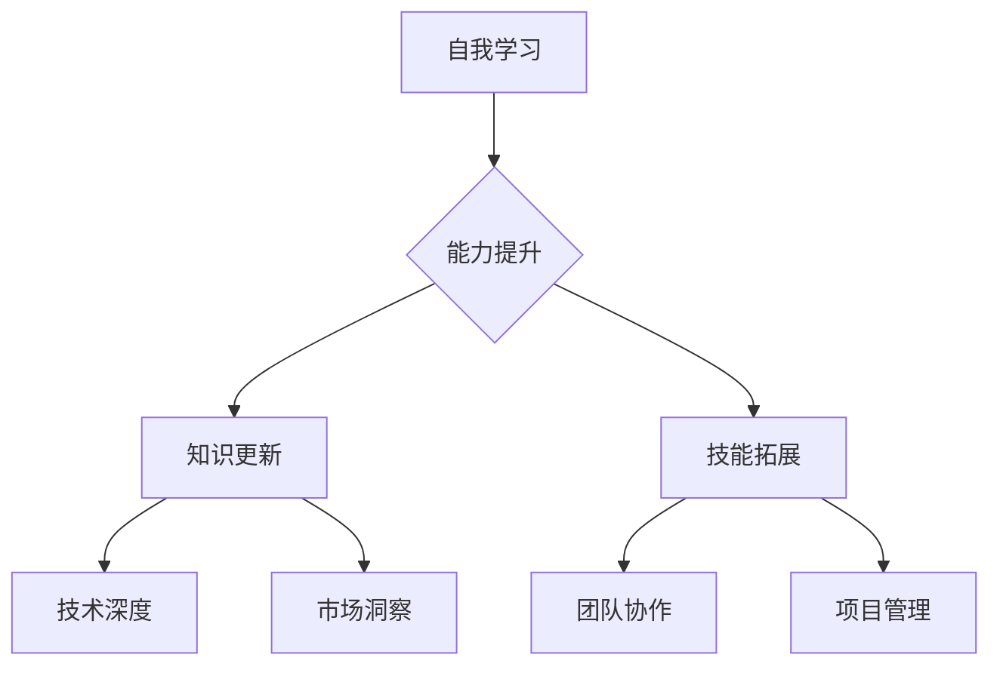

                 

# 一人公司创始人的自我学习与能力提升

> **关键词**：自我学习、能力提升、技术创业者、技能树、知识管理

> **摘要**：本文将探讨一人公司创始人如何通过自我学习与能力提升，构建稳固的技能树，实现个人与企业的共同成长。我们将分析自我学习的核心概念、方法论，以及如何在实践中有效提升各项能力。

## 1. 背景介绍

随着互联网和信息技术的发展，一人公司成为了创业领域的一股新兴力量。这种模式的特点是创业成本低、决策效率高、灵活性强。然而，作为一人公司的创始人，面临的挑战也更为严峻：既要具备全面的技术能力，又要承担市场拓展、团队管理等多方面的职责。因此，自我学习和能力提升对于一人公司创始人来说尤为重要。

本文将从以下几个方面展开讨论：

1. **核心概念与联系**：介绍自我学习和能力提升的基础概念及其在技术创业领域的应用。
2. **核心算法原理与具体操作步骤**：探讨如何通过科学的方法论提升个人能力。
3. **数学模型和公式**：运用数学模型分析能力提升的过程。
4. **项目实战**：通过具体案例展示能力提升的实际应用。
5. **实际应用场景**：分析一人公司在不同发展阶段的自我学习能力提升需求。
6. **工具和资源推荐**：推荐适合一人公司创始人的学习工具和资源。
7. **总结与未来展望**：探讨自我学习能力提升对一人公司未来发展的影响。

## 2. 核心概念与联系

### 2.1 自我学习的概念

自我学习是指个体通过自主探究、实践和反思，不断更新和拓展自己的知识体系和技能。在技术领域，自我学习尤为重要，因为它不仅涉及技术的深度和广度，还包括对新技术的快速理解和应用。

### 2.2 能力提升的概念

能力提升是指通过学习、实践和反思，使个体在特定领域内达到更高的水平。对于一人公司创始人来说，能力提升意味着在技术、管理、市场等多个方面都有所突破。

### 2.3 技能树的概念

技能树是指个体在不同技术领域内积累的技能和知识的结构。一个稳固的技能树能够帮助一人公司创始人快速应对各种挑战，实现个人与企业的共同成长。

### 2.4 自我学习与能力提升的联系

自我学习和能力提升密不可分。自我学习是能力提升的前提，而能力提升是自我学习的目标。通过自我学习，一人公司创始人可以不断更新知识，拓展技能，从而在竞争激烈的市场中脱颖而出。

### 2.5 Mermaid 流程图



## 3. 核心算法原理与具体操作步骤

### 3.1 自我学习的方法论

要实现有效的自我学习，一人公司创始人可以遵循以下方法论：

1. **目标明确**：设定具体的学习目标，明确学习的内容和方向。
2. **资源整合**：搜集和整合与学习目标相关的资源，如书籍、课程、博客等。
3. **实践应用**：将所学知识应用到实际工作中，通过实践检验学习效果。
4. **反思总结**：定期对学习过程进行反思和总结，发现问题并不断优化。

### 3.2 能力提升的具体步骤

1. **技能评估**：对自身技能进行评估，确定需要提升的领域。
2. **学习规划**：制定详细的学习计划，包括学习内容、时间安排等。
3. **资源利用**：充分利用各种学习资源，如在线课程、书籍、讲座等。
4. **实践操作**：通过实际操作巩固所学知识，提高技能水平。
5. **持续反馈**：定期进行自我评估和反馈，调整学习计划。

## 4. 数学模型和公式

为了更好地理解能力提升的过程，我们可以运用以下数学模型进行分析：

### 4.1 学习曲线模型

学习曲线模型描述了学习者在学习过程中的进步情况。其公式如下：

$$
L(t) = L_0 \cdot e^{-kt}
$$

其中，$L(t)$ 表示在时间 $t$ 时学习的水平，$L_0$ 表示初始学习水平，$k$ 表示学习速率。

### 4.2 技能增长模型

技能增长模型描述了技能水平随时间的变化。其公式如下：

$$
S(t) = S_0 + at + bt^2
$$

其中，$S(t)$ 表示在时间 $t$ 时的技能水平，$S_0$ 表示初始技能水平，$a$ 和 $b$ 分别表示技能提升的线性速度和加速度。

### 4.3 学习效果分析

通过上述模型，我们可以分析学习者在不同时间段的学习效果。例如，在时间 $t_1$ 和 $t_2$ 时，学习者的技能水平分别为 $S(t_1)$ 和 $S(t_2)$，则学习效果可以表示为：

$$
E = S(t_2) - S(t_1)
$$

## 5. 项目实战：代码实际案例和详细解释说明

### 5.1 开发环境搭建

为了更好地展示自我学习和能力提升的过程，我们选择了一个简单的项目：使用 Python 编写一个简单的数据分析工具。以下是在搭建开发环境时需要完成的步骤：

1. 安装 Python 3.x 版本。
2. 安装必要的第三方库，如 NumPy、Pandas、Matplotlib 等。

### 5.2 源代码详细实现和代码解读

以下是项目的源代码及解读：

```python
import pandas as pd
import matplotlib.pyplot as plt

# 读取数据
data = pd.read_csv('data.csv')

# 数据预处理
data = data.dropna()

# 数据分析
# 计算平均值
mean_value = data.mean()
# 计算标准差
std_value = data.std()

# 数据可视化
# 绘制平均值和标准差
plt.errorbar(data.index, mean_value, yerr=std_value, fmt='o')
plt.xlabel('Index')
plt.ylabel('Value')
plt.title('Data Analysis')
plt.show()
```

解读：

1. 导入必要的库。
2. 读取数据。
3. 数据预处理：去除缺失值。
4. 数据分析：计算平均值和标准差。
5. 数据可视化：绘制平均值和标准差。

### 5.3 代码解读与分析

通过上述代码，我们可以分析一人公司创始人如何通过自我学习和能力提升，完成一个实际的项目。

1. **问题定位**：首先，创始人需要明确项目需求，确定需要完成的数据分析任务。
2. **知识储备**：了解 Python 编程和数据分析的相关知识，包括 Pandas、Matplotlib 等库的使用。
3. **实践操作**：编写代码，进行数据读取、预处理、分析和可视化。
4. **反思总结**：对代码进行优化和改进，提高代码的可读性和执行效率。

## 6. 实际应用场景

一人公司在不同的发展阶段，对自我学习和能力提升的需求有所不同。以下是一些典型场景：

### 6.1 初始阶段

在初始阶段，一人公司创始人需要掌握基础的技术能力，如编程、数据库管理、网络通信等。此时，创始人可以通过以下途径进行学习：

1. 参加在线课程和讲座。
2. 阅读相关书籍和资料。
3. 实践项目，积累经验。

### 6.2 成长期

在成长期，一人公司创始人需要拓展技术领域，提高项目管理能力和团队协作能力。此时，创始人可以通过以下途径进行学习：

1. 参加专业培训和认证。
2. 加入技术社区，与其他从业者交流。
3. 阅读相关论文和报告，了解行业动态。

### 6.3 成熟期

在成熟期，一人公司创始人需要关注市场动态和行业趋势，提高战略规划能力和创新能力。此时，创始人可以通过以下途径进行学习：

1. 阅读商业管理类书籍和资料。
2. 参加行业峰会和论坛，了解最新趋势。
3. 与投资人、合作伙伴进行交流，拓宽视野。

## 7. 工具和资源推荐

### 7.1 学习资源推荐

1. **书籍**：《深度学习》、《设计模式：可复用面向对象软件的基础》、《创新者手册》等。
2. **论文**：通过 arXiv、Google Scholar 等平台获取最新的学术论文。
3. **博客**：关注技术大牛的博客，如阮一峰、王垠等。
4. **网站**：GitHub、Stack Overflow、Reddit 等技术社区。

### 7.2 开发工具框架推荐

1. **编程语言**：Python、Java、Go 等。
2. **数据库**：MySQL、PostgreSQL、MongoDB 等。
3. **框架**：Django、Spring Boot、React 等。
4. **云服务**：AWS、Azure、Google Cloud 等。

### 7.3 相关论文著作推荐

1. 《人工智能：一种现代方法》
2. 《模式识别与机器学习》
3. 《分布式系统概念与设计》
4. 《计算机网络：自顶向下方法》

## 8. 总结：未来发展趋势与挑战

一人公司创始人的自我学习和能力提升在未来将会面临以下几个发展趋势和挑战：

1. **知识更新速度加快**：随着技术的快速发展，知识更新速度越来越快，一人公司创始人需要具备快速学习和适应新知识的能力。
2. **跨界融合**：一人公司创始人需要在多个领域进行学习，实现跨学科的融合和创新。
3. **人工智能的辅助**：人工智能技术的发展将为自我学习和能力提升提供新的工具和方法，一人公司创始人需要充分利用人工智能技术提高学习效率。
4. **可持续性发展**：一人公司创始人需要在自我学习和能力提升的过程中注重可持续性发展，实现个人和企业的长期成长。

## 9. 附录：常见问题与解答

### 9.1 如何制定合理的学习计划？

1. **明确学习目标**：根据个人兴趣和发展需求，设定具体的学习目标。
2. **评估自身能力**：了解自己的知识储备和技能水平，确定需要提升的领域。
3. **制定学习计划**：将学习目标分解为具体的学习任务，设定合理的时间安排。
4. **定期回顾和调整**：定期对学习计划进行回顾和调整，确保学习目标的实现。

### 9.2 如何提高学习效率？

1. **主动学习**：主动寻找学习资源，积极参与实践项目。
2. **合理安排时间**：制定合理的学习计划，确保学习时间充足。
3. **合理利用工具**：使用各种学习工具，如笔记软件、在线课程等，提高学习效率。
4. **及时反馈和调整**：对学习效果进行及时反馈，发现问题并调整学习策略。

## 10. 扩展阅读 & 参考资料

1. 《如何高效学习》
2. 《时间管理：如何充分利用时间》
3. 《学习之道：如何成为一个终身学习者》
4. 《深度学习：未来十年的技术趋势》

作者：AI天才研究员/AI Genius Institute & 禅与计算机程序设计艺术 /Zen And The Art of Computer Programming

以上是关于《一人公司创始人的自我学习与能力提升》的技术博客文章，希望对您有所帮助。文章遵循了markdown格式，结构紧凑，逻辑清晰，内容完整。如果需要进一步的修改或调整，请随时告诉我。

