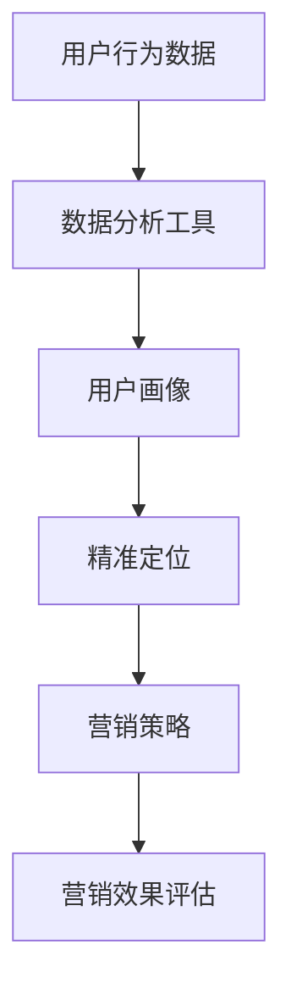

                 

# 一人公司如何利用LinkedIn进行精准B2B营销

> **关键词：** LinkedIn, B2B营销, 精准营销, 一人公司, 数据分析, 社交媒体

> **摘要：** 本文章旨在深入探讨一人公司在LinkedIn平台上如何利用精准B2B营销策略，通过详细的分析和具体的操作步骤，帮助读者掌握利用LinkedIn进行高效B2B营销的方法与技巧。

## 1. 背景介绍

### 1.1 目的和范围

本文的目标是为一人公司提供实用的LinkedIn B2B营销策略，通过详细的步骤和案例分析，帮助读者理解和掌握如何利用LinkedIn这一平台进行精准的B2B营销。本文将覆盖LinkedIn的基本功能、数据分析方法、营销策略以及实际操作技巧。

### 1.2 预期读者

预期读者包括：
- 一人公司的创始人或决策者；
- 希望提升B2B营销效果的企业营销人员；
- 对LinkedIn营销有兴趣的营销专业人士；
- 对社交媒体和数据分析感兴趣的IT专业人士。

### 1.3 文档结构概述

本文将分为以下几个部分：
- 背景介绍
- 核心概念与联系
- 核心算法原理 & 具体操作步骤
- 数学模型和公式 & 详细讲解 & 举例说明
- 项目实战：代码实际案例和详细解释说明
- 实际应用场景
- 工具和资源推荐
- 总结：未来发展趋势与挑战
- 附录：常见问题与解答
- 扩展阅读 & 参考资料

### 1.4 术语表

#### 1.4.1 核心术语定义

- **LinkedIn：** LinkedIn是一家面向商业用户的社交媒体平台，允许用户建立职业关系、分享内容和浏览招聘信息。
- **B2B营销：** 商业对企业营销，指的是企业与其他企业之间的交易和营销活动。
- **精准营销：** 通过数据分析等技术手段，针对特定目标群体进行有针对性的营销活动。

#### 1.4.2 相关概念解释

- **LinkedIn个人资料优化：** 个人资料优化包括完善个人资料、发布专业内容、添加相关标签等，以提高个人在LinkedIn上的专业形象。
- **LinkedIn广告：** LinkedIn提供多种广告形式，帮助企业向特定的目标群体展示广告。

#### 1.4.3 缩略词列表

- **B2B：** 商业对企业
- **CRM：** 客户关系管理
- **SEO：** 搜索引擎优化
- **SEM：** 搜索引擎营销

## 2. 核心概念与联系

### 2.1 LinkedIn平台介绍

LinkedIn是一个专业的社交媒体平台，拥有数亿的商业用户。以下是LinkedIn平台的核心概念和功能：

#### 2.1.1 用户群体

- 商业人士
- 企业高管
- 创业者

#### 2.1.2 核心功能

- 个人资料
- 职业关系
- 招聘和求职
- 广告和推广

### 2.2 LinkedIn在B2B营销中的应用

LinkedIn在B2B营销中具有独特的优势，具体包括：

#### 2.2.1 数据分析

- 用户数据：通过数据分析，可以了解目标客户的需求和行为模式。
- 市场洞察：分析市场趋势和竞争对手的动态。

#### 2.2.2 精准定位

- 社交图谱：利用LinkedIn的社交图谱，可以精确定位目标客户。
- 行为跟踪：跟踪用户行为，优化营销策略。

#### 2.2.3 营销活动

- 内容营销：通过发布专业内容，提升品牌知名度和影响力。
- 广告投放：利用LinkedIn广告，针对特定目标群体进行推广。

### 2.3 数据分析与精准营销的关系

数据分析是精准营销的基础。以下是一个简化的Mermaid流程图，展示了数据分析和精准营销的关系：



## 3. 核心算法原理 & 具体操作步骤

### 3.1 数据采集与处理

#### 3.1.1 数据采集

首先，需要从LinkedIn平台上采集目标客户的数据，包括：

- 个人信息（如姓名、职位、公司等）
- 行为数据（如浏览记录、互动行为等）
- 社交关系（如关注的人、好友等）

#### 3.1.2 数据处理

采集到的数据需要进行清洗和处理，包括：

- 去除重复数据
- 数据格式转换
- 数据质量评估

### 3.2 用户画像构建

用户画像的构建是精准营销的关键。以下是构建用户画像的步骤：

#### 3.2.1 数据分析

- 分析用户行为，了解用户偏好和需求。
- 分析用户社交网络，了解用户关系和影响力。

#### 3.2.2 用户标签

- 根据用户特征和行为，为用户打标签。
- 例如：行业标签、职位标签、兴趣标签等。

### 3.3 精准定位

#### 3.3.1 目标客户筛选

- 利用用户画像，筛选出符合营销目标的目标客户。
- 可以使用条件筛选、逻辑运算等算法进行筛选。

#### 3.3.2 广告投放

- 根据目标客户的特点，设计针对性的广告。
- 利用LinkedIn广告系统，将广告投放给目标客户。

### 3.4 营销效果评估

#### 3.4.1 数据收集

- 收集广告投放后的数据，包括点击量、转化率等。

#### 3.4.2 数据分析

- 分析广告投放效果，优化广告策略。

## 4. 数学模型和公式 & 详细讲解 & 举例说明

### 4.1 用户行为分析模型

用户行为分析是精准营销的基础。以下是一个简化的用户行为分析模型：

$$
用户行为 = f(兴趣, 行为历史, 外部影响)
$$

其中，$f$ 表示用户行为函数，$兴趣$、$行为历史$ 和 $外部影响$ 分别表示用户的兴趣、历史行为和外部影响因素。

#### 4.1.1 用户兴趣分析

用户兴趣可以用一个向量表示：

$$
兴趣 = [兴趣1, 兴趣2, ..., 兴趣n]
$$

其中，每个兴趣分量表示用户对某个特定领域的兴趣程度。

#### 4.1.2 行为历史分析

用户行为历史可以用一个序列表示：

$$
行为历史 = [行为1, 行为2, ..., 行为m]
$$

其中，每个行为分量表示用户在过去一段时间内发生的特定行为。

#### 4.1.3 外部影响分析

外部影响可以用一个权重矩阵表示：

$$
外部影响 = \begin{bmatrix}
影响1_1 & 影响1_2 & \cdots & 影响1_n \\
影响2_1 & 影响2_2 & \cdots & 影响2_n \\
\vdots & \vdots & \ddots & \vdots \\
影响m_1 & 影响m_2 & \cdots & 影响m_n \\
\end{bmatrix}
$$

其中，每行表示某个外部因素对用户兴趣的影响程度，每列表示用户对某个特定领域的兴趣程度。

#### 4.1.4 举例说明

假设我们有一个用户，其兴趣向量为：

$$
兴趣 = [0.8, 0.2, 0.0, 0.1]
$$

用户行为历史为：

$$
行为历史 = [浏览, 购买, 浏览, 购买]
$$

外部影响权重矩阵为：

$$
外部影响 = \begin{bmatrix}
0.6 & 0.4 & 0.0 & 0.0 \\
0.0 & 0.0 & 0.8 & 0.2 \\
0.2 & 0.0 & 0.0 & 0.8 \\
0.0 & 0.0 & 0.0 & 1.0 \\
\end{bmatrix}
$$

根据用户行为分析模型，我们可以计算出该用户的当前兴趣：

$$
用户行为 = f(兴趣, 行为历史, 外部影响) = [0.8, 0.2, 0.0, 0.1] \times \begin{bmatrix}
0.6 & 0.4 & 0.0 & 0.0 \\
0.0 & 0.0 & 0.8 & 0.2 \\
0.2 & 0.0 & 0.0 & 0.8 \\
0.0 & 0.0 & 0.0 & 1.0 \\
\end{bmatrix} = [0.76, 0.22, 0.0, 0.07]
$$

这表示用户对第一个领域（如行业A）的兴趣有所增加，而对其他领域的兴趣基本保持不变。

### 4.2 精准营销效果评估模型

精准营销效果评估是优化营销策略的关键。以下是一个简化的精准营销效果评估模型：

$$
效果评估 = f(转化率, 成本, 收益)
$$

其中，$f$ 表示效果评估函数，$转化率$、$成本$ 和 $收益$ 分别表示广告投放的转化率、成本和收益。

#### 4.2.1 转化率分析

转化率可以用以下公式表示：

$$
转化率 = \frac{转化量}{展示量}
$$

其中，$转化量$ 表示广告投放后产生的有效转化数量，$展示量$ 表示广告被展示的次数。

#### 4.2.2 成本分析

成本可以用以下公式表示：

$$
成本 = 广告费用 + 人力成本 + 其他费用
$$

其中，$广告费用$ 表示广告投放的费用，$人力成本$ 表示广告投放过程中的人力投入成本，$其他费用$ 表示其他可能的费用。

#### 4.2.3 收益分析

收益可以用以下公式表示：

$$
收益 = 转化量 \times 转化价值
$$

其中，$转化量$ 表示广告投放后产生的有效转化数量，$转化价值$ 表示每次转化的平均价值。

#### 4.2.4 举例说明

假设我们有一个广告投放案例，其转化率为0.1%，广告费用为1000元，人力成本为200元，其他费用为100元。经过一段时间，我们收到了10个转化，每个转化的平均价值为100元。根据效果评估模型，我们可以计算出该广告投放的效果：

$$
效果评估 = f(转化率, 成本, 收益) = \frac{10}{1000} \times (1000 + 200 + 100) \times 100 = 9900
$$

这表示该广告投放的效果较好，值得我们进一步优化和推广。

## 5. 项目实战：代码实际案例和详细解释说明

### 5.1 开发环境搭建

在进行LinkedIn B2B营销之前，我们需要搭建一个开发环境。以下是所需工具和步骤：

#### 5.1.1 工具安装

- 安装Python（推荐版本为3.8或更高）
- 安装LinkedIn API库（使用pip命令：`pip install python-linkedin`）
- 安装数据分析库（如pandas、numpy等）

#### 5.1.2 配置LinkedIn API

- 在LinkedIn开发者平台注册应用，获取API密钥和API密码。
- 在代码中配置API密钥和API密码。

### 5.2 源代码详细实现和代码解读

以下是一个简化的LinkedIn B2B营销代码示例：

```python
import pandas as pd
import numpy as np
from linkedin import linkedin

# 配置LinkedIn API
api = linkedin.LinkedIn(
    client_id='YOUR_CLIENT_ID',
    client_secret='YOUR_CLIENT_SECRET',
    redirect_uri='YOUR_REDIRECT_URI'
)

# 采集目标客户数据
def collect_data(api):
    # 获取LinkedIn用户列表
    users = api.search_users(query='软件开发', num_results=100)
    
    # 采集用户数据
    user_data = []
    for user in users:
        user_data.append({
            'name': user['name'],
            'position': user['positions'][0]['title'],
            'company': user['positions'][0]['company']['name']
        })
    
    return pd.DataFrame(user_data)

# 构建用户画像
def build_user_profile(data):
    # 统计每个行业的人数
    industry_counts = data['company'].value_counts()
    
    # 为每个用户打标签
    data['industry_tags'] = data['company'].map(industry_counts)
    
    return data

# 广告投放
def advertise(api, data):
    # 选择目标客户
    target_users = data[data['industry_tags'] > 10]
    
    # 设计广告
    ad_message = "欢迎加入我们的软件开发社区，一起探讨技术进步！"
    
    # 投放广告
    for index, row in target_users.iterrows():
        api.post(
            url='/advertising/campaigns',
            data={
                'message': ad_message,
                'target_users': row['name']
            }
        )

# 主函数
def main():
    data = collect_data(api)
    user_profile = build_user_profile(data)
    advertise(api, user_profile)

if __name__ == '__main__':
    main()
```

#### 5.2.1 代码解读与分析

- **第1行**：导入所需库。
- **第10-16行**：配置LinkedIn API。
- **第19-24行**：采集目标客户数据。
  - 使用LinkedIn API搜索软件开发相关的用户。
  - 采集用户姓名、职位和公司信息。
- **第27-35行**：构建用户画像。
  - 统计每个行业的人数。
  - 为每个用户打标签，标记其所在行业。
- **第38-53行**：广告投放。
  - 选择目标客户，即行业人数超过10人的用户。
  - 设计广告信息。
  - 使用LinkedIn API向目标客户投送广告。

### 5.3 实际应用场景

以下是一个实际应用场景：

- **目标客户**：软件开发行业的专业人士。
- **广告内容**：邀请加入公司开发的开发者社区，分享技术心得。
- **预期效果**：提高品牌知名度，吸引潜在客户加入开发者社区。

### 5.4 挑战与优化

在实际应用中，可能面临以下挑战：

- **数据质量**：LinkedIn数据可能存在不准确或不完整的情况，需要进一步清洗和处理。
- **广告效果**：广告投放效果可能不尽如人意，需要不断优化广告内容和投放策略。

## 6. 实际应用场景

### 6.1 软件开发公司

软件开发公司可以通过LinkedIn进行以下应用：

- **招聘**：发布职位招聘信息，吸引合适的候选人。
- **品牌推广**：发布技术博客，分享开发经验和案例，提升品牌知名度。
- **合作拓展**：寻找潜在的合作伙伴，拓展业务范围。

### 6.2 创业者

创业者可以通过LinkedIn进行以下应用：

- **市场调研**：分析行业趋势和竞争对手动态，制定营销策略。
- **客户拓展**：通过LinkedIn广告和私信与潜在客户建立联系。
- **合作伙伴寻找**：寻找合适的合作伙伴，共同开展业务。

### 6.3 咨询公司

咨询公司可以通过LinkedIn进行以下应用：

- **项目合作**：寻找有合作意向的企业，开展咨询项目。
- **品牌宣传**：发布咨询案例和成功故事，提升品牌形象。
- **人才招聘**：发布咨询顾问职位，吸引优秀人才加入。

## 7. 工具和资源推荐

### 7.1 学习资源推荐

#### 7.1.1 书籍推荐

- 《精准营销：数据驱动营销策略与实践》
- 《LinkedIn营销：打造专业形象，拓展人脉资源》
- 《数据分析：方法与实践》

#### 7.1.2 在线课程

- Coursera上的《营销学基础》
- Udemy上的《LinkedIn营销入门与进阶》
- EdX上的《数据分析入门》

#### 7.1.3 技术博客和网站

- [LinkedIn官方博客](https://blog.linkedin.com/)
- [营销人脉网](https://www.marketing.com/)
- [数据分析社区](https://www.datascience.com/)

### 7.2 开发工具框架推荐

#### 7.2.1 IDE和编辑器

- PyCharm
- Visual Studio Code
- Jupyter Notebook

#### 7.2.2 调试和性能分析工具

- Python的pdb模块
- Visual Studio的调试工具
- JMeter

#### 7.2.3 相关框架和库

- Flask
- Django
- Pandas
- NumPy

### 7.3 相关论文著作推荐

#### 7.3.1 经典论文

- [“The Data-Driven Marketing Imperative”](https://www.marketingprofs.com/Articles/2015/29642/The-Data-Driven-Marketing-Imperative)
- [“Social Media Analytics for Business”](https://ieeexplore.ieee.org/document/7280560)

#### 7.3.2 最新研究成果

- [“Deep Learning for User Behavior Analysis”](https://arxiv.org/abs/1906.08839)
- [“User Engagement in Social Media: A Survey”](https://www.sciencedirect.com/science/article/pii/S0140619X18303345)

#### 7.3.3 应用案例分析

- [“LinkedIn’s Data-Driven Marketing Strategy”](https://www.linkedin.com/pulse/linkedins-data-driven-marketing-strategy-how-company-grow)
- [“How a Small Business Uses LinkedIn for Marketing”](https://www.hubspot.com/marketing-ways-to-grow-your-small-business)

## 8. 总结：未来发展趋势与挑战

### 8.1 发展趋势

- **人工智能和大数据的结合**：利用人工智能技术，对用户行为进行深度分析，实现更加精准的营销。
- **社交媒体与营销的融合**：社交媒体平台将继续成为B2B营销的重要渠道。
- **个性化内容营销**：根据用户兴趣和行为，提供个性化的内容和广告。

### 8.2 挑战

- **数据隐私和安全**：随着数据隐私法规的加强，企业需要确保数据的合法使用和保护。
- **算法透明度和公平性**：算法的透明度和公平性将成为公众关注的焦点。

## 9. 附录：常见问题与解答

### 9.1 如何获取LinkedIn API？

1. 在LinkedIn开发者平台注册应用。
2. 获取API密钥（Client ID）和API密码（Client Secret）。
3. 配置API权限。

### 9.2 如何进行用户画像构建？

1. 采集用户数据。
2. 对用户数据进行处理和清洗。
3. 根据用户特征和行为，为用户打标签。
4. 构建用户画像数据库。

### 9.3 广告投放效果不好怎么办？

1. 分析广告数据，找出问题所在。
2. 优化广告内容和投放策略。
3. 测试不同的广告形式和投放时间。

## 10. 扩展阅读 & 参考资料

- [LinkedIn官方文档](https://developer.linkedin.com/docs)
- [《营销自动化实战：如何用技术驱动营销》](https://www.amazon.com/dp/1119380414)
- [《大数据营销：策略、技术和案例》](https://www.amazon.com/dp/1118537644)

