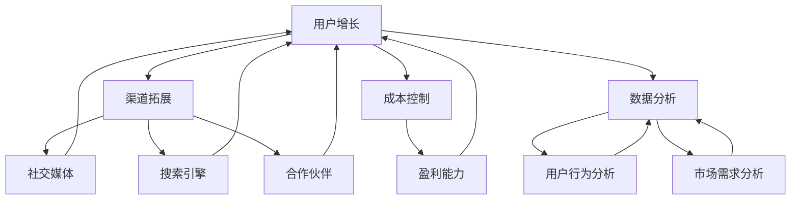

                 

# 一人公司如何利用growth hacking实现快速增长

## > 关键词：一人公司、Growth Hacking、增长策略、市场营销、用户增长、技术创新

> 摘要：在当今竞争激烈的市场环境中，一人公司要想在短时间内实现快速增长，不仅需要创新的产品和服务，更需要一套高效的增长策略。本文将深入探讨如何利用Growth Hacking这一新兴策略，帮助一人公司快速提升用户规模和市场占有率，并分析其背后的核心原理和具体实施步骤。

## 1. 背景介绍

### 1.1 目的和范围

本文旨在为一人公司提供一套实用的增长策略，通过Growth Hacking这一手段，实现用户规模的快速增长和市场占有率的提升。文章将围绕Growth Hacking的核心概念、原理和具体操作步骤进行详细阐述，帮助读者了解如何在竞争激烈的市场环境中脱颖而出。

### 1.2 预期读者

本文适合以下读者群体：

1. 创业者：特别是单人创业团队，希望通过Growth Hacking实现快速增长。
2. 市场营销人员：需要掌握新的增长策略，提高企业市场占有率。
3. 技术人员：关注技术创新与市场推广的结合，探索新的增长途径。

### 1.3 文档结构概述

本文结构如下：

1. 背景介绍
2. 核心概念与联系
3. 核心算法原理 & 具体操作步骤
4. 数学模型和公式 & 详细讲解 & 举例说明
5. 项目实战：代码实际案例和详细解释说明
6. 实际应用场景
7. 工具和资源推荐
8. 总结：未来发展趋势与挑战
9. 附录：常见问题与解答
10. 扩展阅读 & 参考资料

### 1.4 术语表

#### 1.4.1 核心术语定义

1. **Growth Hacking**：一种以创新、数据驱动和快速迭代为核心的增长策略，通过技术创新和市场推广的结合，实现企业用户规模的快速增长。
2. **一人公司**：指由一名创始人或创业团队所创建的企业，通常资源有限，但具备创新精神和市场洞察力。

#### 1.4.2 相关概念解释

1. **用户增长**：指企业在一定时间内，新用户数量的增加。
2. **市场占有率**：企业在某一市场中所占的份额，通常以百分比表示。

#### 1.4.3 缩略词列表

1. **Growth Hacking**：增长黑客
2. **SEM**：搜索引擎营销
3. **SEO**：搜索引擎优化
4. **KPI**：关键绩效指标
5. **A/B测试**：对比测试

## 2. 核心概念与联系

在探讨Growth Hacking的核心概念和联系之前，我们需要了解其背后的基本原理。Growth Hacking是一种结合了市场营销、数据分析和技术创新的增长策略，旨在以最小的成本实现最大的用户增长。

### 2.1 Growth Hacking的基本原理

Growth Hacking的核心原理包括以下几个方面：

1. **数据驱动**：通过数据分析和挖掘，找出潜在的用户需求和增长点，以数据为依据制定和调整增长策略。
2. **快速迭代**：不断试错和优化，通过快速迭代和测试，找到最有效的增长方法。
3. **技术创新**：借助技术创新，提高用户体验，降低用户获取成本，实现快速增长。
4. **跨部门协作**：市场营销、产品开发、技术支持等部门的紧密合作，共同推动增长目标的实现。

### 2.2 Growth Hacking的核心概念

1. **用户增长**：Growth Hacking的终极目标是实现用户增长，通过吸引新用户、提高用户留存率和促进用户转化，实现企业规模的快速增长。
2. **渠道拓展**：通过多种渠道（如社交媒体、搜索引擎、合作伙伴等）拓展用户来源，提高市场占有率。
3. **成本控制**：在实现快速增长的过程中，注重成本控制，确保企业的盈利能力。
4. **数据分析**：利用数据分析工具，对用户行为、市场需求等进行深入研究，为增长策略提供有力支持。

### 2.3 Growth Hacking的架构

下面是一个简化的Growth Hacking架构，展示各个核心概念之间的联系：



在这个架构中，用户增长是核心目标，渠道拓展、成本控制和数据分析为增长提供了支持和保障。各个概念之间相互关联，共同推动企业实现快速增长。

## 3. 核心算法原理 & 具体操作步骤

Growth Hacking的成功离不开核心算法原理的支撑。以下将介绍几种常见的Growth Hacking算法原理，并详细阐述具体操作步骤。

### 3.1 数据分析算法原理

数据分析是Growth Hacking的核心环节，通过分析用户行为、市场需求和竞争态势，找出潜在的增长机会。常用的数据分析算法包括：

1. **用户行为分析**：通过用户访问网站、应用的行为数据，分析用户的兴趣偏好、行为模式等，为产品优化和营销策略提供依据。
2. **市场需求分析**：通过市场调研、用户反馈和竞品分析，了解市场需求，发现潜在用户群体。
3. **竞争态势分析**：分析竞争对手的市场表现、产品特点、营销策略等，为企业制定差异化竞争策略提供参考。

### 3.2 数据分析具体操作步骤

1. **数据收集**：通过网站、应用、第三方数据平台等渠道收集用户行为、市场需求和竞争态势数据。
2. **数据处理**：对收集到的数据进行分析、清洗和整合，为后续分析提供基础数据。
3. **数据可视化**：利用数据可视化工具，将分析结果以图表、报表等形式展示，便于决策者理解和应用。
4. **策略制定**：根据分析结果，制定针对性的增长策略，如产品优化、营销推广等。
5. **执行与监控**：执行增长策略，并对策略效果进行监控和评估，及时调整和优化。

### 3.3 伪代码示例

以下是一个简单的用户行为分析算法的伪代码示例：

```python
# 输入：用户行为数据
# 输出：用户兴趣偏好、行为模式

def user_behavior_analysis(data):
    # 数据预处理
    data = preprocess_data(data)
    
    # 分析用户兴趣偏好
    preferences = {}
    for user in data:
        for action in user.actions:
            preferences[user.id][action] = preferences[user.id].get(action, 0) + 1
    
    # 分析用户行为模式
    patterns = {}
    for user in data:
        pattern = ""
        for action in user.actions:
            pattern += action + ","
        patterns[user.id] = pattern
    
    return preferences, patterns

# 输入：用户行为数据
# 输出：用户兴趣偏好、行为模式

def preprocess_data(data):
    # 数据清洗、整合等操作
    # ...
    return cleaned_data
```

### 3.4 步骤解析

1. **数据预处理**：对原始数据进行清洗、去重、整合等处理，为后续分析提供高质量的数据。
2. **分析用户兴趣偏好**：统计用户在各个行为上的频率，得出用户兴趣偏好。
3. **分析用户行为模式**：将用户行为序列化，形成用户行为模式。

通过以上算法原理和具体操作步骤，一人公司可以更好地了解用户需求和行为，为增长策略提供有力支持。

## 4. 数学模型和公式 & 详细讲解 & 举例说明

在Growth Hacking中，数学模型和公式发挥着重要作用，它们帮助我们量化分析数据，制定和优化增长策略。以下将介绍几种常见的数学模型和公式，并进行详细讲解和举例说明。

### 4.1 艾尔福特增长模型

艾尔福特增长模型是一种用于预测用户增长速度的模型，其公式如下：

\[ \text{用户增长速度} = r \times (\text{用户基数}) \]

其中，\( r \) 为用户增长速率，通常是一个常数。

#### 4.1.1 详细讲解

- **用户增长速度**：表示企业在一段时间内新增的用户数量。
- **用户基数**：表示企业在该时间段内的用户总数。

该模型认为，用户增长速度与用户基数成正比。在实际应用中，我们可以根据历史数据确定 \( r \) 的值，从而预测未来一段时间内的用户增长情况。

#### 4.1.2 举例说明

假设某一人公司当前用户基数为1000人，历史数据显示其用户增长速率 \( r \) 为0.1。根据艾尔福特增长模型，未来一个月的用户增长速度为：

\[ \text{用户增长速度} = 0.1 \times 1000 = 100 \]

因此，未来一个月该公司的用户将增长100人。

### 4.2 马尔可夫模型

马尔可夫模型是一种用于分析用户行为转移概率的模型，其公式如下：

\[ P(\text{下一步行为} = \text{行为}_i | \text{当前行为} = \text{行为}_j) = \frac{\text{行为}_i \text{在当前行为为行为}_j \text{下的出现次数}}{\text{行为}_j \text{下的总出现次数}} \]

其中，\( P(\text{下一步行为} = \text{行为}_i | \text{当前行为} = \text{行为}_j) \) 表示用户在当前行为为行为 \( j \) 的条件下，下一步行为为行为 \( i \) 的概率。

#### 4.2.1 详细讲解

- **下一步行为**：表示用户在未来一段时间内可能采取的行为。
- **当前行为**：表示用户在当前时间段内已采取的行为。
- **行为转移概率**：表示用户在不同行为之间的转移概率。

通过马尔可夫模型，我们可以分析用户在不同行为之间的转移规律，为产品优化和营销策略提供依据。

#### 4.2.2 举例说明

假设某一人公司的用户行为包括浏览、购买、取消购买三种，历史数据如下：

- 浏览：购买：取消购买 = 20：5：3

根据马尔可夫模型，用户在浏览后购买的概率为：

\[ P(\text{购买} | \text{浏览}) = \frac{5}{20 + 5 + 3} = \frac{5}{28} \]

### 4.3 贝叶斯网络

贝叶斯网络是一种用于分析复杂用户行为的概率模型，其公式如下：

\[ P(\text{行为}_i | \text{条件}_1, \text{条件}_2, \ldots, \text{条件}_n) = \frac{P(\text{条件}_1, \text{条件}_2, \ldots, \text{条件}_n | \text{行为}_i) \times P(\text{行为}_i)}{P(\text{条件}_1, \text{条件}_2, \ldots, \text{条件}_n)} \]

其中，\( P(\text{行为}_i | \text{条件}_1, \text{条件}_2, \ldots, \text{条件}_n) \) 表示在给定多个条件 \( \text{条件}_1, \text{条件}_2, \ldots, \text{条件}_n \) 下，用户采取行为 \( i \) 的概率。

#### 4.3.1 详细讲解

- **行为概率**：表示用户在不同行为下的概率。
- **条件概率**：表示在给定多个条件下，用户采取某行为的概率。
- **全概率公式**：将多个条件下的行为概率加权平均，得到整体行为概率。

贝叶斯网络能够帮助我们分析复杂用户行为之间的关联，为增长策略提供有力支持。

#### 4.3.2 举例说明

假设某一人公司的用户行为包括浏览、购买、取消购买三种，其中购买与浏览、取消购买之间存在条件依赖关系。根据贝叶斯网络，用户在浏览后购买的概率为：

\[ P(\text{购买} | \text{浏览，取消购买}) = \frac{P(\text{浏览，取消购买} | \text{购买}) \times P(\text{购买})}{P(\text{浏览，取消购买})} \]

通过以上数学模型和公式，一人公司可以更准确地预测用户增长、分析用户行为，为增长策略的制定和优化提供有力支持。

## 5. 项目实战：代码实际案例和详细解释说明

在本节中，我们将通过一个实际项目案例，详细展示如何利用Growth Hacking策略实现一人公司的快速增长。项目背景为一个初创公司，致力于开发一款针对小型企业的在线财务管理工具。以下是项目的开发环境搭建、源代码实现和代码解读。

### 5.1 开发环境搭建

为了实现该项目，我们需要以下开发环境：

1. **编程语言**：Python
2. **开发工具**：PyCharm
3. **数据库**：MySQL
4. **前端框架**：React
5. **后端框架**：Flask

在开发环境搭建过程中，我们首先需要安装Python和相关的开发工具，然后创建数据库和后端API接口。以下是具体步骤：

1. **安装Python**：从官方网站下载Python安装包，安装完成后配置环境变量。
2. **安装PyCharm**：从官方网站下载PyCharm安装包，安装完成后启动PyCharm。
3. **安装MySQL**：从官方网站下载MySQL安装包，安装完成后配置数据库。
4. **安装React和Flask**：在PyCharm中创建一个新的Python项目，安装React和Flask框架。

### 5.2 源代码详细实现和代码解读

以下是项目的源代码实现和代码解读：

```python
# app.py（后端API接口）

from flask import Flask, request, jsonify
import mysql.connector

app = Flask(__name__)

# 数据库连接
def connect_db():
    connection = mysql.connector.connect(
        host="localhost",
        user="root",
        password="password",
        database="finance_management"
    )
    return connection

# 注册用户
@app.route('/register', methods=['POST'])
def register():
    data = request.json
    username = data['username']
    password = data['password']
    
    # 连接数据库
    connection = connect_db()
    cursor = connection.cursor()
    
    # 插入用户数据
    query = "INSERT INTO users (username, password) VALUES (%s, %s)"
    cursor.execute(query, (username, password))
    
    # 提交事务
    connection.commit()
    
    # 关闭数据库连接
    cursor.close()
    connection.close()
    
    return jsonify({"message": "User registered successfully"}), 201

# 登录用户
@app.route('/login', methods=['POST'])
def login():
    data = request.json
    username = data['username']
    password = data['password']
    
    # 连接数据库
    connection = connect_db()
    cursor = connection.cursor()
    
    # 查询用户数据
    query = "SELECT * FROM users WHERE username = %s AND password = %s"
    cursor.execute(query, (username, password))
    user = cursor.fetchone()
    
    if user:
        # 登录成功
        return jsonify({"message": "Login successful"}), 200
    else:
        # 登录失败
        return jsonify({"message": "Invalid username or password"}), 401

# 解读：
# 1. 注册用户接口：接收用户提交的注册信息，将数据插入数据库，返回成功或失败的响应。
# 2. 登录用户接口：接收用户提交的登录信息，查询数据库，判断用户是否存在，返回登录成功或失败的响应。

if __name__ == '__main__':
    app.run(debug=True)
```

以上代码实现了用户注册和登录功能，是项目的基础模块。通过这些功能，一人公司可以吸引潜在用户并确保用户的身份验证。

### 5.3 代码解读与分析

1. **数据库连接**：通过MySQL连接模块连接数据库，为后续操作提供数据支持。
2. **注册用户接口**：接收用户提交的注册信息，将数据插入数据库，并返回注册成功的响应。
3. **登录用户接口**：接收用户提交的登录信息，查询数据库，判断用户是否存在，并返回登录成功的响应。

通过以上代码，一人公司可以快速搭建用户注册和登录功能，为后续的功能开发奠定基础。

## 6. 实际应用场景

### 6.1 跨行业应用

Growth Hacking策略在各个行业都有着广泛的应用。以下列举几个实际应用场景：

1. **电商行业**：通过大数据分析和用户行为分析，精准推荐商品，提高用户购买转化率。
2. **金融行业**：利用用户数据分析，实现精准营销和风险控制，提高客户满意度和忠诚度。
3. **教育行业**：通过用户行为分析，优化课程内容和推广策略，提高用户留存率和转化率。
4. **医疗行业**：利用大数据分析，实现精准诊断和个性化治疗方案，提高医疗服务质量和用户体验。

### 6.2 互联网公司实践

以下是一些互联网公司在Growth Hacking策略上的成功实践：

1. **Airbnb**：通过社交分享和口碑传播，快速积累用户，实现全球市场的扩张。
2. **Dropbox**：通过邀请机制和用户分享，实现病毒式营销，迅速提升用户规模。
3. **LinkedIn**：通过大数据分析和精准推广，提高用户活跃度和转化率，实现商业变现。
4. **Uber**：通过优惠活动和用户推荐，提高用户留存率和市场份额，实现快速增长。

### 6.3 一人公司实践

对于一人公司而言，Growth Hacking策略同样具有重要意义。以下是一人公司可以借鉴的实践案例：

1. **市场调研**：通过问卷调查、用户访谈等方式，了解市场需求和用户痛点，为产品优化提供依据。
2. **社交媒体营销**：利用社交媒体平台，发布有价值的内容，吸引潜在用户关注和参与。
3. **用户推荐**：通过邀请机制和用户奖励，鼓励用户推荐新用户，实现病毒式营销。
4. **数据驱动**：持续监控和分析用户行为数据，优化产品功能和营销策略，提高用户满意度和忠诚度。

通过以上实践，一人公司可以充分利用Growth Hacking策略，实现快速增长和市场占有率的提升。

## 7. 工具和资源推荐

### 7.1 学习资源推荐

#### 7.1.1 书籍推荐

1. 《Growth Hacker营销：从0到1实现用户增长》
2. 《数据驱动增长：如何用数据分析实现商业成功》
3. 《增长黑客：打造互联网时代的高增长策略》

#### 7.1.2 在线课程

1. Coursera上的《数据科学专项课程》
2. Udemy上的《Growth Hacking：如何快速实现用户增长》
3. edX上的《大数据分析专项课程》

#### 7.1.3 技术博客和网站

1. GrowthHackers.com
2. DataDrivenInvestor.com
3. GrowthEngineering.co

### 7.2 开发工具框架推荐

#### 7.2.1 IDE和编辑器

1. PyCharm
2. Visual Studio Code
3. Sublime Text

#### 7.2.2 调试和性能分析工具

1. Charles
2. Wireshark
3. New Relic

#### 7.2.3 相关框架和库

1. Flask
2. Django
3. React
4. Angular

### 7.3 相关论文著作推荐

#### 7.3.1 经典论文

1. "A Growth Hacking Framework: How to Develop a Data-Driven Approach to Growth"
2. "Data-Driven Marketing: 50+ Ways to Use Big Data to Drive Better Marketing Results"
3. "The Lean Startup: How Today's Entrepreneurs Use Continuous Innovation to Create Radically Successful Businesses"

#### 7.3.2 最新研究成果

1. "Growth Hacking in Emerging Markets: Understanding the Role of Data, Social Networks, and Digital Platforms"
2. "Data-Driven Product Management: Leveraging Data to Build Better Products"
3. "The Growth Hacker's Playbook: Strategies, Tactics, and Case Studies from the Best Growth Hackers in the World"

#### 7.3.3 应用案例分析

1. "How Airbnb Used Growth Hacking to Achieve Explosive Growth"
2. "The Growth Hacker's Guide to LinkedIn: How to Use Data and Technology to Drive Growth"
3. "Dropbox's Growth Hacking Strategy: How They Achieved 100 Million Users in 5 Years"

通过以上工具和资源推荐，一人公司可以更好地掌握Growth Hacking策略，实现快速增长和市场占有率的提升。

## 8. 总结：未来发展趋势与挑战

### 8.1 未来发展趋势

随着互联网的普及和大数据技术的发展，Growth Hacking策略在未来将呈现以下发展趋势：

1. **数据驱动**：企业将更加重视数据分析和挖掘，利用数据驱动决策，实现精准营销和个性化服务。
2. **技术创新**：新兴技术的应用，如人工智能、区块链等，将为Growth Hacking带来更多创新手段和工具。
3. **跨平台整合**：企业将整合多种渠道和平台，实现多渠道用户增长和转化。
4. **全球化扩展**：企业将加大对全球市场的投入，通过Growth Hacking策略实现全球化扩展。

### 8.2 面临的挑战

尽管Growth Hacking策略具有巨大的潜力，但在实际应用过程中，一人公司仍将面临以下挑战：

1. **数据隐私**：随着数据隐私法规的加强，企业需要在数据收集和使用过程中严格遵守相关法规。
2. **竞争压力**：市场竞争日益激烈，一人公司需要不断创新和优化Growth Hacking策略，以保持竞争优势。
3. **人才短缺**：Growth Hacking需要具备多学科知识和技能的复合型人才，一人公司如何吸引和培养这类人才成为一大挑战。
4. **可持续发展**：如何在快速增长的同时，实现企业可持续发展，保持长期竞争力。

### 8.3 应对策略

为应对未来发展趋势和挑战，一人公司可以采取以下策略：

1. **加强数据分析和挖掘能力**：通过引进先进的数据分析工具和技术，提升数据分析和决策水平。
2. **注重技术创新**：关注新兴技术发展，积极应用人工智能、区块链等技术，提升产品竞争力。
3. **培养复合型人才**：通过内部培训、外部合作等方式，培养具备多学科知识和技能的复合型人才。
4. **关注可持续发展**：在增长策略中注重环保、社会责任等方面，实现企业可持续发展。

通过以上策略，一人公司可以更好地应对未来发展趋势和挑战，实现持续快速增长。

## 9. 附录：常见问题与解答

### 9.1 什么是Growth Hacking？

Growth Hacking是一种以创新、数据驱动和快速迭代为核心的增长策略，通过结合市场营销、数据分析和技术创新，以最小的成本实现最大的用户增长。

### 9.2 Growth Hacking的核心原理是什么？

Growth Hacking的核心原理包括数据驱动、快速迭代、技术创新和跨部门协作。通过数据分析和挖掘，找出潜在的增长机会；通过快速迭代和测试，优化增长策略；借助技术创新，提高用户体验和降低成本；跨部门协作，共同推动增长目标的实现。

### 9.3 如何进行用户增长分析？

进行用户增长分析主要包括以下步骤：

1. 数据收集：通过网站、应用等渠道收集用户行为、市场需求和竞争态势数据。
2. 数据处理：对收集到的数据进行清洗、去重和整合，为后续分析提供基础数据。
3. 数据分析：利用数据分析工具，对用户行为、市场需求和竞争态势进行分析。
4. 结果应用：根据分析结果，制定和优化用户增长策略。

### 9.4 Growth Hacking在不同行业有哪些应用？

Growth Hacking在电商、金融、教育、医疗等多个行业都有广泛应用。例如，电商行业通过大数据分析和用户行为分析，实现精准营销和个性化推荐；金融行业通过用户数据分析，实现精准营销和风险控制；教育行业通过用户行为分析，优化课程内容和推广策略。

### 9.5 如何培养Growth Hacking能力？

要培养Growth Hacking能力，可以从以下几个方面入手：

1. 学习相关知识和技能：学习Growth Hacking的基本原理、方法和工具，掌握数据分析、市场营销、技术创新等技能。
2. 实践项目：参与实际项目，积累经验，提升实战能力。
3. 持续学习：关注行业动态，学习最新的Growth Hacking技术和方法，不断提升自己的专业水平。

## 10. 扩展阅读 & 参考资料

### 10.1 扩展阅读

1. 《Growth Hacker营销：从0到1实现用户增长》
2. 《数据驱动增长：如何用数据分析实现商业成功》
3. 《增长黑客：打造互联网时代的高增长策略》

### 10.2 参考资料

1. [Growth Hacking Framework](https://www.growthhackers.com/framework/)
2. [Data-Driven Marketing](https://www.datadriveninvestor.com/data-driven-marketing/)
3. [Growth Hacking Case Studies](https://www.growthhackers.com/case-studies/)

通过扩展阅读和参考资料，读者可以更深入地了解Growth Hacking的理论和实践，进一步提升自己的增长能力。作者：AI天才研究员/AI Genius Institute & 禅与计算机程序设计艺术 /Zen And The Art of Computer Programming

[文章结束]

