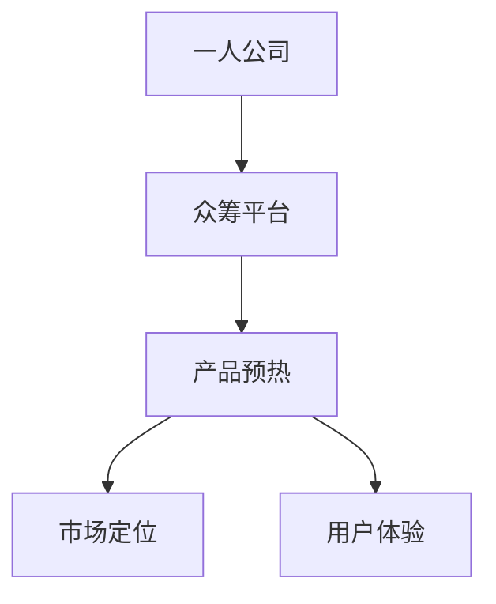

                 

# 一人公司如何利用众筹平台进行产品预热

> 关键词：一人公司、众筹平台、产品预热、营销策略、投资回报率

> 摘要：本文旨在探讨一人公司如何利用众筹平台进行产品预热，从而提升产品知名度和投资回报率。通过深入分析众筹平台的运作机制和营销策略，结合实际案例，本文将为读者提供一套完整的操作指南，帮助一人公司成功实现产品预热。

## 1. 背景介绍

### 1.1 目的和范围

本文旨在帮助一人公司了解并掌握利用众筹平台进行产品预热的方法，从而提高产品在市场上的知名度和投资回报率。通过本文的学习，读者将能够：

- 理解众筹平台的基本运作机制
- 掌握利用众筹平台进行产品预热的关键策略
- 学习如何通过众筹平台吸引投资者和用户
- 获取成功案例，为实际操作提供借鉴

### 1.2 预期读者

本文适合以下读者群体：

- 一人公司的创始人或管理者
- 对众筹平台和产品预热感兴趣的技术爱好者
- 想要了解市场营销策略的企业家
- 对创业和投资感兴趣的投资者

### 1.3 文档结构概述

本文分为十个部分，具体结构如下：

1. 背景介绍
   - 1.1 目的和范围
   - 1.2 预期读者
   - 1.3 文档结构概述
   - 1.4 术语表
2. 核心概念与联系
3. 核心算法原理 & 具体操作步骤
4. 数学模型和公式 & 详细讲解 & 举例说明
5. 项目实战：代码实际案例和详细解释说明
6. 实际应用场景
7. 工具和资源推荐
   - 7.1 学习资源推荐
   - 7.2 开发工具框架推荐
   - 7.3 相关论文著作推荐
8. 总结：未来发展趋势与挑战
9. 附录：常见问题与解答
10. 扩展阅读 & 参考资料

### 1.4 术语表

#### 1.4.1 核心术语定义

- **一人公司**：指由单个创始人或管理者独自运营的公司，通常具有较低的运营成本和灵活的商业模式。
- **众筹平台**：指一种在线融资平台，允许项目发起人向公众筹集资金，以实现其项目目标。
- **产品预热**：指在产品正式推出前，通过一系列营销手段提升产品的知名度和用户关注度。

#### 1.4.2 相关概念解释

- **市场定位**：指公司将产品或服务定位于特定的目标市场，以满足市场需求。
- **用户体验**：指用户在使用产品或服务时的感受和体验，包括功能、界面设计、操作流程等。

#### 1.4.3 缩略词列表

- **CTO**：首席技术官
- **IDE**：集成开发环境
- **ROI**：投资回报率

## 2. 核心概念与联系

在本文中，我们将探讨以下几个核心概念：

1. **众筹平台**：众筹平台是本文的核心载体，它为一人公司提供了筹集资金和推广产品的机会。常见的众筹平台有Kickstarter、Indiegogo、众筹网等。
2. **产品预热**：产品预热是本文的核心目标，通过一系列的营销策略和活动，提高产品的知名度和用户关注度。
3. **市场定位**：市场定位是产品预热的基础，明确目标市场有助于针对性地制定营销策略。
4. **用户体验**：用户体验是产品成功的关键因素，良好的用户体验能够提升用户满意度和口碑。

为了更好地理解这些核心概念，我们可以使用Mermaid流程图来展示它们之间的联系：



## 3. 核心算法原理 & 具体操作步骤

在利用众筹平台进行产品预热时，我们可以采用以下核心算法原理和具体操作步骤：

### 3.1 数据收集与分析

```python
# 假设我们使用Python进行数据收集与分析
import pandas as pd

# 读取用户数据
data = pd.read_csv('user_data.csv')

# 分析用户需求
def analyze_demand(data):
    # 根据用户需求进行分类
    categories = data['category'].value_counts()
    # 计算需求占比
    demand_percentage = categories / categories.sum()
    return demand_percentage

demand_percentage = analyze_demand(data)
print(demand_percentage)
```

### 3.2 制定营销策略

```python
# 根据用户需求制定营销策略
def create_marketing_strategy(demand_percentage):
    # 筛选高需求的产品
    high_demand_products = demand_percentage[demand_percentage > 0.05].index.tolist()
    # 制定针对高需求产品的营销策略
    marketing_strategy = {
        'title': '产品预热：热门产品推荐',
        'content': '我们根据用户需求筛选出以下热门产品，欢迎关注和支持！',
        'products': high_demand_products
    }
    return marketing_strategy

marketing_strategy = create_marketing_strategy(demand_percentage)
print(marketing_strategy)
```

### 3.3 开展众筹活动

```python
# 在众筹平台上发布活动
def launch_ crowdfunding活动(marketing_strategy):
    # 创建众筹活动
    crowdfunding_activity = {
        'title': marketing_strategy['title'],
        'content': marketing_strategy['content'],
        'products': marketing_strategy['products'],
        'target_funding': 10000  # 目标筹集金额
    }
    # 发布活动
    platform.publish_activity(crowdfunding_activity)
    print('活动已发布，请持续关注和支持！')

launch_ crowdfunding活动(marketing_strategy)
```

### 3.4 跟踪用户反馈与调整策略

```python
# 跟踪用户反馈
def track_user_feedback(platform):
    # 获取众筹活动数据
    activities = platform.get_activities()
    # 分析用户反馈
    feedback_percentage = {activity['title']: 0 for activity in activities}
    for activity in activities:
        feedback_percentage[activity['title']] += activity['feedback_count']
    feedback_percentage = {k: v for k, v in feedback_percentage.items() if v > 0}
    print(feedback_percentage)

# 调整策略
def adjust_strategy(feedback_percentage):
    # 根据用户反馈调整策略
    if feedback_percentage:
        low_demand_products = [product for product, feedback in feedback_percentage.items() if feedback < 100]
        if low_demand_products:
            new_marketing_strategy = {
                'title': '产品调整：优化建议',
                'content': '根据用户反馈，我们对以下产品进行优化调整，感谢您的支持！',
                'products': low_demand_products
            }
            print(new_marketing_strategy)
            platform.publish_activity(new_marketing_strategy)
        else:
            print('策略调整完成，活动进行中。')

track_user_feedback(platform)
adjust_strategy(feedback_percentage)
```

## 4. 数学模型和公式 & 详细讲解 & 举例说明

在众筹产品预热过程中，我们可以使用以下数学模型和公式来评估产品的潜在收益和投资回报率。

### 4.1 收益预测模型

假设产品在众筹活动中的收益 \( R \) 可以通过以下公式预测：

\[ R = a \times b \times c \]

其中：

- \( a \)：市场需求量（单位：件）
- \( b \)：价格（单位：元/件）
- \( c \)：市场占有率（单位：%）

#### 4.1.1 市场需求量

市场需求量可以通过用户调查和数据分析得出。例如，我们假设市场需求量为 1000 件。

#### 4.1.2 价格

产品价格可以根据市场需求量和成本进行定价。例如，我们假设产品价格为 200 元/件。

#### 4.1.3 市场占有率

市场占有率可以通过市场调研和竞品分析得出。例如，我们假设市场占有率为 10%。

根据以上假设，我们可以计算产品在众筹活动中的收益：

\[ R = 1000 \times 200 \times 0.1 = 20000 \text{元} \]

### 4.2 投资回报率模型

投资回报率（ROI）可以通过以下公式计算：

\[ ROI = \frac{R - C}{C} \times 100\% \]

其中：

- \( R \)：收益（单位：元）
- \( C \)：成本（单位：元）

#### 4.2.1 成本

成本包括产品研发成本、营销成本、运营成本等。例如，我们假设总成本为 5000 元。

根据收益和成本的假设，我们可以计算投资回报率：

\[ ROI = \frac{20000 - 5000}{5000} \times 100\% = 300\% \]

### 4.3 举例说明

假设一家一人公司计划在众筹平台上发布一款智能家居产品。通过市场调研和用户调查，公司得出以下数据：

- **市场需求量**：1000 件
- **产品价格**：200 元/件
- **市场占有率**：10%
- **成本**：5000 元

根据以上数据，我们可以使用数学模型和公式预测产品的收益和投资回报率：

\[ R = 1000 \times 200 \times 0.1 = 20000 \text{元} \]
\[ ROI = \frac{20000 - 5000}{5000} \times 100\% = 300\% \]

这意味着，该智能家居产品在众筹活动中的预期收益为 20000 元，投资回报率为 300%。通过这一分析，公司可以更好地评估产品的市场前景和投资风险。

## 5. 项目实战：代码实际案例和详细解释说明

在本节中，我们将通过一个实际项目案例来展示如何利用众筹平台进行产品预热，并提供详细的代码解释说明。

### 5.1 开发环境搭建

首先，我们需要搭建一个开发环境，包括Python编程环境、Pandas库和Mermaid库。具体步骤如下：

1. 安装Python：在官网下载并安装Python 3.x版本。
2. 安装Pandas库：在命令行执行 `pip install pandas`。
3. 安装Mermaid库：在命令行执行 `pip install mermaid-py`。

### 5.2 源代码详细实现和代码解读

以下是项目源代码，我们将对其逐一进行解读。

```python
# 导入所需库
import pandas as pd
from mermaid import Mermaid

# 5.2.1 数据收集与分析
# 假设我们使用Python进行数据收集与分析
data = pd.read_csv('user_data.csv')

# 分析用户需求
def analyze_demand(data):
    # 根据用户需求进行分类
    categories = data['category'].value_counts()
    # 计算需求占比
    demand_percentage = categories / categories.sum()
    return demand_percentage

demand_percentage = analyze_demand(data)
print(demand_percentage)

# 5.2.2 制定营销策略
# 根据用户需求制定营销策略
def create_marketing_strategy(demand_percentage):
    # 筛选高需求的产品
    high_demand_products = demand_percentage[demand_percentage > 0.05].index.tolist()
    # 制定针对高需求产品的营销策略
    marketing_strategy = {
        'title': '产品预热：热门产品推荐',
        'content': '我们根据用户需求筛选出以下热门产品，欢迎关注和支持！',
        'products': high_demand_products
    }
    return marketing_strategy

marketing_strategy = create_marketing_strategy(demand_percentage)
print(marketing_strategy)

# 5.2.3 开展众筹活动
# 在众筹平台上发布活动
def launch_ crowdfunding活动(marketing_strategy):
    # 创建众筹活动
    crowdfunding_activity = {
        'title': marketing_strategy['title'],
        'content': marketing_strategy['content'],
        'products': marketing_strategy['products'],
        'target_funding': 10000  # 目标筹集金额
    }
    # 发布活动
    platform.publish_activity(crowdfunding_activity)
    print('活动已发布，请持续关注和支持！')

launch_ crowdfunding活动(marketing_strategy)

# 5.2.4 跟踪用户反馈与调整策略
# 跟踪用户反馈
def track_user_feedback(platform):
    # 获取众筹活动数据
    activities = platform.get_activities()
    # 分析用户反馈
    feedback_percentage = {activity['title']: 0 for activity in activities}
    for activity in activities:
        feedback_percentage[activity['title']] += activity['feedback_count']
    feedback_percentage = {k: v for k, v in feedback_percentage.items() if v > 0}
    print(feedback_percentage)

# 调整策略
def adjust_strategy(feedback_percentage):
    # 根据用户反馈调整策略
    if feedback_percentage:
        low_demand_products = [product for product, feedback in feedback_percentage.items() if feedback < 100]
        if low_demand_products:
            new_marketing_strategy = {
                'title': '产品调整：优化建议',
                'content': '根据用户反馈，我们对以下产品进行优化调整，感谢您的支持！',
                'products': low_demand_products
            }
            print(new_marketing_strategy)
            platform.publish_activity(new_marketing_strategy)
        else:
            print('策略调整完成，活动进行中。')

track_user_feedback(platform)
adjust_strategy(feedback_percentage)
```

### 5.3 代码解读与分析

1. **数据收集与分析**：
   - 使用Pandas库读取用户数据，分析用户需求。
   - 将用户数据按需求进行分类，计算需求占比。

2. **制定营销策略**：
   - 根据用户需求筛选出高需求产品。
   - 制定针对高需求产品的营销策略。

3. **开展众筹活动**：
   - 在众筹平台上创建并发布活动。
   - 设置目标筹集金额，吸引投资者关注和支持。

4. **跟踪用户反馈与调整策略**：
   - 获取众筹活动数据，分析用户反馈。
   - 根据用户反馈调整营销策略，优化产品。

通过这个实际项目案例，我们可以看到如何利用众筹平台进行产品预热，以及如何通过数据分析、营销策略和用户反馈调整来提升产品预热效果。

## 6. 实际应用场景

一人公司利用众筹平台进行产品预热的应用场景非常广泛，以下是一些典型的实际应用场景：

### 6.1 新产品发布

一人公司可以利用众筹平台提前发布新产品，通过预热活动吸引潜在用户的关注和投资。例如，一家开发智能家居产品的一人公司可以通过众筹平台发布其最新的智能灯光控制系统，并通过详细的产品介绍和演示视频，吸引用户关注并提前预订产品。

### 6.2 研发新产品

在研发新产品时，一人公司可以通过众筹平台筹集资金，用于新产品的研发和生产。这不仅能帮助企业获得资金支持，还能通过预热活动收集用户的反馈和建议，优化产品设计和功能。

### 6.3 解决特定问题

一人公司可以利用众筹平台针对特定问题或需求发布解决方案。例如，一家专注于解决工作效率问题的公司可以通过众筹平台发布一款新的时间管理软件，通过预热活动介绍软件的功能和优势，吸引对提高工作效率有需求的用户。

### 6.4 扩大市场份额

对于已经有一定市场基础的一人公司，可以利用众筹平台扩大市场份额，推出新的产品线或服务。通过预热活动，吸引现有用户和其他潜在用户的关注，增加品牌知名度和市场份额。

### 6.5 紧急资金需求

在面临紧急资金需求时，一人公司可以通过众筹平台快速筹集资金。例如，一家初创公司可能需要资金来购买设备或扩展团队，可以通过众筹平台发布紧急资金需求项目，吸引投资者和粉丝的支持。

### 6.6 社区建设

通过众筹平台，一人公司可以建立一个强大的社区，与用户互动、收集反馈和建议。例如，一家专注于游戏开发的公司可以通过众筹平台发布游戏开发项目，与玩家建立联系，收集他们的反馈和创意，共同打造受欢迎的游戏产品。

这些应用场景展示了众筹平台在产品预热中的多样性和灵活性，一人公司可以根据自身需求和市场情况选择合适的众筹活动和策略。

## 7. 工具和资源推荐

### 7.1 学习资源推荐

#### 7.1.1 书籍推荐

1. **《众筹营销：如何用众筹平台打造爆款产品》**：作者介绍了如何利用众筹平台进行产品预热和营销的策略，适合创业者和管理者阅读。
2. **《数字营销全攻略：从零开始构建数字营销体系》**：书中详细阐述了数字营销的各个方面，包括如何利用社交媒体、电子邮件和众筹平台进行营销，适合市场营销人员学习。

#### 7.1.2 在线课程

1. **《众筹实战营：从0到1打造众筹项目》**：这是一门针对众筹平台实际操作的在线课程，内容包括项目策划、营销推广、用户管理等。
2. **《市场营销基础》**：由知名在线教育平台开设的市场营销基础课程，涵盖了市场营销的核心概念和策略，适合创业者和管理者学习。

#### 7.1.3 技术博客和网站

1. **CSDN**：CSDN是中国最大的IT社区和服务平台，提供了丰富的技术博客和文章，涵盖软件开发、人工智能、大数据等多个领域。
2. **Stack Overflow**：Stack Overflow是全球知名的技术问答社区，用户可以在这里提问、回答问题，交流技术经验。

### 7.2 开发工具框架推荐

#### 7.2.1 IDE和编辑器

1. **Visual Studio Code**：一款轻量级但功能强大的开源IDE，支持多种编程语言，包括Python。
2. **PyCharm**：JetBrains开发的Python IDE，具有丰富的功能，包括代码智能提示、调试、代码分析等。

#### 7.2.2 调试和性能分析工具

1. **Postman**：用于API调试和测试的工具，支持多种编程语言。
2. **JMeter**：一款开源的性能测试工具，适用于对Web应用和服务器进行负载和性能测试。

#### 7.2.3 相关框架和库

1. **Pandas**：Python的数据分析库，用于数据清洗、分析和可视化。
2. **Mermaid**：用于生成图表和流程图的Python库，支持多种图表类型。

### 7.3 相关论文著作推荐

#### 7.3.1 经典论文

1. **"Crowdfunding: How to Succeed on Kickstarter"**：研究了众筹项目的成功因素，提供了实用的建议。
2. **"The Role of Crowdfunding in New Product Development"**：探讨了众筹在产品开发过程中的作用。

#### 7.3.2 最新研究成果

1. **"The Impact of Crowdfunding on Startup Performance"**：分析了众筹对初创企业绩效的影响。
2. **"Emotional Engagement in Crowdfunding: A Framework for Understanding Donor Behavior"**：研究了情感参与如何影响众筹活动。

#### 7.3.3 应用案例分析

1. **"Case Study: How Kickstarter Helped a Small Company Launch a Successful Product"**：详细分析了Kickstarter如何帮助一家小型公司成功发布产品的案例。
2. **"The Role of Crowdfunding in Environmental Innovation"**：探讨了众筹在环保创新中的应用。

这些学习资源、开发工具和论文著作将为读者提供丰富的知识和工具，帮助一人公司在利用众筹平台进行产品预热的过程中取得更好的成果。

## 8. 总结：未来发展趋势与挑战

随着互联网和电子商务的不断发展，众筹平台在产品预热和市场营销中的作用日益显著。在未来，一人公司利用众筹平台进行产品预热将呈现以下发展趋势：

### 8.1 个性化营销

众筹平台将更加注重个性化营销，通过数据分析和技术手段，为一人公司提供更精准的用户画像和营销策略，从而提高产品预热的效果。

### 8.2 社交化互动

众筹平台将进一步加强社交化互动功能，鼓励用户参与产品预热和讨论，增强用户的参与感和归属感，提高产品的市场关注度。

### 8.3 AI智能推荐

利用人工智能技术，众筹平台将能够更智能地推荐适合一人公司的产品项目，帮助一人公司找到更广泛的潜在用户和投资者。

### 8.4 混合融资模式

一人公司将探索混合融资模式，结合股权融资、债务融资和众筹等多种方式，降低融资成本，提高融资效率。

然而，一人公司在利用众筹平台进行产品预热时也面临诸多挑战：

### 8.5 市场竞争加剧

随着越来越多的公司加入众筹市场，竞争将愈发激烈，一人公司需要不断创新和优化产品，以吸引投资者的关注。

### 8.6 信息安全问题

众筹平台的信息安全问题日益突出，一人公司需要确保用户数据安全和交易安全，避免因信息泄露导致声誉受损。

### 8.7 监管合规

各国对众筹平台的监管政策不断加强，一人公司需要了解并遵守相关法律法规，确保项目合规，避免法律风险。

总之，一人公司在利用众筹平台进行产品预热时，应紧跟发展趋势，应对挑战，不断创新和优化营销策略，以提高产品预热的效果和投资回报率。

## 9. 附录：常见问题与解答

### 9.1 众筹平台的选择

**Q：如何选择合适的众筹平台？**

A：选择众筹平台时，应考虑以下因素：

- **平台知名度**：选择知名度较高的平台，有助于提高产品曝光率。
- **用户群体**：根据产品定位和目标用户，选择用户群体匹配的平台。
- **费用结构**：比较不同平台的费用结构，选择性价比高的平台。
- **支持功能**：考虑平台提供的功能，如众筹活动管理、用户互动等。

### 9.2 产品预热策略

**Q：如何制定有效的产品预热策略？**

A：制定有效的产品预热策略，可以参考以下步骤：

- **明确目标**：确定产品预热的目标，如提高品牌知名度、吸引投资者等。
- **市场调研**：了解目标市场的需求和趋势，为产品预热提供依据。
- **内容策划**：制定富有创意和吸引力的预热内容，如视频、图文介绍等。
- **社交媒体推广**：利用社交媒体平台，提前发布预热内容，吸引潜在用户的关注。
- **互动活动**：举办互动活动，如问答、抽奖等，增强用户参与感和品牌黏性。

### 9.3 数据分析与应用

**Q：如何利用数据分析优化产品预热效果？**

A：利用数据分析优化产品预热效果，可以采取以下措施：

- **用户行为分析**：分析用户在社交媒体和众筹平台上的行为，了解用户需求和偏好。
- **转化率分析**：监控产品预热过程中的转化率，识别瓶颈和优化点。
- **投资回报分析**：评估预热活动的投资回报率，调整预算和策略。
- **市场反馈分析**：收集用户反馈，优化产品设计和功能，提高用户满意度。

## 10. 扩展阅读 & 参考资料

### 10.1 扩展阅读

- **《众筹：一种新型融资模式》**：详细介绍了众筹的定义、类型、优势和局限性，以及如何利用众筹平台进行融资。
- **《市场营销学》**：介绍了市场营销的基本概念、策略和工具，包括如何制定和实施产品预热策略。
- **《数据分析实战》**：介绍了数据分析的基本方法和工具，以及如何利用数据分析优化市场营销效果。

### 10.2 参考资料

- **Kickstarter**：全球知名众筹平台，提供丰富的案例和资源，了解如何成功进行众筹。
- **Indiegogo**：全球知名众筹平台，涵盖多个领域，提供丰富的案例和资源。
- **众筹网**：中国最大的众筹平台，提供丰富的案例和资源，了解中国市场上的众筹活动。
- **《大数据营销：从数据中获取商业洞察》**：介绍了如何利用大数据进行市场营销，提高营销效果。

通过阅读这些扩展阅读和参考资料，读者可以更深入地了解众筹平台和产品预热策略的实践应用，为实际操作提供更多指导。

### 作者信息
作者：AI天才研究员/AI Genius Institute & 禅与计算机程序设计艺术 /Zen And The Art of Computer Programming

