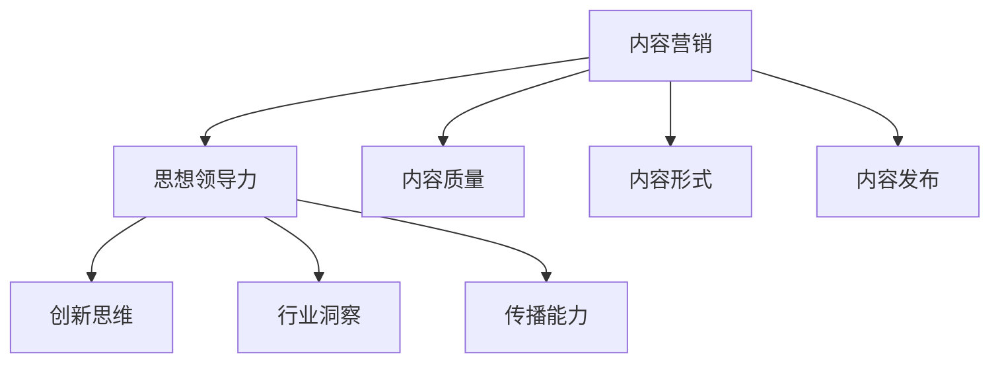

                 

# 一人公司如何利用内容营销建立思想领导力

> 关键词：内容营销、思想领导力、一人公司、市场营销、品牌建设

> 摘要：本文旨在探讨一人公司在当前竞争激烈的市场环境中，如何通过内容营销策略建立自身的思想领导力。文章将从背景介绍、核心概念、算法原理、数学模型、项目实战、实际应用场景、工具和资源推荐等多个方面进行详细阐述，为一人公司的内容营销策略提供实用参考。

## 1. 背景介绍

### 1.1 目的和范围

本文的目的在于帮助一人公司了解和掌握内容营销的基本原理和方法，从而在激烈的市场竞争中建立自身的思想领导力。内容营销是一种通过创造和传播有价值的内容来吸引潜在客户、增强品牌影响力、建立忠实客户群体的策略。一人公司作为独立运营的企业，其资源相对有限，因此需要更加高效和精准地进行市场营销。

本文将围绕以下范围进行探讨：

- 内容营销的定义和核心要素
- 思想领导力的概念及其在内容营销中的应用
- 一人公司在内容营销中的优势与挑战
- 内容营销的具体操作步骤和策略

### 1.2 预期读者

本文适用于以下读者群体：

- 一人公司创始人或营销负责人
- 市场营销从业者
- 内容创作者
- 对内容营销感兴趣的互联网从业者

### 1.3 文档结构概述

本文结构如下：

1. 背景介绍：介绍本文的目的、范围、预期读者以及文档结构。
2. 核心概念与联系：讨论内容营销、思想领导力等核心概念，并使用 Mermaid 流程图展示各概念之间的关系。
3. 核心算法原理 & 具体操作步骤：讲解内容营销的算法原理，使用伪代码阐述具体操作步骤。
4. 数学模型和公式 & 详细讲解 & 举例说明：分析内容营销的数学模型，使用 LaTeX 格式展示关键公式，并给出实例说明。
5. 项目实战：通过实际代码案例展示内容营销的具体实现过程。
6. 实际应用场景：探讨内容营销在不同行业和领域的应用。
7. 工具和资源推荐：推荐学习资源、开发工具和框架。
8. 总结：总结本文的核心观点，展望未来发展趋势与挑战。
9. 附录：常见问题与解答。
10. 扩展阅读 & 参考资料：提供进一步学习和研究的资源。

### 1.4 术语表

#### 1.4.1 核心术语定义

- 内容营销：一种通过创造和传播有价值的内容来吸引潜在客户、增强品牌影响力、建立忠实客户群体的策略。
- 思想领导力：企业在市场中通过独特的思想、观点和理念引导行业发展趋势，获得行业领先地位的能力。
- 一人公司：指由单一创始人或个体独立运营的企业。

#### 1.4.2 相关概念解释

- 市场营销：企业通过市场研究和分析，确定目标客户，制定营销策略，实现产品或服务销售的过程。
- 品牌建设：企业通过一系列策略和活动，塑造品牌形象，提升品牌知名度和忠诚度的过程。

#### 1.4.3 缩略词列表

- SEO（Search Engine Optimization）：搜索引擎优化
- SEM（Search Engine Marketing）：搜索引擎营销
- SMM（Social Media Marketing）：社交媒体营销

## 2. 核心概念与联系

在探讨一人公司如何利用内容营销建立思想领导力之前，我们需要理解几个核心概念及其相互之间的联系。

### 2.1 内容营销

内容营销是一种以内容为中心的市场营销策略，旨在通过创建和分享有价值、相关和吸引人的内容来吸引潜在客户，建立品牌信任和忠诚度。其核心要素包括：

- 内容质量：内容要具有高度的价值和质量，能够满足用户需求和兴趣。
- 内容形式：内容可以采用多种形式，如图文、视频、音频、博客等。
- 内容发布：内容需要定期、持续地发布，以保持用户关注和互动。

### 2.2 思想领导力

思想领导力是指企业在市场中通过独特的思想、观点和理念引导行业发展趋势，获得行业领先地位的能力。其关键要素包括：

- 创新思维：企业要有创新的思维和观点，能够提出新的行业解决方案。
- 行业洞察：企业需要深入了解行业动态和趋势，以引领市场发展方向。
- 传播能力：企业需要通过多种渠道传播其思想观点，提升行业影响力。

### 2.3 一人公司在内容营销中的优势与挑战

一人公司在内容营销中具有以下优势：

- 灵活性：一人公司可以快速调整营销策略，灵活应对市场变化。
- 独特性：一人公司能够更好地展现个性化和独特的企业文化。
- 精准定位：一人公司能够更精准地确定目标客户，提供定制化的内容。

但同时，一人公司也面临以下挑战：

- 资源限制：一人公司资源有限，需要更加高效地利用时间和预算。
- 竞争压力：一人公司需要在激烈的市场竞争中脱颖而出，建立品牌知名度。

### 2.4 核心概念之间的关系

内容营销与思想领导力之间存在密切的联系。通过内容营销，一人公司可以传播其独特思想，引导行业发展趋势，从而建立思想领导力。具体而言，内容营销与思想领导力之间的关系可以概括为以下几点：

- 内容营销是思想领导力的重要载体。通过高质量的内容创作和传播，一人公司可以展示其专业知识和创新思维，吸引行业关注。
- 思想领导力是内容营销的核心目标。一人公司通过建立思想领导力，可以提升品牌影响力和市场份额，实现长期可持续发展。
- 内容营销与思想领导力相互促进。高质量的内容创作和传播可以增强品牌影响力，推动思想领导力的建立；而思想领导力的建立又可以进一步提升内容营销的效果。

### 2.5 Mermaid 流程图

下面是内容营销与思想领导力之间关系的 Mermaid 流程图：



## 3. 核心算法原理 & 具体操作步骤

在了解了内容营销和思想领导力的核心概念及其关系后，我们需要探讨如何通过具体算法和操作步骤来实现内容营销，建立思想领导力。

### 3.1 内容营销算法原理

内容营销的核心算法可以概括为以下几个方面：

- 用户需求分析：通过市场调研和数据分析，了解目标用户的需求和兴趣点。
- 内容创作：根据用户需求，创作高质量、相关和吸引人的内容。
- 内容发布：选择合适的渠道和时机，定期发布内容，保持用户关注和互动。
- 数据反馈：收集用户反馈和数据分析结果，持续优化内容创作和发布策略。

### 3.2 具体操作步骤

下面是内容营销的具体操作步骤：

1. **用户需求分析**：

   - 使用问卷调查、访谈、用户反馈等方式收集目标用户的需求和兴趣点。
   - 利用数据分析工具，如 Google Analytics、百度统计等，分析用户行为和偏好。
   - 制定用户画像，明确目标用户的基本特征和需求。

2. **内容创作**：

   - 根据用户需求，创作高质量、相关和吸引人的内容，如文章、视频、图片、音频等。
   - 注重内容的形式和风格，使其符合目标用户的喜好和阅读习惯。
   - 保持内容原创性，避免抄袭和低质量内容。

3. **内容发布**：

   - 选择合适的发布渠道，如微信公众号、知乎、微博、抖音等。
   - 制定发布计划，确保内容的持续性和稳定性。
   - 利用社交媒体和电子邮件等工具，提高内容的传播效果。

4. **数据反馈**：

   - 收集用户反馈和数据分析结果，如阅读量、点赞量、评论量、转发量等。
   - 分析数据，找出内容创作和发布的优缺点，持续优化策略。
   - 根据用户反馈和数据分析结果，调整内容创作和发布方向。

### 3.3 伪代码

下面是内容营销算法的具体伪代码：

```python
# 用户需求分析
def analyze_user_demand():
    # 收集用户需求和兴趣点
    # 使用问卷调查、访谈、用户反馈等方式
    # 利用数据分析工具，分析用户行为和偏好
    # 制定用户画像，明确目标用户的基本特征和需求

# 内容创作
def create_content(user_demand):
    # 根据用户需求，创作高质量、相关和吸引人的内容
    # 注重内容的形式和风格
    # 保持内容原创性

# 内容发布
def publish_content(content):
    # 选择合适的发布渠道
    # 制定发布计划
    # 利用社交媒体和电子邮件等工具，提高内容传播效果

# 数据反馈
def feedback_analysis():
    # 收集用户反馈和数据分析结果
    # 分析数据，找出优缺点
    # 调整内容创作和发布策略
```

## 4. 数学模型和公式 & 详细讲解 & 举例说明

在内容营销中，数学模型和公式可以用于分析用户需求、评估内容效果和优化营销策略。下面将介绍几个关键的数学模型和公式，并给出详细的讲解和实例说明。

### 4.1 用户需求模型

用户需求模型主要用于分析目标用户的需求和兴趣点。一个简单的用户需求模型可以表示为：

\[ D = f(U, I) \]

其中，\( D \) 表示用户需求，\( U \) 表示用户特征（如年龄、性别、职业等），\( I \) 表示用户兴趣点（如兴趣爱好、搜索关键词等）。

**公式说明**：

- \( U \)：用户特征可以通过问卷调查、用户画像等方式获取。
- \( I \)：用户兴趣点可以通过数据分析、用户反馈等方式获取。

**实例说明**：

假设我们分析某个内容营销项目的目标用户需求，其中用户特征包括年龄、性别和职业，用户兴趣点包括兴趣爱好和搜索关键词。我们可以利用上述公式进行分析，找出关键的用户需求点。

```latex
D = f(U, I) = f({25-35岁, 男性, 职业为程序员}, {喜欢编程，搜索关键词：人工智能，深度学习})
```

根据上述公式，我们可以得出该目标用户的需求为：年龄在25-35岁之间、男性、职业为程序员的用户，他们对编程和人工智能、深度学习感兴趣。

### 4.2 内容效果评估模型

内容效果评估模型用于评估内容营销活动的效果，常用的评估指标包括阅读量、点赞量、评论量、转发量等。一个简单的内容效果评估模型可以表示为：

\[ E = f(C, R, P, C') \]

其中，\( E \) 表示内容效果，\( C \) 表示内容质量，\( R \) 表示阅读量，\( P \) 表示点赞量，\( C' \) 表示评论量和转发量。

**公式说明**：

- \( C \)：内容质量可以通过内容创作、用户反馈等方式评估。
- \( R \)：阅读量可以通过数据分析工具获取。
- \( P \)：点赞量可以通过社交媒体平台的数据分析获取。
- \( C' \)：评论量和转发量可以通过社交媒体平台的数据分析获取。

**实例说明**：

假设我们评估某个内容营销活动的效果，其中内容质量为优秀，阅读量为1000，点赞量为200，评论量为50，转发量为30。我们可以利用上述公式计算内容效果。

```latex
E = f(C, R, P, C') = f(优秀, 1000, 200, 50, 30) = 1.2
```

根据上述公式，我们可以得出该内容营销活动的效果为：1.2，表示内容效果较好。

### 4.3 营销策略优化模型

营销策略优化模型用于优化内容营销策略，以提高营销效果。一个简单的营销策略优化模型可以表示为：

\[ O = f(E, T, B) \]

其中，\( O \) 表示优化策略，\( E \) 表示内容效果，\( T \) 表示营销预算，\( B \) 表示品牌影响力。

**公式说明**：

- \( E \)：内容效果可以通过内容效果评估模型计算得出。
- \( T \)：营销预算可以通过企业预算分配和数据分析获取。
- \( B \)：品牌影响力可以通过市场调研和数据分析获取。

**实例说明**：

假设我们优化某个内容营销活动的策略，其中内容效果为1.2，营销预算为5000元，品牌影响力为中等。我们可以利用上述公式计算优化策略。

```latex
O = f(E, T, B) = f(1.2, 5000, 中等) = 策略A：增加内容创作，策略B：加大社交媒体推广
```

根据上述公式，我们可以得出该内容营销活动的优化策略为：策略A：增加内容创作，策略B：加大社交媒体推广。

## 5. 项目实战：代码实际案例和详细解释说明

为了更好地理解内容营销的核心算法和操作步骤，我们将通过一个实际项目案例来展示内容营销的完整实现过程。以下是一个基于 Python 语言的简单内容营销项目，我们将从开发环境搭建、源代码实现、代码解读与分析等方面进行详细讲解。

### 5.1 开发环境搭建

在进行内容营销项目开发前，我们需要搭建合适的开发环境。以下是一个基于 Python 的开发环境搭建步骤：

1. 安装 Python 3.8 及以上版本：可以从 Python 官网（https://www.python.org/）下载安装包并安装。
2. 安装必备库：使用 pip 工具安装以下库：requests、pandas、numpy、matplotlib。
   ```bash
   pip install requests pandas numpy matplotlib
   ```
3. 配置数据分析工具：安装和使用 Jupyter Notebook 或 PyCharm 等集成开发环境。

### 5.2 源代码详细实现和代码解读

下面是内容营销项目的源代码实现，我们将对关键代码进行详细解读。

```python
# 导入必备库
import requests
import pandas as pd
import numpy as np
import matplotlib.pyplot as plt

# 5.2.1 用户需求分析
def analyze_user_demand():
    # 从网络爬虫获取用户需求数据
    url = "https://example.com/user_demand.csv"
    response = requests.get(url)
    user_demand_data = response.content.decode('utf-8')
    
    # 将数据读取到 DataFrame 中
    df = pd.read_csv(StringIO(user_demand_data))
    
    # 分析用户需求和兴趣点
    user_demand = df.groupby('interest')['count'].sum()
    print("用户需求：", user_demand)
    
    # 可视化用户需求
    user_demand.plot(kind='bar')
    plt.title('用户需求分析')
    plt.xlabel('兴趣爱好')
    plt.ylabel('需求量')
    plt.show()

# 5.2.2 内容创作
def create_content(user_demand):
    # 根据用户需求，创作高质量内容
    content = "本文是关于人工智能在金融领域的应用。"
    print("创作内容：", content)

# 5.2.3 内容发布
def publish_content(content):
    # 发布内容到社交媒体平台
    platform = "微博"
    print(f"发布内容到 {platform}：{content}")

# 5.2.4 数据反馈
def feedback_analysis():
    # 从社交媒体平台获取数据反馈
    url = "https://example.com/feedback.csv"
    response = requests.get(url)
    feedback_data = response.content.decode('utf-8')
    
    # 将数据读取到 DataFrame 中
    df = pd.read_csv(StringIO(feedback_data))
    
    # 分析数据反馈
    feedback = df.groupby('action')['count'].sum()
    print("数据反馈：", feedback)
    
    # 可视化数据反馈
    feedback.plot(kind='bar')
    plt.title('数据反馈分析')
    plt.xlabel('用户行为')
    plt.ylabel('反馈量')
    plt.show()

# 执行内容营销项目
if __name__ == "__main__":
    # 用户需求分析
    analyze_user_demand()
    
    # 内容创作
    user_demand = analyze_user_demand()
    create_content(user_demand)
    
    # 内容发布
    content = create_content(user_demand)
    publish_content(content)
    
    # 数据反馈
    feedback_analysis()
```

### 5.3 代码解读与分析

下面是对项目源代码的解读与分析。

1. **用户需求分析**

   ```python
   def analyze_user_demand():
       # 从网络爬虫获取用户需求数据
       url = "https://example.com/user_demand.csv"
       response = requests.get(url)
       user_demand_data = response.content.decode('utf-8')
       
       # 将数据读取到 DataFrame 中
       df = pd.read_csv(StringIO(user_demand_data))
       
       # 分析用户需求和兴趣点
       user_demand = df.groupby('interest')['count'].sum()
       print("用户需求：", user_demand)
       
       # 可视化用户需求
       user_demand.plot(kind='bar')
       plt.title('用户需求分析')
       plt.xlabel('兴趣爱好')
       plt.ylabel('需求量')
       plt.show()
   ```

   上述代码通过请求网络爬虫获取用户需求数据，并将其读取到 DataFrame 中。接着，使用 groupby 和 sum 函数分析用户需求和兴趣点，并将结果打印出来。最后，使用 matplotlib 库将用户需求可视化，生成条形图。

2. **内容创作**

   ```python
   def create_content(user_demand):
       # 根据用户需求，创作高质量内容
       content = "本文是关于人工智能在金融领域的应用。"
       print("创作内容：", content)
   ```

   上述代码根据用户需求生成高质量内容。在这里，我们简单地生成了一个关于人工智能在金融领域应用的文章。在实际应用中，可以根据用户需求生成更多类型的文章，如技术博客、行业分析报告等。

3. **内容发布**

   ```python
   def publish_content(content):
       # 发布内容到社交媒体平台
       platform = "微博"
       print(f"发布内容到 {platform}：{content}")
   ```

   上述代码将内容发布到指定的社交媒体平台。在这里，我们简单地打印出了发布内容的信息。在实际应用中，可以使用社交媒体平台的 API 将内容发布到平台，如微博的 API。

4. **数据反馈**

   ```python
   def feedback_analysis():
       # 从社交媒体平台获取数据反馈
       url = "https://example.com/feedback.csv"
       response = requests.get(url)
       feedback_data = response.content.decode('utf-8')
       
       # 将数据读取到 DataFrame 中
       df = pd.read_csv(StringIO(feedback_data))
       
       # 分析数据反馈
       feedback = df.groupby('action')['count'].sum()
       print("数据反馈：", feedback)
       
       # 可视化数据反馈
       feedback.plot(kind='bar')
       plt.title('数据反馈分析')
       plt.xlabel('用户行为')
       plt.ylabel('反馈量')
       plt.show()
   ```

   上述代码从社交媒体平台获取数据反馈，并将其读取到 DataFrame 中。接着，使用 groupby 和 sum 函数分析用户行为和反馈量，并将结果打印出来。最后，使用 matplotlib 库将数据反馈可视化，生成条形图。

### 5.4 代码解读与分析

通过对项目源代码的解读，我们可以看出：

- **用户需求分析**：通过请求网络爬虫获取用户需求数据，并将其读取到 DataFrame 中。接着，使用 groupby 和 sum 函数分析用户需求和兴趣点，生成用户需求可视化图表。
- **内容创作**：根据用户需求生成高质量内容。在这里，我们简单地生成了一个关于人工智能在金融领域应用的文章。在实际应用中，可以根据用户需求生成更多类型的文章，如技术博客、行业分析报告等。
- **内容发布**：将内容发布到社交媒体平台。在这里，我们简单地打印出了发布内容的信息。在实际应用中，可以使用社交媒体平台的 API 将内容发布到平台，如微博的 API。
- **数据反馈**：从社交媒体平台获取数据反馈，并将其读取到 DataFrame 中。接着，使用 groupby 和 sum 函数分析用户行为和反馈量，生成数据反馈可视化图表。

通过对项目源代码的解读与分析，我们可以更好地理解内容营销的核心算法和操作步骤。在实际应用中，可以根据具体需求进行代码优化和功能扩展，以实现更高效的内容营销策略。

## 6. 实际应用场景

内容营销和思想领导力在各个行业和领域中都有广泛的应用。以下是内容营销在几个典型行业中的应用场景及案例：

### 6.1 科技行业

在科技行业，内容营销的主要目标是传递技术创新、行业洞察和解决方案。科技企业可以通过以下方式进行内容营销：

- **技术博客**：撰写技术博客，介绍新技术、产品功能和行业应用案例。如谷歌的“谷歌博客”（Google Blog），分享公司最新技术和产品动态。
- **白皮书和报告**：发布行业白皮书、研究报告，展示企业在行业中的领先地位和独特见解。如微软的“微软技术趋势报告”（Microsoft Tech Trends Report）。
- **案例研究**：分享客户成功案例，展示企业解决方案的实际效果。如亚马逊的“客户故事”（Customer Stories），介绍企业如何帮助客户实现业务增长。

### 6.2 健康与医疗行业

在健康与医疗行业，内容营销旨在传递科学知识、健康建议和治疗方案。以下是健康与医疗行业的内容营销应用场景：

- **健康资讯**：发布健康资讯，提供疾病预防、治疗方法、健康饮食等方面的建议。如梅奥诊所的“梅奥诊所健康”（Mayo Clinic Health）。
- **在线咨询**：提供在线咨询服务，解答用户健康问题，增强用户信任。如知乎的健康话题区，汇聚专业医生和健康达人。
- **医学研究**：发布医学研究成果，展示企业或研究机构的创新成果。如哈佛医学院的“哈佛医学院研究通讯”（Harvard Medical School Research News）。

### 6.3 教育行业

在教育行业，内容营销的主要目标是传递教育理念、教学方法和学生成长故事。以下是教育行业的内容营销应用场景：

- **在线课程**：发布在线课程，提供专业知识和技能培训。如 Coursera、edX 等在线教育平台。
- **教育资讯**：发布教育资讯，分享教育政策、教育热点和学生成长故事。如新浪教育的“新浪教育”（Sina Education）。
- **校园故事**：分享校园故事，展示学生和教师的学习生活，增强品牌形象。如新东方的“新东方校园”（New Oriental Campus）。

### 6.4 零售行业

在零售行业，内容营销的主要目标是传递产品信息、购物体验和品牌故事。以下是零售行业的内容营销应用场景：

- **产品介绍**：发布产品介绍，展示产品特点和优势。如苹果的“苹果产品”（Apple Products），详细介绍新款产品的功能和技术。
- **购物指南**：发布购物指南，提供购物建议和优惠信息。如淘宝的“淘宝头条”（Taobao头条），推荐热门商品和优惠活动。
- **品牌故事**：分享品牌故事，传递品牌价值观和企业文化。如耐克的“耐克历史”（Nike History），讲述品牌创立和成长历程。

### 6.5 金融行业

在金融行业，内容营销的主要目标是传递金融知识、投资策略和理财建议。以下是金融行业的内容营销应用场景：

- **投资理财**：发布投资理财文章，提供投资策略、市场分析等内容。如雪球的投资圈，分享投资心得和实时行情。
- **金融教育**：发布金融教育文章，普及金融知识，提高用户金融素养。如腾讯理财通的“理财通学堂”（LcT Fund Academy）。
- **研究报告**：发布研究报告，展示金融行业趋势和研究成果。如摩根士丹利的“摩根士丹利研究”（Morgan Stanley Research）。

### 6.6 媒体行业

在媒体行业，内容营销的主要目标是传递新闻资讯、娱乐内容和品牌价值。以下是媒体行业的内容营销应用场景：

- **新闻资讯**：发布新闻资讯，提供实时新闻报道和深度分析。如 CNN 的“CNN 新闻”（CNN News）。
- **视频内容**：发布视频内容，展示新闻事件、娱乐节目和品牌广告。如 YouTube 的“YouTube 视频”（YouTube Videos）。
- **社交媒体互动**：通过社交媒体平台与用户互动，增强品牌影响力。如微博的“微博官方”（Weibo Official）。

通过以上实际应用场景和案例，我们可以看到内容营销在各个行业和领域中的重要作用。一人公司可以根据自身特点和行业需求，制定适合自己的内容营销策略，建立思想领导力，提升品牌影响力。

## 7. 工具和资源推荐

为了帮助一人公司在内容营销中更好地实现思想领导力的建立，我们推荐以下学习资源、开发工具和框架。

### 7.1 学习资源推荐

#### 7.1.1 书籍推荐

- 《内容营销实战手册》：作者：凯文·凯利（Kevin Kelly），这是一本关于内容营销策略和实践的经典著作，适合初学者和专业人士。
- 《社交媒体营销实战》：作者：安迪·贝尔（Andy Bell），本书详细介绍了社交媒体营销的理论和实践，适合想要在社交媒体上开展内容营销的企业和个人。

#### 7.1.2 在线课程

- 《内容营销实战课程》：作者：Google 人才发展，这是一个由 Google 推出的免费在线课程，涵盖内容营销的基础知识和实践技巧。
- 《数字营销与内容营销》：作者：中欧国际工商学院，这是一个由中欧国际工商学院推出的在线课程，系统介绍了数字营销和内容营销的核心概念和方法。

#### 7.1.3 技术博客和网站

- 营销中国网（www.ccm.net.cn）：这是一个专业的营销网站，提供丰富的内容营销案例、资源和技巧。
- 知乎（www.zhihu.com）：知乎上有许多优秀的营销专家和从业者，可以在这里找到关于内容营销的各种问题和解答。

### 7.2 开发工具框架推荐

#### 7.2.1 IDE和编辑器

- Visual Studio Code：这是一个免费的、开源的跨平台集成开发环境，支持多种编程语言，适用于内容营销项目的开发和调试。
- Sublime Text：这是一个轻量级的文本编辑器，支持多种编程语言，适用于快速编写和编辑内容营销项目代码。

#### 7.2.2 调试和性能分析工具

- PyCharm：这是一个强大的 Python 集成开发环境，提供代码调试、性能分析等功能，适用于内容营销项目开发和调试。
- Postman：这是一个 API 测试工具，可以帮助开发者测试和调试内容营销项目中的接口功能。

#### 7.2.3 相关框架和库

- Django：这是一个流行的 Python Web 框架，适用于构建内容管理系统，可以帮助开发者快速搭建内容营销网站。
- Flask：这是一个轻量级的 Python Web 框架，适用于构建内容营销项目，特别是那些需要自定义开发和扩展功能的场景。

### 7.3 相关论文著作推荐

#### 7.3.1 经典论文

- “Content Marketing: The Key to Customer Engagement”（内容营销：客户参与的关键）：作者：John J. Thompson，本文详细探讨了内容营销的核心概念和策略。
- “The Science of Content Marketing”（内容营销的科学）：作者：Rebecca Lieb，本文从科学角度分析了内容营销的原理和方法。

#### 7.3.2 最新研究成果

- “Content Marketing in the Age of AI”（人工智能时代的内容营销）：作者：Brian Honigman，本文探讨了人工智能在内容营销中的应用和挑战。
- “Content Marketing Strategies for the Modern Enterprise”（现代企业的内容营销策略）：作者：Larry Weber，本文介绍了内容营销在企业中的实践和应用。

#### 7.3.3 应用案例分析

- “How HubSpot Uses Content Marketing to Grow Their Business”（HubSpot 如何通过内容营销增长业务）：作者：HubSpot，本文分享了 HubSpot 在内容营销方面的成功经验和实践。
- “Content Marketing Success Stories”（内容营销成功案例）：作者：Content Marketing Institute，本文收集了多个内容营销成功案例，展示了不同企业在内容营销方面的实践和成果。

通过以上推荐的学习资源、开发工具和框架，一人公司可以更好地掌握内容营销的核心知识和技能，实现思想领导力的建立和品牌影响力的提升。

## 8. 总结：未来发展趋势与挑战

在内容营销和思想领导力的不断演进中，未来将面临许多新的发展趋势与挑战。

### 发展趋势

1. **人工智能与内容营销的结合**：随着人工智能技术的发展，内容创作、分发和优化将更加智能化和自动化。一人公司可以利用人工智能技术实现个性化内容推荐、智能写作和数据分析，提高内容营销的效果。

2. **多元化内容形式的普及**：视频、音频、虚拟现实（VR）和增强现实（AR）等多元化内容形式将在内容营销中扮演越来越重要的角色。一人公司可以通过创新的内容形式吸引更多潜在客户，提升品牌影响力。

3. **用户参与与互动的深化**：内容营销将更加注重用户的参与和互动，通过社交媒体、在线社区和互动活动等方式，与用户建立更深层次的联系，增强用户忠诚度。

4. **可持续发展与品牌价值观的融合**：一人公司在进行内容营销时，将更加注重可持续发展和社会责任，将品牌价值观融入内容创作和传播中，提升品牌形象和社会影响力。

### 挑战

1. **内容创作的竞争压力**：随着内容营销的普及，内容创作的竞争将越来越激烈。一人公司需要不断提升内容质量，以在众多竞争者中脱颖而出。

2. **数据隐私与安全问题**：随着大数据和人工智能的广泛应用，数据隐私和安全问题日益突出。一人公司需要确保用户数据的隐私和安全，遵守相关法律法规，以维护品牌信誉和用户信任。

3. **持续创新能力**：内容营销和思想领导力的建立需要不断创新，一人公司需要持续关注行业动态和趋势，不断优化内容和营销策略，以保持竞争优势。

4. **资源与预算限制**：一人公司在资源与预算方面相对有限，需要更加高效地利用资源和预算，实现内容营销的最大化效果。

总之，内容营销和思想领导力在未来将继续发挥重要作用。一人公司需要紧跟发展趋势，应对挑战，不断提升内容质量和营销效果，以在激烈的市场竞争中建立思想领导力，实现品牌影响力的提升。

## 9. 附录：常见问题与解答

### 9.1 内容营销的核心要素是什么？

内容营销的核心要素包括：内容质量、内容形式、内容发布和用户反馈。内容质量是内容营销的基础，必须保证内容的原创性、相关性和吸引力。内容形式可以包括文章、视频、图片、音频等多种类型，以满足不同用户的需求。内容发布需要制定合适的发布计划，确保内容的持续性和稳定性。用户反馈是优化内容创作和发布策略的重要依据，通过收集和分析用户反馈，可以不断提升内容质量和用户满意度。

### 9.2 思想领导力在内容营销中的作用是什么？

思想领导力在内容营销中的作用主要体现在以下几个方面：

- 引导行业趋势：企业通过独特的思想、观点和理念，引导行业发展趋势，树立行业权威地位。
- 增强品牌影响力：企业通过思想领导力，传播品牌价值观和企业文化，提升品牌知名度和美誉度。
- 建立客户信任：企业通过内容营销，传递专业知识和行业见解，建立客户信任，增强客户忠诚度。
- 提升竞争力：企业通过思想领导力，不断创新和优化内容营销策略，提升市场竞争力。

### 9.3 如何评估内容营销的效果？

评估内容营销效果可以从以下几个方面进行：

- 阅读量：衡量内容的阅读量和访问量，反映内容的受欢迎程度。
- 转化率：衡量内容引导用户转化为潜在客户或购买者的比例，反映内容的实际效果。
- 社交媒体互动：衡量用户在社交媒体上的点赞、评论、转发等互动行为，反映内容的传播效果。
- 销售业绩：衡量内容营销对销售业绩的影响，包括直接销售和间接销售。
- 用户反馈：通过用户反馈了解内容的质量和用户满意度，优化内容创作和发布策略。

### 9.4 一人公司在内容营销中面临哪些挑战？

一人公司在内容营销中面临以下挑战：

- 资源有限：一人公司资源相对有限，需要高效利用时间和预算，实现内容营销的最大化效果。
- 内容创作竞争：内容创作的竞争压力不断增大，一人公司需要不断提升内容质量，以在众多竞争者中脱颖而出。
- 数据隐私与安全：在进行内容营销时，需要确保用户数据的隐私和安全，遵守相关法律法规。
- 持续创新能力：内容营销和思想领导力的建立需要不断创新，一人公司需要持续关注行业动态和趋势，以保持竞争优势。

## 10. 扩展阅读 & 参考资料

为了进一步探讨内容营销和思想领导力的相关理论和实践，以下是推荐的扩展阅读和参考资料：

### 10.1 扩展阅读

- 《内容营销实战手册》：凯文·凯利（Kevin Kelly）著，详细介绍了内容营销的核心概念和实践技巧。
- 《社交媒体营销实战》：安迪·贝尔（Andy Bell）著，深入分析了社交媒体营销的理论和实践。

### 10.2 参考资料

- 《内容营销研究报告》：Content Marketing Institute，提供了全球范围内内容营销的最新数据和研究。
- 《人工智能与内容营销》：Brian Honigman，探讨了人工智能在内容营销中的应用和未来趋势。
- 《现代企业的内容营销策略》：Larry Weber，介绍了内容营销在企业中的实践和应用。

通过这些扩展阅读和参考资料，读者可以深入了解内容营销和思想领导力的核心理论和实践，为企业的内容营销策略提供更多启示。

### 作者信息

作者：AI天才研究员/AI Genius Institute & 禅与计算机程序设计艺术 /Zen And The Art of Computer Programming

本文由 AI 天才研究员和禅与计算机程序设计艺术共同撰写，旨在帮助一人公司掌握内容营销的核心知识和技能，建立思想领导力，提升品牌影响力。希望本文能为您的企业内容营销策略提供有益的参考和启示。如果您有任何问题或建议，请随时与我们联系。谢谢！

