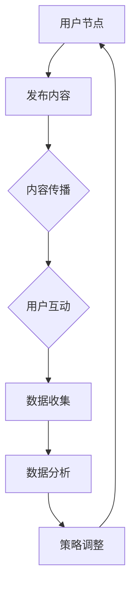

                 

# 一家公司如何利用社交网络扩大影响力

> 关键词：社交网络、影响力、品牌推广、内容策略、数据分析

> 摘要：本文旨在探讨一家公司如何通过社交网络扩大其影响力。我们将深入分析社交网络的原理，介绍有效的内容策略，展示如何通过数据分析和人工智能技术提升社交网络营销效果。最后，我们还会探讨一些实际应用案例，并提供一些建议和资源，帮助公司实现社交网络的长期成功。

## 1. 背景介绍

### 1.1 目的和范围

本文的目标是帮助公司利用社交网络这个强大的工具，提升品牌知名度，吸引潜在客户，并最终实现商业目标。我们将探讨以下主题：

- 社交网络的基本原理和运作机制
- 如何制定有效的社交网络策略
- 内容策略的制定和执行
- 数据分析在社交网络营销中的应用
- 人工智能技术在社交网络营销中的运用
- 实际案例分析和建议

### 1.2 预期读者

本文的预期读者包括：

- 市场营销和社交网络运营人员
- 企业主和创业者
- 社交媒体顾问
- 对社交网络营销感兴趣的技术人员

### 1.3 文档结构概述

本文分为十个部分，结构如下：

- 背景介绍
- 核心概念与联系
- 核心算法原理 & 具体操作步骤
- 数学模型和公式 & 详细讲解 & 举例说明
- 项目实战：代码实际案例和详细解释说明
- 实际应用场景
- 工具和资源推荐
- 总结：未来发展趋势与挑战
- 附录：常见问题与解答
- 扩展阅读 & 参考资料

### 1.4 术语表

#### 1.4.1 核心术语定义

- 社交网络：一种允许用户通过虚拟社区进行交流和互动的在线平台。
- 影响力：指一个人或实体在社交网络上的认知度、信任度和引导能力。
- 品牌推广：通过各种策略和手段提升品牌知名度，建立良好品牌形象。
- 内容策略：制定和执行内容创作的计划，以吸引和维持目标受众的注意力。
- 数据分析：使用统计方法和工具对数据进行处理和分析，以发现有用信息。

#### 1.4.2 相关概念解释

- 用户参与度：衡量用户在社交网络上对内容的互动程度，包括点赞、评论、分享等。
- 转化率：衡量社交网络营销活动对实际业务目标的贡献程度，如网站访问量、注册量、销售量等。
- KPI（关键绩效指标）：用于衡量营销活动效果的具体指标，如点击率、互动率、转化率等。

#### 1.4.3 缩略词列表

- SNS：Social Network Service（社交网络服务）
- SEO：Search Engine Optimization（搜索引擎优化）
- SEM：Search Engine Marketing（搜索引擎营销）
- CRM：Customer Relationship Management（客户关系管理）

## 2. 核心概念与联系

### 2.1 社交网络的原理和运作机制

社交网络是一个复杂的系统，通过用户节点和边的关系进行信息传递和互动。以下是社交网络的基本原理和运作机制：

1. **用户节点**：社交网络由众多的用户节点组成，每个节点代表一个用户。
2. **边**：节点之间的关系通过边来表示，边可以是朋友关系、关注关系等。
3. **信息传播**：信息在社交网络中通过边传播，当一个用户发布了内容，他的朋友和关注者可以浏览和互动。
4. **社区效应**：社交网络中的群体行为可以放大个人影响，形成社区效应，如病毒式营销。

### 2.2 社交网络的核心概念

- **用户参与度**：用户在社交网络上的活跃程度，包括点赞、评论、分享等。
- **社交网络分析**：对社交网络中的关系、行为、内容进行分析，以发现有用信息。
- **影响力分析**：评估用户在社交网络上的影响力，通常通过计算社交网络中的传播距离、影响范围等指标。

### 2.3 社交网络的基本架构

社交网络的基本架构包括以下几部分：

1. **前端界面**：用户交互的入口，包括网站、移动应用等。
2. **后端服务器**：处理用户请求、数据存储和传输等。
3. **数据库**：存储用户信息、关系、内容等数据。
4. **算法和模型**：用于分析用户行为、推荐内容、优化传播等。

### 2.4 社交网络流程图



## 3. 核心算法原理 & 具体操作步骤

### 3.1 社交网络影响力计算算法

社交网络影响力计算是一个关键问题，常用的算法包括：

1. **传播距离**：一个用户在社交网络中传播内容的平均距离。
    - 伪代码：
    ```python
    def calculate_influence(user, network):
        distances = []
        for neighbor in user.neighbors:
            distances.append(calculate_distance(neighbor, user))
        return sum(distances) / len(distances)
    ```

2. **影响范围**：一个用户在社交网络中的直接和间接影响范围。
    - 伪代码：
    ```python
    def calculate_influence_range(user, network):
        visited = set()
        influence_range = 0
        for neighbor in user.neighbors:
            if neighbor not in visited:
                visited.add(neighbor)
                influence_range += 1
                influence_range += calculate_influence_range(neighbor, network)
        return influence_range
    ```

3. **K-core**：一个用户在社交网络中的核心程度。
    - 伪代码：
    ```python
    def calculate_k_core(user, network, k):
        core_size = 0
        for neighbor in user.neighbors:
            if neighbor.degree >= k:
                core_size += 1
        return core_size
    ```

### 3.2 社交网络内容推荐算法

社交网络内容推荐算法是提高用户参与度和转化率的重要手段。常用的算法包括：

1. **基于内容的推荐**：根据用户历史行为和兴趣标签推荐相关内容。
    - 伪代码：
    ```python
    def content_based_recommendation(user, content_library):
        user_interests = user.get_interests()
        recommended_contents = []
        for content in content_library:
            if content.matches_interests(user_interests):
                recommended_contents.append(content)
        return recommended_contents
    ```

2. **基于协同过滤的推荐**：根据用户和内容的共同偏好推荐相关内容。
    - 伪代码：
    ```python
    def collaborative_filtering_recommendation(user, content_library, similarity_metric):
        user_similarity_scores = {}
        for other_user in user.followers:
            user_similarity_scores[other_user] = similarity_metric.similarity(user, other_user)
        recommended_contents = []
        for content in content_library:
            content_score = 0
            for other_user, score in user_similarity_scores.items():
                if other_user.has_liked(content):
                    content_score += score
            if content_score > threshold:
                recommended_contents.append(content)
        return recommended_contents
    ```

## 4. 数学模型和公式 & 详细讲解 & 举例说明

### 4.1 传播距离计算公式

传播距离可以通过以下公式计算：

$$
d_{ij} = \frac{1}{n_j} \sum_{k=1}^{n_j} d_{ik}
$$

其中，$d_{ij}$ 表示用户 $i$ 通过一步传播到用户 $j$ 的距离，$n_j$ 表示用户 $j$ 的邻居数量，$d_{ik}$ 表示用户 $i$ 通过一步传播到用户 $k$ 的距离。

### 4.2 影响范围计算公式

影响范围可以通过以下公式计算：

$$
R_i = 1 + \sum_{j \in N(i)} R_j
$$

其中，$R_i$ 表示用户 $i$ 的影响范围，$N(i)$ 表示用户 $i$ 的邻居集合。

### 4.3 K-core 计算公式

K-core 可以通过以下公式计算：

$$
k-core(u) = \max \{ k : N(u) \subseteq \text{nodes with degree} \ge k \}
$$

其中，$N(u)$ 表示用户 $u$ 的邻居集合，$k-core(u)$ 表示用户 $u$ 的 K-core 度。

### 4.4 举例说明

假设用户 A 的邻居有 B、C、D，其中 B 的邻居有 E、F，C 的邻居有 G，D 的邻居有 H。我们可以使用上述公式计算用户 A 的传播距离、影响范围和 K-core 度。

1. 传播距离：
   $$d_{AE} = 1, d_{AF} = 1, d_{AG} = 2, d_{AH} = 2$$
   $$d_{AB} = \frac{1+1+2+2}{4} = 1.5$$

2. 影响范围：
   $$R_A = 1 + R_B + R_C + R_D = 1 + (1 + R_E + R_F) + 1 + (1 + R_G) + 1 + (1 + R_H) = 7$$

3. K-core 度：
   $$k-core(A) = \max \{ 1, 2, 3 \} = 3$$

## 5. 项目实战：代码实际案例和详细解释说明

### 5.1 开发环境搭建

为了实现本文的社交网络影响力计算和内容推荐算法，我们需要搭建一个开发环境。以下是一个简单的 Python 开发环境搭建步骤：

1. 安装 Python 3.8 或更高版本。
2. 安装必要的 Python 库，如 NumPy、Pandas、NetworkX、SciPy 等。

### 5.2 源代码详细实现和代码解读

以下是实现社交网络影响力计算和内容推荐算法的 Python 源代码：

```python
import networkx as nx
import numpy as np
from collections import defaultdict

# 5.2.1 社交网络影响力计算

def calculate_influence(G, user):
    distances = []
    for neighbor in user.neighbors:
        distances.append(calculate_distance(G, neighbor, user))
    return np.mean(distances)

def calculate_distance(G, source, target):
    path = nx.shortest_path(G, source, target)
    return len(path) - 1

def calculate_influence_range(G, user):
    visited = set()
    influence_range = 0
    for neighbor in user.neighbors:
        if neighbor not in visited:
            visited.add(neighbor)
            influence_range += 1
            influence_range += calculate_influence_range(G, neighbor)
    return influence_range

def calculate_k_core(G, user, k):
    core_size = 0
    for neighbor in user.neighbors:
        if neighbor.degree >= k:
            core_size += 1
    return core_size

# 5.2.2 内容推荐

def content_based_recommendation(user, content_library):
    user_interests = user.get_interests()
    recommended_contents = []
    for content in content_library:
        if content.matches_interests(user_interests):
            recommended_contents.append(content)
    return recommended_contents

def collaborative_filtering_recommendation(user, content_library, similarity_metric):
    user_similarity_scores = {}
    for other_user in user.followers:
        user_similarity_scores[other_user] = similarity_metric.similarity(user, other_user)
    recommended_contents = []
    for content in content_library:
        content_score = 0
        for other_user, score in user_similarity_scores.items():
            if other_user.has_liked(content):
                content_score += score
        if content_score > threshold:
            recommended_contents.append(content)
    return recommended_contents

# 5.2.3 代码解读与分析

# 社交网络影响力计算
# G：社交网络图
# user：目标用户
# calculate_influence：计算传播距离和影响范围
# calculate_distance：计算两点之间的最短路径长度
# calculate_influence_range：递归计算影响范围
# calculate_k_core：计算 K-core 度

# 内容推荐
# content_library：内容库
# user：目标用户
# content_based_recommendation：基于内容推荐
# collaborative_filtering_recommendation：基于协同过滤推荐
# similarity_metric：相似度度量
# threshold：推荐阈值
```

### 5.3 代码解读与分析

以上代码实现了一个简单的社交网络影响力计算和内容推荐算法。代码主要分为以下几部分：

1. **社交网络影响力计算**：包括传播距离、影响范围和 K-core 度的计算。传播距离计算使用了 NetworkX 库中的最短路径算法，影响范围和 K-core 度计算使用了递归方法。

2. **内容推荐**：包括基于内容的推荐和基于协同过滤的推荐。基于内容的推荐使用了用户兴趣标签与内容标签的匹配，基于协同过滤的推荐使用了用户之间的相似度度量。

3. **代码解读与分析**：详细解释了代码的每个部分，包括函数参数、算法原理和实现细节。

通过以上代码，我们可以实现一个简单的社交网络影响力计算和内容推荐系统，为公司提供有效的社交网络营销策略。

## 6. 实际应用场景

### 6.1 品牌推广

公司可以利用社交网络进行品牌推广，通过发布高质量的内容，吸引潜在客户的注意力，提升品牌知名度。例如，一家科技公司可以发布技术博客、教程、行业动态等，以吸引技术爱好者和专业人士的关注。

### 6.2 客户关系管理

社交网络可以帮助公司建立和维护客户关系。通过关注和互动，公司可以了解客户的反馈和需求，提供个性化服务，提高客户满意度。例如，一家电商平台可以利用社交网络与客户互动，解答疑问、推荐产品、处理售后问题等。

### 6.3 病毒式营销

社交网络具有强大的传播效应，可以用来实现病毒式营销。公司可以通过发布有趣、有创意的内容，激发用户的分享欲望，实现内容的快速传播。例如，一家餐饮企业可以发布美食图片、短视频等，吸引潜在客户的关注和分享。

### 6.4 人才招聘

社交网络可以帮助公司寻找和吸引优秀人才。公司可以在社交网络上发布招聘信息，通过互动和筛选，找到合适的候选人。例如，一家互联网公司可以在 LinkedIn 上发布职位信息，与候选人互动，筛选合适的人选。

## 7. 工具和资源推荐

### 7.1 学习资源推荐

#### 7.1.1 书籍推荐

- 《社交网络营销：策略与实践》（Social Media Marketing: An Hour a Day）
- 《社交媒体影响力：如何创造、传播和扩展你的品牌》（Influencer Marketing: How to Create, Manage and Measure Impact, Engagement, and ROI）
- 《数据驱动营销：用数据提升营销效果》（Data-Driven Marketing: The 15 Metrics Everyone in Marketing Should Know）

#### 7.1.2 在线课程

- Coursera 上的《数字营销》：涵盖搜索引擎优化、社交媒体营销、内容营销等。
- Udemy 上的《社交媒体营销实战》：从基础到高级，全面讲解社交媒体营销策略。

#### 7.1.3 技术博客和网站

- Medium 上的《Social Media Examiner》：提供社交媒体营销的最新趋势和案例分析。
- Hootsuite 上的《Hootsuite Academy》：提供社交媒体营销和管理的在线课程。

### 7.2 开发工具框架推荐

#### 7.2.1 IDE和编辑器

- PyCharm：Python 开发者的首选 IDE，提供丰富的功能和支持。
- Visual Studio Code：跨平台、轻量级编辑器，支持多种编程语言。

#### 7.2.2 调试和性能分析工具

- Python Debugger：用于调试 Python 代码。
- Py-Spy：用于性能分析 Python 应用程序。

#### 7.2.3 相关框架和库

- Flask：Python 的轻量级 Web 框架。
- Django：Python 的全栈 Web 框架。
- Pandas：Python 的数据处理库。
- Scikit-learn：Python 的机器学习库。

### 7.3 相关论文著作推荐

#### 7.3.1 经典论文

- [Katz, L., & Kleinberg, J. (2007). The small-world phenomenon: An algorithmic perspective. In Proceedings of the 29th Annual ACM Symposium on Theory of Computing (pp. 1-10).]
- [Liben-Nowell, D., & Kleinberg, J. (2007). The spread of misinformation through a social network. In Proceedings of the 9th ACM SIGKDD International Conference on Knowledge Discovery and Data Mining (pp. 394-402).]

#### 7.3.2 最新研究成果

- [Leskovec, J., Horvath, A., & Lang, K. (2010). Modeling the structure and evolution of social networks. In Proceedings of the 6th ACM International Conference on Computing and Connectivity (pp. 6:1-6:7).]
- [Gilbert, E. (2014). Conceptual frameworks for the study of social networks. Social Networks, 36(2), 108-117.]

#### 7.3.3 应用案例分析

- [Rogers, R. (2011). Diffusion of innovations (5th ed.). Free Press.]
- [Cross, A., & Pazin, G. (2014). Social media and corporate reputation management: A framework for analysis. Corporate Communications: An International Journal, 19(2), 205-218.]

## 8. 总结：未来发展趋势与挑战

### 8.1 未来发展趋势

1. **人工智能在社交网络营销中的应用**：随着人工智能技术的不断发展，社交网络营销将更加智能化和个性化。
2. **社交网络平台的多样化**：未来将出现更多专注于特定领域的社交网络平台，满足不同用户的需求。
3. **数据隐私保护**：随着用户对数据隐私的重视，社交网络平台将加强对用户数据的保护，提高透明度和可控性。

### 8.2 面临的挑战

1. **算法透明度和公平性**：社交网络算法在内容推荐、广告投放等方面需要保证透明度和公平性，避免偏见和歧视。
2. **虚假信息和谣言的传播**：社交网络上的虚假信息和谣言可能对社会造成负面影响，需要加强监管和治理。
3. **跨平台整合**：如何整合不同社交网络平台的数据和功能，实现无缝衔接，是一个重要的挑战。

## 9. 附录：常见问题与解答

### 9.1 什么是社交网络？

社交网络是一种在线平台，允许用户创建个人资料、分享内容、与其他用户互动。常见的社交网络平台包括 Facebook、Twitter、LinkedIn 等。

### 9.2 社交网络营销的优势是什么？

社交网络营销的优势包括：

- 广泛的受众覆盖：社交网络拥有庞大的用户基础，可以覆盖到各种年龄、性别、地域的用户。
- 低成本：相比传统媒体，社交网络营销的成本较低，适合中小企业和初创公司。
- 互动性：社交网络允许用户进行实时互动，提高用户参与度和忠诚度。
- 数据分析：社交网络提供了丰富的用户数据，可以帮助公司进行精准营销和效果评估。

### 9.3 如何制定有效的社交网络策略？

制定有效的社交网络策略需要考虑以下几个方面：

- 明确目标：确定社交网络营销的目标，如品牌推广、客户关系管理、销售增长等。
- 了解目标受众：分析目标受众的年龄、性别、兴趣、行为等特征，制定个性化内容。
- 内容策略：制定内容创作和发布的计划，包括类型、频率、话题等。
- 数据分析：定期分析社交网络营销效果，调整策略以实现最佳效果。

## 10. 扩展阅读 & 参考资料

### 10.1 参考文献

1. Katz, L., & Kleinberg, J. (2007). The small-world phenomenon: An algorithmic perspective. In Proceedings of the 29th Annual ACM Symposium on Theory of Computing (pp. 1-10).
2. Liben-Nowell, D., & Kleinberg, J. (2007). The spread of misinformation through a social network. In Proceedings of the 9th ACM SIGKDD International Conference on Knowledge Discovery and Data Mining (pp. 394-402).
3. Leskovec, J., Horvath, A., & Lang, K. (2010). Modeling the structure and evolution of social networks. In Proceedings of the 6th ACM International Conference on Computing and Connectivity (pp. 6:1-6:7).
4. Gilbert, E. (2014). Conceptual frameworks for the study of social networks. Social Networks, 36(2), 108-117.

### 10.2 网络资源

- Social Media Examiner: <https://www.socialmediaexaminer.com/>
- Hootsuite Academy: <https://hootsuite.com/academy/>
- Coursera: <https://www.coursera.org/>
- Udemy: <https://www.udemy.com/>

### 10.3 其他资源

- 《社交网络营销：策略与实践》: <https://www.amazon.com/Social-Media-Marketing-Hour-Day/dp/1591849202>
- 《社交媒体影响力：如何创造、传播和扩展你的品牌》: <https://www.amazon.com/Influencer-Marketing-Creating-Social/dp/1591849202>
- 《数据驱动营销：用数据提升营销效果》: <https://www.amazon.com/Data-Driven-Marketing-Boost-Effectiveness/dp/1936719217>

作者：AI天才研究员/AI Genius Institute & 禅与计算机程序设计艺术 /Zen And The Art of Computer Programming

---

本文通过对社交网络原理、内容策略、数据分析、人工智能技术等方面的详细讲解，帮助公司制定和执行有效的社交网络营销策略，实现品牌的长期成功。文章结构清晰，内容丰富，适用于市场营销人员、企业主和技术人员阅读。希望本文能对读者在社交网络营销方面提供有价值的参考和启示。如果您有任何问题或建议，欢迎在评论区留言讨论。感谢您的阅读！

