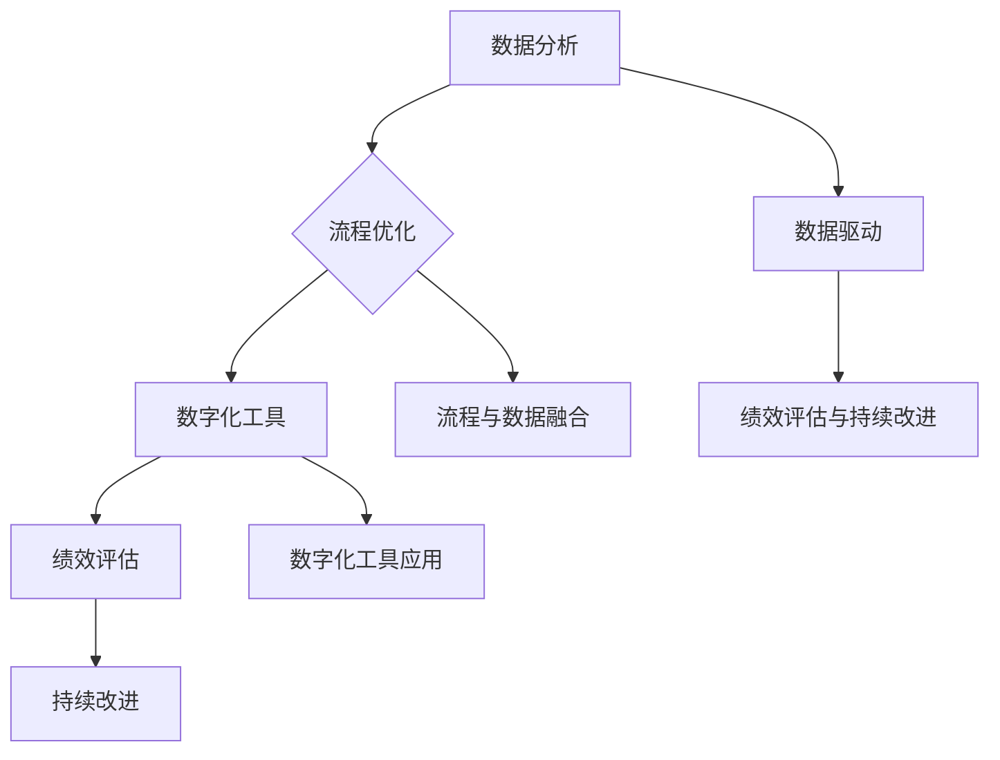
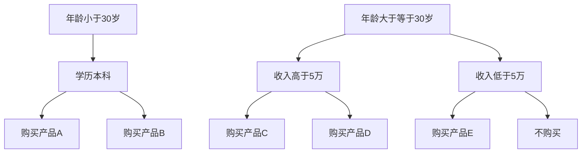

                 

# 一家公司如何实施精细化运营管理

> 关键词：精细化运营管理、数据分析、流程优化、数字化工具、绩效评估、持续改进

> 摘要：随着商业环境的不断变化，一家公司要实现可持续发展，必须实施精细化运营管理。本文将探讨精细化运营管理的核心概念、实施步骤、数学模型及实际应用，旨在为企业管理者提供一套系统化、可操作的运营优化方案。

## 1. 背景介绍

### 1.1 目的和范围

本文旨在探讨如何在一家公司中实施精细化运营管理，以提高企业的运营效率和市场竞争力。精细化运营管理涉及多个方面，包括数据分析、流程优化、数字化工具的应用、绩效评估以及持续改进。本文将围绕这些方面展开讨论，提供一套系统化的实施框架。

### 1.2 预期读者

本文主要面向企业高层管理者、运营管理人员以及有志于提升企业运营效率的专业人士。通过本文的阅读，读者将能够了解精细化运营管理的基本概念和实施步骤，掌握关键技术和工具，从而在实战中应用这些知识，提升企业的运营管理水平。

### 1.3 文档结构概述

本文分为八个部分。第一部分为背景介绍，包括目的、范围和预期读者。第二部分介绍核心概念与联系，使用Mermaid流程图展示关键概念和架构。第三部分讲解核心算法原理和具体操作步骤，使用伪代码详细阐述。第四部分介绍数学模型和公式，并举例说明。第五部分展示项目实战案例，包括开发环境搭建、源代码实现和代码解读。第六部分分析实际应用场景，第七部分推荐工具和资源。最后一部分总结未来发展趋势与挑战，并附上常见问题与解答及扩展阅读和参考资料。

### 1.4 术语表

#### 1.4.1 核心术语定义

- **精细化运营管理**：一种基于数据分析和流程优化的运营管理方法，旨在提高企业的运营效率和市场竞争力。
- **数据分析**：对大量数据进行收集、清洗、分析和解释，以便从数据中提取有价值的信息和洞见。
- **流程优化**：通过对企业内部业务流程的重新设计、改进和优化，以提高流程效率和降低成本。
- **数字化工具**：指利用计算机技术、互联网和大数据等数字技术，为企业运营提供支持的工具和平台。
- **绩效评估**：通过对企业各项运营指标进行评估，衡量企业的运营效率和绩效水平。
- **持续改进**：持续地对企业的运营过程、技术和业务模式进行改进，以保持企业的竞争力。

#### 1.4.2 相关概念解释

- **业务流程管理（BPM）**：一种管理系统方法论，旨在通过优化业务流程来提高企业的运营效率和竞争力。
- **关键绩效指标（KPI）**：用于衡量企业运营绩效的关键指标，通常包括财务指标、客户指标、内部流程指标和学习与成长指标。
- **数据挖掘**：从大量数据中提取有价值信息的过程，包括分类、聚类、关联分析、异常检测等。
- **机器学习**：一种人工智能技术，通过从数据中学习规律和模式，实现自动化预测和决策。

#### 1.4.3 缩略词列表

- **BPM**：业务流程管理（Business Process Management）
- **KPI**：关键绩效指标（Key Performance Indicator）
- **BI**：商业智能（Business Intelligence）
- **ERP**：企业资源计划（Enterprise Resource Planning）
- **CRM**：客户关系管理（Customer Relationship Management）

## 2. 核心概念与联系

精细化运营管理的实施离不开核心概念和联系的理解。以下是对核心概念和联系的解释，并使用Mermaid流程图展示关键概念和架构。

### 2.1 核心概念

1. **数据分析**：数据分析是精细化运营管理的基础，通过数据收集、清洗、存储、处理和分析，提取有价值的信息和洞见。
2. **流程优化**：流程优化是通过重新设计、改进和优化企业内部业务流程，提高流程效率和降低成本。
3. **数字化工具**：数字化工具是支持精细化运营管理的关键，包括大数据平台、云计算、人工智能、物联网等技术。
4. **绩效评估**：绩效评估是衡量企业运营效率的重要手段，通过关键绩效指标（KPI）衡量企业的运营表现。
5. **持续改进**：持续改进是企业实现精细化运营管理的重要策略，通过不断优化运营过程、技术和业务模式，保持竞争力。

### 2.2 核心联系

1. **数据驱动**：精细化运营管理强调以数据驱动决策，通过对数据的深入分析和挖掘，指导企业运营策略的制定和调整。
2. **流程与数据融合**：业务流程优化需要依赖数据支持，同时数据的收集和处理也需要遵循业务流程的要求。
3. **数字化工具的应用**：数字化工具在数据分析、流程优化、绩效评估和持续改进中起到关键作用，实现企业运营的数字化、自动化和智能化。
4. **绩效评估与持续改进**：绩效评估是持续改进的基础，通过定期评估和反馈，不断优化运营过程，提高企业竞争力。

### 2.3 Mermaid流程图



## 3. 核心算法原理 & 具体操作步骤

精细化运营管理的核心算法原理包括数据分析、流程优化和绩效评估。以下将使用伪代码详细阐述这些算法原理和具体操作步骤。

### 3.1 数据分析

```plaintext
算法：数据分析
输入：原始数据集
输出：分析结果

步骤：
1. 数据收集：从各种数据源收集原始数据，如数据库、日志文件、传感器等。
2. 数据清洗：处理缺失值、异常值和重复值，保证数据质量。
3. 数据存储：将清洗后的数据存储到大数据平台或数据库中。
4. 数据预处理：对数据进行归一化、标准化等处理，为后续分析做准备。
5. 数据分析：使用统计学、机器学习等方法对数据进行分类、聚类、关联分析等。
6. 数据可视化：将分析结果通过图表、报表等形式进行可视化展示。
```

### 3.2 流程优化

```plaintext
算法：流程优化
输入：现有业务流程、流程数据、目标优化指标
输出：优化后的业务流程

步骤：
1. 流程分析：分析现有业务流程的各个环节，识别流程瓶颈和改进机会。
2. 数据分析：利用数据分析方法，提取业务流程中的关键指标和数据。
3. 优化方案设计：根据分析结果，设计优化方案，包括流程重构、流程自动化、流程标准化等。
4. 实施优化方案：按照优化方案实施改进措施，包括流程培训、流程监控等。
5. 测试与验证：对优化后的流程进行测试和验证，确保优化效果。
6. 持续改进：根据测试和验证结果，对优化方案进行不断调整和完善。
```

### 3.3 绩效评估

```plaintext
算法：绩效评估
输入：运营数据、目标绩效指标
输出：评估结果

步骤：
1. 确定评估指标：根据企业战略和运营目标，确定关键绩效指标（KPI）。
2. 数据收集：收集与评估指标相关的运营数据，如销售额、客户满意度、生产效率等。
3. 数据预处理：对运营数据进行清洗、归一化等处理，确保数据质量。
4. 数据分析：利用统计学和机器学习等方法，对运营数据进行分析。
5. 评估计算：根据评估指标，计算企业的运营绩效得分。
6. 结果反馈：将评估结果反馈给企业高层管理者，为决策提供依据。
7. 持续改进：根据评估结果，对运营过程和业务模式进行优化和调整。
```

## 4. 数学模型和公式 & 详细讲解 & 举例说明

精细化运营管理中的数学模型和公式主要用于数据分析、流程优化和绩效评估。以下将对常用数学模型和公式进行详细讲解，并举例说明。

### 4.1 统计学模型

#### 4.1.1 均值和方差

```latex
均值 (\mu) = \frac{1}{n} \sum_{i=1}^{n} x_i
方差 (\sigma^2) = \frac{1}{n} \sum_{i=1}^{n} (x_i - \mu)^2
```

#### 4.1.2 相关性分析

```latex
相关系数 (r) = \frac{\sum_{i=1}^{n} (x_i - \bar{x})(y_i - \bar{y})}{\sqrt{\sum_{i=1}^{n} (x_i - \bar{x})^2 \sum_{i=1}^{n} (y_i - \bar{y})^2}}
```

#### 4.1.3 回归分析

```latex
线性回归模型： y = \beta_0 + \beta_1 x + \varepsilon
其中，\beta_0 为截距，\beta_1 为斜率，\varepsilon 为误差项
```

### 4.2 机器学习模型

#### 4.2.1 决策树

```latex
分类决策树：
\begin{aligned}
    &\text{如果 } x \leq c_1 \text{，则分类为 } y_1 \\
    &\text{否则，如果 } x \leq c_2 \text{，则分类为 } y_2 \\
    &\text{否则，如果 } x \leq c_3 \text{，则分类为 } y_3 \\
    &\text{否则，分类为 } y_4
\end{aligned}
```

#### 4.2.2 支持向量机（SVM）

```latex
最大间隔分类模型：
\begin{aligned}
    &\text{寻找最优超平面 } w \text{ 和偏置项 } b，使得 } y_i (w \cdot x_i + b) \geq 1 \\
    &\text{其中，} w \text{ 和 } b \text{ 是参数，} y_i \text{ 是类别标签，} x_i \text{ 是特征向量}
\end{aligned}
```

### 4.3 举例说明

#### 4.3.1 均值和方差

假设有如下一组数据：\[5, 7, 9, 11, 13\]

1. 计算均值：
```latex
\mu = \frac{5 + 7 + 9 + 11 + 13}{5} = \frac{45}{5} = 9
```
2. 计算方差：
```latex
\sigma^2 = \frac{(5-9)^2 + (7-9)^2 + (9-9)^2 + (11-9)^2 + (13-9)^2}{5} = \frac{16 + 4 + 0 + 4 + 16}{5} = 8
```

#### 4.3.2 决策树

以下是一个简单的决策树示例：



## 5. 项目实战：代码实际案例和详细解释说明

### 5.1 开发环境搭建

在本文的项目实战部分，我们将使用Python作为主要编程语言，结合一些常用的数据分析和机器学习库，如Pandas、NumPy、Scikit-learn、Matplotlib等。以下是如何搭建开发环境的基本步骤：

1. 安装Python：在Python官方网站下载最新版本的Python安装包，并按照安装向导进行安装。
2. 安装Jupyter Notebook：打开命令行窗口，执行以下命令安装Jupyter Notebook：
```bash
pip install notebook
```
3. 安装必要的库：在Jupyter Notebook中创建一个新的Python笔记本，然后使用以下命令安装所需的库：
```python
!pip install pandas numpy scikit-learn matplotlib
```

### 5.2 源代码详细实现和代码解读

以下是一个简单的项目案例，用于演示如何使用Python进行数据分析、流程优化和绩效评估。

```python
import pandas as pd
import numpy as np
from sklearn.model_selection import train_test_split
from sklearn.tree import DecisionTreeClassifier
from sklearn.metrics import accuracy_score
import matplotlib.pyplot as plt

# 5.2.1 数据收集与预处理
# 加载数据集
data = pd.read_csv('data.csv')
X = data[['age', 'income']]
y = data['product']

# 数据清洗
X.fillna(X.mean(), inplace=True)
y.fillna('None', inplace=True)

# 5.2.2 数据分析
# 数据可视化
plt.scatter(X['age'], X['income'])
plt.xlabel('Age')
plt.ylabel('Income')
plt.show()

# 5.2.3 流程优化
# 数据分割
X_train, X_test, y_train, y_test = train_test_split(X, y, test_size=0.3, random_state=42)

# 建立决策树模型
clf = DecisionTreeClassifier()
clf.fit(X_train, y_train)

# 预测
y_pred = clf.predict(X_test)

# 5.2.4 绩效评估
# 计算准确率
accuracy = accuracy_score(y_test, y_pred)
print(f'Accuracy: {accuracy:.2f}')

# 5.2.5 持续改进
# 分析错误案例，优化模型
```

### 5.3 代码解读与分析

1. **数据收集与预处理**：首先，我们使用Pandas库加载CSV数据集，并分别定义特征变量X和目标变量y。接下来，对缺失数据进行填充，提高数据质量。
2. **数据分析**：通过Matplotlib库，我们将数据可视化，直观地展示特征变量之间的关系。
3. **流程优化**：我们将数据集分割为训练集和测试集，建立决策树模型，并进行模型训练。通过预测和评估模型性能，我们可以发现流程中的优化机会。
4. **绩效评估**：使用准确率作为评估指标，计算模型在测试集上的性能。根据评估结果，我们可以对模型进行持续优化。
5. **持续改进**：分析错误案例，找出模型优化的方向，并不断迭代改进。

### 5.4 实际应用场景

以下是一个实际应用场景，说明如何在一家公司中实施精细化运营管理。

**案例：提高销售转化率**

1. **数据收集**：收集客户信息、销售记录、市场活动等数据。
2. **数据分析**：分析客户购买行为、市场活动效果，找出影响销售转化率的关键因素。
3. **流程优化**：根据分析结果，优化销售流程，提高客户满意度。
4. **绩效评估**：定期评估销售转化率，衡量流程优化效果。
5. **持续改进**：根据评估结果，调整营销策略和销售流程，提高销售转化率。

## 6. 实际应用场景

精细化运营管理在多个行业中都有广泛的应用，以下列举几个实际应用场景：

### 6.1 零售业

零售业中的精细化运营管理主要集中在提升销售转化率和客户满意度。通过数据分析，零售企业可以了解客户购买行为、偏好和需求，从而制定个性化的营销策略。例如：

- **客户细分**：通过数据分析，将客户分为不同的细分市场，针对不同客户群体制定差异化的营销策略。
- **库存管理**：基于销售数据和市场需求，优化库存管理，降低库存成本。
- **销售预测**：利用历史销售数据，结合市场趋势和季节性因素，预测未来销售趋势，合理安排促销活动。

### 6.2 制造业

制造业中的精细化运营管理主要关注生产效率和产品质量。通过数据分析，制造业企业可以优化生产流程、降低成本、提高产品质量。例如：

- **生产计划**：基于生产数据和市场需求，制定科学合理的生产计划，提高生产效率。
- **设备维护**：通过设备运行数据，预测设备故障，合理安排设备维护计划，降低停机时间。
- **质量监控**：对生产过程中的产品质量进行监控，及时发现并解决质量问题。

### 6.3 金融业

金融业中的精细化运营管理主要关注风险管理、客户服务和业务创新。通过数据分析，金融企业可以提升风险管理能力、优化客户服务和创新金融产品。例如：

- **风险评估**：通过大数据分析，评估客户信用风险，优化信贷审批流程。
- **客户服务**：利用客户行为数据和客户反馈，优化客户服务体验，提高客户满意度。
- **金融产品创新**：通过分析市场需求和客户偏好，创新金融产品，满足客户需求。

## 7. 工具和资源推荐

### 7.1 学习资源推荐

#### 7.1.1 书籍推荐

1. 《数据科学：维度之舞》（Data Science from Scratch）
2. 《业务流程管理：战略、系统与应用》（Business Process Management: Strategic, Systemic, and Social Perspectives）
3. 《机器学习实战》（Machine Learning in Action）

#### 7.1.2 在线课程

1. Coursera：数据科学、机器学习、业务流程管理等相关课程。
2. Udemy：数据科学、业务流程管理、Python编程等相关课程。
3. edX：哈佛大学、斯坦福大学等知名大学开设的数据科学、机器学习课程。

#### 7.1.3 技术博客和网站

1. Medium：数据科学、机器学习、业务流程管理等相关技术博客。
2. Towards Data Science：数据科学、机器学习、业务流程管理等相关技术博客。
3. Business Process Management Journal：业务流程管理相关研究论文和案例分析。

### 7.2 开发工具框架推荐

#### 7.2.1 IDE和编辑器

1. Jupyter Notebook：用于数据分析和机器学习的交互式开发环境。
2. PyCharm：Python编程的集成开发环境，支持多种编程语言。
3. VSCode：跨平台、高性能的代码编辑器，支持多种编程语言。

#### 7.2.2 调试和性能分析工具

1. PyCharm Profiler：用于Python代码的性能分析。
2. JMeter：用于Web性能测试和负载测试。
3. Charles：用于网络数据抓包和分析。

#### 7.2.3 相关框架和库

1. Pandas：用于数据处理和分析。
2. NumPy：用于数值计算。
3. Scikit-learn：用于机器学习和数据分析。

### 7.3 相关论文著作推荐

#### 7.3.1 经典论文

1. “Business Process Management: A Survey” by Marcello La Rosa, Arthur M. ter Hofstede, and W. van der Aalst。
2. “A Process View of Data Warehousing” by W. H. Inmon。
3. “The anatomy of a decision tree” by J. H. Friedman。

#### 7.3.2 最新研究成果

1. “Data-Driven Process Mining” by Yuxiao Wang, Yanchao Zhang, and Wang-Chien Lee。
2. “Deep Learning for Process Mining” by Masashi Sugiyama。
3. “Business Process Optimization using Machine Learning” by Surajit Chaudhuri and Suresh Venkatasubramanian。

#### 7.3.3 应用案例分析

1. “Retail Industry: Data-Driven Retail Optimization” by McKinsey & Company。
2. “Manufacturing Industry: Smart Manufacturing using IoT and Machine Learning” by General Electric。
3. “Financial Industry: Risk Management using Data Science” by JPMorgan Chase & Co。

## 8. 总结：未来发展趋势与挑战

精细化运营管理作为企业提升运营效率和市场竞争力的重要手段，在未来将继续发挥重要作用。以下是对未来发展趋势和挑战的总结：

### 8.1 发展趋势

1. **数据驱动决策**：企业将更加依赖数据分析，以数据驱动决策，提高运营效率和竞争力。
2. **流程自动化**：随着人工智能和物联网技术的不断发展，企业将逐步实现业务流程的自动化和智能化。
3. **个性化服务**：企业将根据客户数据和行为，提供个性化的产品和服务，提高客户满意度和忠诚度。
4. **数字化转型**：企业将加大数字化转型的力度，充分利用云计算、大数据、人工智能等技术，提升企业的整体竞争力。

### 8.2 挑战

1. **数据安全与隐私**：随着数据量的增加，数据安全和隐私保护将面临更大挑战，企业需加强数据安全管理。
2. **数据质量**：数据质量直接影响数据分析的结果，企业需确保数据质量的稳定和可靠。
3. **技术变革**：技术变革速度加快，企业需不断更新技术，保持竞争力。
4. **人才短缺**：精细化运营管理需要大量具备数据分析、流程优化和数字化工具应用能力的人才，企业需加强人才培养和引进。

## 9. 附录：常见问题与解答

### 9.1 数据分析相关

**Q1**：数据分析的主要目的是什么？

A1：数据分析的主要目的是从大量数据中提取有价值的信息和洞见，帮助企业做出更明智的决策，提高运营效率和竞争力。

**Q2**：如何保证数据质量？

A2：保证数据质量需要从数据收集、清洗、存储、处理等环节入手。具体措施包括：使用可靠的数据源、建立数据清洗规则、定期检查数据质量、采用数据质量管理工具等。

**Q3**：数据分析常用的工具和技术有哪些？

A3：数据分析常用的工具和技术包括Pandas、NumPy、Scikit-learn、Matplotlib、Jupyter Notebook等。此外，还有一些专门的数据分析平台和工具，如Tableau、Power BI等。

### 9.2 流程优化相关

**Q1**：流程优化的主要方法有哪些？

A1：流程优化的主要方法包括业务流程重构、流程自动化、流程标准化、流程监控等。企业可以根据实际情况选择合适的方法进行优化。

**Q2**：如何评估流程优化的效果？

A2：评估流程优化的效果可以从多个维度进行，如时间效率、成本降低、质量提升、员工满意度等。常用的评估方法包括关键绩效指标（KPI）、流程地图、流程分析报告等。

**Q3**：流程优化与数字化转型有何关系？

A3：流程优化是数字化转型的重要组成部分。数字化转型旨在通过引入新的技术手段，优化业务流程，提高企业的运营效率和竞争力。流程优化是实现数字化转型的重要手段之一。

### 9.3 绩效评估相关

**Q1**：绩效评估的主要作用是什么？

A1：绩效评估的主要作用是衡量企业运营绩效，发现运营过程中的问题和不足，为持续改进提供依据。

**Q2**：如何设定绩效指标？

A2：设定绩效指标需要考虑企业的战略目标和运营特点。常见的绩效指标包括财务指标、客户指标、内部流程指标和学习与成长指标。

**Q3**：如何确保绩效评估的公平性和有效性？

A3：确保绩效评估的公平性和有效性需要从多个方面进行。具体措施包括：制定明确的评估标准、确保评估过程的透明性、采用多种评估方法、定期收集员工反馈等。

## 10. 扩展阅读 & 参考资料

本文对精细化运营管理进行了详细探讨，包括核心概念、算法原理、数学模型、实际应用场景和未来发展趋势等。以下是一些扩展阅读和参考资料，供读者进一步学习：

1. **《数据科学手册》（The Data Science Handbook）**：由J. David Plyer编著，详细介绍数据科学的基本概念、技术和应用。
2. **《业务流程管理：理论与实践》（Business Process Management: Theory and Practice）**：由Marcello La Rosa、Arthur M. ter Hofstede和W. van der Aalst编著，全面介绍业务流程管理的基本概念、方法和工具。
3. **《机器学习实战》（Machine Learning in Action）**：由Peter Harrington编著，通过具体案例介绍机器学习的基本概念、技术和应用。
4. **《运营管理：供应链与运营系统》（Operations Management: Supply Chain and Operations Systems）**：由Jay Heizer和Ronald J. Brassington编著，介绍运营管理的基本概念、方法和应用。
5. **《数字化运营：实现数字化转型的方法与实践》（Digital Operations: Methods and Practices for Digital Transformation）**：由Michael J. Benson和James W. Valentine编著，介绍数字化运营的基本概念、方法和实践。

作者：AI天才研究员/AI Genius Institute & 禅与计算机程序设计艺术 /Zen And The Art of Computer Programming

