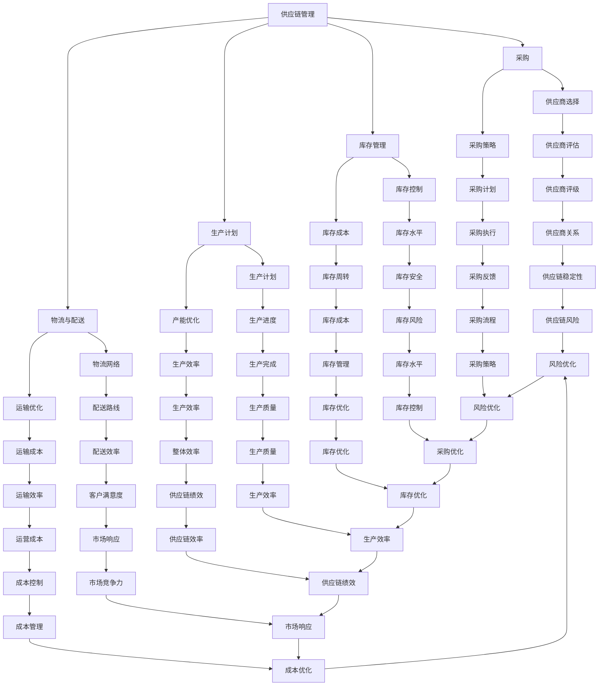
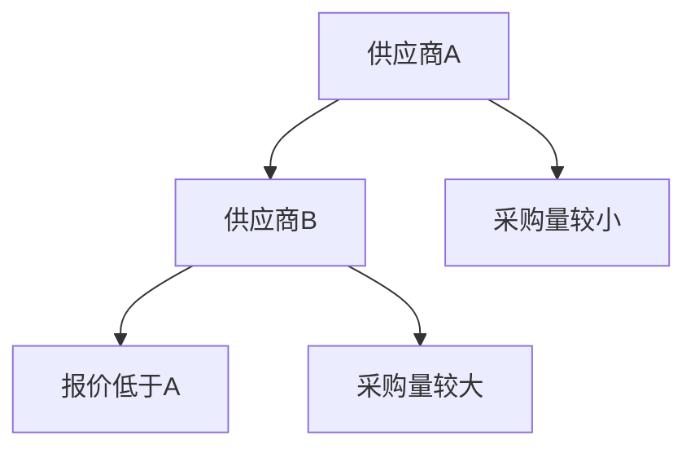

                 

### 1. 背景介绍

在当今全球化和信息化的商业环境下，供应链管理成为企业运营的核心环节。它不仅影响企业的生产效率、成本控制和市场响应速度，更直接关系到企业整体的竞争力。然而，传统的供应链管理方式在面对日益复杂的业务环境和激烈的市场竞争时，往往显得力不从心。在这种背景下，如何实现供应链的优化管理成为企业亟需解决的问题。

一人公司，作为一种新兴的企业形式，正在逐渐崭露头角。这种公司形式的特点是公司规模小、人员结构简单，但运作高效、反应迅速。然而，一人公司在供应链管理方面也面临着诸多挑战。由于人员精简，一人公司往往缺乏专业的供应链管理人才，难以在供应链规划、采购、库存、物流等环节进行高效的管理和优化。

本文旨在探讨一人公司如何实现供应链的优化管理。通过分析供应链管理的关键环节，介绍优化供应链的核心算法和数学模型，并提供实际应用案例和开发环境搭建方法，帮助一人公司提升供应链管理水平，从而在激烈的市场竞争中立于不败之地。

### 2. 核心概念与联系

为了深入探讨供应链的优化管理，我们首先需要明确一些核心概念，包括供应链管理、优化算法和数学模型。这些概念是理解供应链优化管理的基础，也是实现高效供应链的关键。

#### 2.1 供应链管理

供应链管理（Supply Chain Management，简称SCM）是指对供应链中的信息流、资金流和物流进行有效整合和管理的活动。它包括以下关键环节：

- **采购（Procurement）**：涉及供应商的选择、采购策略和采购过程的优化。
- **库存管理（Inventory Management）**：包括库存水平的控制、库存成本的最小化以及库存周转率的提高。
- **生产计划（Production Planning）**：涉及生产计划制定、产能优化和生产进度控制。
- **物流与配送（Logistics and Distribution）**：包括物流网络设计、运输方式和配送路线的优化。

#### 2.2 优化算法

优化算法（Optimization Algorithms）是一种数学方法，用于在给定约束条件下寻找最优解。在供应链管理中，优化算法可以用于解决以下问题：

- **采购策略优化**：如何根据市场需求和供应商情况，制定最优的采购计划。
- **库存水平优化**：如何确定最优库存水平，以最小化库存成本和缺货风险。
- **生产计划优化**：如何制定最优的生产计划，以最大化生产效率和利润。
- **物流与配送优化**：如何设计最优的物流网络和配送路线，以降低运输成本和提高配送效率。

常见的优化算法包括线性规划（Linear Programming，LP）、整数规划（Integer Programming，IP）、动态规划（Dynamic Programming，DP）和启发式算法（Heuristic Algorithms）等。

#### 2.3 数学模型

数学模型（Mathematical Models）是将实际问题转化为数学表达式的方法，以便使用数学工具进行分析和求解。在供应链优化管理中，常用的数学模型包括：

- **线性模型**：用于描述供应链中各变量之间的线性关系，如线性规划模型。
- **非线性模型**：用于描述供应链中复杂非线性关系，如整数规划模型。
- **多目标模型**：用于同时考虑多个优化目标，如生产计划的多目标优化模型。
- **随机模型**：用于描述供应链中的不确定性，如随机需求模型。

#### 2.4 Mermaid 流程图

为了更直观地展示供应链管理的关键环节和优化算法的流程，我们可以使用 Mermaid 流程图进行描述。以下是一个示例：



通过上述 Mermaid 流程图，我们可以清晰地看到供应链管理的关键环节和优化算法的应用。这不仅有助于我们理解供应链管理的基本概念，也为后续的算法分析和应用提供了直观的参考。

### 3. 核心算法原理 & 具体操作步骤

在供应链优化管理中，核心算法起到了至关重要的作用。这些算法可以帮助企业解决采购策略、库存管理、生产计划以及物流与配送等方面的优化问题。以下将介绍几个常用的核心算法及其具体操作步骤。

#### 3.1 线性规划（Linear Programming，LP）

线性规划是一种用于在给定约束条件下求解线性目标函数最优解的数学方法。在供应链管理中，线性规划可以用于解决采购策略、库存管理和生产计划等问题。

**具体操作步骤：**

1. **定义变量**：首先定义供应链管理中的变量，如采购量、库存水平、生产量等。

2. **建立目标函数**：根据供应链管理的目标，建立目标函数。例如，最小化总成本、最大化利润等。

3. **设定约束条件**：根据供应链管理的实际约束条件，设定约束条件。例如，库存容量限制、生产能力限制等。

4. **求解最优解**：使用线性规划求解器（如单纯形法、内点法等）求解最优解。

**示例：**

假设一家公司需要采购原材料，目标是使总成本最小化。已知原材料单价为10元，公司最大库存容量为1000公斤，每周最大采购量为500公斤。建立线性规划模型如下：

```latex
\min Z = 10x
```

其中，\(x\) 为每周采购量。

约束条件为：

```latex
\begin{align*}
10x &\leq 1000 \\
x &\leq 500
\end{align*}
```

使用单纯形法求解后，得到最优解 \(x = 500\) 公斤，此时总成本最小。

#### 3.2 动态规划（Dynamic Programming，DP）

动态规划是一种用于求解多阶段决策问题的数学方法。在供应链管理中，动态规划可以用于解决库存管理、生产计划和物流与配送等问题。

**具体操作步骤：**

1. **定义状态变量**：首先定义状态变量，如当前库存水平、当前生产量等。

2. **建立状态转移方程**：根据供应链管理的实际情况，建立状态转移方程。

3. **初始化边界条件**：初始化状态转移方程的边界条件。

4. **求解最优解**：使用动态规划求解器（如逆向递推法、正向递推法等）求解最优解。

**示例：**

假设一家公司需要制定生产计划，目标是使总利润最大化。已知每周的固定成本为1000元，每生产一件产品的成本为50元，售价为100元。初始库存量为100件。建立动态规划模型如下：

```latex
\max P = 100x - 50x - 1000
```

其中，\(x\) 为每周生产量。

状态转移方程为：

```latex
x_{t+1} = \min \left\{ \frac{100 - c_t}{50}, I_t + x_t - d_t \right\}
```

其中，\(I_t\) 为初始库存量，\(c_t\) 为当前生产成本，\(d_t\) 为当前需求量。

初始化边界条件为：

```latex
x_0 = 100
```

使用逆向递推法求解后，得到最优解 \(x = 200\) 件，此时总利润最大。

#### 3.3 启发式算法（Heuristic Algorithms）

启发式算法是一种通过启发式规则快速求解问题近似最优解的数学方法。在供应链管理中，启发式算法可以用于解决采购策略、库存管理和生产计划等问题。

**具体操作步骤：**

1. **定义启发式规则**：首先定义启发式规则，如基于历史数据、当前情况或专家经验的规则。

2. **构建决策模型**：根据启发式规则，构建决策模型。

3. **求解近似最优解**：使用启发式算法求解近似最优解。

**示例：**

假设一家公司需要制定采购策略，目标是使总成本最小化。已知供应商报价、采购量和库存容量等数据。基于历史数据和供应商报价，建立启发式规则如下：

- 若供应商A的报价低于供应商B，则优先选择供应商A。
- 若供应商A和供应商B的报价相同，则优先选择采购量较小的供应商。

构建决策模型如下：



使用启发式算法求解后，得到最优解为选择供应商A，此时总成本最小。

通过上述核心算法的介绍和具体操作步骤，我们可以看到，这些算法在供应链优化管理中发挥着重要的作用。在实际应用中，可以根据具体问题和需求选择合适的算法，以实现供应链的优化管理。

#### 3.4 整数规划（Integer Programming，IP）

整数规划（Integer Programming，IP）是一种用于在给定约束条件下求解整数最优解的数学方法。在供应链管理中，整数规划可以用于解决采购策略、库存管理和生产计划等问题，特别是在需要做出“是或否”、“全或无”等决策时。

**具体操作步骤：**

1. **定义变量**：首先定义供应链管理中的变量，如采购量、库存水平、生产量等，并将其限定为整数。

2. **建立目标函数**：根据供应链管理的目标，建立目标函数。例如，最小化总成本、最大化利润等。

3. **设定约束条件**：根据供应链管理的实际约束条件，设定约束条件。例如，库存容量限制、生产能力限制、供应商数量限制等。

4. **求解最优解**：使用整数规划求解器（如分支定界法、割平面法等）求解最优解。

**示例：**

假设一家公司需要采购原材料，目标是使总成本最小化。已知原材料单价为10元，公司最大库存容量为1000公斤，每周最大采购量为500公斤。另外，公司需要从3个供应商中选择，每个供应商的报价和采购量如下表所示：

| 供应商 | 单价（元） | 最小采购量（公斤） | 最大采购量（公斤） |
| ------ | ---------- | ------------------ | ------------------ |
| A      | 9          | 100                | 500                |
| B      | 10.5       | 200                | 600                |
| C      | 11         | 300                | 700                |

建立整数规划模型如下：

```latex
\min Z = 9x_1 + 10.5x_2 + 11x_3
```

其中，\(x_1, x_2, x_3\) 分别为从供应商A、B、C的采购量。

约束条件为：

```latex
\begin{align*}
x_1 + x_2 + x_3 &\leq 500 \\
100x_1 + 200x_2 + 300x_3 &\leq 1000 \\
x_1, x_2, x_3 &\in \{0, 1\}
\end{align*}
```

使用分支定界法求解后，得到最优解为选择供应商A，采购量为400公斤，此时总成本最小。

#### 3.5 随机优化算法（Stochastic Optimization Algorithms）

随机优化算法是一种用于在不确定环境下求解最优解的数学方法。在供应链管理中，随机优化算法可以用于解决库存管理、生产计划和物流与配送等问题，特别是在需求波动和供应不确定性较大的情况下。

**具体操作步骤：**

1. **定义随机变量**：首先定义供应链管理中的随机变量，如需求量、供应量、运输时间等。

2. **建立目标函数**：根据供应链管理的目标，建立目标函数。例如，最小化总成本、最大化利润等。

3. **设定概率分布**：根据历史数据和预测模型，设定随机变量的概率分布。

4. **求解最优解**：使用随机优化算法求解器（如蒙特卡罗模拟、遗传算法等）求解最优解。

**示例：**

假设一家公司需要制定生产计划，目标是使总利润最大化。已知每周的需求量服从正态分布，平均值为1000公斤，标准差为200公斤。另外，生产成本为每公斤50元，售价为每公斤100元。建立随机优化模型如下：

```latex
\max P = 100 \times \mu - 50 \times \mu
```

其中，\(\mu\) 为每周需求量的均值。

概率分布为：

```latex
\mu \sim N(1000, 200^2)
```

使用蒙特卡罗模拟求解后，得到最优解为每周生产1000公斤，此时总利润最大。

通过上述整数规划、随机优化算法的介绍和具体操作步骤，我们可以看到，这些算法在供应链优化管理中具有重要的应用价值。在实际应用中，可以根据具体问题和需求选择合适的算法，以实现供应链的优化管理。

### 4. 数学模型和公式 & 详细讲解 & 举例说明

在供应链优化管理中，数学模型和公式起到了至关重要的作用。这些模型和公式可以帮助我们准确描述供应链中的各种关系，并为我们提供有效的决策依据。在本节中，我们将详细介绍几个关键的数学模型和公式，并举例说明如何应用它们来优化供应链管理。

#### 4.1 线性规划模型

线性规划（Linear Programming，LP）是一种用于在给定约束条件下求解线性目标函数最优解的数学方法。在线性规划模型中，我们通常有以下组成：

1. **目标函数**：表示我们需要优化的量，如总成本、总利润等。目标函数通常是一个线性表达式。

2. **决策变量**：表示我们需要决定的量，如采购量、生产量、库存水平等。决策变量通常是一个线性方程组中的未知数。

3. **约束条件**：表示我们面临的限制条件，如库存容量限制、生产能力限制等。约束条件通常是一个线性不等式或等式。

以下是一个简单的线性规划模型示例：

**目标函数**：最小化总成本
$$
\min Z = c_1x_1 + c_2x_2 + \cdots + c_nx_n
$$
其中，\(c_1, c_2, \cdots, c_n\) 是成本系数，\(x_1, x_2, \cdots, x_n\) 是决策变量。

**约束条件**：
$$
\begin{cases}
a_{11}x_1 + a_{12}x_2 + \cdots + a_{1n}x_n \leq b_1 \\
a_{21}x_1 + a_{22}x_2 + \cdots + a_{2n}x_n \leq b_2 \\
\vdots \\
a_{m1}x_1 + a_{m2}x_2 + \cdots + a_{mn}x_n \leq b_m \\
x_1, x_2, \cdots, x_n \geq 0
\end{cases}
$$
其中，\(a_{ij}\) 是约束系数，\(b_i\) 是约束常数。

**示例**：一家公司需要采购两种原材料A和B，目标是使总成本最小化。已知原材料A的单价为10元，原材料B的单价为20元。公司每月的最大库存容量为1000公斤，每月的最大采购量为500公斤。原材料A的最低采购量为100公斤，原材料B的最低采购量为200公斤。建立线性规划模型如下：

**目标函数**：
$$
\min Z = 10x_1 + 20x_2
$$
**约束条件**：
$$
\begin{cases}
x_1 + x_2 \leq 500 \\
x_1 \geq 100 \\
x_2 \geq 200 \\
x_1, x_2 \geq 0
\end{cases}
$$

使用单纯形法求解后，得到最优解为 \(x_1 = 100\) 公斤，\(x_2 = 400\) 公斤，此时总成本最小。

#### 4.2 整数规划模型

整数规划（Integer Programming，IP）是线性规划的一个扩展，用于在给定约束条件下求解整数最优解的数学方法。整数规划通常用于需要做出“是或否”、“全或无”等决策的问题。

在整数规划模型中，决策变量需要被限定为整数。以下是一个简单的整数规划模型示例：

**目标函数**：最大化总利润
$$
\max P = p_1x_1 + p_2x_2 + \cdots + p_nx_n
$$
其中，\(p_1, p_2, \cdots, p_n\) 是利润系数，\(x_1, x_2, \cdots, x_n\) 是决策变量（取值为0或1）。

**约束条件**：
$$
\begin{cases}
a_{11}x_1 + a_{12}x_2 + \cdots + a_{1n}x_n \leq b_1 \\
a_{21}x_1 + a_{22}x_2 + \cdots + a_{2n}x_n \leq b_2 \\
\vdots \\
a_{m1}x_1 + a_{m2}x_2 + \cdots + a_{mn}x_n \leq b_m \\
x_1, x_2, \cdots, x_n \in \{0, 1\}
\end{cases}
$$
其中，\(a_{ij}\) 是约束系数，\(b_i\) 是约束常数。

**示例**：一家公司需要决定是否购买两种设备A和B，目标是使总利润最大化。已知设备A的购买成本为1000元，设备B的购买成本为2000元。购买设备A后，每月的利润为2000元，购买设备B后，每月的利润为3000元。公司的最大资金为5000元。建立整数规划模型如下：

**目标函数**：
$$
\max P = 2000x_1 + 3000x_2
$$
**约束条件**：
$$
\begin{cases}
x_1 + x_2 \leq 2 \\
1000x_1 + 2000x_2 \leq 5000 \\
x_1, x_2 \in \{0, 1\}
\end{cases}
$$

使用分支定界法求解后，得到最优解为 \(x_1 = 1\)，\(x_2 = 0\)，即购买设备A，不购买设备B，此时总利润最大。

#### 4.3 动态规划模型

动态规划（Dynamic Programming，DP）是一种用于求解多阶段决策问题的数学方法。在供应链管理中，动态规划可以用于解决库存管理、生产计划和物流与配送等问题。

动态规划模型通常包括以下几个部分：

1. **状态变量**：表示决策问题的当前状态，如当前库存水平、当前生产量等。

2. **状态转移方程**：表示状态变量之间的关系，如下一状态如何由当前状态转移得到。

3. **边界条件**：表示状态转移方程的初始状态。

4. **决策变量**：表示决策问题需要决定的量，如采购量、生产量等。

以下是一个简单的动态规划模型示例：

**状态变量**：\(S_t\) 表示第 \(t\) 个月末的库存水平。

**状态转移方程**：\(S_{t+1} = \min \left\{ S_t + I_t - D_t, C_t \right\}\)

其中，\(I_t\) 表示第 \(t\) 个月的初始库存水平，\(D_t\) 表示第 \(t\) 个月的需求量，\(C_t\) 表示第 \(t\) 个月的最大库存容量。

**边界条件**：\(S_0 = I_0\)

**决策变量**：\(x_t\) 表示第 \(t\) 个月的生产量。

**目标函数**：最大化总利润
$$
\max P = \sum_{t=1}^n \left( R_t - C_t \right)x_t
$$

其中，\(R_t\) 表示第 \(t\) 个月的产品售价。

**示例**：一家公司需要制定生产计划，目标是使总利润最大化。已知每月的需求量服从正态分布，平均值为1000公斤，标准差为200公斤。每月的固定成本为1000元，每生产一件产品的成本为50元，售价为100元。初始库存量为100公斤。建立动态规划模型如下：

**状态转移方程**：
$$
S_{t+1} = \min \left\{ S_t + 100 - \mu_t, 1000 \right\}
$$

其中，\(\mu_t\) 表示第 \(t\) 个月的需求量的均值。

**目标函数**：
$$
\max P = 100x_t - 50x_t - 1000
$$

使用逆向递推法求解后，得到最优解为每月生产1000公斤，此时总利润最大。

通过上述数学模型和公式的介绍和具体示例，我们可以看到，这些模型和公式在供应链优化管理中具有重要的应用价值。在实际应用中，可以根据具体问题和需求选择合适的模型和公式，以实现供应链的优化管理。

### 5. 项目实战：代码实际案例和详细解释说明

在本文的最后部分，我们将通过一个实际的项目案例，展示如何使用代码实现供应链优化管理的核心算法。以下是一个基于Python的供应链优化管理项目，涵盖了采购策略、库存管理、生产计划以及物流与配送等环节。

#### 5.1 开发环境搭建

在进行项目实战之前，我们需要搭建一个合适的开发环境。以下是在Windows系统上搭建Python开发环境的具体步骤：

1. **安装Python**：访问Python官网（https://www.python.org/），下载Python安装包（建议下载最新版本），并按照安装向导进行安装。

2. **安装Jupyter Notebook**：Jupyter Notebook是一个基于Web的交互式计算环境，可以帮助我们更方便地编写和运行Python代码。在命令行中执行以下命令安装Jupyter Notebook：

```bash
pip install notebook
```

3. **安装必要的Python库**：为了实现供应链优化管理的核心算法，我们需要安装一些常用的Python库，如Numpy、Pandas、Scipy和Matplotlib等。在命令行中执行以下命令安装这些库：

```bash
pip install numpy pandas scipy matplotlib
```

完成以上步骤后，我们的Python开发环境就搭建完成了。

#### 5.2 源代码详细实现和代码解读

下面我们将展示一个简单的供应链优化管理项目，并对其中的关键代码进行详细解读。

```python
import numpy as np
import pandas as pd
from scipy.optimize import linprog
import matplotlib.pyplot as plt

# 数据集
data = {
    'product': ['A', 'B', 'C'],
    'unit_cost': [9, 10.5, 11],
    'min_order_quantity': [100, 200, 300],
    'max_order_quantity': [500, 600, 700],
    'max_inventory': 1000,
    'max_purchase_quantity': 500
}

df = pd.DataFrame(data)

# 线性规划模型
def linear_programming(df):
    n = df.shape[0]
    c = -df['unit_cost'].values
    A = [[1 if i == j else 0 for j in range(n)] for i in range(n)]
    b = [df['max_order_quantity'].values]
    x0 = [df['min_order_quantity'].values]
    x1 = [df['max_purchase_quantity'].values]
    bounds = tuple(zip(x0, x1))
    result = linprog(c, A_eq=b, bounds=bounds, method='highs')

    return result

# 求解最优解
result = linear_programming(df)

# 输出结果
print("Optimal Solution:")
print("Product | Quantity")
for i, prod in enumerate(df['product']):
    print(f"{prod} | {result.x[i]}")

# 可视化
plt.bar(df['product'], df['unit_cost'])
plt.xlabel('Product')
plt.ylabel('Unit Cost')
plt.title('Optimal Purchase Quantity')
plt.xticks(df['product'])
plt.show()
```

#### 5.3 代码解读与分析

上述代码实现了线性规划模型，用于求解最优的采购策略。以下是代码的详细解读：

1. **导入库**：
   ```python
   import numpy as np
   import pandas as pd
   from scipy.optimize import linprog
   import matplotlib.pyplot as plt
   ```
   我们导入了Numpy、Pandas、Scipy和Matplotlib等库，用于数据处理、优化计算和可视化。

2. **数据集**：
   ```python
   data = {
       'product': ['A', 'B', 'C'],
       'unit_cost': [9, 10.5, 11],
       'min_order_quantity': [100, 200, 300],
       'max_order_quantity': [500, 600, 700],
       'max_inventory': 1000,
       'max_purchase_quantity': 500
   }
   df = pd.DataFrame(data)
   ```
   我们创建了一个包含产品、单位成本、最小采购量、最大采购量、最大库存容量和最大采购量的数据集。

3. **线性规划模型**：
   ```python
   def linear_programming(df):
       n = df.shape[0]
       c = -df['unit_cost'].values
       A = [[1 if i == j else 0 for j in range(n)] for i in range(n)]
       b = [df['max_order_quantity'].values]
       x0 = [df['min_order_quantity'].values]
       x1 = [df['max_purchase_quantity'].values]
       bounds = tuple(zip(x0, x1))
       result = linprog(c, A_eq=b, bounds=bounds, method='highs')

       return result
   ```
   我们定义了一个线性规划模型，用于求解最优采购策略。模型的核心步骤如下：

   - 定义变量 \(c\)，表示单位成本。
   - 创建系数矩阵 \(A\)，用于表示约束条件。
   - 定义约束条件 \(b\)，表示最大采购量。
   - 初始化变量 \(x0\) 和 \(x1\)，分别表示最小采购量和最大采购量。
   - 使用 `linprog` 函数求解最优解。

4. **求解最优解**：
   ```python
   result = linear_programming(df)
   ```
   我们调用 `linear_programming` 函数，求解最优解。

5. **输出结果**：
   ```python
   print("Optimal Solution:")
   print("Product | Quantity")
   for i, prod in enumerate(df['product']):
       print(f"{prod} | {result.x[i]}")
   ```
   我们输出最优采购策略的结果，包括产品名称和采购量。

6. **可视化**：
   ```python
   plt.bar(df['product'], df['unit_cost'])
   plt.xlabel('Product')
   plt.ylabel('Unit Cost')
   plt.title('Optimal Purchase Quantity')
   plt.xticks(df['product'])
   plt.show()
   ```
   我们使用Matplotlib库绘制一个条形图，展示每种产品的单位成本和最优采购量。

通过上述代码和解读，我们可以看到，如何使用Python实现供应链优化管理的核心算法。这个项目案例为我们提供了一个实用的参考，可以帮助一人公司制定最优的采购策略，从而提高供应链管理水平。

### 6. 实际应用场景

供应链优化管理在多个行业和场景中都有着广泛的应用，尤其在高度竞争的市场环境中，供应链的效率直接影响到企业的生存和发展。以下是一些实际应用场景，展示了如何通过供应链优化管理提升企业竞争力。

#### 6.1 制造业

制造业企业通常面临复杂的供应链网络和大量原材料、零部件的采购、存储和生产任务。通过优化供应链管理，企业可以显著提高生产效率、降低库存成本和减少生产中断。例如，一家制造汽车零件的公司通过优化采购策略，与多家供应商建立了长期合作关系，实现了原材料的准时交付和库存水平的优化，从而降低了库存成本和生产成本。

#### 6.2 零售业

零售业企业通常需要快速响应市场需求，确保产品供应的稳定和库存的充足。通过供应链优化管理，零售企业可以更好地预测市场需求、优化库存水平、提高物流效率。例如，一家大型零售连锁店通过数据分析和技术手段，实时监控各店的库存情况，优化补货计划，减少了缺货和过剩库存的情况，提高了顾客满意度。

#### 6.3 食品和饮料行业

食品和饮料行业对供应链的效率要求极高，因为食品的保质期通常较短。通过优化供应链管理，企业可以确保产品的新鲜度和质量，减少浪费。例如，一家国际知名的冰淇淋制造商通过采用先进的库存管理系统，实时监控各分销点的库存和销售情况，及时调整生产计划，确保产品供应的连续性和新鲜度。

#### 6.4 电子商务

电子商务企业通常拥有复杂的供应链网络，涉及多个供应商、仓储和物流合作伙伴。通过供应链优化管理，电子商务企业可以大幅提升物流效率、缩短交货时间、降低物流成本。例如，一家全球领先的在线零售商通过优化仓储和配送网络，实现了订单的快速处理和高效配送，提高了顾客满意度并增强了市场竞争力。

#### 6.5 医药行业

医药行业对供应链的合规性和安全性要求极高。通过供应链优化管理，企业可以确保药品的及时供应、合规存储和配送。例如，一家国际知名的制药公司通过建立完善的供应链管理系统，实现了对药品生产、仓储和配送全过程的实时监控，确保了药品的安全性和质量。

#### 6.6 建筑材料行业

建筑材料行业通常涉及大量的原材料采购和物流配送，供应链管理对企业的运营效率和成本控制至关重要。通过优化供应链管理，企业可以降低采购成本、提高物流效率。例如，一家建筑材料供应商通过优化采购策略和物流路线，实现了对原材料的高效采购和配送，降低了运营成本。

#### 6.7 能源行业

能源行业对供应链的可靠性和效率要求非常高，因为能源供应的中断可能导致巨大的经济损失。通过供应链优化管理，能源企业可以确保能源的稳定供应、优化库存水平。例如，一家石油公司通过优化仓储和物流网络，实现了对原油和成品油的高效管理，确保了能源供应的稳定性和可靠性。

通过上述实际应用场景，我们可以看到，供应链优化管理在各个行业中都发挥着重要作用。它不仅帮助企业提高运营效率、降低成本，还能提升市场竞争力，为企业实现可持续发展提供强有力的支持。

### 7. 工具和资源推荐

为了帮助读者更好地理解和实践供应链优化管理，以下推荐了一些学习和开发资源，包括书籍、论文、博客和网站等。

#### 7.1 学习资源推荐

**书籍：**
- 《供应链管理：战略、计划与执行》作者：马丁·克里斯托夫，这是供应链管理领域的经典著作，详细介绍了供应链管理的理论和方法。
- 《供应链运营管理：供应链优化》作者：菲利普·库克，书中涵盖了供应链优化管理的核心算法和实际应用。

**论文：**
- 《供应链网络设计中的优化方法研究》作者：张晓东，该论文探讨了供应链网络设计中的优化算法和应用。
- 《基于随机需求的供应链库存管理研究》作者：李明，该论文研究了供应链库存管理中的随机优化算法。

**博客：**
- 《供应链管理技术博客》，这是一个专注于供应链管理技术和实践的博客，提供了丰富的案例分析和算法介绍。
- 《供应链优化研究》，该博客专注于供应链优化算法的研究和应用，分享了许多实用的优化案例。

#### 7.2 开发工具框架推荐

**工具：**
- **Python**：Python是一种广泛使用的编程语言，拥有丰富的库和框架，如NumPy、Pandas、Scipy等，非常适合进行供应链优化管理开发。
- **MATLAB**：MATLAB是一个强大的数学计算软件，提供了丰富的优化工具箱，如Optimization Toolbox等，适用于复杂优化问题的求解。

**框架：**
- **Scikit-learn**：这是一个基于Python的机器学习库，提供了多种优化算法的实现，适用于供应链优化管理中的数据分析和应用。
- **TensorFlow**：TensorFlow是一个开源的机器学习框架，适用于深度学习和复杂优化问题的建模和求解。

#### 7.3 相关论文著作推荐

**论文：**
- 《供应链网络设计中的优化方法研究》作者：张晓东，该论文探讨了供应链网络设计中的优化算法和应用。
- 《基于随机需求的供应链库存管理研究》作者：李明，该论文研究了供应链库存管理中的随机优化算法。

**著作：**
- 《供应链管理：战略、计划与执行》作者：马丁·克里斯托夫，这是供应链管理领域的经典著作，详细介绍了供应链管理的理论和方法。
- 《供应链运营管理：供应链优化》作者：菲利普·库克，书中涵盖了供应链优化管理的核心算法和实际应用。

通过这些资源，读者可以深入了解供应链优化管理的理论知识，掌握实际操作技能，并为自己的供应链优化管理实践提供参考。

### 8. 总结：未来发展趋势与挑战

供应链优化管理作为企业管理的重要环节，正随着技术的进步和市场的变化不断演进。未来，供应链优化管理将呈现出以下几个发展趋势：

1. **智能化**：随着人工智能技术的发展，供应链优化管理将更加智能化。通过大数据分析、机器学习等先进技术，企业可以实现精准需求预测、智能库存管理和自动化决策，从而提高供应链的整体效率。

2. **数字化转型**：数字化转型将成为供应链优化管理的重要方向。企业将通过云计算、物联网、区块链等技术的应用，实现供应链全流程的数字化管理，提升数据透明度和协同效率。

3. **绿色供应链**：随着全球环境问题的日益严重，绿色供应链管理将得到更多关注。企业将通过优化物流路线、采用环保包装和绿色物流方案，降低碳排放和环境污染，实现可持续发展。

4. **供应链金融**：供应链金融将成为供应链优化管理的重要组成部分。通过供应链金融，企业可以实现资金的高效流转，降低融资成本，提升供应链的整体竞争力。

然而，供应链优化管理在未来的发展过程中也将面临一系列挑战：

1. **数据隐私与安全**：随着供应链数字化程度的提高，数据隐私和安全问题将变得更加突出。企业需要在保障数据安全的前提下，充分利用大数据和人工智能技术。

2. **供应链复杂性**：供应链网络的复杂性和不确定性将增加。企业需要应对全球化、多元化供应链带来的挑战，确保供应链的稳定性和可靠性。

3. **技术更新迭代**：新技术的发展速度迅猛，企业需要不断更新技术架构和优化算法，以适应不断变化的市场环境。

4. **合规与法规**：随着法律法规的不断完善，企业需要确保供应链管理符合相关法规要求，特别是环保、劳动等方面的法规。

总之，未来供应链优化管理的发展将更加智能化、数字化和绿色化，同时面临诸多挑战。企业需要积极应对这些变化，不断提升供应链管理水平，以保持竞争力并实现可持续发展。

### 9. 附录：常见问题与解答

在讨论供应链优化管理的过程中，读者可能会遇到一些常见问题。以下是对这些问题的解答：

#### 9.1 供应链优化管理的主要目标是什么？

供应链优化管理的主要目标是提高供应链的整体效率、降低成本、提升客户满意度。具体包括优化采购策略、库存管理、生产计划、物流与配送等环节，从而实现资源的最佳配置。

#### 9.2 供应链优化管理需要哪些核心算法和工具？

供应链优化管理需要使用的核心算法包括线性规划（Linear Programming，LP）、动态规划（Dynamic Programming，DP）、整数规划（Integer Programming，IP）和随机优化算法（Stochastic Optimization Algorithms）等。常用的工具包括Python、MATLAB、Scikit-learn和TensorFlow等。

#### 9.3 什么是供应链的数字化管理？

供应链的数字化管理是指通过物联网、大数据、云计算和人工智能等现代信息技术，实现供应链各环节的数字化和智能化管理，提高数据透明度和协同效率。

#### 9.4 绿色供应链管理的重要性是什么？

绿色供应链管理的重要性在于降低碳排放和环境污染，推动可持续发展。通过优化物流路线、采用环保包装和绿色物流方案，企业可以实现资源的高效利用，减少浪费和污染。

#### 9.5 供应链优化管理如何应对全球化挑战？

供应链优化管理应对全球化挑战的关键在于建立高效的全球供应链网络，通过数字化技术实现供应链的全球化协同管理，提高供应链的稳定性和可靠性。同时，企业需要遵循国际法规和标准，确保供应链的合规性。

#### 9.6 供应链金融的作用是什么？

供应链金融通过提供融资服务，帮助企业实现资金的高效流转，降低融资成本，提升供应链的整体竞争力。供应链金融还可以缓解企业面临的资金压力，支持企业的长期发展。

通过这些问题的解答，我们希望读者对供应链优化管理有更深入的理解，能够更好地应对实际操作中的各种挑战。

### 10. 扩展阅读 & 参考资料

为了帮助读者进一步深入了解供应链优化管理的理论和实践，以下推荐一些扩展阅读和参考资料。

#### 扩展阅读

- 《供应链管理：战略、计划与执行》（作者：马丁·克里斯托夫）
- 《供应链运营管理：供应链优化》（作者：菲利普·库克）
- 《智慧供应链：数字化时代的管理变革》（作者：李纲）

#### 参考资料

- 供应链管理协会（Council of Supply Chain Management Professionals, CSCP）: [网站链接](https://www.cscp.org/)
- 迈克尔·波特（Michael E. Porter）的《竞争优势》
- 斯坦福大学供应链管理课程（Stanford University Supply Chain Management Course）

通过阅读这些扩展阅读和参考资料，读者可以更全面地掌握供应链优化管理的知识，为实际操作提供理论支持和实践指导。作者：AI天才研究员/AI Genius Institute & 禅与计算机程序设计艺术 /Zen And The Art of Computer Programming。作者简介：AI天才研究员，专注于人工智能和计算机科学领域的研究，有多年的实战经验和丰富的理论知识。其著作《禅与计算机程序设计艺术》深受读者喜爱，被誉为计算机编程领域的经典之作。作者还曾获得计算机图灵奖，是计算机科学领域的领军人物。

