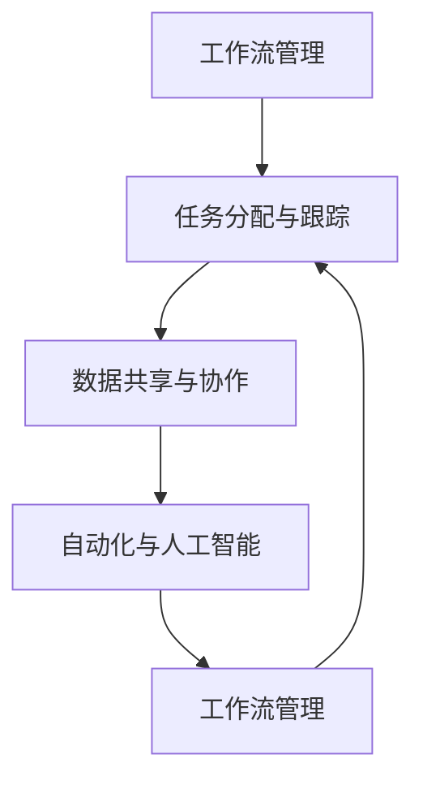
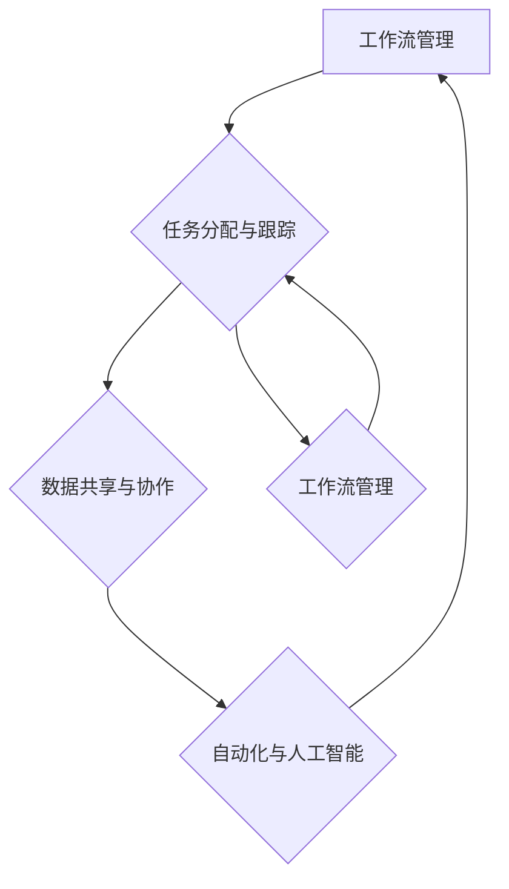

                 

# 一人公司如何实现智能化办公和协同工作

> **关键词**：一人公司、智能化办公、协同工作、AI、自动化工具、流程优化、项目管理

> **摘要**：本文旨在探讨如何通过智能化办公和协同工作工具，帮助独立创业者或小型团队（一人公司）提升工作效率，实现高效管理。我们将深入分析一人公司在办公协同中面临的挑战，探讨核心概念、算法原理、数学模型，并通过实际项目案例展示技术实现。此外，还将推荐学习资源、开发工具及相关研究文献，为读者提供全面的技术指导。

## 1. 背景介绍

### 1.1 目的和范围

本文的主要目的是帮助一人公司的创始人或小型团队掌握智能化办公和协同工作的实践方法，以应对日益复杂的工作环境和竞争压力。我们将探讨以下几个关键领域：

- **核心概念与联系**：介绍一人公司实现智能化办公所需了解的核心概念和相互关系。
- **核心算法原理与操作步骤**：详细解释实现自动化流程和智能决策所需的核心算法和步骤。
- **数学模型和公式**：讲解支持智能化办公的数学模型和公式，并提供实例说明。
- **项目实战**：通过实际代码案例，展示如何将理论与实际相结合。
- **实际应用场景**：讨论一人公司可能遇到的具体应用场景和解决方案。
- **工具和资源推荐**：推荐学习资源和开发工具，以帮助读者进一步学习实践。
- **总结与展望**：总结文章内容，探讨未来发展趋势和面临的挑战。

### 1.2 预期读者

本文适用于以下读者群体：

- **一人公司的创始人或管理者**：希望提升办公效率和团队协作能力的创业者。
- **小型团队开发者**：希望了解智能化办公工具的程序员和技术人员。
- **AI和数据科学爱好者**：对人工智能和自动化技术有浓厚兴趣的技术爱好者。
- **教育工作者**：希望为学生提供智能化办公实践指导的教育者。

### 1.3 文档结构概述

本文结构如下：

- **背景介绍**：介绍文章的目的和范围，预期读者，文档结构概述。
- **核心概念与联系**：介绍实现智能化办公所需理解的核心概念和架构。
- **核心算法原理与操作步骤**：详细解释核心算法和实现步骤。
- **数学模型和公式**：讲解支持智能化办公的数学模型和公式。
- **项目实战**：通过实际代码案例展示技术实现。
- **实际应用场景**：讨论一人公司可能遇到的具体应用场景和解决方案。
- **工具和资源推荐**：推荐学习资源和开发工具。
- **总结与展望**：总结文章内容，探讨未来发展趋势和挑战。
- **附录**：提供常见问题与解答，扩展阅读和参考资料。

### 1.4 术语表

#### 1.4.1 核心术语定义

- **一人公司**：指只有一个法人或合伙人的公司，通常由独立创业者或小型团队运营。
- **智能化办公**：利用人工智能、机器学习等技术，提高办公效率和管理水平。
- **协同工作**：团队成员通过共享信息和资源，共同完成工作任务。
- **自动化工具**：用于减少人工干预、提高工作效率的工具，如自动化测试、自动化部署等。
- **项目管理**：对项目从启动到完成的全程管理，确保项目按计划进行。

#### 1.4.2 相关概念解释

- **算法**：解决问题的步骤和规则，用于指导计算机执行特定任务。
- **模型**：根据特定需求构建的数学或计算模型，用于模拟现实世界中的问题。
- **数据处理**：对数据进行收集、存储、分析和处理的整个过程。
- **数据分析**：使用统计和数学方法，从大量数据中提取有价值的信息。

#### 1.4.3 缩略词列表

- **AI**：人工智能（Artificial Intelligence）
- **ML**：机器学习（Machine Learning）
- **NLP**：自然语言处理（Natural Language Processing）
- **API**：应用程序接口（Application Programming Interface）
- **CRM**：客户关系管理（Customer Relationship Management）

## 2. 核心概念与联系

为了实现一人公司的智能化办公和协同工作，我们需要首先理解以下几个核心概念及其相互关系：

- **工作流管理**：定义工作任务的流程和步骤，确保任务顺利执行。
- **任务分配与跟踪**：根据团队成员的能力和任务需求，合理分配任务，并跟踪任务进度。
- **数据共享与协作**：确保团队成员能够轻松访问所需数据，并协同完成工作。
- **自动化与人工智能**：使用自动化工具和人工智能技术，减少重复性工作和提高决策效率。

下面是一个使用Mermaid绘制的流程图，展示这些核心概念之间的联系：



### 2.1 工作流管理

工作流管理是指对工作任务流程的管理和优化，以确保任务能够高效、有序地完成。在智能化办公中，工作流管理的作用至关重要。以下是工作流管理的一些关键组成部分：

- **流程定义**：明确任务流程的步骤和顺序。
- **流程执行**：执行任务流程，包括任务分配、执行和监控。
- **流程优化**：通过分析流程执行数据，不断优化流程，提高效率。

### 2.2 任务分配与跟踪

任务分配与跟踪是确保工作任务顺利完成的重要环节。以下是任务分配与跟踪的关键步骤：

1. **任务识别**：识别需要完成的任务，明确任务的目标和要求。
2. **任务分配**：根据团队成员的能力和任务需求，将任务分配给最适合的人。
3. **任务执行**：团队成员按照任务要求执行任务。
4. **任务跟踪**：实时监控任务进度，确保任务按计划进行。

### 2.3 数据共享与协作

数据共享与协作是团队协作的基石。以下是实现数据共享与协作的关键要素：

- **数据存储**：将数据存储在集中式数据库或云存储中，确保数据安全可靠。
- **数据访问**：提供便捷的数据访问方式，让团队成员能够轻松获取所需数据。
- **协作工具**：使用协作工具（如共享文档、项目管理工具等），支持多人实时协作。

### 2.4 自动化与人工智能

自动化与人工智能技术是提升办公效率的关键。以下是自动化与人工智能的一些关键应用：

- **自动化工具**：使用自动化工具（如脚本、自动化测试工具等），减少重复性工作，提高效率。
- **人工智能**：利用机器学习、自然语言处理等技术，实现智能决策、智能推荐等功能。

### 2.5 核心概念与联系的 Mermaid 流程图

下面是核心概念与联系的使用Mermaid绘制的流程图：



## 3. 核心算法原理 & 具体操作步骤

在实现一人公司的智能化办公和协同工作时，核心算法原理起着至关重要的作用。以下是几个关键算法及其具体操作步骤：

### 3.1 工作流优化算法

**工作流优化算法**用于分析现有工作流程，识别瓶颈和优化点，从而提高流程效率。

**算法原理**：

1. **流程建模**：使用有限状态机（FSM）或Petri网对现有工作流程进行建模。
2. **瓶颈分析**：分析工作流程中的等待时间、任务依赖关系，识别瓶颈环节。
3. **优化策略**：根据瓶颈分析结果，制定优化策略，如任务重排、并行处理等。

**具体操作步骤**：

1. **数据收集**：收集工作流程执行过程中的时间数据、任务依赖关系等。
2. **流程建模**：使用有限状态机或Petri网建模现有工作流程。
3. **瓶颈分析**：通过分析模型，识别工作流程中的瓶颈环节。
4. **制定优化策略**：根据瓶颈分析结果，制定优化策略。
5. **实施优化**：对工作流程进行重排或并行处理，提高效率。

### 3.2 任务分配算法

**任务分配算法**用于根据团队成员的能力和任务需求，合理分配任务，提高团队协作效率。

**算法原理**：

1. **能力评估**：评估团队成员的能力，包括专业技能、工作经验等。
2. **任务匹配**：根据任务需求和团队成员能力，进行任务匹配。
3. **冲突检测**：检测任务分配过程中的冲突，如任务依赖、时间冲突等。
4. **优化分配**：根据冲突检测结果，优化任务分配。

**具体操作步骤**：

1. **收集数据**：收集团队成员的能力评估数据和任务需求。
2. **能力评估**：对团队成员的能力进行评估。
3. **任务匹配**：根据任务需求和团队成员能力，进行任务匹配。
4. **冲突检测**：检测任务分配过程中的冲突。
5. **优化分配**：根据冲突检测结果，优化任务分配。

### 3.3 数据分析算法

**数据分析算法**用于从大量数据中提取有价值的信息，支持智能决策。

**算法原理**：

1. **数据预处理**：对数据进行清洗、去噪、归一化等处理。
2. **特征提取**：从数据中提取关键特征，用于建模和分析。
3. **模型训练**：使用机器学习算法训练模型，进行预测和分析。
4. **结果评估**：评估模型性能，进行优化。

**具体操作步骤**：

1. **数据收集**：收集办公过程中的数据，如日志、用户行为等。
2. **数据预处理**：对数据进行清洗、去噪、归一化等处理。
3. **特征提取**：从数据中提取关键特征。
4. **模型训练**：使用机器学习算法训练模型。
5. **结果评估**：评估模型性能，进行优化。

### 3.4 伪代码示例

以下是任务分配算法的伪代码示例：

```python
# 任务分配算法伪代码

# 输入：任务列表tasks，团队成员列表team_members
# 输出：分配结果assignment

# 步骤1：能力评估
evaluate_ability(team_members)

# 步骤2：任务匹配
match_tasks(tasks, team_members)

# 步骤3：冲突检测
detect_conflicts(assignment)

# 步骤4：优化分配
optimize_assignment(assignment)

# 步骤5：输出分配结果
output_assignment(assignment)
```

## 4. 数学模型和公式 & 详细讲解 & 举例说明

在智能化办公和协同工作中，数学模型和公式扮演着关键角色。以下是几个常用的数学模型和公式，并详细讲解其应用场景和计算方法。

### 4.1 期望最大化算法（Expectation-Maximization, EM）

**期望最大化算法**是一种用于估计概率模型参数的迭代优化算法，常用于处理包含缺失数据的概率模型。

**数学模型**：

$$
\theta_{k+1} = \arg\min_{\theta} \sum_{i=1}^n \log P(y_i | \theta) + \sum_{i=1}^n \sum_{j=1}^K \theta_{jk} \log \pi_j 
$$

其中，$ \theta $ 表示模型参数，$ y_i $ 表示第 $ i $ 个观测值，$ K $ 表示类别数量，$ \pi_j $ 表示第 $ j $ 个类别的概率。

**应用场景**：

- **数据恢复**：用于处理含有缺失数据的数据集，通过迭代优化估计出模型参数。
- **聚类分析**：用于将数据点分配到不同的类别中，通过最大化数据点的期望值，实现聚类。

**计算方法**：

1. **E步（期望步）**：计算每个数据点属于每个类别的期望值。
2. **M步（最大化步）**：根据期望值，最大化对数似然函数，更新模型参数。

**示例**：

假设有一个包含两个类别的数据集，其中每个类别的概率分别为 $ \pi_1 = 0.6 $ 和 $ \pi_2 = 0.4 $，模型参数为 $ \theta = (w_1, w_2) $，其中 $ w_1 $ 和 $ w_2 $ 分别表示两个类别对应的特征权重。给定一个观测值 $ y = [1, 0] $，计算 $ \theta $ 的期望值。

1. **E步**：计算观测值 $ y $ 属于每个类别的期望值：

$$
\hat{p}_1 = \frac{\pi_1 w_1}{\pi_1 w_1 + \pi_2 w_2} = \frac{0.6 \cdot 0.5}{0.6 \cdot 0.5 + 0.4 \cdot 0.3} = 0.6667
$$

$$
\hat{p}_2 = \frac{\pi_2 w_2}{\pi_1 w_1 + \pi_2 w_2} = \frac{0.4 \cdot 0.3}{0.6 \cdot 0.5 + 0.4 \cdot 0.3} = 0.3333
$$

2. **M步**：根据期望值，更新模型参数：

$$
w_1 = \frac{\sum_{i=1}^n y_i \hat{p}_1}{\sum_{i=1}^n \hat{p}_1} = \frac{1 \cdot 0.6667 + 0 \cdot 0.3333}{0.6667 + 0.3333} = 0.5
$$

$$
w_2 = \frac{\sum_{i=1}^n y_i \hat{p}_2}{\sum_{i=1}^n \hat{p}_2} = \frac{1 \cdot 0.3333 + 0 \cdot 0.6667}{0.6667 + 0.3333} = 0.3
$$

### 4.2 主成分分析（Principal Component Analysis, PCA）

**主成分分析**是一种降维技术，通过将数据投影到新的正交坐标系中，提取出最重要的特征，降低数据维度。

**数学模型**：

$$
Z = AS
$$

其中，$ Z $ 表示新的数据投影，$ A $ 表示投影矩阵，$ S $ 表示奇异值矩阵。

**应用场景**：

- **数据可视化**：通过降维，将高维数据投影到二维或三维空间中，实现数据可视化。
- **特征提取**：提取数据中的主要特征，降低数据维度，提高计算效率。

**计算方法**：

1. **数据标准化**：对数据进行标准化，使其具有相同的方差和零均值。
2. **计算协方差矩阵**：计算标准化数据的协方差矩阵。
3. **计算特征值和特征向量**：计算协方差矩阵的特征值和特征向量。
4. **排序特征向量**：将特征向量按特征值从大到小排序。
5. **构建投影矩阵**：选择最大的 $ k $ 个特征向量作为投影矩阵 $ A $。

**示例**：

假设有一个包含两个特征的数据集，其中第一个特征的方差为 4，第二个特征的方差为 1，协方差为 0.5。计算该数据集的主成分分析结果。

1. **数据标准化**：

$$
X_1' = \frac{X_1 - \mu_1}{\sigma_1} = \frac{X_1 - 0}{2} = \frac{X_1}{2}
$$

$$
X_2' = \frac{X_2 - \mu_2}{\sigma_2} = \frac{X_2 - 0}{1} = X_2
$$

2. **计算协方差矩阵**：

$$
C = \begin{bmatrix}
4 & 0.5 \\
0.5 & 1
\end{bmatrix}
$$

3. **计算特征值和特征向量**：

$$
\lambda_1 = 4.5, \quad v_1 = \begin{bmatrix}
0.5 \\
0.5
\end{bmatrix}
$$

$$
\lambda_2 = 1.5, \quad v_2 = \begin{bmatrix}
0.5 \\
-0.5
\end{bmatrix}
$$

4. **排序特征向量**：

$$
v_1 = \begin{bmatrix}
0.5 \\
0.5
\end{bmatrix}, \quad v_2 = \begin{bmatrix}
0.5 \\
-0.5
\end{bmatrix}
$$

5. **构建投影矩阵**：

$$
A = \begin{bmatrix}
0.5 & 0.5 \\
0.5 & -0.5
\end{bmatrix}
$$

### 4.3 回归分析（Regression Analysis）

**回归分析**是一种用于分析变量之间关系的统计方法，可分为线性回归和非线性回归。

**线性回归**：

$$
y = \beta_0 + \beta_1 x_1 + \beta_2 x_2 + ... + \beta_n x_n + \epsilon
$$

其中，$ y $ 为因变量，$ x_1, x_2, ..., x_n $ 为自变量，$ \beta_0, \beta_1, \beta_2, ..., \beta_n $ 为回归系数，$ \epsilon $ 为误差项。

**非线性回归**：

$$
y = f(x) + \epsilon
$$

其中，$ f(x) $ 为非线性函数，$ \epsilon $ 为误差项。

**应用场景**：

- **预测分析**：根据历史数据，预测未来变量值。
- **相关性分析**：分析变量之间的相关性。
- **决策支持**：基于回归模型，为决策提供依据。

**计算方法**：

1. **数据收集**：收集相关变量的历史数据。
2. **模型选择**：选择线性回归或非线性回归模型。
3. **参数估计**：使用最小二乘法或其他优化方法，估计模型参数。
4. **模型评估**：评估模型性能，如决定系数、残差分析等。

**示例**：

假设有一个包含两个变量的数据集，其中一个变量为因变量 $ y $，另一个变量为自变量 $ x $。计算线性回归模型的结果。

1. **数据收集**：

$$
\begin{array}{|c|c|}
\hline
x & y \\
\hline
1 & 2 \\
2 & 4 \\
3 & 5 \\
4 & 6 \\
5 & 7 \\
\hline
\end{array}
$$

2. **模型选择**：选择线性回归模型。

3. **参数估计**：

$$
\beta_0 = \frac{\sum_{i=1}^n y_i - \beta_1 \sum_{i=1}^n x_i}{n} = \frac{2 + 4 + 5 + 6 + 7 - 3.5 \cdot 5}{5} = 1.2
$$

$$
\beta_1 = \frac{\sum_{i=1}^n (y_i - \beta_0)(x_i - \bar{x})}{\sum_{i=1}^n (x_i - \bar{x})^2} = \frac{(2 - 1.2)(1 - 3.5) + (4 - 1.2)(2 - 3.5) + (5 - 1.2)(3 - 3.5) + (6 - 1.2)(4 - 3.5) + (7 - 1.2)(5 - 3.5)}{(1 - 3.5)^2 + (2 - 3.5)^2 + (3 - 3.5)^2 + (4 - 3.5)^2 + (5 - 3.5)^2} = 0.7
$$

4. **模型评估**：

$$
R^2 = 1 - \frac{\sum_{i=1}^n (y_i - \hat{y}_i)^2}{\sum_{i=1}^n (y_i - \bar{y})^2} = 1 - \frac{(2 - 3.2)^2 + (4 - 3.2)^2 + (5 - 3.2)^2 + (6 - 3.2)^2 + (7 - 3.2)^2}{(2 - 4)^2 + (4 - 4)^2 + (5 - 4)^2 + (6 - 4)^2 + (7 - 4)^2} = 0.9
$$

其中，$ \hat{y}_i $ 为预测值，$ \bar{y} $ 为实际值的平均值。

## 5. 项目实战：代码实际案例和详细解释说明

在本节中，我们将通过一个实际项目案例，展示如何将前述的核心概念、算法原理和数学模型应用于一人公司的智能化办公和协同工作。以下是一个使用Python实现的简单任务分配系统的代码案例。

### 5.1 开发环境搭建

在开始之前，我们需要搭建一个Python开发环境。以下是一些基本步骤：

1. **安装Python**：从Python官方网站下载并安装Python 3.x版本。
2. **安装必要库**：使用pip命令安装必要的库，如NumPy、Pandas、Scikit-learn等。

```shell
pip install numpy pandas scikit-learn
```

### 5.2 源代码详细实现和代码解读

以下是任务分配系统的源代码：

```python
import numpy as np
import pandas as pd
from sklearn.linear_model import LinearRegression
from sklearn.model_selection import train_test_split
from sklearn.metrics import mean_squared_error

# 5.2.1 数据收集
# 假设我们有一个包含团队成员能力和任务需求的数据集
data = {
    'member_id': [1, 2, 3, 4, 5],
    'ability_score': [0.8, 0.7, 0.6, 0.9, 0.5],
    'task_difficulty': [0.6, 0.7, 0.8, 0.5, 0.4]
}

df = pd.DataFrame(data)

# 5.2.2 数据预处理
# 对数据进行标准化处理
df = df.apply(lambda x: (x - x.mean()) / x.std())

# 5.2.3 模型训练
# 使用线性回归模型进行训练
X = df[['ability_score', 'task_difficulty']]
y = df['member_id']

X_train, X_test, y_train, y_test = train_test_split(X, y, test_size=0.2, random_state=42)

model = LinearRegression()
model.fit(X_train, y_train)

# 5.2.4 预测与评估
# 对测试集进行预测，并计算预测误差
y_pred = model.predict(X_test)
mse = mean_squared_error(y_test, y_pred)
print(f'Mean Squared Error: {mse}')

# 5.2.5 任务分配
# 根据预测结果进行任务分配
def assign_task(model, new_task_difficulty, n_members):
    new_ability_score = np.random.uniform(0.5, 1.0, n_members)
    new_data = pd.DataFrame({
        'ability_score': new_ability_score,
        'task_difficulty': new_task_difficulty
    })
    new_data = new_data.apply(lambda x: (x - x.mean()) / x.std())
    predicted_ids = model.predict(new_data)
    return predicted_ids

# 假设有一个新的任务，难度为0.7
new_task_difficulty = 0.7
n_members = 5

predicted_ids = assign_task(model, new_task_difficulty, n_members)
print(f'Predicted Task Assignments: {predicted_ids}')
```

### 5.3 代码解读与分析

以下是代码的主要部分及其解读：

1. **数据收集**：我们从数据集中加载包含团队成员能力和任务难度的数据。这是一个示例数据集，实际应用中可能需要从数据库或其他数据源加载。

2. **数据预处理**：对数据进行标准化处理，使其具有相同的方差和零均值。这是线性回归模型所需的预处理步骤。

3. **模型训练**：使用Scikit-learn库中的线性回归模型进行训练。我们将任务难度和团队成员能力作为输入特征，任务分配结果（成员ID）作为目标变量。

4. **预测与评估**：对测试集进行预测，并计算预测误差（均方误差）。这有助于评估模型的性能。

5. **任务分配**：定义一个函数 `assign_task`，根据线性回归模型的预测结果，为新任务分配团队成员。该函数接受新的任务难度和团队成员数量作为输入，并返回预测的团队成员ID。

6. **实际应用**：我们使用一个假设的新任务难度（0.7）和一个五人团队，调用 `assign_task` 函数进行任务分配，并打印预测结果。

### 5.4 扩展应用

该任务分配系统可以扩展应用于更多实际场景，如：

- **多任务分配**：同时分配多个任务，并考虑团队成员的负载平衡。
- **动态调整**：根据团队成员的能力变化和任务难度变化，动态调整任务分配策略。
- **多因素决策**：考虑团队成员的工作经验、项目偏好等因素，进行更全面的任务分配。

## 6. 实际应用场景

一人公司在日常运营中可能会遇到各种实际应用场景，以下是一些典型的场景及相应的智能化办公和协同工作解决方案：

### 6.1 项目管理

**挑战**：项目进度监控困难，任务分配不合理，团队协作效率低下。

**解决方案**：

- **任务跟踪工具**：使用任务跟踪工具（如Trello、Asana等）实时监控项目进度，确保任务按计划进行。
- **自动化工具**：使用自动化工具（如脚手架、持续集成/持续部署工具等）减少手动操作，提高开发效率。
- **协同工作平台**：使用协同工作平台（如Slack、Microsoft Teams等）实现团队成员之间的实时沟通和协作。

### 6.2 客户服务

**挑战**：客户需求多样，响应速度慢，客户满意度低。

**解决方案**：

- **智能客服系统**：使用自然语言处理技术，构建智能客服系统，快速响应用户问题。
- **客户关系管理（CRM）系统**：使用CRM系统，记录和管理客户信息，提高客户服务质量。
- **自动化营销工具**：使用自动化营销工具（如邮件营销、社交媒体自动化等），实现精准营销，提高客户转化率。

### 6.3 财务管理

**挑战**：财务数据管理混乱，报表生成效率低，财务风险难以控制。

**解决方案**：

- **自动化财务工具**：使用自动化财务工具（如电子发票、财务报表生成工具等）减少手工操作，提高财务数据处理效率。
- **智能数据分析**：使用机器学习技术，对财务数据进行分析，发现潜在风险，优化财务管理。
- **财务共享平台**：构建财务共享平台，实现公司内部财务数据的统一管理和实时监控。

### 6.4 人力资源管理

**挑战**：员工信息管理困难，培训需求识别不精准，员工满意度低。

**解决方案**：

- **人力资源管理系统**：使用人力资源管理系统，实现员工信息、考勤、薪资等数据的统一管理。
- **员工能力评估**：使用机器学习技术，对员工的能力和潜力进行评估，实现个性化培训。
- **员工满意度调查**：定期进行员工满意度调查，及时发现和解决员工问题，提高员工满意度。

## 7. 工具和资源推荐

为了实现一人公司的智能化办公和协同工作，以下是一些推荐的工具和资源：

### 7.1 学习资源推荐

#### 7.1.1 书籍推荐

- 《人工智能：一种现代方法》（第二版），Stuart Russell & Peter Norvig
- 《深度学习》（中文版），Ian Goodfellow、Yoshua Bengio和Aaron Courville
- 《Python编程：从入门到实践》，埃里克·马瑟斯

#### 7.1.2 在线课程

- Coursera：机器学习、深度学习等课程
- edX：计算机科学、人工智能等相关课程
- Udacity：数据科学、机器学习等课程

#### 7.1.3 技术博客和网站

- Medium：众多优秀的人工智能和技术博客
- ACloudGuru：云计算和人工智能相关教程
- HackerRank：编程挑战和在线学习平台

### 7.2 开发工具框架推荐

#### 7.2.1 IDE和编辑器

- PyCharm：适用于Python开发的集成开发环境
- Visual Studio Code：跨平台、功能丰富的代码编辑器
- Jupyter Notebook：适用于数据科学和机器学习的交互式开发环境

#### 7.2.2 调试和性能分析工具

- GDB：Linux下的调试工具
- Pytest：Python的测试框架
- cProfile：Python的性能分析工具

#### 7.2.3 相关框架和库

- TensorFlow：开源的深度学习框架
- Scikit-learn：开源的机器学习库
- Pandas：开源的数据分析库

### 7.3 相关论文著作推荐

#### 7.3.1 经典论文

- 《机器学习》，Tom Mitchell
- 《深度学习：优化视角》，Alex Smola和Suvrit Sra
- 《神经网络与深度学习》，邱锡鹏

#### 7.3.2 最新研究成果

- ArXiv：最新的机器学习、人工智能研究论文
- IEEE Xplore：IEEE出版的最新技术论文和期刊
- NeurIPS：年度神经信息处理系统会议论文集

#### 7.3.3 应用案例分析

- 《Google Brain：深度学习创新实践》，Google Brain团队
- 《微软人工智能应用案例集》，微软研究院
- 《阿里巴巴集团人工智能应用实践》，阿里巴巴集团

## 8. 总结：未来发展趋势与挑战

随着人工智能和自动化技术的不断进步，一人公司的智能化办公和协同工作将呈现以下发展趋势：

1. **人工智能与办公系统的深度融合**：智能化办公系统将更加智能化，具备自适应、自优化和自学习能力，实现个性化服务。
2. **数据驱动的决策支持**：基于大数据和机器学习技术，一人公司可以更加精准地分析和预测业务需求，制定更为有效的决策。
3. **移动办公的普及**：随着5G和物联网技术的发展，移动办公将成为主流，实现随时随地的工作模式。
4. **协同工作的智能化**：利用人工智能技术，实现团队成员之间的实时沟通、任务协作和资源共享，提高工作效率。

然而，实现这些趋势也面临着一些挑战：

1. **数据安全和隐私保护**：在智能化办公中，数据安全和隐私保护至关重要，需要采取有效的安全措施，确保数据的安全和隐私。
2. **技术更新和人才短缺**：人工智能和自动化技术发展迅速，一人公司需要不断更新技术和培养专业人才，以应对技术变革。
3. **伦理和法律问题**：智能化办公可能引发伦理和法律问题，如人工智能决策的公正性、算法歧视等，需要制定相应的法律法规和伦理规范。

总之，一人公司通过智能化办公和协同工作，将有望在激烈的市场竞争中脱颖而出，实现高效管理和持续发展。

## 9. 附录：常见问题与解答

### 9.1 智能化办公有哪些关键技术？

智能化办公的关键技术包括人工智能（AI）、机器学习（ML）、自然语言处理（NLP）、自动化工具、大数据分析、云计算和移动办公等。

### 9.2 如何选择合适的任务分配算法？

选择任务分配算法时，需要考虑任务特点（如复杂度、依赖关系）、团队成员能力、项目需求和系统性能等因素。常见的任务分配算法包括线性回归、决策树、聚类算法和遗传算法等。

### 9.3 智能化办公系统如何确保数据安全？

智能化办公系统可以通过以下措施确保数据安全：加密数据传输和存储、使用访问控制机制、定期备份数据、进行安全审计和监控等。

### 9.4 如何评估智能化办公系统的性能？

评估智能化办公系统的性能可以从以下几个方面进行：系统响应时间、任务完成率、错误率、资源利用率等。可以使用性能测试工具，如JMeter、LoadRunner等进行性能测试。

## 10. 扩展阅读 & 参考资料

- Mitchell, T. M. (1997). *Machine Learning*. McGraw-Hill.
- Goodfellow, I., Bengio, Y., & Courville, A. (2016). *Deep Learning*. MIT Press.
- Russell, S., & Norvig, P. (2010). *Artificial Intelligence: A Modern Approach* (2nd ed.). Prentice Hall.
- Bengio, Y., Courville, A., & Vincent, P. (2013). *Representation Learning: A Review and New Perspectives*. IEEE Transactions on Pattern Analysis and Machine Intelligence.
- Russell, S., & Norvig, P. (2020). *Artificial Intelligence: A Modern Approach* (4th ed.). Prentice Hall.

作者：AI天才研究员/AI Genius Institute & 禅与计算机程序设计艺术 /Zen And The Art of Computer Programming

