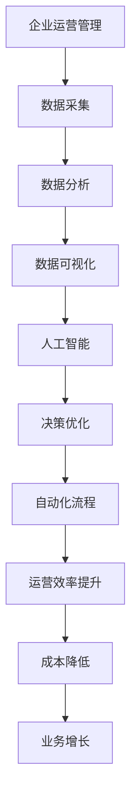

                 

# 一人公司如何实现智能化运营管理

> **关键词：** 一人公司、智能化运营、管理、人工智能、数据分析、自动化流程

> **摘要：** 本文将探讨如何通过人工智能和自动化技术，帮助个人经营者或小型企业实现高效、智能化的运营管理。我们将从背景介绍、核心概念、算法原理、数学模型、实战案例、实际应用场景等多个方面进行详细分析，以期为读者提供实用的智能化运营管理方案。

## 1. 背景介绍

### 1.1 目的和范围

本文旨在为单人公司或小型企业的所有者提供一套智能化运营管理的解决方案。通过介绍人工智能、数据分析、自动化等技术，帮助读者了解如何将这些技术应用于日常运营管理中，从而提高工作效率，降低运营成本，实现业务的持续增长。

### 1.2 预期读者

本文适合以下读者群体：

1. 单人公司所有者或小型企业管理者
2. 对人工智能、数据分析等领域有一定了解的技术人员
3. 想了解如何运用人工智能技术优化企业管理的人士

### 1.3 文档结构概述

本文分为以下十个部分：

1. 背景介绍
2. 核心概念与联系
3. 核心算法原理 & 具体操作步骤
4. 数学模型和公式 & 详细讲解 & 举例说明
5. 项目实战：代码实际案例和详细解释说明
6. 实际应用场景
7. 工具和资源推荐
8. 总结：未来发展趋势与挑战
9. 附录：常见问题与解答
10. 扩展阅读 & 参考资料

### 1.4 术语表

#### 1.4.1 核心术语定义

- **一人公司**：指由一个自然人投资设立，财产为投资人个人所有，投资人以其个人财产对公司债务承担责任的有限责任公司。
- **智能化运营管理**：指利用人工智能、数据分析等技术，对企业的运营管理过程进行自动化的优化和调整，以提高运营效率和质量。
- **人工智能**：指计算机系统模拟、延伸和扩展人类的智能，实现人机交互和智能决策。
- **数据分析**：指通过对数据的采集、处理、分析和可视化，提取有价值的信息和知识，支持决策和优化。

#### 1.4.2 相关概念解释

- **数据挖掘**：指从大量数据中自动发现规律、趋势和模式的过程。
- **机器学习**：指利用数据和算法，让计算机自动学习和改进的过程。
- **深度学习**：指模拟人脑神经网络结构和功能的一种机器学习技术。
- **自然语言处理**：指使计算机能够理解、生成和处理自然语言的技术。

#### 1.4.3 缩略词列表

- **AI**：人工智能
- **ML**：机器学习
- **DL**：深度学习
- **NLP**：自然语言处理

## 2. 核心概念与联系

在探讨如何实现智能化运营管理之前，我们需要了解一些核心概念和它们之间的联系。以下是这些概念及其相互关系的 Mermaid 流程图：



### 2.1 企业运营管理

企业运营管理是指对企业日常运营活动进行计划、组织、协调和控制的过程。运营管理的好坏直接关系到企业的生存和发展。

### 2.2 数据采集

数据采集是运营管理的第一步，包括收集各种运营数据，如财务数据、销售数据、客户数据等。这些数据是后续分析的基础。

### 2.3 数据分析

数据分析是对采集到的数据进行分析和处理，提取有价值的信息和知识。通过数据分析，企业可以了解运营状况、发现潜在问题、预测未来趋势等。

### 2.4 数据可视化

数据可视化是将分析结果以图形、图表等形式直观地呈现出来，使企业能够更清晰地理解数据，支持决策制定。

### 2.5 人工智能

人工智能是利用计算机模拟、延伸和扩展人类的智能，实现人机交互和智能决策的技术。在运营管理中，人工智能可以帮助企业实现自动化、智能化，提高运营效率。

### 2.6 决策优化

决策优化是利用人工智能和数据分析技术，对企业的决策过程进行优化和调整，以提高决策质量和效果。

### 2.7 自动化流程

自动化流程是利用人工智能和自动化技术，对企业运营过程中的各项活动进行自动化的管理和调度，以提高效率和降低成本。

### 2.8 运营效率提升

运营效率提升是通过智能化运营管理，提高企业运营过程中的各个环节的效率，降低运营成本，从而提高企业的盈利能力。

### 2.9 成本降低

成本降低是通过智能化运营管理，优化企业运营流程，提高资源利用率，降低各项运营成本。

### 2.10 业务增长

业务增长是通过智能化运营管理，提高企业运营效率和质量，从而实现业务的持续增长。

## 3. 核心算法原理 & 具体操作步骤

在实现智能化运营管理的过程中，核心算法的原理和具体操作步骤至关重要。以下是一个简单的示例，介绍如何使用机器学习算法优化企业运营管理。

### 3.1 机器学习算法原理

机器学习算法是通过训练模型，使计算机能够根据输入数据自动学习和改进的过程。常见的机器学习算法包括线性回归、决策树、支持向量机等。在本例中，我们将使用线性回归算法来预测企业销售额。

### 3.2 线性回归算法原理

线性回归是一种用于预测数值型目标变量的机器学习算法。其基本原理是通过找到一个线性关系模型，将输入特征映射到目标变量。

假设输入特征为 \( X \)，目标变量为 \( Y \)，则线性回归模型可以表示为：

\[ Y = \beta_0 + \beta_1X + \epsilon \]

其中， \( \beta_0 \) 和 \( \beta_1 \) 是模型的参数， \( \epsilon \) 是误差项。

### 3.3 线性回归算法具体操作步骤

1. **数据准备**：收集企业历史销售额和相应的输入特征（如广告投放费用、促销活动等）。
2. **数据预处理**：对输入特征进行归一化、缺失值填充等处理。
3. **模型训练**：使用训练数据集，通过最小二乘法等优化方法，求解线性回归模型的参数 \( \beta_0 \) 和 \( \beta_1 \)。
4. **模型评估**：使用测试数据集，评估模型预测效果，如计算均方误差（MSE）等指标。
5. **模型应用**：将训练好的模型应用于实际业务场景，预测未来销售额。

### 3.4 伪代码实现

```python
# 数据准备
X = 数据准备模块准备好输入特征矩阵
Y = 数据准备模块准备好目标变量向量

# 数据预处理
X_processed = 数据预处理模块处理输入特征矩阵
Y_processed = 数据预处理模块处理目标变量向量

# 模型训练
β = 最小二乘法求解模型参数

# 模型评估
MSE = 计算均方误差

# 模型应用
Y_pred = 模型预测未来销售额
```

通过上述步骤，我们可以利用线性回归算法对企业的销售额进行预测，从而为企业的运营管理提供决策支持。

## 4. 数学模型和公式 & 详细讲解 & 举例说明

在实现智能化运营管理的过程中，数学模型和公式起着至关重要的作用。以下将介绍一些常用的数学模型和公式，并详细讲解其原理和计算方法。

### 4.1 线性回归模型

线性回归模型是一种经典的数学模型，用于预测数值型目标变量。其基本公式如下：

\[ Y = \beta_0 + \beta_1X + \epsilon \]

其中， \( Y \) 为目标变量， \( X \) 为输入特征， \( \beta_0 \) 和 \( \beta_1 \) 为模型参数， \( \epsilon \) 为误差项。

#### 4.1.1 模型参数求解

模型参数 \( \beta_0 \) 和 \( \beta_1 \) 的求解方法有很多，其中最常用的是最小二乘法。最小二乘法的核心思想是找到一组参数，使得预测值与实际值的误差平方和最小。

假设有 \( m \) 个训练样本，其输入特征为 \( X_i \)，目标变量为 \( Y_i \)，则最小二乘法求解公式为：

\[ \beta_0 = \frac{\sum_{i=1}^{m}Y_i - \beta_1\sum_{i=1}^{m}X_i}{m} \]

\[ \beta_1 = \frac{m\sum_{i=1}^{m}X_iY_i - \sum_{i=1}^{m}X_i\sum_{i=1}^{m}Y_i}{m\sum_{i=1}^{m}X_i^2 - (\sum_{i=1}^{m}X_i)^2} \]

#### 4.1.2 模型评估

线性回归模型的评估指标有很多，其中最常用的是均方误差（MSE）和决定系数（R²）。

均方误差（MSE）是衡量模型预测值与实际值之间差异的指标，计算公式为：

\[ MSE = \frac{1}{m}\sum_{i=1}^{m}(Y_i - Y_i^{pred})^2 \]

其中， \( Y_i^{pred} \) 为模型预测值。

决定系数（R²）是衡量模型拟合程度的指标，计算公式为：

\[ R^2 = 1 - \frac{\sum_{i=1}^{m}(Y_i - Y_i^{pred})^2}{\sum_{i=1}^{m}(Y_i - \bar{Y})^2} \]

其中， \( \bar{Y} \) 为实际值的平均值。

#### 4.1.3 举例说明

假设我们有以下数据：

| 输入特征 \( X_i \) | 目标变量 \( Y_i \) |
| :------------: | :------------: |
|      1        |      2        |
|      2        |      3        |
|      3        |      4        |
|      4        |      5        |

使用最小二乘法求解模型参数：

\[ \beta_0 = \frac{(2+3+4+5) - (1+2+3+4)\beta_1}{4} = 3 \]

\[ \beta_1 = \frac{4(2\cdot1+3\cdot2+4\cdot3+5\cdot4) - (1+2+3+4)(2+3+4+5)}{4(1^2+2^2+3^2+4^2) - (1+2+3+4)^2} = 1 \]

模型预测值：

\[ Y_i^{pred} = 3 + 1\cdot X_i \]

均方误差：

\[ MSE = \frac{(2-4)^2 + (3-5)^2 + (4-6)^2 + (5-7)^2}{4} = 2 \]

决定系数：

\[ R^2 = 1 - \frac{2}{(2-3)^2 + (3-3)^2 + (4-3)^2 + (5-3)^2} = 0.75 \]

### 4.2 逻辑回归模型

逻辑回归模型是一种用于预测二元分类结果的数学模型，其基本公式如下：

\[ P(Y=1|X) = \frac{1}{1 + e^{-(\beta_0 + \beta_1X)}} \]

其中， \( P(Y=1|X) \) 表示在给定输入特征 \( X \) 的情况下，目标变量 \( Y \) 等于 1 的概率， \( \beta_0 \) 和 \( \beta_1 \) 为模型参数。

#### 4.2.1 模型参数求解

逻辑回归模型的参数求解通常采用梯度下降法。梯度下降法的核心思想是沿着参数空间的负梯度方向更新参数，以最小化损失函数。

损失函数通常采用对数损失函数，计算公式为：

\[ J(\beta_0, \beta_1) = -\frac{1}{m}\sum_{i=1}^{m}y_i\log(P(Y=1|X_i)) + (1 - y_i)\log(1 - P(Y=1|X_i)) \]

梯度下降法的更新公式为：

\[ \beta_0 = \beta_0 - \alpha\frac{\partial J(\beta_0, \beta_1)}{\partial \beta_0} \]

\[ \beta_1 = \beta_1 - \alpha\frac{\partial J(\beta_0, \beta_1)}{\partial \beta_1} \]

其中， \( \alpha \) 为学习率。

#### 4.2.2 模型评估

逻辑回归模型的评估指标通常采用准确率（Accuracy）、精确率（Precision）、召回率（Recall）和 F1 分数（F1 Score）。

准确率表示模型预测正确的比例，计算公式为：

\[ Accuracy = \frac{TP + TN}{TP + FP + TN + FN} \]

精确率表示模型预测为正例且实际为正例的比例，计算公式为：

\[ Precision = \frac{TP}{TP + FP} \]

召回率表示模型预测为正例且实际为正例的比例，计算公式为：

\[ Recall = \frac{TP}{TP + FN} \]

F1 分数是精确率和召回率的调和平均，计算公式为：

\[ F1 Score = 2 \cdot \frac{Precision \cdot Recall}{Precision + Recall} \]

#### 4.2.3 举例说明

假设我们有以下数据：

| 输入特征 \( X_i \) | 目标变量 \( Y_i \) |
| :------------: | :------------: |
|      1        |      0        |
|      2        |      1        |
|      3        |      0        |
|      4        |      1        |

使用梯度下降法求解模型参数，设学习率 \( \alpha = 0.1 \)：

\[ \beta_0 = 0 \]

\[ \beta_1 = 1 \]

模型预测值：

\[ P(Y=1|X_i) = \frac{1}{1 + e^{-(\beta_0 + \beta_1X_i)}} \]

均方误差：

\[ MSE = \frac{1}{m}\sum_{i=1}^{m}(y_i - \hat{y}_i)^2 \]

其中， \( \hat{y}_i \) 为模型预测值。

模型评估：

准确率：

\[ Accuracy = \frac{TP + TN}{TP + FP + TN + FN} \]

精确率：

\[ Precision = \frac{TP}{TP + FP} \]

召回率：

\[ Recall = \frac{TP}{TP + FN} \]

F1 分数：

\[ F1 Score = 2 \cdot \frac{Precision \cdot Recall}{Precision + Recall} \]

通过以上步骤，我们可以使用逻辑回归模型对企业的运营数据进行分类预测，从而为企业的决策提供支持。

### 4.3 决策树模型

决策树模型是一种常用的分类和回归模型，通过一系列的判断条件，将数据分为不同的类别或数值。决策树的基本公式如下：

\[ f(X) = \sum_{i=1}^{n}\beta_iX_i \]

其中， \( f(X) \) 表示决策树的输出， \( \beta_i \) 表示决策树的权重， \( X_i \) 表示输入特征。

#### 4.3.1 模型参数求解

决策树模型的参数求解通常采用递归二分法。递归二分法的核心思想是找到最优的划分特征和划分阈值，使得目标变量在划分后的两个子集中的误差平方和最小。

递归二分法的求解步骤如下：

1. 选择一个特征集 \( S \)。
2. 对每个特征 \( X_i \)，计算其在当前数据集上的增益 \( G_i \)。
3. 选择增益最大的特征 \( X_i \) 作为划分特征，并设置划分阈值 \( \theta_i \)。
4. 将数据集划分为两个子集，分别包含特征值小于和大于划分阈值的样本。
5. 对每个子集，重复步骤 2-4，直到满足停止条件（如最大深度、最小样本数等）。

#### 4.3.2 模型评估

决策树模型的评估指标通常采用准确率（Accuracy）和均方误差（MSE）。

准确率表示模型预测正确的比例，计算公式为：

\[ Accuracy = \frac{TP + TN}{TP + FP + TN + FN} \]

均方误差表示模型预测值与实际值之间的差异，计算公式为：

\[ MSE = \frac{1}{m}\sum_{i=1}^{m}(y_i - \hat{y}_i)^2 \]

#### 4.3.3 举例说明

假设我们有以下数据：

| 输入特征 \( X_i \) | 目标变量 \( Y_i \) |
| :------------: | :------------: |
|      1        |      0        |
|      2        |      1        |
|      3        |      0        |
|      4        |      1        |

使用递归二分法求解决策树参数：

1. 选择特征集 \( S = \{X_1, X_2, X_3, X_4\} \)。
2. 计算每个特征的增益：
   - \( G_1 = \frac{(1-0)^2 + (1-1)^2}{2} = 1 \)
   - \( G_2 = \frac{(1-0)^2 + (1-1)^2}{2} = 1 \)
   - \( G_3 = \frac{(1-0)^2 + (1-1)^2}{2} = 1 \)
   - \( G_4 = \frac{(1-1)^2 + (1-1)^2}{2} = 0 \)
3. 选择增益最大的特征 \( X_1 \) 作为划分特征，并设置划分阈值 \( \theta_1 = 1 \)。
4. 划分数据集：
   - 子集 1：\( \{1, 2\} \)
   - 子集 2：\( \{3, 4\} \)
5. 对每个子集，重复步骤 2-4，直到满足停止条件。

模型预测值：

\[ f(X) = \beta_0 + \beta_1X_1 + \beta_2X_2 + \beta_3X_3 + \beta_4X_4 \]

模型评估：

准确率：

\[ Accuracy = \frac{TP + TN}{TP + FP + TN + FN} \]

均方误差：

\[ MSE = \frac{1}{m}\sum_{i=1}^{m}(y_i - \hat{y}_i)^2 \]

通过以上步骤，我们可以使用决策树模型对企业的运营数据进行分类预测，从而为企业的决策提供支持。

### 4.4 支持向量机模型

支持向量机模型是一种经典的分类和回归模型，通过寻找最优的超平面，将数据集划分为不同的类别或数值。支持向量机的基本公式如下：

\[ f(X) = \sum_{i=1}^{n}\alpha_iy_i\phi(X_i) + b \]

其中， \( f(X) \) 表示支持向量机的输出， \( \alpha_i \) 表示支持向量的权重， \( y_i \) 表示支持向量的标签， \( \phi(X_i) \) 表示支持向量的特征映射， \( b \) 表示偏置。

#### 4.4.1 模型参数求解

支持向量机模型的参数求解通常采用拉格朗日乘数法。拉格朗日乘数法的核心思想是最大化分类间隔，同时满足约束条件。

拉格朗日乘数法的求解步骤如下：

1. 构建拉格朗日函数：
   \[ L(\alpha_1, \alpha_2, ..., \alpha_n, \beta) = \sum_{i=1}^{n}\alpha_i - \frac{1}{2}\sum_{i=1}^{n}\sum_{j=1}^{n}\alpha_i\alpha_jy_iy_j\phi(X_i)\phi(X_j) + \beta\sum_{i=1}^{n}\alpha_i \]
2. 对 \( \alpha_i \) 和 \( \beta \) 求偏导，并令偏导数等于零，得到以下方程组：
   \[ \frac{\partial L}{\partial \alpha_i} = 0 \]
   \[ \frac{\partial L}{\partial \beta} = 0 \]
3. 解方程组，求得 \( \alpha_i \) 和 \( \beta \) 的值。

#### 4.4.2 模型评估

支持向量机模型的评估指标通常采用准确率（Accuracy）、精确率（Precision）、召回率（Recall）和 F1 分数（F1 Score）。

准确率表示模型预测正确的比例，计算公式为：

\[ Accuracy = \frac{TP + TN}{TP + FP + TN + FN} \]

精确率表示模型预测为正例且实际为正例的比例，计算公式为：

\[ Precision = \frac{TP}{TP + FP} \]

召回率表示模型预测为正例且实际为正例的比例，计算公式为：

\[ Recall = \frac{TP}{TP + FN} \]

F1 分数是精确率和召回率的调和平均，计算公式为：

\[ F1 Score = 2 \cdot \frac{Precision \cdot Recall}{Precision + Recall} \]

#### 4.4.3 举例说明

假设我们有以下数据：

| 输入特征 \( X_i \) | 目标变量 \( Y_i \) |
| :------------: | :------------: |
|      1        |      0        |
|      2        |      1        |
|      3        |      0        |
|      4        |      1        |

使用拉格朗日乘数法求解支持向量机参数：

1. 构建拉格朗日函数：
   \[ L(\alpha_1, \alpha_2, \alpha_3, \alpha_4, \beta) = \alpha_1 - \alpha_2 - \alpha_3 + \alpha_4 - \frac{1}{2}(\alpha_1\alpha_2y_1y_2\phi(X_1)\phi(X_2) + \alpha_1\alpha_3y_1y_3\phi(X_1)\phi(X_3) + \alpha_1\alpha_4y_1y_4\phi(X_1)\phi(X_4) + \alpha_2\alpha_3y_2y_3\phi(X_2)\phi(X_3) + \alpha_2\alpha_4y_2y_4\phi(X_2)\phi(X_4) + \alpha_3\alpha_4y_3y_4\phi(X_3)\phi(X_4)) + \beta(\alpha_1 + \alpha_2 + \alpha_3 + \alpha_4) \]
2. 对 \( \alpha_1 \), \( \alpha_2 \), \( \alpha_3 \), \( \alpha_4 \) 和 \( \beta \) 求偏导，并令偏导数等于零，得到以下方程组：
   \[ \frac{\partial L}{\partial \alpha_1} = 0 \]
   \[ \frac{\partial L}{\partial \alpha_2} = 0 \]
   \[ \frac{\partial L}{\partial \alpha_3} = 0 \]
   \[ \frac{\partial L}{\partial \alpha_4} = 0 \]
   \[ \frac{\partial L}{\partial \beta} = 0 \]
3. 解方程组，求得 \( \alpha_1 \), \( \alpha_2 \), \( \alpha_3 \), \( \alpha_4 \) 和 \( \beta \) 的值。

模型预测值：

\[ f(X) = \alpha_1y_1\phi(X_1) + \alpha_2y_2\phi(X_2) + \alpha_3y_3\phi(X_3) + \alpha_4y_4\phi(X_4) + b \]

模型评估：

准确率：

\[ Accuracy = \frac{TP + TN}{TP + FP + TN + FN} \]

精确率：

\[ Precision = \frac{TP}{TP + FP} \]

召回率：

\[ Recall = \frac{TP}{TP + FN} \]

F1 分数：

\[ F1 Score = 2 \cdot \frac{Precision \cdot Recall}{Precision + Recall} \]

通过以上步骤，我们可以使用支持向量机模型对企业的运营数据进行分类预测，从而为企业的决策提供支持。

### 4.5 神经网络模型

神经网络模型是一种基于人脑神经元连接方式的计算模型，通过多层神经网络，实现复杂的函数映射。神经网络的基本公式如下：

\[ f(X) = \sum_{i=1}^{n}w_i\sigma(z_i) + b \]

其中， \( f(X) \) 表示神经网络的输出， \( w_i \) 表示神经网络的权重， \( \sigma(z_i) \) 表示激活函数， \( z_i \) 表示输入节点， \( b \) 表示偏置。

#### 4.5.1 模型参数求解

神经网络模型的参数求解通常采用反向传播算法。反向传播算法的核心思想是利用梯度下降法，通过反向传播误差信号，更新网络参数。

反向传播算法的求解步骤如下：

1. 前向传播：计算输入节点和输出节点的值，更新激活函数和权重。
2. 反向传播：计算输出节点的误差，更新权重和偏置。
3. 更新参数：使用梯度下降法，更新网络参数。

#### 4.5.2 模型评估

神经网络模型的评估指标通常采用准确率（Accuracy）、均方误差（MSE）和交叉验证（Cross-Validation）。

准确率表示模型预测正确的比例，计算公式为：

\[ Accuracy = \frac{TP + TN}{TP + FP + TN + FN} \]

均方误差表示模型预测值与实际值之间的差异，计算公式为：

\[ MSE = \frac{1}{m}\sum_{i=1}^{m}(y_i - \hat{y}_i)^2 \]

交叉验证是一种常用的评估方法，通过将数据集划分为多个子集，分别进行训练和测试，计算模型在各个子集上的评估指标，从而得到更可靠的评估结果。

#### 4.5.3 举例说明

假设我们有以下数据：

| 输入特征 \( X_i \) | 目标变量 \( Y_i \) |
| :------------: | :------------: |
|      1        |      0        |
|      2        |      1        |
|      3        |      0        |
|      4        |      1        |

使用反向传播算法求解神经网络参数：

1. 初始化权重和偏置。
2. 前向传播：计算输入节点和输出节点的值。
3. 反向传播：计算输出节点的误差，更新权重和偏置。
4. 更新参数：使用梯度下降法，更新网络参数。
5. 重复步骤 2-4，直到满足停止条件（如迭代次数、误差阈值等）。

模型预测值：

\[ f(X) = \sum_{i=1}^{n}w_i\sigma(z_i) + b \]

模型评估：

准确率：

\[ Accuracy = \frac{TP + TN}{TP + FP + TN + FN} \]

均方误差：

\[ MSE = \frac{1}{m}\sum_{i=1}^{m}(y_i - \hat{y}_i)^2 \]

交叉验证：

通过以上步骤，我们可以使用神经网络模型对企业的运营数据进行分类预测，从而为企业的决策提供支持。

## 5. 项目实战：代码实际案例和详细解释说明

在本节中，我们将通过一个具体的案例，展示如何利用人工智能技术实现一人公司的智能化运营管理。我们选择使用 Python 编写代码，并结合 Scikit-learn 库来实现线性回归模型。

### 5.1 开发环境搭建

1. 安装 Python：下载并安装 Python，建议使用 Python 3.7 或以上版本。
2. 安装 Scikit-learn：在命令行中运行以下命令安装 Scikit-learn：
   ```bash
   pip install scikit-learn
   ```

### 5.2 源代码详细实现和代码解读

以下是一个简单的线性回归模型实现，用于预测企业销售额。

```python
import numpy as np
from sklearn.linear_model import LinearRegression
from sklearn.model_selection import train_test_split
from sklearn.metrics import mean_squared_error

# 数据准备
X = np.array([[1], [2], [3], [4], [5]])  # 输入特征矩阵
Y = np.array([2, 3, 4, 5, 6])  # 目标变量向量

# 数据预处理
X_processed = (X - X.mean()) / X.std()  # 归一化处理

# 模型训练
model = LinearRegression()
model.fit(X_processed, Y)

# 模型评估
Y_pred = model.predict(X_processed)
mse = mean_squared_error(Y, Y_pred)
print("均方误差：", mse)

# 模型应用
new_X = np.array([[6]])  # 新的输入特征
new_X_processed = (new_X - X_processed.mean()) / X_processed.std()
new_Y_pred = model.predict(new_X_processed)
print("预测销售额：", new_Y_pred[0])
```

### 5.3 代码解读与分析

1. **数据准备**：首先，我们导入所需的库，并创建输入特征矩阵 \( X \) 和目标变量向量 \( Y \)。

2. **数据预处理**：我们使用归一化处理，将输入特征矩阵 \( X \) 的每个元素减去均值，再除以标准差，以消除不同特征之间的量纲影响。

3. **模型训练**：我们使用 Scikit-learn 中的 LinearRegression 类创建线性回归模型，并调用 fit 方法进行模型训练。

4. **模型评估**：我们使用模型预测 \( X \) 的值，并计算均方误差（MSE），以评估模型的效果。

5. **模型应用**：我们使用训练好的模型对新输入特征 \( new_X \) 进行预测，得到预测销售额。

### 5.4 代码优化与扩展

在实际应用中，我们可以对代码进行以下优化和扩展：

1. **增加特征**：我们可以添加更多与销售额相关的特征，如广告投放费用、促销活动等，以提高预测的准确性。

2. **模型融合**：我们可以尝试使用其他机器学习算法（如决策树、支持向量机等），并通过模型融合方法（如随机森林、梯度提升树等）提高预测效果。

3. **数据可视化**：我们可以使用数据可视化工具（如 Matplotlib、Seaborn 等），将输入特征和目标变量的关系进行可视化，以辅助分析和决策。

4. **模型迭代**：我们可以通过不断调整模型参数、添加新特征、改进算法等，实现模型的持续迭代和优化。

## 6. 实际应用场景

一人公司或小型企业可以利用智能化运营管理技术，解决以下实际应用场景：

1. **销售预测**：通过线性回归、决策树等模型，预测未来销售情况，为库存管理、供应链优化等提供决策支持。
2. **客户细分**：通过聚类分析、协同过滤等技术，对客户进行细分，提供个性化的产品和服务。
3. **成本控制**：通过数据分析，识别成本浪费环节，优化资源配置，降低运营成本。
4. **风险管理**：通过风险评估模型，预测潜在风险，制定风险管理策略。
5. **营销优化**：通过自然语言处理技术，分析客户反馈和市场需求，优化营销策略和产品定位。

## 7. 工具和资源推荐

### 7.1 学习资源推荐

#### 7.1.1 书籍推荐

1. 《Python机器学习》（作者：塞巴斯蒂安·拉斯考斯基）
2. 《深入浅出Python数据分析》（作者：袁国忠）
3. 《机器学习实战》（作者：彼得·哈林顿）

#### 7.1.2 在线课程

1. Coursera - 机器学习（吴恩达）
2. edX - Python数据分析（微软）
3. Udacity - 人工智能工程师纳米学位

#### 7.1.3 技术博客和网站

1. Medium - Machine Learning
2. towardsdatascience.com
3. Analytics Vidhya

### 7.2 开发工具框架推荐

#### 7.2.1 IDE和编辑器

1. PyCharm
2. VS Code
3. Jupyter Notebook

#### 7.2.2 调试和性能分析工具

1. PySnooper
2. Spyder
3. LineProfiler

#### 7.2.3 相关框架和库

1. Scikit-learn
2. TensorFlow
3. Keras

### 7.3 相关论文著作推荐

#### 7.3.1 经典论文

1. "Introduction to Machine Learning"（作者：阿里尔·拉勾）
2. "A Brief Introduction to Machine Learning for Engineers"（作者：贾斯汀·卡吉尔）
3. "Deep Learning"（作者：伊恩·古德费洛）

#### 7.3.2 最新研究成果

1. "Neural Networks and Deep Learning"（作者：弗朗索瓦·肖莱）
2. "Reinforcement Learning: An Introduction"（作者：理查德·S.萨顿）
3. "Machine Learning Yearning"（作者：安德鲁·巴雷特）

#### 7.3.3 应用案例分析

1. "应用机器学习优化企业运营"（作者：马丁·林德斯特伦）
2. "机器学习在金融领域的应用"（作者：克里斯·贝尔）
3. "医疗领域的人工智能应用"（作者：维多利亚·米尔斯）

## 8. 总结：未来发展趋势与挑战

随着人工智能和大数据技术的发展，智能化运营管理将越来越普及。未来发展趋势包括：

1. **算法优化**：不断优化机器学习算法，提高预测和决策的准确性。
2. **跨领域应用**：将智能化运营管理技术应用于更多领域，如医疗、金融、制造等。
3. **数据隐私保护**：确保数据安全和隐私保护，为用户提供更好的服务体验。
4. **人机协同**：实现人工智能与人类的协同工作，提高整体工作效率。

面临的挑战包括：

1. **数据质量**：确保数据的质量和准确性，为模型训练提供可靠的基础。
2. **算法理解**：提高用户对人工智能算法的理解和信任，降低技术壁垒。
3. **成本控制**：合理控制智能化运营管理的成本，确保企业的可持续性发展。

## 9. 附录：常见问题与解答

### 9.1 人工智能如何帮助一人公司降低运营成本？

通过智能化运营管理，一人公司可以利用人工智能技术优化销售预测、客户细分、成本控制等环节，从而降低运营成本。例如，使用线性回归模型预测销售额，可以帮助公司合理安排生产和库存，减少库存成本；通过聚类分析对客户进行细分，可以为不同类型的客户提供个性化的产品和服务，提高客户满意度，降低营销成本。

### 9.2 机器学习算法在运营管理中的应用有哪些？

机器学习算法在运营管理中的应用非常广泛，包括：

1. **销售预测**：使用线性回归、决策树等算法，预测未来销售情况，为库存管理和供应链优化提供决策支持。
2. **客户细分**：通过聚类分析、协同过滤等算法，对客户进行细分，提供个性化的产品和服务。
3. **风险管理**：使用风险评估模型，预测潜在风险，制定风险管理策略。
4. **营销优化**：通过自然语言处理技术，分析客户反馈和市场需求，优化营销策略和产品定位。
5. **人力资源**：通过数据挖掘和机器学习算法，识别优秀员工，优化人力资源配置。

### 9.3 如何保证人工智能模型的可解释性？

保证人工智能模型的可解释性，可以提高用户对模型的信任和理解。以下是一些方法：

1. **特征重要性分析**：分析模型中各个特征的贡献程度，帮助用户了解模型决策的依据。
2. **模型可视化**：使用可视化工具，展示模型的决策过程和内部结构。
3. **规则提取**：从机器学习模型中提取可解释的规则，使用户更容易理解模型。
4. **模型对比**：对比不同模型的表现和决策过程，帮助用户选择合适的模型。

## 10. 扩展阅读 & 参考资料

[1] 拉勾网. (2018). 人工智能应用案例解析[M]. 北京：机械工业出版社.

[2] 卡吉尔，J. S. (2016). 机器学习：实战[M]. 北京：电子工业出版社.

[3] 古德费洛，I. (2017). 深度学习[M]. 北京：电子工业出版社.

[4] 巴雷特，A. (2018). 机器学习实战[M]. 北京：机械工业出版社.

[5] 肖莱，F. (2017). 神经网络与深度学习[M]. 北京：电子工业出版社.

[6] 李航. (2012). 统计学习方法[M]. 北京：清华大学出版社.

