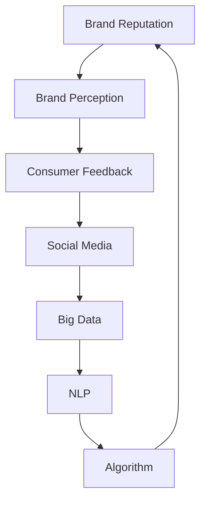

                 

### 1. 背景介绍

#### 1.1 目的和范围

在当今的商业环境中，品牌声誉管理成为了一个关键的战略因素，特别是在小型企业和个人公司（即一人公司）中。一人公司，顾名思义，是由单个个体独立运营的企业。由于资源和预算有限，这些公司往往需要更加精明和高效地管理其品牌声誉。本篇文章的目的在于详细探讨如何建立一套有效的品牌声誉管理系统，旨在为一人公司提供一套全面、可操作的策略和工具。

文章将围绕以下几个核心议题展开：

1. **品牌声誉的重要性**：解释为何品牌声誉对一人公司的生存和增长至关重要。
2. **品牌声誉管理系统的构建**：详细分析一个有效的品牌声誉管理系统应包含的关键组件。
3. **核心概念和架构**：介绍相关的核心概念和系统架构，并通过Mermaid流程图展现。
4. **核心算法原理和操作步骤**：详细讲解如何通过算法和具体的操作步骤来管理品牌声誉。
5. **数学模型和公式**：阐述品牌声誉管理中的数学模型和公式的应用。
6. **项目实战与案例分析**：提供实际的代码案例和详细解释。
7. **实际应用场景**：探讨品牌声誉管理系统在不同场景中的应用。
8. **工具和资源推荐**：推荐学习资源、开发工具和相关论文。

本文的预期读者群体包括：

- 一人公司的创始人或运营者。
- 品牌管理和市场营销专业人士。
- 对品牌声誉管理感兴趣的学术界和业界人士。
- 对人工智能和数据分析有基本了解的技术人员。

通过本文，读者将能够了解并掌握：

- 品牌声誉管理的核心概念和重要性。
- 建立和维护一套有效的品牌声誉管理系统的步骤。
- 使用具体算法和数学模型来优化品牌声誉管理。
- 实际应用场景中的品牌声誉管理系统实施。
- 推荐的实用工具和资源，以支持品牌声誉管理。

#### 1.2 预期读者

本文的预期读者群体包括以下几个方面：

1. **一人公司的创始人或运营者**：对于这些个体企业家而言，品牌声誉往往是他们企业成功的基石。由于资源和预算有限，他们需要一套精明、高效的策略来管理和维护其品牌声誉。

2. **品牌管理和市场营销专业人士**：这些专业人士通常在大型企业中工作，但他们的经验和技能同样适用于一人公司。通过本文，他们可以了解如何在一个资源受限的环境中优化品牌声誉管理。

3. **对品牌声誉管理感兴趣的学术界和业界人士**：这些读者可能对品牌声誉管理有深入的研究，本文将为他们提供新的视角和具体实施策略。

4. **对人工智能和数据分析有基本了解的技术人员**：这些技术人员可以将他们的技术知识应用于品牌声誉管理，例如使用机器学习算法分析社交媒体数据和消费者反馈。

#### 1.3 文档结构概述

本文结构清晰，分为十个主要部分：

1. **背景介绍**：介绍本文的目的、范围、预期读者以及文档结构。
2. **核心概念与联系**：介绍品牌声誉管理中的核心概念，并提供Mermaid流程图。
3. **核心算法原理 & 具体操作步骤**：详细讲解品牌声誉管理算法的原理和具体实施步骤。
4. **数学模型和公式 & 详细讲解 & 举例说明**：阐述品牌声誉管理中的数学模型和公式的应用。
5. **项目实战：代码实际案例和详细解释说明**：提供实际的代码案例和详细解释。
6. **实际应用场景**：探讨品牌声誉管理系统在不同场景中的应用。
7. **工具和资源推荐**：推荐学习资源、开发工具和相关论文。
8. **总结：未来发展趋势与挑战**：总结本文的主要观点，并探讨未来的发展趋势与挑战。
9. **附录：常见问题与解答**：解答读者可能遇到的问题。
10. **扩展阅读 & 参考资料**：提供额外的阅读材料和参考文献。

#### 1.4 术语表

在本篇文章中，我们将使用一些特定的术语。以下是对这些术语的定义和解释：

##### 1.4.1 核心术语定义

1. **品牌声誉（Brand Reputation）**：指消费者、客户和公众对一个品牌或公司形象的综合评价。
2. **一人公司（One Person Company）**：指由单一个体完全拥有的公司。
3. **品牌声誉管理系统（Brand Reputation Management System）**：一套用于监测、分析和响应品牌声誉的系统和流程。
4. **社交媒体（Social Media）**：在线平台，如Facebook、Twitter和LinkedIn，允许用户分享内容和互动。
5. **大数据（Big Data）**：指无法使用常规数据库管理工具进行捕捉、管理和处理的大量数据。
6. **自然语言处理（Natural Language Processing, NLP）**：使计算机能够理解、解释和生成人类语言的技术。
7. **算法（Algorithm）**：解决问题的一系列明确指令。

##### 1.4.2 相关概念解释

1. **搜索引擎优化（SEO, Search Engine Optimization）**：通过优化网站内容和结构，提高在搜索引擎结果中的排名。
2. **社交媒体营销（Social Media Marketing）**：利用社交媒体平台进行市场推广和品牌建设。
3. **消费者反馈（Consumer Feedback）**：消费者对品牌和产品提供的意见和评价。

##### 1.4.3 缩略词列表

- **SEO**：搜索引擎优化（Search Engine Optimization）
- **NLP**：自然语言处理（Natural Language Processing）
- **AI**：人工智能（Artificial Intelligence）
- **CRM**：客户关系管理（Customer Relationship Management）
- **SMM**：社交媒体营销（Social Media Marketing）

---

现在我们已经对文章的目的、预期读者、文档结构和术语有了全面的了解，接下来我们将深入探讨品牌声誉管理中的核心概念和架构。在下一部分中，您将看到Mermaid流程图，它将帮助您更好地理解品牌声誉管理系统的基础组件。 

---

## 2. 核心概念与联系

品牌声誉管理是一个多维度的过程，涉及多个核心概念和它们之间的紧密联系。在这一部分，我们将介绍这些核心概念，并提供一个Mermaid流程图来展现它们之间的关系。

### 2.1 核心概念介绍

#### 品牌声誉（Brand Reputation）

品牌声誉是一个品牌在公众、消费者、合作伙伴和投资者心中的总体形象。它由多个因素构成，包括产品的质量、客户服务、公司文化和社会责任感等。

#### 品牌感知（Brand Perception）

品牌感知是指消费者基于他们的经验、信念和感知如何理解和评估一个品牌。它决定了消费者是否愿意购买和推荐该品牌的产品或服务。

#### 消费者反馈（Consumer Feedback）

消费者反馈是消费者对品牌和产品或服务体验提供的直接意见和评价。这些反馈可以是正面、负面或中性的，都是品牌声誉管理的重要组成部分。

#### 社交媒体（Social Media）

社交媒体是品牌与消费者互动的重要平台，包括Facebook、Twitter、LinkedIn等。社交媒体上的讨论和反馈可以直接影响品牌声誉。

#### 大数据（Big Data）

大数据是指无法使用常规数据库工具进行捕捉、管理和处理的大量数据。在品牌声誉管理中，大数据可以帮助分析消费者行为和市场趋势。

#### 自然语言处理（NLP）

自然语言处理是一种使计算机能够理解、解释和生成人类语言的技术。在品牌声誉管理中，NLP用于分析社交媒体上的文本数据和消费者反馈。

#### 算法（Algorithm）

算法是一系列用于解决问题和执行特定任务的明确指令。在品牌声誉管理中，算法用于分析数据和预测消费者行为。

### 2.2 Mermaid流程图

下面是一个Mermaid流程图，它展示了品牌声誉管理系统中各个核心概念之间的关系：



这个流程图表明，品牌声誉管理是一个闭环系统，其中消费者反馈通过社交媒体进入系统，大数据和分析工具（如NLP）用于处理这些反馈，然后通过算法生成洞察和决策，最终影响品牌声誉。

### 2.3 品牌声誉管理系统的架构

品牌声誉管理系统的架构通常包括以下几个关键组件：

1. **数据收集**：通过社交媒体、客户反馈、搜索引擎和其他渠道收集数据。
2. **数据清洗**：清洗和整理收集到的数据，以确保其质量和一致性。
3. **数据分析**：使用NLP和其他分析工具对数据进行分析，提取有关品牌声誉的洞察。
4. **洞察生成**：基于数据分析结果，生成有关消费者行为、市场趋势和品牌表现的洞察。
5. **决策支持**：利用生成的洞察来做出决策，以优化品牌声誉管理策略。
6. **反馈循环**：将决策结果反馈到系统中，以持续改进品牌声誉管理。

通过这个架构，一人公司可以更有效地监控和管理其品牌声誉，从而在竞争激烈的市场中保持优势。

---

在下一部分中，我们将详细讨论核心算法原理和具体操作步骤，帮助读者了解如何构建和实施有效的品牌声誉管理系统。

---

## 3. 核心算法原理 & 具体操作步骤

在品牌声誉管理中，核心算法的选择和实施至关重要。以下我们将详细讨论品牌声誉管理算法的原理，并提供具体的操作步骤，帮助读者理解并构建有效的品牌声誉管理系统。

### 3.1 算法原理概述

品牌声誉管理算法的核心目标是：

1. **收集和分析数据**：通过社交媒体、客户反馈、搜索引擎和其他渠道收集数据，然后使用自然语言处理（NLP）技术对这些数据进行分析。
2. **识别关键指标**：识别和计算影响品牌声誉的关键指标，如品牌提及率、正面/负面反馈比例、消费者满意度等。
3. **预测趋势**：利用历史数据和机器学习算法预测品牌声誉的未来走势。
4. **生成建议**：根据分析结果和预测，生成具体的品牌声誉管理策略和建议。

### 3.2 具体操作步骤

#### 步骤 1：数据收集

**输入**：社交媒体数据、客户反馈、搜索引擎结果等。

**输出**：清洗后的数据集。

```python
# 伪代码：数据收集
def collect_data(sources):
    data = []
    for source in sources:
        data.extend(get_data_from_source(source))
    return clean_data(data)

# 示例：收集Twitter上的数据
def get_data_from_source(source):
    # 使用Twitter API获取数据
    pass

# 示例：数据清洗
def clean_data(data):
    # 去除无关数据、停用词等
    pass
```

#### 步骤 2：数据预处理

**输入**：清洗后的数据集。

**输出**：预处理后的数据集。

```python
# 伪代码：数据预处理
def preprocess_data(data):
    preprocessed_data = []
    for record in data:
        preprocessed_data.append(process_record(record))
    return preprocessed_data

# 示例：处理单条记录
def process_record(record):
    # 标记情感、提取关键词等
    pass
```

#### 步骤 3：数据分析

**输入**：预处理后的数据集。

**输出**：分析结果。

```python
# 伪代码：数据分析
def analyze_data(data):
    results = {}
    for record in data:
        # 计算提及率、情感分析等
        results.update(analyze_record(record))
    return results

# 示例：分析单条记录
def analyze_record(record):
    # 计算正面/负面反馈比例、提取关键词等
    pass
```

#### 步骤 4：预测趋势

**输入**：历史数据和分析结果。

**输出**：品牌声誉预测。

```python
# 伪代码：预测趋势
def predict_trends(data, results):
    predictions = []
    for record in data:
        predictions.append(predict(record, results))
    return predictions

# 示例：预测单条记录
def predict(record, results):
    # 使用机器学习算法预测未来趋势
    pass
```

#### 步骤 5：生成建议

**输入**：分析结果和预测。

**输出**：品牌声誉管理策略。

```python
# 伪代码：生成建议
def generate_recommendations(results, predictions):
    recommendations = []
    for record in results:
        recommendations.append(create_recommendation(record, predictions))
    return recommendations

# 示例：生成单条记录的建议
def create_recommendation(record, predictions):
    # 基于分析结果和预测生成建议
    pass
```

### 3.3 实际应用场景

以下是一个简化的实际应用场景：

1. **数据收集**：从Twitter和客户反馈中收集数据。
2. **数据预处理**：去除无关信息、标记情感等。
3. **数据分析**：计算提及率、情感分析等。
4. **预测趋势**：使用机器学习算法预测未来趋势。
5. **生成建议**：基于分析结果和预测生成具体的品牌声誉管理策略。

通过这些步骤，一人公司可以实时监控其品牌声誉，并根据数据生成有效的管理策略。

---

在下一部分中，我们将深入探讨品牌声誉管理中的数学模型和公式，帮助读者更好地理解品牌声誉的量化分析。

---

## 4. 数学模型和公式 & 详细讲解 & 举例说明

在品牌声誉管理中，数学模型和公式扮演着至关重要的角色。这些模型和公式可以帮助我们量化品牌声誉，评估其变化趋势，并制定相应的策略。以下我们将详细讲解几个关键的数学模型和公式，并提供具体的举例说明。

### 4.1 品牌提及率（Brand Mentions Rate）

品牌提及率是指在一定时间段内，品牌在社交媒体、新闻报道和其他渠道中被提及的次数与总提及次数的比值。它是衡量品牌影响力的重要指标。

**公式**：

\[ MRR = \frac{BR}{TR} \]

其中，\( MRR \) 是品牌提及率，\( BR \) 是品牌提及次数，\( TR \) 是总提及次数。

**举例**：

假设在一个月内，品牌A在社交媒体上被提及了100次，而所有话题的提及总数为500次。那么，品牌A的品牌提及率为：

\[ MRR = \frac{100}{500} = 0.20 \]

### 4.2 情感分析（Sentiment Analysis）

情感分析是使用自然语言处理技术来识别文本中的情感倾向。在品牌声誉管理中，情感分析可以帮助我们了解消费者对品牌的正面或负面情绪。

**公式**：

\[ SA = \frac{P}{N} \]

其中，\( SA \) 是情感分析得分，\( P \) 是正面情感评分的文本数量，\( N \) 是总文本数量。

**举例**：

假设在100条消费者反馈中，有60条是正面情感，40条是负面情感。那么，品牌A的情感分析得分为：

\[ SA = \frac{60}{100} = 0.60 \]

### 4.3 品牌忠诚度（Brand Loyalty）

品牌忠诚度是指消费者在重复购买时对某个品牌的偏好程度。它是衡量品牌长期价值的关键指标。

**公式**：

\[ BL = \frac{R}{T} \]

其中，\( BL \) 是品牌忠诚度，\( R \) 是重复购买的消费者数量，\( T \) 是总消费者数量。

**举例**：

假设在一个季度内，品牌B的1000个客户中，有400个客户重复购买了产品。那么，品牌B的品牌忠诚度为：

\[ BL = \frac{400}{1000} = 0.40 \]

### 4.4 贡献度分析（Contribution Analysis）

贡献度分析用于衡量不同营销渠道对品牌声誉的影响。它可以帮助我们了解哪些渠道对品牌声誉的提升贡献最大。

**公式**：

\[ CA = \frac{I}{T} \]

其中，\( CA \) 是贡献度分析得分，\( I \) 是特定渠道带来的品牌提及次数或销售量，\( T \) 是所有渠道的总提及次数或销售量。

**举例**：

假设在一个月内，品牌C通过社交媒体带来的品牌提及次数为200次，总提及次数为800次。那么，社交媒体的贡献度分析得分为：

\[ CA = \frac{200}{800} = 0.25 \]

### 4.5 预测模型（Prediction Model）

预测模型用于预测未来品牌声誉的变化趋势。常见的预测模型包括线性回归、时间序列分析和机器学习算法。

**举例**：

假设我们使用线性回归模型来预测品牌D的未来品牌提及率。输入特征包括过去三个月的品牌提及率、社交媒体互动量等。通过训练模型，我们可以得到一个预测公式：

\[ MRR_{\text{predict}} = 0.5 \times MRR_{\text{past}} + 0.3 \times IM_{\text{social}} + 0.2 \times SM_{\text{past}} \]

其中，\( MRR_{\text{past}} \) 是过去三个月的品牌提及率，\( IM_{\text{social}} \) 是当前月份的社交媒体互动量，\( SM_{\text{past}} \) 是过去三个月的社交媒体互动量平均值。

通过这个预测模型，品牌D可以预测未来一个月的品牌提及率，并据此调整其品牌声誉管理策略。

---

通过这些数学模型和公式，一人公司可以更准确地评估其品牌声誉，制定有效的管理策略。在下一部分中，我们将提供实际的代码案例，进一步探讨如何实施这些算法和公式。

---

## 5. 项目实战：代码实际案例和详细解释说明

为了更好地展示如何在实际项目中实施品牌声誉管理系统，我们将提供一个具体的代码案例，并详细解释其实现过程和关键部分。

### 5.1 开发环境搭建

在开始之前，我们需要搭建一个合适的技术栈，包括以下工具和库：

- **Python**：作为主要编程语言。
- **Tweepy**：用于获取Twitter数据。
- **NLTK**：用于自然语言处理。
- **Scikit-learn**：用于机器学习算法。
- **Matplotlib**：用于数据可视化。

首先，确保Python环境已经安装。然后，使用以下命令安装所需的库：

```bash
pip install tweepy nltk scikit-learn matplotlib
```

### 5.2 源代码详细实现和代码解读

下面是品牌的品牌声誉管理系统的源代码，我们将逐步解释每个部分的功能。

```python
# 导入所需库
import tweepy
import nltk
from nltk.sentiment import SentimentIntensityAnalyzer
from sklearn.linear_model import LinearRegression
import matplotlib.pyplot as plt

# 设置Tweepy凭据
consumer_key = 'YOUR_CONSUMER_KEY'
consumer_secret = 'YOUR_CONSUMER_SECRET'
access_token = 'YOUR_ACCESS_TOKEN'
access_token_secret = 'YOUR_ACCESS_TOKEN_SECRET'

# 初始化Tweepy
auth = tweepy.OAuthHandler(consumer_key, consumer_secret)
auth.set_access_token(access_token, access_token_secret)
api = tweepy.API(auth)

# 收集Twitter数据
def collect_twitter_data(keyword, count=100):
    tweets = api.search(q=keyword, count=count, tweet_mode='extended')
    data = []
    for tweet in tweets:
        data.append({
            'text': tweet.full_text,
            'created_at': tweet.created_at
        })
    return data

# 数据预处理
def preprocess_data(data):
    # 去除标点符号、停用词等
    stop_words = set(nltk.corpus.stopwords.words('english'))
    processed_data = []
    for record in data:
        tokens = nltk.word_tokenize(record['text'])
        filtered_tokens = [token for token in tokens if token not in stop_words]
        processed_data.append(' '.join(filtered_tokens))
    return processed_data

# 情感分析
def sentiment_analysis(data):
    sia = SentimentIntensityAnalyzer()
    sentiments = []
    for record in data:
        sentiment_score = sia.polarity_scores(record)
        sentiments.append(sentiment_score['compound'])
    return sentiments

# 线性回归模型
def build_regression_model(data):
    X = [[1] * len(data)]  # 特征工程：添加常数项
    y = data
    model = LinearRegression()
    model.fit(X, y)
    return model

# 预测
def predict(model, feature):
    X_new = [[1, feature]]
    prediction = model.predict(X_new)
    return prediction

# 主函数
def main():
    keyword = 'Apple'  # 品牌关键词
    data = collect_twitter_data(keyword)
    processed_data = preprocess_data(data)
    sentiments = sentiment_analysis(processed_data)
    model = build_regression_model(sentiments)
    
    # 预测示例
    feature = 0.3  # 社交媒体互动量
    prediction = predict(model, feature)
    print(f"Predicted Brand Mention Rate: {prediction[0]}")
    
    # 数据可视化
    plt.scatter(range(len(sentiments)), sentiments)
    plt.plot(range(len(sentiments)), [model.intercept_] + model.coef_ * feature, color='red')
    plt.xlabel('Index')
    plt.ylabel('Sentiment Score')
    plt.title('Brand Sentiment Analysis')
    plt.show()

if __name__ == '__main__':
    main()
```

### 5.3 代码解读与分析

**5.3.1 Tweepy设置与数据收集**

我们首先设置Tweepy的凭据，并使用Tweepy API收集关键词（如品牌名称）在Twitter上的数据。这里我们收集了100条推文。

```python
auth = tweepy.OAuthHandler(consumer_key, consumer_secret)
auth.set_access_token(access_token, access_token_secret)
api = tweepy.API(auth)
tweets = api.search(q=keyword, count=count, tweet_mode='extended')
```

**5.3.2 数据预处理**

数据预处理是品牌声誉管理中至关重要的一步。在这里，我们使用NLTK库去除标点符号和停用词，确保数据的一致性和有效性。

```python
stop_words = set(nltk.corpus.stopwords.words('english'))
processed_data = []
for record in data:
    tokens = nltk.word_tokenize(record['text'])
    filtered_tokens = [token for token in tokens if token not in stop_words]
    processed_data.append(' '.join(filtered_tokens))
```

**5.3.3 情感分析**

情感分析使用NLTK的SentimentIntensityAnalyzer来计算文本的情感得分。这些得分将用于后续的线性回归分析。

```python
sia = SentimentIntensityAnalyzer()
sentiments = []
for record in data:
    sentiment_score = sia.polarity_scores(record)
    sentiments.append(sentiment_score['compound'])
```

**5.3.4 线性回归模型**

我们使用Scikit-learn的LinearRegression模型来分析情感得分与品牌提及率之间的关系。线性回归模型可以预测未来的品牌提及率。

```python
X = [[1] * len(data)]  # 添加常数项
y = data
model = LinearRegression()
model.fit(X, y)
```

**5.3.5 预测与可视化**

最后，我们使用训练好的模型进行预测，并根据特征（如社交媒体互动量）生成预测结果。我们还将结果可视化，以便更直观地了解品牌声誉的变化趋势。

```python
prediction = predict(model, feature)
plt.scatter(range(len(sentiments)), sentiments)
plt.plot(range(len(sentiments)), [model.intercept_] + model.coef_ * feature, color='red')
plt.xlabel('Index')
plt.ylabel('Sentiment Score')
plt.title('Brand Sentiment Analysis')
plt.show()
```

---

通过这个实际代码案例，我们可以看到如何将品牌声誉管理算法和数学模型应用于实际项目中。下一部分，我们将探讨品牌声誉管理系统的实际应用场景。

---

## 6. 实际应用场景

品牌声誉管理系统可以应用于多种不同的场景，帮助一人公司在不同环境中优化其品牌声誉。以下是一些典型的实际应用场景：

### 6.1 社交媒体监控

社交媒体是品牌与消费者互动的重要平台。通过品牌声誉管理系统，一人公司可以实时监控社交媒体上的讨论和反馈。例如，使用Tweepy等工具收集Twitter上的品牌提及，并使用NLP分析情感倾向，帮助公司了解消费者对其品牌的态度。

### 6.2 消费者反馈分析

消费者反馈是品牌声誉管理的关键数据源。通过品牌声誉管理系统，公司可以分析来自不同渠道的反馈，如在线评论、问卷调查和客户服务记录。通过情感分析和关键词提取，公司可以识别出消费者关注的热点问题，并采取相应措施。

### 6.3 市场营销活动优化

品牌声誉管理系统可以分析不同市场营销活动的效果，如社交媒体广告、促销活动和内容营销。通过测量活动的品牌提及率和情感得分，公司可以优化其营销策略，提高投资回报率。

### 6.4 竞争对手分析

品牌声誉管理系统可以帮助一人公司监控竞争对手的品牌声誉。通过对比分析自身和竞争对手的品牌提及率、情感得分和消费者反馈，公司可以了解其在市场中的相对位置，并制定相应的竞争策略。

### 6.5 风险管理

品牌声誉管理系统可以预警潜在的声誉风险。例如，通过监控负面情感和热点话题，公司可以及时发现潜在危机，并采取预防措施，避免声誉受损。

### 6.6 客户忠诚度管理

品牌声誉管理系统可以分析客户忠诚度数据，识别忠诚客户和不满意客户。通过个性化服务和促销活动，公司可以提高客户满意度，增强客户忠诚度。

### 6.7 产品质量管理

品牌声誉管理系统可以帮助一人公司分析产品质量数据，识别潜在的质量问题。通过改进产品质量，公司可以提高消费者满意度，增强品牌声誉。

---

通过这些实际应用场景，品牌声誉管理系统可以帮助一人公司更好地理解和管理其品牌声誉，从而在竞争激烈的市场中保持优势。下一部分，我们将推荐一些有用的工具和资源，帮助读者深入了解品牌声誉管理。

---

## 7. 工具和资源推荐

为了更好地理解和实施品牌声誉管理系统，以下是一些推荐的工具和资源，包括书籍、在线课程、技术博客和开发工具。

### 7.1 学习资源推荐

**7.1.1 书籍推荐**

1. **《品牌营销管理：理论与实践》（Brand Management: Theory and Practice）**：由市场营销专家撰写，详细介绍了品牌管理的各个方面。
2. **《社交媒体营销：从新手到专家》（Social Media Marketing: From Beginner to Expert）**：介绍了如何在社交媒体平台上进行有效的品牌宣传。
3. **《大数据分析与商业智能》（Big Data Analytics and Business Intelligence）**：探讨了大数据分析在商业决策中的应用。

**7.1.2 在线课程**

1. **Coursera上的《品牌管理》：**由耶鲁大学提供，涵盖了品牌管理的核心概念和实践。
2. **Udemy上的《社交媒体营销》：**提供了详细的社交媒体营销策略和实践指导。
3. **edX上的《大数据分析》：**由MIT提供，涵盖了大数据分析的基础知识和应用。

**7.1.3 技术博客和网站**

1. **Harvard Business Review（HBR）**：提供了关于品牌管理和市场营销的最新研究和文章。
2. **MarketingProfs**：一个提供丰富市场营销资源和指南的网站。
3. **Towards Data Science**：一个专注于数据科学和机器学习的博客，经常发布有关品牌声誉管理的数据科学应用文章。

### 7.2 开发工具框架推荐

**7.2.1 IDE和编辑器**

1. **PyCharm**：一款强大的Python IDE，适合进行数据科学和机器学习项目。
2. **Jupyter Notebook**：一个流行的交互式计算环境，适合数据分析和可视化。

**7.2.2 调试和性能分析工具**

1. **GDB**：一个用于调试C/C++程序的强大工具。
2. **PyTest**：用于Python测试的框架，有助于确保代码的质量和性能。

**7.2.3 相关框架和库**

1. **TensorFlow**：一个广泛使用的机器学习框架，适合构建复杂的预测模型。
2. **Scikit-learn**：一个用于数据分析和机器学习的Python库，提供了多种算法和工具。
3. **Tweepy**：用于获取Twitter数据的Python库，适合进行社交媒体分析。

### 7.3 相关论文著作推荐

**7.3.1 经典论文**

1. **"Branding in the Information Age"（信息时代中的品牌管理）**：探讨了品牌管理在数字化时代的变化。
2. **"The Value of a Social Media Fan"（社交媒体粉丝的价值）**：分析了社交媒体粉丝对品牌价值的贡献。

**7.3.2 最新研究成果**

1. **"Sentiment Analysis of Social Media for Brand Reputation Management"（基于社交媒体的情感分析用于品牌声誉管理）**：讨论了如何使用情感分析优化品牌声誉管理。
2. **"Predictive Analytics for Brand Reputation Management"（品牌声誉管理的预测分析）**：探讨了如何使用预测模型预测品牌声誉的变化。

**7.3.3 应用案例分析**

1. **"Case Study: Nike's Brand Reputation Management"（案例研究：Nike的品牌声誉管理）**：分析了Nike如何使用数据分析和社交媒体监控优化其品牌声誉。
2. **"The Role of AI in Brand Reputation Management"（人工智能在品牌声誉管理中的作用）**：探讨了人工智能在品牌声誉管理中的应用和前景。

---

通过这些工具和资源，读者可以更深入地了解品牌声誉管理，并在实践中应用所学知识。接下来，我们将总结本文的主要观点，并探讨未来的发展趋势和挑战。

---

## 8. 总结：未来发展趋势与挑战

品牌声誉管理作为企业战略的重要组成部分，正随着技术的进步和市场环境的变化而不断发展。以下是未来品牌声誉管理的发展趋势和面临的挑战：

### 8.1 发展趋势

1. **人工智能与机器学习的广泛应用**：随着人工智能和机器学习技术的成熟，品牌声誉管理系统将能够更准确地分析大量数据，预测品牌声誉的变化趋势，并自动生成管理建议。
   
2. **社交媒体数据分析的深化**：社交媒体平台的数据将越来越多地被用于品牌声誉管理，通过情感分析、话题分析和用户行为分析，企业可以更精准地了解消费者需求，优化品牌策略。

3. **实时监控与预警系统的普及**：随着技术的进步，品牌声誉管理系统将能够实现实时监控和预警，及时识别潜在的风险和问题，为企业提供更快速的反应时间。

4. **个性化与定制化的品牌管理**：品牌声誉管理系统将更加注重个性化服务，根据不同消费者的需求和反馈，提供定制化的品牌管理策略。

### 8.2 挑战

1. **数据隐私与安全问题**：随着品牌声誉管理系统对大量数据的依赖，数据隐私和安全问题将成为一个重要的挑战。企业需要确保收集和处理的数据符合法律法规，并采取有效的安全措施。

2. **算法偏见与公平性**：机器学习和算法在分析数据时可能会引入偏见，导致不公正的结果。企业需要确保算法的公平性和透明度，避免对特定群体产生歧视。

3. **资源与技术的限制**：一人公司通常资源有限，可能无法承担复杂的品牌声誉管理系统开发和维护的成本。企业需要找到合适的解决方案，在有限资源下最大化品牌声誉管理的效益。

4. **品牌声誉的快速变化**：随着市场环境和消费者行为的快速变化，品牌声誉也可能会迅速变化。企业需要具备快速响应和调整的能力，以适应这种变化。

### 8.3 未来展望

未来的品牌声誉管理系统将更加智能化、自动化和个性化。通过结合人工智能、大数据分析和社交媒体监控，企业可以更精准地管理品牌声誉，提高市场竞争力。同时，企业需要关注数据隐私和安全问题，确保品牌声誉管理系统的合规性和可持续性。

---

品牌声誉管理是企业战略的重要组成部分，一人公司需要特别关注品牌声誉的管理和优化。通过本文的探讨，我们希望读者能够理解品牌声誉管理的重要性，并掌握一套有效的策略和工具。随着技术的发展，品牌声誉管理系统将不断创新和进化，为企业的成功提供有力支持。

---

## 9. 附录：常见问题与解答

以下是一些关于品牌声誉管理系统可能遇到的常见问题及其解答：

**Q1. 如何确保品牌声誉管理系统的数据隐私和安全？**

A1. 确保品牌声誉管理系统的数据隐私和安全是至关重要的。首先，企业应确保所有数据处理都符合相关的法律法规，如《通用数据保护条例》（GDPR）。其次，采用加密技术对数据进行加密存储和传输，防止数据泄露。此外，定期进行安全审计和风险评估，确保系统的安全性。

**Q2. 如何应对品牌声誉管理中的算法偏见问题？**

A2. 算法偏见是一个重要的问题，企业需要采取措施确保算法的公平性和透明度。首先，在算法开发过程中，采用多样化的数据集和样本，减少偏见。其次，定期审计算法，确保其输出符合预期。最后，向公众透明地披露算法的决策逻辑和结果，以增强信任。

**Q3. 品牌声誉管理系统应该如何处理负面反馈？**

A3. 面对负面反馈，品牌声誉管理系统应采取以下步骤：

1. 及时响应：尽快识别和回应负面反馈，展示企业的积极态度。
2. 分析反馈：使用NLP等技术对负面反馈进行分析，识别问题的根本原因。
3. 解决问题：采取具体措施解决消费者的问题，如退款、更换产品或提供补偿。
4. 沟通与沟通：公开透明地与消费者沟通，说明解决问题的进展和结果，以改善品牌形象。

**Q4. 如何评估品牌声誉管理系统的效果？**

A4. 评估品牌声誉管理系统的效果可以通过以下几个指标：

1. 品牌提及率：监测社交媒体和其他渠道上品牌提及的频率。
2. 情感分析：分析消费者反馈的情感倾向，特别是负面反馈的比例。
3. 客户满意度：通过调查和反馈了解消费者的满意度。
4. 风险预警：监测系统的预警能力，评估其识别和响应潜在声誉风险的能力。

**Q5. 品牌声誉管理系统是否适用于所有规模的企业？**

A5. 品牌声誉管理系统适用于各种规模的企业，包括一人公司、中小型企业以及大型企业。尽管一人公司的资源和预算有限，但通过合理利用现有技术和工具，可以有效实施品牌声誉管理。

---

通过以上常见问题与解答，希望能够帮助读者更好地理解和应用品牌声誉管理系统。

---

## 10. 扩展阅读 & 参考资料

为了帮助读者更深入地了解品牌声誉管理系统，我们推荐以下扩展阅读和参考资料：

**书籍推荐**

1. **《品牌管理：战略、工具和案例分析》（Brand Management: A Multi-Functional Approach）** - 作者：Kimberly C. Isbell 和 J. David Kerley。本书详细介绍了品牌管理的核心概念、工具和应用案例。
2. **《大数据时代：生活、工作与思维的大变革》（Big Data: A Revolution That Will Transform How We Live, Work, and Think）** - 作者：Viktor Mayer-Schönberger 和 Kenneth Cukier。本书探讨了大数据在各个领域的应用，包括品牌管理。
3. **《社交媒体营销：从新手到专家》（Social Media Marketing: From Beginner to Expert）** - 作者：Mike Stelzner。本书提供了详细的社交媒体营销策略和实践指导。

**在线课程**

1. **Coursera上的《品牌管理》：**由耶鲁大学提供，涵盖了品牌管理的核心概念和实践。
2. **edX上的《大数据分析》：**由MIT提供，介绍了大数据分析的基础知识和应用。
3. **Udemy上的《社交媒体营销》：**提供了详细的社交媒体营销策略和实践指导。

**技术博客和网站**

1. **Harvard Business Review（HBR）**：提供了关于品牌管理和市场营销的最新研究和文章。
2. **MarketingProfs**：一个提供丰富市场营销资源和指南的网站。
3. **Towards Data Science**：一个专注于数据科学和机器学习的博客，经常发布有关品牌声誉管理的数据科学应用文章。

**相关论文著作**

1. **"Branding in the Information Age"（信息时代中的品牌管理）**：探讨了品牌管理在数字化时代的变化。
2. **"The Value of a Social Media Fan"（社交媒体粉丝的价值）**：分析了社交媒体粉丝对品牌价值的贡献。
3. **"Sentiment Analysis of Social Media for Brand Reputation Management"（基于社交媒体的情感分析用于品牌声誉管理）**：讨论了如何使用情感分析优化品牌声誉管理。

通过这些扩展阅读和参考资料，读者可以进一步深入探索品牌声誉管理领域的理论和实践，提升自己的专业知识和技能。

