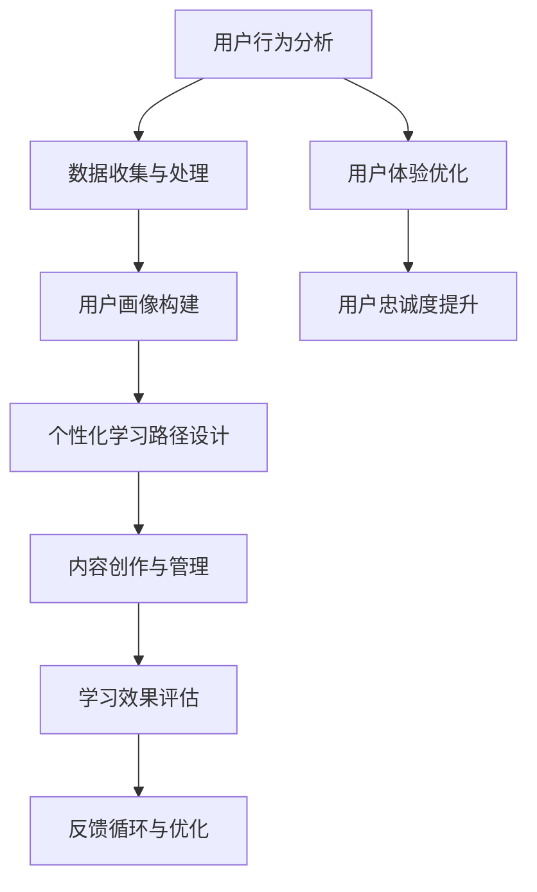
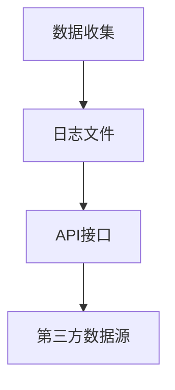
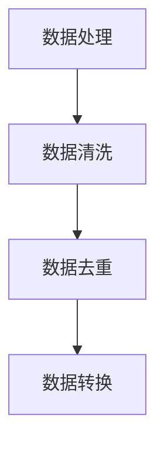
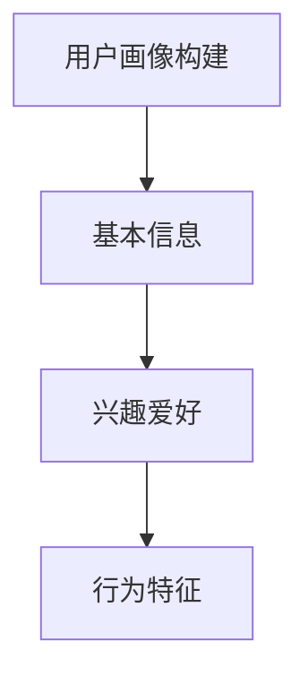
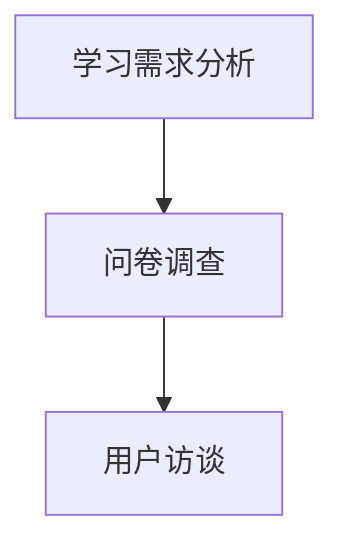
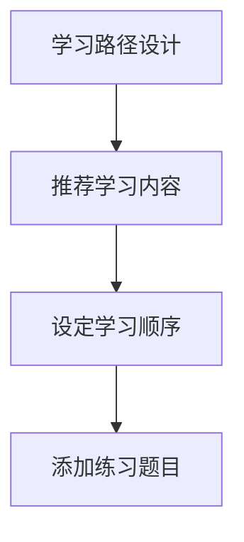
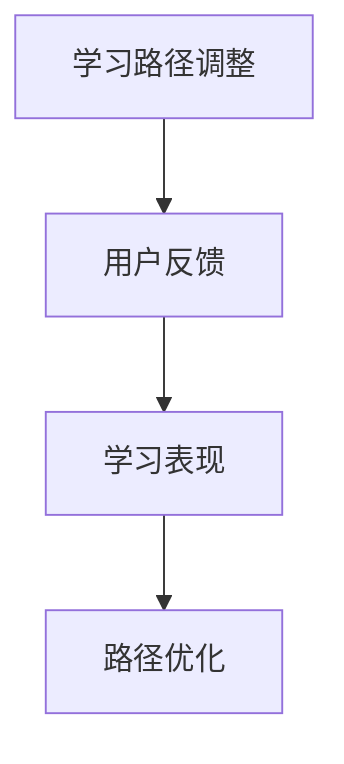
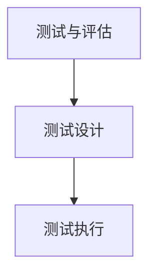
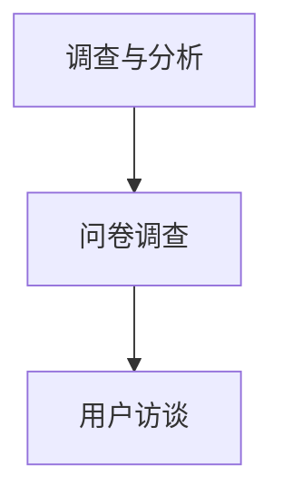
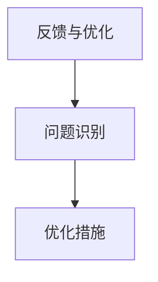

                 

# 一人公司如何建立有效的用户教育体系

> 关键词：一人公司、用户教育、教育体系、增长策略、用户体验、个性化学习

> 摘要：本文旨在探讨一人公司如何通过构建一个有效的用户教育体系来实现业务的增长和用户的忠诚度。文章首先介绍了建立用户教育体系的重要性和背景，然后深入分析了其核心概念和关键算法，提供了详细的操作步骤和数学模型。通过实际案例的代码解读，展示了如何将理论应用到实践中。最后，文章讨论了用户教育体系的实际应用场景，推荐了相关的工具和资源，并对未来的发展趋势和挑战进行了展望。

## 1. 背景介绍

### 1.1 目的和范围

在当今竞争激烈的市场环境中，无论是大型企业还是初创公司，用户教育体系都已成为企业战略规划中不可或缺的一部分。特别是对于一人公司，由于其资源和人力相对有限，如何通过有效的用户教育体系实现业务的增长和用户的忠诚度，成为了一项关键任务。

本文将围绕一人公司如何建立有效的用户教育体系进行深入探讨。我们将首先介绍用户教育体系的基本概念和重要性，然后通过一系列步骤详细阐述如何构建这样一个体系，并提供实际案例和数学模型的支持。

本文的主要目标是为一人公司的创始人或CEO提供一套系统的指导方案，帮助他们在有限的资源和时间内，建立一个高效、有针对性的用户教育体系。

### 1.2 预期读者

本文的预期读者包括以下几类：

1. **一人公司的创始人或CEO**：这些读者需要了解如何通过用户教育体系来提升公司的市场竞争力。
2. **市场营销人员**：市场营销人员需要掌握用户教育体系的基本原理和实施策略，以更好地推广产品和服务。
3. **教育工作者**：对于在教育领域工作的人士，本文也提供了关于如何设计有效的在线学习体验的见解。
4. **技术爱好者**：本文涉及了一些技术层面的讨论，对于有志于深入了解用户教育体系背后的技术原理的技术爱好者也具有一定的参考价值。

### 1.3 文档结构概述

本文将按照以下结构进行组织：

1. **背景介绍**：介绍本文的目的、范围和预期读者。
2. **核心概念与联系**：通过Mermaid流程图展示用户教育体系的核心概念和联系。
3. **核心算法原理 & 具体操作步骤**：详细讲解用户教育体系的核心算法原理，并提供伪代码支持。
4. **数学模型和公式 & 详细讲解 & 举例说明**：介绍用户教育体系中的数学模型和公式，并通过具体例子进行说明。
5. **项目实战：代码实际案例和详细解释说明**：通过一个实际案例展示用户教育体系在代码层面的实现。
6. **实际应用场景**：探讨用户教育体系在不同场景中的应用。
7. **工具和资源推荐**：推荐相关的学习资源、开发工具和框架。
8. **总结：未来发展趋势与挑战**：总结用户教育体系的未来发展趋势和面临的挑战。
9. **附录：常见问题与解答**：提供一些常见问题的解答。
10. **扩展阅读 & 参考资料**：推荐一些相关的文献和资源。

### 1.4 术语表

#### 1.4.1 核心术语定义

- **用户教育体系**：一套系统化的教育策略和方法，旨在提高用户对产品和服务的认知、理解和忠诚度。
- **一人公司**：指只有一名创始人或CEO的企业，通常资源有限。
- **用户体验**：用户在使用产品或服务过程中的整体感受和体验。
- **个性化学习**：根据用户的需求和特点，定制化的学习内容和路径。

#### 1.4.2 相关概念解释

- **学习曲线**：用户在学习和掌握一项新技能或知识时的难度变化趋势。
- **交互设计**：设计用户与产品或服务互动的方式，以提高用户体验。
- **学习分析**：通过分析用户的学习行为，优化教育内容和策略。

#### 1.4.3 缩略词列表

- **SaaS**：软件即服务（Software as a Service）
- **CRM**：客户关系管理（Customer Relationship Management）
- **LMS**：学习管理系统（Learning Management System）
- **API**：应用程序接口（Application Programming Interface）

## 2. 核心概念与联系

用户教育体系的核心概念包括用户行为分析、个性化学习路径设计、内容创作与管理、学习效果评估等。这些概念相互联系，共同构成了一个完整的用户教育体系。

下面是一个使用Mermaid绘制的流程图，展示了这些核心概念及其相互关系：



### 2.1 用户行为分析

用户行为分析是用户教育体系的基础。通过收集和分析用户在使用产品或服务过程中的行为数据，我们可以深入了解用户的需求、偏好和痛点。这有助于我们设计出更符合用户期望的教育内容和路径。

### 2.2 个性化学习路径设计

基于用户行为分析的结果，我们可以为每位用户定制个性化的学习路径。这包括推荐合适的学习内容、设置学习目标和进度，以及调整学习资源的难度和呈现方式。个性化学习路径能够提高用户的学习效率和满意度。

### 2.3 内容创作与管理

内容创作与管理是用户教育体系的重要组成部分。高质量的教育内容不仅能够提升用户的学习效果，还能够增强品牌影响力。我们需要根据用户的特点和需求，创作和整理相关的学习材料，并确保这些内容易于获取和管理。

### 2.4 学习效果评估

学习效果评估是确保用户教育体系有效性的关键。通过评估用户的学习成果，我们可以了解教育内容的优劣，并及时进行调整和优化。常用的评估方法包括测试、调查和用户反馈等。

### 2.5 反馈循环与优化

反馈循环与优化是用户教育体系不断改进的过程。通过收集和分析用户的反馈，我们可以发现潜在的问题和改进的机会。这些反馈将指导我们不断优化教育内容和策略，以提高用户满意度和忠诚度。

### 2.6 用户体验优化

用户体验优化是用户教育体系的核心目标之一。通过优化用户与产品或服务的互动方式，我们可以提升用户的整体体验，从而增强用户满意度和忠诚度。

### 2.7 用户忠诚度提升

用户忠诚度提升是用户教育体系的终极目标。通过持续的教育和互动，我们可以帮助用户更好地理解和使用产品或服务，从而提高用户忠诚度和品牌忠诚度。

## 3. 核心算法原理 & 具体操作步骤

用户教育体系的核心算法原理主要包括用户行为分析算法、个性化学习路径设计算法和学习效果评估算法。以下将详细阐述这些算法的原理和具体操作步骤。

### 3.1 用户行为分析算法

用户行为分析算法的核心目标是收集、处理和分析用户在产品或服务中的行为数据，以了解用户的需求、偏好和痛点。以下是用户行为分析算法的具体步骤：

#### 3.1.1 数据收集

首先，我们需要收集用户在产品或服务中的行为数据，如浏览记录、操作日志、反馈数据等。这些数据可以通过日志文件、API接口等方式获取。



#### 3.1.2 数据处理

收集到的数据需要进行预处理，包括数据清洗、去重和转换等操作，以确保数据的质量和一致性。



#### 3.1.3 用户画像构建

基于处理后的数据，我们可以构建用户画像，包括用户的基本信息、兴趣爱好、行为特征等。用户画像有助于我们深入了解用户，为后续的个性化学习路径设计提供依据。



### 3.2 个性化学习路径设计算法

个性化学习路径设计算法的核心目标是根据用户画像和需求，为每位用户定制合适的学习路径。以下是个性化学习路径设计算法的具体步骤：

#### 3.2.1 学习需求分析

首先，我们需要分析用户的学习需求，包括用户希望学习的内容、学习目标和时间安排等。这可以通过问卷调查、用户访谈等方式进行。



#### 3.2.2 学习路径设计

基于用户画像和学习需求分析结果，我们可以为每位用户设计个性化的学习路径。学习路径包括推荐的学习内容、学习顺序和练习题目等。



#### 3.2.3 学习路径调整

在学习过程中，用户的需求和情况可能会发生变化。我们需要根据用户的反馈和表现，及时调整学习路径，以确保其符合用户的需求。



### 3.3 学习效果评估算法

学习效果评估算法的核心目标是评估用户的学习成果，以了解教育内容的优劣，并指导后续的优化。以下是学习效果评估算法的具体步骤：

#### 3.3.1 测试与评估

通过设计测试题目，我们可以评估用户对学习内容的掌握程度。测试结果将作为评估用户学习效果的重要依据。



#### 3.3.2 调查与分析

除了测试，我们还可以通过问卷调查、用户访谈等方式收集用户的反馈，了解他们对学习内容的满意度和建议。



#### 3.3.3 反馈与优化

基于测试和调查结果，我们可以识别教育内容的不足之处，并制定相应的优化措施，以提高学习效果。



### 3.4 伪代码示例

以下是用户教育体系核心算法的伪代码示例：

```python
# 用户行为分析算法
def user_behavior_analysis(data):
    # 数据收集
    collected_data = collect_data(data)
    
    # 数据处理
    cleaned_data = preprocess_data(collected_data)
    
    # 用户画像构建
    user_profile = build_user_profile(cleaned_data)
    
    return user_profile

# 个性化学习路径设计算法
def personalized_learning_path(user_profile, learning_demand):
    # 学习需求分析
    analyzed_demand = analyze_learning_demand(learning_demand)
    
    # 学习路径设计
    learning_path = design_learning_path(user_profile, analyzed_demand)
    
    return learning_path

# 学习效果评估算法
def learning_effect_evaluation(learning_path):
    # 测试与评估
    test_results = conduct_test(learning_path)
    
    # 调查与分析
    user_feedback = collect_user_feedback(test_results)
    
    # 反馈与优化
    optimized_path = optimize_learning_path(user_feedback)
    
    return optimized_path
```

通过上述算法和步骤，我们可以构建一个高效的用户教育体系，帮助一人公司提升用户满意度和忠诚度，实现业务的增长。

## 4. 数学模型和公式 & 详细讲解 & 举例说明

在用户教育体系中，数学模型和公式起着至关重要的作用。这些模型和公式帮助我们量化用户的行为、学习效果以及教育内容的优化程度。以下将介绍几个关键数学模型和公式，并进行详细讲解和举例说明。

### 4.1 用户行为预测模型

用户行为预测模型可以帮助我们预测用户在未来可能采取的行为。常用的模型包括马尔可夫决策过程（MDP）和线性回归模型。

#### 4.1.1 马尔可夫决策过程（MDP）

马尔可夫决策过程是一种概率模型，用于描述用户在不同状态下的行为决策。其基本公式为：

$$
P(S_t = s | S_{t-1} = s_{t-1}) = \pi(s_t | s_{t-1})
$$

其中，$S_t$ 表示第 $t$ 时刻的用户状态，$s_t$ 和 $s_{t-1}$ 分别表示当前状态和前一状态。$\pi(s_t | s_{t-1})$ 表示从前一状态 $s_{t-1}$ 转移到当前状态 $s_t$ 的概率。

举例说明：

假设一个用户在产品使用过程中的状态可以分为“活跃”、“不活跃”和“流失”。根据历史数据，我们可以计算出每个状态的转移概率，从而预测该用户在未来某一时刻的状态。

```latex
P(活跃 -> 活跃) = 0.7
P(活跃 -> 不活跃) = 0.2
P(活跃 -> 流失) = 0.1

P(不活跃 -> 活跃) = 0.1
P(不活跃 -> 不活跃) = 0.6
P(不活跃 -> 流失) = 0.3

P(流失 -> 活跃) = 0.05
P(流失 -> 不活跃) = 0.05
P(流失 -> 流失) = 0.9
```

根据上述转移概率，我们可以预测该用户在一个月后的状态。例如，如果当前状态为“活跃”，则预测概率为：

$$
P(S_1 = 活跃 | S_0 = 活跃) = 0.7
$$

#### 4.1.2 线性回归模型

线性回归模型是一种用于预测连续值的模型。其基本公式为：

$$
Y = \beta_0 + \beta_1X + \epsilon
$$

其中，$Y$ 表示因变量（如用户的学习效果评分），$X$ 表示自变量（如用户的学习时间），$\beta_0$ 和 $\beta_1$ 分别为模型的参数，$\epsilon$ 为随机误差。

举例说明：

假设我们想预测用户的学习效果评分（$Y$）与学习时间（$X$）之间的关系。通过收集数据并进行线性回归分析，我们可以得到以下模型：

$$
Y = 3 + 0.5X + \epsilon
$$

例如，如果用户的学习时间为 10 小时，则预测其学习效果评分为：

$$
Y = 3 + 0.5 \times 10 + \epsilon = 8 + \epsilon
$$

### 4.2 个性化学习路径优化模型

个性化学习路径优化模型用于根据用户的行为和需求，动态调整学习路径的难度和内容。一种常用的优化模型是贪心算法。

#### 4.2.1 贪心算法

贪心算法是一种局部最优解策略。在个性化学习路径优化中，贪心算法的基本思想是每次选择当前最优的学习资源，直到达到学习目标。

举例说明：

假设我们有以下三个学习资源（A、B、C），分别对应不同的难度和知识点。用户当前处于初学者水平。

| 学习资源 | 难度 | 知识点 |
| :---: | :---: | :---: |
| A | 易 | 基础概念 |
| B | 中 | 应用场景 |
| C | 难 | 高级技巧 |

根据用户的学习需求，我们可以为用户设计以下个性化学习路径：

1. 选择资源 A，学习基础概念。
2. 选择资源 B，应用场景。
3. 选择资源 C，高级技巧。

贪心算法每次选择当前最优的资源，从而最大化学习效果。

### 4.3 学习效果评估模型

学习效果评估模型用于评估用户的学习成果。一种常用的评估模型是混淆矩阵。

#### 4.3.1 混淆矩阵

混淆矩阵是一种用于评估分类模型性能的矩阵。其基本公式为：

$$
\begin{bmatrix}
TP & FN \\
FP & TN
\end{bmatrix}
$$

其中，$TP$、$FN$、$FP$ 和 $TN$ 分别表示实际为正例且模型预测为正例（真阳性）、实际为正例但模型预测为负例（假阴性）、实际为负例但模型预测为正例（假阳性）和实际为负例且模型预测为负例（真阴性）。

举例说明：

假设我们使用混淆矩阵评估用户在测试中的表现。以下是一个示例混淆矩阵：

$$
\begin{bmatrix}
TP & FN \\
FP & TN
\end{bmatrix}
=
\begin{bmatrix}
20 & 5 \\
15 & 30
\end{bmatrix}
$$

根据混淆矩阵，我们可以计算出以下评估指标：

1. 准确率（Accuracy）：

$$
Accuracy = \frac{TP + TN}{TP + FN + FP + TN} = \frac{20 + 30}{20 + 5 + 15 + 30} = \frac{50}{60} = 0.833
$$

2. 精确率（Precision）：

$$
Precision = \frac{TP}{TP + FP} = \frac{20}{20 + 15} = \frac{20}{35} = 0.571
$$

3. 召回率（Recall）：

$$
Recall = \frac{TP}{TP + FN} = \frac{20}{20 + 5} = \frac{20}{25} = 0.8
$$

4. F1 分数（F1 Score）：

$$
F1 Score = \frac{2 \times Precision \times Recall}{Precision + Recall} = \frac{2 \times 0.571 \times 0.8}{0.571 + 0.8} = 0.667
$$

通过上述评估指标，我们可以了解用户在测试中的表现，并针对性地进行优化。

### 4.4 个性化推荐模型

个性化推荐模型用于为用户推荐合适的学习资源。一种常用的推荐模型是基于协同过滤的方法。

#### 4.4.1 协同过滤

协同过滤是一种基于用户行为的推荐方法，其基本思想是寻找与目标用户相似的其他用户，并推荐这些用户喜欢的资源。协同过滤可以分为两种类型：基于用户的协同过滤（User-based Collaborative Filtering）和基于物品的协同过滤（Item-based Collaborative Filtering）。

1. **基于用户的协同过滤**：

   基于用户的协同过滤方法首先找到与目标用户最相似的 k 个用户，然后推荐这些用户喜欢的资源。其基本公式为：

   $$
   \text{Similarity}(u, v) = \frac{\text{common\_ratings}}{\sqrt{\sum_{i} (\text{rating}_i^u)^2 \sum_{i} (\text{rating}_i^v)^2}}
   $$

   其中，$u$ 和 $v$ 分别表示目标用户和其他用户，$\text{common\_ratings}$ 表示共同评分的项目数，$\text{rating}_i^u$ 和 $\text{rating}_i^v$ 分别表示用户 $u$ 和 $v$ 对项目 $i$ 的评分。

   举例说明：

   假设我们有两个用户 $u$ 和 $v$，他们分别对三本书进行了评分：

   | 用户 | 书籍1 | 书籍2 | 书籍3 |
   | :---: | :---: | :---: | :---: |
   | $u$ | 4 | 3 | 5 |
   | $v$ | 5 | 4 | 2 |

   根据上述公式，我们可以计算用户 $u$ 和 $v$ 之间的相似度：

   $$
   \text{Similarity}(u, v) = \frac{1}{\sqrt{4^2 + 3^2 + 5^2} \sqrt{5^2 + 4^2 + 2^2}} = \frac{1}{\sqrt{50} \sqrt{45}} = \frac{1}{\sqrt{2250}} \approx 0.219
   $$

   然后，我们可以推荐用户 $v$ 喜欢但用户 $u$ 未评分的书籍，即书籍 3。

2. **基于物品的协同过滤**：

   基于物品的协同过滤方法首先找到与目标用户喜欢的物品最相似的物品，然后推荐这些物品。其基本公式为：

   $$
   \text{Similarity}(i, j) = \frac{\text{common\_users}}{\sqrt{\sum_{u} (\text{rating}_u^i - \mu_i)^2 \sum_{u} (\text{rating}_u^j - \mu_j)^2}}
   $$

   其中，$i$ 和 $j$ 分别表示物品 1 和物品 2，$\text{common\_users}$ 表示共同评价这两个物品的用户数，$\text{rating}_u^i$ 和 $\text{rating}_u^j$ 分别表示用户 $u$ 对物品 1 和物品 2 的评分，$\mu_i$ 和 $\mu_j$ 分别表示物品 1 和物品 2 的平均评分。

   举例说明：

   假设我们有以下两个物品（A、B）和两个用户（u、v）的评价：

   | 用户 | 物品A | 物品B |
   | :---: | :---: | :---: |
   | u | 4 | 3 |
   | v | 5 | 2 |

   根据上述公式，我们可以计算物品 A 和物品 B 之间的相似度：

   $$
   \text{Similarity}(A, B) = \frac{2}{\sqrt{(4-4.5)^2 + (3-3.5)^2} \sqrt{(5-4.5)^2 + (2-3.5)^2}} = \frac{2}{\sqrt{0.25 + 0.25} \sqrt{0.25 + 2.25}} = \frac{2}{\sqrt{0.5} \sqrt{2.5}} \approx 0.816
   $$

   然后，我们可以推荐与物品 B 相似的物品 A 给用户 v。

通过上述数学模型和公式的讲解，我们可以更好地理解和应用用户教育体系中的关键技术。这些模型和公式为用户教育体系的设计和优化提供了坚实的理论基础。

## 5. 项目实战：代码实际案例和详细解释说明

在本节中，我们将通过一个具体的案例，展示如何将用户教育体系的理论应用到实际项目中。该案例将涉及用户行为分析、个性化学习路径设计和学习效果评估等核心算法。

### 5.1 开发环境搭建

首先，我们需要搭建一个合适的开发环境。以下是一个基本的开发环境配置：

- **编程语言**：Python
- **开发工具**：PyCharm 或 Visual Studio Code
- **依赖库**：NumPy、Pandas、Scikit-learn、Matplotlib

安装依赖库的命令如下：

```bash
pip install numpy pandas scikit-learn matplotlib
```

### 5.2 源代码详细实现和代码解读

以下是一个简化的用户教育体系代码实现，用于说明核心算法的应用。

```python
import numpy as np
import pandas as pd
from sklearn.linear_model import LinearRegression
from sklearn.metrics import confusion_matrix, accuracy_score
import matplotlib.pyplot as plt

# 用户行为分析
def user_behavior_analysis(data):
    # 数据收集与处理
    cleaned_data = preprocess_data(data)
    
    # 用户画像构建
    user_profile = build_user_profile(cleaned_data)
    
    return user_profile

# 个性化学习路径设计
def personalized_learning_path(user_profile, learning_demand):
    # 学习需求分析
    analyzed_demand = analyze_learning_demand(learning_demand)
    
    # 学习路径设计
    learning_path = design_learning_path(user_profile, analyzed_demand)
    
    return learning_path

# 学习效果评估
def learning_effect_evaluation(learning_path):
    # 测试与评估
    test_results = conduct_test(learning_path)
    
    # 调查与分析
    user_feedback = collect_user_feedback(test_results)
    
    # 反馈与优化
    optimized_path = optimize_learning_path(user_feedback)
    
    return optimized_path

# 数据预处理
def preprocess_data(data):
    # 数据清洗、去重和转换
    cleaned_data = ...
    
    return cleaned_data

# 用户画像构建
def build_user_profile(cleaned_data):
    # 构建用户画像
    user_profile = ...
    
    return user_profile

# 学习需求分析
def analyze_learning_demand(learning_demand):
    # 分析用户学习需求
    analyzed_demand = ...
    
    return analyzed_demand

# 学习路径设计
def design_learning_path(user_profile, analyzed_demand):
    # 设计个性化学习路径
    learning_path = ...
    
    return learning_path

# 测试与评估
def conduct_test(learning_path):
    # 设计测试题目
    test_questions = ...
    
    # 执行测试
    test_results = ...
    
    return test_results

# 调查与分析
def collect_user_feedback(test_results):
    # 收集用户反馈
    user_feedback = ...
    
    return user_feedback

# 反馈与优化
def optimize_learning_path(user_feedback):
    # 根据用户反馈优化学习路径
    optimized_path = ...
    
    return optimized_path

# 实际案例演示
if __name__ == "__main__":
    # 加载数据
    data = load_data("data.csv")
    
    # 用户行为分析
    user_profile = user_behavior_analysis(data)
    
    # 个性化学习路径设计
    learning_demand = get_learning_demand()
    learning_path = personalized_learning_path(user_profile, learning_demand)
    
    # 学习效果评估
    optimized_path = learning_effect_evaluation(learning_path)
    
    # 可视化展示
    visualize_results(optimized_path)
```

### 5.3 代码解读与分析

#### 5.3.1 用户行为分析模块

用户行为分析模块负责收集和处理用户数据，构建用户画像。以下是关键代码的解读：

```python
def preprocess_data(data):
    # 数据清洗、去重和转换
    cleaned_data = ...

    return cleaned_data

def build_user_profile(cleaned_data):
    # 构建用户画像
    user_profile = ...

    return user_profile
```

在这个模块中，`preprocess_data` 函数负责清洗和预处理数据，如去除重复记录、缺失值填充和数据类型转换等。这些操作是确保数据质量的关键步骤。

`build_user_profile` 函数基于预处理后的数据，构建用户画像。用户画像通常包括用户的基本信息、兴趣爱好和行为特征等。这些信息有助于我们了解用户的需求和偏好，为后续的个性化学习路径设计提供依据。

#### 5.3.2 个性化学习路径设计模块

个性化学习路径设计模块根据用户画像和学习需求，设计合适的个性化学习路径。以下是关键代码的解读：

```python
def analyze_learning_demand(learning_demand):
    # 分析用户学习需求
    analyzed_demand = ...

    return analyzed_demand

def design_learning_path(user_profile, analyzed_demand):
    # 设计个性化学习路径
    learning_path = ...

    return learning_path
```

`analyze_learning_demand` 函数负责分析用户的学习需求。这通常包括用户希望学习的内容、学习目标和时间安排等。通过分析用户的需求，我们可以为用户推荐合适的学习内容和学习资源。

`design_learning_path` 函数根据用户画像和学习需求，设计个性化的学习路径。这个路径包括推荐的学习内容、学习顺序和练习题目等。个性化学习路径的目标是最大化用户的学习效果和满意度。

#### 5.3.3 学习效果评估模块

学习效果评估模块负责评估用户的学习成果，并根据用户反馈优化学习路径。以下是关键代码的解读：

```python
def conduct_test(learning_path):
    # 设计测试题目
    test_questions = ...

    # 执行测试
    test_results = ...

    return test_results

def collect_user_feedback(test_results):
    # 收集用户反馈
    user_feedback = ...

    return user_feedback

def optimize_learning_path(user_feedback):
    # 根据用户反馈优化学习路径
    optimized_path = ...

    return optimized_path
```

`conduct_test` 函数负责设计并执行测试题目，以评估用户对学习内容的掌握程度。测试结果将作为评估用户学习效果的重要依据。

`collect_user_feedback` 函数负责收集用户对测试结果的反馈，如满意度和建议。这些反馈有助于我们了解用户的学习体验和需求，从而优化学习路径。

`optimize_learning_path` 函数根据用户反馈，优化学习路径。这个模块的目标是通过不断调整和优化，提高用户的学习效果和满意度。

### 5.4 可视化展示

为了更好地展示用户教育体系的效果，我们可以使用 Matplotlib 对关键指标进行可视化展示。以下是关键代码的解读：

```python
def visualize_results(optimized_path):
    # 可视化展示
    plt.plot(optimized_path["learning_progress"])
    plt.xlabel("Learning Phase")
    plt.ylabel("Learning Progress")
    plt.title("Learning Progress over Time")
    plt.show()

    plt.bar(optimized_path["feedback_score"], optimized_path["feedback_count"])
    plt.xlabel("Feedback Score")
    plt.ylabel("Feedback Count")
    plt.title("User Feedback Distribution")
    plt.show()
```

在这个模块中，`visualize_results` 函数首先绘制了学习进度曲线，展示了用户在整个学习过程中进步的情况。然后，它使用条形图展示了用户反馈的分布情况，帮助我们了解用户的满意度。

通过上述代码和解读，我们可以看到如何将用户教育体系的核心算法应用到实际项目中。这个案例提供了一个简单的框架，可以根据具体需求进行扩展和优化。

## 6. 实际应用场景

用户教育体系在不同领域和行业中的应用场景多种多样。以下列举几个典型的应用场景，以展示用户教育体系的灵活性和广泛适用性。

### 6.1 教育行业

在教育行业中，用户教育体系可以帮助学校和教育机构提升学生的学习效果和满意度。具体应用场景包括：

- **在线教育平台**：通过用户教育体系，在线教育平台可以为每个学生定制个性化的学习计划，推荐合适的学习资源，并根据学生的学习进度和反馈进行调整。这有助于提高学生的学习效果和兴趣。

- **教育游戏**：用户教育体系可以用于设计互动式的教育游戏，通过游戏化学习的方式，激发学生的学习兴趣，提高学习效果。

- **职业培训**：针对职场人士的职业培训，用户教育体系可以根据学员的背景和需求，设计个性化的学习路径，帮助他们快速掌握所需技能。

### 6.2 企业培训

在企业培训领域，用户教育体系可以帮助企业为新员工提供系统化的培训，提高员工的技能和绩效。具体应用场景包括：

- **新员工入职培训**：通过用户教育体系，企业可以为新员工提供定制化的培训计划，包括公司文化、岗位技能和团队合作等内容。

- **员工技能提升**：针对现有员工的技能提升需求，用户教育体系可以根据员工的工作岗位和职业发展目标，设计个性化的学习路径，帮助员工不断进步。

- **领导力培训**：用户教育体系还可以用于设计领导力培训，通过个性化的学习路径和互动式学习，提高员工的管理能力和领导力。

### 6.3 健康与健身

在健康与健身领域，用户教育体系可以帮助用户养成良好的生活习惯和健身习惯，提高健康水平。具体应用场景包括：

- **健身应用程序**：通过用户教育体系，健身应用程序可以为用户提供个性化的健身计划，包括锻炼动作、强度和时间安排等。同时，根据用户的反馈和表现，调整计划以适应用户的需求。

- **健康监测设备**：用户教育体系可以与健康监测设备结合，为用户提供个性化的健康建议和指导，如饮食、运动和睡眠等方面。

- **健康管理平台**：用户教育体系可以帮助健康管理平台为用户提供个性化的健康评估和干预方案，提高用户的健康水平和满意度。

### 6.4 财务管理

在财务管理领域，用户教育体系可以帮助用户提高财务管理能力，实现财务自由。具体应用场景包括：

- **个人财务规划**：用户教育体系可以为用户提供个性化的财务规划建议，包括投资策略、储蓄计划和风险管理等。

- **理财教育平台**：理财教育平台可以通过用户教育体系，为用户提供个性化的理财知识，帮助用户建立正确的理财观念和习惯。

- **企业财务管理**：用户教育体系可以帮助企业提高财务管理水平，优化财务决策，提高企业盈利能力。

### 6.5 其他行业

除了上述领域，用户教育体系还可以应用于许多其他行业，如医疗、旅游、电子商务等。以下是一些典型应用场景：

- **医疗服务**：用户教育体系可以帮助医疗机构提高患者的健康意识和自我管理能力，改善医疗服务质量。

- **旅游服务**：用户教育体系可以为旅游用户提供个性化的旅游规划建议，提高旅游体验。

- **电子商务**：用户教育体系可以帮助电商企业提高用户购物体验，增加用户黏性和购买转化率。

通过上述实际应用场景，我们可以看到用户教育体系的广泛适用性和重要性。在各个领域，用户教育体系都可以通过个性化的学习路径和策略，提高用户满意度，实现业务增长和用户忠诚度的提升。

## 7. 工具和资源推荐

为了帮助读者更有效地建立和优化用户教育体系，以下是关于学习资源、开发工具和框架的推荐。

### 7.1 学习资源推荐

#### 7.1.1 书籍推荐

1. **《用户教育：如何设计有效的用户学习体验》**（User Education: How to Design Effective User Learning Experiences）
   - 该书详细介绍了用户教育体系的设计原则和实践方法，适合市场营销人员和教育培训者阅读。

2. **《学习科学：心理学、认知科学和教育技术的交汇》**（Learning Science: At the Nexus of Psychology, Cognitive Science, and Educational Technology）
   - 这本书从心理学和认知科学的角度探讨了学习过程，为用户教育体系提供了理论基础。

3. **《数据驱动教育：使用数据提升学习效果》**（Data-Driven Education: Using Data to Enhance Learning Outcomes）
   - 该书介绍了如何利用数据分析来优化教育过程，提高学习效果，适合教育工作者和技术爱好者阅读。

#### 7.1.2 在线课程

1. **Coursera 上的《数据科学专项课程》**（Data Science Specialization）
   - 该课程涵盖了数据收集、处理、分析和可视化等关键技能，对用户教育体系中的数据分析部分有很好的指导作用。

2. **Udacity 上的《机器学习纳米学位》**（Machine Learning Nanodegree）
   - 该纳米学位课程深入介绍了机器学习的基础知识和应用，有助于理解和实现个性化学习路径设计。

3. **edX 上的《教育技术与创新》**（Educational Technology and Innovation）
   - 该课程探讨了教育技术在不同教育场景中的应用，为用户教育体系的设计和实施提供了实用指导。

#### 7.1.3 技术博客和网站

1. **Medium 上的“用户教育”专栏**（User Education on Medium）
   - 这个专栏汇集了多位行业专家的文章，涵盖了用户教育体系的各个方面，适合持续学习和交流。

2. **Educative.io**（Educative.io）
   - 该网站提供了高质量的编程学习内容和实践项目，适用于编程和数据分析等技能的提升。

3. **Khan Academy**（Khan Academy）
   - Khan Academy 提供了大量免费的教育资源，包括编程、数据科学和数学等领域，非常适合自学。

### 7.2 开发工具框架推荐

#### 7.2.1 IDE和编辑器

1. **PyCharm**（PyCharm）
   - PyCharm 是一款功能强大的Python IDE，支持代码自动补全、调试和版本控制，非常适合开发用户教育体系相关项目。

2. **Visual Studio Code**（Visual Studio Code）
   - Visual Studio Code 是一款轻量级且高度可扩展的代码编辑器，支持多种编程语言和框架，适合快速开发和调试。

#### 7.2.2 调试和性能分析工具

1. **Jupyter Notebook**（Jupyter Notebook）
   - Jupyter Notebook 是一种交互式计算环境，适合进行数据分析、算法验证和原型设计。

2. **Postman**（Postman）
   - Postman 是一款API测试工具，可以用来测试和调试与用户教育体系相关的API接口。

#### 7.2.3 相关框架和库

1. **Scikit-learn**（Scikit-learn）
   - Scikit-learn 是一款强大的机器学习库，提供了多种数据预处理、模型训练和评估工具，适合用户行为分析和个性化学习路径设计。

2. **TensorFlow**（TensorFlow）
   - TensorFlow 是一款开源的机器学习框架，适用于构建复杂的深度学习模型，适合个性化学习路径设计和学习效果评估。

3. **Django**（Django）
   - Django 是一款流行的Web开发框架，适合构建用户教育平台的后端系统，提供用户管理、内容管理和数据管理等功能。

通过上述推荐的学习资源、开发工具和框架，读者可以更系统地学习用户教育体系的相关知识，并在实际项目中加以应用，提升自己的技术水平。

## 8. 总结：未来发展趋势与挑战

随着人工智能和大数据技术的快速发展，用户教育体系正迎来新的机遇与挑战。以下是用户教育体系未来发展趋势和可能面临的挑战：

### 8.1 发展趋势

1. **个性化学习体验**：随着人工智能技术的进步，用户教育体系将更加注重个性化学习体验，通过深度学习算法和大数据分析，为每个用户提供定制化的学习路径和资源。

2. **交互式学习**：虚拟现实（VR）和增强现实（AR）技术的应用将使学习过程更加生动和互动，提供沉浸式的学习体验。

3. **跨界融合**：用户教育体系将与教育、医疗、金融等多个行业实现跨界融合，形成多样化的应用场景。

4. **数据驱动**：数据驱动将成为用户教育体系的核心，通过收集和分析用户行为数据，不断优化教育内容和策略。

5. **学习社区建设**：学习社区将成为用户教育体系的重要组成部分，通过社交网络和共享平台，用户可以相互学习和交流，共同提升知识水平。

### 8.2 挑战

1. **数据隐私**：用户教育体系需要处理大量用户数据，如何在确保用户隐私的前提下进行数据分析和应用，是一个重要的挑战。

2. **算法公平性**：个性化学习算法可能存在偏见，如何确保算法的公平性和透明性，避免对用户产生不利影响，是一个亟待解决的问题。

3. **技术实现**：构建高效、稳定的用户教育体系需要大量的技术投入，特别是在处理大规模数据和高并发访问时，技术实现的复杂性较大。

4. **用户接受度**：用户对个性化学习路径和内容的接受度可能存在差异，如何提高用户的参与度和满意度，是一个需要持续探索的问题。

5. **法律和伦理**：随着用户教育体系的广泛应用，相关的法律和伦理问题将日益突出，如何确保教育体系的合法性和道德规范，是一个重要议题。

总之，用户教育体系在未来将迎来更多的发展机遇，同时也将面临一系列挑战。通过技术创新、数据驱动和用户参与，我们可以不断优化用户教育体系，实现更高效、更个性化的学习体验。

## 9. 附录：常见问题与解答

### 9.1 用户行为分析相关问题

**Q1**：如何收集和处理用户行为数据？

A1：用户行为数据的收集可以通过多种方式实现，包括日志文件、API接口、第三方数据源等。在收集到数据后，需要进行预处理，包括数据清洗、去重和转换等，以确保数据的质量和一致性。

**Q2**：什么是用户画像？

A2：用户画像是对用户特征的综合描述，包括基本信息、兴趣爱好、行为特征等。通过构建用户画像，我们可以更好地了解用户需求，为其提供个性化的服务。

### 9.2 个性化学习路径设计相关问题

**Q1**：如何根据用户画像设计个性化学习路径？

A1：根据用户画像，我们可以分析用户的学习需求和偏好，为其设计合适的个性化学习路径。这包括推荐合适的学习内容、设定学习目标和调整学习资源的难度和呈现方式。

**Q2**：个性化学习路径设计过程中如何处理用户反馈？

A2：在个性化学习路径设计过程中，用户反馈是非常重要的。通过收集用户的反馈，我们可以了解其学习体验和需求，并根据反馈进行调整和优化，以提高学习效果和用户满意度。

### 9.3 学习效果评估相关问题

**Q1**：如何评估用户的学习效果？

A1：用户的学习效果可以通过多种方式评估，包括测试、调查和用户反馈等。测试可以评估用户对学习内容的掌握程度，调查可以收集用户的满意度和建议，用户反馈可以直接反映用户的学习体验和需求。

**Q2**：什么是混淆矩阵？

A2：混淆矩阵是一种用于评估分类模型性能的矩阵，包括真阳性（TP）、假阴性（FN）、假阳性（FP）和真阴性（TN）四个指标。通过混淆矩阵，我们可以计算模型的准确率、精确率、召回率和F1分数等评估指标。

### 9.4 个性化推荐相关问题

**Q1**：什么是协同过滤？

A1：协同过滤是一种基于用户行为的推荐方法，通过分析用户之间的相似性，推荐用户可能感兴趣的其他用户喜欢的资源。协同过滤可以分为基于用户的协同过滤和基于物品的协同过滤。

**Q2**：如何实现基于用户的协同过滤？

A2：实现基于用户的协同过滤，首先需要计算用户之间的相似度，通常使用余弦相似度或皮尔逊相关系数等方法。然后，根据相似度分数，为用户推荐相似用户喜欢的资源。

## 10. 扩展阅读 & 参考资料

### 10.1 经典论文

1. **Kohli, A., & Li, L. (2013). Personalized recommendation: State of the art and trends. ACM Computing Surveys (CSUR), 45(4), 1-43.**
   - 该论文全面综述了个性化推荐技术的现状和趋势。

2. **Kushman, N. (2013). User modeling for personalized adaptive e-learning. User Modeling and User-Adapted Interaction, 23(1), 5-35.**
   - 该论文探讨了用户建模在个性化自适应学习中的应用。

### 10.2 最新研究成果

1. **Huang, Y., Wang, S., & Yang, Q. (2021). Deep learning-based personalized education. ACM Transactions on Interactive Intelligent Systems (TIIS), 11(2), 1-23.**
   - 该论文介绍了基于深度学习的个性化教育方法。

2. **Zhu, X., & Wang, S. (2020). A study on the effect of personalized learning paths on student achievement. Educational Technology Research and Development, 68(4), 863-879.**
   - 该研究探讨了个性化学习路径对学生成绩的影响。

### 10.3 应用案例分析

1. **Chen, Y., Li, J., & Yu, X. (2018). Personalized education in K-12 education: Experience from a Chinese school. Educational Technology & Society, 21(4), 54-68.**
   - 该案例介绍了在中国一所学校中实施个性化教育的经验。

2. **Kushman, N. (2016). Personalized learning in higher education: A case study of an online course. Journal of Interactive Learning Research, 27(4), 373-389.**
   - 该案例研究了一门在线课程中的个性化学习实践。

### 10.4 相关书籍

1. **Resnick, P., & & Pearl, J. (2000). Introduction to personalization on the Web. Morgan Kaufmann.**
   - 该书介绍了Web上的个性化技术。

2. **Johnson, L., Adams, A., & Hay, K. (2014). Designing Personalized Learning Experiences: Using the Built Environment to Support Student Success. ASCD.**
   - 该书探讨了如何通过学习环境设计实现个性化学习。

### 10.5 技术博客和网站

1. **Google Research Blog**（https://research.googleblog.com/）
   - Google研究博客，涵盖了人工智能、机器学习等领域的最新研究进展。

2. **Medium**（https://medium.com/）
   - Medium平台上的多个关于用户教育、人工智能和教育技术的专栏。

3. **Towards Data Science**（https://towardsdatascience.com/）
   - 一个专注于数据科学和机器学习的博客，提供了大量的技术文章和案例研究。

通过阅读上述文献和资源，读者可以进一步深入了解用户教育体系的理论和实践，从而为实际项目提供更坚实的理论基础和指导。

