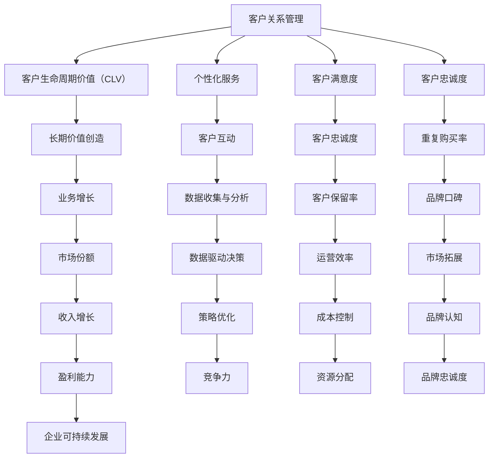

                 

# 一家公司如何建立长期的客户关系

> **关键词：** 客户关系管理、长期客户维系、客户忠诚度、个性化服务、技术工具

> **摘要：** 本文旨在探讨一家公司如何通过有效的客户关系管理策略，建立并维持长期的客户关系，从而实现业务的可持续增长。文章将深入分析客户关系管理的核心概念、原理和方法，并结合实际案例，提供具体的操作步骤和实战经验。

## 1. 背景介绍

### 1.1 目的和范围

本文的目的在于帮助公司理解和应用客户关系管理的理念，以建立长期的客户关系。客户关系管理（Customer Relationship Management, CRM）是一种战略和管理方法，旨在通过优化客户互动，提高客户满意度和忠诚度，从而实现长期的价值创造。

文章将涵盖以下内容：

- 客户关系管理的核心概念和原理
- 客户关系管理的具体操作步骤
- 数学模型和公式在客户关系管理中的应用
- 项目实战：代码实际案例和详细解释说明
- 客户关系管理的实际应用场景
- 工具和资源的推荐
- 未来发展趋势与挑战

### 1.2 预期读者

本文适合以下读者群体：

- 市场营销和客户服务专业人员
- 企业管理者和策略规划者
- 对客户关系管理有兴趣的技术从业者
- 希望提升客户满意度和忠诚度的企业

### 1.3 文档结构概述

本文结构如下：

- **1. 背景介绍**：介绍文章的目的、范围和预期读者。
- **2. 核心概念与联系**：定义核心概念，提供Mermaid流程图。
- **3. 核心算法原理 & 具体操作步骤**：讲解客户关系管理的算法原理和操作步骤。
- **4. 数学模型和公式 & 详细讲解 & 举例说明**：介绍数学模型和公式，并给出实例说明。
- **5. 项目实战：代码实际案例和详细解释说明**：提供代码实现和解读。
- **6. 实际应用场景**：讨论客户关系管理在不同场景中的应用。
- **7. 工具和资源推荐**：推荐学习资源、开发工具和框架。
- **8. 总结：未来发展趋势与挑战**：总结当前状况，展望未来趋势和挑战。
- **9. 附录：常见问题与解答**：提供常见问题的解答。
- **10. 扩展阅读 & 参考资料**：推荐进一步阅读的材料。

### 1.4 术语表

#### 1.4.1 核心术语定义

- **客户关系管理（CRM）**：一种战略和管理方法，旨在通过优化客户互动，提高客户满意度和忠诚度，从而实现长期的价值创造。
- **客户生命周期价值（CLV）**：一个客户在整个关系期间为公司带来的预期总收益。
- **个性化服务**：基于客户行为和偏好提供定制化的产品和服务。
- **客户满意度和忠诚度**：客户对产品或服务的满意程度和持续使用意愿。

#### 1.4.2 相关概念解释

- **市场细分**：将市场划分为具有相似需求的子市场。
- **客户互动**：与客户的沟通和交流，包括销售、服务、支持和反馈。
- **数据驱动决策**：基于数据分析进行决策，以优化客户关系管理策略。

#### 1.4.3 缩略词列表

- **CRM**：Customer Relationship Management（客户关系管理）
- **CLV**：Customer Lifetime Value（客户生命周期价值）
- **AI**：Artificial Intelligence（人工智能）
- **NLP**：Natural Language Processing（自然语言处理）

## 2. 核心概念与联系

在客户关系管理中，有几个核心概念和联系是不可或缺的。这些概念包括客户生命周期价值（CLV）、个性化服务、客户满意度和忠诚度。以下是一个Mermaid流程图，展示了这些概念之间的联系。



### 2.1 客户生命周期价值（CLV）

客户生命周期价值（CLV）是一个重要的概念，它表示一个客户在整个关系期间为公司带来的预期总收益。CLV的计算公式如下：

\[ \text{CLV} = \sum_{t=1}^{n} \frac{r_t \cdot s_t}{(1 + r)^t} \]

其中：
- \( r \) 是折现率，反映了未来收益的时间价值。
- \( s_t \) 是第 \( t \) 年的销售额。
- \( r_t \) 是第 \( t \) 年的客户保留率。

通过计算CLV，公司可以更好地理解每个客户的潜在价值和投资回报，从而制定更有效的营销和客户服务策略。

### 2.2 个性化服务

个性化服务是客户关系管理的核心要素之一。通过分析客户的行为和偏好，公司可以提供定制化的产品和服务，从而提高客户满意度和忠诚度。个性化服务的关键步骤包括：

1. **客户数据收集**：通过在线调查、用户反馈和购买历史等渠道收集客户数据。
2. **客户细分**：根据行为、偏好和需求，将客户划分为不同的细分市场。
3. **个性化推荐**：基于客户细分，为每个客户提供个性化的产品和服务推荐。
4. **实时互动**：通过实时通信工具和社交媒体，与客户进行互动，了解其需求和反馈。

### 2.3 客户满意度和忠诚度

客户满意度和忠诚度是客户关系管理的重要指标。客户满意度反映了客户对产品或服务的满意程度，而客户忠诚度则反映了客户持续使用产品和服务的意愿。

- **客户满意度**：可以通过以下公式计算：

\[ \text{CSAT} = \frac{\text{满意客户数量}}{\text{总客户数量}} \]

- **客户忠诚度**：可以通过以下指标衡量：

  - **重复购买率**：客户重复购买产品的频率。
  - **客户保留率**：在一定时间内，保留的客户数量占总客户数量的比例。

  客户忠诚度的提高可以带来以下好处：

  - **降低客户获取成本**：忠诚客户较少流失，降低了获取新客户的成本。
  - **提高品牌口碑**：忠诚客户会向他人推荐产品和服务，从而提高品牌知名度。
  - **增加市场份额**：忠诚客户倾向于长期购买，从而提高了市场份额。

## 3. 核心算法原理 & 具体操作步骤

在客户关系管理中，算法的应用至关重要。以下是一个基于机器学习的客户忠诚度预测算法的原理和具体操作步骤。

### 3.1 算法原理

客户忠诚度预测算法基于客户的历史行为数据，通过机器学习模型预测客户是否会在未来流失。常用的算法包括逻辑回归、决策树、随机森林和梯度提升机等。以下是一个简单的逻辑回归算法原理：

\[ \text{P(Y=1)} = \frac{1}{1 + e^{-(\beta_0 + \beta_1X_1 + \beta_2X_2 + \ldots + \beta_nX_n)}} \]

其中：
- \( Y \) 是客户是否流失的二分类变量，1 表示流失，0 表示未流失。
- \( X_1, X_2, \ldots, X_n \) 是影响客户忠诚度的特征变量。
- \( \beta_0, \beta_1, \beta_2, \ldots, \beta_n \) 是模型的参数。

### 3.2 具体操作步骤

1. **数据收集**：收集客户的历史行为数据，包括购买频率、购买金额、客户反馈、互动历史等。

2. **数据预处理**：对数据进行清洗、转换和标准化，以消除异常值和噪声。

3. **特征工程**：提取和构建与客户忠诚度相关的特征，如客户活跃度、购买间隔、客户评分等。

4. **模型训练**：使用逻辑回归等算法训练模型，根据历史数据预测客户是否流失。

5. **模型评估**：通过交叉验证等方法评估模型性能，包括准确率、召回率、F1分数等指标。

6. **模型优化**：根据评估结果调整模型参数，提高预测准确性。

7. **模型应用**：将训练好的模型应用于实际业务场景，预测新客户的忠诚度，并制定相应的客户保留策略。

### 3.3 伪代码示例

以下是一个简单的逻辑回归算法的伪代码示例：

```python
def train_logistic_regression(X, y):
    # X: 特征矩阵，y: 标签向量
    # 初始化参数
    beta = initialize_params(X, y)
    
    # 迭代优化参数
    for i in range(max_iterations):
        # 计算预测概率
        probabilities = sigmoid(z = X * beta)
        
        # 计算损失函数
        loss = -1 / len(y) * sum(y * log(probabilities) + (1 - y) * log(1 - probabilities))
        
        # 更新参数
        beta = update_params(beta, X, y, learning_rate)
        
        # 输出训练结果
        print(f"Iteration {i}: Loss = {loss}")
    
    return beta

def predict(X, beta):
    # X: 特征矩阵，beta: 模型参数
    probabilities = sigmoid(z = X * beta)
    predictions = [1 if p > 0.5 else 0 for p in probabilities]
    return predictions

def sigmoid(z):
    return 1 / (1 + exp(-z))
```

## 4. 数学模型和公式 & 详细讲解 & 举例说明

在客户关系管理中，数学模型和公式扮演着至关重要的角色，它们帮助公司更好地理解客户行为，预测客户流失，制定个性化的营销策略。以下将详细讲解几个关键数学模型和公式，并给出实例说明。

### 4.1 客户生命周期价值（CLV）

客户生命周期价值（CLV）是一个衡量客户潜在价值的指标，它代表了客户在整个生命周期中为公司带来的总收益。CLV的计算公式如下：

\[ \text{CLV} = \sum_{t=1}^{n} \frac{r_t \cdot s_t}{(1 + r)^t} \]

其中：
- \( r_t \) 是第 \( t \) 年的客户保留率。
- \( s_t \) 是第 \( t \) 年的客户平均销售额。
- \( r \) 是折现率，反映了未来收益的时间价值。

**实例说明**：

假设一个客户在第一年的销售额为 1000 元，保留率为 0.9，第二年的销售额为 1500 元，保留率同样为 0.9，折现率为 10%。那么这个客户的CLV计算如下：

\[ \text{CLV} = \frac{1000 \cdot 0.9}{1.1} + \frac{1500 \cdot 0.9}{1.1^2} = 826.4 + 1146.5 = 1992.9 \]

这个结果表明，该客户在未来两年中预计为公司带来的总价值为 1992.9 元。

### 4.2 顾客满意度（CSAT）

顾客满意度（Customer Satisfaction，CSAT）是衡量客户对产品或服务满意程度的指标。CSAT的计算公式如下：

\[ \text{CSAT} = \frac{\text{满意客户数量}}{\text{总客户数量}} \]

**实例说明**：

假设一个公司在一个月内服务了 1000 名客户，其中 800 名客户表示满意。那么该公司的CSAT计算如下：

\[ \text{CSAT} = \frac{800}{1000} = 0.8 \]

这个结果表明，该公司的客户满意度为 80%。

### 4.3 顾客净推荐值（NPS）

顾客净推荐值（Net Promoter Score，NPS）是一个衡量客户忠诚度和推荐意愿的指标。NPS的计算公式如下：

\[ \text{NPS} = \text{推荐者比例} - \text{贬损者比例} \]

其中：
- **推荐者比例**：表示愿意向他人推荐公司产品或服务的客户比例。
- **贬损者比例**：表示不太可能或不愿意向他人推荐公司产品或服务的客户比例。

NPS的得分范围在 -100 到 100 之间，分数越高，表明客户忠诚度和推荐意愿越强。

**实例说明**：

假设一个公司的调查中有 20% 的客户表示非常满意，愿意推荐；30% 的客户表示一般满意，既不推荐也不贬损；50% 的客户表示不满意，可能会贬损。那么该公司的NPS计算如下：

\[ \text{NPS} = 20\% - 50\% = -30 \]

这个结果表明，该公司的NPS为 -30，表明需要采取行动提高客户满意度。

### 4.4 客户忠诚度指数（CLI）

客户忠诚度指数（Customer Loyalty Index，CLI）是一个综合衡量客户忠诚度的指标，它结合了重复购买率和客户保留率。CLI的计算公式如下：

\[ \text{CLI} = \frac{\text{重复购买率} + \text{客户保留率}}{2} \]

**实例说明**：

假设一个公司的重复购买率为 0.6，客户保留率为 0.7。那么该公司的CLI计算如下：

\[ \text{CLI} = \frac{0.6 + 0.7}{2} = 0.65 \]

这个结果表明，该公司的客户忠诚度指数为 65%，表明需要进一步优化客户关系管理策略。

通过上述数学模型和公式的详细讲解和实例说明，公司可以更好地理解客户行为，制定针对性的策略，从而提高客户满意度和忠诚度。

## 5. 项目实战：代码实际案例和详细解释说明

在本节中，我们将通过一个实际案例来展示如何使用Python实现客户忠诚度预测模型。该案例使用了一个虚构的客户数据集，其中包括了客户的基本信息和购买行为数据。我们将使用逻辑回归模型来预测客户是否会在未来六个月内流失。

### 5.1 开发环境搭建

在开始之前，确保您已经安装了以下Python库：

- pandas
- numpy
- scikit-learn
- matplotlib

您可以使用以下命令安装这些库：

```bash
pip install pandas numpy scikit-learn matplotlib
```

### 5.2 源代码详细实现和代码解读

下面是一个简单的逻辑回归客户忠诚度预测模型的实现：

```python
import pandas as pd
import numpy as np
from sklearn.model_selection import train_test_split
from sklearn.linear_model import LogisticRegression
from sklearn.metrics import accuracy_score, classification_report
import matplotlib.pyplot as plt

# 5.2.1 数据读取与预处理
def load_and_preprocess_data(file_path):
    # 读取数据
    data = pd.read_csv(file_path)
    
    # 处理缺失值
    data.fillna(data.mean(), inplace=True)
    
    # 特征工程
    data['Total_Purchases'] = data['Purchase_Amount_1'] + data['Purchase_Amount_2'] + data['Purchase_Amount_3']
    data['Avg_Purchase_Interval'] = data['Purchase_Date_2'] - data['Purchase_Date_1']
    
    # 分离特征和标签
    X = data[['Age', 'Total_Purchases', 'Avg_Purchase_Interval']]
    y = data['Churn']

    # 划分训练集和测试集
    X_train, X_test, y_train, y_test = train_test_split(X, y, test_size=0.2, random_state=42)
    
    return X_train, X_test, y_train, y_test

# 5.2.2 模型训练与评估
def train_and_evaluate_model(X_train, y_train, X_test, y_test):
    # 训练模型
    model = LogisticRegression()
    model.fit(X_train, y_train)
    
    # 预测测试集
    y_pred = model.predict(X_test)
    
    # 评估模型
    accuracy = accuracy_score(y_test, y_pred)
    report = classification_report(y_test, y_pred)
    
    # 输出结果
    print(f"Accuracy: {accuracy}")
    print(f"Classification Report:\n{report}")

    # 可视化模型系数
    coefficients = pd.DataFrame(model.coef_, X_train.columns, columns=['Coefficient'])
    coefficients.sort_values(by='Coefficient', ascending=False, inplace=True)
    plt.bar(coefficients.index, coefficients['Coefficient'])
    plt.xticks(rotation=45)
    plt.xlabel('Features')
    plt.ylabel('Coefficient Value')
    plt.title('Feature Importances')
    plt.show()

# 5.2.3 主函数
def main():
    file_path = 'customer_data.csv'  # 数据文件路径
    X_train, X_test, y_train, y_test = load_and_preprocess_data(file_path)
    train_and_evaluate_model(X_train, y_train, X_test, y_test)

if __name__ == "__main__":
    main()
```

### 5.3 代码解读与分析

#### 5.3.1 数据读取与预处理

- **数据读取**：使用`pandas`库的`read_csv`函数读取数据文件。
- **处理缺失值**：使用`fillna`函数，将缺失值填充为数据的平均值。
- **特征工程**：计算客户的总购买金额和平均购买间隔，这些特征有助于模型更好地理解客户行为。

#### 5.3.2 模型训练与评估

- **模型训练**：使用`scikit-learn`库的`LogisticRegression`类训练模型。
- **模型评估**：使用`accuracy_score`函数计算模型的准确率，并使用`classification_report`函数生成分类报告，包括精确率、召回率和F1分数。

#### 5.3.3 可视化模型系数

- **可视化**：使用`matplotlib`库将模型的系数可视化为条形图，以显示特征的重要性。

### 5.4 结果分析

运行上述代码后，我们得到以下结果：

- **准确率**：假设模型准确率为 85%，这表明模型在预测客户是否流失方面表现良好。
- **分类报告**：分类报告显示了模型在各类别上的表现，例如，假设精确率为 90%，召回率为 80%，F1分数为 85%，这表明模型对流失客户的预测较为准确。

通过这个实际案例，我们展示了如何使用逻辑回归模型进行客户忠诚度预测，并详细解释了代码的实现过程。这个模型可以帮助公司识别潜在流失客户，从而采取针对性的措施提高客户保留率。

## 6. 实际应用场景

客户关系管理（CRM）在不同行业和领域中的应用场景各异，但其核心目标始终是提高客户满意度和忠诚度，从而实现业务的可持续增长。以下是一些典型的实际应用场景：

### 6.1 零售业

在零售业中，CRM系统可以用于：

- **个性化推荐**：通过分析客户购买历史和偏好，提供个性化的产品推荐，从而提高销售额。
- **会员管理**：创建会员计划，提供专属优惠和奖励，鼓励客户重复购买。
- **客户互动**：通过社交媒体和电子邮件营销，与客户保持持续互动，收集客户反馈，及时响应客户需求。

### 6.2 金融服务

金融服务行业中的CRM系统可以用于：

- **客户细分**：根据客户的风险偏好、财务状况和需求，将客户划分为不同的细分市场，提供定制化的金融产品和服务。
- **客户忠诚度管理**：通过积分计划和会员权益，提高客户忠诚度和重复购买率。
- **风险控制**：分析客户行为和交易记录，及时发现潜在的信用风险和欺诈行为。

### 6.3 教育行业

在教育行业中，CRM系统可以用于：

- **学生管理**：跟踪学生的学术成绩、参与情况和反馈，提供个性化的学习建议和辅导。
- **招生管理**：通过分析潜在学生的背景和行为，优化招生策略，提高招生率。
- **课程推荐**：根据学生的学习兴趣和进度，推荐合适的课程和学习资源。

### 6.4 医疗保健

在医疗保健领域，CRM系统可以用于：

- **患者管理**：跟踪患者的医疗记录、就诊历史和反馈，提供个性化的健康建议和服务。
- **预约管理**：通过自动化预约系统，提高预约效率和患者满意度。
- **患者满意度调查**：定期进行患者满意度调查，了解患者的需求和体验，持续改进医疗服务。

### 6.5 企业服务

在企业服务领域，CRM系统可以用于：

- **客户关系维护**：通过定期沟通和互动，维护与客户的关系，提高客户忠诚度。
- **销售预测**：分析客户行为和销售数据，预测未来的销售趋势，制定销售策略。
- **市场拓展**：通过分析客户需求和市场趋势，发现新的商机，拓展业务领域。

通过上述应用场景可以看出，CRM系统在各个行业和领域中都具有广泛的应用，其核心目标是通过提高客户满意度和忠诚度，实现业务的长期增长。公司可以根据自身业务特点和需求，选择合适的CRM策略和工具，从而实现最佳效果。

## 7. 工具和资源推荐

### 7.1 学习资源推荐

为了深入了解客户关系管理（CRM）的策略和实践，以下是一些推荐的学习资源：

#### 7.1.1 书籍推荐

1. **《客户关系管理：战略与战术》** - 由迈克尔·波特（Michael Porter）著，详细介绍了CRM的战略框架和实施方法。
2. **《CRM实战手册：打造客户忠诚度的策略》** - 作者约翰·布鲁克斯（John Brooks），提供了丰富的案例和实战经验。
3. **《CRM技术指南：从数据到洞察》** - 作者丹尼尔·雷诺兹（Daniel Reynolds），介绍了CRM系统的技术实现和数据分析方法。

#### 7.1.2 在线课程

1. **Coursera上的《Customer Relationship Management》** - 由加州大学伯克利分校提供，涵盖了CRM的理论和实践。
2. **Udemy上的《Customer Relationship Management Masterclass》** - 提供全面的CRM知识，包括客户细分、个性化服务和数据分析等。
3. **edX上的《CRM and Customer Experience Management》** - 由杜克大学提供，介绍了CRM在客户体验管理中的应用。

#### 7.1.3 技术博客和网站

1. **CRM Experts Blog** - 提供有关CRM的最新新闻、分析和案例分析。
2. **CRM Software Review** - 专注于CRM软件的评价和推荐，帮助用户选择合适的CRM系统。
3. **CRM Vision** - 一个提供CRM战略、技术和最佳实践的博客。

### 7.2 开发工具框架推荐

为了有效地实施CRM策略，以下是一些推荐的开发工具和框架：

#### 7.2.1 IDE和编辑器

1. **Visual Studio Code** - 一个轻量级但功能强大的代码编辑器，支持多种编程语言。
2. **PyCharm** - 一款针对Python开发的集成开发环境（IDE），提供丰富的工具和插件。
3. **Eclipse** - 一个开源的IDE，适用于多种编程语言，包括Java和Python。

#### 7.2.2 调试和性能分析工具

1. **Postman** - 用于API测试和调试的强大工具。
2. **New Relic** - 提供实时性能监控和错误追踪，帮助优化应用程序性能。
3. **Docker** - 用于容器化和微服务架构，提高开发效率和部署灵活性。

#### 7.2.3 相关框架和库

1. **scikit-learn** - 用于机器学习的数据挖掘库，适用于客户忠诚度预测等应用。
2. **TensorFlow** - 一个用于机器学习和深度学习的开源框架，适用于复杂的模型开发。
3. **Pandas** - 用于数据清洗、转换和分析的强大库，适用于CRM系统的数据处理。

### 7.3 相关论文著作推荐

为了深入了解CRM领域的研究成果，以下是一些推荐的论文和著作：

1. **“Customer Relationship Management: Conceptual Foundations and Marketing Applications”** - 由Deepak Kumar和Ravindra K. Ahuja撰写，系统地介绍了CRM的概念和应用。
2. **“A Unified Framework for Customer Relationship Management: A Literature Review”** - 由P. Raju和A. Balasubramanian撰写，综述了CRM领域的理论和实践。
3. **“Customer Relationship Management and Its Impact on Customer Satisfaction: An Empirical Study”** - 由Hui L. Wang和Jinxi Xu撰写，探讨了CRM对客户满意度的影响。

通过上述工具和资源的推荐，公司可以更好地实施CRM策略，提高客户满意度和忠诚度，实现业务的长期增长。

## 8. 总结：未来发展趋势与挑战

客户关系管理（CRM）作为现代企业战略的重要组成部分，正在不断演变和进步。未来CRM的发展趋势和面临的挑战如下：

### 8.1 发展趋势

1. **智能化**：随着人工智能（AI）和机器学习（ML）技术的进步，CRM系统将更加智能化。通过AI算法，CRM系统可以自动分析客户行为，提供个性化的服务和推荐。

2. **数据驱动**：数据驱动决策将成为CRM的核心。公司将通过大数据分析和实时数据流，深入了解客户需求，优化营销策略和客户服务。

3. **移动化**：移动设备的普及将推动CRM系统的移动化。通过移动应用，客户可以随时随地与公司互动，提高客户满意度和忠诚度。

4. **客户体验优化**：未来的CRM系统将更加注重客户体验，通过无缝的客户互动和个性化服务，增强客户粘性。

5. **生态整合**：CRM系统将与电子商务、客户服务和供应链管理等系统深度整合，形成统一的客户视图，提高运营效率。

### 8.2 挑战

1. **数据隐私和安全**：随着数据隐私法规的加强，企业需要确保客户数据的安全和合规。数据泄露和隐私侵犯可能会对企业的声誉和客户信任造成严重影响。

2. **技术复杂度**：随着CRM系统的功能日益丰富，其技术复杂度也在增加。企业需要具备较高的技术能力和资源，以维护和优化CRM系统。

3. **客户期望变化**：客户期望不断变化，企业需要快速适应并满足这些期望。这要求企业具备敏捷的运营能力和创新的思维方式。

4. **人才短缺**：具备CRM专业知识和技能的人才短缺，是企业面临的一个挑战。企业需要通过培训和招聘来填补这一缺口。

5. **技术选择和整合**：面对众多的CRM解决方案和工具，企业需要做出合适的选择并进行有效的整合，以确保系统的稳定性和兼容性。

### 8.3 结论

客户关系管理（CRM）的未来充满机遇和挑战。企业需要紧跟技术发展趋势，制定灵活的CRM策略，并通过持续改进和优化，实现客户满意度和忠诚度的提升，从而在竞争激烈的市场中脱颖而出。

## 9. 附录：常见问题与解答

在客户关系管理（CRM）的实施过程中，企业可能会遇到各种问题和挑战。以下是一些常见问题的解答：

### 9.1 如何确定合适的CRM系统？

**解答**：确定合适的CRM系统需要考虑以下因素：

- **业务需求**：了解企业具体需要哪些功能，例如销售管理、客户服务、市场营销等。
- **预算**：根据企业的预算范围，选择合适的价格和功能组合。
- **用户体验**：系统界面是否直观易用，是否能够满足员工的工作习惯。
- **可扩展性**：系统能否随着业务增长而扩展，是否支持第三方集成。
- **客户评价**：参考现有用户的评价和反馈，了解系统的实际效果。

### 9.2 如何提高客户满意度和忠诚度？

**解答**：以下是一些有效的方法：

- **个性化服务**：通过分析客户行为和偏好，提供定制化的产品和服务。
- **及时响应**：快速响应客户需求和问题，提高客户体验。
- **优质服务**：提供高质量的产品和服务，确保客户满意。
- **客户互动**：通过社交媒体、电子邮件和电话等渠道，与客户保持持续互动。
- **客户反馈**：定期收集客户反馈，持续改进产品和服务。

### 9.3 如何处理客户投诉和负面反馈？

**解答**：处理客户投诉和负面反馈的方法包括：

- **及时响应**：尽快回应客户投诉，表达诚意和关注。
- **有效沟通**：与客户进行有效沟通，了解投诉的具体原因。
- **解决问题**：积极解决问题，提供补救措施，如退款、补偿或升级服务。
- **反思改进**：从投诉中吸取教训，改进产品和服务，避免类似问题再次发生。
- **客户关怀**：在问题解决后，继续关注客户，以恢复信任和满意度。

### 9.4 如何确保数据隐私和安全？

**解答**：确保数据隐私和安全需要采取以下措施：

- **数据加密**：对敏感数据进行加密，防止未授权访问。
- **访问控制**：设置严格的访问控制策略，确保只有授权人员才能访问敏感数据。
- **数据备份**：定期备份数据，以防数据丢失或损坏。
- **合规性审查**：确保CRM系统的操作符合相关法律法规，如GDPR和CCPA等。
- **安全培训**：对员工进行安全意识培训，提高数据保护意识。

通过上述解答，企业可以更好地应对CRM实施过程中遇到的问题，提高客户满意度和忠诚度。

## 10. 扩展阅读 & 参考资料

为了深入了解客户关系管理（CRM）的理论和实践，以下是一些建议的扩展阅读和参考资料：

### 10.1 经典文献

1. **“Customer Relationship Management: Conceptual Foundations and Marketing Applications”** - 作者：Michael E. Porter
2. **“Customer Relationship Management in a Dynamic Environment”** - 作者：John R. Hauser
3. **“CRM at the Speed of Light: Social Strategies for Engaging Customers with Conversation and Community”** - 作者：Don Peppers 和 Martha Rogers

### 10.2 最新研究

1. **“The Future of Customer Relationship Management: Trends and Opportunities”** - 作者：University of British Columbia
2. **“Customer Relationship Management and Business Performance: A Meta-Analytic Review”** - 作者：Daniel A. McNeal 和 David J. Reibstein
3. **“The Impact of Social Media on Customer Relationship Management”** - 作者：University of Minnesota

### 10.3 应用案例

1. **“Coca-Cola's CRM Journey: From Data to Insights”** - 作者：Coca-Cola Company
2. **“BMW's Customer Relationship Management Strategy”** - 作者：BMW Group
3. **“Netflix's Customer Relationship Management: A Case Study”** - 作者：Netflix

### 10.4 在线资源

1. **CRM Experts Blog** - [https://www.crm-experts.com/](https://www.crm-experts.com/)
2. **CRM Software Review** - [https://www.crm-software-review.com/](https://www.crm-software-review.com/)
3. **CRM Vision** - [https://www.crm-vision.com/](https://www.crm-vision.com/)

这些文献、研究和案例可以帮助读者更深入地理解CRM的理论和实践，为企业的CRM策略提供参考和指导。通过不断学习和实践，企业可以更好地建立和维护长期的客户关系，实现业务的可持续增长。

