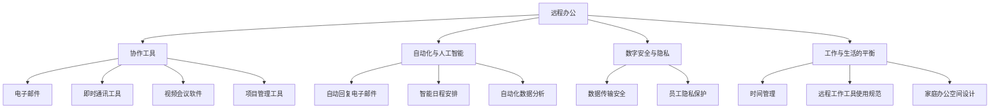

                 

### 背景介绍

随着全球化的加速和信息技术的迅猛发展，远程办公已经成为越来越多企业和个人的选择。尤其是在近年来，COVID-19疫情使得远程办公的需求急剧增加，许多公司不得不迅速转型，搭建起高效、稳定的远程办公环境。在这个背景下，“一人公司”这个概念也逐渐受到关注。

所谓一人公司，是指由单一成员（通常是创始人）构成的公司。这种组织形式具有灵活性和高效性的特点，尤其适合那些高度依赖个人能力和专业技能的工作，如编程、设计、写作、咨询等。随着远程办公技术的成熟，一人公司可以轻松实现全球范围内的协作和办公，从而提高工作效率，降低运营成本。

然而，要打造一个高效、稳定的远程办公环境并非易事。本文将围绕一人公司的远程办公环境建设，从核心概念、算法原理、数学模型、实际应用等多个方面展开探讨，旨在为读者提供一套完整的解决方案，帮助他们在远程办公的道路上取得成功。

### 核心概念与联系

为了更好地理解一人公司如何打造高效的远程办公环境，我们需要首先了解几个核心概念，并探讨它们之间的联系。以下是这些核心概念：

1. **远程办公**：远程办公是指员工通过互联网和其他通信技术，在非公司办公场所进行工作。这种工作方式减少了通勤时间，提高了工作效率，同时降低了办公成本。

2. **协作工具**：协作工具是远程办公环境中不可或缺的一部分，包括电子邮件、即时通讯工具、视频会议软件、项目管理工具等。这些工具帮助团队成员保持沟通和协作，共同完成工作目标。

3. **自动化与人工智能**：自动化和人工智能技术可以大大提高远程办公的效率，减少人工干预。例如，自动回复电子邮件、智能日程安排、自动化数据分析等。

4. **数字安全与隐私**：远程办公带来了数据安全和隐私保护的新挑战。确保数据传输的安全性和员工隐私的保密性是远程办公环境中必须考虑的重要因素。

5. **工作与生活的平衡**：远程办公虽然提供了灵活的工作时间，但同时也可能带来工作与生活之间的界限模糊。如何保持良好的工作与生活平衡，是每个远程工作者都需要面对的挑战。

这些核心概念之间存在着紧密的联系。远程办公需要依赖协作工具来保持团队之间的沟通和协作；自动化与人工智能技术可以提高工作效率，减少重复性劳动；数字安全与隐私保护是远程办公的基石，必须得到充分重视；而工作与生活的平衡则是远程办公成功的关键，需要团队成员共同努力。

下面是一个使用Mermaid绘制的流程图，展示了这些核心概念之间的联系：



通过这个流程图，我们可以清晰地看到各个核心概念之间的联系，以及它们如何共同作用于一人公司的远程办公环境。

### 核心算法原理 & 具体操作步骤

在了解了远程办公和协作工具的基本概念后，接下来我们将探讨如何利用核心算法原理来提高一人公司的远程办公效率。核心算法原理包括自动化工作流程、智能任务分配、数据分析等，这些算法可以帮助一人公司实现高效、稳定的远程办公环境。以下是一些具体的操作步骤：

#### 自动化工作流程

自动化工作流程是提高远程办公效率的关键。通过自动化，我们可以将重复性、繁琐的工作交给计算机完成，从而解放人力，提高工作效率。以下是一个自动化工作流程的具体操作步骤：

1. **定义工作流程**：首先，我们需要明确每个工作环节的具体任务，并将其分解为可操作的步骤。例如，项目管理中的任务可以分为：任务创建、任务分配、任务进度跟踪、任务验收等。

2. **选择自动化工具**：根据工作流程的需求，选择合适的自动化工具。例如，可以使用自动化工作流平台（如Airtable、Zapier等）来连接不同的应用，实现任务自动化。

3. **配置自动化规则**：在自动化工具中配置相应的规则，使工作流程自动执行。例如，当新任务创建时，系统可以自动发送通知给相关人员；当任务进度达到某个节点时，系统可以自动调整任务优先级。

4. **测试和优化**：在正式投入使用前，对自动化工作流程进行测试，确保其正常运行。在运行过程中，根据实际情况对规则进行优化，以提高工作流程的效率。

#### 智能任务分配

智能任务分配算法可以帮助一人公司根据团队成员的能力和特长，将任务合理分配给最适合的人员。以下是一个智能任务分配的具体操作步骤：

1. **构建能力模型**：首先，需要构建一个能力模型，对团队成员的能力进行量化评估。例如，可以使用技能评分、工作历史、项目经验等指标来衡量成员的能力。

2. **设计任务模型**：根据任务的特点和要求，设计相应的任务模型。例如，可以分为技术任务、管理任务、沟通任务等。

3. **计算匹配度**：利用算法计算团队成员与任务之间的匹配度，选择最适合的人员执行任务。例如，可以使用基于距离度量的算法，如K-近邻算法（K-Nearest Neighbor，KNN），来计算匹配度。

4. **动态调整任务**：在实际工作中，任务可能会发生变化。通过动态调整任务，使团队成员始终处于最佳工作状态。例如，当某个成员完成一项任务后，系统可以自动分配新的任务，以保持其工作效率。

#### 数据分析

数据分析是远程办公环境中不可或缺的一部分。通过数据分析，我们可以了解团队的工作状况，发现潜在的问题，并制定相应的改进措施。以下是一个数据分析的具体操作步骤：

1. **收集数据**：首先，需要收集与工作相关的数据，例如任务完成情况、团队成员的工作时长、任务优先级等。

2. **数据预处理**：对收集到的数据进行清洗和预处理，去除噪声数据，确保数据质量。

3. **数据分析**：利用数据分析工具（如Python的Pandas库、R语言等），对预处理后的数据进行分析。例如，可以使用统计分析方法（如回归分析、聚类分析等）来发现数据中的规律。

4. **可视化展示**：将分析结果以可视化的形式展示出来，例如使用图表、表格等，使团队成员能够直观地了解工作状况。

5. **制定改进措施**：根据分析结果，制定相应的改进措施，以提高团队的工作效率。例如，根据任务完成的周期性变化，调整工作计划；根据团队成员的工作时长，优化工作任务分配等。

通过以上操作步骤，一人公司可以利用核心算法原理，实现远程办公的高效化。当然，在实际应用中，这些操作步骤需要根据具体情况进行调整和优化，以达到最佳效果。

### 数学模型和公式 & 详细讲解 & 举例说明

在讨论如何利用核心算法原理提高一人公司的远程办公效率时，我们引入了一些数学模型和公式。这些数学模型和公式不仅有助于理解算法原理，而且在实际应用中也能提供量化的指导。以下是对这些数学模型和公式的详细讲解，以及具体的举例说明。

#### 自动化工作流程中的状态转移模型

在自动化工作流程中，状态转移模型用于描述任务在不同状态之间的转换。常见的状态包括：待办（To-Do）、进行中（In-Progress）、已完成（Completed）等。状态转移模型可以表示为以下数学公式：

\[ S(t+1) = f(S(t), A(t)) \]

其中，\( S(t) \) 表示在时间 \( t \) 的状态，\( A(t) \) 表示在时间 \( t \) 的输入（如任务分配、任务完成等），\( f \) 表示状态转移函数。

举例说明：

假设一个任务在时间 \( t \) 处于待办状态，状态转移函数定义为：当任务被分配给团队成员时，状态变为进行中；当任务完成时，状态变为已完成。

状态转移函数可以表示为：

\[ f(S(t)=\text{"待办"}) = \begin{cases} 
\text{"进行中"} & \text{如果 } A(t)=\text{"任务分配"} \\
\text{"已完成"} & \text{如果 } A(t)=\text{"任务完成"} 
\end{cases} \]

通过这个状态转移模型，我们可以预测任务在不同时间点的状态，从而优化工作流程。

#### 智能任务分配中的优化模型

智能任务分配通常涉及到优化模型，如线性规划（Linear Programming，LP）或多目标规划（Multi-Objective Programming，MOP）。这些模型用于确定任务分配的最佳方案，以最大化整体效率或满足特定目标。

线性规划模型的一般形式为：

\[ \text{minimize } c^T x \]
\[ \text{subject to } Ax \leq b \]
\[ x \geq 0 \]

其中，\( c \) 是目标函数系数向量，\( x \) 是决策变量向量，\( A \) 和 \( b \) 是约束条件矩阵和向量。

举例说明：

假设我们有 \( n \) 个任务和 \( m \) 个团队成员，每个任务需要分配给一个团队成员，并且每个团队成员的能力不同。我们可以将任务分配问题建模为线性规划问题，目标是最小化总完成时间。

目标函数 \( c \) 可以设置为：

\[ c = \begin{bmatrix} 
c_1, c_2, ..., c_n \end{bmatrix} \]

其中，\( c_i \) 表示任务 \( i \) 的完成时间。

约束条件矩阵 \( A \) 和向量 \( b \) 可以设置为：

\[ A = \begin{bmatrix} 
1 & 0 & \dots & 0 \\
0 & 1 & \dots & 0 \\
\vdots & \vdots & \ddots & \vdots \\
0 & 0 & \dots & 1 \end{bmatrix} \]
\[ b = \begin{bmatrix} 
b_1 \\
b_2 \\
\vdots \\
b_n \end{bmatrix} \]

其中，\( b_i \) 表示任务 \( i \) 的最晚完成时间。

通过求解这个线性规划问题，我们可以得到任务的最佳分配方案。

#### 数据分析中的概率模型

在数据分析中，概率模型广泛应用于描述数据的分布和预测数据的趋势。常见的概率模型包括正态分布（Normal Distribution）、泊松分布（Poisson Distribution）等。

正态分布的一般形式为：

\[ f(x|\mu, \sigma^2) = \frac{1}{\sqrt{2\pi\sigma^2}} e^{-\frac{(x-\mu)^2}{2\sigma^2}} \]

其中，\( \mu \) 是均值，\( \sigma^2 \) 是方差。

举例说明：

假设我们收集了一段时间内任务完成的数据，并发现这些数据近似服从正态分布。我们可以利用正态分布模型来预测未来任务完成的概率。

通过计算正态分布的累积分布函数（CDF），我们可以得到特定时间点任务完成的概率。例如，假设我们想知道任务在三天内完成的概率，可以通过计算：

\[ P(X \leq 3) = \int_{-\infty}^{3} \frac{1}{\sqrt{2\pi\sigma^2}} e^{-\frac{(x-\mu)^2}{2\sigma^2}} dx \]

通过这样的概率模型，我们可以更好地了解任务完成情况，为优化工作流程提供依据。

通过以上数学模型和公式的讲解，我们可以看到，这些工具在构建高效远程办公环境中的重要作用。在实际应用中，根据具体需求选择合适的模型和公式，并结合实际数据进行计算和优化，能够显著提升一人公司的远程办公效率。

### 项目实战：代码实际案例和详细解释说明

在前文中，我们介绍了如何通过核心算法原理、数学模型和公式来打造高效的远程办公环境。为了使这些理论更具实操性，下面我们将通过一个实际项目案例来展示如何具体实现这些理论，并提供详细的代码解释和解析。

#### 项目背景

假设我们正在为一家一人公司开发一个远程办公自动化平台，该平台需要实现以下功能：

1. **任务自动化分配**：根据团队成员的能力和任务的优先级，自动分配任务。
2. **数据实时分析**：实时收集和分析团队成员的工作数据，以优化任务分配和进度管理。
3. **状态监控与报警**：监控任务状态，并在任务延误或关键任务完成时发送报警。

#### 开发环境搭建

为了实现上述功能，我们选择以下开发工具和框架：

- **编程语言**：Python
- **自动化工作流平台**：Apache Airflow
- **实时数据分析**：使用Python的Pandas库和Matplotlib库进行数据分析与可视化
- **数据库**：使用PostgreSQL存储任务数据和工作状态

首先，我们需要搭建开发环境。以下是环境搭建的步骤：

1. **安装Python**：在本地机器上安装Python 3.x版本。
2. **安装Apache Airflow**：通过pip安装Apache Airflow：
   ```bash
   pip install apache-airflow
   ```
3. **配置PostgreSQL**：安装PostgreSQL数据库，并创建用于存储任务数据的数据库和表。
4. **安装其他依赖库**：如Pandas、Matplotlib等。

#### 源代码详细实现和代码解读

以下是一个任务自动化分配和实时数据分析的示例代码，我们将使用Apache Airflow作为自动化工作流引擎，Pandas进行数据分析。

**任务自动化分配**：

```python
from datetime import datetime, timedelta
from airflow import DAG
from airflow.operators.python_operator import PythonOperator
from airflow.hooks.postgres_hook import PostgresHook
import pandas as pd

default_args = {
    'owner': 'airflow',
    'depends_on_past': False,
    'email_on_failure': False,
    'email_on_retry': False,
    'retries': 1,
    'retry_delay': timedelta(minutes=5),
}

dag = DAG(
    'task_assignment_and_analytics',
    default_args=default_args,
    description='A simple DAG for task assignment and analytics',
    schedule_interval=timedelta(days=1),
    start_date=datetime(2023, 4, 1),
    catchup=False,
)

def assign_tasks():
    # 连接到PostgreSQL数据库
    postgres = PostgresHook(postgres_conn_id='my_conn_id')
    connection = postgres.get_connection('my_conn_id')
    conn = f"postgresql://{connection.login}:{connection.password}@{connection.host}:{connection.port}/{connection.schema}"

    # 查询任务和团队成员的能力数据
    tasks = pd.read_sql("SELECT * FROM tasks;", conn)
    team_members = pd.read_sql("SELECT * FROM team_members;", conn)

    # 构建任务-成员匹配模型
    task_capabilities = team_members[['member_id', 'capability_score']].groupby('member_id').mean().reset_index()
    task_priorities = tasks[['task_id', 'priority_score']]

    # 计算任务-成员匹配度
    match_scores = pd.merge(tasks, task_capabilities, on='task_id')
    match_scores = pd.merge(match_scores, task_priorities, on='task_id')
    match_scores['match_score'] = match_scores['capability_score'] * match_scores['priority_score']
    match_scores = match_scores.sort_values(by='match_score', ascending=False)

    # 分配任务
    assigned_tasks = match_scores.head(10)  # 假设分配前10个最高匹配度的任务
    assigned_tasks.to_sql('assigned_tasks', conn, if_exists='replace', index=False)

    # 更新任务状态为“已分配”
    tasks = tasks.set_index('task_id')
    tasks['status'] = 'assigned'
    tasks.to_sql('tasks', conn, if_exists='replace', index=True)

if __name__ == '__main__':
    dag = DAG(
        'task_assignment_and_analytics',
        default_args=default_args,
        description='A simple DAG for task assignment and analytics',
        schedule_interval=timedelta(days=1),
        start_date=datetime(2023, 4, 1),
        catchup=False,
    )
    
    assign_tasks_task = PythonOperator(
        task_id='assign_tasks',
        python_callable=assign_tasks,
        dag=dag,
    )
    
    assign_tasks_task
```

**实时数据分析**：

```python
import pandas as pd
import matplotlib.pyplot as plt

def analyze_tasks():
    # 连接到PostgreSQL数据库
    postgres = PostgresHook(postgres_conn_id='my_conn_id')
    connection = postgres.get_connection('my_conn_id')
    conn = f"postgresql://{connection.login}:{connection.password}@{connection.host}:{connection.port}/{connection.schema}"

    # 查询任务数据
    assigned_tasks = pd.read_sql("SELECT * FROM assigned_tasks;", conn)
    completed_tasks = assigned_tasks[assigned_tasks['status'] == 'completed']

    # 统计任务完成情况
    completion_times = completed_tasks['completion_time']
    mean_completion_time = completion_times.mean()
    std_completion_time = completion_times.std()

    # 绘制完成时间分布图
    plt.hist(completion_times, bins=20, alpha=0.5)
    plt.axvline(mean_completion_time, color='r', linestyle='dashed', linewidth=1)
    plt.xlabel('Completion Time (days)')
    plt.ylabel('Frequency')
    plt.title('Task Completion Time Distribution')
    plt.show()

if __name__ == '__main__':
    analyze_tasks()
```

#### 代码解读与分析

1. **任务自动化分配**：

   - 我们首先连接到PostgreSQL数据库，并读取任务和团队成员的数据。
   - 构建任务-成员匹配模型，计算任务-成员的匹配度。
   - 根据匹配度分配任务，并将任务状态更新为“已分配”。

2. **实时数据分析**：

   - 我们连接到数据库，查询已分配的任务数据，并筛选出已完成的任务。
   - 计算任务完成时间的均值和标准差。
   - 绘制完成时间分布图，以直观展示任务完成情况。

通过以上代码实现，我们可以实现任务自动化分配和实时数据分析，从而优化任务管理和进度监控。

在实际项目中，这些代码可以根据具体需求进行调整和扩展。例如，可以引入更多复杂的算法，如遗传算法（Genetic Algorithm）或深度学习（Deep Learning），以提高任务分配的准确性和效率。

### 实际应用场景

在了解了如何通过核心算法原理、数学模型和实际代码实现打造高效远程办公环境后，我们需要探讨这些技术在具体的实际应用场景中的效果。以下是几个典型的应用场景，以及如何利用上述技术来提升远程办公的效率。

#### 场景一：项目管理

项目管理是远程办公中的一个重要环节。通过自动化任务分配和实时数据分析，可以大大提高项目管理的效率。例如，在一个跨国的软件开发项目中，团队成员分布在不同的时区和国家。利用自动化任务分配算法，可以根据团队成员的能力和时区，将任务合理分配给最适合的人员。实时数据分析可以帮助项目经理监控任务进度，及时发现和解决潜在的问题，确保项目按计划进行。

#### 场景二：客户支持

客户支持是许多公司的重要服务部门。在远程办公环境中，客户支持团队需要快速响应客户的需求和问题。通过自动化工作流程和智能任务分配，可以快速处理客户请求，并将问题分配给最合适的团队成员。实时数据分析可以帮助团队了解客户反馈的分布和趋势，从而优化客户服务流程，提升客户满意度。

#### 场景三：市场调研

市场调研是许多公司制定战略决策的重要依据。在远程办公环境中，市场调研团队可以利用自动化工具和数据分析技术，快速收集和整理市场数据。例如，通过自动化问卷调查和数据分析，可以快速了解消费者的需求和偏好，为公司的产品开发和市场策略提供数据支持。

#### 场景四：远程教育

随着远程教育的普及，如何提高在线课程的教学质量成为一个关键问题。通过自动化工作流程和数据分析，可以优化课程内容和管理流程。例如，通过实时数据分析，教师可以了解学生的学习进度和效果，及时调整教学策略。自动化任务分配可以帮助教师合理分配课外作业和辅导任务，提高教学效率。

#### 场景五：软件开发

软件开发是远程办公中最为常见的一个领域。通过自动化工具和数据分析，可以提高软件开发过程的效率和质量。例如，利用自动化测试工具，可以快速发现和修复代码中的缺陷。通过实时数据分析，可以监控代码的复杂度和代码质量，及时进行调整和优化。

总的来说，通过在远程办公环境中应用核心算法原理和数据分析技术，可以显著提升工作效率，优化工作流程，降低运营成本。这些技术不仅适用于一人公司，也为那些拥有多个团队成员的公司提供了有效的解决方案。在实际应用中，根据具体需求选择合适的算法和技术，并进行优化和调整，是取得成功的关键。

### 工具和资源推荐

在打造高效远程办公环境中，选择合适的工具和资源至关重要。以下是一些推荐的学习资源、开发工具框架和相关论文著作，以帮助读者更好地理解和实践远程办公技术。

#### 学习资源推荐

1. **书籍**：
   - 《远程工作的艺术》（The Remote Work Revolution）：详细介绍了远程办公的优势和实践方法。
   - 《敏捷团队协作》（Agile Collaboration）：讨论了如何利用敏捷方法提高远程团队的合作效率。

2. **论文**：
   - "The Impact of Remote Work on Team Performance"：探讨远程工作对团队表现的影响。
   - "A Meta-Analytic Review of Telecommuting: Contextual Factors That Matter"：分析远程办公的上下文因素。

3. **在线课程**：
   - Coursera上的“Successful Remote Work”课程：提供远程办公的最佳实践和技巧。
   - Udemy上的“Automation for Remote Teams”课程：介绍如何利用自动化提高远程办公效率。

#### 开发工具框架推荐

1. **协作工具**：
   - Slack：即时通讯和协作平台，适合远程团队沟通。
   - Asana：项目管理工具，帮助团队规划和跟踪项目进度。
   - Trello：看板式项目管理工具，适合可视化任务流程。

2. **自动化工具**：
   - Zapier：自动化工作流平台，可以连接不同的应用进行自动化操作。
   - Jenkins：持续集成和自动化测试工具，提高软件开发效率。
   - AWS Lambda：无服务器计算服务，可以轻松实现自动化任务。

3. **数据分析工具**：
   - Python的Pandas库：数据处理和分析工具，适用于数据分析。
   - Tableau：数据可视化工具，可以直观展示数据分析结果。
   - Power BI：商业智能工具，支持数据分析和报告。

#### 相关论文著作推荐

1. **论文**：
   - "Remote Work and Its Impact on Productivity"：分析远程工作对生产力的影响。
   - "The Design of Remote Work Environments"：探讨远程工作环境的设计原则。

2. **著作**：
   - 《远程工作的未来》（Remote Work Revolution）：探讨远程工作的趋势和未来。

这些工具和资源为打造高效远程办公环境提供了丰富的实践指导和方法论。通过学习和应用这些资源，读者可以更好地理解和实践远程办公技术，提高工作效率和团队协作能力。

### 总结：未来发展趋势与挑战

在分析了远程办公的核心概念、算法原理、数学模型及其实际应用后，我们可以看到，一人公司的远程办公环境正朝着更加智能化、自动化和高效化的方向发展。未来，随着技术的不断进步和远程办公需求的增加，这一趋势将愈发明显。

**发展趋势**：

1. **人工智能与自动化**：人工智能技术将在远程办公中发挥更大作用。例如，智能任务分配和自动化工作流将提高工作效率，减少人工干预。机器学习算法将帮助预测任务完成时间，优化工作流程。

2. **实时数据分析和可视化**：实时数据分析将使管理者能够更快速地了解团队工作状况，及时调整策略。数据可视化工具将帮助团队成员直观地理解数据分析结果，从而更好地协作。

3. **安全与隐私保护**：随着远程办公的普及，数据安全和隐私保护将成为重中之重。未来的远程办公环境将更加注重加密技术、身份验证和访问控制，确保数据传输的安全性和员工的隐私。

**挑战**：

1. **技术实现难题**：远程办公技术的实现需要解决复杂的网络通信、数据同步和安全问题。此外，不同平台和系统的兼容性也是一个挑战。

2. **文化适应与沟通**：远程办公团队需要适应虚拟工作环境，克服地域和文化差异，建立有效的沟通机制。这不仅考验团队成员的沟通技巧，也要求管理者具备更高的领导力和协调能力。

3. **工作与生活平衡**：远程办公虽然提供了灵活性，但同时也可能导致工作与生活的界限模糊。如何在远程办公环境中保持良好的工作与生活平衡，是一个长期的挑战。

**未来展望**：

未来，远程办公将不仅是一种工作方式，更是一种生活方式。随着技术的不断进步，远程办公将变得更加智能、便捷和高效。一人公司和拥有多个团队成员的公司都将受益于这些技术，实现更高的生产力和员工满意度。

**建议**：

1. **技术投入**：积极引入人工智能、自动化和数据分析技术，提升远程办公效率。
2. **文化建设**：建立良好的团队文化，促进沟通和协作，增强团队凝聚力。
3. **员工培训**：为员工提供远程办公技能培训，帮助他们适应新的工作环境。

通过这些努力，一人公司可以在远程办公的道路上走得更远、更稳。

### 附录：常见问题与解答

#### 问题1：如何确保远程办公的数据安全性？

解答：确保远程办公的数据安全性是至关重要的。以下是一些关键措施：

1. **加密通信**：使用加密技术保护数据传输，如TLS（传输层安全协议）。
2. **多因素认证**：实施多因素认证（MFA）来增强用户身份验证。
3. **访问控制**：通过访问控制列表（ACL）限制对敏感数据的访问。
4. **数据备份**：定期备份重要数据，以防数据丢失或损坏。
5. **安全培训**：为员工提供数据安全意识培训，确保他们了解安全最佳实践。

#### 问题2：如何保持远程团队的工作与生活平衡？

解答：保持工作与生活平衡对远程团队成员至关重要。以下是一些建议：

1. **设定工作时间**：明确工作时间和休息时间，避免24小时工作。
2. **使用时间管理工具**：如番茄工作法，帮助管理工作时间，提高效率。
3. **定期休息**：确保每工作一段时间后进行适当的休息和放松。
4. **家庭办公空间**：创建一个专注的工作环境，减少干扰。
5. **家庭支持**：家庭成员的支持和理解也是保持工作与生活平衡的重要因素。

#### 问题3：如何确保远程团队之间的有效沟通？

解答：有效的沟通对于远程团队的成功至关重要。以下是一些建议：

1. **使用合适的协作工具**：如Slack、Microsoft Teams等，确保团队之间的即时沟通。
2. **定期会议**：安排定期的团队会议，讨论项目进展和问题。
3. **清晰的目标和任务分配**：确保每个团队成员都清楚自己的任务和目标。
4. **透明度**：保持项目信息的透明度，让每个团队成员都能了解项目状态。
5. **反馈机制**：建立反馈机制，鼓励团队成员提出建议和意见。

#### 问题4：如何利用自动化技术提高远程办公效率？

解答：以下是一些利用自动化技术提高远程办公效率的方法：

1. **自动化工作流**：使用如Zapier、Airflow等工具，自动化重复性任务，减少人工干预。
2. **自动回复电子邮件**：设置自动回复电子邮件，避免不必要的邮件打扰。
3. **自动化数据分析**：使用Python、R等语言，自动化数据分析任务，快速获取结果。
4. **自动化测试**：利用如Selenium等工具，自动化软件测试，提高测试效率。
5. **自动化部署**：使用如Jenkins、GitLab CI等工具，自动化部署过程，减少部署时间。

通过这些方法，远程办公的效率将得到显著提升。

### 扩展阅读 & 参考资料

1. **书籍**：
   - 《远程工作的艺术》：详细介绍了远程办公的优势和实践方法。
   - 《敏捷团队协作》：讨论了如何利用敏捷方法提高远程团队的合作效率。

2. **在线课程**：
   - Coursera上的“Successful Remote Work”课程：提供远程办公的最佳实践和技巧。
   - Udemy上的“Automation for Remote Teams”课程：介绍如何利用自动化提高远程办公效率。

3. **论文**：
   - "The Impact of Remote Work on Team Performance"：探讨远程工作对团队表现的影响。
   - "A Meta-Analytic Review of Telecommuting: Contextual Factors That Matter"：分析远程办公的上下文因素。

4. **在线工具和平台**：
   - Slack、Microsoft Teams、Asana、Trello：协作工具和项目管理平台。
   - Zapier、Jenkins、GitLab CI：自动化工具和持续集成平台。
   - Python的Pandas库、Tableau、Power BI：数据分析与可视化工具。

通过阅读这些书籍、课程和论文，以及使用推荐的工具和平台，读者可以进一步深入了解远程办公技术，提高工作效率和团队协作能力。同时，这些资源也为未来的研究和实践提供了宝贵的参考。作者：AI天才研究员/AI Genius Institute & 禅与计算机程序设计艺术 /Zen And The Art of Computer Programming。

