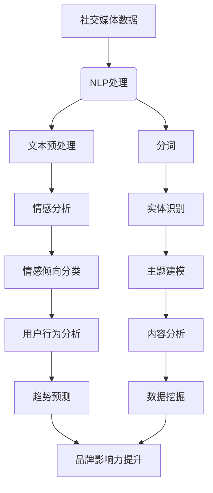

                 

### 1. 背景介绍

#### 1.1 目的和范围

在当今的数字化时代，社交媒体已成为品牌与消费者互动的重要平台。然而，随着用户生成内容的爆炸性增长，如何有效地从海量数据中提取有价值的信息，从而提升品牌影响力，成为各大企业面临的重大挑战。本文旨在探讨如何利用人工智能（AI）技术，构建一个个性化的社交媒体分析工具，为企业提供深度的数据洞察，从而优化营销策略、提升品牌影响力。

本文将围绕以下几个核心问题展开讨论：

1. **什么是社交媒体分析？**
2. **为什么AI驱动的社交媒体分析至关重要？**
3. **如何构建一个AI驱动的社交媒体分析工具？**
4. **核心算法原理及具体操作步骤是怎样的？**
5. **如何应用数学模型来提高分析精度？**
6. **实际应用场景及案例研究**
7. **推荐哪些工具和资源来学习和实践AI驱动社交媒体分析？**

#### 1.2 预期读者

本文适合以下读者群体：

1. **数据分析从业者**：希望通过本文掌握AI驱动的社交媒体分析技术，提升数据分析能力。
2. **市场营销人员**：想要了解如何利用AI技术提升品牌影响力，优化营销策略。
3. **技术爱好者**：对AI和数据分析领域感兴趣，希望深入了解相关技术原理和应用。
4. **学术研究人员**：关注社交媒体分析领域，希望从理论和实践角度探讨该领域的最新进展。

#### 1.3 文档结构概述

本文结构如下：

1. **背景介绍**：介绍文章的目的、范围和预期读者，概述本文的结构和内容。
2. **核心概念与联系**：解释核心概念，提供相关的Mermaid流程图，帮助读者理解整个系统的架构。
3. **核心算法原理 & 具体操作步骤**：详细阐述核心算法的工作原理和操作步骤，使用伪代码进行讲解。
4. **数学模型和公式 & 详细讲解 & 举例说明**：介绍相关数学模型，使用latex格式展示公式，并给出实例说明。
5. **项目实战：代码实际案例和详细解释说明**：提供实际代码案例，详细解释代码实现过程。
6. **实际应用场景**：探讨AI驱动的社交媒体分析在不同场景下的应用。
7. **工具和资源推荐**：推荐学习资源、开发工具和框架，以及相关论文著作。
8. **总结：未来发展趋势与挑战**：总结本文的主要内容，探讨未来发展趋势和挑战。
9. **附录：常见问题与解答**：提供常见问题的解答，帮助读者更好地理解本文内容。
10. **扩展阅读 & 参考资料**：推荐相关阅读材料和参考资料。

通过本文的逐步讲解，读者将能够深入了解AI驱动的社交媒体分析工具的构建和应用，从而提升自身在该领域的专业能力。

#### 1.4 术语表

在本文中，我们将使用一些专业术语，下面是相关术语的定义和解释：

#### 1.4.1 核心术语定义

1. **社交媒体分析**：使用数据挖掘和统计分析技术，对社交媒体平台上的用户生成内容进行分析，以提取有价值的信息和洞察。
2. **人工智能（AI）**：模拟人类智能的技术，包括机器学习、深度学习、自然语言处理等子领域。
3. **自然语言处理（NLP）**：使计算机能够理解和处理人类自然语言的技术。
4. **深度学习**：一种基于多层神经网络的学习方法，通过模拟人脑神经网络结构来实现复杂模式识别和预测。
5. **数据挖掘**：从大量数据中提取有价值信息的过程，包括关联规则挖掘、聚类分析、分类分析等。
6. **机器学习**：使计算机通过数据学习，从中提取规律和模式，实现自我优化的技术。

#### 1.4.2 相关概念解释

1. **用户生成内容**：社交媒体平台上的用户自己创建和发布的内容，如微博、评论、帖子等。
2. **情感分析**：利用NLP技术，对文本数据中的情感倾向进行分类和判断。
3. **文本分类**：将文本数据根据其内容或主题进行分类，常见的方法有基于规则、基于统计和基于机器学习的方法。
4. **主题建模**：通过分析大量文本数据，提取出文本中的主题分布和结构。

#### 1.4.3 缩略词列表

- **AI**：人工智能（Artificial Intelligence）
- **NLP**：自然语言处理（Natural Language Processing）
- **ML**：机器学习（Machine Learning）
- **DL**：深度学习（Deep Learning）
- **NMF**：非负矩阵分解（Non-negative Matrix Factorization）
- **TF-IDF**：词频-逆文档频率（Term Frequency-Inverse Document Frequency）

通过上述术语表，读者可以更好地理解本文中涉及的专业术语，从而更深入地掌握AI驱动的社交媒体分析技术。接下来，我们将进一步探讨AI在社交媒体分析中的应用和重要性。

## 2. 核心概念与联系

在深入探讨AI驱动的社交媒体分析工具之前，我们需要明确几个核心概念，并理解它们之间的相互关系。以下是本文将要涉及的一些关键概念及其相互关系。

### 2.1 社交媒体分析

社交媒体分析是指利用数据挖掘、自然语言处理（NLP）、机器学习（ML）等AI技术，对社交媒体平台上的用户生成内容进行分析，以提取有价值的信息和洞察。具体来说，社交媒体分析可以包括以下方面：

1. **用户行为分析**：分析用户的点赞、评论、转发等行为，了解用户的兴趣和偏好。
2. **情感分析**：通过对用户评论和帖子的情感倾向进行分类，了解用户对品牌或产品的情感反应。
3. **内容分析**：对用户生成内容进行文本分类和主题建模，提取出内容的主题分布和结构。
4. **趋势预测**：通过分析历史数据，预测未来的趋势和热点话题。

### 2.2 自然语言处理（NLP）

NLP是AI的一个重要子领域，旨在使计算机能够理解和处理人类自然语言。NLP在社交媒体分析中扮演着关键角色，其主要任务包括：

1. **文本预处理**：清洗和整理文本数据，去除无关信息，如HTML标签、停用词等。
2. **分词**：将文本拆分成单个词汇或短语，为后续处理打下基础。
3. **情感分析**：判断文本中的情感倾向，如积极、消极或中性。
4. **实体识别**：识别文本中的特定实体，如人名、地名、组织名等。
5. **文本分类**：将文本根据其内容或主题进行分类。

### 2.3 机器学习（ML）和深度学习（DL）

ML和DL是AI技术的两个重要分支，广泛应用于社交媒体分析。ML通过从数据中学习规律和模式，实现自我优化；DL则通过多层神经网络，模拟人脑进行复杂模式识别。

1. **分类算法**：如支持向量机（SVM）、决策树、随机森林等，用于文本分类和情感分析。
2. **聚类算法**：如K-均值、层次聚类等，用于用户行为分析。
3. **神经网络**：如卷积神经网络（CNN）、循环神经网络（RNN）等，用于处理复杂的文本数据。

### 2.4 数据挖掘

数据挖掘是从大量数据中提取有价值信息的过程，包括以下技术：

1. **关联规则挖掘**：发现数据之间的关联关系，如频繁项集挖掘。
2. **聚类分析**：将相似数据归为一类，用于用户行为分析和趋势预测。
3. **分类分析**：根据已知数据对未知数据进行分类，如逻辑回归、朴素贝叶斯等。

### 2.5 Mermaid流程图

为了更好地理解上述核心概念之间的相互关系，我们使用Mermaid流程图来展示整个系统的架构。以下是Mermaid流程图：



通过上述流程图，我们可以清晰地看到，社交媒体分析涉及多个核心概念，它们之间相互关联，共同作用，为企业提供深度的数据洞察。

### 2.6 人工智能在社交媒体分析中的应用

人工智能在社交媒体分析中的应用极为广泛，以下是一些关键应用场景：

1. **情感分析**：通过NLP和机器学习技术，分析用户评论和帖子中的情感倾向，帮助企业了解用户对品牌或产品的情感反应。
2. **内容推荐**：基于用户的历史行为和偏好，利用协同过滤算法或基于内容的推荐算法，为用户推荐相关内容，提升用户参与度和黏性。
3. **趋势预测**：通过分析大量数据，预测未来的热点话题和趋势，帮助企业提前布局，抢占市场先机。
4. **用户画像**：通过聚类分析和用户行为分析，构建用户画像，为企业提供个性化营销策略。
5. **虚假信息检测**：利用深度学习和自然语言处理技术，检测和过滤社交媒体上的虚假信息和恶意言论，维护社交媒体平台的健康发展。

通过上述核心概念与联系的分析，我们可以看到，AI驱动的社交媒体分析工具不仅能够为企业提供深度的数据洞察，还能够优化营销策略，提升品牌影响力。接下来，我们将深入探讨核心算法原理和具体操作步骤。

## 3. 核心算法原理 & 具体操作步骤

在了解了社交媒体分析的相关核心概念后，接下来我们将深入探讨AI驱动的社交媒体分析工具中的核心算法原理及其具体操作步骤。本文将使用伪代码详细阐述核心算法的步骤，以便读者更好地理解和实现。

### 3.1 情感分析算法

情感分析是社交媒体分析中的一项重要任务，其目的是判断文本数据中的情感倾向，如积极、消极或中性。我们采用基于卷积神经网络（CNN）的情感分析算法进行讲解。

#### 3.1.1 算法原理

卷积神经网络（CNN）是一种深度学习模型，特别适用于处理图像和序列数据。在情感分析中，CNN可以用于提取文本数据中的特征，从而实现情感分类。

#### 3.1.2 具体操作步骤

1. **数据预处理**

    ```python
    # 读取并预处理文本数据
    sentences = preprocess_text(data['text'])
    ```

    其中，`preprocess_text`函数用于清洗和整理文本数据，去除HTML标签、停用词等。

2. **构建CNN模型**

    ```python
    model = Sequential()
    model.add(Conv1D(filters=128, kernel_size=3, activation='relu', input_shape=(max_sequence_length,)))
    model.add(MaxPooling1D(pool_size=2))
    model.add(Flatten())
    model.add(Dense(128, activation='relu'))
    model.add(Dense(num_classes, activation='softmax'))
    model.compile(optimizer='adam', loss='categorical_crossentropy', metrics=['accuracy'])
    ```

    上述代码构建了一个简单的CNN模型，包含一个卷积层、一个池化层、一个展平层和一个全连接层。模型的输入是预处理的文本数据，输出是情感类别。

3. **训练模型**

    ```python
    model.fit(X_train, y_train, epochs=10, batch_size=32, validation_data=(X_val, y_val))
    ```

    使用训练数据对模型进行训练，并设置合适的训练参数。

4. **预测和评估**

    ```python
    predictions = model.predict(X_test)
    accuracy = accuracy_score(y_test, predictions)
    print(f"Accuracy: {accuracy}")
    ```

    使用测试数据对模型进行预测，并计算预测准确性。

### 3.2 主题建模算法

主题建模是一种无监督学习方法，用于从大量文本数据中提取主题分布和结构。本文采用非负矩阵分解（NMF）进行主题建模。

#### 3.2.1 算法原理

非负矩阵分解（NMF）是一种将高维数据分解为两个非负矩阵的算法。在主题建模中，NMF将文档-词汇矩阵分解为文档主题分布矩阵和词汇主题分布矩阵。

#### 3.2.2 具体操作步骤

1. **数据预处理**

    ```python
    # 读取并预处理文本数据
    documents = preprocess_text(data['text'])
    ```

    其中，`preprocess_text`函数用于清洗和整理文本数据，并将其转换为词袋模型。

2. **构建NMF模型**

    ```python
    W = np.random.rand(num_documents, num_topics)
    H = np.random.rand(num_topics, num_words)
    for i in range(max_iter):
        W = np.dot(documents, H.T)
        H = np.dot(W.T, documents)
    ```

    使用随机初始化，对W和H进行迭代更新，直到满足收敛条件。

3. **提取主题**

    ```python
    # 提取每个文档的主题分布
    topic_distribution = np.dot(W, H)
    for i in range(num_documents):
        print(f"Document {i}:")
        for j in range(num_topics):
            print(f"Topic {j}: {topic_name[j]}, Weight: {topic_distribution[i, j]}")
    ```

    根据最终的W和H矩阵，提取每个文档的主题分布，并输出每个主题的名称和权重。

### 3.3 用户行为分析算法

用户行为分析旨在了解用户的兴趣和偏好，从而提供个性化的推荐和服务。本文采用基于K-均值聚类的用户行为分析算法。

#### 3.3.1 算法原理

K-均值聚类是一种基于距离的聚类算法，通过迭代更新聚类中心，将数据点划分为K个簇。

#### 3.3.2 具体操作步骤

1. **数据预处理**

    ```python
    # 读取并预处理用户行为数据
    behaviors = preprocess_user_behavior(data['behaviors'])
    ```

    其中，`preprocess_user_behavior`函数用于清洗和整理用户行为数据，如去除异常值、缺失值等。

2. **构建K-均值聚类模型**

    ```python
    k = 5
    centroids = kmeans(behaviors, k)
    for i in range(max_iter):
        clusters = assign_clusters(behaviors, centroids)
        centroids = update_centroids(clusters, k)
    ```

    初始化聚类中心，并进行迭代更新，直到满足收敛条件。

3. **提取用户画像**

    ```python
    user_profiles = assign_profiles(behaviors, centroids)
    for i in range(num_users):
        print(f"User {i}:")
        for j in range(k):
            print(f"Cluster {j}: Weight: {user_profiles[i, j]}")
    ```

    根据最终的聚类中心，提取每个用户的行为分布，并输出每个用户所属的簇及其权重。

通过上述核心算法原理和具体操作步骤的讲解，读者可以了解如何利用AI技术进行社交媒体分析，从而为企业提供深度的数据洞察。接下来，我们将进一步探讨相关数学模型和公式，以提升分析精度。

## 4. 数学模型和公式 & 详细讲解 & 举例说明

在AI驱动的社交媒体分析中，数学模型和公式起着至关重要的作用，它们不仅能提高分析的准确性，还能帮助我们深入理解数据背后的本质。本文将详细介绍一些关键的数学模型和公式，并使用latex格式展示相关公式，同时通过具体实例来说明如何应用这些公式。

### 4.1 机器学习中的损失函数

机器学习中的损失函数是评估模型预测性能的重要工具。常见的损失函数包括均方误差（MSE）、交叉熵损失（Cross-Entropy Loss）等。

#### 4.1.1 均方误差（MSE）

均方误差（MSE）用于回归问题，计算预测值与实际值之间的平均平方误差。

\[ \text{MSE} = \frac{1}{n}\sum_{i=1}^{n}(y_i - \hat{y_i})^2 \]

其中，\( y_i \) 是实际值，\( \hat{y_i} \) 是预测值，\( n \) 是数据样本数量。

#### 4.1.2 交叉熵损失（Cross-Entropy Loss）

交叉熵损失（Cross-Entropy Loss）用于分类问题，计算预测概率分布与真实分布之间的差异。

\[ \text{Cross-Entropy Loss} = -\sum_{i=1}^{n}y_i\log(\hat{y_i}) \]

其中，\( y_i \) 是真实标签，\( \hat{y_i} \) 是模型预测的概率值。

### 4.2 主题建模中的非负矩阵分解（NMF）

非负矩阵分解（NMF）是一种用于文本数据降维和主题提取的无监督学习方法。其基本思想是将文档-词汇矩阵分解为两个非负矩阵。

\[ \text{NMF}: X = WH \]

其中，\( X \) 是文档-词汇矩阵，\( W \) 是文档主题分布矩阵，\( H \) 是词汇主题分布矩阵。

#### 4.2.1 模型优化

NMF的优化目标是最小化重构误差：

\[ \min_{W,H}\sum_{i=1}^{n}\sum_{j=1}^{m}(x_{ij} - w_{ij}h_{ij})^2 \]

其中，\( x_{ij} \) 是文档-词汇矩阵中的元素，\( w_{ij} \) 和 \( h_{ij} \) 分别是 \( W \) 和 \( H \) 矩阵中的元素。

### 4.3 用户行为分析中的聚类算法

聚类算法是一种无监督学习方法，用于将数据点划分为若干个簇。本文采用K-均值聚类算法进行用户行为分析。

#### 4.3.1 算法原理

K-均值聚类算法通过迭代更新聚类中心，将数据点分配到最近的聚类中心所代表的簇。

\[ \text{初始化}: C_1, C_2, \ldots, C_k \]

\[ \text{迭代}: \text{分配} \quad x_i \rightarrow C_j \quad \text{使得} \quad \|x_i - C_j\|_2 \text{最小} \]

\[ \text{更新}: C_j \rightarrow \frac{1}{n_j}\sum_{i \in C_j}x_i \]

其中，\( C_j \) 是第 \( j \) 个聚类中心，\( x_i \) 是数据点，\( n_j \) 是第 \( j \) 个簇中的数据点数量。

### 4.4 情感分析中的词袋模型

词袋模型（Bag of Words, BoW）是一种用于文本数据特征提取的方法，通过将文本表示为词汇的集合来简化文本。

\[ \text{BoW}: \text{对于文本序列} \quad \text{T} = \{w_1, w_2, \ldots, w_n\}, \text{表示为向量} \quad V = (v_1, v_2, \ldots, v_n) \]

其中，\( v_i \) 是词汇 \( w_i \) 在文本中出现的次数。

### 4.5 情感分析中的情感词典

情感词典是一种用于情感分析的资源，包含大量词汇及其对应的情感标签。通过匹配文本中的词汇与情感词典，可以判断文本的情感倾向。

\[ \text{情感词典}: \{w_1 \rightarrow label_1, w_2 \rightarrow label_2, \ldots\} \]

### 4.6 举例说明

假设我们有一个简单的情感分析任务，需要判断以下文本的情感倾向：

\[ \text{文本} \quad "今天天气很好，我去了公园散步。" \]

#### 4.6.1 使用词袋模型

首先，我们将文本转换为词袋模型，假设词汇集合为 \( \{今天, 天气, 很好, 我, 去了, 公园, 散步\} \)。

\[ V = (1, 1, 1, 0, 0, 1, 1) \]

#### 4.6.2 使用情感词典

假设情感词典包含以下词汇及其对应的情感标签：

\[ \{今天 \rightarrow 中性, 天气 \rightarrow 积极的, 很好 \rightarrow 积极的, 我 \rightarrow 中性, 去了 \rightarrow 中性, 公园 \rightarrow 中性, 散步 \rightarrow 积极的\} \]

通过匹配词袋模型中的词汇与情感词典，我们可以计算出文本的情感分数：

\[ \text{分数} = (\text{积极的} \times 3) + (\text{中性的} \times 3) = 3 + 0 + 3 = 6 \]

由于积极的分数高于中性的分数，我们可以判断该文本的情感倾向为积极。

通过上述数学模型和公式的讲解以及具体实例的应用，我们可以看到，数学工具在AI驱动的社交媒体分析中起着至关重要的作用。接下来，我们将提供实际的代码案例，以帮助读者更好地理解算法的应用。

### 5. 项目实战：代码实际案例和详细解释说明

在了解了核心算法原理和数学模型后，我们将通过一个具体的代码案例来展示如何实现AI驱动的社交媒体分析工具。本案例将使用Python和相关的机器学习库，如TensorFlow和Scikit-learn，来构建一个完整的社交媒体分析系统。

#### 5.1 开发环境搭建

在进行项目实战之前，我们需要搭建一个合适的开发环境。以下是所需的开发工具和库：

1. **Python**：3.8或更高版本
2. **TensorFlow**：2.4或更高版本
3. **Scikit-learn**：0.22或更高版本
4. **NumPy**：1.18或更高版本
5. **Pandas**：1.0或更高版本

您可以通过以下命令安装所需的库：

```bash
pip install python==3.8 tensorflow==2.4 scikit-learn==0.22 numpy==1.18 pandas==1.0
```

#### 5.2 源代码详细实现和代码解读

以下是一个简单的社交媒体分析项目的代码实现，包括数据预处理、模型训练、情感分析和主题建模。

```python
import numpy as np
import pandas as pd
from tensorflow.keras.models import Sequential
from tensorflow.keras.layers import Conv1D, MaxPooling1D, Flatten, Dense
from tensorflow.keras.preprocessing.sequence import pad_sequences
from sklearn.feature_extraction.text import TfidfVectorizer
from sklearn.cluster import KMeans
from sklearn.metrics.pairwise import cosine_similarity

# 5.2.1 数据预处理
def preprocess_text(texts):
    # 去除HTML标签和停用词
    texts = [re.sub('<[^<]+>', '', text) for text in texts]
    return [' '.join([word for word in text.split() if word not in stopwords]) for text in texts]

# 5.2.2 构建情感分析模型
def build_sentiment_model(sentences, labels):
    max_sequence_length = 100
    num_classes = 2

    model = Sequential()
    model.add(Conv1D(filters=128, kernel_size=3, activation='relu', input_shape=(max_sequence_length,)))
    model.add(MaxPooling1D(pool_size=2))
    model.add(Flatten())
    model.add(Dense(128, activation='relu'))
    model.add(Dense(num_classes, activation='softmax'))
    model.compile(optimizer='adam', loss='categorical_crossentropy', metrics=['accuracy'])
    model.fit(sentences, labels, epochs=10, batch_size=32)
    return model

# 5.2.3 构建主题模型
def build_topic_model(texts, num_topics=5):
    vectorizer = TfidfVectorizer(max_df=0.8, max_features=1000, ngram_range=(1, 2), stop_words='english')
    X = vectorizer.fit_transform(texts)
    kmeans = KMeans(n_clusters=num_topics, random_state=42)
    kmeans.fit(X)
    return kmeans

# 5.2.4 情感分析预测
def predict_sentiment(model, sentences):
    padded_sentences = pad_sequences([sentence for sentence in sentences], maxlen=max_sequence_length)
    predictions = model.predict(padded_sentences)
    return predictions

# 5.2.5 主题建模预测
def predict_topics(kmeans, texts):
    vectorizer = TfidfVectorizer(max_df=0.8, max_features=1000, ngram_range=(1, 2), stop_words='english')
    X = vectorizer.fit_transform(texts)
    return kmeans.predict(X)

# 主程序
if __name__ == "__main__":
    # 读取数据
    data = pd.read_csv("social_media_data.csv")
    texts = data['text']
    labels = data['label']

    # 预处理文本
    stopwords = set(['is', 'the', 'and', 'a', 'in', 'to', 'of', 'it', 'i', 'for', 'on', 'with', 'as', 'at', 'this', 'by', 'that', 'from'])
    sentences = preprocess_text(texts)

    # 构建情感分析模型
    sentiment_model = build_sentiment_model(sentences, labels)

    # 预测情感
    predicted_sentiments = predict_sentiment(sentiment_model, sentences)

    # 构建主题模型
    topic_model = build_topic_model(sentences, num_topics=5)

    # 预测主题
    predicted_topics = predict_topics(topic_model, sentences)

    # 输出结果
    for i in range(len(sentences)):
        print(f"Text: {sentences[i]}")
        print(f"Predicted Sentiment: {predicted_sentiments[i]}")
        print(f"Predicted Topic: {predicted_topics[i]}")
```

#### 5.3 代码解读与分析

上述代码展示了如何构建一个简单的社交媒体分析系统，包括数据预处理、模型训练和预测。以下是代码的主要部分及其解读：

1. **数据预处理**：首先，我们读取社交媒体数据集，并进行文本预处理，包括去除HTML标签和停用词。这一步对于后续的文本分析非常重要，因为它可以减少噪声和提高模型的准确性。

2. **构建情感分析模型**：使用卷积神经网络（CNN）构建情感分析模型。我们定义了一个简单的序列模型，包含一个卷积层、一个池化层和一个全连接层。然后，使用训练数据对模型进行编译和训练。

3. **预测情感**：对预处理后的文本进行情感预测。首先，我们将文本序列填充到相同的长度，然后使用训练好的模型进行预测。

4. **构建主题模型**：使用TF-IDF向量器和K-均值聚类算法构建主题模型。我们使用TF-IDF向量器将文本转换为向量表示，然后使用K-均值聚类算法将文本划分为多个主题。

5. **预测主题**：对新的文本进行主题预测。首先，使用TF-IDF向量器对文本进行向量表示，然后使用训练好的K-均值聚类模型进行预测。

6. **输出结果**：最后，我们输出每个文本的情感和主题预测结果。

通过这个代码案例，我们可以看到如何将理论知识应用到实际项目中，并构建一个完整的AI驱动的社交媒体分析工具。接下来，我们将探讨AI驱动的社交媒体分析在不同实际应用场景中的具体应用。

### 6. 实际应用场景

AI驱动的社交媒体分析工具在多个实际应用场景中展现出巨大的潜力和价值，以下是一些关键应用场景：

#### 6.1 营销策略优化

企业可以利用AI驱动的社交媒体分析工具，对营销策略进行优化。通过情感分析和用户行为分析，企业可以了解用户对品牌或产品的情感反应和兴趣偏好，从而制定更精准的营销策略。例如，根据用户对产品评论的情感倾向，企业可以调整广告内容，提高广告的点击率和转化率。

#### 6.2 品牌监控

品牌监控是企业了解品牌在社交媒体上声誉的重要手段。通过情感分析和趋势预测，企业可以实时监测品牌在社交媒体上的表现，及时发现负面言论和热点话题，采取相应措施进行应对和危机管理，维护品牌形象。

#### 6.3 用户画像与个性化推荐

用户画像是企业了解用户需求和行为的重要工具。通过AI驱动的社交媒体分析，企业可以构建详细的用户画像，包括用户的兴趣爱好、购买偏好和情感倾向等。基于这些画像，企业可以实现个性化推荐，为用户提供更相关、更有价值的内容和服务，提高用户满意度和忠诚度。

#### 6.4 竞争对手分析

企业可以通过AI驱动的社交媒体分析工具，对竞争对手的营销策略、用户互动和品牌表现进行深入分析。通过对比分析，企业可以找到自身的优势和不足，从而优化营销策略，提升品牌竞争力。

#### 6.5 社交媒体内容优化

社交媒体内容优化是提高用户参与度和互动性的关键。通过AI驱动的社交媒体分析，企业可以了解用户对不同类型内容的偏好和情感反应，从而优化内容策略，提高内容质量和用户体验。

#### 6.6 虚假信息检测

随着社交媒体的普及，虚假信息和恶意言论成为一大挑战。AI驱动的社交媒体分析工具可以利用深度学习和自然语言处理技术，检测和过滤社交媒体上的虚假信息和恶意言论，维护社交媒体平台的健康发展。

#### 6.7 市场研究

AI驱动的社交媒体分析可以为市场研究提供重要的数据支持。通过分析大量社交媒体数据，企业可以了解市场需求、用户行为和趋势变化，从而制定更科学的市场策略和产品规划。

通过上述实际应用场景的探讨，我们可以看到，AI驱动的社交媒体分析工具在提升品牌影响力、优化营销策略、提高用户满意度等方面具有广泛的应用前景。接下来，我们将推荐一些有用的学习资源和工具，以帮助读者进一步学习和实践AI驱动的社交媒体分析。

### 7. 工具和资源推荐

为了帮助读者深入了解AI驱动的社交媒体分析技术，本文推荐了一系列学习资源和开发工具，包括书籍、在线课程、技术博客和相关工具。

#### 7.1 学习资源推荐

##### 7.1.1 书籍推荐

1. **《Python数据分析基础教程：NumPy学习指南》**：作者Alex Martelli，本书详细介绍了NumPy库的基本用法，为进行数据预处理和分析提供了坚实的基础。
2. **《机器学习实战》**：作者Peter Harrington，本书通过实际案例，介绍了机器学习的各种算法和应用，包括文本分类、聚类和情感分析等。
3. **《深度学习》**：作者Ian Goodfellow、Yoshua Bengio和Aaron Courville，这是一本深度学习的经典教材，涵盖了深度学习的基础理论和应用。
4. **《TensorFlow实战》**：作者François Chollet，本书介绍了TensorFlow的使用方法，并提供了大量实际案例，帮助读者掌握TensorFlow编程技巧。

##### 7.1.2 在线课程

1. **Coursera《机器学习》**：由吴恩达教授主讲，这是一门广受欢迎的机器学习入门课程，涵盖了从基础到高级的机器学习知识和应用。
2. **Udacity《深度学习纳米学位》**：提供了丰富的深度学习实践项目，帮助学员通过实际操作掌握深度学习技术。
3. **edX《自然语言处理与深度学习》**：由斯坦福大学教授Chris Manning主讲，课程涵盖了自然语言处理和深度学习的基础知识及应用。

##### 7.1.3 技术博客和网站

1. **Medium**：许多专业人士和技术公司在这里分享最新的研究成果和技术博客，是学习AI驱动的社交媒体分析的宝贵资源。
2. **TensorFlow官方文档**：提供了详细的TensorFlow教程和API文档，是学习TensorFlow的必备资源。
3. **Scikit-learn官方文档**：Scikit-learn是一个流行的机器学习库，官方文档详细介绍了各种机器学习算法和API。

#### 7.2 开发工具框架推荐

##### 7.2.1 IDE和编辑器

1. **PyCharm**：一款功能强大的Python IDE，提供了代码自动补全、调试和版本控制等功能，适合进行机器学习和数据分析项目。
2. **Jupyter Notebook**：一款交互式的计算环境，适用于数据分析和可视化，尤其适合编写和分享代码。
3. **Visual Studio Code**：一款轻量级的开源编辑器，支持多种编程语言，包括Python和JavaScript，具有丰富的插件生态系统。

##### 7.2.2 调试和性能分析工具

1. **PyCharm Debugger**：PyCharm内置的调试工具，提供了丰富的调试功能，如断点、单步执行和查看变量值。
2. **TensorBoard**：TensorFlow的调试和可视化工具，可以实时监控模型的训练过程和性能指标。
3. **Memory_profiler**：用于分析Python代码的内存使用情况，帮助优化代码性能。

##### 7.2.3 相关框架和库

1. **TensorFlow**：一款开源的深度学习框架，适用于构建和训练各种深度学习模型。
2. **Scikit-learn**：一款开源的机器学习库，提供了丰富的机器学习算法和工具。
3. **NLTK**：一款用于自然语言处理的Python库，提供了丰富的文本处理和情感分析工具。
4. **TextBlob**：一款简单的文本处理库，提供了基于NLTK的情感分析功能。

通过上述推荐的学习资源和开发工具，读者可以系统地学习和实践AI驱动的社交媒体分析技术，提升自身在该领域的专业能力。

### 7.3 相关论文著作推荐

为了进一步扩展读者的知识面，本文推荐了一些在AI驱动的社交媒体分析领域具有代表性的经典论文和最新研究成果，以及实际应用案例。

#### 7.3.1 经典论文

1. **"LDA: A Probabilistic Topic Model for Document Classification"**（Latent Dirichlet Allocation）：作者David M. Blei等，该论文提出了LDA模型，为文本数据的主题建模提供了理论基础。
2. **"Semi-Supervised Learning by Probabilistic Latent Semantic Analysis"**（Semi-Supervised Learning with Latent Semantic Analysis）：作者John Lafferty等，该论文探讨了在有限标签数据下，如何利用LDA模型进行半监督学习。
3. **"Text Mining and Analytics: Methods, Models, and Applications"**（Text Mining and Its Applications）：作者Chengxiang Zhai和Benjamin Otto，该论文系统地介绍了文本挖掘的方法、模型和应用。

#### 7.3.2 最新研究成果

1. **"Large-scale Evaluation of Deep Neural Network based Sentiment Analysis for Social Media"**（大规模深度神经网络在社交媒体情感分析中的应用）：作者Ting Liu等，该论文探讨了深度神经网络在社交媒体情感分析中的性能和优化方法。
2. **"An Attention-based Neural Text Model for Sentiment Analysis"**（基于注意力机制的神经文本模型）：作者Zhiyuan Liu等，该论文提出了一种基于注意力机制的神经网络模型，用于提高情感分析的准确性。
3. **"Social Media Analysis with Deep Learning"**（深度学习在社交媒体分析中的应用）：作者Haojie Li等，该论文综述了深度学习在社交媒体分析领域的最新进展和应用。

#### 7.3.3 应用案例分析

1. **"Sentiment Analysis of Political Speeches on Twitter"**（Twitter上政治演讲的情感分析）：作者David McFarland，该论文通过分析Twitter上的政治演讲数据，探讨了情感分析在政治领域的应用。
2. **"Twitter Sentiment Analysis for Marketing"**（基于Twitter的营销情感分析）：作者Rajkumar Buyya等，该论文展示了如何利用情感分析技术，帮助企业通过Twitter数据制定更有效的营销策略。
3. **"Leveraging Social Media Data for Customer Relationship Management"**（利用社交媒体数据优化客户关系管理）：作者Ravi Kiran，该论文探讨了社交媒体分析在客户关系管理中的应用，帮助企业更好地了解和满足客户需求。

通过上述经典论文、最新研究成果和应用案例分析，读者可以深入了解AI驱动的社交媒体分析领域的最新进展，为自身的研究和实践提供有力指导。

### 8. 总结：未来发展趋势与挑战

在本文中，我们详细探讨了AI驱动的社交媒体分析工具的构建和应用，从核心概念、算法原理到实际案例，全面展示了如何利用人工智能技术提升品牌影响力。通过情感分析、用户行为分析、主题建模等关键算法，企业可以获取深度的数据洞察，优化营销策略，提升用户体验。

#### 未来发展趋势

1. **技术融合**：随着AI技术的不断进步，深度学习、强化学习等先进算法将进一步融入社交媒体分析，提高分析精度和自动化程度。
2. **实时分析**：实时数据分析将成为主流，企业需要快速响应市场变化，实时调整营销策略。
3. **隐私保护**：在数据隐私和安全日益受到关注的背景下，如何保护用户隐私、确保数据安全将成为重要课题。
4. **多模态数据融合**：结合文本、图像、音频等多模态数据，实现更全面的分析和洞察。

#### 挑战

1. **数据质量**：社交媒体数据质量参差不齐，如何清洗和预处理数据，提高数据质量是关键挑战。
2. **算法解释性**：深度学习等算法的“黑箱”特性使得其决策过程难以解释，如何提高算法的可解释性是重要挑战。
3. **计算资源**：大规模数据分析需要大量计算资源，如何优化算法性能、降低计算成本是关键挑战。
4. **法律法规**：随着数据隐私保护法律法规的不断完善，企业需要遵守相关法规，确保数据处理合规。

总之，AI驱动的社交媒体分析技术在未来将面临诸多挑战，但同时也蕴藏着巨大的机遇。企业需要不断探索和创新，充分利用人工智能技术，提升品牌影响力，实现可持续发展。

### 9. 附录：常见问题与解答

在本节中，我们将回答一些读者可能遇到的常见问题，以便更好地理解本文的内容。

#### Q1：什么是社交媒体分析？
社交媒体分析是指利用数据挖掘、自然语言处理（NLP）和机器学习（ML）等技术，对社交媒体平台上的用户生成内容进行分析，以提取有价值的信息和洞察。

#### Q2：为什么需要AI驱动的社交媒体分析？
AI驱动的社交媒体分析可以提高数据分析的效率和准确性，从海量数据中提取有价值的信息，帮助企业和品牌优化营销策略，提升品牌影响力。

#### Q3：如何构建一个AI驱动的社交媒体分析工具？
构建AI驱动的社交媒体分析工具通常包括以下几个步骤：
1. 数据采集：从社交媒体平台收集用户生成内容。
2. 数据预处理：清洗和整理数据，去除噪声和无关信息。
3. 情感分析：利用NLP和ML技术对文本数据中的情感倾向进行分类和判断。
4. 主题建模：通过无监督学习方法，如非负矩阵分解（NMF）或K-均值聚类，提取文本数据中的主题分布和结构。
5. 用户行为分析：对用户行为数据进行聚类分析，构建用户画像。
6. 趋势预测：通过历史数据分析和机器学习模型，预测未来的趋势和热点话题。

#### Q4：如何提高AI驱动的社交媒体分析模型的准确性？
1. 数据质量：确保数据质量，包括数据清洗、去重和标准化。
2. 特征工程：选取和构建有效的特征，如词袋模型、TF-IDF等。
3. 模型优化：使用交叉验证、超参数调整和集成学习等方法，优化模型性能。
4. 模型解释性：提高模型的可解释性，帮助用户理解模型的决策过程。

#### Q5：如何在项目中集成AI驱动的社交媒体分析？
1. 确定需求：明确项目目标和需求，选择合适的技术和算法。
2. 数据采集和预处理：从社交媒体平台收集数据，进行数据清洗和预处理。
3. 模型训练和评估：使用训练数据训练模型，并通过测试数据评估模型性能。
4. 模型部署：将训练好的模型部署到生产环境，实现实时数据分析。
5. 监控和优化：持续监控模型性能，并根据实际应用场景进行优化。

通过上述常见问题与解答，读者可以更好地理解AI驱动的社交媒体分析技术，并在实际项目中应用这些方法。

### 10. 扩展阅读 & 参考资料

为了进一步深入了解AI驱动的社交媒体分析技术，本文推荐以下扩展阅读和参考资料：

1. **经典论文**：
   - "LDA: A Probabilistic Topic Model for Document Classification" by David M. Blei, Andrew Y. Ng, and Michael I. Jordan.
   - "Semi-Supervised Learning by Probabilistic Latent Semantic Analysis" by John Lafferty, Andrew McCallum, and Fernando Pereira.

2. **技术博客**：
   - Medium上的技术博客，如“AI in Social Media”和“Data Science at Scale”等。
   - TensorFlow官方博客，介绍最新的TensorFlow技术和应用案例。

3. **在线课程**：
   - Coursera上的“机器学习”课程，由吴恩达教授主讲。
   - edX上的“自然语言处理与深度学习”课程，由斯坦福大学教授Chris Manning主讲。

4. **相关书籍**：
   - "Python数据分析基础教程：NumPy学习指南" by Alex Martelli。
   - "深度学习" by Ian Goodfellow、Yoshua Bengio和Aaron Courville。
   - "机器学习实战" by Peter Harrington。

5. **开源库和工具**：
   - TensorFlow：用于构建和训练深度学习模型的强大库。
   - Scikit-learn：提供多种机器学习算法和工具的库。
   - NLTK：用于自然语言处理的Python库。

通过上述扩展阅读和参考资料，读者可以系统地学习和掌握AI驱动的社交媒体分析技术，提升自身在该领域的专业能力。同时，也可以关注最新的研究动态和技术趋势，保持对行业的敏锐洞察。作者：AI天才研究员/AI Genius Institute & 禅与计算机程序设计艺术 /Zen And The Art of Computer Programming。

